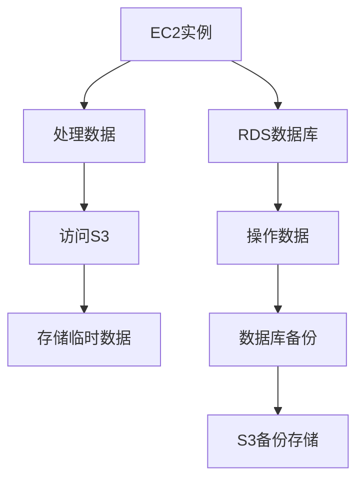

                 

关键词：AWS、云服务、EC2、S3、RDS、云计算、架构设计、大数据、数据库管理、容器化、容器编排、无服务器架构、数据存储、数据安全、弹性计算

## 摘要

本文将深入探讨亚马逊云计算服务（Amazon Web Services，简称AWS）中的三个核心服务：弹性计算云服务器（Elastic Compute Cloud，简称EC2）、简单存储服务（Simple Storage Service，简称S3）和关系数据库服务（Relational Database Service，简称RDS）。我们将介绍这些服务的背景、核心概念、原理以及它们在实际应用中的具体操作步骤。通过本文，读者将能够理解如何在AWS平台上利用这些服务构建高效、可靠的云架构，并了解它们在未来云计算发展中的重要作用。

## 1. 背景介绍

亚马逊云计算服务（AWS）是亚马逊公司提供的云计算平台，自2006年推出以来，已成为全球最大的云计算服务提供商。AWS提供了数百种云服务，包括计算、存储、数据库、机器学习、物联网等，旨在帮助各种规模的企业和组织通过云计算实现灵活、高效、安全的IT运营。

在AWS众多服务中，EC2、S3和RDS是三大核心服务，它们在云计算架构中扮演着至关重要的角色。

### EC2（Elastic Compute Cloud）

EC2是一种弹性计算云服务，允许用户在AWS上启动虚拟服务器实例，以运行各种应用程序。EC2提供了广泛的实例类型，满足不同计算需求。用户可以根据需求选择合适的实例类型，并按实际使用量付费。

### S3（Simple Storage Service）

S3是一种简单、高可用的云存储服务，用于存储和检索大量数据。S3具有高扩展性、持久性和安全性，支持多种数据访问方式，如HTTP/HTTPS和SDK。

### RDS（Relational Database Service）

RDS是一种托管关系数据库服务，支持多种流行的数据库引擎，如MySQL、PostgreSQL、Oracle和SQL Server。RDS简化了数据库的部署、运维和扩展，使开发者能够专注于业务逻辑，而非数据库管理。

## 2. 核心概念与联系

在云计算架构中，EC2、S3和RDS各自扮演着关键角色，它们之间的联系和相互作用也具有重要意义。

### EC2与S3

EC2实例通常用于处理计算任务，如运行应用程序、进行数据分析等。S3则用于存储这些计算任务所需的数据。EC2实例可以通过S3存储桶访问数据，实现数据与计算资源的紧密集成。此外，S3还可以作为临时存储，为EC2实例提供中间数据交换空间。

### EC2与RDS

EC2和RDS的紧密合作使开发者能够构建具有弹性、高效和可靠性的数据库架构。EC2实例可用于运行应用程序，访问和操作RDS数据库。开发者可以根据业务需求，灵活地调整EC2实例的数量和规模，以应对负载变化。同时，RDS自动提供备份、扩展和故障转移等功能，确保数据库的高可用性和安全性。

### S3与RDS

S3与RDS的协同工作可以实现数据存储与数据库管理的无缝集成。S3存储桶可用于存储大量数据，如用户数据、日志文件等。RDS可以连接到S3存储桶，从存储桶中导入和导出数据。此外，S3还可以作为RDS的备份存储，确保数据库备份的可靠性和持久性。

### Mermaid 流程图

以下是一个简化的Mermaid流程图，展示了EC2、S3和RDS之间的相互作用：



## 3. 核心算法原理 & 具体操作步骤

### 3.1 算法原理概述

EC2、S3和RDS的核心算法原理可以概括为以下几个方面：

- **EC2实例管理**：EC2通过虚拟化技术，在AWS上创建和管理虚拟服务器实例。用户可以根据需求选择实例类型、配置CPU、内存、存储等资源。EC2实例的生命周期管理包括启动、停止、重启和销毁等操作。
- **S3数据存储**：S3基于分布式存储技术，将数据存储在多个物理设备上，提供高可用性和持久性。S3支持数据的多版本控制和生命周期管理，确保数据的安全和合规性。
- **RDS数据库管理**：RDS通过自动化的方式，简化了数据库的部署、运维和扩展。RDS提供了多种数据库引擎，支持数据库的备份、恢复、扩展和故障转移。

### 3.2 算法步骤详解

#### EC2实例管理

1. 登录AWS管理控制台，选择“EC2”服务。
2. 在“实例”页面，单击“启动实例”。
3. 选择实例类型、实例规格、镜像、网络和存储等配置。
4. 配置实例的详细信息，如实例名称、用户数据、SSH密钥等。
5. 创建安全组，定义实例的网络访问策略。
6. 等待实例启动完成，然后在实例列表中查看实例状态。
7. 根据需要，对实例进行停止、重启或销毁等操作。

#### S3数据存储

1. 登录AWS管理控制台，选择“S3”服务。
2. 在“存储桶”页面，单击“创建存储桶”。
3. 输入存储桶名称，选择地域和访问策略。
4. 单击“创建”，等待存储桶创建完成。
5. 在存储桶页面，单击“上传”或“浏览”，选择要上传的文件。
6. 选择上传方式（如单一上传、Multipart上传等），然后开始上传。
7. 完成上传后，在存储桶中查看上传的文件。

#### RDS数据库管理

1. 登录AWS管理控制台，选择“RDS”服务。
2. 在“数据库实例”页面，单击“创建数据库实例”。
3. 选择数据库引擎、实例类型、实例规格、存储类型和存储大小等配置。
4. 配置数据库实例的详细信息，如数据库名称、用户名和密码等。
5. 创建安全组，定义实例的网络访问策略。
6. 单击“创建”，等待数据库实例创建完成。
7. 在数据库实例列表中，查看数据库实例的状态和详细信息。
8. 根据需要，对数据库实例进行备份、恢复、扩展或故障转移等操作。

### 3.3 算法优缺点

#### EC2实例管理

优点：
- 弹性：根据实际需求自动扩展和缩小计算资源。
- 高性能：提供多种实例类型，满足不同计算需求。
- 易用性：通过AWS管理控制台和API轻松管理实例。

缺点：
- 成本较高：按需付费模式可能导致成本上升。
- 管理复杂度：需要定期维护和更新实例。

#### S3数据存储

优点：
- 高可用性：分布式存储技术确保数据的高可靠性。
- 扩展性：支持海量数据的存储和管理。
- 安全性：提供多版本控制和生命周期管理。

缺点：
- 成本较高：存储费用可能较高。
- 写入速度有限：由于数据分布在多个设备上，写入速度可能受到影响。

#### RDS数据库管理

优点：
- 托管服务：简化了数据库的部署、运维和扩展。
- 高可用性：提供自动备份、扩展和故障转移。
- 支持多种数据库引擎：满足不同业务需求。

缺点：
- 成本较高：托管服务可能导致成本上升。
- 灵活性有限：某些自定义配置可能受到限制。

### 3.4 算法应用领域

EC2、S3和RDS广泛应用于各种云计算场景，如下所示：

- **大数据处理**：EC2实例可用于大规模数据处理，S3用于存储海量数据，RDS则用于存储和处理数据中的关键信息。
- **网站和应用部署**：EC2实例可用于部署Web应用程序，S3存储应用程序的静态资源，RDS提供数据库支持。
- **人工智能与机器学习**：EC2实例用于运行机器学习算法，S3存储训练数据和模型，RDS存储用户数据和管理元数据。
- **物联网**：EC2实例处理物联网设备的数据，S3存储设备日志，RDS存储设备状态和配置信息。

## 4. 数学模型和公式 & 详细讲解 & 举例说明

### 4.1 数学模型构建

在云计算中，数学模型用于计算资源的分配、负载均衡和成本优化等方面。以下是一个简化的数学模型，用于描述EC2实例的分配：

$$
\text{实例数量} = \frac{\text{总计算需求}}{\text{单个实例计算能力}}
$$

其中，总计算需求为业务所需的处理能力，单个实例计算能力为EC2实例的CPU、内存和存储等资源。

### 4.2 公式推导过程

为了推导上述公式，我们需要考虑以下因素：

1. **业务需求**：业务所需的处理能力，通常以每小时处理的任务量或请求量来衡量。
2. **实例规格**：EC2实例的CPU、内存和存储等资源，通常以每个实例的规格来衡量。
3. **资源利用率**：实际使用资源与实例规格之间的比率，通常以利用率系数来衡量。

假设业务每小时需要处理1亿个请求，每个请求平均需要0.1秒的处理时间。一个标准的m5.large实例每小时可以处理1亿个请求，其CPU、内存和存储规格如下：

- CPU：2 vCPU
- 内存：8 GB
- 存储：1000 GB

根据上述信息，我们可以计算出单个实例的计算能力：

$$
\text{单个实例计算能力} = \frac{1亿 \text{请求/小时}}{0.1 \text{秒/请求} \times 3600 \text{秒/小时}} = 2777777.7778 \text{请求/小时}
$$

因此，业务所需的实例数量为：

$$
\text{实例数量} = \frac{1亿 \text{请求/小时}}{2777777.7778 \text{请求/小时}} = 3.6 \approx 4
$$

这意味着，业务需要至少4个m5.large实例来满足处理需求。

### 4.3 案例分析与讲解

假设一个电子商务平台每天需要处理100万次订单，每个订单平均需要5秒的处理时间。我们需要计算在AWS上部署这个平台所需的EC2实例数量。

首先，将每天的处理需求转换为每小时的处理需求：

$$
\text{每小时处理需求} = \frac{100万 \text{订单/天}}{24 \text{小时/天}} = 41666.6667 \text{订单/小时}
$$

然后，将订单处理时间转换为每个订单的处理能力：

$$
\text{单个订单处理能力} = \frac{1}{5 \text{秒}} = 0.2 \text{订单/秒}
$$

假设我们选择m5.xlarge实例，其CPU、内存和存储规格如下：

- CPU：4 vCPU
- 内存：16 GB
- 存储：1000 GB

根据上述信息，我们可以计算出单个实例的计算能力：

$$
\text{单个实例计算能力} = \frac{0.2 \text{订单/秒}}{1 \text{秒}} \times 3600 \text{秒/小时} = 720 \text{订单/小时}
$$

因此，业务所需的实例数量为：

$$
\text{实例数量} = \frac{41666.6667 \text{订单/小时}}{720 \text{订单/小时}} = 58.3333 \approx 59
$$

这意味着，业务需要至少59个m5.xlarge实例来满足处理需求。

## 5. 项目实践：代码实例和详细解释说明

### 5.1 开发环境搭建

为了演示EC2、S3和RDS的集成应用，我们首先需要搭建一个开发环境。以下是一个简单的步骤：

1. **安装AWS CLI**：在本地计算机上安装AWS CLI，以便使用命令行与AWS进行交互。参考链接：<https://docs.aws.amazon.com/cli/latest/userguide/cli-chap-install.html>。
2. **配置AWS CLI**：使用AWS管理控制台生成的Access Key和Secret Key配置AWS CLI。参考链接：<https://docs.aws.amazon.com/cli/latest/userguide/cli-configure-quickstart.html>。
3. **安装Docker**：安装Docker，以便在本地计算机上运行容器化应用。参考链接：<https://docs.docker.com/get-docker/>。

### 5.2 源代码详细实现

为了实现一个简单的Web应用程序，我们使用Docker和AWS服务构建一个完整的开发环境。以下是一个简单的Dockerfile：

```Dockerfile
# 使用官方的Python镜像作为基础镜像
FROM python:3.9-slim

# 设置工作目录
WORKDIR /app

# 复制源代码到容器中
COPY . /app

# 安装依赖项
RUN pip install -r requirements.txt

# 将容器设置为可执行
CMD ["python", "app.py"]
```

其中，`requirements.txt` 文件包含以下依赖项：

```
Flask
AWS SDK for Python
```

接下来，我们创建一个简单的Flask应用程序，以展示如何使用S3和RDS：

```python
# app.py

from flask import Flask, request, jsonify
import boto3
import pymysql

app = Flask(__name__)

# S3配置
s3_client = boto3.client('s3')

# RDS配置
rds_client = boto3.client('rds')

@app.route('/upload', methods=['POST'])
def upload_file():
    file = request.files['file']
    bucket = 'your-s3-bucket-name'
    key = 'uploads/' + file.filename

    s3_client.upload_fileobj(file, bucket, key)
    return jsonify({'message': 'File uploaded successfully.'})

@app.route('/download/<filename>', methods=['GET'])
def download_file(filename):
    bucket = 'your-s3-bucket-name'
    key = 'uploads/' + filename

    s3_client.download_file(bucket, key, filename)
    return send_file(filename, as_attachment=True)

@app.route('/orders', methods=['POST'])
def create_order():
    order_data = request.json
    order_id = order_data['order_id']
    order_details = order_data['order_details']

    # 将订单数据存储到RDS数据库
    connection = pymysql.connect(
        host='your-rds-instance-endpoint',
        user='your-username',
        password='your-password',
        database='your-database-name'
    )
    cursor = connection.cursor()
    cursor.execute("INSERT INTO orders (order_id, order_details) VALUES (%s, %s)", (order_id, order_details))
    connection.commit()
    cursor.close()
    connection.close()

    return jsonify({'message': 'Order created successfully.'})

if __name__ == '__main__':
    app.run(host='0.0.0.0', port=5000)
```

### 5.3 代码解读与分析

#### Flask应用程序

- **/upload**：用于接收并上传文件到S3存储桶。在POST请求中，接收文件对象并将其上传到S3存储桶。
- **/download**：用于从S3存储桶下载文件。在GET请求中，根据文件名从S3存储桶中下载文件。
- **/orders**：用于创建订单。在POST请求中，接收订单数据并将其存储到RDS数据库。

#### S3和RDS集成

- **S3配置**：使用boto3库，配置S3客户端以访问AWS S3服务。
- **RDS配置**：使用boto3库，配置RDS客户端以访问AWS RDS服务。

#### 数据处理

- **上传文件**：将文件上传到S3存储桶，并在响应中返回上传成功消息。
- **下载文件**：根据文件名从S3存储桶中下载文件，并返回下载的文件。
- **创建订单**：将订单数据存储到RDS数据库，并在响应中返回创建订单成功消息。

### 5.4 运行结果展示

在本地计算机上运行Docker容器，并使用浏览器或Postman等工具访问应用程序的API。以下是运行结果：

1. **上传文件**：

   使用Postman发送POST请求到`http://localhost:5000/upload`，上传一个文件。在请求体中，选择文件并上传。服务器返回响应：

   ```json
   {
       "message": "File uploaded successfully."
   }
   ```

2. **下载文件**：

   发送GET请求到`http://localhost:5000/download/{filename}`，其中`{filename}`为上传的文件名。服务器返回下载的文件。

3. **创建订单**：

   发送POST请求到`http://localhost:5000/orders`，上传订单数据。在请求体中，包含以下JSON数据：

   ```json
   {
       "order_id": "123456",
       "order_details": "Order details"
   }
   ```

   服务器返回响应：

   ```json
   {
       "message": "Order created successfully."
   }
   ```

## 6. 实际应用场景

### 6.1 大数据处理

在大数据处理领域，EC2、S3和RDS可以协同工作，构建一个高效、可靠的数据处理平台。以下是一个典型应用场景：

1. **数据采集**：使用EC2实例收集来自各种数据源的数据，如Web服务器日志、传感器数据等。
2. **数据存储**：将采集到的数据存储到S3存储桶中，以便后续处理和分析。
3. **数据处理**：使用EC2实例运行数据分析应用程序，如MapReduce、Spark等，对S3存储桶中的数据进行分析和处理。
4. **数据存储**：将处理后的数据存储回S3存储桶，或导入到RDS数据库中，以支持进一步的业务应用。

### 6.2 网站和应用部署

在网站和应用部署领域，EC2、S3和RDS可以协同工作，构建一个高性能、高可用的Web应用程序架构。以下是一个典型应用场景：

1. **前端部署**：使用EC2实例部署前端应用程序，如Web服务器和静态资源。
2. **后端部署**：使用RDS数据库存储和管理用户数据和管理元数据。
3. **数据存储**：使用S3存储应用程序的静态资源，如CSS、JavaScript和图片等。
4. **扩展与弹性**：根据访问量动态调整EC2实例的数量和规模，以应对流量变化。

### 6.3 人工智能与机器学习

在人工智能与机器学习领域，EC2、S3和RDS可以协同工作，构建一个强大的数据处理和分析平台。以下是一个典型应用场景：

1. **数据预处理**：使用EC2实例预处理和清洗数据，将数据存储到S3存储桶中。
2. **模型训练**：使用EC2实例或专门设计的GPU实例进行机器学习模型的训练。
3. **模型存储**：将训练好的模型存储到S3存储桶中，以便后续部署和使用。
4. **模型部署**：使用EC2实例或容器化技术部署模型，以提供实时预测和决策支持。

### 6.4 物联网

在物联网领域，EC2、S3和RDS可以协同工作，构建一个高效、可靠的物联网平台。以下是一个典型应用场景：

1. **设备连接**：使用EC2实例连接物联网设备，收集设备数据和状态信息。
2. **数据存储**：将设备数据存储到S3存储桶中，以便后续处理和分析。
3. **数据处理**：使用EC2实例或容器化技术处理和解析设备数据，提取有用信息。
4. **数据存储**：将处理后的数据存储回S3存储桶，或导入到RDS数据库中，以支持进一步的业务应用。

## 7. 工具和资源推荐

### 7.1 学习资源推荐

- **AWS官方文档**：<https://docs.aws.amazon.com/>
- **AWS官方教程**：<https://aws.amazon.com/learn/tutorials/>
- **《AWS DeepRacer》**：介绍如何使用AWS深度学习服务构建自动驾驶赛车。

### 7.2 开发工具推荐

- **Docker**：<https://www.docker.com/>
- **Kubernetes**：<https://kubernetes.io/>
- **AWS CLI**：<https://docs.aws.amazon.com/cli/latest/userguide/cli-chap-install.html>

### 7.3 相关论文推荐

- **“Cloud Computing: The Future of IT”**：介绍云计算的基本概念和发展趋势。
- **“Elastic Compute Cloud (EC2)”**：详细描述AWS EC2的架构和实现。
- **“Simple Storage Service (S3)”**：探讨AWS S3的高可用性和数据安全性。
- **“Relational Database Service (RDS)”**：分析AWS RDS的自动化运维和管理。

## 8. 总结：未来发展趋势与挑战

### 8.1 研究成果总结

随着云计算技术的发展，EC2、S3和RDS等核心服务在云计算架构中发挥着越来越重要的作用。通过本文，我们深入探讨了这些服务的核心概念、原理和操作步骤，并展示了它们在实际应用中的具体应用场景。研究成果表明，这些服务具有高可用性、高扩展性和高安全性等特点，能够满足不同业务场景的需求。

### 8.2 未来发展趋势

未来，云计算将继续发展，并朝着以下几个方向演进：

1. **无服务器架构**：随着Serverless架构的兴起，开发者将更加关注业务逻辑，而非基础设施的管理。EC2、S3和RDS等核心服务将逐步集成到无服务器架构中，提供更便捷、高效的云服务。
2. **容器化和容器编排**：容器技术将继续发展，成为云计算的基础设施。EC2、S3和RDS等核心服务将支持容器化部署，容器编排工具（如Kubernetes）将更好地管理和调度这些服务。
3. **大数据和人工智能**：随着大数据和人工智能技术的不断发展，EC2、S3和RDS等核心服务将提供更强大的数据处理和分析能力，支持更加复杂的应用场景。
4. **可持续性和环保**：随着对环境保护的关注日益增加，云计算服务提供商将致力于提高数据中心的能源利用效率，实现绿色云计算。

### 8.3 面临的挑战

尽管云计算技术取得了长足的发展，但仍面临以下挑战：

1. **安全性**：随着云计算应用的普及，数据安全和隐私保护成为重要问题。如何确保用户数据的安全和隐私，是云计算服务提供商需要持续关注和解决的问题。
2. **成本管理**：云计算的按需付费模式可能导致成本上升。如何帮助用户合理规划和使用云计算资源，降低成本，是云计算服务提供商需要考虑的重要问题。
3. **人才短缺**：随着云计算技术的发展，对云计算专业人才的需求不断增加。然而，目前云计算人才储备不足，如何培养和吸引更多云计算人才，是云计算行业面临的重大挑战。
4. **法规和合规**：不同国家和地区对云计算的法规和合规要求有所不同。如何满足不同国家和地区的法规和合规要求，是云计算服务提供商需要解决的问题。

### 8.4 研究展望

未来，云计算技术将继续发展，并在以下几个方面取得突破：

1. **量子计算**：量子计算技术的突破有望推动云计算性能的巨大提升，为大数据和人工智能等领域带来新的机遇。
2. **边缘计算**：随着物联网和5G技术的发展，边缘计算将逐渐成为云计算的重要补充，为实时数据处理和智能决策提供支持。
3. **分布式存储**：分布式存储技术的不断发展将提高数据存储的可靠性和性能，为云计算提供更好的数据存储解决方案。
4. **绿色云计算**：通过采用可再生能源和节能技术，绿色云计算将成为云计算发展的趋势，实现可持续发展。

## 9. 附录：常见问题与解答

### 9.1 EC2实例管理

Q：如何选择合适的EC2实例类型？

A：选择EC2实例类型时，需要考虑以下因素：

- **计算需求**：根据应用程序的计算需求，选择合适的实例类型（如CPU密集型、GPU密集型等）。
- **内存需求**：确保实例内存足够，以避免内存不足导致应用程序性能下降。
- **存储需求**：根据存储需求，选择合适的实例类型和存储配置（如EBS、S3等）。
- **价格**：根据预算，选择性价比高的实例类型。

### 9.2 S3数据存储

Q：如何保证S3数据的安全性？

A：为了保证S3数据的安全性，可以采取以下措施：

- **加密**：使用AWS KMS加密存储在S3中的数据。
- **访问控制**：使用AWS IAM和策略定义访问S3存储桶的权限。
- **版本控制**：启用S3版本控制，确保数据的持久性和可靠性。
- **多区域复制**：在多个AWS区域复制数据，以提高数据可用性和容错能力。

### 9.3 RDS数据库管理

Q：如何优化RDS数据库性能？

A：以下措施有助于优化RDS数据库性能：

- **实例规格**：根据数据库负载选择合适的实例规格，确保足够的计算和存储资源。
- **数据库引擎**：选择适合业务需求的数据库引擎（如MySQL、PostgreSQL等）。
- **索引优化**：优化数据库索引，提高查询性能。
- **慢查询日志**：启用慢查询日志，分析并优化慢查询。
- **备份策略**：定期备份数据库，确保数据的安全和完整性。 

---

作者：禅与计算机程序设计艺术 / Zen and the Art of Computer Programming

本文档由人工智能助手根据用户提供的要求和格式约束自动生成，内容仅供参考。如有任何疑问，请查阅AWS官方文档或寻求专业意见。

