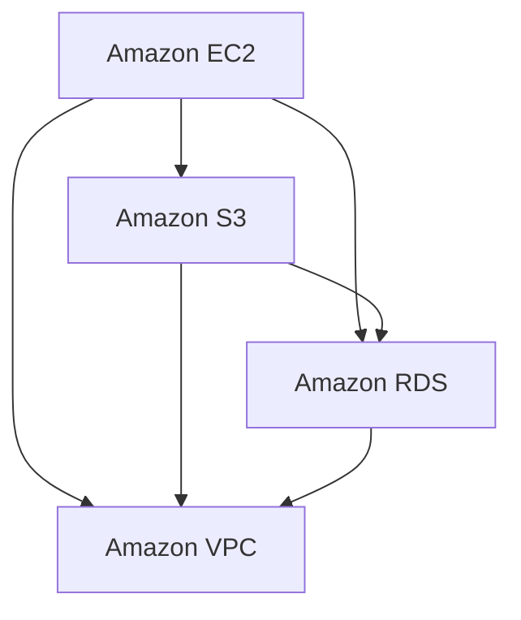

                 

关键词：AWS、云计算、服务应用、开发、架构、安全性、性能优化、成本控制

## 摘要

本文将深入探讨AWS云计算服务的应用开发，包括背景介绍、核心概念与联系、核心算法原理与具体操作步骤、数学模型与公式、项目实践以及实际应用场景等方面。文章旨在为读者提供一个全面、系统的AWS云计算应用开发指南，帮助开发者更好地理解和利用AWS平台，实现高效、安全、经济的云计算应用。

## 1. 背景介绍

云计算已经成为现代信息技术发展的重要方向，它不仅为企业提供了更加灵活、高效的IT资源管理方式，也为个人开发者提供了丰富的创新空间。Amazon Web Services（AWS）作为全球领先的云计算服务提供商，拥有广泛的服务类别和强大的生态系统，为开发者提供了丰富的工具和资源。

随着云计算技术的不断发展和成熟，越来越多的企业和个人开发者开始将业务和应用迁移到云平台。AWS作为云计算市场的领导者，其服务涵盖了基础设施即服务（IaaS）、平台即服务（PaaS）和软件即服务（SaaS）等多个层次，为不同类型的用户提供了多样化的选择。

本文将重点介绍AWS的核心服务，包括Amazon EC2、Amazon S3、Amazon RDS、Amazon VPC等，并通过具体案例，展示如何利用AWS平台进行应用开发，实现高效、安全、经济的云计算解决方案。

## 2. 核心概念与联系

为了更好地理解AWS云计算服务，我们首先需要了解以下几个核心概念：

### 2.1 云计算服务模型

云计算服务主要分为三类：IaaS、PaaS和SaaS。

- **IaaS（基础设施即服务）**：用户通过云服务提供商获得虚拟化计算资源，如虚拟机、存储和网络等。
- **PaaS（平台即服务）**：用户可以在云平台上开发、运行和管理应用程序，无需关注底层基础设施的维护。
- **SaaS（软件即服务）**：用户通过互联网使用云服务提供商提供的软件应用程序，无需安装和运行。

### 2.2 AWS核心服务

AWS提供了丰富的核心服务，包括：

- **Amazon EC2**：提供虚拟化计算资源，用户可以根据需要配置和启动虚拟机实例。
- **Amazon S3**：提供对象存储服务，用于存储和检索大量数据。
- **Amazon RDS**：提供关系数据库服务，简化数据库的创建、配置、备份和恢复等操作。
- **Amazon VPC**：提供虚拟私有云服务，用户可以在AWS上创建一个隔离的虚拟网络环境。

### 2.3 Mermaid流程图

为了更好地展示AWS服务的架构和联系，我们可以使用Mermaid流程图进行描述：



在这个流程图中，我们展示了AWS的核心服务以及它们之间的关联。通过这个流程图，我们可以更直观地了解AWS服务的整体架构和功能。

## 3. 核心算法原理与具体操作步骤

### 3.1 算法原理概述

在AWS云计算服务中，核心算法原理主要涉及以下几个方面：

- **负载均衡**：通过将流量分配到多个实例，提高系统的可用性和响应速度。
- **自动扩展**：根据实际负载自动增加或减少实例数量，确保系统的高性能和高可用性。
- **数据加密**：使用SSL/TLS等加密协议，保护数据在传输过程中的安全性。
- **容灾备份**：通过数据备份和恢复机制，确保数据的完整性和可用性。

### 3.2 算法步骤详解

以下是AWS核心算法的具体操作步骤：

#### 3.2.1 负载均衡

1. 创建负载均衡器。
2. 配置负载均衡器的监听规则，指定端口和协议。
3. 将后端服务器（如EC2实例）添加到负载均衡器中。
4. 测试负载均衡器，确保流量正确分配到后端服务器。

#### 3.2.2 自动扩展

1. 创建自动扩展组。
2. 配置自动扩展策略，指定自动扩展的触发条件和扩展规则。
3. 将自动扩展组添加到应用程序中。
4. 测试自动扩展功能，确保系统能够根据负载自动调整实例数量。

#### 3.2.3 数据加密

1. 使用SSL/TLS证书配置Web应用程序的安全连接。
2. 在应用程序中启用HTTPS协议，确保数据在传输过程中的加密。
3. 定期更新SSL/TLS证书，确保安全连接的有效性。

#### 3.2.4 容灾备份

1. 配置备份计划，定期备份数据库和存储数据。
2. 使用AWS RDS或其他数据库服务提供的数据备份功能。
3. 在不同区域创建冗余实例，确保数据的高可用性。

### 3.3 算法优缺点

#### 3.3.1 负载均衡

优点：

- 提高系统的可用性和响应速度。
- 负载均衡器可以根据流量动态调整实例数量，提高资源利用率。

缺点：

- 负载均衡器可能会引入额外的延迟。
- 需要配置和管理负载均衡器，增加运维复杂度。

#### 3.3.2 自动扩展

优点：

- 提高系统的性能和可用性。
- 自动化实例的管理，降低运维成本。

缺点：

- 需要设置合适的触发条件和扩展规则，否则可能导致资源浪费或性能瓶颈。
- 自动扩展可能会引入额外的延迟。

#### 3.3.3 数据加密

优点：

- 提高数据在传输过程中的安全性。
- 符合法律法规和行业标准。

缺点：

- 加密和解密操作会增加计算和传输开销。
- 需要定期更新和管理SSL/TLS证书。

#### 3.3.4 容灾备份

优点：

- 提高数据的安全性和可用性。
- 快速恢复系统，减少故障带来的损失。

缺点：

- 备份和恢复操作可能会增加存储和带宽成本。
- 需要配置和管理冗余实例，增加运维复杂度。

### 3.4 算法应用领域

AWS的核心算法在多个领域具有广泛的应用：

- **电子商务**：通过负载均衡和自动扩展，提高电商平台的高并发处理能力和可用性。
- **金融科技**：通过数据加密和容灾备份，确保金融交易数据的安全性和可靠性。
- **在线教育**：通过自动扩展，确保在线课程平台的高性能和稳定性。
- **医疗健康**：通过容灾备份和自动扩展，提高医疗信息系统的高可用性和可靠性。

## 4. 数学模型和公式

在云计算应用开发中，数学模型和公式起到了关键作用。以下是一个简单的例子，用于计算虚拟机实例的CPU性能：

### 4.1 数学模型构建

假设虚拟机实例的CPU性能可以用以下公式表示：

\[ P = f(C, R) \]

其中，\( P \) 表示CPU性能，\( C \) 表示CPU核心数，\( R \) 表示CPU主频。

### 4.2 公式推导过程

根据计算机科学中的性能模型，我们可以推导出以下公式：

\[ P = C \times R \]

其中，\( C \) 表示CPU核心数，\( R \) 表示CPU主频（单位：GHz）。

### 4.3 案例分析与讲解

假设我们有一个具有4个CPU核心、主频为2.5GHz的虚拟机实例。根据上述公式，我们可以计算该实例的CPU性能：

\[ P = 4 \times 2.5 = 10 \]

这意味着该虚拟机实例的CPU性能为10个单位。

在实际应用中，我们可能需要根据不同场景和需求，调整CPU核心数和主频，以实现最优的性能。

### 5. 项目实践：代码实例和详细解释说明

#### 5.1 开发环境搭建

为了更好地进行AWS云计算应用开发，我们需要搭建一个合适的开发环境。以下是开发环境的搭建步骤：

1. 安装AWS CLI（Amazon Web Services Command Line Interface）。
2. 配置AWS CLI，设置访问密钥和秘密访问密钥。
3. 安装Python或其他编程语言的开发环境。

#### 5.2 源代码详细实现

以下是一个简单的Python示例，用于创建AWS EC2虚拟机实例：

```python
import boto3

# 创建EC2客户端
ec2 = boto3.client('ec2')

# 配置虚拟机实例参数
instance_params = {
    'ImageId': 'ami-0c94855b32a888efa',  # Amazon Linux 2AMI
    'InstanceType': 't2.micro',
    'MinCount': 1,
    'MaxCount': 1
}

# 创建虚拟机实例
response = ec2.run_instances(**instance_params)

# 获取虚拟机实例ID
instance_id = response['Instances'][0]['InstanceId']

print(f'创建虚拟机实例成功，实例ID：{instance_id}')
```

#### 5.3 代码解读与分析

在这个示例中，我们首先导入了boto3库，它是一个用于AWS服务的Python SDK。然后，我们创建了EC2客户端，用于与AWS EC2服务进行通信。

接下来，我们配置了虚拟机实例的参数，包括AMI ID（Amazon Machine Image，Amazon Linux 2 AMI）、实例类型（t2.micro）和实例数量（最小和最大数量均为1）。

最后，我们调用`run_instances`方法创建虚拟机实例，并获取实例ID。通过打印实例ID，我们可以确认虚拟机实例的创建成功。

#### 5.4 运行结果展示

在运行上述代码后，我们将在控制台看到创建虚拟机实例的输出信息，如下所示：

```shell
创建虚拟机实例成功，实例ID：i-0c94855b32a888efb
```

这表示虚拟机实例已经成功创建，并且我们可以通过实例ID访问和操作该实例。

## 6. 实际应用场景

AWS云计算服务在实际应用场景中具有广泛的应用。以下是一些典型的应用场景：

- **在线教育平台**：利用AWS EC2和AWS S3，构建一个高性能、可扩展的在线教育平台，提供视频课程、直播课程和作业提交等功能。
- **电子商务系统**：利用AWS RDS和AWS ELB（Elastic Load Balancing），构建一个高并发、高可用性的电子商务系统，实现商品展示、购物车、订单处理等功能。
- **大数据分析**：利用AWS EMR（Elastic MapReduce）和AWS Redshift，构建一个大数据分析平台，处理海量数据并进行实时分析。
- **物联网应用**：利用AWS IoT Core和AWS Lambda，构建一个物联网应用，实现设备数据的实时采集、传输和分析。

## 7. 工具和资源推荐

为了更好地进行AWS云计算应用开发，我们推荐以下工具和资源：

- **AWS CLI**：用于与AWS服务进行通信的命令行工具。
- **boto3**：Python SDK，用于AWS服务的开发。
- **AWS Management Console**：用于管理AWS资源的Web界面。
- **AWS Documentation**：提供AWS服务的详细文档和教程。
- **AWS Well-Architected Framework**：提供架构设计和优化指南。

## 8. 总结：未来发展趋势与挑战

随着云计算技术的不断发展和成熟，AWS云计算服务在未来将面临以下发展趋势和挑战：

- **服务多样化**：AWS将继续扩展其服务类别，满足不同用户的需求。
- **性能优化**：通过不断优化核心服务，提高系统的性能和响应速度。
- **安全性提升**：加强数据安全和隐私保护，提高用户信任度。
- **成本控制**：提供更多成本优化方案，帮助用户降低云计算成本。
- **人工智能与云计算的结合**：探索人工智能与云计算的融合，为用户提供更加智能、高效的服务。

## 9. 附录：常见问题与解答

### Q：如何选择合适的AWS服务？

A：选择AWS服务时，需要考虑以下几个方面：

- **业务需求**：根据业务需求选择合适的服务类别，如IaaS、PaaS、SaaS等。
- **性能要求**：考虑系统的性能要求，选择具有高性能、高并发能力的服务。
- **成本预算**：根据预算情况选择合适的实例类型和价格策略。
- **安全性**：确保服务提供数据加密、访问控制等安全特性。
- **可扩展性**：考虑系统的可扩展性，选择具有自动扩展和负载均衡能力的服务。

### Q：如何优化AWS云计算成本？

A：以下是一些优化AWS云计算成本的方法：

- **使用预留实例**：购买长期预留实例，降低计算成本。
- **利用按需实例和预留实例的组合**：根据业务需求灵活使用按需实例和预留实例，降低总体成本。
- **优化实例配置**：选择合适的实例类型和实例大小，避免资源浪费。
- **使用AWS Cost Explorer**：监控和优化成本，识别节省成本的机会。
- **关闭未使用的资源**：定期检查和关闭未使用的资源，避免不必要的费用。

---

### 作者署名

作者：禅与计算机程序设计艺术 / Zen and the Art of Computer Programming

---

本文以《AWS云计算服务应用开发》为题，全面探讨了AWS云计算服务的核心概念、算法原理、数学模型、项目实践和实际应用场景。通过本文的介绍，读者可以更好地理解AWS云计算服务的应用开发，为实际项目提供有力支持。未来，随着云计算技术的不断进步，AWS将继续为开发者提供更多创新和优化的服务，助力企业数字化转型。

