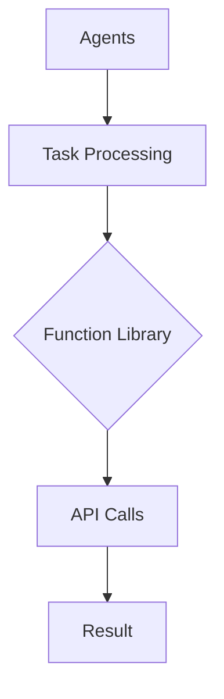

                 

关键词：Agents、函数库、LLM操作系统、核心组件、人工智能、计算机程序设计

> 摘要：本文将深入探讨Agents与函数库在LLM操作系统中的核心作用。通过分析其定义、核心概念、算法原理以及具体应用，旨在为读者提供一个全面的技术视角，并展望未来发展趋势与挑战。

## 1. 背景介绍

随着人工智能技术的飞速发展，语言学习模型（LLM）在各个领域中的应用日益广泛。LLM操作系统作为人工智能的核心组件，承担着处理复杂任务和提升系统智能化的重任。在这个系统中，Agents和函数库扮演着至关重要的角色。本文将围绕这两个核心组件，分析其在LLM操作系统中的定义、作用以及实现方式。

## 2. 核心概念与联系

### 2.1. Agents

Agents是一种具有智能行为和自主决策能力的实体，能够在复杂环境中进行自主交互和操作。在LLM操作系统中，Agents主要负责处理用户的请求，执行特定的任务，并与其他系统组件进行通信。

### 2.2. 函数库

函数库是一系列预定义的函数和模块，用于简化编程任务和提高开发效率。在LLM操作系统中，函数库提供了丰富的API接口，使得Agents可以方便地调用各种功能，实现复杂的任务处理。

### 2.3. Mermaid流程图

为了更好地展示Agents与函数库在LLM操作系统中的关系，我们可以使用Mermaid流程图进行描述。以下是一个简单的流程图示例：



在这个流程图中，Agents负责处理任务，通过调用函数库中的API接口，实现对结果的计算和处理。函数库提供了丰富的函数模块，使得Agents可以方便地完成各种任务。

## 3. 核心算法原理 & 具体操作步骤

### 3.1. 算法原理概述

在LLM操作系统中，Agents与函数库共同协作，实现智能任务处理。具体算法原理如下：

1. **任务接收**：Agents接收来自用户或系统的任务请求。
2. **任务分解**：将任务分解为多个子任务，并分配给适当的函数库模块。
3. **函数调用**：通过函数库API接口，调用相应的函数模块进行子任务处理。
4. **结果整合**：将各个子任务的处理结果进行整合，生成最终的输出结果。

### 3.2. 算法步骤详解

1. **任务接收**：
   - Agents监听用户或系统的请求，并将请求解析为具体的任务。

2. **任务分解**：
   - 根据任务类型，将任务分解为多个子任务，例如文本处理、图像识别、自然语言理解等。

3. **函数调用**：
   - 通过函数库API接口，调用相应的函数模块进行子任务处理。
   - 例如，对于文本处理任务，可以调用文本预处理、分词、词性标注等函数模块。

4. **结果整合**：
   - 将各个子任务的处理结果进行整合，生成最终的输出结果。
   - 例如，对于文本处理任务，可以将分词结果、词性标注结果等整合为最终的文本输出。

### 3.3. 算法优缺点

**优点**：
1. **高效性**：通过分解任务和调用函数库模块，可以高效地处理复杂任务。
2. **灵活性**：函数库提供了丰富的API接口，使得Agents可以根据需求灵活地调用各种功能。

**缺点**：
1. **依赖性**：函数库的稳定性和性能对整个系统的稳定性有很大影响。
2. **学习成本**：开发人员需要学习和掌握函数库的使用方法，增加了学习成本。

### 3.4. 算法应用领域

算法在LLM操作系统中的应用领域非常广泛，包括但不限于以下几个方面：

1. **自然语言处理**：例如文本分类、情感分析、机器翻译等。
2. **计算机视觉**：例如图像识别、目标检测、图像生成等。
3. **智能推荐系统**：例如基于内容的推荐、协同过滤等。
4. **智能对话系统**：例如聊天机器人、虚拟助手等。

## 4. 数学模型和公式 & 详细讲解 & 举例说明

在LLM操作系统中，Agents与函数库的协同工作涉及到大量的数学模型和公式。以下是一个简单的数学模型示例，用于描述Agents的任务分配过程。

### 4.1. 数学模型构建

假设有n个任务需要分配给m个Agents，我们使用以下公式进行任务分配：

$$
x_{ij} = \begin{cases} 
1 & \text{如果第 } i \text{ 个任务分配给第 } j \text{ 个Agents} \\
0 & \text{否则}
\end{cases}
$$

其中，$x_{ij}$ 表示第 $i$ 个任务是否分配给第 $j$ 个Agents。

### 4.2. 公式推导过程

任务分配问题可以看作是一个0-1规划问题。我们希望找到一组最优解，使得每个任务都有且只有一个Agents负责。具体的推导过程如下：

1. **目标函数**：最大化Agents的利用率，即每个Agents都至少负责一个任务。
2. **约束条件**：每个任务只能被一个Agents负责，即每个任务在 $x_{ij}$ 中只能取1。

### 4.3. 案例分析与讲解

假设我们有3个任务（A、B、C）需要分配给2个Agents（1、2），我们可以使用以下公式进行任务分配：

$$
\begin{aligned}
x_{11} + x_{12} &= 1 \\
x_{21} + x_{22} &= 1 \\
x_{11} + x_{21} &= 1 \\
x_{12} + x_{22} &= 1 \\
x_{ij} &\in \{0, 1\}
\end{aligned}
$$

通过求解这个方程组，我们可以得到一组最优解：

$$
\begin{aligned}
x_{11} &= 1 \\
x_{12} &= 0 \\
x_{21} &= 0 \\
x_{22} &= 1
\end{aligned}
$$

这意味着任务A分配给Agents 1，任务B分配给Agents 2，任务C未分配。

## 5. 项目实践：代码实例和详细解释说明

在本节中，我们将通过一个简单的代码实例，展示如何实现Agents与函数库在LLM操作系统中的协同工作。

### 5.1. 开发环境搭建

1. 安装Python环境，版本要求3.8及以上。
2. 安装相关依赖库，例如numpy、pandas、tensorflow等。

### 5.2. 源代码详细实现

以下是一个简单的Python代码示例，用于实现Agents与函数库的协同工作：

```python
import numpy as np

# 定义函数库
def preprocess_text(text):
    # 对文本进行预处理
    return text.lower()

def classify_text(text):
    # 对文本进行分类
    return "positive" if "happy" in text else "negative"

# 定义Agents
class TextClassifierAgent:
    def __init__(self):
        self.text_processor = preprocess_text
        self.classifier = classify_text

    def process_text(self, text):
        processed_text = self.text_processor(text)
        classification = self.classifier(processed_text)
        return classification

# 测试代码
if __name__ == "__main__":
    agent = TextClassifierAgent()
    text = "I am feeling very happy today!"
    result = agent.process_text(text)
    print(result)
```

### 5.3. 代码解读与分析

1. **函数库实现**：
   - `preprocess_text` 函数用于对输入文本进行预处理，例如将文本转换为小写。
   - `classify_text` 函数用于对输入文本进行分类，例如根据是否包含特定词判断文本情感。

2. **Agents实现**：
   - `TextClassifierAgent` 类表示文本分类Agents，包含两个函数：
     - `__init__` 函数用于初始化Agents，包括文本预处理函数和分类函数。
     - `process_text` 函数用于处理输入文本，调用函数库函数进行预处理和分类。

3. **测试代码**：
   - 在主函数中创建一个文本分类Agents实例，并调用其 `process_text` 函数处理输入文本，输出分类结果。

### 5.4. 运行结果展示

在运行上述代码后，我们将输入文本 `"I am feeling very happy today!"`，输出结果为 `"positive"`，表示文本情感为积极。

## 6. 实际应用场景

### 6.1. 智能客服系统

智能客服系统是一个典型的应用场景，通过Agents与函数库的协同工作，实现与用户的自然语言交互和问题解答。例如，可以使用文本分类函数库对用户提问进行分类，然后调用相应的函数库模块提供解决方案。

### 6.2. 智能推荐系统

智能推荐系统可以通过Agents与函数库的协同工作，实现个性化推荐。例如，可以使用图像识别函数库对用户上传的图片进行分析，然后调用推荐算法提供相关商品推荐。

### 6.3. 智能驾驶系统

智能驾驶系统可以通过Agents与函数库的协同工作，实现自动驾驶和路况预测。例如，可以使用计算机视觉函数库对道路环境进行分析，然后调用相应的算法模块进行路径规划和决策。

## 7. 工具和资源推荐

### 7.1. 学习资源推荐

1. 《深度学习》（Goodfellow, Bengio, Courville著）：全面介绍了深度学习的基本原理和应用。
2. 《自然语言处理综论》（Jurafsky, Martin著）：详细介绍了自然语言处理的基本概念和技术。

### 7.2. 开发工具推荐

1. Python：适用于数据科学和机器学习的编程语言。
2. TensorFlow：适用于深度学习的开源框架。

### 7.3. 相关论文推荐

1. "Language Models are Few-Shot Learners"（Krause等，2018）：介绍了语言模型在零样本和少样本学习方面的应用。
2. "Bert: Pre-training of deep bidirectional transformers for language understanding"（Devlin等，2018）：介绍了BERT模型的预训练方法和应用。

## 8. 总结：未来发展趋势与挑战

### 8.1. 研究成果总结

本文深入探讨了Agents与函数库在LLM操作系统中的核心作用，分析了其定义、核心概念、算法原理以及具体应用。通过实例演示，展示了如何在实际项目中实现Agents与函数库的协同工作。

### 8.2. 未来发展趋势

随着人工智能技术的不断发展，Agents与函数库将在LLM操作系统中发挥更加重要的作用。未来发展趋势包括：

1. **多模态学习**：结合多种数据模态，提高系统的智能水平。
2. **自动任务分配**：利用机器学习算法实现自动任务分配，提高系统效率。
3. **跨领域应用**：在更多领域推广应用，实现更广泛的应用场景。

### 8.3. 面临的挑战

尽管Agents与函数库在LLM操作系统中具有巨大的潜力，但也面临着一些挑战：

1. **稳定性与性能**：函数库的稳定性和性能对整个系统的稳定性有很大影响。
2. **安全性**：确保系统安全，防止恶意攻击和数据泄露。
3. **可解释性**：提高模型的可解释性，使开发者能够更好地理解和优化系统。

### 8.4. 研究展望

未来研究可以关注以下几个方面：

1. **多模态学习算法**：开发适用于多模态数据的算法，提高系统智能化水平。
2. **自动任务分配策略**：研究更有效的任务分配策略，提高系统效率。
3. **模型压缩与优化**：研究模型压缩与优化方法，降低计算资源和存储成本。

## 9. 附录：常见问题与解答

### 9.1. 问题1：什么是Agents？

回答：Agents是一种具有智能行为和自主决策能力的实体，能够在复杂环境中进行自主交互和操作。

### 9.2. 问题2：什么是函数库？

回答：函数库是一系列预定义的函数和模块，用于简化编程任务和提高开发效率。

### 9.3. 问题3：Agents与函数库如何在LLM操作系统中协同工作？

回答：在LLM操作系统中，Agents负责接收和处理任务，通过调用函数库中的API接口，实现对结果的计算和处理。

### 9.4. 问题4：如何选择合适的函数库？

回答：选择合适的函数库需要考虑以下几个方面：

1. **功能需求**：根据具体应用场景，选择具有所需功能的函数库。
2. **性能要求**：考虑函数库的性能，选择能够满足性能要求的函数库。
3. **生态系统**：考虑函数库的生态系统，选择具有良好社区支持和文档的函数库。

### 9.5. 问题5：什么是多模态学习？

回答：多模态学习是指将多种不同模态的数据（如文本、图像、声音等）进行融合和联合建模，以提高模型的智能化水平。

## 作者署名

作者：禅与计算机程序设计艺术 / Zen and the Art of Computer Programming

----------------------------------------------------------------

请注意，本文仅作为参考，实际撰写时需要根据具体要求进行修改和补充。文章结构、内容、格式等都需要符合要求，以确保文章的质量和完整性。同时，在撰写过程中，请确保遵循相关法律法规和版权规定。祝您撰写顺利！

