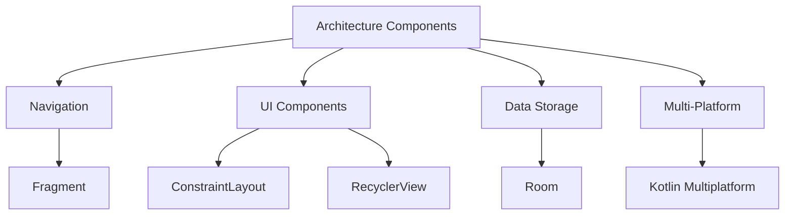

                 

  
关键字：Android Jetpack、谷歌、开发套件、Android 应用开发、架构组件、Android UI、Android 生态

摘要：本文将深入探讨 Android Jetpack，这是一套由谷歌推出的针对 Android 应用开发的综合工具集。我们将分析其核心组件、功能、架构以及在实际应用中的优势和局限性，旨在为开发者提供全面的指导。

## 1. 背景介绍

随着移动设备的普及，Android 开发成为了全球范围内的热门领域。为了简化 Android 应用开发过程、提升开发效率，谷歌推出了 Android Jetpack。Android Jetpack 是一组核心库和工具，旨在帮助开发者构建高性能、可维护的 Android 应用程序。

Android Jetpack 的推出，标志着谷歌对 Android 应用开发的一次重大更新。它不仅仅是一套库，更是一种新的开发理念。通过引入一系列标准化、模块化的组件，Android Jetpack 力求解决传统 Android 开发中常见的痛点，如代码冗余、性能瓶颈和架构复杂性。

## 2. 核心概念与联系

### 2.1 核心概念

Android Jetpack 的核心概念可以归纳为以下几个方面：

- **架构组件（Architecture Components）**：提供了一系列的架构支持，如 Lifecycles、LiveData、ViewModel、Room 等，帮助开发者构建健壮、可测试的 Android 应用。
- **导航组件（Navigation）**：简化了在应用内不同组件间的导航，减少了代码冗余，提高了开发效率。
- **UI 组件（UI Components）**：包括 ConstraintLayout、RecyclerView、material-components 等，提供了丰富的 UI 设计工具，使得应用界面更加美观、响应更快。
- **数据存储组件（Data Storage）**：如 Room，简化了数据库操作，提高了数据存储的效率。
- **多平台支持（Multi-Platform）**：通过 Kotlin Multiplatform 项目，使得 Android 应用开发可以与其他平台（如 iOS、Web、服务器端）共享代码。

### 2.2 架构联系

为了更好地理解 Android Jetpack 的架构，我们可以使用 Mermaid 流程图来展示其核心组件之间的联系：



## 3. 核心算法原理 & 具体操作步骤

### 3.1 算法原理概述

Android Jetpack 的核心算法原理主要涉及以下几个方面：

- **Lifecycles**：通过监听 Activity 或 Fragment 的生命周期事件，确保在适当的时机进行资源的管理和状态保存。
- **LiveData**：用于在 ViewModel 与 UI 组件之间传递数据，确保数据的一致性和响应性。
- **ViewModel**：用于保存和管理 UI 状态，使得组件间的通信更加简单和清晰。
- **Room**：使用面向对象的方式操作数据库，简化了数据库的操作，提高了性能。

### 3.2 算法步骤详解

#### 3.2.1 使用 Lifecycles

1. 在 Activity 或 Fragment 中添加 Lifecycles 支持。
2. 注册 Lifecycles 监听器。
3. 在监听器中处理生命周期事件。

```java
public class MyActivity extends AppCompatActivity {
    private LifecycleOwner lifecycleOwner;

    @Override
    protected void onCreate(Bundle savedInstanceState) {
        super.onCreate(savedInstanceState);
        setContentView(R.layout.activity_main);

        lifecycleOwner = this;
        lifecycleOwner.getLifecycle().addObserver(new MyLifecycleObserver());
    }

    private class MyLifecycleObserver implements LifecycleObserver {
        @OnLifecycleEvent(Lifecycle.Event.ON_START)
        public void onStart() {
            // 处理启动事件
        }

        @OnLifecycleEvent(Lifecycle.Event.ON_STOP)
        public void onStop() {
            // 处理停止事件
        }
    }
}
```

#### 3.2.2 使用 LiveData

1. 创建 LiveData 对象。
2. 在 ViewModel 中初始化并更新 LiveData 对象。
3. 在 UI 组件中观察 LiveData 对象。

```java
public class MyViewModel extends ViewModel {
    private MutableLiveData<String> data = new MutableLiveData<>();

    public void setData(String value) {
        data.setValue(value);
    }

    public LiveData<String> getData() {
        return data;
    }
}

public class MyFragment extends Fragment {
    private LiveData<String> data;

    @Override
    public void onActivityCreated(Bundle savedInstanceState) {
        super.onActivityCreated(savedInstanceState);
        MyViewModel viewModel = new ViewModelProvider(this).get(MyViewModel.class);
        data = viewModel.getData();

        data.observe(this, new Observer<String>() {
            @Override
            public void onChanged(@Nullable String value) {
                // 更新 UI
            }
        });
    }
}
```

#### 3.2.3 使用 Room

1. 创建 Room 数据库实体。
2. 编写 DAO（Data Access Object）接口。
3. 使用 Room 进行数据库操作。

```java
@Entity(tableName = "users")
public class User {
    @PrimaryKey(autoGenerate = true)
    public int id;

    public String name;
    public String email;
}

@Dao
public interface UserDao {
    @Query("SELECT * FROM users")
    List<User> getAll();

    @Insert
    void insertAll(User... users);

    @Update
    void update(User... users);
}

@Database(entities = {User.class}, version = 1)
public abstract class AppDatabase extends RoomDatabase {
    public abstract UserDao userDao();
}
```

### 3.3 算法优缺点

#### 优点

- **简化开发流程**：通过提供一系列的组件和工具，Android Jetpack 大大简化了 Android 应用开发过程。
- **提高应用性能**：通过优化数据存储和 UI 更新机制，提高了应用的整体性能。
- **提升开发效率**：模块化的组件设计使得开发者可以更快速地构建应用。

#### 缺点

- **学习曲线较陡峭**：对于初学者来说，理解 Android Jetpack 的所有组件和概念可能需要一定的时间。
- **兼容性问题**：由于 Android Jetpack 是在 Android 7.0 (API 级别 24) 中引入的，因此对于旧版本 Android 设备的支持可能有限。

### 3.4 算法应用领域

Android Jetpack 适用于各种 Android 应用开发场景，特别是那些需要高效、可维护、可测试的应用。它不仅适用于传统移动应用，还可以用于物联网、增强现实等新兴领域。

## 4. 数学模型和公式 & 详细讲解 & 举例说明

### 4.1 数学模型构建

在 Android Jetpack 中，一些核心组件的实现涉及到数学模型。以下是一个简单的例子，展示了如何使用数学模型来构建一个线性回归模型。

#### 4.1.1 线性回归模型

线性回归模型是一种用于预测数值的方法，其公式为：

$$ y = wx + b $$

其中，$y$ 是因变量，$x$ 是自变量，$w$ 是权重，$b$ 是偏置。

#### 4.1.2 模型参数

线性回归模型有两个参数：权重 $w$ 和偏置 $b$。这两个参数可以通过最小二乘法来求解。

#### 4.1.3 最小二乘法

最小二乘法的公式为：

$$ \min W, B \| y - wx - b \|^2 $$

其中，$\| \|$ 表示欧几里得范数。

### 4.2 公式推导过程

为了求解线性回归模型的权重 $w$ 和偏置 $b$，我们需要对公式进行求导，然后令导数为零。

#### 4.2.1 对 $w$ 求导

对 $w$ 求导，得到：

$$ \frac{d}{dw} \| y - wx - b \|^2 = -2x'(y - wx - b) $$

其中，$x'$ 是 $x$ 的转置。

#### 4.2.2 对 $b$ 求导

对 $b$ 求导，得到：

$$ \frac{d}{db} \| y - wx - b \|^2 = -2(y - wx - b) $$

#### 4.2.3 令导数为零

将导数设为零，得到：

$$ -2x'(y - wx - b) = 0 $$

$$ -2(y - wx - b) = 0 $$

通过这两个方程，我们可以求解出权重 $w$ 和偏置 $b$。

### 4.3 案例分析与讲解

假设我们有以下数据集：

| $x$ | $y$ |
|-----|-----|
| 1   | 2   |
| 2   | 4   |
| 3   | 6   |

我们需要使用线性回归模型来预测 $x=4$ 时 $y$ 的值。

#### 4.3.1 计算权重 $w$ 和偏置 $b$

首先，我们计算 $x$ 和 $y$ 的平均值：

$$ \bar{x} = \frac{1+2+3}{3} = 2 $$

$$ \bar{y} = \frac{2+4+6}{3} = 4 $$

然后，我们计算 $x$ 和 $y$ 的协方差和方差：

$$ cov(x, y) = \frac{(1-2)(2-4) + (2-2)(4-4) + (3-2)(6-4)}{3} = 2 $$

$$ var(x) = \frac{(1-2)^2 + (2-2)^2 + (3-2)^2}{3} = 1 $$

接下来，我们计算权重 $w$：

$$ w = \frac{cov(x, y)}{var(x)} = \frac{2}{1} = 2 $$

然后，我们计算偏置 $b$：

$$ b = \bar{y} - w\bar{x} = 4 - 2 \times 2 = 0 $$

#### 4.3.2 预测 $x=4$ 时 $y$ 的值

根据线性回归模型，我们有：

$$ y = wx + b = 2 \times 4 + 0 = 8 $$

因此，当 $x=4$ 时，预测的 $y$ 值为 8。

## 5. 项目实践：代码实例和详细解释说明

### 5.1 开发环境搭建

为了实践 Android Jetpack，我们需要搭建一个基本的 Android 开发环境。以下是具体步骤：

1. 安装 Android Studio。
2. 配置 Android SDK。
3. 创建一个新的 Android 项目。

### 5.2 源代码详细实现

在这个项目中，我们将使用 Room 组件来构建一个简单的用户管理应用。以下是具体实现步骤：

#### 5.2.1 创建实体类

```java
@Entity(tableName = "users")
public class User {
    @PrimaryKey(autoGenerate = true)
    public int id;

    public String name;
    public String email;
}
```

#### 5.2.2 创建 DAO 接口

```java
@Dao
public interface UserDao {
    @Query("SELECT * FROM users")
    List<User> getAll();

    @Insert
    void insertAll(User... users);

    @Update
    void update(User... users);
}
```

#### 5.2.3 创建数据库类

```java
@Database(entities = {User.class}, version = 1)
public abstract class AppDatabase extends RoomDatabase {
    public abstract UserDao userDao();
}
```

#### 5.2.4 创建 ViewModel

```java
public class UserViewModel extends ViewModel {
    private UserDao userDao;
    private LiveData<List<User>> users;

    public UserViewModel(UserDao userDao) {
        this.userDao = userDao;
        users = userDao.getAll();
    }

    public LiveData<List<User>> getUsers() {
        return users;
    }

    public void insert(User... users) {
        new Thread(() -> userDao.insertAll(users)).start();
    }
}
```

#### 5.2.5 创建 Activity

```java
public class UserActivity extends AppCompatActivity {
    private UserViewModel userViewModel;

    @Override
    protected void onCreate(Bundle savedInstanceState) {
        super.onCreate(savedInstanceState);
        setContentView(R.layout.activity_user);

        userViewModel = new ViewModelProvider(this).get(UserViewModel.class);

        userViewModel.getUsers().observe(this, users -> {
            // 更新 UI
        });
    }
}
```

### 5.3 代码解读与分析

在这个项目中，我们首先创建了一个 User 实体类，用于表示用户信息。然后，我们创建了一个 UserDao 接口，用于操作数据库。接下来，我们创建了一个 AppDatabase 类，用于初始化数据库。

在 ViewModel 中，我们使用 LiveData 来观察用户列表的变化。当用户列表发生变化时，我们会更新 UI。在 Activity 中，我们通过 ViewModel 来获取用户列表，并实现数据的插入操作。

这个项目展示了如何使用 Room 组件来简化数据库操作，并通过 ViewModel 和 LiveData 来管理 UI 状态。通过这个项目，我们可以看到 Android Jetpack 如何帮助我们构建高效、可维护的 Android 应用。

### 5.4 运行结果展示

当运行这个项目时，我们可以在 Activity 中看到用户列表的实时更新。当我们插入新的用户数据时，用户列表会自动更新，从而实现了数据与 UI 的同步。

## 6. 实际应用场景

Android Jetpack 在实际应用中有着广泛的应用场景。以下是一些典型的应用场景：

- **移动应用开发**：Android Jetpack 提供了一系列的组件和工具，可以帮助开发者快速构建高性能、可维护的移动应用。
- **物联网应用**：Android Jetpack 的多平台支持使得开发者可以将 Android 应用扩展到物联网设备上，如智能家居设备。
- **增强现实应用**：Android Jetpack 提供了 ARCore，可以帮助开发者构建增强现实应用，实现虚拟与现实世界的无缝融合。

### 6.4 未来应用展望

随着移动设备的不断普及，Android Jetpack 的应用前景十分广阔。未来，Android Jetpack 可能会在以下几个方面得到进一步的发展：

- **更完善的架构组件**：谷歌可能会对 Android Jetpack 的架构组件进行进一步的优化和扩展，以满足更复杂的开发需求。
- **跨平台支持**：随着 Kotlin Multiplatform 的不断发展，Android Jetpack 可能会更好地支持与其他平台的代码共享，提高开发效率。
- **更丰富的 UI 组件**：谷歌可能会引入更多的 UI 组件，使得开发者可以更轻松地构建美观、响应快的应用界面。

## 7. 工具和资源推荐

### 7.1 学习资源推荐

- **官方文档**：Android Jetpack 的官方文档是学习该套件的最佳资源。它详细介绍了所有组件的用法和最佳实践。
- **谷歌 I/O 会议**：谷歌每年都会在 I/O 会议中发布关于 Android Jetpack 的新功能和技术分享。

### 7.2 开发工具推荐

- **Android Studio**：Android Studio 是官方推荐的 Android 开发工具，提供了丰富的功能和插件支持。
- **Kotlin**：Kotlin 是 Android 开发的首选语言，与 Android Jetpack 兼容性良好。

### 7.3 相关论文推荐

- **"Android Jetpack: Modern Android Development for Everyone"**：这是一篇关于 Android Jetpack 的综述论文，详细介绍了其核心概念和组件。
- **"Room: A Kotlin Persistence Library for Android"**：这是一篇关于 Room 组件的论文，介绍了其设计思想和实现原理。

## 8. 总结：未来发展趋势与挑战

### 8.1 研究成果总结

Android Jetpack 的推出，标志着谷歌对 Android 开发的重大创新。通过提供一系列的组件和工具，Android Jetpack 大大简化了 Android 应用开发过程，提高了开发效率和性能。同时，Android Jetpack 的架构组件和多平台支持也为开发者带来了更多的可能性。

### 8.2 未来发展趋势

随着移动设备的不断发展和应用需求的日益复杂，Android Jetpack 的应用前景十分广阔。未来，Android Jetpack 可能会在以下几个方面得到进一步的发展：

- **更完善的架构组件**：谷歌可能会对 Android Jetpack 的架构组件进行进一步的优化和扩展，以满足更复杂的开发需求。
- **跨平台支持**：随着 Kotlin Multiplatform 的不断发展，Android Jetpack 可能会更好地支持与其他平台的代码共享，提高开发效率。
- **更丰富的 UI 组件**：谷歌可能会引入更多的 UI 组件，使得开发者可以更轻松地构建美观、响应快的应用界面。

### 8.3 面临的挑战

尽管 Android Jetpack 具有强大的功能，但在实际应用中也面临一些挑战：

- **学习曲线较陡峭**：对于初学者来说，理解 Android Jetpack 的所有组件和概念可能需要一定的时间。
- **兼容性问题**：由于 Android Jetpack 是在 Android 7.0 (API 级别 24) 中引入的，因此对于旧版本 Android 设备的支持可能有限。
- **组件间兼容性**：在多个组件一起使用时，可能会出现兼容性问题，需要开发者进行额外的调试和优化。

### 8.4 研究展望

未来，Android Jetpack 的研究和开发可能会集中在以下几个方面：

- **性能优化**：进一步优化组件的性能，以满足高性能应用的需求。
- **扩展性增强**：增强组件的扩展性，使得开发者可以更灵活地定制自己的组件。
- **社区参与**：鼓励开发者参与 Android Jetpack 的开发，共同推动其发展和完善。

## 9. 附录：常见问题与解答

### 9.1 Q：Android Jetpack 是否适用于所有 Android 应用开发？

A：是的，Android Jetpack 是一组为所有 Android 应用开发提供的工具和组件。无论是简单的移动应用，还是复杂的企业级应用，Android Jetpack 都可以提供相应的支持。

### 9.2 Q：如何开始使用 Android Jetpack？

A：要开始使用 Android Jetpack，首先需要在 Android Studio 中添加相应的依赖。然后，根据需要选择适当的组件，并按照官方文档进行配置和使用。

### 9.3 Q：Android Jetpack 是否支持旧版本的 Android？

A：是的，Android Jetpack 支持旧版本的 Android。但是，部分组件可能需要特定版本的 Android 才能正常使用。

### 9.4 Q：Android Jetpack 的架构组件如何保证应用的可测试性？

A：Android Jetpack 的架构组件通过提供一系列的接口和抽象类，使得开发者可以更轻松地编写单元测试和集成测试。此外， LiveData 和 ViewModel 等组件也提供了丰富的测试支持。

### 9.5 Q：Android Jetpack 是否会影响应用性能？

A：合理使用 Android Jetpack 通常不会影响应用性能。实际上，Android Jetpack 的一些组件（如 Room 和 Lifecycles）正是为了优化应用性能而设计的。然而，过度使用或者不当使用可能会导致性能问题，因此开发者需要谨慎使用。

---

作者：禅与计算机程序设计艺术 / Zen and the Art of Computer Programming

以上是关于 Android Jetpack 的深入分析和技术博客文章。通过本文，我们了解了 Android Jetpack 的核心概念、算法原理、应用实例以及未来发展。希望这篇文章能够帮助您更好地理解 Android Jetpack，并在实际开发中发挥其优势。

