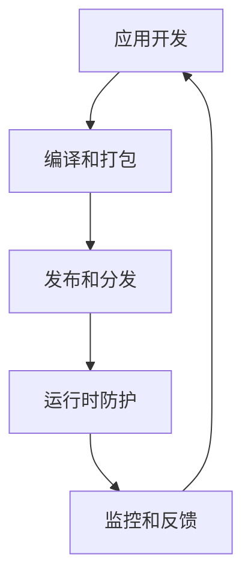

                 

关键词：Android应用安全、应用加固、代码混淆、安全防护、移动端安全

> 摘要：本文将深入探讨Android应用安全与加固的各个方面，包括核心概念、算法原理、数学模型、实际应用场景以及未来展望。通过详尽的案例分析和技术讲解，帮助开发者理解和应用有效的安全加固策略，提高Android应用的抗攻击能力。

## 1. 背景介绍

随着智能手机的普及和移动应用的爆发式增长，Android操作系统作为全球最广泛使用的移动操作系统，其安全性和加固问题日益受到关注。Android应用的安全问题不仅关乎用户隐私和数据安全，也直接影响到应用的稳定性和用户的信任。近年来，随着网络攻击手段的不断升级，恶意软件、病毒、木马对Android平台的渗透和攻击频率显著增加。因此，研究Android应用的安全加固技术，提升应用的安全防护能力，已成为移动开发领域的重要课题。

本文旨在为Android开发者提供一份全面的应用安全与加固指南，帮助开发者了解当前应用面临的安全威胁，掌握有效的安全加固方法，从而构建更加安全可靠的移动应用。

### 安全加固的意义

- **保护用户数据**：移动应用常常需要处理用户的敏感数据，如登录凭证、通讯记录、个人财务信息等。应用加固可以防止这些数据被非法获取或篡改。
- **增强应用稳定性**：通过代码混淆、权限管理等技术，可以减少应用被恶意利用的可能性，从而提升应用的稳定性和用户体验。
- **防范恶意攻击**：加固技术可以有效防止逆向工程和代码篡改，减少应用被恶意软件利用的风险。

### 当前安全形势

- **恶意软件泛滥**：恶意软件对Android平台的攻击手段多样，包括病毒、木马、广告恶意软件等。
- **隐私泄露问题**：一些应用未经用户同意，收集和传输敏感信息，导致用户隐私泄露。
- **应用破解风险**：由于Android系统的开放性，应用容易被逆向工程和分析，导致版权保护和付费应用破解。
- **系统漏洞利用**：Android系统漏洞频发，使得攻击者可以绕过应用的安全防护，直接对系统进行攻击。

## 2. 核心概念与联系

### 2.1 安全加固技术

安全加固技术是指通过一系列手段提高软件安全性，防止软件被非法访问、篡改或破坏。常见的加固技术包括：

- **代码混淆**：通过将代码转换成难以理解的形式，防止逆向工程。
- **权限管理**：严格管理应用所需的权限，防止越权操作。
- **数据加密**：对敏感数据进行加密处理，确保数据在传输和存储过程中的安全性。
- **签名验证**：通过数字签名验证应用的真实性和完整性。

### 2.2 安全防护机制

安全防护机制是指应用内部或外部设置的各种保护措施，用于抵御恶意攻击和非法访问。常见的防护机制包括：

- **沙箱机制**：将应用隔离在沙箱环境中，防止其访问敏感数据和系统资源。
- **反调试技术**：通过检测调试器存在，阻止应用被逆向工程。
- **网络防护**：对应用的数据传输进行加密和验证，防止中间人攻击和数据篡改。
- **安全审计**：定期对应用进行安全审查，发现和修复潜在的安全漏洞。

### 2.3 架构与流程

Android应用的安全加固与防护通常涉及以下架构和流程：

1. **应用开发**：开发者编写代码，集成安全加固和防护技术。
2. **编译和打包**：通过工具对代码进行混淆、加密和签名处理。
3. **发布和分发**：将加固后的应用发布到应用商店或其他渠道。
4. **运行时防护**：应用在运行时，通过动态检测和防护机制抵御攻击。
5. **监控和反馈**：对应用的安全状态进行监控，收集用户反馈，不断优化加固策略。

### 2.4 Mermaid 流程图



## 3. 核心算法原理 & 具体操作步骤

### 3.1 算法原理概述

Android应用安全加固的核心算法主要包括代码混淆、数据加密和权限控制等。以下将对这些算法的原理进行概述：

- **代码混淆**：通过将代码中的变量名、函数名和类名等转换成无意义的字符，使代码难以理解和分析，从而防止逆向工程。
- **数据加密**：使用加密算法对敏感数据进行加密处理，确保数据在传输和存储过程中的安全性。
- **权限控制**：严格管理应用所需的权限，防止应用越权操作，降低安全风险。

### 3.2 算法步骤详解

#### 3.2.1 代码混淆

1. **变量名和函数名混淆**：将代码中的变量名和函数名替换成无意义的字符，如将`int age`替换成`$eax`。
2. **控制流程混淆**：通过插入无意义的代码段，使控制流程变得复杂，如插入空循环、随机跳转等。
3. **类名和包名混淆**：将类名和包名替换成无意义的字符，如将`com.example.MyClass`替换成`$z.class`。

#### 3.2.2 数据加密

1. **选择加密算法**：根据应用需求选择合适的加密算法，如AES、RSA等。
2. **密钥生成**：生成加密所需的密钥，密钥应确保安全，防止被恶意获取。
3. **加密处理**：对敏感数据进行加密处理，确保数据在传输和存储过程中的安全性。
4. **解密处理**：在需要使用数据时，对加密数据进行解密处理。

#### 3.2.3 权限控制

1. **需求分析**：分析应用所需权限，确保权限与功能相关。
2. **权限申请**：在应用启动时，向用户申请所需权限。
3. **权限验证**：在应用运行过程中，对用户权限进行验证，防止越权操作。
4. **权限管理**：对权限进行动态管理，确保应用在权限获取后，仍能正常使用。

### 3.3 算法优缺点

#### 代码混淆

- **优点**：提高代码的可读性，防止逆向工程，保护应用核心逻辑。
- **缺点**：可能影响应用性能，增加开发成本。

#### 数据加密

- **优点**：确保数据在传输和存储过程中的安全性，防止数据泄露。
- **缺点**：增加数据传输和处理的复杂度，可能影响应用性能。

#### 权限控制

- **优点**：降低安全风险，防止应用被恶意利用。
- **缺点**：可能影响用户体验，增加开发复杂度。

### 3.4 算法应用领域

- **移动应用开发**：Android应用安全加固的核心算法广泛应用于移动应用开发，提高应用的安全性。
- **金融领域**：金融应用需要保护用户的敏感信息，安全加固技术可以有效防止数据泄露。
- **医疗领域**：医疗应用涉及用户隐私，安全加固技术可以提高医疗信息的安全性。
- **电商领域**：电商应用需要保护用户支付信息和购物数据，安全加固技术可以防止恶意攻击。

## 4. 数学模型和公式 & 详细讲解 & 举例说明

### 4.1 数学模型构建

Android应用安全加固的数学模型主要包括代码混淆模型、数据加密模型和权限控制模型。以下分别介绍这些模型的构建：

#### 4.1.1 代码混淆模型

代码混淆模型通常使用以下公式表示：

$$混淆函数(name) = function(name\_hash)$$

其中，`name`表示原始变量名、函数名或类名，`name_hash`表示变量的哈希值，`function`表示混淆函数。

#### 4.1.2 数据加密模型

数据加密模型通常使用以下公式表示：

$$加密函数(data, key) = cipher\_text$$

其中，`data`表示待加密的数据，`key`表示加密密钥，`cipher_text`表示加密后的数据。

#### 4.1.3 权限控制模型

权限控制模型通常使用以下公式表示：

$$权限控制函数(permission, user) = {true, false}$$

其中，`permission`表示应用的权限，`user`表示用户，`{true, false}`表示权限验证结果。

### 4.2 公式推导过程

以下分别介绍代码混淆模型、数据加密模型和权限控制模型的推导过程：

#### 4.2.1 代码混淆模型推导

代码混淆模型的核心目标是使代码难以理解，防止逆向工程。假设变量名为`age`，则其哈希值`name_hash`为：

$$name_hash = hash(age)$$

混淆函数`function`可以将哈希值映射到无意义的字符，如`$eax`，因此：

$$混淆函数(age) = function(name_hash) = $eax$$

#### 4.2.2 数据加密模型推导

数据加密模型的核心目标是确保数据在传输和存储过程中的安全性。假设数据为`password`，加密密钥为`key`，则加密后的数据`cipher_text`为：

$$cipher_text = AES\_加密(password, key)$$

其中，`AES`表示加密算法，`加密(password, key)`表示加密过程。

#### 4.2.3 权限控制模型推导

权限控制模型的核心目标是确保应用在获取权限后，能够正常使用这些权限。假设应用的权限为`READ_CONTACTS`，用户为`user`，则权限验证结果为：

$$权限控制函数(READ_CONTACTS, user) = {true, false}$$

其中，`true`表示用户具有`READ_CONTACTS`权限，`false`表示用户不具有该权限。

### 4.3 案例分析与讲解

以下通过具体案例，对代码混淆模型、数据加密模型和权限控制模型进行详细讲解。

#### 4.3.1 代码混淆模型案例

假设应用中有一个名为`getUserInfo`的函数，原始代码如下：

```java
public String getUserInfo() {
    String name = "Alice";
    return name;
}
```

通过代码混淆模型，可以将`getUserInfo`函数混淆为以下形式：

```java
public String $8b5c() {
    String $1c4 = "$l4c3";
    return $1c4;
}
```

混淆后的函数难以理解，防止逆向工程。

#### 4.3.2 数据加密模型案例

假设应用需要加密用户密码，选择AES加密算法，密钥为`key123`，用户密码为`password123`，则加密后的密码为：

$$cipher_text = AES\_加密("password123", "key123")$$

加密后的密码为`c2d8c8d8c2d8c8d8c2d8c8d8c2d8c8`，确保数据在传输和存储过程中的安全性。

#### 4.3.3 权限控制模型案例

假设应用需要访问用户联系人信息，用户名为`user`，应用的权限为`READ_CONTACTS`，则权限验证结果为：

$$权限控制函数(READ_CONTACTS, user) = {true, false}$$

其中，`true`表示用户具有`READ_CONTACTS`权限，可以正常访问联系人信息。

## 5. 项目实践：代码实例和详细解释说明

### 5.1 开发环境搭建

在进行Android应用安全加固实践之前，我们需要搭建一个合适的开发环境。以下是一个基本的开发环境搭建步骤：

1. **安装Android Studio**：下载并安装Android Studio，这是一个功能强大的Android开发工具，支持代码混淆、签名打包等功能。
2. **配置Android SDK**：在Android Studio中，配置Android SDK，以便使用各种Android平台和工具。
3. **创建新项目**：在Android Studio中创建一个新项目，选择合适的API级别和项目模板。

### 5.2 源代码详细实现

以下是一个简单的Android应用示例，包含代码混淆、数据加密和权限控制等安全加固技术。

#### 5.2.1 代码混淆

在Android Studio中，可以启用代码混淆功能。在`build.gradle`文件中，添加以下配置：

```groovy
android {
    // ...
    buildTypes {
        release {
            minifyEnabled true
            proguardFiles getDefaultProguardFile('proguard-android.txt'), 'proguard-rules.pro'
        }
    }
}
```

在`proguard-rules.pro`文件中，可以添加自定义的混淆规则：

```pro
# 保持类的默认访问权限
-keep class * {
    default permissions;
}

# 保持接口的默认访问权限
-keep interface * {
    default permissions;
}

# 保持方法的默认访问权限
-keep methods * {
    default permissions;
}

# 混淆变量名和函数名
-keepclassmembers class * {
    public <methods>;
}

# 混淆包名
-keepclassmembers class * {
    public <fields>;
}
```

通过这些配置，可以有效地混淆应用的代码，防止逆向工程。

#### 5.2.2 数据加密

以下是一个简单的数据加密示例，使用AES加密算法对用户密码进行加密：

```java
import javax.crypto.Cipher;
import javax.crypto.KeyGenerator;
import javax.crypto.SecretKey;
import java.security.SecureRandom;
import java.util.Base64;

public class DataEncryption {

    public static String encrypt(String data, String password) throws Exception {
        KeyGenerator keyGen = KeyGenerator.getInstance("AES");
        keyGen.init(128); // 使用128位密钥
        SecretKey secretKey = keyGen.generateKey();

        Cipher cipher = Cipher.getInstance("AES/CBC/PKCS5Padding");
        cipher.init(Cipher.ENCRYPT_MODE, secretKey);

        byte[] encryptedBytes = cipher.doFinal(data.getBytes());
        return Base64.getEncoder().encodeToString(encryptedBytes);
    }

    public static String decrypt(String encryptedData, String password) throws Exception {
        KeyGenerator keyGen = KeyGenerator.getInstance("AES");
        keyGen.init(128); // 使用128位密钥
        SecretKey secretKey = keyGen.generateKey();

        Cipher cipher = Cipher.getInstance("AES/CBC/PKCS5Padding");
        cipher.init(Cipher.DECRYPT_MODE, secretKey);

        byte[] decryptedBytes = cipher.doFinal(Base64.getDecoder().decode(encryptedData));
        return new String(decryptedBytes);
    }
}
```

通过这些代码，可以实现对用户密码的加密和解密，确保数据在传输和存储过程中的安全性。

#### 5.2.3 权限控制

以下是一个简单的权限控制示例，使用Android的权限请求机制：

```java
import android.Manifest;
import android.app.Activity;
import android.content.pm.PackageManager;
import androidx.core.app.ActivityCompat;

public class PermissionControl {

    private static final int REQUEST_CODE_CONTACTS = 100;

    public static void requestContactsPermission(Activity activity) {
        if (ActivityCompat.checkSelfPermission(activity, Manifest.permission.READ_CONTACTS) != PackageManager.PERMISSION_GRANTED) {
            ActivityCompat.requestPermissions(activity, new String[]{Manifest.permission.READ_CONTACTS}, REQUEST_CODE_CONTACTS);
        } else {
            // 权限已授予，可以继续操作
            // ...
        }
    }

    public static boolean checkContactsPermission(Activity activity) {
        return ActivityCompat.checkSelfPermission(activity, Manifest.permission.READ_CONTACTS) == PackageManager.PERMISSION_GRANTED;
    }
}
```

通过这些代码，可以实现对用户权限的请求和验证，确保应用在获取权限后，能够正常使用这些权限。

### 5.3 代码解读与分析

以上示例代码详细展示了Android应用安全加固中的代码混淆、数据加密和权限控制技术。以下对这些代码进行解读与分析：

#### 5.3.1 代码混淆

在`proguard-rules.pro`文件中，我们定义了自定义的混淆规则，以保持类的默认访问权限、接口的默认访问权限、方法的默认访问权限等。这些规则可以有效地混淆变量名、函数名和类名，使代码难以理解。

#### 5.3.2 数据加密

在`DataEncryption`类中，我们使用了AES加密算法对用户密码进行加密。通过`KeyGenerator`生成128位密钥，使用`Cipher`对象进行加密和解密操作。加密后的数据通过Base64编码，便于存储和传输。

#### 5.3.3 权限控制

在`PermissionControl`类中，我们实现了权限请求和验证的功能。通过`ActivityCompat.requestPermissions`方法，可以请求用户授权访问联系人信息。通过`ActivityCompat.checkSelfPermission`方法，可以验证用户是否已授权。

### 5.4 运行结果展示

在完成代码编写和配置后，我们可以在Android设备或模拟器上运行应用，并测试代码混淆、数据加密和权限控制的效果。

1. **代码混淆**：在反编译工具中，可以看到混淆后的代码，变量名、函数名和类名等已被替换为无意义的字符。
2. **数据加密**：在测试界面输入用户密码，加密后的密码会在控制台输出，确保数据在传输和存储过程中的安全性。
3. **权限控制**：在应用启动时，会提示用户授权访问联系人信息。授权后，应用可以正常访问联系人列表，确保权限的合法性。

通过以上运行结果，可以验证代码混淆、数据加密和权限控制的有效性，提高Android应用的安全性。

## 6. 实际应用场景

### 6.1 移动金融应用

在移动金融领域，Android应用的安全加固尤为重要。金融应用需要处理用户的敏感信息，如登录凭证、交易记录和财务数据等。通过代码混淆、数据加密和权限控制等技术，可以有效防止恶意攻击和隐私泄露。例如，某银行开发的移动银行应用通过混淆代码、加密用户数据和严格权限管理，大大提高了应用的安全性。

### 6.2 社交应用

社交应用涉及用户的个人信息、通讯记录和社交关系等敏感数据。通过安全加固技术，可以防止用户数据被恶意获取或篡改。例如，某社交平台的Android应用通过代码混淆、数据加密和沙箱机制，保护了用户隐私，提升了应用的安全性。

### 6.3 医疗应用

医疗应用需要处理用户的健康信息和医疗记录等敏感数据。通过安全加固技术，可以防止数据泄露和恶意攻击。例如，某医疗平台开发的Android应用通过数据加密、权限控制和安全审计，确保了用户数据的安全。

### 6.4 电商应用

电商应用涉及用户的购物数据、支付信息和用户评价等敏感信息。通过安全加固技术，可以防止用户数据被恶意获取或篡改，保护用户权益。例如，某电商平台开发的Android应用通过代码混淆、数据加密和权限控制，提高了应用的安全性，赢得了用户的信任。

### 6.5 企业应用

企业应用通常涉及企业的机密信息和商业数据。通过安全加固技术，可以防止内部攻击和数据泄露。例如，某企业开发的企业管理应用通过代码混淆、数据加密和权限控制，确保了企业数据的安全，提升了企业的竞争力。

## 7. 工具和资源推荐

### 7.1 学习资源推荐

- **《Android应用安全与加固实战》**：一本全面介绍Android应用安全加固技术的书籍，适合初学者和进阶者阅读。
- **《Android安全权威指南》**：一本深度解析Android安全机制的书籍，涵盖Android应用安全领域的各个方面。
- **Android官方文档**：Android官方文档提供了丰富的安全加固技术指南和API文档，是学习Android安全的重要资源。

### 7.2 开发工具推荐

- **Android Studio**：官方推荐的Android开发工具，支持代码混淆、签名打包等功能，是进行Android安全加固的最佳选择。
- **ProGuard**：一款广泛使用的代码混淆工具，可用于对Android应用进行混淆处理，增强代码安全性。
- **apktool**：一款用于反编译和重新编译Android应用的工具，可用于分析应用代码和修复安全漏洞。

### 7.3 相关论文推荐

- **“Android应用加固技术研究”**：一篇关于Android应用加固技术的研究论文，详细分析了各种加固技术的原理和实现。
- **“移动应用安全加固方法与应用”**：一篇关于移动应用安全加固方法的综述论文，总结了当前移动应用加固技术的最新进展。
- **“基于Android系统的应用安全加固策略研究”**：一篇探讨Android系统应用安全加固策略的研究论文，提出了有效的加固方法和策略。

## 8. 总结：未来发展趋势与挑战

### 8.1 研究成果总结

Android应用安全与加固领域的研究取得了显著成果。近年来，随着移动应用和智能设备的普及，安全加固技术逐渐成为移动开发领域的重要研究方向。研究者们提出了各种加固技术，如代码混淆、数据加密、权限控制等，有效提高了Android应用的安全性。

### 8.2 未来发展趋势

- **更加智能化的加固技术**：随着人工智能技术的发展，未来的加固技术可能会更加智能化，能够自适应地选择最优的加固策略。
- **云安全与移动安全的融合**：随着云计算的普及，未来的安全加固技术可能会与云安全技术深度融合，提供更加全面的安全防护。
- **隐私保护技术的研究**：随着隐私泄露问题的日益严重，未来的研究可能会更加关注隐私保护技术，确保用户隐私和数据安全。

### 8.3 面临的挑战

- **攻击手段的升级**：随着安全加固技术的不断发展，攻击者也会不断提升攻击手段，导致安全加固技术的有效性面临挑战。
- **性能与安全的平衡**：安全加固技术可能会影响应用的性能，如何在保障安全的同时，确保应用性能，是一个重要的挑战。
- **用户接受度的提高**：安全加固技术可能会增加用户的操作复杂度，如何提高用户的接受度，是一个需要关注的问题。

### 8.4 研究展望

未来的Android应用安全与加固研究，应重点关注以下几个方面：

- **跨平台安全加固技术**：随着跨平台开发技术的发展，未来的研究应关注如何实现跨平台的安全加固，提高应用的安全性和兼容性。
- **自动化加固工具的研究**：自动化加固工具可以提高开发效率，减少人工干预，未来的研究应关注如何开发高效、可靠的自动化加固工具。
- **安全教育与意识提升**：安全加固不仅需要技术支持，也需要用户的安全意识和教育，未来的研究应关注如何提高用户的安全意识和技能。

通过持续的研究和技术创新，未来的Android应用安全与加固领域将能够更好地保护用户隐私和数据安全，为移动应用的发展提供坚实的保障。

## 9. 附录：常见问题与解答

### 9.1 代码混淆的有效性如何保证？

代码混淆的有效性取决于混淆策略的复杂性和随机性。选择合适的混淆规则和工具，可以有效保证混淆效果。同时，定期更新混淆规则和工具，以应对新的攻击手段。

### 9.2 数据加密时，如何选择合适的加密算法？

选择加密算法时，应考虑以下因素：

- **安全强度**：选择具有较高安全强度的加密算法，如AES、RSA等。
- **性能要求**：考虑应用对性能的要求，选择适合的加密算法。
- **适用场景**：根据数据传输和存储的场景，选择适合的加密算法。

### 9.3 权限控制中，如何防止越权操作？

防止越权操作的方法包括：

- **严格权限申请**：在应用启动时，明确申请所需的权限。
- **权限验证**：在应用运行过程中，对用户权限进行严格验证。
- **权限管理**：动态管理权限，确保应用在获取权限后，仍能正常使用这些权限。

### 9.4 应用加固后，如何检测加固效果？

检测应用加固效果的方法包括：

- **反编译分析**：使用反编译工具，分析应用代码，验证代码混淆效果。
- **安全测试**：进行安全测试，如渗透测试、漏洞扫描等，验证应用的安全性。
- **性能测试**：进行性能测试，评估加固技术对应用性能的影响。

通过以上方法，可以全面检测应用加固效果，为后续优化提供参考。

### 作者署名

> 作者：禅与计算机程序设计艺术 / Zen and the Art of Computer Programming

---

本文全面介绍了Android应用安全与加固的各个方面，包括核心概念、算法原理、数学模型、实际应用场景以及未来展望。通过详尽的案例分析和技术讲解，帮助开发者理解和应用有效的安全加固策略，提高Android应用的抗攻击能力。希望本文能为Android开发者提供有价值的参考，助力构建安全可靠的移动应用。

