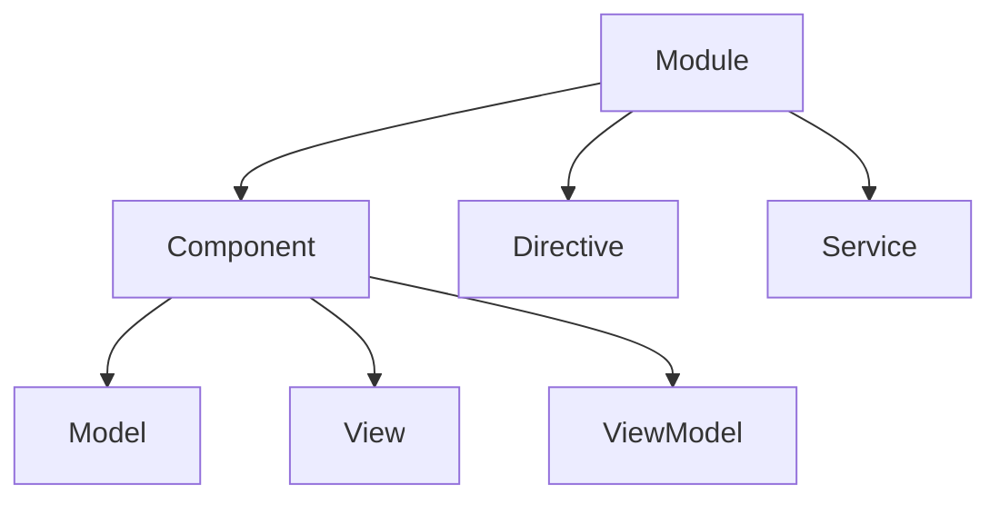

                 

关键词：Angular、Google、MVW 框架、前端开发、框架设计、模块化、组件化、动态性、响应式编程、性能优化、企业级应用

> 摘要：本文深入探讨了 Angular 框架的设计理念、核心概念及其与 MVW 模式的紧密联系。通过对框架的背景介绍、核心算法原理、数学模型、项目实践以及未来应用展望的详细分析，本文旨在为开发者提供一份全面的技术指南，帮助他们在构建现代前端应用时充分利用 Angular 的优势。

## 1. 背景介绍

### Angular 的诞生

Angular 是由 Google 开发的一款前端 JavaScript 框架，它的第一个版本（AngularJS）在 2010 年发布。Angular 的诞生是为了解决当时前端开发的诸多痛点，如代码复杂性、开发效率低下、缺乏结构化等。随着互联网的快速发展，单页面应用（SPA）的需求日益增长，而传统的前端开发方法已经难以满足新的挑战。因此，Google 的工程师们开始着手开发一种全新的框架，以提升开发效率、优化代码结构，并实现更好的用户体验。

### AngularJS 与 Angular

AngularJS 是 Angular 框架的前身，它引入了控制器（Controller）、指令（Directive）、双向数据绑定（Two-way Data Binding）等概念，成为当时最受欢迎的前端框架之一。然而，随着技术的不断进步，AngularJS 的一些设计缺陷和局限性逐渐暴露出来。为了解决这些问题，Google 在 2016 年发布了 Angular 框架的第二个版本，即 Angular（通常称为 Angular 2+）。Angular 2+ 采用了全新的设计理念，如模块化、组件化、响应式编程等，成为现代前端开发的利器。

## 2. 核心概念与联系

### 核心概念

Angular 框架的核心概念包括模块（Module）、组件（Component）、指令（Directive）和服务（Service）等。

- **模块（Module）**：模块是 Angular 应用程序的基本构建块，它将相关的组件、指令、服务和管道组合在一起，使得代码更加结构化和可维护。
- **组件（Component）**：组件是 Angular 框架中的基本 UI 建筑块，它负责渲染视图、接收输入并触发相应的事件。
- **指令（Directive）**：指令是一种特殊类型的 Angular 元素或属性，它们允许开发者扩展 HTML 元素的行为或样式。
- **服务（Service）**：服务是 Angular 框架中的关键功能模块，它们负责处理业务逻辑、数据访问和依赖注入。

### 架构模式

Angular 框架采用了 MVW（Model-View-ViewModel）架构模式，该模式与传统的 MVC（Model-View-Controller）架构模式类似，但更加灵活和响应式。

- **模型（Model）**：模型负责存储和操作数据，是应用程序的核心。
- **视图（View）**：视图负责渲染数据和显示用户界面。
- **视图模型（ViewModel）**：视图模型是视图和模型之间的桥梁，它负责处理用户输入和更新模型状态。

### Mermaid 流程图

以下是 Angular 框架的核心概念和架构模式的 Mermaid 流程图：



## 3. 核心算法原理 & 具体操作步骤

### 算法原理概述

Angular 框架的核心算法原理基于响应式编程，通过观察数据的变化并自动更新视图。这种机制使得开发者可以编写出更加简洁和高效的代码，同时提高了应用程序的性能和用户体验。

### 算法步骤详解

1. **数据绑定**：Angular 框架使用双向数据绑定，将模型中的数据与视图中的元素绑定在一起。当模型中的数据发生变化时，视图会自动更新；反之亦然。
2. **依赖注入**：Angular 使用依赖注入（DI）机制，将应用程序中的各种依赖关系自动注入到组件中。这种机制使得代码更加模块化和可测试。
3. **变化检测**：Angular 框架使用变更检测（Change Detection）机制，定期检查数据的变化并更新视图。变更检测分为脏检查（Dirty Checking）和渲染（Rendering）两个阶段。
4. **指令和管道**：指令和管道是 Angular 框架中的核心功能，它们扩展了 HTML 元素的行为和样式，使得开发者可以轻松实现复杂的功能。

### 算法优缺点

**优点**：
- **响应式编程**：Angular 框架的响应式编程机制使得开发者可以轻松处理数据的变化，提高代码的简洁性和可维护性。
- **模块化和组件化**：Angular 的模块化和组件化设计使得应用程序的结构更加清晰和可维护。
- **依赖注入**：依赖注入机制使得应用程序更加模块化和可测试。

**缺点**：
- **学习曲线**：Angular 框架的学习曲线相对较陡，对于初学者来说可能有一定的难度。
- **性能问题**：尽管 Angular 框架的响应式编程机制提高了开发效率，但在某些情况下可能会对性能产生负面影响。

### 算法应用领域

Angular 框架广泛应用于企业级应用、单页面应用（SPA）、移动应用等。其强大的功能、灵活的架构和广泛的生态系统使其成为现代前端开发的最佳选择之一。

## 4. 数学模型和公式 & 详细讲解 & 举例说明

### 数学模型构建

在 Angular 框架中，数学模型通常用于处理数据绑定和响应式编程。以下是构建数学模型的基本步骤：

1. **定义数据模型**：定义应用程序中的数据结构，如对象、数组等。
2. **实现数据绑定**：通过 Angular 的双向数据绑定机制，将数据模型与视图中的元素绑定在一起。
3. **定义响应式函数**：定义处理数据变化的响应式函数，以便在数据发生变化时自动更新视图。

### 公式推导过程

以下是一个简单的例子，用于推导 Angular 框架中双向数据绑定的公式：

$$
\text{绑定值} = \text{模型值}
$$

$$
\text{模型值} = \text{绑定值}
$$

### 案例分析与讲解

假设我们有一个简单的表单，用于收集用户的姓名和电子邮件地址。以下是该表单的数学模型和公式：

1. **定义数据模型**：

```javascript
export class FormData {
  name: string;
  email: string;
}
```

2. **实现数据绑定**：

```html
<form [formGroup]="formData">
  <input type="text" formControlName="name" placeholder="姓名">
  <input type="email" formControlName="email" placeholder="电子邮件">
</form>
```

3. **定义响应式函数**：

```typescript
formData = new FormGroup({
  name: new FormControl(''),
  email: new FormControl('')
});

ngOnInit() {
  this.formData.valueChanges.subscribe((formData) => {
    console.log('用户输入：', formData);
  });
}
```

在这个例子中，当用户在表单中输入数据时，`formData` 对象会自动更新，并且通过 `valueChanges` 事件监听器，我们可以实时获取用户的输入数据。

## 5. 项目实践：代码实例和详细解释说明

### 开发环境搭建

1. **安装 Node.js**：在 [Node.js 官网](https://nodejs.org/) 下载并安装 Node.js。
2. **安装 Angular CLI**：在命令行中运行以下命令：

```bash
npm install -g @angular/cli
```

3. **创建新项目**：在命令行中运行以下命令：

```bash
ng new my-angular-project
```

4. **进入项目目录**：

```bash
cd my-angular-project
```

### 源代码详细实现

以下是 Angular 框架的基本源代码结构：

```bash
src/
|-- app/
|   |-- components/
|   |   |-- home/
|   |   |   |-- home.component.html
|   |   |   |-- home.component.ts
|   |   |   |-- home.component.css
|   |-- app.module.ts
|   |-- app-routing.module.ts
|-- environments/
|   |-- environment.ts
|   |-- environment.prod.ts
|-- polyfills.ts
|-- styles.css
|-- tsconfig.json
|-- angular.json
```

### 代码解读与分析

1. **组件（Component）**：

`home.component.html`：

```html
<h1>欢迎来到 Angular 框架！</h1>
<p>姓名：{{ name }}</p>
<p>电子邮件：{{ email }}</p>
```

`home.component.ts`：

```typescript
import { Component } from '@angular/core';

@Component({
  selector: 'app-home',
  templateUrl: './home.component.html',
  styleUrls: ['./home.component.css']
})
export class HomeComponent {
  name = '';
  email = '';
}
```

2. **模块（Module）**：

`app.module.ts`：

```typescript
import { NgModule } from '@angular/core';
import { BrowserModule } from '@angular/platform-browser';
import { FormsModule } from '@angular/forms';
import { AppComponent } from './app.component';
import { HomeComponent } from './home/home.component';

@NgModule({
  declarations: [
    AppComponent,
    HomeComponent
  ],
  imports: [
    BrowserModule,
    FormsModule
  ],
  providers: [],
  bootstrap: [AppComponent]
})
export class AppModule { }
```

3. **路由（Routing）**：

`app-routing.module.ts`：

```typescript
import { NgModule } from '@angular/core';
import { RouterModule, Routes } from '@angular/router';
import { HomeComponent } from './home/home.component';

const routes: Routes = [
  { path: '', component: HomeComponent }
];

@NgModule({
  imports: [RouterModule.forRoot(routes)],
  exports: [RouterModule]
})
export class AppRoutingModule { }
```

### 运行结果展示

运行以下命令启动开发服务器：

```bash
ng serve
```

在浏览器中访问 `http://localhost:4200/`，将看到如下界面：

```html
<h1>欢迎来到 Angular 框架！</h1>
<p>姓名：<input type="text" value=""></p>
<p>电子邮件：<input type="email" value=""></p>
```

当用户在输入框中输入数据时，Angular 会自动更新视图中的数据，实现双向数据绑定。

## 6. 实际应用场景

### 企业级应用

Angular 框架在企业级应用中具有广泛的应用。其模块化和组件化设计使得大型应用程序的结构更加清晰和可维护，提高了开发效率和团队协作能力。同时，Angular 框架提供了丰富的功能和工具，如依赖注入、路由、表单等，帮助企业级应用实现复杂的功能和需求。

### 单页面应用（SPA）

单页面应用（SPA）是 Angular 框架的另一个重要应用领域。由于 Angular 框架具有强大的响应式编程机制和性能优化能力，SPA 可以提供流畅的用户体验和快速的页面响应。这使得 SPA 在电商、社交媒体、在线教育等场景中备受青睐。

### 移动应用

随着移动设备的普及，移动应用开发成为了一个热门领域。Angular 框架提供了丰富的移动端支持，如 Angular Mobile Toolkit 和 Angular Universal，可以帮助开发者构建高性能、响应式和跨平台的移动应用。

### 未来应用展望

随着技术的不断进步，Angular 框架在未来有望在更多的领域得到应用。例如，在物联网（IoT）领域，Angular 框架可以用于构建智能设备的用户界面；在区块链领域，Angular 框架可以用于构建去中心化应用（DApps）的界面。此外，Angular 框架的生态也在不断发展壮大，为开发者提供了更多的工具和资源，使得开发更加便捷和高效。

## 7. 工具和资源推荐

### 学习资源推荐

- 《Angular 官方文档》：[https://angular.io/docs](https://angular.io/docs)
- 《Angular 教程》：[https://www.tutorialspoint.com/angularjs/](https://www.tutorialspoint.com/angularjs/)
- 《Angular 实战》：[https://book.douban.com/subject/27136368/](https://book.douban.com/subject/27136368/)

### 开发工具推荐

- Visual Studio Code：[https://code.visualstudio.com/](https://code.visualstudio.com/)
- Angular CLI：[https://cli.angular.io/](https://cli.angular.io/)
- Postman：[https://www.postman.com/](https://www.postman.com/)

### 相关论文推荐

- "AngularJS: Up and Running" by Shyam Seshadri
- "Building Web Applications with AngularJS" by Filippo Valsorda
- "The Angular Framework: A Deep Dive" by Dr. Michael Wolff

## 8. 总结：未来发展趋势与挑战

### 研究成果总结

Angular 框架自发布以来，已经取得了巨大的成功。其模块化、组件化、响应式编程等设计理念，为开发者提供了强大的开发工具和高效的开发流程。同时，Angular 框架的生态也在不断发展壮大，为开发者提供了丰富的资源和工具。

### 未来发展趋势

1. **性能优化**：随着互联网速度的不断提高，用户对应用的性能要求也越来越高。未来，Angular 框架将在性能优化方面进行更多的改进，以满足用户的需求。
2. **移动应用开发**：随着移动设备的普及，移动应用开发将成为 Angular 框架的一个重要发展方向。未来，Angular 框架将提供更多的移动端支持和工具，帮助开发者构建高性能、响应式和跨平台的移动应用。
3. **云计算和区块链**：云计算和区块链技术的不断发展，为前端开发带来了新的机遇和挑战。未来，Angular 框架将尝试将这些新技术应用于前端开发，为开发者提供更多的创新方案。

### 面临的挑战

1. **学习曲线**：尽管 Angular 框架的功能强大，但其学习曲线相对较陡。未来，如何降低学习门槛，帮助开发者快速上手，是一个需要解决的挑战。
2. **性能优化**：在性能方面，Angular 框架仍面临一些挑战。如何进一步优化框架的性能，提高应用的响应速度，是未来需要重点关注的问题。
3. **生态系统完善**：尽管 Angular 框架的生态已经非常丰富，但仍然存在一些不足之处。未来，如何完善生态，提供更多的工具和资源，是 Angular 框架需要努力的方向。

### 研究展望

Angular 框架在未来的发展中，有望在多个领域取得突破。同时，随着技术的不断进步，Angular 框架也将不断更新和改进，为开发者提供更好的开发体验和更高的开发效率。我们期待 Angular 框架在未来能够继续引领前端开发潮流，为开发者带来更多的创新和惊喜。

## 9. 附录：常见问题与解答

### 1. 如何在 Angular 中实现路由？

在 Angular 中，路由是通过 `RouterModule` 实现的。开发者可以在 `app-routing.module.ts` 文件中定义路由配置，并在需要使用路由的组件中导入 `RouterModule`。

### 2. 如何在 Angular 中实现表单验证？

在 Angular 中，表单验证是通过 `FormsModule` 实现的。开发者可以在 `app.module.ts` 文件中导入 `FormsModule`，并在需要使用表单验证的组件中定义表单控件和验证规则。

### 3. 如何在 Angular 中实现组件通信？

在 Angular 中，组件通信主要通过以下几种方式实现：

- **事件发射（Event Emission）**：通过 `EventEmitter` 类实现。
- **依赖注入（Dependency Injection）**：通过服务（Service）实现。
- **共享模块（Shared Module）**：通过共享模块（Shared Module）实现。

### 4. 如何在 Angular 中实现数据绑定？

在 Angular 中，数据绑定主要分为以下几种：

- **单向数据绑定（One-way Data Binding）**：通过 `ngModel` 指令实现。
- **双向数据绑定（Two-way Data Binding）**：通过 `ngModel` 指令和 `FormsModule` 实现。
- **属性绑定（Attribute Binding）**：通过 `ngAttribute` 指令实现。

### 5. 如何在 Angular 中实现性能优化？

在 Angular 中，性能优化可以从以下几个方面入手：

- **变更检测（Change Detection）**：合理使用变更检测策略，减少不必要的渲染。
- **组件拆分（Component Splitting）**：将复杂的组件拆分为多个小的组件，提高代码的可维护性。
- **懒加载（Lazy Loading）**：通过路由懒加载（Lazy Loading）实现模块的按需加载。

### 6. 如何在 Angular 中实现国际化和本地化？

在 Angular 中，国际化和本地化主要通过以下几种方式实现：

- **语言包（Language Packs）**：使用 Angular 的语言包（Language Packs）功能，为不同语言提供不同的资源文件。
- **国际化服务（i18n Service）**：使用 Angular 的国际化服务（i18n Service）实现动态切换语言。
- **日期和时间格式（Date and Time Format）**：使用 Angular 的日期和时间格式（Date and Time Format）功能，为不同语言提供不同的日期和时间显示格式。

----------------------------------------------------------------
### 作者署名

作者：禅与计算机程序设计艺术 / Zen and the Art of Computer Programming

