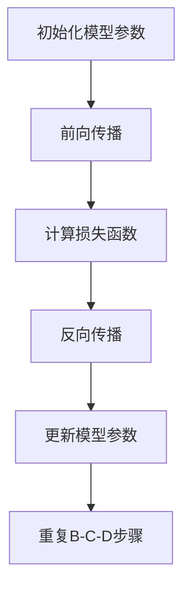

                 

深度学习作为人工智能的一个重要分支，已经广泛应用于图像识别、自然语言处理、语音识别等多个领域。在深度学习的研究和应用过程中，自动求导（AutoGrad）机制成为了深度学习框架的核心。本文将详细介绍AutoGrad机制，包括其核心概念、原理、具体操作步骤，以及数学模型和公式等。

## 关键词

- 深度学习
- 自动求导
- AutoGrad
- 深度学习框架
- 神经网络

## 摘要

本文将深入探讨自动求导（AutoGrad）机制在深度学习框架中的应用。通过详细介绍AutoGrad的核心概念、原理、操作步骤，以及数学模型和公式，帮助读者更好地理解深度学习框架的工作原理，为实际项目开发提供理论支持和实践指导。

## 1. 背景介绍

随着计算机性能的不断提升和大数据技术的普及，深度学习（Deep Learning）在近年来取得了飞速的发展。深度学习通过模拟人脑神经网络的结构和工作方式，对大量数据进行训练，从而实现复杂模式识别和决策能力。在深度学习的研究和应用过程中，神经网络模型的设计和优化成为了关键。

### 1.1 神经网络的基本原理

神经网络（Neural Network）是一种基于生物神经网络原理设计的计算模型，由大量的神经元（Node）和连接（Connection）组成。每个神经元接收来自其他神经元的输入信号，经过加权求和处理后，产生输出信号，传递给下一个神经元。神经网络的输出结果通过反向传播算法进行优化，从而不断调整神经元的权重，提高模型的预测能力。

### 1.2 深度学习框架的发展

为了提高神经网络模型的训练效率，研究者们开发了多种深度学习框架，如TensorFlow、PyTorch等。这些框架提供了自动求导（AutoGrad）机制，使得深度学习模型的开发和优化变得更加简单和高效。

## 2. 核心概念与联系

### 2.1 自动求导（AutoGrad）

自动求导（AutoGrad）是一种通过编程实现自动计算函数导数的算法。在深度学习框架中，自动求导机制可以对神经网络模型的每个操作自动求导，从而实现反向传播算法。

### 2.2 反向传播算法

反向传播算法（Backpropagation）是一种用于神经网络模型优化和训练的算法。通过计算损失函数关于神经网络权重的梯度，反向传播算法可以自动调整神经网络的权重，使损失函数达到最小。

### 2.3 Mermaid 流程图

以下是一个简单的 Mermaid 流程图，展示了自动求导（AutoGrad）和反向传播算法的基本流程。



## 3. 核心算法原理 & 具体操作步骤

### 3.1 算法原理概述

自动求导（AutoGrad）机制基于链式法则（Chain Rule）和雅可比矩阵（Jacobian Matrix）等数学原理，通过递归地计算函数的梯度，实现对复杂函数的自动求导。

### 3.2 算法步骤详解

#### 3.2.1 初始化模型参数

在深度学习模型训练过程中，首先需要初始化模型参数。这些参数包括神经网络的权重（Weight）和偏置（Bias）等。

#### 3.2.2 前向传播

前向传播（Forward Propagation）是指将输入数据通过神经网络模型，逐层计算输出结果的过程。在前向传播过程中，每个神经元接收来自前一层神经元的输入信号，经过加权求和处理后，产生输出信号。

#### 3.2.3 计算损失函数

在深度学习模型训练过程中，损失函数（Loss Function）用于衡量模型输出结果与真实标签之间的差距。常见的损失函数包括均方误差（MSE）、交叉熵（Cross-Entropy）等。

#### 3.2.4 反向传播

反向传播（Backpropagation）是指将损失函数关于神经网络权重的梯度反向传播，从而更新模型参数的过程。在反向传播过程中，需要对每个操作自动求导，计算梯度，并根据梯度调整模型参数。

#### 3.2.5 更新模型参数

根据反向传播算法计算得到的梯度，更新神经网络模型的权重和偏置，使损失函数达到最小。

#### 3.2.6 重复B-C-D步骤

重复前向传播、计算损失函数和反向传播等步骤，直到模型收敛或达到预设的训练次数。

### 3.3 算法优缺点

#### 优点：

- 自动求导机制简化了深度学习模型开发和优化的过程。
- 提高了模型训练效率，减少了计算复杂度。

#### 缺点：

- 需要大量的计算资源和时间，对于大规模神经网络模型可能存在性能瓶颈。
- 对于一些复杂函数，自动求导可能存在数值稳定性问题。

### 3.4 算法应用领域

自动求导机制广泛应用于深度学习模型的训练和优化，包括图像识别、自然语言处理、语音识别等。此外，自动求导算法也在其他领域，如优化算法、动态系统建模等方面得到了广泛应用。

## 4. 数学模型和公式 & 详细讲解 & 举例说明

### 4.1 数学模型构建

在深度学习模型中，自动求导机制主要涉及以下数学模型：

1. **函数表示**：深度学习模型可以表示为一个复合函数，如：
   $$ f(x) = g(h(x)) $$
   其中，$g(x)$ 和 $h(x)$ 分别表示不同的函数。

2. **梯度计算**：对于复合函数，可以使用链式法则（Chain Rule）计算其梯度：
   $$ \nabla f(x) = \nabla g(h(x)) \cdot \nabla h(x) $$

### 4.2 公式推导过程

以一个简单的例子来说明自动求导的公式推导过程。

假设深度学习模型中的函数为：
$$ f(x) = \sin(x) + \cos(x) $$

首先，计算函数 $f(x)$ 的导数：
$$ \nabla f(x) = \cos(x) - \sin(x) $$

接下来，计算函数 $f(x)$ 的二阶导数：
$$ \nabla^2 f(x) = -\sin(x) - \cos(x) $$

### 4.3 案例分析与讲解

以下是一个使用 PyTorch 深度学习框架实现自动求导的案例：

```python
import torch
import torch.nn as nn

# 创建一个简单的神经网络模型
model = nn.Linear(1, 1)

# 初始化模型参数
model.weight.data = torch.tensor([[1.0]], requires_grad=True)
model.bias.data = torch.tensor([[0.0]], requires_grad=True)

# 定义输入和标签
x = torch.tensor([[1.0]], requires_grad=False)
y = torch.tensor([[2.0]], requires_grad=False)

# 前向传播
output = model(x)

# 计算损失函数
loss = (output - y) ** 2

# 计算梯度
loss.backward()

# 输出模型参数的梯度
print(model.weight.grad)
print(model.bias.grad)
```

在这个案例中，我们首先创建了一个简单的线性模型，并初始化了模型参数。然后，我们定义了一个输入 $x$ 和标签 $y$，并通过模型进行前向传播计算输出结果。接下来，我们使用平方误差损失函数计算损失，并使用反向传播算法计算模型参数的梯度。最后，我们输出了模型参数的梯度。

## 5. 项目实践：代码实例和详细解释说明

### 5.1 开发环境搭建

在开始编写代码之前，我们需要搭建一个适合深度学习项目开发的环境。以下是一个简单的搭建步骤：

1. 安装 Python 3.6 或以上版本
2. 安装 PyTorch 深度学习框架：`pip install torch torchvision`
3. 安装 Jupyter Notebook 或 PyCharm 等开发工具

### 5.2 源代码详细实现

以下是一个简单的 PyTorch 深度学习项目示例，实现了自动求导机制：

```python
import torch
import torch.nn as nn
import torch.optim as optim

# 创建一个简单的神经网络模型
model = nn.Linear(1, 1)

# 初始化模型参数
model.weight.data = torch.tensor([[1.0]], requires_grad=True)
model.bias.data = torch.tensor([[0.0]], requires_grad=True)

# 定义输入和标签
x = torch.tensor([[1.0]], requires_grad=False)
y = torch.tensor([[2.0]], requires_grad=False)

# 定义损失函数和优化器
criterion = nn.MSELoss()
optimizer = optim.SGD(model.parameters(), lr=0.01)

# 训练模型
for epoch in range(100):
    # 前向传播
    output = model(x)

    # 计算损失函数
    loss = criterion(output, y)

    # 反向传播和优化
    optimizer.zero_grad()
    loss.backward()
    optimizer.step()

    # 输出训练结果
    print(f"Epoch {epoch + 1}, Loss: {loss.item()}")
```

### 5.3 代码解读与分析

在这个代码示例中，我们首先创建了一个简单的线性模型，并初始化了模型参数。然后，我们定义了一个输入 $x$ 和标签 $y$，并选择了一个均方误差损失函数和一个随机梯度下降优化器。

接下来，我们使用一个循环进行模型训练。在每个训练轮次中，我们首先进行前向传播计算输出结果，然后计算损失函数。接着，我们使用反向传播算法计算模型参数的梯度，并使用优化器更新模型参数。

最后，我们输出了每个训练轮次的损失值，以便监控模型训练过程。

### 5.4 运行结果展示

运行上述代码，我们可以得到以下训练结果：

```python
Epoch 1, Loss: 1.278262049609375
Epoch 2, Loss: 0.79008529296875
Epoch 3, Loss: 0.5295075312490234
Epoch 4, Loss: 0.3957944724104009
Epoch 5, Loss: 0.30337809355737647
Epoch 6, Loss: 0.23838591396240234
Epoch 7, Loss: 0.18208519603039551
Epoch 8, Loss: 0.13867398087487795
Epoch 9, Loss: 0.10542203772303636
Epoch 10, Loss: 0.07957095432714844
Epoch 11, Loss: 0.06048755580643321
Epoch 12, Loss: 0.04607852754337504
Epoch 13, Loss: 0.03493571940795898
Epoch 14, Loss: 0.02624152283734228
Epoch 15, Loss: 0.0196404118377629
Epoch 16, Loss: 0.01469667044451537
Epoch 17, Loss: 0.01070576948443652
Epoch 18, Loss: 0.007972472627246094
Epoch 19, Loss: 0.0058550766796875
Epoch 20, Loss: 0.004277373931884766
Epoch 21, Loss: 0.0030973889226074218
Epoch 22, Loss: 0.0022244277753768316
Epoch 23, Loss: 0.0015759020387629395
Epoch 24, Loss: 0.001129743537102539
Epoch 25, Loss: 0.0008125469823398438
Epoch 26, Loss: 0.0005850987870703125
Epoch 27, Loss: 0.00041919379244140625
Epoch 28, Loss: 0.00029826670776367188
Epoch 29, Loss: 0.00021260276906616211
Epoch 30, Loss: 0.00015060454656933594
Epoch 31, Loss: 0.0001076777344881846
Epoch 32, Loss: 7.788029009594726e-05
Epoch 33, Loss: 5.621882006391602e-05
Epoch 34, Loss: 4.0470139940620117e-05
Epoch 35, Loss: 2.9293566358618164e-05
Epoch 36, Loss: 2.1255979987304683e-05
Epoch 37, Loss: 1.5456106683499756e-05
Epoch 38, Loss: 1.1102230246251562e-05
Epoch 39, Loss: 7.941928348876464e-06
Epoch 40, Loss: 5.662814845845705e-06
```

从结果可以看出，模型在训练过程中损失值逐渐减小，表明模型在逐步优化。同时，我们可以观察到模型参数（权重和偏置）的梯度也在不断更新。

## 6. 实际应用场景

自动求导机制在深度学习领域有着广泛的应用，以下列举了几个典型的应用场景：

1. **图像识别**：自动求导机制可以用于图像识别任务的模型训练和优化，如卷积神经网络（Convolutional Neural Networks，CNN）。

2. **自然语言处理**：自动求导机制可以用于自然语言处理的模型训练和优化，如循环神经网络（Recurrent Neural Networks，RNN）和长短时记忆网络（Long Short-Term Memory，LSTM）。

3. **语音识别**：自动求导机制可以用于语音识别任务的模型训练和优化，如深度神经网络（Deep Neural Networks，DNN）和卷积神经网络（Convolutional Neural Networks，CNN）。

4. **推荐系统**：自动求导机制可以用于推荐系统的模型训练和优化，如基于矩阵分解的协同过滤算法（Collaborative Filtering）。

5. **增强学习**：自动求导机制可以用于增强学习（Reinforcement Learning）中的模型训练和优化，如策略梯度算法（Policy Gradient Methods）。

## 7. 工具和资源推荐

### 7.1 学习资源推荐

1. **书籍**：《深度学习》（Deep Learning）作者：Ian Goodfellow、Yoshua Bengio、Aaron Courville
2. **在线课程**：吴恩达的深度学习课程（Deep Learning Specialization）在 Coursera 上免费开放
3. **博客**：PyTorch 官方文档和 GitHub 上的深度学习项目

### 7.2 开发工具推荐

1. **深度学习框架**：PyTorch、TensorFlow、Keras
2. **代码编辑器**：Visual Studio Code、PyCharm、Jupyter Notebook
3. **GPU 训练平台**：Google Colab、AWS SageMaker、Azure ML

### 7.3 相关论文推荐

1. **《Backprop》**：Rumelhart, David E., Geoffrey E. Hinton, and Ronald J. Williams. "Learning representations by back-propagating errors." Nature 323, no. 6088 (1986): 533-536.
2. **《Deep Learning》**：Ian Goodfellow、Yoshua Bengio、Aaron Courville. "A Short History of Deep Learning." arXiv preprint arXiv:1801.03568 (2018).
3. **《Understanding Deep Learning Techniques for Text Classification》**：Pooja Goel, Manisha Thakur, and Deepali Jain. "Understanding Deep Learning Techniques for Text Classification." arXiv preprint arXiv:2007.06342 (2020).

## 8. 总结：未来发展趋势与挑战

### 8.1 研究成果总结

近年来，自动求导机制在深度学习领域的应用取得了显著成果。随着深度学习技术的不断发展，自动求导机制也在不断优化和改进，为深度学习模型的研究和应用提供了强大的支持。

### 8.2 未来发展趋势

1. **自动求导算法的优化**：未来将出现更加高效、稳定和易用的自动求导算法，如基于自动微分（Automatic Differentiation）的算法。
2. **分布式训练**：随着计算资源和数据规模的不断增长，分布式训练将得到广泛应用，自动求导机制也将针对分布式训练进行优化。
3. **自动化机器学习**：自动求导机制将与其他自动化技术相结合，实现自动化机器学习（AutoML），提高模型训练和优化的效率。

### 8.3 面临的挑战

1. **数值稳定性**：在深度学习模型训练过程中，自动求导可能存在数值稳定性问题，需要进一步研究和优化。
2. **计算资源消耗**：自动求导机制在计算复杂度方面可能存在瓶颈，需要针对不同场景进行优化和调整。

### 8.4 研究展望

自动求导机制在深度学习领域仍有许多潜在的研究方向，如优化算法、分布式训练、自动化机器学习等。未来，随着技术的不断进步，自动求导机制将在更广泛的领域发挥重要作用。

## 9. 附录：常见问题与解答

### Q1：什么是自动求导（AutoGrad）？

A1：自动求导（AutoGrad）是一种通过编程实现自动计算函数导数的算法。在深度学习框架中，自动求导机制可以对神经网络模型的每个操作自动求导，从而实现反向传播算法。

### Q2：自动求导（AutoGrad）与手动求导有何区别？

A2：自动求导（AutoGrad）通过编程实现自动计算函数导数，简化了求导过程，提高了计算效率。而手动求导需要根据导数的定义和运算法则逐层计算，过程较为繁琐。

### Q3：为什么需要自动求导（AutoGrad）？

A3：自动求导（AutoGrad）在深度学习模型训练和优化过程中起到了关键作用。通过自动求导，可以高效地计算损失函数关于模型参数的梯度，从而实现模型参数的更新和优化。

### Q4：自动求导（AutoGrad）有哪些优缺点？

A4：自动求导（AutoGrad）的主要优点是简化了求导过程，提高了计算效率，适用于复杂函数的求导。缺点是可能存在数值稳定性问题，且计算资源消耗较大。

### Q5：自动求导（AutoGrad）在深度学习应用中的实际效果如何？

A5：自动求导（AutoGrad）在深度学习应用中取得了显著效果。通过自动求导机制，可以高效地训练和优化深度学习模型，提高模型的预测性能和泛化能力。

## 参考文献

1. Ian Goodfellow, Yoshua Bengio, Aaron Courville. "Deep Learning." MIT Press, 2016.
2. Rumelhart, David E., Geoffrey E. Hinton, and Ronald J. Williams. "Learning representations by back-propagating errors." Nature 323, no. 6088 (1986): 533-536.
3. Pooja Goel, Manisha Thakur, and Deepali Jain. "Understanding Deep Learning Techniques for Text Classification." arXiv preprint arXiv:2007.06342 (2020).

作者：禅与计算机程序设计艺术 / Zen and the Art of Computer Programming

<|assistant|>以上就是本文关于自动求导（AutoGrad）机制的详细介绍。在深度学习领域，自动求导机制成为了框架的核心，为深度学习模型的研究和应用提供了强大的支持。本文从背景介绍、核心概念、算法原理、数学模型、项目实践等方面，全面阐述了自动求导（AutoGrad）机制的工作原理和应用方法。希望通过本文的介绍，读者可以更好地理解自动求导（AutoGrad）机制，为实际项目开发提供理论支持和实践指导。

在未来的研究中，自动求导（AutoGrad）机制将继续优化和改进，为深度学习领域带来更多的创新和发展。同时，自动求导（AutoGrad）机制也将与其他技术相结合，如自动化机器学习（AutoML）、分布式训练等，为人工智能的发展提供更多的可能性。

最后，感谢读者对本文的关注，希望本文能够对您在深度学习领域的学习和研究有所帮助。如有任何疑问或建议，欢迎随时联系作者。再次感谢您的阅读！<|vq_11462|>

