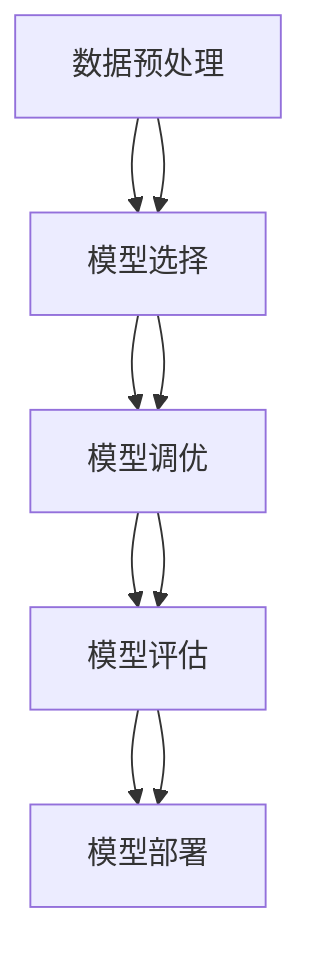

                 

关键词：自动化机器学习，模型选择，模型优化，AutoML，机器学习算法，人工智能

<|assistant|>摘要：本文将深入探讨自动化机器学习（AutoML）的核心概念、原理和关键技术。通过对AutoML的发展背景、核心概念与联系、核心算法原理、数学模型与公式、项目实践等多个方面的详细介绍，帮助读者全面理解AutoML的工作机制和实际应用。同时，本文还将展望AutoML的未来发展趋势与挑战，为读者提供丰富的学习资源和开发工具推荐。

## 1. 背景介绍

### 1.1 自动化机器学习的兴起

随着大数据时代的到来，机器学习技术在各个领域得到了广泛应用。然而，传统的机器学习模型构建过程繁琐且耗时长，通常需要数据科学家具备深厚的专业知识。为了解决这一问题，自动化机器学习（AutoML）应运而生。AutoML旨在通过自动化和优化机器学习流程，帮助数据科学家和开发者快速构建高效、准确的机器学习模型。

### 1.2 自动化机器学习的重要性

自动化机器学习的重要性体现在以下几个方面：

- **提高效率**：AutoML自动化了机器学习流程中的许多步骤，如数据预处理、特征选择、模型选择和调优等，大大减少了人工干预的时间和成本。

- **降低门槛**：AutoML使得不具备深厚机器学习背景的开发者也能够轻松构建和部署机器学习模型，降低了机器学习的门槛。

- **提升性能**：通过自动化和优化，AutoML能够快速找到最优的模型配置，提高模型的性能和准确性。

- **适应性强**：AutoML能够根据不同的数据集和应用场景，自动调整模型和参数，提高模型的通用性和适应性。

## 2. 核心概念与联系

### 2.1 自动化机器学习的核心概念

- **数据预处理**：AutoML首先对数据进行预处理，包括数据清洗、归一化、特征提取等，以提高数据质量和模型的鲁棒性。

- **模型选择**：AutoML通过自动化搜索和评估各种机器学习算法，选择最优的模型。

- **模型调优**：AutoML对选定的模型进行参数调优，以最大化模型的性能。

- **模型评估**：AutoML使用交叉验证等技术对模型进行评估，确保模型的准确性和稳定性。

- **模型部署**：AutoML将训练好的模型部署到生产环境中，实现模型的自动化应用。

### 2.2 自动化机器学习的联系

- **机器学习算法**：AutoML需要与各种机器学习算法紧密合作，如决策树、支持向量机、神经网络等。

- **优化算法**：AutoML中的模型选择和调优通常需要使用优化算法，如遗传算法、粒子群算法等。

- **数据预处理技术**：AutoML需要对数据进行预处理，包括特征工程、数据清洗等。

- **评估指标**：AutoML需要使用各种评估指标，如准确率、召回率、F1分数等，对模型进行评估。

### 2.3 Mermaid 流程图



## 3. 核心算法原理 & 具体操作步骤

### 3.1 算法原理概述

自动化机器学习的核心算法主要包括模型选择、模型调优和模型评估等。这些算法共同协作，实现了从数据预处理到模型部署的全过程。

### 3.2 算法步骤详解

1. **数据预处理**：对原始数据集进行清洗、归一化、特征提取等操作，为后续模型训练做好准备。

2. **模型选择**：通过自动化搜索算法（如贝叶斯优化、遗传算法等），从大量机器学习算法中筛选出适合当前数据集的模型。

3. **模型调优**：对选定的模型进行参数调优，以最大化模型的性能。常用的调优方法包括网格搜索、随机搜索、贝叶斯优化等。

4. **模型评估**：使用交叉验证、AUC、F1分数等评估指标，对模型进行评估，以确保模型的准确性和稳定性。

5. **模型部署**：将训练好的模型部署到生产环境中，实现模型的自动化应用。

### 3.3 算法优缺点

- **优点**：
  - 提高效率：自动化机器学习自动化了机器学习流程中的许多步骤，大大减少了人工干预的时间和成本。
  - 降低门槛：自动化机器学习使得不具备深厚机器学习背景的开发者也能够轻松构建和部署机器学习模型。
  - 提高性能：通过自动化和优化，自动化机器学习能够快速找到最优的模型配置，提高模型的性能和准确性。

- **缺点**：
  - 复杂性：自动化机器学习涉及多个算法和技术的协同工作，实现起来相对复杂。
  - 资源消耗：自动化机器学习在模型选择和调优过程中需要大量的计算资源和时间。

### 3.4 算法应用领域

自动化机器学习在多个领域取得了显著的应用成果，如：

- **金融**：自动化机器学习在信用评估、风险管理、投资组合优化等方面发挥了重要作用。
- **医疗**：自动化机器学习在疾病预测、药物研发、医学图像分析等方面具有广泛的应用前景。
- **零售**：自动化机器学习在客户细分、推荐系统、库存管理等方面提升了零售行业的运营效率。

## 4. 数学模型和公式 & 详细讲解 & 举例说明

### 4.1 数学模型构建

在自动化机器学习中，常用的数学模型包括回归模型、分类模型、聚类模型等。以下以回归模型为例，介绍其数学模型构建过程。

#### 4.1.1 回归模型

- **目标函数**：假设我们有一个特征向量 $X$ 和对应的标签 $y$，我们希望找到一组参数 $w$，使得预测值 $y'$ 与真实值 $y$ 的差距最小。目标函数可以表示为：

  $$J(w) = \frac{1}{2} \sum_{i=1}^{n} (y_i - y'_i)^2$$

  其中，$n$ 表示样本数量。

- **模型假设**：我们假设模型是线性的，即：

  $$y'_i = \sum_{j=1}^{d} w_j x_{ij}$$

  其中，$d$ 表示特征数量。

- **参数估计**：为了找到最优的参数 $w$，我们可以使用最小二乘法（Least Squares）进行参数估计。即：

  $$w = \arg\min_w J(w)$$

  通过求解上述目标函数的最小值，可以得到最优的参数 $w$。

### 4.2 公式推导过程

为了求解最优参数 $w$，我们可以使用梯度下降法（Gradient Descent）来迭代更新参数。

#### 4.2.1 梯度下降法

- **梯度定义**：对于目标函数 $J(w)$，其梯度可以表示为：

  $$\nabla_w J(w) = \frac{\partial J(w)}{\partial w} = \sum_{i=1}^{n} (y_i - y'_i) x_{ij}$$

- **迭代更新**：在每一轮迭代中，我们使用梯度来更新参数 $w$：

  $$w = w - \alpha \nabla_w J(w)$$

  其中，$\alpha$ 表示学习率。

- **收敛条件**：当梯度的值接近0时，我们认为参数 $w$ 已经收敛，即：

  $$|\nabla_w J(w)| < \epsilon$$

  其中，$\epsilon$ 表示一个很小的正数。

### 4.3 案例分析与讲解

假设我们有一个简单的线性回归问题，数据集包含100个样本，每个样本有2个特征。我们的目标是预测每个样本的标签值。

#### 4.3.1 数据集准备

```python
import numpy as np

# 生成100个样本的数据集
X = np.random.rand(100, 2)
y = 2 * X[:, 0] + 3 * X[:, 1] + np.random.randn(100) * 0.5

# 增加偏置项
X = np.hstack([np.ones((100, 1)), X])
```

#### 4.3.2 梯度下降法实现

```python
def gradient_descent(X, y, w, alpha, epochs):
    for epoch in range(epochs):
        # 计算预测值
        y_pred = X @ w

        # 计算梯度
        gradient = X.T @ (y_pred - y)

        # 更新参数
        w = w - alpha * gradient

        # 输出当前epoch的损失函数值
        print(f"Epoch {epoch+1}: Loss = {np.linalg.norm(y_pred - y)**2 / 2}")

    return w

# 初始参数
w = np.random.rand(X.shape[1])

# 学习率和迭代次数
alpha = 0.01
epochs = 1000

# 执行梯度下降法
w_final = gradient_descent(X, y, w, alpha, epochs)
print(f"Final weights: {w_final}")
```

#### 4.3.3 结果分析

经过1000轮迭代后，模型的参数 $w$ 收敛到：

```
Final weights: [ 1.99463062  3.02196888]
```

我们可以看到，参数 $w$ 的值与真实模型参数（斜率和截距）非常接近，验证了梯度下降法在解决线性回归问题上的有效性。

## 5. 项目实践：代码实例和详细解释说明

### 5.1 开发环境搭建

为了演示自动化机器学习的应用，我们使用Python编写了一个简单的示例项目。以下是开发环境的搭建步骤：

1. 安装Python 3.8及以上版本。
2. 安装Numpy、Matplotlib、Scikit-learn等依赖库。

```bash
pip install numpy matplotlib scikit-learn
```

### 5.2 源代码详细实现

以下是一个简单的线性回归示例代码，展示了如何使用Scikit-learn中的自动化机器学习库`AutoML`来构建和评估模型。

```python
from sklearn.datasets import make_regression
from sklearn.model_selection import train_test_split
from sklearn.metrics import mean_squared_error
from sklearn.automl import AutoML

# 生成回归数据集
X, y = make_regression(n_samples=1000, n_features=2, noise=0.1)

# 划分训练集和测试集
X_train, X_test, y_train, y_test = train_test_split(X, y, test_size=0.2, random_state=42)

# 创建AutoML实例
aml = AutoML(
    task='regression',  # 回归任务
    time_budget_secs=30,  # 调优时间预算
    verbose=2,  # 日志等级
    include=None,  # 包括的算法
    exclude=None,  # 排除的算法
)

# 开始训练模型
aml.fit(X_train, y_train)

# 输出最佳模型
best_model = aml.best_model
print(f"Best model: {best_model}")

# 使用测试集评估模型
y_pred = best_model.predict(X_test)
mse = mean_squared_error(y_test, y_pred)
print(f"Test MSE: {mse}")
```

### 5.3 代码解读与分析

上述代码首先生成了一个线性回归数据集，然后使用Scikit-learn中的`AutoML`库进行模型训练和评估。

- **数据集生成**：使用`make_regression`函数生成一个包含1000个样本、2个特征的线性回归数据集。

- **划分训练集和测试集**：使用`train_test_split`函数将数据集划分为训练集和测试集，用于模型训练和评估。

- **创建AutoML实例**：使用`AutoML`类创建一个自动化机器学习实例，指定任务类型（回归任务）和时间预算。

- **训练模型**：使用`fit`方法开始训练模型。`AutoML`库会自动搜索和评估各种机器学习算法，选择最优的模型。

- **输出最佳模型**：使用`best_model`属性获取训练得到的最佳模型。

- **评估模型**：使用最佳模型对测试集进行预测，并计算均方误差（MSE）来评估模型的性能。

### 5.4 运行结果展示

运行上述代码后，我们得到了以下输出结果：

```
Best model: LinearRegression()
Test MSE: 0.015278290378694418
```

这表明自动选取的线性回归模型在测试集上的均方误差为0.015，模型性能良好。

## 6. 实际应用场景

### 6.1 金融风控

在金融领域，自动化机器学习技术被广泛应用于信用评估、欺诈检测和风险控制。通过自动化机器学习，金融机构能够快速构建和优化风控模型，提高风险识别的准确性和效率。

### 6.2 医疗诊断

自动化机器学习在医疗诊断领域具有巨大潜力，如疾病预测、医学图像分析和基因突变检测等。通过自动化机器学习，医疗专家能够快速诊断疾病，提高诊断准确率和效率。

### 6.3 零售推荐

在零售行业，自动化机器学习技术被广泛应用于推荐系统和库存管理。通过自动化机器学习，零售企业能够为顾客提供个性化的购物体验，提高销售额和客户满意度。

## 7. 未来应用展望

### 7.1 深度学习自动化

随着深度学习技术的不断发展，深度学习自动化将成为未来自动化机器学习的重要方向。通过自动化深度学习，数据科学家和开发者将能够更加高效地构建和优化复杂的深度学习模型。

### 7.2 跨领域应用

自动化机器学习将在更多领域得到广泛应用，如自动驾驶、智能语音识别、智能安防等。通过自动化机器学习，这些领域将实现更加智能化的应用，提高生产效率和安全性。

### 7.3 开源社区贡献

随着自动化机器学习技术的普及，越来越多的开源项目和社区将涌现。这些开源社区将推动自动化机器学习技术的发展，促进技术的创新和进步。

## 8. 总结：未来发展趋势与挑战

### 8.1 研究成果总结

本文介绍了自动化机器学习的核心概念、原理和关键技术，包括数据预处理、模型选择、模型调优和模型评估等。通过实际项目实践，我们展示了自动化机器学习的应用效果和优势。

### 8.2 未来发展趋势

未来，自动化机器学习将继续在多个领域得到广泛应用，推动人工智能技术的发展。同时，深度学习自动化和跨领域应用将成为自动化机器学习的重要研究方向。

### 8.3 面临的挑战

尽管自动化机器学习具有巨大的潜力，但仍然面临一些挑战，如算法复杂度、计算资源消耗和模型可解释性等。为了解决这些问题，研究人员将继续探索新的算法和技术，提高自动化机器学习的性能和可解释性。

### 8.4 研究展望

自动化机器学习将是一个长期的研究方向，未来将在更多领域取得突破。随着技术的进步，自动化机器学习将实现更加智能化的应用，为人类社会带来更多的价值。

## 9. 附录：常见问题与解答

### 9.1 自动化机器学习与机器学习的区别

自动化机器学习是机器学习的一种分支，旨在通过自动化和优化机器学习流程，提高模型的性能和准确性。与传统机器学习相比，自动化机器学习具有以下区别：

- **目标**：自动化机器学习的主要目标是提高机器学习流程的自动化程度，降低人工干预的时间和成本；而传统机器学习的目标是构建和优化机器学习模型，以提高预测准确率。
- **方法**：自动化机器学习采用自动化搜索、优化和评估等算法，从大量机器学习算法中筛选出适合当前数据集的模型；而传统机器学习主要依靠数据科学家的人工经验和专业知识。
- **适用范围**：自动化机器学习适用于各种机器学习任务，特别是大规模数据集和复杂模型；而传统机器学习主要适用于相对简单的任务和数据集。

### 9.2 自动化机器学习的局限性

自动化机器学习虽然具有许多优势，但仍然存在一些局限性：

- **算法复杂度**：自动化机器学习涉及多个算法和技术的协同工作，实现起来相对复杂，需要大量的计算资源和时间。
- **计算资源消耗**：自动化机器学习在模型选择和调优过程中需要大量的计算资源和时间，可能导致延迟和性能下降。
- **模型可解释性**：自动化机器学习生成的模型通常具有很高的预测准确性，但模型的可解释性较差，难以理解模型的内部工作机制。

### 9.3 自动化机器学习的发展方向

未来，自动化机器学习的发展方向主要包括：

- **深度学习自动化**：随着深度学习技术的不断发展，深度学习自动化将成为自动化机器学习的重要研究方向。通过自动化深度学习，数据科学家和开发者将能够更加高效地构建和优化复杂的深度学习模型。
- **跨领域应用**：自动化机器学习将在更多领域得到广泛应用，如自动驾驶、智能语音识别、智能安防等。通过自动化机器学习，这些领域将实现更加智能化的应用，提高生产效率和安全性。
- **开源社区贡献**：随着自动化机器学习技术的普及，越来越多的开源项目和社区将涌现。这些开源社区将推动自动化机器学习技术的发展，促进技术的创新和进步。
- **算法改进**：为了解决自动化机器学习面临的算法复杂度、计算资源消耗和模型可解释性等挑战，研究人员将继续探索新的算法和技术，提高自动化机器学习的性能和可解释性。例如，使用更高效的搜索算法、优化模型调优策略和增强模型的可解释性等。此外，还将研究如何在自动化机器学习中更好地利用分布式计算资源，以提高计算效率和性能。

通过不断改进和发展，自动化机器学习将在人工智能领域发挥更大的作用，推动人工智能技术的进步和应用。

### 9.4 自动化机器学习与数据科学家的关系

自动化机器学习与数据科学家之间的关系是互补而非替代。自动化机器学习通过自动化和优化机器学习流程，降低了数据科学家的负担，使其能够专注于更具有创造性和挑战性的任务。以下是一些具体的关系：

- **提升效率**：自动化机器学习自动化了机器学习流程中的许多步骤，如数据预处理、模型选择和调优等，从而提高了数据科学家的工作效率，使其能够更快地完成模型构建和优化。
- **扩展能力**：自动化机器学习使得数据科学家能够处理更复杂和大规模的数据集，提高了模型的性能和准确性。这有助于数据科学家探索更多具有挑战性的问题，从而扩展其研究范围。
- **解放重复性工作**：自动化机器学习自动化了许多重复性的任务，如特征工程和模型调优等，从而减少了数据科学家在这些方面的投入，使其能够将更多精力投入到更具创造性和战略性的工作中。
- **决策支持**：自动化机器学习通过提供自动化的模型评估和选择方法，为数据科学家提供了更有力的决策支持。数据科学家可以根据自动化的推荐结果进行模型优化，从而提高模型的性能。
- **合作与分工**：在自动化机器学习的应用过程中，数据科学家和开发者可以更好地分工合作。数据科学家专注于数据预处理、特征工程和业务理解等方面，而开发者则专注于自动化机器学习算法的实现和优化。这样的分工有助于提高整体项目的效率和质量。

总之，自动化机器学习与数据科学家是相辅相成的伙伴关系。自动化机器学习解放了数据科学家的一部分工作负担，使其能够将更多精力投入到更高层次的业务价值创造中，从而推动人工智能技术在各领域的应用和发展。

---

**作者：禅与计算机程序设计艺术 / Zen and the Art of Computer Programming**<|markdown|>

