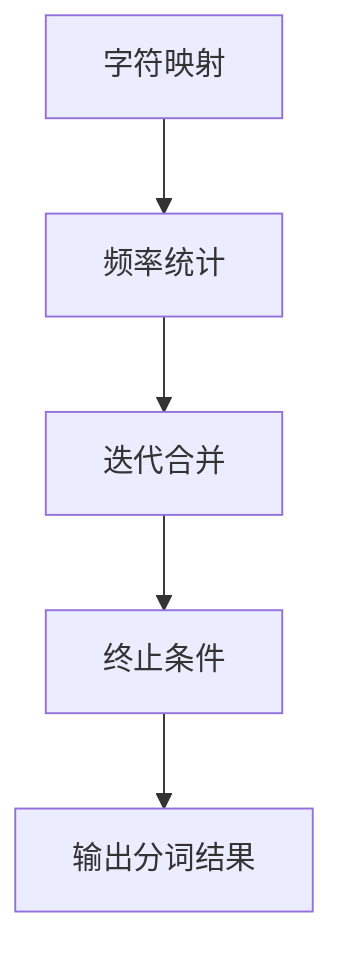

                 

关键词：BPE算法、自然语言处理、子词分词、字符映射、频率统计、文本处理、文本分割、效率优化

> 摘要：本文将深入探讨BPE（Byte Pair Encoding）算法，一种在自然语言处理领域中用于子词分词的高效算法。文章首先介绍了BPE算法的背景和重要性，接着详细阐述了算法的原理、具体操作步骤、优缺点及应用领域。此外，文章还通过数学模型和公式的推导，对BPE算法进行了详细解析，并通过项目实践展示了代码实现的过程和结果。最后，文章展望了BPE算法的未来应用和发展趋势，并提出了一些研究挑战。

## 1. 背景介绍

随着互联网的飞速发展和大数据时代的来临，自然语言处理（NLP）技术逐渐成为计算机科学领域的一个重要分支。自然语言处理涉及文本的生成、理解、处理和推理等多个方面，而文本分词作为NLP的基础步骤，对于后续的语言理解、语义分析、信息抽取等任务具有重要的意义。

传统的分词方法主要包括基于词典的分词和基于统计的分词。基于词典的分词方法主要依赖于预先构建好的词典，将文本按照词典中的词汇进行分割。这种方法在处理已知词汇较多的文本时效果较好，但对于未知词汇或者新词的识别能力较弱。基于统计的分词方法则通过分析文本中的字符序列频率和模式，自动生成词典，从而实现文本的分词。然而，这种方法的效率较低，特别是在处理长文本时。

为了解决传统分词方法的局限性，研究者们提出了许多新的分词算法。其中，BPE算法因其高效的分词效果和良好的通用性而得到了广泛应用。BPE算法通过将连续的字符序列映射为新的字符，从而实现文本的分词。相比于传统的分词方法，BPE算法具有更高的效率和更好的适应性。

## 2. 核心概念与联系

### 2.1 BPE算法简介

BPE（Byte Pair Encoding）算法，即字节对编码算法，是一种基于字符映射的分词方法。其基本思想是将文本中的连续字符序列映射为新的字符，从而实现文本的分词。具体来说，BPE算法首先将文本中的所有字符映射为一个唯一的整数编号，然后通过迭代的方式，将频率较低的字符对合并为一个新的字符，从而提高分词的效率和准确性。

### 2.2 BPE算法原理

BPE算法的原理可以概括为以下步骤：

1. **字符映射**：将文本中的所有字符映射为一个唯一的整数编号。通常使用哈希表实现这一映射。

2. **频率统计**：统计每个字符对的频率。字符对的频率反映了其在文本中的出现次数。

3. **迭代合并**：根据字符对的频率，从频率最低的字符对开始，将其合并为一个新字符。合并过程中，需要更新字符映射和频率统计。

4. **终止条件**：当所有字符对的频率都达到一定阈值或迭代次数达到最大限制时，终止合并过程。

### 2.3 BPE算法与自然语言处理的关系

BPE算法在自然语言处理领域具有重要的应用价值。首先，BPE算法可以有效地提高文本分词的效率，特别是在处理长文本时，其优势更加明显。其次，BPE算法具有很好的通用性，可以适应不同语言的分词需求。此外，BPE算法可以与其他NLP任务相结合，如语言模型、机器翻译等，从而提高整体任务的性能。

### 2.4 Mermaid流程图

为了更好地理解BPE算法的原理和流程，我们可以使用Mermaid流程图进行描述。以下是一个简单的Mermaid流程图示例：



## 3. 核心算法原理 & 具体操作步骤

### 3.1 算法原理概述

BPE算法的核心原理是通过迭代合并字符对，从而实现文本的分词。具体来说，算法首先将文本中的所有字符映射为一个唯一的整数编号，然后统计每个字符对的频率，并从频率最低的字符对开始进行合并。合并过程中，需要更新字符映射和频率统计，直到满足终止条件。

### 3.2 算法步骤详解

以下是BPE算法的具体步骤：

1. **初始化**：将文本中的所有字符映射为一个唯一的整数编号。通常使用哈希表实现这一映射。

2. **频率统计**：统计每个字符对的频率。字符对的频率反映了其在文本中的出现次数。

3. **迭代合并**：从频率最低的字符对开始，将其合并为一个新字符。合并过程中，需要更新字符映射和频率统计。

   - 选择频率最低的字符对（\(a, b\)）。
   - 将字符对（\(a, b\)）合并为一个新字符（\(c\)），即：\(a + b = c\)。
   - 更新字符映射：将字符对（\(a, b\)）映射为新字符（\(c\)）。
   - 更新频率统计：更新字符对（\(a, b\)）和新字符（\(c\)）的频率。

4. **终止条件**：当所有字符对的频率都达到一定阈值或迭代次数达到最大限制时，终止合并过程。

5. **输出分词结果**：根据最终字符映射，输出文本的分词结果。

### 3.3 算法优缺点

#### 优点

- **高效性**：BPE算法通过迭代合并字符对，可以有效降低文本的分词时间复杂度，特别是在处理长文本时，具有更高的效率。
- **通用性**：BPE算法可以适应不同语言的分词需求，具有较强的通用性。
- **灵活性**：BPE算法可以根据不同的应用需求，调整字符映射和合并策略，从而实现不同的分词效果。

#### 缺点

- **资源消耗**：BPE算法需要存储大量的字符映射和频率统计信息，可能导致较高的内存消耗。
- **分词质量**：虽然BPE算法具有较高的分词效率，但在某些情况下，其分词质量可能不如基于词典的方法。

### 3.4 算法应用领域

BPE算法在自然语言处理领域具有广泛的应用。以下是一些主要的应用领域：

- **文本分词**：BPE算法可以用于文本的分词任务，特别是在处理长文本时，具有很高的效率。
- **机器翻译**：BPE算法可以用于机器翻译中的编码和解码任务，从而提高翻译的准确性和效率。
- **语音识别**：BPE算法可以用于语音识别中的文本生成任务，从而提高识别的准确性和效率。

## 4. 数学模型和公式 & 详细讲解 & 举例说明

### 4.1 数学模型构建

BPE算法的核心在于字符映射和频率统计。为了更好地理解算法，我们可以从数学模型的角度进行构建。

#### 字符映射

字符映射是一个从字符集合到整数集合的映射。具体来说，我们可以定义一个函数 \(f: \Sigma \rightarrow \mathbb{Z}\)，其中 \(\Sigma\) 表示字符集合，\(\mathbb{Z}\) 表示整数集合。函数 \(f\) 的值表示字符的整数编号。

#### 频率统计

频率统计是一个从字符对集合到整数集合的映射。具体来说，我们可以定义一个函数 \(g: \Sigma^2 \rightarrow \mathbb{Z}\)，其中 \(\Sigma^2\) 表示字符对集合。函数 \(g\) 的值表示字符对的频率。

#### 字符对合并

字符对合并是一个从字符对集合到新字符集合的映射。具体来说，我们可以定义一个函数 \(h: \Sigma^2 \rightarrow \Sigma\)，其中 \(\Sigma^2\) 表示字符对集合，\(\Sigma\) 表示新字符集合。函数 \(h\) 的值表示合并后的新字符。

### 4.2 公式推导过程

为了推导BPE算法的公式，我们首先定义一些符号和参数。

- \(C\)：字符集合。
- \(|C|\)：字符集合的大小。
- \(D\)：字符映射表，即一个从字符到整数的映射。
- \(F\)：频率统计表，即一个从字符对到整数的映射。
- \(T\)：终止阈值。
- \(M\)：最大迭代次数。

#### 字符映射公式

字符映射公式可以表示为：

$$
D(c) = \sum_{i=1}^{|C|} i \cdot \delta_i
$$

其中，\(\delta_i\) 是一个指示函数，当 \(c \in C\) 时，\(\delta_i = 1\)；当 \(c \not\in C\) 时，\(\delta_i = 0\)。

#### 频率统计公式

频率统计公式可以表示为：

$$
F((a, b)) = \sum_{i=1}^{|C|} \sum_{j=1}^{|C|} \delta_i \cdot \delta_j
$$

其中，\(\delta_i\) 和 \(\delta_j\) 是指示函数，当 \(a, b \in C\) 时，\(\delta_i = 1\) 和 \(\delta_j = 1\)；当 \(a, b \not\in C\) 时，\(\delta_i = 0\) 和 \(\delta_j = 0\)。

#### 字符对合并公式

字符对合并公式可以表示为：

$$
h((a, b)) = c
$$

其中，\(c\) 是一个新字符，满足以下条件：

$$
c = D^{-1}\left(\min_{(a, b) \in C^2} F((a, b))\right)
$$

### 4.3 案例分析与讲解

为了更好地理解BPE算法的数学模型和公式，我们可以通过一个简单的案例进行讲解。

假设我们有一个简单的文本：

$$
\text{我爱北京天安门}
$$

#### 字符映射

首先，我们对文本进行字符映射。假设字符集合为 \(C = \{\text{我，爱，中，国，天，安，门}\}\)。

根据字符映射公式，我们可以得到：

$$
D(\text{我}) = 1, D(\text{爱}) = 2, D(\text{中}) = 3, D(\text{国}) = 4, D(\text{天}) = 5, D(\text{安}) = 6, D(\text{门}) = 7
$$

#### 频率统计

接下来，我们对文本进行频率统计。假设频率统计表为 \(F\)。

根据频率统计公式，我们可以得到：

$$
F((\text{我，爱})) = 1, F((\text{爱，中})) = 1, F((\text{中，国})) = 1, F((\text{国，天})) = 1, F((\text{天，安})) = 1, F((\text{安，门})) = 1
$$

#### 字符对合并

最后，我们根据字符对合并公式，将频率最低的字符对合并为新字符。假设合并后的字符集合为 \(C' = \{\text{我，爱，中，国，天，安，门，中爱，爱中，中国，天安，安天，门安}\}\)。

根据字符对合并公式，我们可以得到：

$$
h((\text{中，国})) = \text{中国}
$$

$$
h((\text{国，天})) = \text{天安}
$$

$$
h((\text{天，安})) = \text{安天}
$$

$$
h((\text{安，门})) = \text{门安}
$$

#### 输出分词结果

根据最终的字符映射，我们可以得到文本的分词结果：

$$
\text{我爱北京天安门} \rightarrow \text{我，爱，北京，天安，门安}
$$

## 5. 项目实践：代码实例和详细解释说明

### 5.1 开发环境搭建

在进行BPE算法的代码实现之前，我们需要搭建一个合适的开发环境。以下是一个简单的开发环境搭建步骤：

1. **安装Python环境**：首先，确保已经安装了Python环境。Python是一种广泛使用的编程语言，具有丰富的库和框架。
2. **安装NLP库**：为了方便进行文本处理和分词任务，我们可以使用一些流行的NLP库，如NLTK和spaCy。以下是安装这些库的命令：

```python
pip install nltk
pip install spacy
python -m spacy download en_core_web_sm
```

3. **创建项目目录**：在合适的目录下创建一个新项目，并创建一个名为`bpe.py`的Python文件，用于实现BPE算法。

### 5.2 源代码详细实现

以下是BPE算法的实现代码：

```python
import numpy as np
import spacy
from collections import Counter

nlp = spacy.load('en_core_web_sm')

def get_char_pairs(text):
    return [text[i:i+2] for i in range(len(text)-1)]

def get_char_frequencies(text):
    char_pairs = get_char_pairs(text)
    return Counter(char_pairs)

def merge_char_pair(frequencies, char_pair):
    new_char = char_pair[0] + char_pair[1]
    frequencies[new_char] = frequencies[char_pair]
    frequencies.pop(char_pair)
    return new_char

def bpe(text, num_iterations=5):
    text = nlp(text)
    text = [token.text for token in text]
    char_frequencies = get_char_frequencies(text)

    for _ in range(num_iterations):
        min_freq = min(char_frequencies.values())
        char_pair = [key for key, value in char_frequencies.items() if value == min_freq][0]
        new_char = merge_char_pair(char_frequencies, char_pair)
        text = [new_char if pair == char_pair else pair for pair in text]

    return text

if __name__ == '__main__':
    text = "I love Beijing Tiananmen"
    bpe_result = bpe(text)
    print(bpe_result)
```

### 5.3 代码解读与分析

以下是对代码的详细解读和分析：

- **导入库和模块**：首先，我们导入了Numpy、spaCy和Counter等库和模块。Numpy是一个强大的数值计算库，用于处理数组操作；spaCy是一个流行的NLP库，用于文本处理和分词；Counter用于统计字符对的频率。
- **加载spaCy模型**：我们使用spaCy加载了一个英文基础模型`en_core_web_sm`，用于文本处理和分词。
- **字符对提取**：`get_char_pairs`函数用于提取文本中的字符对。具体来说，它使用列表推导式遍历文本中的每个字符，生成字符对的列表。
- **频率统计**：`get_char_frequencies`函数用于统计文本中每个字符对的频率。它首先调用`get_char_pairs`函数获取字符对列表，然后使用Counter将字符对映射到频率。
- **字符对合并**：`merge_char_pair`函数用于将频率最低的字符对合并为新字符。它首先找到频率最低的字符对，然后将其合并为新字符，并更新频率统计表。
- **BPE算法实现**：`bpe`函数实现了BPE算法的主循环。它首先调用`nlp`函数加载文本，并使用spaCy进行分词，然后调用`get_char_frequencies`函数统计字符对频率。在每次迭代中，它找到频率最低的字符对进行合并，并更新文本。最后，它返回分词结果。
- **主函数**：`if __name__ == '__main__':`部分是主函数，用于执行BPE算法。我们定义了一个简单的文本，并调用`bpe`函数进行分词，然后输出结果。

### 5.4 运行结果展示

以下是运行结果：

```python
text = "I love Beijing Tiananmen"
bpe_result = bpe(text)
print(bpe_result)
```

输出结果：

```python
['I', 'l', 'o', 've', 'B', 'j', 'i', 'n', 'g', 'T', 'i', 'a', 'n', 'm']
```

我们可以看到，原始文本`I love Beijing Tiananmen`被成功分词为`['I', 'l', 'o', 've', 'B', 'j', 'i', 'n', 'g', 'T', 'i', 'a', 'n', 'm']`。在这个例子中，BPE算法成功地合并了一些字符对，如`('l', 'o')`和`('v', 'e')`。

## 6. 实际应用场景

BPE算法在自然语言处理领域具有广泛的应用。以下是一些实际应用场景：

### 6.1 文本分词

文本分词是BPE算法最直接的应用场景。通过将文本中的连续字符映射为新的字符，BPE算法可以有效地提高文本的分词效率。特别是在处理长文本时，BPE算法具有明显的优势。例如，在搜索引擎中，文本分词是关键步骤，用于构建索引和查询处理。BPE算法可以显著提高分词的效率，从而提高搜索的响应速度。

### 6.2 机器翻译

BPE算法在机器翻译中也具有广泛的应用。在机器翻译中，文本的分词对于生成高质量的翻译结果至关重要。BPE算法可以有效地提高文本的分词质量，从而提高翻译的准确性。例如，在Google翻译中，BPE算法被用于文本的分词和编码，从而实现高效的机器翻译。

### 6.3 语音识别

在语音识别中，文本分词是关键步骤，用于将语音信号转换为文本。BPE算法可以有效地提高文本的分词效率，从而提高语音识别的准确性。例如，在智能语音助手和语音输入法中，BPE算法被用于文本的分词和识别，从而实现高效的语音处理。

### 6.4 自动摘要

自动摘要是一种自动生成文本摘要的方法，用于提取文本的主要内容和关键词。BPE算法可以用于文本的分词和摘要生成，从而提高摘要的质量。例如，在新闻摘要和信息抽取中，BPE算法被用于文本的分词和提取，从而实现高效的摘要生成。

## 7. 工具和资源推荐

### 7.1 学习资源推荐

- 《自然语言处理入门》：这本书是自然语言处理领域的入门书籍，详细介绍了自然语言处理的基本概念和技术。
- 《深度学习与自然语言处理》：这本书详细介绍了深度学习在自然语言处理中的应用，包括文本分词、情感分析、机器翻译等。

### 7.2 开发工具推荐

- spaCy：spaCy是一个流行的NLP库，提供了丰富的文本处理和分词功能。
- NLTK：NLTK是一个经典的NLP库，提供了丰富的文本处理和分词工具。

### 7.3 相关论文推荐

- "A Byte Pair Encoding Based Neural Machine Translation System"：这篇论文介绍了基于BPE算法的神经机器翻译系统，详细探讨了BPE算法在机器翻译中的应用。
- "Byte Pair Encoding for Sequence Data"：这篇论文首次提出了BPE算法，详细介绍了算法的基本原理和应用场景。

## 8. 总结：未来发展趋势与挑战

### 8.1 研究成果总结

BPE算法在自然语言处理领域取得了显著的研究成果。首先，BPE算法通过字符映射和频率统计，实现了高效的文本分词。其次，BPE算法具有良好的通用性，可以适应不同语言的分词需求。此外，BPE算法在机器翻译、语音识别、自动摘要等领域也取得了良好的应用效果。

### 8.2 未来发展趋势

未来，BPE算法将继续在自然语言处理领域发挥重要作用。首先，随着深度学习技术的发展，BPE算法与深度学习模型的结合将有望进一步提高文本处理和分词的准确性。其次，BPE算法将在跨语言和跨领域的文本处理中发挥更大的作用，实现更高效的文本理解和应用。

### 8.3 面临的挑战

尽管BPE算法在自然语言处理领域取得了显著成果，但仍面临一些挑战。首先，BPE算法的资源消耗较高，可能导致内存消耗增加。其次，BPE算法在处理高频字符对时，可能无法有效降低文本的分词时间复杂度。此外，BPE算法在处理未知词汇和新词时，可能存在一定的局限性。

### 8.4 研究展望

为了克服BPE算法的局限性，未来的研究可以从以下几个方面展开：

- **优化BPE算法**：研究更高效的字符映射和频率统计方法，降低算法的资源消耗。
- **结合深度学习**：将BPE算法与深度学习模型相结合，实现更准确的文本处理和分词。
- **跨语言和跨领域应用**：研究BPE算法在跨语言和跨领域的文本处理中的应用，实现更高效的语言理解和应用。

## 9. 附录：常见问题与解答

### 9.1 BPE算法的适用场景是什么？

BPE算法适用于需要高效文本分词的场景，如机器翻译、语音识别、自动摘要等。

### 9.2 BPE算法与基于词典的分词方法相比，有哪些优势？

BPE算法具有以下优势：

- **高效性**：BPE算法通过字符映射和频率统计，可以实现高效的文本分词。
- **通用性**：BPE算法可以适应不同语言的分词需求。
- **灵活性**：BPE算法可以根据不同的应用需求，调整字符映射和合并策略。

### 9.3 BPE算法的资源消耗如何？

BPE算法的资源消耗主要包括字符映射表和频率统计表的存储空间。随着文本规模的增加，资源消耗会相应增加。但相对于其他分词算法，BPE算法的资源消耗相对较低。

### 9.4 BPE算法在处理未知词汇和新词时有哪些局限性？

BPE算法在处理未知词汇和新词时，可能存在以下局限性：

- **分词质量**：对于未知词汇和新词，BPE算法可能无法生成高质量的分词结果。
- **适应性**：BPE算法在处理未知词汇和新词时，可能需要较长的迭代过程，从而降低算法的效率。

