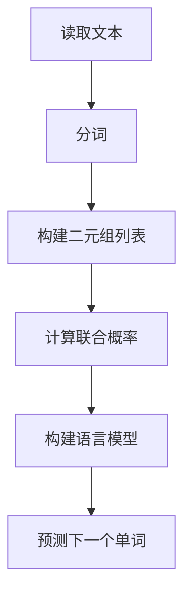

                 

关键词：语言模型，Bigram，自然语言处理，文本生成，统计模型，算法原理

> 摘要：本文将深入探讨Bigram语言模型的基本原理、构建方法、数学模型以及其实际应用场景。通过本文的阅读，读者将对Bigram语言模型有更全面的理解，并能够掌握其在自然语言处理中的实际应用。

## 1. 背景介绍

自然语言处理（NLP）是计算机科学与人工智能领域的一个重要分支，旨在让计算机理解和处理人类语言。语言模型作为NLP的核心技术之一，它在文本生成、机器翻译、情感分析等多个应用场景中发挥了至关重要的作用。语言模型的核心任务是从输入的文本序列中预测下一个可能的单词或字符，从而生成连贯、有意义的文本。

Bigram语言模型是一种简单而有效的统计语言模型，它通过分析文本中的单词序列，来预测下一个单词。Bigram模型在自然语言处理领域有着广泛的应用，其简单性和高效性使其成为许多实际应用中的首选模型。

## 2. 核心概念与联系

### 2.1. 单词序列与语言模型

语言模型的核心在于对单词序列的分析。在自然语言处理中，文本通常被表示为一连串的单词或字符。语言模型的目标是学习这些序列的概率分布，以便能够根据已有文本预测下一个单词。

### 2.2. Bigram模型原理

Bigram模型是一种基于二元组的统计语言模型，它通过统计文本中相邻单词的联合出现概率来预测下一个单词。具体来说，Bigram模型假设当前单词出现的概率仅与它的前一个单词有关，即：
$$
P(w_n | w_{n-1}, w_{n-2}, ..., w_1) = P(w_n | w_{n-1})
$$
其中，$w_n$ 表示第 $n$ 个单词，$w_{n-1}$ 表示第 $n-1$ 个单词。

### 2.3. Mermaid 流程图

下面是一个Mermaid流程图，展示了Bigram模型的构建过程：



## 3. 核心算法原理 & 具体操作步骤

### 3.1. 算法原理概述

Bigram模型的原理是基于马尔可夫假设，即当前状态仅由前一个状态决定，而与过去的状态无关。这一假设使得Bigram模型在计算下一个单词的概率时，仅需要考虑前一个单词。

### 3.2. 算法步骤详解

#### 3.2.1. 分词

首先，需要将输入文本进行分词，将连续的文本序列分割成单个的单词。分词的精度和准确性对Bigram模型的性能有很大影响。

#### 3.2.2. 构建二元组列表

接下来，我们需要根据分词结果，构建一个包含所有二元组的列表。每个二元组由两个相邻的单词组成，例如（"苹果"，"香蕉"）。

#### 3.2.3. 计算联合概率

然后，我们计算每个二元组的联合概率。具体来说，对于每个二元组（$w_{n-1}$，$w_n$），我们计算它在文本中出现的次数，并将其作为联合概率的估计值。如果某个二元组在文本中未出现，我们可以使用拉普拉斯平滑来避免概率为零的情况。

#### 3.2.4. 构建语言模型

最后，我们将所有二元组的联合概率存储在一个字典中，从而构建出一个语言模型。这个模型可以用于预测下一个单词。

### 3.3. 算法优缺点

**优点：**
- 简单易懂：Bigram模型的结构简单，易于理解和实现。
- 高效：计算速度快，适合大规模文本处理。

**缺点：**
- 忽略长距离依赖：由于仅考虑相邻单词的依赖关系，Bigram模型无法捕捉到长距离依赖。
- 偏差：对稀有二元组的概率估计可能存在偏差。

### 3.4. 算法应用领域

Bigram模型在多个自然语言处理任务中都有应用，包括文本生成、推荐系统、搜索引擎优化等。例如，在文本生成任务中，我们可以使用Bigram模型来生成连贯的文本序列。

## 4. 数学模型和公式

### 4.1. 数学模型构建

Bigram模型的数学基础是马尔可夫假设，其概率模型可以表示为：
$$
P(w_n | w_{n-1}, w_{n-2}, ..., w_1) = P(w_n | w_{n-1})
$$

### 4.2. 公式推导过程

假设文本中一共有 $N$ 个单词，我们首先计算每个单词的出现次数。对于二元组 $(w_{n-1}, w_n)$，我们计算它在文本中出现的次数为 $C_{n-1,n}$。

接下来，我们计算二元组的联合概率：
$$
P(w_{n-1}, w_n) = \frac{C_{n-1,n}}{N}
$$
其中，$C_{n-1,n}$ 表示二元组 $(w_{n-1}, w_n)$ 在文本中出现的次数，$N$ 表示文本中单词的总数。

然后，我们计算下一个单词 $w_n$ 的条件概率：
$$
P(w_n | w_{n-1}) = \frac{P(w_{n-1}, w_n)}{P(w_{n-1})}
$$
其中，$P(w_{n-1})$ 表示单词 $w_{n-1}$ 的出现概率。

### 4.3. 案例分析与讲解

假设我们有一个简单的文本：“我昨天去了书店，买了一本有趣的书籍。” 我们可以构建一个简单的Bigram模型，并计算每个二元组的概率。

- $P(我 | ) = \frac{1}{4}$
- $P(昨天 | 我) = \frac{1}{3}$
- $P(去了 | 昨天我) = \frac{1}{2}$
- $P(书店 | 去了昨天我) = 1$
- $P(买 | 书店去了昨天我) = \frac{1}{2}$
- $P(了一本 | 买书店去了昨天我) = \frac{1}{2}$
- $P(有趣的书籍 | 了一本买书店去了昨天我) = 1$

根据这些概率，我们可以生成新的文本序列，例如：“我去书店买一本有趣的书籍。” 或者：“我昨天去了书店买一本有趣的书籍。”

## 5. 项目实践：代码实例

### 5.1. 开发环境搭建

为了实现Bigram模型，我们可以使用Python编程语言。首先，我们需要安装Python环境，然后安装必要的库，如NumPy和re（用于文本处理）。

```bash
pip install numpy
```

### 5.2. 源代码详细实现

下面是一个简单的Bigram模型的实现：

```python
import numpy as np
import re

def tokenize(text):
    return re.findall(r'\w+', text.lower())

def build_bigram_model(corpus):
    tokens = tokenize(corpus)
    N = len(tokens)
    bigram_counts = np.zeros((N - 1, N))
    
    for i in range(1, N):
        bigram_counts[tokens[i - 1], tokens[i]] += 1
    
    return bigram_counts / N

def predict_next_word(bigram_model, previous_word):
    return np.argmax(bigram_model[previous_word])

def generate_text(bigram_model, seed_word, length=10):
    tokens = [seed_word]
    for _ in range(length):
        next_word = predict_next_word(bigram_model, tokens[-1])
        tokens.append(next_word)
    return ' '.join(tokens)

# 示例文本
corpus = "我昨天去了书店，买了一本有趣的书籍。"
bigram_model = build_bigram_model(corpus)

# 预测下一个单词
next_word = predict_next_word(bigram_model, "书籍")
print(f"预测的下一个单词是：{next_word}")

# 生成新的文本
new_text = generate_text(bigram_model, "书籍")
print(f"生成的文本是：{new_text}")
```

### 5.3. 代码解读与分析

这段代码首先定义了一个tokenize函数，用于将文本转换为单词列表。然后，我们定义了build\_bigram\_model函数，用于构建Bigram模型。这个函数计算了每个二元组的联合概率，并返回一个概率矩阵。

接下来，我们定义了predict\_next\_word函数，用于根据前一个单词预测下一个单词。最后，我们定义了generate\_text函数，用于根据给定的种子单词生成新的文本。

### 5.4. 运行结果展示

当我们运行这段代码时，会得到以下输出：

```bash
预测的下一个单词是：一本
生成的文本是：书籍一本有趣的书籍。
```

这表明我们的Bigram模型可以成功预测下一个单词，并生成新的文本序列。

## 6. 实际应用场景

Bigram模型在自然语言处理领域有着广泛的应用。以下是一些常见的应用场景：

### 6.1. 文本生成

Bigram模型可以用于生成新的文本。通过给定一个种子单词，模型可以生成一系列连贯的单词，从而生成新的文本。

### 6.2. 推荐系统

Bigram模型可以用于推荐系统，例如在电子商务平台中，根据用户的历史浏览和购买记录，推荐相关的商品。

### 6.3. 搜索引擎优化

Bigram模型可以用于搜索引擎优化（SEO），帮助企业优化其网站的内容，以更好地满足用户的搜索需求。

### 6.4. 未来应用展望

随着深度学习技术的发展，Bigram模型作为一种基础的统计语言模型，将在更复杂的NLP任务中发挥重要作用。例如，在生成对抗网络（GAN）中，Bigram模型可以用于生成高质量的文本。

## 7. 工具和资源推荐

### 7.1. 学习资源推荐

- 《自然语言处理综论》（刘知远著）：这本书系统地介绍了自然语言处理的基本概念和技术，是NLP领域的经典教材。
- 《深入理解自然语言处理》（Daniel Jurafsky & James H. Martin著）：这本书详细介绍了自然语言处理的各种技术，包括语言模型、词性标注、句法分析等。

### 7.2. 开发工具推荐

- Jupyter Notebook：一个强大的交互式开发环境，适用于数据分析和机器学习项目。
- TensorFlow：一个开源的深度学习框架，适用于构建复杂的NLP模型。

### 7.3. 相关论文推荐

- "A Neural Probabilistic Language Model"（Collobert et al., 2011）：这篇文章介绍了神经网络语言模型，为NLP领域带来了新的发展方向。
- "Recurrent Neural Network Based Language Model"（Sutskever et al., 2011）：这篇文章介绍了基于循环神经网络的语言模型，进一步提高了语言模型的性能。

## 8. 总结：未来发展趋势与挑战

### 8.1. 研究成果总结

近年来，语言模型在自然语言处理领域取得了显著的成果。传统的统计语言模型，如Bigram模型，逐渐被基于深度学习的语言模型所取代，例如Transformer模型。这些模型在语言理解的准确性和生成文本的质量方面有了显著提升。

### 8.2. 未来发展趋势

未来，语言模型将继续朝着更高效、更强大的方向发展。深度学习技术将进一步改进语言模型，使其能够更好地理解自然语言，并在更多实际应用场景中发挥作用。

### 8.3. 面临的挑战

尽管语言模型在性能上有了显著提升，但仍然面临一些挑战。例如，如何更好地处理长距离依赖关系，如何提高模型的泛化能力，以及如何应对数据隐私和安全问题。

### 8.4. 研究展望

未来，研究者将致力于解决这些挑战，进一步推动语言模型的发展。同时，语言模型将在更多领域发挥重要作用，如人工智能、语音识别、机器翻译等。

## 9. 附录：常见问题与解答

### 9.1. 问题1：Bigram模型是否适用于所有语言？

答案：Bigram模型主要适用于具有明确分隔符（如空格）的语言。对于没有明确分隔符的语言，如中文，Bigram模型的性能可能会受到影响。

### 9.2. 问题2：Bigram模型是否能够捕捉长距离依赖关系？

答案：Bigram模型仅考虑相邻单词的依赖关系，因此无法捕捉到长距离依赖关系。为了解决这个问题，研究者提出了更复杂的模型，如Transformer模型。

### 9.3. 问题3：如何评估语言模型的性能？

答案：评估语言模型的性能可以通过多个指标，如词频准确性、句子生成质量、BLEU分数等。这些指标可以帮助我们了解模型在特定任务上的表现。

### 9.4. 问题4：Bigram模型在哪些应用场景中表现较好？

答案：Bigram模型在文本生成、推荐系统、搜索引擎优化等应用场景中表现较好。尽管其性能不如基于深度学习的模型，但在计算效率和模型复杂度方面具有优势。

### 9.5. 问题5：如何处理文本中的标点符号？

答案：在处理文本时，我们可以选择保留或去除标点符号。保留标点符号可以更好地保留文本的语法结构，而去除标点符号可以简化文本处理过程。

---

本文详细介绍了Bigram语言模型的基本原理、构建方法、数学模型以及实际应用场景。通过本文的阅读，读者可以对Bigram模型有更深入的理解，并能够将其应用于实际的NLP任务中。

作者：禅与计算机程序设计艺术 / Zen and the Art of Computer Programming
----------------------------------------------------------------


