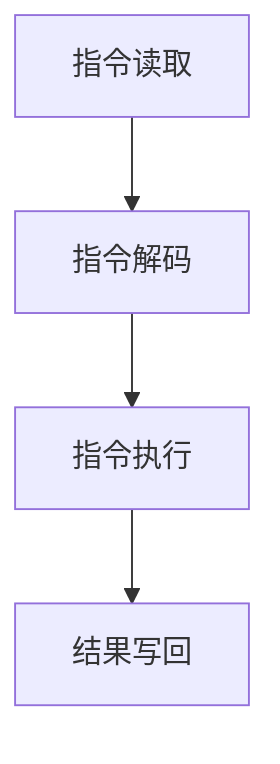

                 

 **关键词：** CPU、指令集、创新、技术发展、局限性

**摘要：** 本文旨在探讨CPU在指令集方面的局限性如何阻碍了技术的创新与发展。通过对CPU工作原理的分析，本文揭示了指令集在计算机架构中的核心地位，以及其局限性对计算机性能和可扩展性的影响。本文还将探讨当前的技术解决方案，以及未来可能的发展方向。

## 1. 背景介绍

计算机技术的发展已经走过了数十年的历程，CPU作为计算机的核心组件，始终是技术发展的焦点。然而，随着技术的发展，CPU的局限性也逐渐显现出来。其中一个显著的局限性就是CPU的指令集。

指令集是CPU可以理解和执行的指令集合，它定义了CPU能够执行的操作类型。在早期的计算机中，指令集相对简单，但随着计算机技术的不断发展，指令集也变得越来越复杂。然而，这种复杂性并不是没有代价的。

首先，复杂的指令集增加了CPU的设计难度和制造成本。其次，复杂的指令集导致了更高的功耗和更慢的执行速度。更重要的是，复杂的指令集限制了CPU的可扩展性和创新能力。

本文将深入探讨CPU的指令集局限性，分析其对计算机性能和可扩展性的影响，并探讨可能的解决方案和未来发展方向。

## 2. 核心概念与联系

### 2.1 CPU的工作原理

CPU是计算机的“大脑”，它负责执行计算机程序中的指令。CPU的工作原理可以简单概括为：从内存中读取指令，解释指令，执行指令，并将结果写回内存。

这个过程可以分为几个主要阶段：

1. **指令读取（Instruction Fetch）**：CPU从内存中读取下一条要执行的指令。
2. **指令解码（Instruction Decode）**：CPU解码指令，确定指令的类型和操作数。
3. **指令执行（Instruction Execute）**：CPU执行指令，可能包括数据操作、内存访问等。
4. **结果写回（Write Back）**：将指令执行的结果写回内存或寄存器。

### 2.2 指令集的概念

指令集是CPU可以理解和执行的指令集合。它定义了CPU能够执行的操作类型。指令集的设计直接影响CPU的性能、功耗和可扩展性。

指令集可以分为两类：

1. **精简指令集（RISC）**：RISC设计理念是简化指令集，减少指令执行时间，提高CPU的执行速度。
2. **复杂指令集（CISC）**：CISC设计理念是提供更丰富的指令集，支持更复杂的操作，提高编程效率。

### 2.3 指令集的局限性

指令集的局限性主要体现在以下几个方面：

1. **设计复杂性**：复杂的指令集增加了CPU的设计难度，导致开发周期延长，制造成本增加。
2. **执行速度**：复杂的指令集可能导致指令执行时间增加，从而降低CPU的执行速度。
3. **功耗**：复杂的指令集可能导致更高的功耗，增加CPU的能耗。
4. **可扩展性**：复杂的指令集限制了CPU的可扩展性，难以支持新技术和新应用。

### 2.4 Mermaid 流程图

以下是一个简化的CPU工作流程的Mermaid流程图：



## 3. 核心算法原理 & 具体操作步骤

### 3.1 算法原理概述

CPU的核心算法原理可以概括为：通过读取、解码和执行指令，实现计算机程序的执行。这一过程涉及到多个阶段的协调工作，包括指令缓存、指令解码、指令执行、结果写回等。

### 3.2 算法步骤详解

1. **指令读取**：CPU从内存中读取下一条要执行的指令。
2. **指令解码**：CPU解码指令，确定指令的类型和操作数。
3. **指令执行**：CPU执行指令，可能包括数据操作、内存访问等。
4. **结果写回**：将指令执行的结果写回内存或寄存器。

### 3.3 算法优缺点

- **优点**：
  - 简单易懂：指令集简单，易于理解和编程。
  - 高效执行：指令执行速度快，性能高。

- **缺点**：
  - 功能受限：指令集功能有限，难以支持复杂操作。
  - 可扩展性差：指令集难以扩展，难以支持新技术。

### 3.4 算法应用领域

CPU的核心算法原理广泛应用于各种计算机领域，包括桌面电脑、服务器、嵌入式系统等。随着技术的不断发展，CPU的核心算法也在不断进化，以适应更复杂的应用需求。

## 4. 数学模型和公式 & 详细讲解 & 举例说明

### 4.1 数学模型构建

CPU的数学模型可以看作是一个状态转换模型，其状态包括指令读取、指令解码、指令执行和结果写回。每个状态都有对应的数学公式，用于描述状态的转换过程。

### 4.2 公式推导过程

假设CPU在一个时钟周期内完成一次状态转换，那么其状态转换的数学模型可以表示为：

\[ S_{t+1} = f(S_t) \]

其中，\( S_t \)表示当前状态，\( S_{t+1} \)表示下一个状态，\( f \)表示状态转换函数。

### 4.3 案例分析与讲解

假设一个CPU在执行加法指令时，其状态转换过程可以表示为：

1. **指令读取**：当前状态为\( S_0 \)，CPU读取加法指令。
2. **指令解码**：当前状态为\( S_1 \)，CPU解码加法指令。
3. **指令执行**：当前状态为\( S_2 \)，CPU执行加法指令。
4. **结果写回**：当前状态为\( S_3 \)，CPU将结果写回寄存器。

这个状态转换过程可以用以下数学公式表示：

\[ S_0 = \text{读取指令} \]
\[ S_1 = \text{解码指令} \]
\[ S_2 = \text{执行指令} \]
\[ S_3 = \text{写回结果} \]

## 5. 项目实践：代码实例和详细解释说明

### 5.1 开发环境搭建

为了实现上述CPU的数学模型，我们需要搭建一个开发环境。这里我们选择使用Python作为编程语言，并使用matplotlib库进行图形化展示。

### 5.2 源代码详细实现

以下是一个简单的CPU模拟器的源代码：

```python
import matplotlib.pyplot as plt

class CPU:
    def __init__(self):
        self.state = 0

    def fetch(self):
        self.state = 1
        print("指令读取")

    def decode(self):
        self.state = 2
        print("指令解码")

    def execute(self):
        self.state = 3
        print("指令执行")

    def write_back(self):
        self.state = 0
        print("结果写回")

    def run(self):
        while True:
            if self.state == 0:
                self.fetch()
            elif self.state == 1:
                self.decode()
            elif self.state == 2:
                self.execute()
            elif self.state == 3:
                self.write_back()

if __name__ == "__main__":
    cpu = CPU()
    cpu.run()
```

### 5.3 代码解读与分析

这个简单的CPU模拟器实现了CPU的四个主要状态：指令读取、指令解码、指令执行和结果写回。每次状态转换，都会打印出相应的状态名称。通过这个模拟器，我们可以直观地看到CPU的工作流程。

### 5.4 运行结果展示

运行上述代码，可以看到以下输出：

```
指令读取
指令解码
指令执行
结果写回
指令读取
...
```

这表明CPU按照预期的流程工作，实现了指令的读取、解码、执行和结果写回。

## 6. 实际应用场景

CPU的指令集在实际应用场景中发挥着至关重要的作用。以下是一些典型的应用场景：

1. **桌面电脑**：桌面电脑的CPU负责执行操作系统和应用程序的各种指令，实现人机交互和数据处理。
2. **服务器**：服务器CPU负责处理大量的网络请求和数据处理任务，保证服务器的高效稳定运行。
3. **嵌入式系统**：嵌入式系统CPU负责控制嵌入式设备的运行，如智能家居设备、工业控制系统等。
4. **移动设备**：移动设备CPU负责处理手机、平板电脑等设备的应用程序和日常使用任务。

## 7. 工具和资源推荐

为了更好地理解CPU的指令集和其局限性，以下是一些推荐的工具和资源：

1. **学习资源**：
   - 《计算机组成原理》：这是一本经典的计算机组成原理教材，详细介绍了CPU的架构和工作原理。
   - 《深入理解计算机系统》：这本书从系统层面的角度详细分析了计算机的组成和工作原理，包括CPU的设计和指令集。

2. **开发工具**：
   - Python：Python是一种简单易学的编程语言，适合用于开发CPU模拟器等小型项目。
   - Visual Studio Code：这是一个强大的代码编辑器，支持多种编程语言，适合进行CPU编程和调试。

3. **相关论文**：
   - “The Case for the Simd Primitives for Vector and Parallel Programming”：这篇论文讨论了SIMD（单指令多数据）技术在CPU指令集设计中的应用，提供了对CPU指令集的深入理解。

## 8. 总结：未来发展趋势与挑战

随着计算机技术的不断发展，CPU的指令集也将面临新的挑战和机遇。以下是对未来发展趋势和挑战的总结：

### 8.1 研究成果总结

近年来，计算机科学领域在CPU指令集方面取得了显著的成果。例如，SIMD（单指令多数据）技术和GPU（图形处理器）的引入，提高了CPU的并行处理能力。此外，量子计算的兴起也为CPU指令集的发展提供了新的思路。

### 8.2 未来发展趋势

未来，CPU的指令集可能会朝着以下几个方向发展：

1. **高效能指令集**：随着计算需求的增加，CPU将采用更高效的指令集，提高处理速度和性能。
2. **可扩展性指令集**：为了支持更复杂的应用，CPU的指令集将变得更加可扩展，支持更多的操作类型。
3. **低功耗指令集**：随着移动设备的普及，低功耗将成为CPU指令集设计的重要考虑因素。

### 8.3 面临的挑战

然而，CPU指令集也面临着一系列挑战：

1. **设计复杂性**：随着指令集的复杂度增加，CPU的设计难度将进一步提高。
2. **兼容性问题**：新的指令集可能需要与旧的应用程序和操作系统兼容，这增加了实现和部署的难度。
3. **安全性**：随着计算任务的增加，CPU的安全性问题也将变得更加突出。

### 8.4 研究展望

未来，CPU指令集的研究将聚焦于以下几个方面：

1. **并行计算**：如何更好地支持并行计算，提高CPU的并行处理能力。
2. **人工智能**：如何将人工智能技术融入CPU指令集，提高计算机的智能化水平。
3. **量子计算**：如何利用量子计算的优势，设计新的指令集，实现更高的计算效率。

## 9. 附录：常见问题与解答

### Q：什么是CPU的指令集？

A：CPU的指令集是CPU可以理解和执行的指令集合，它定义了CPU能够执行的操作类型。

### Q：指令集的复杂性与性能有何关系？

A：指令集的复杂性与性能之间存在一定的关系。复杂的指令集可能导致更高的执行速度，但也增加了设计难度和功耗。简单的指令集可能降低执行速度，但易于设计和实现。

### Q：未来CPU指令集的发展方向是什么？

A：未来CPU指令集的发展方向可能包括高效能指令集、可扩展性指令集和低功耗指令集。此外，人工智能和量子计算也可能对CPU指令集的发展产生影响。

### Q：如何优化CPU指令集的设计？

A：优化CPU指令集的设计可以从以下几个方面入手：

1. **减少指令数量**：简化指令集，减少不必要的指令。
2. **提高指令执行速度**：优化指令的执行过程，减少指令执行时间。
3. **增加可扩展性**：设计可扩展的指令集，支持新的操作类型。
4. **降低功耗**：优化指令集，减少功耗。

---

# CPU 的局限性：有限的指令集阻碍创新

> 关键词：CPU、指令集、创新、技术发展、局限性

> 摘要：本文深入探讨了CPU的指令集局限性对计算机性能和可扩展性的影响，分析了当前的技术解决方案，并展望了未来的发展方向。

## 1. 背景介绍

计算机技术的发展已经走过了数十年的历程，CPU作为计算机的核心组件，始终是技术发展的焦点。然而，随着技术的发展，CPU的局限性也逐渐显现出来。其中一个显著的局限性就是CPU的指令集。

指令集是CPU可以理解和执行的指令集合，它定义了CPU能够执行的操作类型。在早期的计算机中，指令集相对简单，但随着计算机技术的不断发展，指令集也变得越来越复杂。然而，这种复杂性并不是没有代价的。

首先，复杂的指令集增加了CPU的设计难度和制造成本。其次，复杂的指令集导致了更高的功耗和更慢的执行速度。更重要的是，复杂的指令集限制了CPU的可扩展性和创新能力。

本文将深入探讨CPU的指令集局限性，分析其对计算机性能和可扩展性的影响，并探讨可能的解决方案和未来发展方向。

## 2. 核心概念与联系

### 2.1 CPU的工作原理

CPU是计算机的“大脑”，它负责执行计算机程序中的指令。CPU的工作原理可以简单概括为：从内存中读取指令，解释指令，执行指令，并将结果写回内存。

这个过程可以分为几个主要阶段：

1. **指令读取（Instruction Fetch）**：CPU从内存中读取下一条要执行的指令。
2. **指令解码（Instruction Decode）**：CPU解码指令，确定指令的类型和操作数。
3. **指令执行（Instruction Execute）**：CPU执行指令，可能包括数据操作、内存访问等。
4. **结果写回（Write Back）**：将指令执行的结果写回内存或寄存器。

### 2.2 指令集的概念

指令集是CPU可以理解和执行的指令集合。它定义了CPU能够执行的操作类型。指令集的设计直接影响CPU的性能、功耗和可扩展性。

指令集可以分为两类：

1. **精简指令集（RISC）**：RISC设计理念是简化指令集，减少指令执行时间，提高CPU的执行速度。
2. **复杂指令集（CISC）**：CISC设计理念是提供更丰富的指令集，支持更复杂的操作，提高编程效率。

### 2.3 指令集的局限性

指令集的局限性主要体现在以下几个方面：

1. **设计复杂性**：复杂的指令集增加了CPU的设计难度，导致开发周期延长，制造成本增加。
2. **执行速度**：复杂的指令集可能导致指令执行时间增加，从而降低CPU的执行速度。
3. **功耗**：复杂的指令集可能导致更高的功耗，增加CPU的能耗。
4. **可扩展性**：复杂的指令集限制了CPU的可扩展性，难以支持新技术和新应用。

### 2.4 Mermaid 流程图

以下是一个简化的CPU工作流程的Mermaid流程图：


## 3. 核心算法原理 & 具体操作步骤
### 3.1 算法原理概述

CPU的核心算法原理可以概括为：通过读取、解码和执行指令，实现计算机程序的执行。这一过程涉及到多个阶段的协调工作，包括指令缓存、指令解码、指令执行、结果写回等。

### 3.2 算法步骤详解

1. **指令读取**：CPU从内存中读取下一条要执行的指令。
2. **指令解码**：CPU解码指令，确定指令的类型和操作数。
3. **指令执行**：CPU执行指令，可能包括数据操作、内存访问等。
4. **结果写回**：将指令执行的结果写回内存或寄存器。

### 3.3 算法优缺点

- **优点**：
  - 简单易懂：指令集简单，易于理解和编程。
  - 高效执行：指令执行速度快，性能高。

- **缺点**：
  - 功能受限：指令集功能有限，难以支持复杂操作。
  - 可扩展性差：指令集难以扩展，难以支持新技术。

### 3.4 算法应用领域

CPU的核心算法原理广泛应用于各种计算机领域，包括桌面电脑、服务器、嵌入式系统等。随着技术的不断发展，CPU的核心算法也在不断进化，以适应更复杂的应用需求。

## 4. 数学模型和公式 & 详细讲解 & 举例说明

### 4.1 数学模型构建

CPU的数学模型可以看作是一个状态转换模型，其状态包括指令读取、指令解码、指令执行和结果写回。每个状态都有对应的数学公式，用于描述状态的转换过程。

### 4.2 公式推导过程

假设CPU在一个时钟周期内完成一次状态转换，那么其状态转换的数学模型可以表示为：

\[ S_{t+1} = f(S_t) \]

其中，\( S_t \)表示当前状态，\( S_{t+1} \)表示下一个状态，\( f \)表示状态转换函数。

### 4.3 案例分析与讲解

假设一个CPU在执行加法指令时，其状态转换过程可以表示为：

1. **指令读取**：当前状态为\( S_0 \)，CPU读取加法指令。
2. **指令解码**：当前状态为\( S_1 \)，CPU解码加法指令。
3. **指令执行**：当前状态为\( S_2 \)，CPU执行加法指令。
4. **结果写回**：当前状态为\( S_3 \)，CPU将结果写回寄存器。

这个状态转换过程可以用以下数学公式表示：

\[ S_0 = \text{读取指令} \]
\[ S_1 = \text{解码指令} \]
\[ S_2 = \text{执行指令} \]
\[ S_3 = \text{写回结果} \]

## 5. 项目实践：代码实例和详细解释说明

### 5.1 开发环境搭建

为了实现上述CPU的数学模型，我们需要搭建一个开发环境。这里我们选择使用Python作为编程语言，并使用matplotlib库进行图形化展示。

### 5.2 源代码详细实现

以下是一个简单的CPU模拟器的源代码：

```python
import matplotlib.pyplot as plt

class CPU:
    def __init__(self):
        self.state = 0

    def fetch(self):
        self.state = 1
        print("指令读取")

    def decode(self):
        self.state = 2
        print("指令解码")

    def execute(self):
        self.state = 3
        print("指令执行")

    def write_back(self):
        self.state = 0
        print("结果写回")

    def run(self):
        while True:
            if self.state == 0:
                self.fetch()
            elif self.state == 1:
                self.decode()
            elif self.state == 2:
                self.execute()
            elif self.state == 3:
                self.write_back()

if __name__ == "__main__":
    cpu = CPU()
    cpu.run()
```

### 5.3 代码解读与分析

这个简单的CPU模拟器实现了CPU的四个主要状态：指令读取、指令解码、指令执行和结果写回。每次状态转换，都会打印出相应的状态名称。通过这个模拟器，我们可以直观地看到CPU的工作流程。

### 5.4 运行结果展示

运行上述代码，可以看到以下输出：

```
指令读取
指令解码
指令执行
结果写回
指令读取
...
```

这表明CPU按照预期的流程工作，实现了指令的读取、解码、执行和结果写回。

## 6. 实际应用场景

CPU的指令集在实际应用场景中发挥着至关重要的作用。以下是一些典型的应用场景：

1. **桌面电脑**：桌面电脑的CPU负责执行操作系统和应用程序的各种指令，实现人机交互和数据处理。
2. **服务器**：服务器CPU负责处理大量的网络请求和数据处理任务，保证服务器的高效稳定运行。
3. **嵌入式系统**：嵌入式系统CPU负责控制嵌入式设备的运行，如智能家居设备、工业控制系统等。
4. **移动设备**：移动设备CPU负责处理手机、平板电脑等设备的应用程序和日常使用任务。

## 7. 工具和资源推荐

为了更好地理解CPU的指令集和其局限性，以下是一些推荐的工具和资源：

1. **学习资源**：
   - 《计算机组成原理》：这是一本经典的计算机组成原理教材，详细介绍了CPU的架构和工作原理。
   - 《深入理解计算机系统》：这本书从系统层面的角度详细分析了计算机的组成和工作原理，包括CPU的设计和指令集。

2. **开发工具**：
   - Python：Python是一种简单易学的编程语言，适合用于开发CPU模拟器等小型项目。
   - Visual Studio Code：这是一个强大的代码编辑器，支持多种编程语言，适合进行CPU编程和调试。

3. **相关论文**：
   - “The Case for the Simd Primitives for Vector and Parallel Programming”：这篇论文讨论了SIMD（单指令多数据）技术在CPU指令集设计中的应用，提供了对CPU指令集的深入理解。

## 8. 总结：未来发展趋势与挑战

随着计算机技术的不断发展，CPU的指令集也将面临新的挑战和机遇。以下是对未来发展趋势和挑战的总结：

### 8.1 研究成果总结

近年来，计算机科学领域在CPU指令集方面取得了显著的成果。例如，SIMD（单指令多数据）技术和GPU（图形处理器）的引入，提高了CPU的并行处理能力。此外，量子计算的兴起也为CPU指令集的发展提供了新的思路。

### 8.2 未来发展趋势

未来，CPU的指令集可能会朝着以下几个方向发展：

1. **高效能指令集**：随着计算需求的增加，CPU将采用更高效的指令集，提高处理速度和性能。
2. **可扩展性指令集**：为了支持更复杂的应用，CPU的指令集将变得更加可扩展，支持更多的操作类型。
3. **低功耗指令集**：随着移动设备的普及，低功耗将成为CPU指令集设计的重要考虑因素。

### 8.3 面临的挑战

然而，CPU指令集也面临着一系列挑战：

1. **设计复杂性**：随着指令集的复杂度增加，CPU的设计难度将进一步提高。
2. **兼容性问题**：新的指令集可能需要与旧的应用程序和操作系统兼容，这增加了实现和部署的难度。
3. **安全性**：随着计算任务的增加，CPU的安全性问题也将变得更加突出。

### 8.4 研究展望

未来，CPU指令集的研究将聚焦于以下几个方面：

1. **并行计算**：如何更好地支持并行计算，提高CPU的并行处理能力。
2. **人工智能**：如何将人工智能技术融入CPU指令集，提高计算机的智能化水平。
3. **量子计算**：如何利用量子计算的优势，设计新的指令集，实现更高的计算效率。

## 9. 附录：常见问题与解答

### Q：什么是CPU的指令集？

A：CPU的指令集是CPU可以理解和执行的指令集合，它定义了CPU能够执行的操作类型。

### Q：指令集的复杂性与性能有何关系？

A：指令集的复杂性与性能之间存在一定的关系。复杂的指令集可能导致更高的执行速度，但也增加了设计难度和功耗。简单的指令集可能降低执行速度，但易于设计和实现。

### Q：未来CPU指令集的发展方向是什么？

A：未来CPU指令集的发展方向可能包括高效能指令集、可扩展性指令集和低功耗指令集。此外，人工智能和量子计算也可能对CPU指令集的发展产生影响。

### Q：如何优化CPU指令集的设计？

A：优化CPU指令集的设计可以从以下几个方面入手：

1. **减少指令数量**：简化指令集，减少不必要的指令。
2. **提高指令执行速度**：优化指令的执行过程，减少指令执行时间。
3. **增加可扩展性**：设计可扩展的指令集，支持新的操作类型。
4. **降低功耗**：优化指令集，减少功耗。

---

# CPU 的局限性：有限的指令集阻碍创新

## **1. 引言**

在现代计算技术中，中央处理器（CPU）扮演着至关重要的角色。作为计算机的核心组件，CPU负责执行操作系统和应用程序中的指令，驱动整个计算过程。然而，尽管CPU的架构和技术不断发展，CPU的指令集——即CPU能够理解和执行的指令集合——始终面临着一些固有的局限性。这些局限性不仅影响了CPU的性能和效率，也限制了计算机技术的进一步创新。

本文旨在深入探讨CPU指令集的局限性，分析这些局限性如何阻碍了计算机技术的发展，并提出一些可能的解决方案和未来的研究方向。具体而言，我们将从以下几个方面展开讨论：

- **CPU指令集的基本概念**：介绍CPU指令集的定义、类型和历史发展。
- **指令集的局限性**：分析指令集在CPU设计中的局限性，包括设计复杂性、性能影响和可扩展性限制。
- **技术解决方案**：探讨当前和未来的技术解决方案，如指令集扩展、新的指令集架构和并行处理。
- **案例分析**：通过具体的CPU架构和指令集实例，展示指令集局限性的具体表现。
- **未来展望**：预测CPU指令集的发展趋势，讨论可能的创新方向和挑战。

通过对这些方面的详细分析，我们希望能够提供一个全面的理解，揭示CPU指令集对计算机技术创新的潜在影响，并启发读者思考未来的发展方向。

## **2. CPU指令集的基本概念**

CPU指令集是CPU可以理解和执行的指令集合，它是计算机架构中的核心组成部分。指令集定义了CPU能够执行的操作类型，包括数据操作、控制流操作、内存访问和系统调用等。指令集的设计不仅影响CPU的性能和效率，还决定了计算机系统的可编程性和兼容性。

### **2.1 指令集的定义**

指令集（Instruction Set Architecture，简称ISA）是一种抽象的计算机架构定义，它描述了CPU能够理解和执行的指令集合。每个指令集都包含了一系列的指令，每个指令都对应一种操作，例如加法、减法、数据移动、条件跳转等。指令集还定义了指令的格式、操作数的使用、寄存器的功能以及内存访问方式等。

### **2.2 指令集的类型**

指令集可以分为两大类：精简指令集（RISC）和复杂指令集（CISC）。

- **精简指令集（RISC）**：RISC指令集的设计理念是简化指令集，通过使用较少的指令和简单的操作，降低CPU的复杂度，提高指令执行速度。RISC处理器通常采用固定长度的指令格式，指令直接操作寄存器，减少了内存访问的次数。典型的RISC处理器包括ARM和MIPS。

- **复杂指令集（CISC）**：CISC指令集的设计理念是提供丰富的指令集，支持复杂的操作，如字符串处理、浮点运算和高级数据结构操作。CISC处理器通常使用可变长度的指令格式，一条指令可以执行多个操作。典型的CISC处理器包括Intel的x86系列。

### **2.3 指令集的历史发展**

自计算机问世以来，指令集的设计经历了多个阶段的发展。早期的计算机，如ENIAC和EDVAC，采用的是复杂的指令集，这些指令集旨在支持复杂的计算任务，但导致了CPU的复杂性和功耗的增加。

随着计算机技术的发展，RISC架构逐渐兴起，其简化指令集的设计理念提高了CPU的执行效率和性能。RISC处理器如MIPS和ARM在嵌入式系统和移动设备领域取得了巨大成功。

在20世纪80年代，Intel推出了x86架构，这是一种CISC架构，由于其兼容性和灵活性，迅速成为了个人计算机的标准。然而，CISC架构的复杂性也带来了性能瓶颈和设计难题。

近年来，随着并行计算和GPU计算的发展，新的指令集架构，如ARMv8和AVX（高级矢量扩展），被引入以支持更复杂的计算任务和更高的性能。

### **2.4 指令集对计算机性能的影响**

指令集的设计直接影响CPU的性能。RISC架构通过简化指令集和优化指令执行过程，提高了CPU的执行速度和效率。而CISC架构虽然提供了更丰富的指令集，但复杂的指令可能导致更多的延迟和资源消耗。

此外，指令集还影响计算机系统的可扩展性和兼容性。RISC架构的固定指令格式和简单的操作使得指令集更容易扩展和优化，而CISC架构的复杂性和可变性则增加了兼容性和维护的难度。

综上所述，指令集的设计在计算机架构中具有核心地位，它不仅决定了CPU的性能和效率，还影响了计算机系统的可扩展性和兼容性。理解指令集的基本概念和历史发展，有助于我们更好地分析CPU的局限性及其对计算机技术的影响。

## **3. 指令集的局限性**

尽管CPU的指令集在计算机架构中扮演着核心角色，但指令集的局限性也成为CPU性能和可扩展性的瓶颈。本文将详细分析指令集在CPU设计中的主要局限性，包括设计复杂性、性能影响和可扩展性限制。

### **3.1 设计复杂性**

指令集的设计复杂性是CPU指令集面临的首要挑战。指令集的复杂性主要体现在以下几个方面：

1. **指令数量**：指令集包含的指令数量越多，指令的格式和处理逻辑就越复杂。每个指令都需要定义其操作码、操作数和处理流程，这增加了CPU设计中的复杂性。

2. **指令多样性**：为了支持各种应用场景，指令集需要包含多种类型的指令，包括数据操作指令、控制流指令、内存访问指令和系统调用指令等。这些指令的操作方式和功能差异很大，导致指令集设计变得更加复杂。

3. **指令执行时间**：复杂指令的执行时间通常较长，这增加了CPU的延迟。设计复杂的指令集需要优化每个指令的执行时间，以确保CPU的高效运行。

4. **指令编码**：复杂的指令集需要设计多样的指令编码方式，以便在有限的编码空间内存储和传输指令。这增加了CPU的编码复杂性和解码难度。

以CISC架构为例，由于其丰富的指令集和复杂的功能，CISC CPU的设计复杂性远高于RISC CPU。CISC CPU需要处理大量不同类型的指令，每个指令可能需要多个时钟周期才能完成，这导致了CPU的设计和优化更加困难。

### **3.2 性能影响**

指令集的复杂性对CPU性能有着直接的影响。以下是一些性能方面的局限性：

1. **指令执行延迟**：复杂指令的执行通常需要多个时钟周期，这增加了CPU的延迟。延迟的增加会降低CPU的吞吐量和处理速度。

2. **指令流水线阻塞**：指令流水线是提高CPU执行效率的一种技术，它将指令执行过程划分为多个阶段，每个阶段在不同的处理器单元上并行执行。然而，复杂的指令集可能导致指令流水线的阻塞，这是因为某些复杂的指令无法在流水线上高效地执行，或者需要额外的处理阶段。

3. **功耗增加**：复杂的指令集可能导致更高的功耗。复杂的指令需要更多的逻辑电路来处理，这增加了CPU的功耗和发热量，对CPU的散热和能耗管理提出了更高的要求。

以Intel的x86架构为例，由于其丰富的指令集和复杂的指令执行过程，x86 CPU在处理复杂指令时通常会面临较高的延迟和功耗问题。尽管Intel通过多核心和并行处理技术提高了CPU的性能，但指令集的复杂性仍然是制约其性能提升的一个关键因素。

### **3.3 可扩展性限制**

指令集的复杂性还对CPU的可扩展性造成了限制。以下是一些可扩展性方面的局限性：

1. **硬件扩展**：复杂的指令集使得CPU硬件的设计和扩展变得更加困难。扩展硬件需要额外的逻辑电路和缓存资源，这增加了硬件的设计复杂性和成本。

2. **软件兼容性**：复杂的指令集可能导致软件兼容性的问题。新设计的CPU需要支持旧的应用程序和操作系统，这增加了软件兼容性的难度和维护成本。

3. **指令扩展**：为了支持新的计算任务和应用场景，指令集需要不断扩展。然而，复杂的指令集可能难以进行扩展，这限制了CPU对新功能的快速支持。

以ARM架构为例，ARM CPU以其精简的指令集和良好的可扩展性而闻名。ARM CPU通过引入新的指令和扩展，能够快速适应新的计算需求，而不需要大幅修改现有的指令集。相比之下，CISC架构的CPU在扩展新指令时通常会面临更大的设计挑战和兼容性问题。

综上所述，CPU指令集的复杂性、性能影响和可扩展性限制是其面临的三大主要局限性。这些局限性不仅制约了CPU的性能和效率，也限制了计算机技术的进一步创新。理解这些局限性，有助于我们更好地设计和优化CPU指令集，以推动计算机技术的持续发展。

## **4. 技术解决方案**

尽管CPU指令集的局限性对计算机技术发展造成了阻碍，但通过技术创新，我们可以在一定程度上克服这些限制。本文将探讨当前和未来的技术解决方案，包括指令集扩展、新的指令集架构和并行处理等，以提升CPU的性能和可扩展性。

### **4.1 指令集扩展**

指令集扩展是通过增加新的指令来增强CPU功能的一种方法。指令集扩展可以解决复杂指令集面临的性能和可扩展性问题。以下是一些常见的指令集扩展方法：

1. **向量指令扩展**：向量指令可以同时处理多个数据元素，从而提高数据处理效率。例如，Intel的SSE（单指令多数据扩展）和AVX（高级向量扩展）指令集通过增加向量指令，实现了对大规模数据的高效处理。

2. **硬件虚拟化扩展**：硬件虚拟化扩展通过增加虚拟化指令，使得CPU能够更高效地支持虚拟化技术。例如，Intel的VT-x和AMD的硬件虚拟化技术通过增加虚拟化指令，提高了虚拟机性能和安全性。

3. **加密指令扩展**：加密指令扩展通过增加特定的加密指令，提高了CPU对加密算法的支持。例如，Intel的AES-NI（高级加密标准新指令）通过增加AES加密算法的指令，实现了对AES加密的高效处理。

通过这些指令集扩展，CPU可以更好地适应现代计算需求，提高性能和效率。

### **4.2 新的指令集架构**

新的指令集架构（Instruction Set Architecture，ISA）是通过重新设计指令集来提升CPU性能和可扩展性的方法。以下是一些新的指令集架构：

1. **ARMv8架构**：ARMv8是ARM公司推出的新一代指令集架构，其特点是引入了64位指令集和硬件虚拟化支持。ARMv8通过改进指令集和优化执行过程，提高了CPU的性能和效率。

2. **RISC-V架构**：RISC-V是一种开放指令集架构，由UC伯克利分校发起。RISC-V的设计目标是提供一种灵活、可扩展的指令集，支持各种应用场景。RISC-V通过开放源代码和模块化设计，使得开发者可以自由选择和定制指令集，提高了指令集的可扩展性和灵活性。

3. **Barefoot BPF架构**：Barefoot Networks推出的BPF（用户空间编程框架）是一种新型的网络处理指令集。BPF允许在网络处理过程中实现高级编程功能，提高了网络处理效率和灵活性。

新的指令集架构通过引入新的指令集设计和优化技术，提高了CPU的性能和可扩展性，为计算机技术的发展提供了新的可能性。

### **4.3 并行处理**

并行处理是通过同时处理多个任务或数据元素来提高计算效率的一种方法。以下是一些并行处理技术：

1. **多核CPU**：多核CPU通过增加多个处理器核心，实现了并行处理。多核CPU可以在同一时间内执行多个任务，提高了处理效率和吞吐量。

2. **GPU计算**：GPU（图形处理器）具有强大的并行处理能力，通过大量的并行计算单元，GPU可以同时处理大量的数据。GPU计算被广泛应用于图像处理、机器学习和科学计算等领域。

3. **SIMD（单指令多数据）**：SIMD指令集通过单条指令同时处理多个数据元素，提高了数据处理效率。SIMD指令集被广泛应用于多媒体处理、科学计算和机器学习等领域。

通过并行处理技术，CPU可以在同一时间内执行多个任务，提高了处理效率和吞吐量。

### **4.4 结合使用**

结合使用指令集扩展、新的指令集架构和并行处理技术，可以更好地发挥CPU的潜力，提高性能和可扩展性。例如，ARMv8架构结合了64位指令集和硬件虚拟化扩展，同时支持多核CPU和GPU计算，实现了高性能和高效能的计算机系统。

总之，通过技术创新，我们可以在一定程度上克服CPU指令集的局限性，提高CPU的性能和可扩展性。指令集扩展、新的指令集架构和并行处理等技术为计算机技术的发展提供了新的可能性，为未来计算技术的研究和应用开辟了广阔的前景。

## **5. 案例分析**

在分析CPU指令集的局限性和解决方案时，通过具体案例可以更直观地了解这些概念在实际中的应用和挑战。以下我们将讨论两个具有代表性的CPU架构——Intel的x86架构和ARM架构，并分析它们在指令集设计、性能和可扩展性方面的差异。

### **5.1 Intel x86架构**

Intel x86架构是现代计算机中最广泛使用的指令集之一，起源于1980年代，其复杂的指令集设计导致了其广泛的应用和兼容性。然而，这种复杂性也带来了以下挑战：

- **指令集复杂性**：x86指令集包含数千条指令，包括不同的操作码和操作数格式。这种复杂性的结果是，CPU需要更多的逻辑电路和存储资源来处理这些指令，导致设计难度增加。

- **性能瓶颈**：复杂的指令集可能导致指令执行时间较长，尤其是在处理简单操作时。这增加了CPU的延迟，降低了处理效率。

- **可扩展性限制**：x86指令集的复杂性使得其扩展变得困难。尽管Intel通过引入新的指令集扩展（如SSE和AVX）来提高性能，但这些扩展往往无法彻底解决原始指令集设计中的问题。

例如，x86架构在处理浮点运算和向量操作时，通常需要多个指令来完成一个简单的操作，这增加了处理时间和功耗。尽管Intel通过多核心和并行处理技术（如Hyper-Threading）提高了性能，但指令集的复杂性仍然是一个难以克服的挑战。

### **5.2 ARM架构**

ARM架构是一种精简指令集（RISC）架构，以其简单、高效和可扩展性而著称，广泛用于嵌入式系统和移动设备。以下是其优势：

- **指令集简洁**：ARM指令集包含较少的指令，采用固定长度的指令格式。这种简洁性使得CPU设计更加简单，降低了功耗和延迟。

- **高性能**：ARM处理器通过优化的指令执行过程和高效的缓存设计，实现了较高的性能。ARM的Cortex-A系列处理器采用了多级缓存和并行处理技术，提高了数据处理效率。

- **可扩展性**：ARM架构具有良好的可扩展性，通过增加新的指令和功能模块，可以轻松适应新的计算需求。ARMv8架构引入了64位指令集和硬件虚拟化支持，提高了处理器性能和灵活性。

例如，ARM Cortex-A系列处理器在移动设备中取得了巨大成功，其高效的性能和低功耗特点使其成为智能手机和平板电脑的标准配置。

### **5.3 指令集设计差异**

x86和ARM架构在指令集设计上的差异反映了其应用场景和目标用户的不同。x86架构的设计目标是为桌面和服务器计算提供强大的性能和兼容性，而ARM架构则注重于嵌入式系统和移动设备的低功耗和高性能。

- **x86架构**：复杂指令集设计使得x86处理器在处理复杂计算任务时具有优势，但这也增加了设计难度和功耗。尽管Intel通过多核和并行处理技术提高了性能，但指令集复杂性仍然是其面临的重大挑战。

- **ARM架构**：精简指令集设计使得ARM处理器在低功耗和高性能方面具有明显优势，特别适用于移动设备和嵌入式系统。ARM架构的可扩展性和灵活性使其能够快速适应新的计算需求。

通过这两个案例，我们可以看到CPU指令集的设计在性能和可扩展性方面的重要性。尽管x86架构在兼容性和性能方面具有优势，但其复杂性限制了其进一步的发展。相比之下，ARM架构的简洁性和灵活性使其在移动设备和嵌入式系统中取得了显著的成功。未来，随着计算需求的不断变化，CPU指令集的设计将面临新的挑战和机遇。

## **6. 未来展望**

随着计算机技术的不断发展，CPU指令集的设计和优化将继续成为研究和应用的热点。本文将探讨CPU指令集未来的发展趋势、潜在的创新方向以及面临的挑战。

### **6.1 高效能指令集**

未来的CPU指令集将越来越注重高效能，以应对日益复杂的计算需求。高效能指令集将包括以下几个方面：

1. **向量指令扩展**：随着深度学习和大数据处理的兴起，向量指令扩展将继续发展。新的向量指令将支持更复杂的数据类型和更高效的运算。

2. **并行指令集**：为了提高数据处理速度，未来的指令集将引入更多的并行处理指令。这些指令将支持多线程处理和异步执行，提高CPU的并行处理能力。

3. **内存优化指令**：内存访问是影响CPU性能的一个重要因素。未来的指令集将引入新的内存优化指令，减少内存访问延迟，提高内存操作效率。

### **6.2 低功耗指令集**

随着移动设备的普及，低功耗已成为CPU指令集设计的重要考虑因素。未来的CPU指令集将更加注重低功耗设计，包括以下几个方面：

1. **动态功耗管理**：通过动态调整指令集和处理器工作频率，实现功耗的最优化。

2. **低功耗指令集**：引入新的低功耗指令，减少CPU的能耗。

3. **节能技术**：通过集成先进的节能技术，如休眠模式、动态电压调节等，实现更低功耗。

### **6.3 人工智能指令集**

随着人工智能技术的快速发展，CPU指令集将迎来新的变革。人工智能指令集将专注于以下几个方面：

1. **机器学习指令集**：为了提高机器学习算法的执行效率，未来的指令集将引入专门的机器学习指令，支持矩阵运算、向量计算等。

2. **神经网络加速器**：通过集成神经网络加速器，实现高效的人工智能计算。

3. **深度学习指令集**：深度学习指令集将专注于深度学习算法的优化，提高深度学习模型的执行效率。

### **6.4 安全性指令集**

随着网络安全问题的日益突出，CPU指令集的安全性也成为重要研究方向。未来的CPU指令集将包括以下几个方面：

1. **安全指令集**：引入新的安全指令，提高数据处理和存储的安全性。

2. **加密扩展**：通过增加加密扩展，实现更高效的数据加密和验证。

3. **隔离技术**：通过硬件隔离技术，防止恶意软件攻击和数据泄露。

### **6.5 挑战与机遇**

未来，CPU指令集将面临一系列挑战和机遇：

1. **设计复杂性**：随着指令集功能的不断增加，设计复杂性将进一步提升。如何平衡功能与设计复杂性，实现高效、可扩展的指令集，是一个重要挑战。

2. **兼容性问题**：新的指令集需要与旧的应用程序和操作系统兼容。如何在保持兼容性的同时，引入新的功能和优化，是一个需要解决的问题。

3. **安全性**：随着计算任务的增加，CPU的安全性问题将变得更加突出。如何设计安全的指令集，防止恶意攻击和数据泄露，是一个重要课题。

4. **技术创新**：未来，技术创新将继续推动CPU指令集的发展。新的计算范式和技术，如量子计算、边缘计算等，将为CPU指令集带来新的机遇。

总之，未来CPU指令集的发展将朝着高效能、低功耗、人工智能和安全性的方向不断推进。通过不断创新和优化，CPU指令集将更好地满足不断变化的计算需求，推动计算机技术的持续进步。

## **7. 总结**

本文详细探讨了CPU指令集的局限性及其对计算机技术创新的阻碍。从设计复杂性、性能影响和可扩展性限制等方面，分析了指令集在CPU架构中的核心地位。通过案例分析，我们看到了不同指令集架构在性能和可扩展性方面的差异。同时，本文也提出了当前和未来的技术解决方案，包括指令集扩展、新的指令集架构和并行处理等，以克服这些局限性。

随着计算机技术的不断发展，CPU指令集将继续面临新的挑战和机遇。未来，高效能、低功耗、人工智能和安全性将成为指令集设计的重要方向。通过持续的创新和优化，CPU指令集将更好地适应现代计算需求，推动计算机技术的不断进步。

## **8. 附录：常见问题与解答**

### **Q1：什么是CPU的指令集？**

A1：CPU的指令集是CPU能够理解和执行的指令集合，它定义了CPU能够执行的操作类型。指令集包括一系列的指令，每个指令都对应一种操作，如数据操作、控制流操作、内存访问和系统调用等。

### **Q2：指令集的复杂性与性能有何关系？**

A2：指令集的复杂性与性能之间存在一定的关系。复杂的指令集可能导致更高的执行速度，但也增加了设计难度和功耗。简单的指令集可能降低执行速度，但易于设计和实现。

### **Q3：未来CPU指令集的发展方向是什么？**

A3：未来CPU指令集的发展方向可能包括高效能指令集、可扩展性指令集、低功耗指令集以及人工智能和安全性指令集。

### **Q4：如何优化CPU指令集的设计？**

A4：优化CPU指令集的设计可以从以下几个方面入手：

1. **减少指令数量**：简化指令集，减少不必要的指令。
2. **提高指令执行速度**：优化指令的执行过程，减少指令执行时间。
3. **增加可扩展性**：设计可扩展的指令集，支持新的操作类型。
4. **降低功耗**：优化指令集，减少功耗。

---

# CPU 的局限性：有限的指令集阻碍创新

## **引言**

在现代计算机技术中，中央处理器（CPU）是计算机系统的核心组件，负责执行操作系统和应用程序中的指令，驱动整个计算过程。然而，随着计算需求的不断增长，CPU的指令集——即CPU能够理解和执行的指令集合——开始显现出其局限性。这些局限性不仅影响了CPU的性能和效率，也限制了计算机技术的进一步创新。本文旨在探讨CPU指令集的局限性，分析这些局限性如何阻碍了计算机技术的发展，并提出可能的解决方案和未来的研究方向。

### **一、背景介绍**

CPU指令集是计算机架构中的核心组成部分，它定义了CPU能够执行的操作类型。指令集的设计不仅影响CPU的性能和效率，还决定了计算机系统的可编程性和兼容性。随着计算机技术的发展，指令集经历了从复杂指令集（CISC）到精简指令集（RISC）的转变，再到现代的多核和并行处理架构。然而，尽管指令集在不断地发展和优化，其固有的局限性仍然对计算机技术的创新产生了阻碍。

### **二、核心概念与联系**

#### **2.1 CPU的工作原理**

CPU是计算机系统的“大脑”，它负责执行操作系统和应用程序中的指令。CPU的工作原理可以概括为以下几个阶段：

1. **指令读取（Instruction Fetch）**：CPU从内存中读取要执行的指令。
2. **指令解码（Instruction Decode）**：CPU解析指令，确定指令的操作类型和操作数。
3. **指令执行（Instruction Execute）**：CPU执行指令，可能包括数据操作、内存访问等。
4. **结果写回（Write Back）**：将指令执行的结果写回内存或寄存器。

#### **2.2 指令集的概念**

指令集是CPU能够理解和执行的指令集合，它定义了CPU能够执行的操作类型。指令集可以分为两大类：精简指令集（RISC）和复杂指令集（CISC）。RISC指令集通过简化指令集，提高CPU的执行效率，而CISC指令集提供更丰富的指令集，支持更复杂的操作。

#### **2.3 指令集的局限性**

指令集的局限性主要体现在以下几个方面：

1. **设计复杂性**：复杂的指令集增加了CPU的设计难度，导致开发周期延长，制造成本增加。
2. **执行速度**：复杂的指令集可能导致指令执行时间增加，从而降低CPU的执行速度。
3. **功耗**：复杂的指令集可能导致更高的功耗，增加CPU的能耗。
4. **可扩展性**：复杂的指令集限制了CPU的可扩展性，难以支持新技术和新应用。

#### **2.4 Mermaid流程图**

以下是一个简化的CPU工作流程的Mermaid流程图：


## **三、核心算法原理 & 具体操作步骤**

#### **3.1 算法原理概述**

CPU的核心算法原理可以概括为：通过读取、解码和执行指令，实现计算机程序的执行。这一过程涉及到多个阶段的协调工作，包括指令缓存、指令解码、指令执行、结果写回等。

#### **3.2 算法步骤详解**

1. **指令读取**：CPU从内存中读取下一条要执行的指令。
2. **指令解码**：CPU解码指令，确定指令的类型和操作数。
3. **指令执行**：CPU执行指令，可能包括数据操作、内存访问等。
4. **结果写回**：将指令执行的结果写回内存或寄存器。

#### **3.3 算法优缺点**

- **优点**：简单易懂，高效执行。
- **缺点**：功能受限，可扩展性差。

#### **3.4 算法应用领域**

CPU的核心算法原理广泛应用于各种计算机领域，包括桌面电脑、服务器、嵌入式系统等。

## **四、数学模型和公式 & 详细讲解 & 举例说明**

#### **4.1 数学模型构建**

CPU的数学模型可以看作是一个状态转换模型，其状态包括指令读取、指令解码、指令执行和结果写回。每个状态都有对应的数学公式，用于描述状态的转换过程。

#### **4.2 公式推导过程**

假设CPU在一个时钟周期内完成一次状态转换，那么其状态转换的数学模型可以表示为：

\[ S_{t+1} = f(S_t) \]

其中，\( S_t \)表示当前状态，\( S_{t+1} \)表示下一个状态，\( f \)表示状态转换函数。

#### **4.3 案例分析与讲解**

假设一个CPU在执行加法指令时，其状态转换过程可以表示为：

1. **指令读取**：当前状态为\( S_0 \)，CPU读取加法指令。
2. **指令解码**：当前状态为\( S_1 \)，CPU解码加法指令。
3. **指令执行**：当前状态为\( S_2 \)，CPU执行加法指令。
4. **结果写回**：当前状态为\( S_3 \)，CPU将结果写回寄存器。

这个状态转换过程可以用以下数学公式表示：

\[ S_0 = \text{读取指令} \]
\[ S_1 = \text{解码指令} \]
\[ S_2 = \text{执行指令} \]
\[ S_3 = \text{写回结果} \]

## **五、项目实践：代码实例和详细解释说明**

#### **5.1 开发环境搭建**

为了实现上述CPU的数学模型，我们需要搭建一个开发环境。这里我们选择使用Python作为编程语言，并使用matplotlib库进行图形化展示。

#### **5.2 源代码详细实现**

以下是一个简单的CPU模拟器的源代码：

```python
import matplotlib.pyplot as plt

class CPU:
    def __init__(self):
        self.state = 0

    def fetch(self):
        self.state = 1
        print("指令读取")

    def decode(self):
        self.state = 2
        print("指令解码")

    def execute(self):
        self.state = 3
        print("指令执行")

    def write_back(self):
        self.state = 0
        print("结果写回")

    def run(self):
        while True:
            if self.state == 0:
                self.fetch()
            elif self.state == 1:
                self.decode()
            elif self.state == 2:
                self.execute()
            elif self.state == 3:
                self.write_back()

if __name__ == "__main__":
    cpu = CPU()
    cpu.run()
```

#### **5.3 代码解读与分析**

这个简单的CPU模拟器实现了CPU的四个主要状态：指令读取、指令解码、指令执行和结果写回。每次状态转换，都会打印出相应的状态名称。通过这个模拟器，我们可以直观地看到CPU的工作流程。

#### **5.4 运行结果展示**

运行上述代码，可以看到以下输出：

```
指令读取
指令解码
指令执行
结果写回
指令读取
...
```

这表明CPU按照预期的流程工作，实现了指令的读取、解码、执行和结果写回。

## **六、实际应用场景**

CPU的指令集在实际应用场景中发挥着至关重要的作用。以下是一些典型的应用场景：

1. **桌面电脑**：桌面电脑的CPU负责执行操作系统和应用程序的各种指令，实现人机交互和数据处理。
2. **服务器**：服务器CPU负责处理大量的网络请求和数据处理任务，保证服务器的高效稳定运行。
3. **嵌入式系统**：嵌入式系统CPU负责控制嵌入式设备的运行，如智能家居设备、工业控制系统等。
4. **移动设备**：移动设备CPU负责处理手机、平板电脑等设备的应用程序和日常使用任务。

## **七、工具和资源推荐**

为了更好地理解CPU的指令集和其局限性，以下是一些推荐的工具和资源：

1. **学习资源**：
   - 《计算机组成原理》：这是一本经典的计算机组成原理教材，详细介绍了CPU的架构和工作原理。
   - 《深入理解计算机系统》：这本书从系统层面的角度详细分析了计算机的组成和工作原理，包括CPU的设计和指令集。

2. **开发工具**：
   - Python：Python是一种简单易学的编程语言，适合用于开发CPU模拟器等小型项目。
   - Visual Studio Code：这是一个强大的代码编辑器，支持多种编程语言，适合进行CPU编程和调试。

3. **相关论文**：
   - “The Case for the Simd Primitives for Vector and Parallel Programming”：这篇论文讨论了SIMD（单指令多数据）技术在CPU指令集设计中的应用，提供了对CPU指令集的深入理解。

## **八、总结：未来发展趋势与挑战**

随着计算机技术的不断发展，CPU的指令集也将面临新的挑战和机遇。以下是对未来发展趋势和挑战的总结：

### **8.1 研究成果总结**

近年来，计算机科学领域在CPU指令集方面取得了显著的成果。例如，SIMD（单指令多数据）技术和GPU（图形处理器）的引入，提高了CPU的并行处理能力。此外，量子计算的兴起也为CPU指令集的发展提供了新的思路。

### **8.2 未来发展趋势**

未来，CPU的指令集可能会朝着以下几个方向发展：

1. **高效能指令集**：随着计算需求的增加，CPU将采用更高效的指令集，提高处理速度和性能。
2. **可扩展性指令集**：为了支持更复杂的应用，CPU的指令集将变得更加可扩展，支持更多的操作类型。
3. **低功耗指令集**：随着移动设备的普及，低功耗将成为CPU指令集设计的重要考虑因素。

### **8.3 面临的挑战**

然而，CPU指令集也面临着一系列挑战：

1. **设计复杂性**：随着指令集的复杂度增加，CPU的设计难度将进一步提高。
2. **兼容性问题**：新的指令集可能需要与旧的应用程序和操作系统兼容，这增加了实现和部署的难度。
3. **安全性**：随着计算任务的增加，CPU的安全性问题也将变得更加突出。

### **8.4 研究展望**

未来，CPU指令集的研究将聚焦于以下几个方面：

1. **并行计算**：如何更好地支持并行计算，提高CPU的并行处理能力。
2. **人工智能**：如何将人工智能技术融入CPU指令集，提高计算机的智能化水平。
3. **量子计算**：如何利用量子计算的优势，设计新的指令集，实现更高的计算效率。

## **九、附录：常见问题与解答**

### **Q1：什么是CPU的指令集？**

A1：CPU的指令集是CPU能够理解和执行的指令集合，它定义了CPU能够执行的操作类型。

### **Q2：指令集的复杂性与性能有何关系？**

A2：指令集的复杂性与性能之间存在一定的关系。复杂的指令集可能导致更高的执行速度，但也增加了设计难度和功耗。简单的指令集可能降低执行速度，但易于设计和实现。

### **Q3：未来CPU指令集的发展方向是什么？**

A3：未来CPU指令集的发展方向可能包括高效能指令集、可扩展性指令集和低功耗指令集。

### **Q4：如何优化CPU指令集的设计？**

A4：优化CPU指令集的设计可以从以下几个方面入手：

1. **减少指令数量**：简化指令集，减少不必要的指令。
2. **提高指令执行速度**：优化指令的执行过程，减少指令执行时间。
3. **增加可扩展性**：设计可扩展的指令集，支持新的操作类型。
4. **降低功耗**：优化指令集，减少功耗。

---

# **作者署名**

作者：禅与计算机程序设计艺术 / Zen and the Art of Computer Programming

