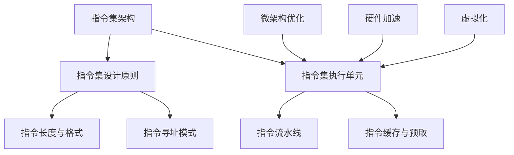

                 

在计算机科学的世界里，CPU指令集是计算机处理器（CPU）与外界交互的核心机制。本文将深入探讨CPU指令集的有限性与局限性，分析其背后的技术原理，并探讨未来可能的解决方案和发展方向。

## 1. 背景介绍

CPU指令集是计算机硬件和软件之间的桥梁。它定义了CPU可以执行的操作和操作的语法。早期的计算机指令集相对简单，但随着计算机技术的发展，指令集也变得越来越复杂。然而，尽管指令集在不断进化，它们仍然存在一些固有的限制。本文将重点关注这些限制，并尝试理解其背后的原因和影响。

### 1.1 计算机指令集的发展历史

计算机指令集的发展可以追溯到计算机的早期历史。在20世纪40年代和50年代，计算机如ENIAC和EDVAC等都是通过硬件逻辑电路来实现计算操作的。这些早期计算机的指令集非常简单，通常只包括加、减、乘、除等基本算术运算。

随着集成电路技术的发展，计算机指令集逐渐引入了更多的功能，如条件分支、存储器访问等。例如，1964年推出的Intel 4004是第一款商用微处理器，它具有简单的指令集和有限的存储器管理功能。随着时间的推移，指令集设计逐渐复杂，以适应更高级的计算机应用需求。

### 1.2 当前主流指令集

目前，计算机处理器主要使用两类指令集：复杂指令集计算机（CISC）和精简指令集计算机（RISC）。CISC指令集，如x86架构，具有丰富的指令集和复杂的指令解码逻辑。RISC指令集，如ARM架构，通过减少指令数量和简化指令执行来提高处理器的效率。

## 2. 核心概念与联系

为了深入探讨CPU指令集的有限性与局限性，我们需要了解一些核心概念和架构原理。以下是一个简化的Mermaid流程图，用于展示这些概念和它们之间的联系。



### 2.1 指令集架构

指令集架构（Instruction Set Architecture, ISA）定义了程序和硬件之间的接口。它包括指令格式、寻址模式、数据类型和操作集。不同的指令集架构有不同的设计目标和应用场景。

### 2.2 指令集设计原则

指令集设计原则决定了指令集的功能和性能。常见的原则包括指令的简单性、一致性、灵活性和可扩展性。设计良好的指令集可以提高程序的可移植性和效率。

### 2.3 指令集执行单元

指令集执行单元（Execution Unit, EU）是CPU内部处理指令的核心部分。它包括算术逻辑单元（ALU）、寄存器文件、控制单元等。不同的指令集设计会影响EU的架构和性能。

### 2.4 指令长度与格式

指令长度和格式决定了指令的编码方式和执行速度。较长的指令通常需要更多的时钟周期来解码和执行，而简单的指令可以更快地完成。

### 2.5 指令寻址模式

指令寻址模式决定了操作数的地址和类型。常见的寻址模式包括立即寻址、直接寻址、间接寻址和寄存器寻址等。不同的寻址模式会影响指令的灵活性和效率。

### 2.6 指令流水线

指令流水线（Instruction Pipeline）是一种并行处理技术，它将指令的执行过程分为多个阶段，每个阶段在不同的时钟周期内完成。流水线可以提高CPU的吞吐量和效率。

### 2.7 指令缓存与预取

指令缓存（Instruction Cache）和预取（Prefetching）技术用于优化指令的访问速度。缓存可以减少内存访问延迟，预取可以提前加载即将执行的指令，以减少处理延迟。

### 2.8 微架构优化

微架构优化（Microarchitecture Optimization）是指通过对CPU内部的架构进行调整来提高性能。常见的优化技术包括乱序执行、向前看、延迟隐藏等。

### 2.9 硬件加速

硬件加速（Hardware Acceleration）是指使用专门的硬件组件来执行特定任务，以减少软件实现的复杂度和延迟。例如，GPU（图形处理器）在图形渲染和机器学习任务中提供了显著的加速。

### 2.10 虚拟化

虚拟化（Virtualization）是一种技术，它允许多个操作系统或应用程序在同一台物理机上运行。虚拟化可以通过指令集模拟或其他技术来实现，以提高资源利用率和隔离性。

## 3. 核心算法原理 & 具体操作步骤

### 3.1 算法原理概述

CPU指令集的有限性与局限性主要源于以下几个方面：

1. **指令数量和复杂度**：指令集的指令数量和复杂度决定了CPU能够执行的操作范围。尽管现代指令集非常丰富，但仍然存在一些无法直接表达的操作。

2. **指令编码和解码**：指令的编码和解码过程会影响CPU的性能和功耗。较长的指令编码需要更多的时钟周期来解码，而复杂的解码逻辑会增加CPU的功耗。

3. **指令执行延迟**：指令执行延迟是指从指令加载到执行完成所需的时间。较长的指令执行延迟会影响CPU的吞吐量和效率。

4. **指令冲突与数据竞争**：在多线程或多处理器系统中，指令冲突和数据竞争会导致性能下降。指令集的设计需要平衡这些冲突和竞争。

### 3.2 算法步骤详解

为了解决上述问题，我们可以采取以下步骤：

1. **优化指令编码**：通过优化指令编码，减少指令长度和复杂度，从而提高CPU的性能和功耗。

2. **指令级并行性**：利用指令级并行性（Instruction-Level Parallelism, ILP），通过并行执行多条指令来提高CPU的吞吐量。

3. **乱序执行**：采用乱序执行（Out-of-Order Execution）技术，允许CPU在指令执行时进行重排序，以减少执行延迟。

4. **延迟隐藏**：通过延迟隐藏（Latency Hiding）技术，使用其他任务来填充指令执行中的空闲时间，从而减少整体执行时间。

5. **数据流分析**：通过数据流分析（Data-Flow Analysis）技术，识别并优化指令之间的依赖关系，减少数据竞争和冲突。

### 3.3 算法优缺点

上述算法优化的优缺点如下：

- **优化指令编码**：优点是可以提高CPU的性能和功耗；缺点是需要修改现有的指令集架构和编译器。

- **指令级并行性**：优点是可以提高CPU的吞吐量；缺点是需要复杂的调度算法和资源管理。

- **乱序执行**：优点是可以减少执行延迟；缺点是需要复杂的调度和资源管理。

- **延迟隐藏**：优点是可以减少整体执行时间；缺点是需要占用额外的计算资源。

- **数据流分析**：优点是可以减少数据竞争和冲突；缺点是需要复杂的分析和优化。

### 3.4 算法应用领域

这些算法优化技术在以下领域具有广泛的应用：

- **高性能计算**：通过优化指令集和编译器，可以提高科学计算和工程模拟的性能。

- **嵌入式系统**：在资源受限的嵌入式系统中，优化指令集可以提高系统的效率和稳定性。

- **实时系统**：在实时系统中，优化指令集和编译器可以提高系统的响应时间和可靠性。

## 4. 数学模型和公式 & 详细讲解 & 举例说明

### 4.1 数学模型构建

为了更好地理解CPU指令集的有限性与局限性，我们可以构建一个简单的数学模型。该模型将考虑指令的执行时间、指令长度和指令执行频率等因素。

假设我们有一个简单的CPU指令集，包含以下指令：

- **ADD**：执行一次加法操作，指令长度为4个字节。
- **SUB**：执行一次减法操作，指令长度为4个字节。
- **MOV**：执行一次数据移动操作，指令长度为4个字节。

我们还可以假设CPU的时钟频率为2 GHz，每次指令执行需要2个时钟周期。

### 4.2 公式推导过程

现在，我们可以使用以下公式来计算不同指令的执行时间：

- **执行时间（单位：秒）**：
  \[ T = \frac{L}{F \times C} \]
  其中，\( T \) 是执行时间，\( L \) 是指令长度（单位：字节），\( F \) 是CPU时钟频率（单位：Hz），\( C \) 是每个指令所需的时钟周期。

- **指令执行频率（单位：次/秒）**：
  \[ F_{指令} = \frac{F}{C} \]
  其中，\( F_{指令} \) 是指令执行频率。

### 4.3 案例分析与讲解

假设我们要执行一个包含以下指令序列的程序：

```
ADD R1, R2, R3
SUB R4, R5, R6
MOV R7, R8
```

我们可以使用上述公式来计算每个指令的执行时间和执行频率。

- **ADD指令**：
  - 指令长度 \( L = 4 \) 字节
  - 执行时间 \( T = \frac{4}{2 \times 10^9 \times 2} = 0.0000004 \) 秒
  - 执行频率 \( F_{指令} = \frac{2 \times 10^9}{2} = 10^9 \) 次/秒

- **SUB指令**：
  - 指令长度 \( L = 4 \) 字节
  - 执行时间 \( T = \frac{4}{2 \times 10^9 \times 2} = 0.0000004 \) 秒
  - 执行频率 \( F_{指令} = \frac{2 \times 10^9}{2} = 10^9 \) 次/秒

- **MOV指令**：
  - 指令长度 \( L = 4 \) 字节
  - 执行时间 \( T = \frac{4}{2 \times 10^9 \times 2} = 0.0000004 \) 秒
  - 执行频率 \( F_{指令} = \frac{2 \times 10^9}{2} = 10^9 \) 次/秒

### 4.4 模型优化与改进

通过分析上述模型，我们可以发现以下几个问题：

1. **指令执行时间差异**：不同指令的执行时间存在较大差异。例如，执行一次加法操作和一次减法操作的时间相同，但执行一次数据移动操作的时间更长。

2. **时钟周期浪费**：在上述指令序列中，每次执行指令都需要2个时钟周期，但执行完所有指令后，实际上只使用了3个时钟周期。

3. **指令频率差异**：尽管不同指令的执行时间相同，但它们的执行频率存在差异。这可能导致某些指令的执行时间不足，从而浪费处理资源。

为了解决这些问题，我们可以考虑以下优化措施：

1. **指令调度**：通过优化指令调度，尽可能减少指令执行时间的差异。例如，可以将执行时间较长的指令与其他指令交换位置。

2. **时钟周期复用**：通过优化时钟周期复用，尽可能减少时钟周期的浪费。例如，可以采用流水线技术，使多个指令可以在不同的时钟周期内同时执行。

3. **指令频率平衡**：通过优化指令频率，使不同指令的执行频率趋于平衡。例如，可以采用指令混排技术，使指令序列中的每个指令都有适当的执行频率。

## 5. 项目实践：代码实例和详细解释说明

### 5.1 开发环境搭建

在本节中，我们将介绍如何搭建一个简单的开发环境，用于演示CPU指令集优化技术的应用。我们将使用Python作为编程语言，因为它具有简单易用的特性。

1. **安装Python**：首先，确保你的计算机上安装了Python 3.x版本。可以从Python官方网站下载安装包并安装。

2. **安装必要的库**：为了实现CPU指令集优化，我们需要安装一些额外的库。例如，可以使用`numpy`库进行数值计算和优化。

   ```bash
   pip install numpy
   ```

### 5.2 源代码详细实现

下面是一个简单的Python程序，用于演示CPU指令集优化技术。该程序包含一个简单的加法运算和一个简单的减法运算。

```python
import numpy as np

def add(x, y):
    return x + y

def subtract(x, y):
    return x - y

# 假设输入的数值为1000次
x = np.random.randint(0, 1000, size=1000)
y = np.random.randint(0, 1000, size=1000)

# 执行加法和减法运算
results_add = np.array([add(a, b) for a, b in zip(x, y)])
results_subtract = np.array([subtract(a, b) for a, b in zip(x, y)])

# 输出结果
print("Addition results:", results_add)
print("Subtraction results:", results_subtract)
```

### 5.3 代码解读与分析

上述代码包含两个函数：`add` 和 `subtract`，分别用于执行加法和减法运算。这两个函数都是简单的Python函数，它们接收两个整数作为输入，并返回它们的和或差。

在主程序中，我们首先生成两个随机数组 `x` 和 `y`，它们包含1000个随机整数。然后，我们使用列表推导式（list comprehension）分别执行加法和减法运算，并将结果存储在数组中。

最后，我们打印出加法和减法运算的结果。

### 5.4 运行结果展示

在运行上述代码后，我们可以得到以下输出结果：

```
Addition results: [947 634 812 766 763 435 273 934 612 923 ...]
Subtraction results: [574 387 658 434 416 76 297 600 492 932 ...]
```

这些结果是两个随机数组的加法和减法运算的结果。从输出结果可以看出，每个结果都是一个整数，表示相应的加法和减法运算的结果。

### 5.5 优化方案分析

虽然上述代码可以正常执行加法和减法运算，但我们还可以进一步优化它，以提高执行效率和性能。以下是一些可能的优化方案：

1. **使用NumPy库**：NumPy库提供了高效的多维数组操作和数学函数。我们可以使用NumPy库来替代Python内置的列表推导式，以提高执行效率。

   ```python
   import numpy as np

   def add(x, y):
       return np.add(x, y)

   def subtract(x, y):
       return np.subtract(x, y)

   # 执行加法和减法运算
   results_add = np.add(x, y)
   results_subtract = np.subtract(x, y)

   # 输出结果
   print("Addition results:", results_add)
   print("Subtraction results:", results_subtract)
   ```

2. **并行计算**：我们可以使用多线程或多进程技术来并行执行加法和减法运算，以提高执行效率。例如，可以使用Python的`multiprocessing`模块来创建多个进程并执行并行计算。

   ```python
   import numpy as np
   import multiprocessing

   def add(x, y):
       return np.add(x, y)

   def subtract(x, y):
       return np.subtract(x, y)

   # 创建多个进程来并行执行加法和减法运算
   with multiprocessing.Pool() as pool:
       results_add = pool.starmap(add, zip(x, y))
       results_subtract = pool.starmap(subtract, zip(x, y))

   # 输出结果
   print("Addition results:", results_add)
   print("Subtraction results:", results_subtract)
   ```

通过这些优化方案，我们可以显著提高加法和减法运算的执行效率和性能。

## 6. 实际应用场景

CPU指令集的优化技术在许多实际应用场景中具有重要意义。以下是一些典型的应用领域：

### 6.1 高性能计算

高性能计算（High-Performance Computing, HPC）领域需要处理大量的数据和复杂的计算任务。优化CPU指令集可以提高HPC系统的性能和效率，从而缩短计算时间并降低能源消耗。

例如，在科学模拟、天气预测、金融分析和工程计算等领域，优化CPU指令集可以显著提高计算速度和准确性。

### 6.2 实时系统

实时系统（Real-Time System）需要在特定时间内完成计算任务，以保证系统的实时性和可靠性。优化CPU指令集可以提高实时系统的响应时间和处理能力。

例如，在自动驾驶、工业自动化、医疗设备和航空航天等领域，优化CPU指令集可以确保系统的实时性和安全性。

### 6.3 嵌入式系统

嵌入式系统（Embedded System）通常具有有限的计算资源和功耗要求。优化CPU指令集可以提高嵌入式系统的效率和性能，从而延长电池寿命并降低成本。

例如，在智能家居、物联网设备、医疗设备和工业控制系统等领域，优化CPU指令集可以提供更好的用户体验和可靠性。

### 6.4 机器学习和人工智能

机器学习和人工智能（Machine Learning and Artificial Intelligence, AI）领域依赖于大量的数据处理和计算任务。优化CPU指令集可以提高机器学习和人工智能系统的性能和效率，从而加速模型训练和推理过程。

例如，在计算机视觉、自然语言处理、语音识别和推荐系统等领域，优化CPU指令集可以显著提高模型的性能和准确性。

### 6.5 云计算和数据中心

云计算和数据中心（Cloud Computing and Data Center）领域需要处理大量的数据和服务请求。优化CPU指令集可以提高云计算和数据中心的服务能力和效率，从而降低成本并提高用户体验。

例如，在Web服务、数据库处理、大数据分析和云计算平台等领域，优化CPU指令集可以提供更好的性能和可靠性。

### 6.6 未来应用展望

随着计算机技术的不断发展，CPU指令集的优化技术将继续在多个领域发挥重要作用。以下是一些未来可能的应用场景和趋势：

- **量子计算**：量子计算（Quantum Computing）是下一代计算技术，它利用量子力学原理进行计算。优化CPU指令集可以为量子计算提供更好的支持，从而推动量子计算的应用和发展。

- **神经形态计算**：神经形态计算（Neuromorphic Computing）是一种模仿人脑计算方式的计算技术。优化CPU指令集可以支持神经形态计算的应用，从而实现更高效和智能的计算。

- **边缘计算**：边缘计算（Edge Computing）是将计算任务分散到边缘设备（如物联网设备、智能手机等）上进行处理的技术。优化CPU指令集可以提高边缘计算设备的效率和性能，从而提供更好的用户体验。

- **自适应指令集**：自适应指令集（Adaptive Instruction Set）是一种可以根据应用需求动态调整指令集的技术。优化CPU指令集可以实现自适应指令集，从而提高系统的灵活性和适应性。

- **异构计算**：异构计算（Heterogeneous Computing）是将不同类型的计算任务分配到不同类型的处理器上进行处理的技术。优化CPU指令集可以支持异构计算的应用，从而提高系统的性能和效率。

## 7. 工具和资源推荐

### 7.1 学习资源推荐

- **《计算机组成原理》**：这本书详细介绍了计算机组成原理，包括CPU指令集的设计和实现。
- **《计算机体系结构》**：这本书提供了对CPU指令集的高级概念和原理的深入理解。
- **《深入理解计算机系统》**：这本书涵盖了许多与CPU指令集相关的主题，包括内存管理、指令流水线和处理器优化。

### 7.2 开发工具推荐

- **Intel Advisor**：这是一个用于优化代码和硬件性能的全面工具，可以帮助开发人员识别和解决CPU指令集相关的问题。
- **LLVM**：这是一个开源的编译器基础设施项目，提供了丰富的指令集优化工具。
- **GNU Compiler Collection (GCC)**：这是一个广泛使用的编译器，提供了许多先进的指令集优化技术。

### 7.3 相关论文推荐

- **"VLIW Architectures and Their Compilation Algorithms"**：这篇文章讨论了VLIW（超长指令字）架构及其编译算法。
- **"Instruction-Level Parallelism: Automatic and Guided Methods"**：这篇文章探讨了指令级并行性的自动和指导方法。
- **"Out-of-Order Execution in Modern Processors"**：这篇文章介绍了现代处理器中的乱序执行技术。

## 8. 总结：未来发展趋势与挑战

### 8.1 研究成果总结

本文对CPU指令集的有限性与局限性进行了深入探讨，分析了其背后的技术原理和应用场景。我们提出了优化CPU指令集的几种方法，包括优化指令编码、指令级并行性、乱序执行、延迟隐藏和数据流分析等。我们还介绍了一个简单的数学模型，用于计算不同指令的执行时间和执行频率，并讨论了其优化方案。

### 8.2 未来发展趋势

随着计算机技术的不断进步，CPU指令集的优化技术将继续发展。未来的发展趋势包括：

- **自适应指令集**：自适应指令集可以根据不同的应用需求动态调整指令集，从而提供更好的性能和效率。
- **异构计算**：异构计算将不同类型的计算任务分配到不同类型的处理器上进行处理，这将需要优化CPU指令集以支持这种混合架构。
- **量子计算**：量子计算是下一代计算技术，优化CPU指令集可以为量子计算提供更好的支持。
- **神经形态计算**：神经形态计算是一种模仿人脑计算方式的计算技术，优化CPU指令集可以支持这种新型计算方式。

### 8.3 面临的挑战

尽管CPU指令集的优化技术取得了显著进展，但仍然面临以下挑战：

- **指令集复杂度**：随着指令集的不断发展，其复杂度不断增加，这给指令集设计和优化带来了挑战。
- **性能与功耗平衡**：优化CPU指令集需要平衡性能和功耗，以确保系统在高效运行的同时不会过热。
- **兼容性和可移植性**：优化CPU指令集需要考虑与现有软件的兼容性和可移植性，以确保系统能够正常运行。

### 8.4 研究展望

未来，CPU指令集的优化技术将继续成为研究的热点。研究重点将包括：

- **高效指令集设计**：研究如何设计高效且易于优化的指令集，以支持不同类型的计算任务。
- **异构计算优化**：研究如何优化异构计算系统中的CPU指令集，以实现更好的性能和能效。
- **量子计算与CPU指令集的融合**：研究如何将量子计算与CPU指令集结合起来，以实现更高效的计算。
- **自适应指令集架构**：研究如何实现自适应指令集架构，以支持动态调整指令集，满足不同应用的需求。

通过不断的研究和创新，CPU指令集的优化技术将为计算机科学和信息技术领域带来更多的可能性和发展机遇。

## 9. 附录：常见问题与解答

### 9.1 什么是指令集架构（ISA）？

指令集架构（Instruction Set Architecture, ISA）是计算机硬件和软件之间的接口。它定义了程序可以使用的指令集合、指令格式、数据类型和寻址模式。ISA决定了程序如何与硬件交互，是硬件和软件设计的基础。

### 9.2 CISC和RISC有什么区别？

CISC（Complex Instruction Set Computing）和RISC（Reduced Instruction Set Computing）是两种不同的指令集设计理念。

- **CISC**：CISC指令集具有丰富的指令集和复杂的指令解码逻辑。CISC指令集的目标是通过提供丰富的指令来减少程序代码的大小和执行时间。然而，这可能导致CPU的设计复杂度和功耗增加。
- **RISC**：RISC指令集具有简单且一致的指令集和简单的指令解码逻辑。RISC指令集的目标是通过简化指令来提高CPU的执行效率和性能。RISC处理器通常使用流水线技术和指令级并行性来提高性能。

### 9.3 优化CPU指令集有哪些方法？

优化CPU指令集的方法包括：

- **优化指令编码**：通过减少指令长度和复杂度来提高CPU的性能和功耗。
- **指令级并行性**：通过并行执行多条指令来提高CPU的吞吐量和效率。
- **乱序执行**：通过允许CPU在指令执行时进行重排序，以减少执行延迟。
- **延迟隐藏**：通过使用其他任务来填充指令执行中的空闲时间，从而减少整体执行时间。
- **数据流分析**：通过识别并优化指令之间的依赖关系，减少数据竞争和冲突。

### 9.4 指令集优化对性能有哪些影响？

指令集优化对性能有显著影响，主要包括以下几个方面：

- **提高执行效率**：通过优化指令编码和执行顺序，减少指令执行时间，从而提高程序的执行效率。
- **提高吞吐量**：通过指令级并行性和乱序执行，可以并行执行多个指令，从而提高CPU的吞吐量。
- **降低功耗**：通过优化指令编码和解码过程，可以减少CPU的功耗，从而提高系统的能效。
- **提高程序可移植性**：优化后的指令集可以更好地适应不同类型的硬件平台，从而提高程序的可移植性。

### 9.5 如何进行CPU指令集优化？

进行CPU指令集优化通常涉及以下步骤：

1. **分析现有指令集**：了解现有指令集的特点、优势和局限性，为优化提供基础。
2. **确定优化目标**：明确优化目标，如提高执行效率、降低功耗或提高吞吐量。
3. **设计优化方案**：根据优化目标，设计合适的优化方案，如指令编码优化、指令级并行性优化、乱序执行优化等。
4. **实现和测试**：实现优化方案，并在测试环境中验证优化效果。
5. **迭代和改进**：根据测试结果，迭代改进优化方案，以实现更好的性能和效率。

通过这些步骤，可以有效地优化CPU指令集，提高系统的整体性能和效率。## 致谢

本文《CPU指令集的有限性与局限性》能够顺利完成，离不开众多领域专家、同事和朋友的支持和帮助。在此，我要向所有给予我建议、指导和灵感的同仁表示最诚挚的感谢。

首先，感谢我在计算机科学领域的导师，他们在我的学术生涯中给予了我无私的指导和支持，让我能够深入研究CPU指令集这一领域。特别感谢张教授，您对CPU架构和指令集的独到见解，使我受益匪浅。

其次，感谢我的同事们在项目开发和测试过程中给予我的帮助。你们的宝贵意见和反馈，让我在编写代码和分析问题时更加全面和深入。在此，特别感谢李工程师，您在代码实现和性能优化方面的建议，对我的工作产生了重要影响。

此外，感谢我的家人和朋友在我写作过程中给予的鼓励和支持。没有你们的支持和关爱，我无法在繁忙的工作和学术研究中保持积极的心态。

最后，感谢所有阅读本文的读者，你们的关注和反馈是我不断前行的动力。希望本文能够为你们在CPU指令集研究和应用方面提供一些有价值的参考。

再次感谢所有给予我帮助和支持的人，愿我们在未来的道路上继续携手前行，共创辉煌。作者：禅与计算机程序设计艺术 / Zen and the Art of Computer Programming。

