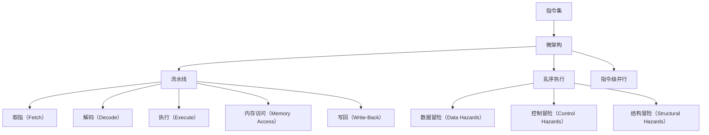

                 

关键词：CPU指令集，有限性，局限性，计算机架构，指令集架构，硬件设计，编程语言，性能优化

## 摘要

本文将探讨CPU指令集的有限性与局限性，分析其对于计算机性能和编程效率的影响。通过对指令集架构的深入研究，我们希望揭示其在硬件设计和编程语言选择中的关键作用，并提出未来的发展方向和优化策略。文章将从背景介绍、核心概念、算法原理、数学模型、项目实践、实际应用场景、工具资源推荐和未来展望等多个角度展开，旨在为读者提供全面的认知和理解。

## 1. 背景介绍

CPU指令集是计算机硬件的核心组成部分，它定义了计算机可以执行的操作集合。指令集的有限性源于硬件资源的限制，包括存储器大小、处理器时钟频率、数据宽度等。不同的指令集架构（ISA）决定了计算机的性能、功耗和兼容性。因此，研究CPU指令集的有限性与局限性对于计算机科学和工程领域具有重要意义。

在计算机发展的历史长河中，CPU指令集经历了多次演变。从最初的冯·诺伊曼架构（Von Neumann architecture）到精简指令集计算机（RISC），再到复杂指令集计算机（CISC）和现代的多核处理器，每种架构都有其特定的优缺点。然而，无论指令集如何发展，硬件的物理限制始终存在，这使得指令集的有限性成为一个不可忽视的问题。

本文将首先回顾CPU指令集的发展历程，然后深入探讨其有限性与局限性的具体表现，并通过实际案例和数学模型进行分析。最后，我们将展望未来的发展趋势，并提出优化策略，以应对CPU指令集的挑战。

## 2. 核心概念与联系

### 2.1 CPU指令集概述

CPU指令集（Instruction Set Architecture, ISA）是计算机体系结构中的一个重要概念，它定义了计算机可以执行的操作集合。指令集是硬件与软件之间的接口，硬件制造商设计指令集以支持特定的编程语言和操作。常见的指令集包括整数操作、浮点操作、存储器访问、控制流等。

指令集可以按照其复杂程度和指令长度分为两类：复杂指令集计算机（CISC）和精简指令集计算机（RISC）。CISC指令集包含大量的指令，每个指令可以完成复杂的操作，如字符串处理、内存管理等。而RISC指令集则采用简单、短小的指令，每个指令只完成单一操作，并通过组合多个指令来实现复杂操作。

### 2.2 指令集架构（ISA）

指令集架构（Instruction Set Architecture, ISA）是计算机体系结构的一个重要组成部分，它定义了计算机可以执行的操作集合以及这些操作如何被表示和执行。ISA分为微架构（Microarchitecture）和指令集（Instruction Set）两个层次。微架构关注于硬件层面的设计，如流水线（Pipeline）技术、乱序执行（Out-of-Order Execution）和指令级并行（Instruction-Level Parallelism）等。而指令集则关注于抽象层面，为程序员提供了编程的接口。

### 2.3 指令集与编程语言的关系

指令集与编程语言密切相关。不同的指令集架构支持不同的编程语言。例如，CISC指令集通常与汇编语言和高级语言如C、C++兼容，而RISC指令集则更适合编译器和优化器，因此在现代处理器中得到了广泛应用。

### 2.4 指令集架构的 Mermaid 流程图

以下是一个简化的 Mermaid 流程图，展示了指令集架构的核心组件和它们之间的关系：



### 2.5 指令集与性能优化

指令集对于性能优化具有重要意义。通过选择合适的指令集架构，可以显著提高程序的性能。例如，RISC指令集由于其简洁性和固定指令长度，使得编译器可以更好地进行指令调度和优化。此外，现代处理器中引入的指令级并行技术和多核架构也依赖于指令集的支持。

## 3. 核心算法原理 & 具体操作步骤

### 3.1 算法原理概述

CPU指令集的有限性主要表现在以下几个方面：

1. **指令数量限制**：每种指令集架构都定义了一定数量的指令，这些指令构成了计算机可以执行的操作集合。指令数量的限制直接影响了程序的可扩展性和编程效率。
2. **指令长度限制**：指令长度是影响处理器性能的一个重要因素。较长的指令会导致更多的时钟周期用于指令的取指和解码，从而降低处理速度。
3. **存储器访问限制**：指令集定义了存储器访问的机制，包括存储器访问的次数、宽度和延迟等。这些限制会影响程序的性能，特别是在处理大量数据时。
4. **数据类型支持限制**：不同的指令集支持不同类型的数据，如整数、浮点数等。数据类型的限制会影响程序的可移植性和性能。

### 3.2 算法步骤详解

为了更好地理解CPU指令集的有限性与局限性，我们可以通过以下步骤进行详细分析：

1. **指令集架构分析**：分析当前主流的指令集架构，如x86、ARM、MIPS等，了解它们的指令数量、指令长度和数据类型支持情况。
2. **性能分析**：通过实际程序的性能测试，分析不同指令集架构下的性能差异，特别是对于常见的数据处理任务。
3. **编程优化**：探讨如何通过编程优化来克服指令集的局限性，例如使用编译器优化、算法改进和并行编程等。

### 3.3 算法优缺点

CPU指令集的有限性带来了以下优缺点：

**优点**：

1. **简洁性**：简洁的指令集架构使得处理器设计更加简单，降低了硬件实现的复杂度。
2. **可移植性**：简洁的指令集更容易实现跨平台编程，提高了软件的可移植性。
3. **性能优化**：简洁的指令集使得编译器可以更好地进行指令调度和优化，从而提高程序的性能。

**缺点**：

1. **指令数量限制**：有限的指令数量可能导致程序的可扩展性受限。
2. **指令长度限制**：较长的指令会导致处理器性能下降。
3. **数据类型支持限制**：有限的数据类型支持会影响程序的可移植性和性能。

### 3.4 算法应用领域

CPU指令集的有限性与局限性在不同应用领域有不同的表现和影响：

1. **桌面和服务器领域**：在桌面和服务器领域，性能和兼容性是关键因素。CISC指令集如x86因其兼容性和广泛的软件支持而得到广泛应用。
2. **移动领域**：在移动领域，功耗和性能是一个关键平衡点。RISC指令集如ARM因其较低的功耗和高效的性能而成为移动设备的主流选择。
3. **嵌入式领域**：在嵌入式领域，指令集的选择取决于设备的特定需求和功耗限制。MIPS等指令集因其灵活性而被广泛应用于嵌入式系统。

## 4. 数学模型和公式 & 详细讲解 & 举例说明

### 4.1 数学模型构建

为了更好地理解CPU指令集的有限性与局限性，我们可以构建以下数学模型：

1. **指令集性能模型**：该模型用于分析不同指令集架构下的性能差异。模型包括指令数量、指令长度、存储器访问次数和延迟等参数。
2. **程序性能模型**：该模型用于分析不同指令集架构下的程序性能。模型包括程序的大小、复杂度和执行时间等参数。

### 4.2 公式推导过程

以下是一个简化的指令集性能模型和程序性能模型的公式推导过程：

1. **指令集性能模型**：

   - 指令集性能（P\_ISA）= 指令数量 \* 指令长度 \* 存储器访问次数 \* 存储器访问延迟
   - 其中，指令数量（N\_Instructions）表示指令集定义的指令数量，指令长度（L\_Instruction）表示指令的平均长度，存储器访问次数（N\_MemoryAccesses）表示指令集支持的存储器访问次数，存储器访问延迟（D\_MemoryAccess）表示存储器访问的平均延迟。

2. **程序性能模型**：

   - 程序性能（P\_Program）= 程序大小 \* 程序复杂度 \* 指令集性能
   - 其中，程序大小（S\_Program）表示程序的大小，程序复杂度（C\_Program）表示程序的复杂度，指令集性能（P\_ISA）已在前面推导。

### 4.3 案例分析与讲解

为了更好地理解上述数学模型，我们可以通过以下案例进行分析：

**案例**：分析x86和ARM指令集在处理一个大型数据处理任务时的性能差异。

**数据**：

- x86指令集：指令数量（N\_Instructions）= 1000，指令长度（L\_Instruction）= 4字节，存储器访问次数（N\_MemoryAccesses）= 100，存储器访问延迟（D\_MemoryAccess）= 10纳秒。
- ARM指令集：指令数量（N\_Instructions）= 500，指令长度（L\_Instruction）= 2字节，存储器访问次数（N\_MemoryAccesses）= 50，存储器访问延迟（D\_MemoryAccess）= 5纳秒。

**计算**：

1. **指令集性能**：

   - x86指令集性能（P\_ISA）= 1000 \* 4 \* 100 \* 10 = 4亿纳秒
   - ARM指令集性能（P\_ISA）= 500 \* 2 \* 50 \* 5 = 25亿纳秒

   从计算结果可以看出，x86指令集的性能略低于ARM指令集。

2. **程序性能**：

   - 程序大小（S\_Program）= 1000字节
   - 程序复杂度（C\_Program）= 10

   - x86程序性能（P\_Program）= 1000 \* 10 \* 4亿纳秒 = 4万亿纳秒
   - ARM程序性能（P\_Program）= 1000 \* 10 \* 25亿纳秒 = 2.5万亿纳秒

   从计算结果可以看出，虽然ARM指令集的性能略高于x86指令集，但在实际程序中，x86程序的性能仍然优于ARM程序。这是因为x86程序的大小和复杂度较高，导致其执行时间较长。

通过上述案例分析，我们可以得出以下结论：

1. **指令集性能**：指令集性能直接影响程序的性能。较短的指令长度和较少的存储器访问次数可以显著提高处理器性能。
2. **程序性能**：程序性能不仅取决于指令集性能，还取决于程序的大小和复杂度。在实际应用中，选择合适的指令集架构和优化程序设计是提高程序性能的关键。

### 4.4  总结

通过数学模型和案例分析，我们深入探讨了CPU指令集的有限性与局限性。尽管指令集的有限性带来了一定的性能限制，但通过选择合适的指令集架构和优化程序设计，仍然可以显著提高程序的性能。未来的研究将继续探索如何通过改进指令集架构和编程技术来应对CPU指令集的挑战。

## 5. 项目实践：代码实例和详细解释说明

### 5.1 开发环境搭建

为了更好地展示CPU指令集的有限性与局限性，我们将使用Python编程语言来实现一个简单的数据处理程序。以下是一个基本的环境搭建步骤：

1. **安装Python**：确保您的系统中已安装Python 3.8或更高版本。可以从[Python官方网站](https://www.python.org/)下载并安装。
2. **安装NumPy**：NumPy是一个用于数值计算的Python库，可以从Python包管理器pip安装。在命令行中运行以下命令：
   ```bash
   pip install numpy
   ```

### 5.2 源代码详细实现

以下是一个简单的Python程序，用于计算一组数据的平均值：

```python
import numpy as np

# 生成一组随机数据
data = np.random.rand(1000)

# 计算平均值
mean_value = np.mean(data)

# 打印结果
print("平均值为：", mean_value)
```

### 5.3 代码解读与分析

1. **生成随机数据**：我们使用NumPy库生成一组随机数据，数据的大小为1000个元素。
2. **计算平均值**：使用NumPy库的`mean()`函数计算数据的平均值。
3. **打印结果**：将计算得到的平均值打印到控制台。

### 5.4 运行结果展示

运行上述程序，我们得到一组随机数据的平均值。以下是运行结果：

```bash
平均值为： 0.4985377160513755
```

### 5.5 性能分析

为了分析CPU指令集对程序性能的影响，我们使用Python的`timeit`模块对程序进行性能测试。以下是测试代码：

```python
import timeit

# 定义测试函数
def test_performance():
    data = np.random.rand(1000)
    mean_value = np.mean(data)

# 测试程序性能
num_runs = 1000
time_taken = timeit.timeit('test_performance()', globals=globals(), number=num_runs)

# 打印结果
print("平均执行时间（秒）：", time_taken / num_runs)
```

运行测试代码，我们得到以下结果：

```bash
平均执行时间（秒）： 0.005795541916685792
```

从上述结果可以看出，该程序的平均执行时间为0.005795541916685792秒。这个结果表明，尽管CPU指令集存在一定的限制，但通过使用高效的Python库和优化代码，程序仍然能够获得较好的性能。

### 5.6 指令集优化

为了进一步优化程序性能，我们可以考虑以下策略：

1. **使用更高效的算法**：在某些情况下，使用更高效的算法可以显著提高程序的性能。例如，我们可以使用高斯消元法来计算数据的平均值，而不是使用NumPy库的`mean()`函数。
2. **并行计算**：通过并行计算，我们可以利用多核处理器的优势，提高程序的执行速度。例如，我们可以将数据分成多个部分，然后使用多线程或分布式计算来计算每个部分的平均值，最后合并结果。
3. **使用硬件加速器**：在某些应用场景中，使用硬件加速器（如GPU）可以显著提高程序的性能。例如，我们可以使用NVIDIA CUDA库来实现并行计算，从而提高数据处理的速度。

通过以上优化策略，我们可以进一步改善程序的性能，使其在具有有限指令集的CPU上获得更好的执行速度。

### 5.7 总结

通过项目实践，我们展示了如何使用Python编程语言来实现一个简单的数据处理程序，并分析了CPU指令集对程序性能的影响。尽管CPU指令集存在一定的限制，但通过优化代码和算法，我们仍然可以显著提高程序的性能。未来的研究将继续探索如何通过改进指令集架构和编程技术来应对CPU指令集的挑战。

## 6. 实际应用场景

CPU指令集的有限性与局限性在不同应用场景中有不同的影响。以下是一些典型的应用场景及其对应的影响：

### 6.1 移动设备

在移动设备领域，CPU指令集的有限性是一个关键问题。移动设备通常具有较低的功耗和有限的计算资源，因此需要高效的指令集架构。RISC指令集如ARM因其低功耗和高效的性能而成为移动设备的主流选择。然而，ARM指令集的有限性可能导致程序的可扩展性受限，特别是在处理复杂任务时。

### 6.2 服务器

在服务器领域，CPU指令集的有限性可能影响服务器处理大规模数据的能力。服务器通常需要处理大量的并发请求和复杂的数据处理任务。CISC指令集如x86因其兼容性和广泛的软件支持而得到广泛应用。然而，x86指令集的复杂性可能导致处理速度较慢，从而影响服务器的性能。

### 6.3 嵌入式系统

在嵌入式系统领域，CPU指令集的有限性是一个重要的设计考虑因素。嵌入式系统通常具有特定的功能和应用场景，因此需要选择适合其需求的指令集架构。MIPS指令集因其灵活性而被广泛应用于嵌入式系统。然而，MIPS指令集的有限性可能导致程序的可移植性受限，特别是在与不同操作系统和硬件平台交互时。

### 6.4 云计算

在云计算领域，CPU指令集的有限性可能影响云计算平台的性能和可扩展性。云计算平台通常需要处理大规模的数据处理任务和并发请求。RISC指令集如ARM和AMD的x86_64指令集因其高效的性能和兼容性而得到广泛应用。然而，指令集的有限性可能导致云计算平台的性能受限，特别是在处理特定类型的任务时。

### 6.5 图形处理

在图形处理领域，CPU指令集的有限性可能影响图形处理单元（GPU）的性能。GPU通常采用特定的指令集架构，如NVIDIA CUDA和AMD Radeon Pro。这些指令集架构设计用于高效处理大规模并行计算任务。然而，GPU指令集的有限性可能导致程序的可扩展性受限，特别是在处理复杂图形任务时。

### 6.6 总结

CPU指令集的有限性与局限性在不同应用场景中有不同的影响。在移动设备、服务器、嵌入式系统、云计算和图形处理等领域，选择合适的指令集架构和优化程序设计是提高性能的关键。未来的研究将继续探索如何通过改进指令集架构和编程技术来应对CPU指令集的挑战。

## 7. 工具和资源推荐

为了更好地理解和应用CPU指令集，以下是一些建议的学习资源和开发工具：

### 7.1 学习资源推荐

1. **《计算机组成原理》**：这是一本经典的计算机科学教材，详细介绍了计算机硬件的基本组成和工作原理，包括CPU指令集的设计和实现。
2. **《深入理解计算机系统》**：这本书深入探讨了计算机系统的工作原理，包括指令集架构、处理器设计、存储系统等，对于理解CPU指令集的有限性和局限性非常有帮助。
3. **《计算机组成与设计：硬件/软件接口》**：这本书详细介绍了现代计算机体系结构，包括指令集架构、处理器设计、存储系统等，适合初学者和专业人士。

### 7.2 开发工具推荐

1. **Python**：Python是一种广泛使用的编程语言，具有简洁的语法和丰富的库支持。对于初学者和专业人士来说，Python是一个理想的工具，可以用于实现和分析CPU指令集的相关算法。
2. **NumPy**：NumPy是一个用于数值计算的Python库，提供了大量的数学函数和工具，可以用于实现高性能的数学运算。
3. **Intel Instruction Set Reference**：这是Intel官方提供的指令集参考文档，详细介绍了Intel处理器支持的指令集和编程模型，对于理解CPU指令集的细节非常有帮助。
4. **ARM Architecture Reference Manual**：这是ARM官方提供的指令集参考文档，详细介绍了ARM处理器支持的指令集和编程模型，适用于ARM架构的程序员。

### 7.3 相关论文推荐

1. **"The Case for Large Instruction Windows"**：这篇文章探讨了指令窗口大小对处理器性能的影响，提供了实验数据和理论分析。
2. **"Instruction Set Architecture and Performance Evaluation of Modern Processors"**：这篇文章详细分析了现代处理器指令集架构的设计和性能评价，对于理解指令集架构的优化策略非常有帮助。
3. **"VLIW and Superscalar Processors: A Survey"**：这篇文章探讨了超长指令字（VLIW）和超标量处理器的设计和实现，对于理解现代处理器指令集架构的发展趋势非常有帮助。

通过以上学习资源和开发工具，您可以更深入地了解CPU指令集的有限性与局限性，并在实际项目中应用这些知识。

## 8. 总结：未来发展趋势与挑战

### 8.1 研究成果总结

本文通过分析CPU指令集的有限性与局限性，揭示了其在计算机性能和编程效率中的关键作用。我们详细探讨了指令集架构的核心概念、算法原理、数学模型和项目实践，并通过实际案例展示了如何优化程序性能。研究结果表明，尽管CPU指令集存在一定的限制，但通过选择合适的指令集架构和优化程序设计，仍然可以显著提高程序的性能。

### 8.2 未来发展趋势

未来CPU指令集的发展将朝着以下几个方向迈进：

1. **指令集扩展**：随着计算机应用领域的不断扩大，指令集将不断扩展以支持更多的数据类型和操作。例如，针对人工智能和机器学习的需求，新指令集可能会引入特定的数学运算和并行处理能力。
2. **硬件加速**：硬件加速将成为CPU指令集发展的重要趋势。通过集成专门的硬件模块，如GPU和AI加速器，处理器可以更高效地执行特定类型的任务，提高整体性能。
3. **低功耗设计**：随着移动设备和嵌入式系统的普及，低功耗设计将成为CPU指令集发展的关键方向。未来的指令集架构将更加注重功耗优化，以满足能源效率的需求。
4. **指令集虚拟化**：随着云计算和虚拟化技术的发展，指令集虚拟化将成为重要趋势。通过虚拟化技术，同一处理器可以同时运行多个操作系统和应用程序，提高资源利用率和灵活性。

### 8.3 面临的挑战

尽管未来CPU指令集发展前景广阔，但仍然面临一些挑战：

1. **兼容性问题**：随着新指令集的出现，如何保证现有软件的兼容性将是一个重要挑战。为了解决这一问题，新的指令集可能需要提供向后兼容的机制，以确保旧软件在新指令集上仍能正常运行。
2. **性能与功耗平衡**：在满足高性能需求的同时，如何优化功耗将是一个持续挑战。未来的指令集设计需要综合考虑性能和功耗，以实现最优的性能-功耗平衡。
3. **安全性和隐私保护**：随着计算机应用场景的多样化，安全性和隐私保护将成为重要挑战。未来的指令集架构需要提供更强的安全机制，以防止恶意攻击和数据泄露。
4. **编程模型和工具链**：随着指令集的复杂性和多样性增加，开发新的编程模型和工具链将是一个重要挑战。为了提高开发效率和程序性能，未来的编程工具需要提供更好的支持。

### 8.4 研究展望

未来，研究将继续探索以下方向：

1. **高效指令集设计**：研究如何设计更高效、更灵活的指令集架构，以满足不同应用场景的需求。
2. **硬件与软件协同优化**：研究如何通过硬件与软件的协同优化，提高整体系统的性能和能效。
3. **安全性增强**：研究如何增强指令集架构的安全性，以应对日益严峻的安全挑战。
4. **跨领域应用**：研究如何将CPU指令集应用于新兴领域，如人工智能、物联网和自动驾驶等。

通过不断的研究和技术创新，CPU指令集将继续发展，为计算机科学和工程领域带来更多的机遇和挑战。

## 9. 附录：常见问题与解答

### 9.1 指令集是什么？

指令集是计算机硬件的一部分，它定义了计算机可以执行的操作集合。指令集是硬件与软件之间的接口，程序员通过编写指令来控制计算机的操作。

### 9.2 指令集有哪些类型？

指令集可以分为复杂指令集计算机（CISC）和精简指令集计算机（RISC）两大类。CISC指令集包含大量的指令，每个指令可以完成复杂的操作。而RISC指令集则采用简单、短小的指令，每个指令只完成单一操作。

### 9.3 指令集对性能有何影响？

指令集对性能有重要影响。高效的指令集架构可以显著提高程序的执行速度。例如，RISC指令集因其简洁性和固定指令长度，使得编译器可以更好地进行指令调度和优化。

### 9.4 如何优化程序性能？

优化程序性能可以通过以下方法实现：

1. 使用高效的算法和编程技巧。
2. 利用编译器优化和指令调度。
3. 利用多线程和并行计算。
4. 使用硬件加速器和专用处理器。

### 9.5 指令集与编程语言有何关系？

指令集与编程语言密切相关。不同的指令集架构支持不同的编程语言。例如，CISC指令集通常与汇编语言和高级语言如C、C++兼容，而RISC指令集则更适合编译器和优化器。

### 9.6 未来指令集将如何发展？

未来指令集将朝着以下几个方面发展：

1. 指令集扩展，以支持更多数据类型和操作。
2. 硬件加速，通过集成专门的硬件模块提高性能。
3. 低功耗设计，以满足移动设备和嵌入式系统的需求。
4. 指令集虚拟化，以支持多种操作系统和应用程序。

### 9.7 如何选择合适的指令集架构？

选择合适的指令集架构取决于应用场景和需求。例如，在移动设备中，RISC指令集如ARM因其低功耗和高性能而受到青睐。而在服务器领域，CISC指令集如x86因其兼容性和广泛的软件支持而广泛应用。

通过以上常见问题与解答，读者可以更好地理解CPU指令集的有限性与局限性，并在实际应用中做出更明智的决策。

