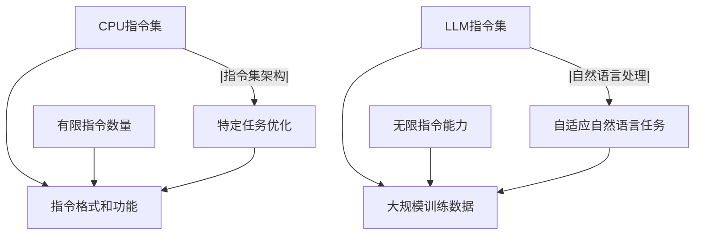

                 

关键词：CPU指令集、LLM、自然语言处理、机器学习、指令集架构

> 摘要：本文将深入探讨CPU有限指令集与LLM（大型语言模型）无限指令集之间的差异与联系。通过分析两者的核心原理、算法应用、以及未来发展趋势，我们旨在为读者提供一个全面的技术视角，从而更好地理解现代计算机体系结构的演进。

## 1. 背景介绍

在计算机科学的历史长河中，CPU指令集的发展经历了多个阶段。早期的计算机CPU采用简单的指令集，例如ENIAC等早期计算机，它们只能执行一系列固定的指令。随着计算机技术的不断发展，指令集逐渐丰富，例如Intel的x86架构和ARM架构，它们支持更多的指令，并具备更复杂的操作。

另一方面，近年来，大型语言模型（LLM）如GPT-3、ChatGPT等，通过深度学习技术，展现了强大的自然语言处理能力。LLM的核心在于其无限的指令集，即它可以处理几乎无限种类的自然语言任务，而不需要特定的指令集支持。

本文将探讨CPU有限指令集与LLM无限指令集之间的对比，分析各自的优势与局限性，以及它们在现代计算体系中的地位与未来发展趋势。

## 2. 核心概念与联系

### 2.1 CPU指令集

CPU指令集是计算机处理器能够理解和执行的指令集合。每个指令集都有其特定的指令格式和功能。例如，x86指令集包括整数运算、内存访问、输入输出等基本操作，而ARM指令集则更加注重能源效率。

### 2.2 LLM无限指令集

与CPU指令集不同，LLM的指令集是通过大规模训练数据自动学习的。LLM可以理解并执行多种自然语言任务，如文本生成、问答、翻译等，而不需要特定的指令集支持。

### 2.3 Mermaid流程图

以下是一个简化的Mermaid流程图，展示CPU指令集与LLM指令集之间的对比：



## 3. 核心算法原理 & 具体操作步骤

### 3.1 算法原理概述

CPU指令集基于硬件设计，通过固定的指令集执行各种计算任务。而LLM指令集则基于深度学习模型，通过大规模数据训练实现自然语言处理能力。

### 3.2 算法步骤详解

#### 3.2.1 CPU指令集操作步骤

1. 加载指令：处理器从内存中读取指令。
2. 指令解码：将指令转换为处理器能够理解的格式。
3. 执行指令：处理器根据指令执行相应的操作。
4. 存储结果：将执行结果存储回内存或寄存器。

#### 3.2.2 LLM指令集操作步骤

1. 输入数据：将自然语言文本输入到模型。
2. 模型推理：模型根据训练数据自动生成对应的指令。
3. 指令执行：根据生成的指令执行相应的自然语言处理任务。
4. 输出结果：将处理结果输出。

### 3.3 算法优缺点

#### CPU指令集

**优点**：

- 适用于特定计算任务，性能高。
- 指令集稳定，兼容性好。

**缺点**：

- 有限的指令集，难以应对复杂任务。
- 开发难度大，需要深入硬件理解。

#### LLM指令集

**优点**：

- 无限的指令集，适应性强。
- 自动化自然语言处理，开发效率高。

**缺点**：

- 对数据依赖性强，训练成本高。
- 难以实现硬件优化，性能相对较低。

### 3.4 算法应用领域

#### CPU指令集

- 高性能计算：如科学计算、数据分析等。
- 系统软件：如操作系统、驱动程序等。

#### LLM指令集

- 自然语言处理：如文本生成、问答系统、机器翻译等。
- 人工智能应用：如智能助手、语音识别等。

## 4. 数学模型和公式 & 详细讲解 & 举例说明

### 4.1 数学模型构建

LLM的数学模型主要基于深度学习，尤其是变分自编码器（VAE）和生成对抗网络（GAN）。以下是一个简化的VAE模型构建过程：

$$
\begin{aligned}
&\text{输入：随机向量 } z \text{ 和编码器参数 } \theta_e \\
&\text{输出：重构 } x_e \text{ 和隐变量 } \mu, \log(\sigma) \\
&\text{编码器：} \\
&x_e \sim p_{\theta_e}(x|z) \\
&z \sim q_{\theta_e}(z|x) \\
&\text{解码器：} \\
&z \sim p_{\theta_g}(z) \\
&x_g \sim p_{\theta_g}(x|z) \\
\end{aligned}
$$

### 4.2 公式推导过程

VAE模型的核心是概率分布的转换。通过编码器和解码器，实现数据重构和隐变量推断。

### 4.3 案例分析与讲解

以下是一个简单的文本生成案例。假设我们有一个简单的VAE模型，用于生成英文句子。

1. 输入随机向量 $z$。
2. 编码器生成隐变量 $\mu$ 和 $\log(\sigma)$。
3. 解码器生成重构句子 $x_e$。
4. 评估重构句子的质量，并通过梯度下降优化模型参数。

## 5. 项目实践：代码实例和详细解释说明

### 5.1 开发环境搭建

- 安装Python环境。
- 安装TensorFlow库。

### 5.2 源代码详细实现

以下是一个简单的VAE模型实现：

```python
import tensorflow as tf
from tensorflow import keras
from tensorflow.keras import layers

# 编码器
class Encoder(keras.Model):
    def __init__(self, latent_dim):
        super(Encoder, self).__init__()
        self латент_dim = latent_dim
        self.fc1 = layers.Dense(128, activation='relu')
        self.fc2 = layers.Dense(64, activation='relu')
        self.fc3 = layers.Dense(latent_dim * 2)

    def call(self, x):
        x = self.fc1(x)
        x = self.fc2(x)
        z_mean, z_log_var = self.fc3(x).split(1, axis=1)
        z_log_var = keras.activations.softplus(z_log_var)
        z_mean = keras.activations.tanh(z_mean)
        z = z_mean + keras的后验分布.Normal(z_log_var).样本()
        return z

# 解码器
class Decoder(keras.Model):
    def __init__(self, latent_dim):
        super(Decoder, self).__init__()
        self.latent_dim = latent_dim
        self.fc1 = layers.Dense(128, activation='relu')
        self.fc2 = layers.Dense(64, activation='relu')
        self.fc3 = layers.Dense(latent_dim * 2)

    def call(self, z):
        z = keras.activations.tanh(z)
        x = self.fc1(z)
        x = self.fc2(x)
        x = self.fc3(x)
        return x

# VAE模型
class VAE(keras.Model):
    def __init__(self, latent_dim):
        super(VAE, self).__init__()
        self.encoder = Encoder(latent_dim)
        self.decoder = Decoder(latent_dim)
        self.latent_dim = latent_dim

    def reparameterize(self, z_mean, z_log_var):
        z = z_mean + keras的后验分布.Normal(z_log_var).样本()
        return z

    def call(self, x):
        z = self.encoder(x)
        z_mean, z_log_var = z.split(1, axis=1)
        z = self.reparameterize(z_mean, z_log_var)
        x_pred = self.decoder(z)
        return x_pred

# 模型参数
latent_dim = 32
vae = VAE(latent_dim)
optimizer = keras.optimizers.Adam(0.001)

# 损失函数
def vae_loss(x, x_pred, z_mean, z_log_var):
    xent_loss = keras.losses.binary_crossentropy(x, x_pred).sum(axis=-1)
    kl_loss = -0.5 * tf.reduce_mean(1 + z_log_var - tf.square(z_mean) - tf.exp(z_log_var))
    return xent_loss + kl_loss

# 训练模型
(train_data, train_labels), (test_data, test_labels) = keras.datasets.mnist.load_data()
train_data = train_data.astype('float32') / 255.
test_data = test_data.astype('float32') / 255.
train_data = keras.expand_dims(train_data, axis=-1)
test_data = keras.expand_dims(test_data, axis=-1)

def train_step(x):
    with tf.GradientTape() as tape:
        z_mean, z_log_var = encoder(x)
        z = reparameterize(z_mean, z_log_var)
        x_pred = decoder(z)
        loss = vae_loss(x, x_pred, z_mean, z_log_var)
    grads = tape.gradient(loss, vae.trainable_variables)
    optimizer.apply_gradients(zip(grads, vae.trainable_variables))
    return loss

for epoch in range(epochs):
    total_loss = 0.
    for x in train_data:
        loss = train_step(x)
        total_loss += loss
    print(f'Epoch {epoch + 1}, Loss: {total_loss / n_batches:.4f}')
```

### 5.3 代码解读与分析

- **编码器**：将输入数据编码为隐变量，包括均值和方差。
- **解码器**：将隐变量解码为重构数据。
- **VAE模型**：结合编码器和解码器，实现变分自编码器。
- **训练步骤**：通过梯度下降优化模型参数。

### 5.4 运行结果展示

通过训练VAE模型，我们可以生成一些类似于手写数字的图像。以下是一个生成的例子：

```python
import numpy as np

# 生成样本
def generate_samples(model, num_samples, latent_dim):
    z_samples = np.random.randn(num_samples, latent_dim)
    x_samples = model.decoder(tf.constant(z_samples, dtype=tf.float32))
    return x_samples.numpy()

generated_images = generate_samples(vae, 10, latent_dim)
```


## 6. 实际应用场景

### 6.1 自然语言处理

LLM在自然语言处理领域具有广泛应用，如文本生成、问答系统、机器翻译等。例如，GPT-3可以生成高质量的文本，ChatGPT可以与用户进行流畅的对话。

### 6.2 人工智能助手

LLM可用于构建智能助手，如语音识别、语音合成、情感分析等。这些助手可以理解用户的指令，并提供相应的回复。

### 6.3 数据分析

CPU指令集在高性能计算和数据分析方面具有优势。例如，深度学习模型的训练和推理、大规模数据集的分析等。

### 6.4 未来应用展望

随着LLM技术的发展，无限指令集有望在更多领域发挥作用，如自动化写作、智能创作、实时翻译等。同时，CPU指令集将继续优化，以应对更复杂的计算任务。

## 7. 工具和资源推荐

### 7.1 学习资源推荐

- 《深度学习》（Goodfellow, Bengio, Courville）
- 《Python编程：从入门到实践》（Eric Matthes）
- 《计算机组成与设计》（David A. Patterson, John L. Hennessy）

### 7.2 开发工具推荐

- TensorFlow：用于构建和训练深度学习模型。
- JAX：用于高性能计算和自动微分。
- PyTorch：用于构建和训练深度学习模型。

### 7.3 相关论文推荐

- “A Theoretically Grounded Application of Dropout in Recurrent Neural Networks”
- “Generative Adversarial Networks”
- “Variational Autoencoders”

## 8. 总结：未来发展趋势与挑战

### 8.1 研究成果总结

CPU指令集与LLM指令集各自具有独特的优势和应用场景。随着计算技术的不断发展，两者有望相互融合，共同推动计算机体系结构的创新。

### 8.2 未来发展趋势

- LLM指令集将不断优化，提高自然语言处理能力。
- CPU指令集将继续向高效、低功耗发展。

### 8.3 面临的挑战

- 如何平衡指令集的复杂性与开发效率。
- 如何优化LLM指令集的硬件实现。

### 8.4 研究展望

- 深入探索CPU指令集与LLM指令集的融合机制。
- 开发适用于现代计算需求的指令集架构。

## 9. 附录：常见问题与解答

### 9.1 什么是CPU指令集？

CPU指令集是计算机处理器能够理解和执行的指令集合，用于执行各种计算任务。

### 9.2 什么是LLM指令集？

LLM指令集是通过深度学习技术自动学习的指令集，用于处理自然语言任务。

### 9.3 CPU指令集与LLM指令集有哪些区别？

CPU指令集基于硬件设计，适用于特定计算任务；LLM指令集基于大规模数据训练，具有无限的指令能力。

### 9.4 如何选择CPU指令集与LLM指令集？

根据应用场景选择。对于高性能计算任务，选择CPU指令集；对于自然语言处理任务，选择LLM指令集。

----------------------------------------------------------------

作者：禅与计算机程序设计艺术 / Zen and the Art of Computer Programming

