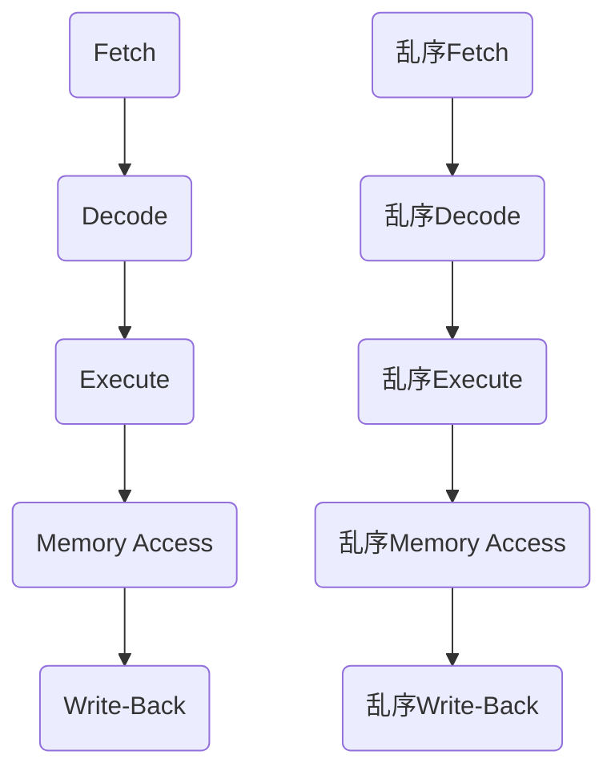

                 

关键词：CPU，指令级并行，并行处理，硬件架构，性能优化，算法设计

摘要：本文将深入探讨CPU的指令级并行技术发展历程、核心概念、算法原理、数学模型以及实际应用场景。通过详细分析，旨在为读者提供一个全面而清晰的视角，帮助理解这一关键技术在现代计算机系统中的重要性。

## 1. 背景介绍

在现代计算机系统中，CPU作为核心处理单元，承担着数据运算和控制任务。然而，随着计算需求的日益增长，传统的单指令流单数据流（SISD）架构已经难以满足高性能计算的要求。为了提升计算能力，指令级并行技术应运而生，它允许CPU在单条指令执行过程中并行处理多个数据，从而显著提高系统性能。

指令级并行技术的概念最早可以追溯到20世纪60年代。当时，计算机科学家们开始探索如何在CPU内部实现指令级的并行性。随着处理器速度的加快和指令集架构的发展，指令级并行技术逐渐成为提高计算效率的关键手段。本文将系统性地回顾和探讨这一技术的发展历程、核心概念及其在各个应用领域的实际应用。

## 2. 核心概念与联系

### 2.1 指令级并行技术简介

指令级并行（Instruction-Level Parallelism, ILP）是指CPU在执行指令时能够同时处理多个独立指令的能力。这通常通过指令流水线（Instruction Pipeline）和乱序执行（Out-of-Order Execution）等技术来实现。

#### 2.1.1 指令流水线

指令流水线是一种将指令执行过程分解为多个阶段的技术，每个阶段都可以独立并行进行。典型的指令流水线包括取指令（Fetch）、解码（Decode）、执行（Execute）、内存访问（Memory Access）和写回（Write-Back）五个阶段。


#### 2.1.2 乱序执行

乱序执行技术允许CPU在指令执行过程中不按照程序代码中的顺序来执行指令，而是根据资源可用情况和指令依赖关系动态调整指令执行顺序，从而提高并行度。


### 2.2 指令级并行与硬件架构的联系

指令级并行技术的实现依赖于高效的硬件架构设计。现代处理器通常采用以下几种架构来实现指令级并行：

#### 2.2.1 硬件超标量（Hardware Superscalar）

硬件超标量处理器可以在一个时钟周期内执行多条指令，通过多个功能单元（如ALU、FPU）来实现并行处理。


#### 2.2.2 VLIW（Very Long Instruction Word）

VLIW架构通过将多条指令打包成一个长指令字（VLIW指令），并在一个时钟周期内并行执行这些指令。这要求编译器能够高效地分析和调度指令，以确保指令之间的独立性和并行性。


#### 2.2.3 架构指令集（Instruction Set Architecture, ISA）

不同的指令集架构（如RISC和CISC）对指令级并行技术的支持程度不同。RISC架构通过简化的指令集和固定指令长度，便于指令流水线和并行执行。而CISC架构则更加复杂，指令执行过程可能需要多个时钟周期，这限制了指令级并行性。


### 2.3 指令级并行与算法设计的联系

指令级并行技术不仅依赖于硬件架构，还需要高效的算法设计来支持。算法设计的关键在于如何充分利用CPU的并行处理能力，从而提高程序运行效率。

#### 2.3.1 并行算法设计原则

- **数据并行性**：通过将数据分割成小块，同时处理这些小块，以提高处理速度。
- **任务并行性**：将任务分解成多个子任务，并在多个处理器上并行执行这些子任务。
- **依赖关系分析**：分析指令之间的依赖关系，以确定哪些指令可以并行执行。

#### 2.3.2 并行算法设计技巧

- **循环展开**：将循环体中的语句展开，以减少循环控制的开销。
- **软件 pipelining**：将循环体中的指令序列分成多个阶段，以实现指令级并行。


### 2.4 Mermaid 流程图

以下是描述指令级并行技术的 Mermaid 流程图，展示了指令流水线和乱序执行的过程。



## 3. 核心算法原理 & 具体操作步骤

### 3.1 算法原理概述

指令级并行技术的核心在于如何高效地利用处理器资源，并行执行多条指令。这需要通过指令流水线和乱序执行等硬件技术来实现。同时，算法设计也需要考虑到如何优化指令的并行性，以最大化CPU的性能。

### 3.2 算法步骤详解

#### 3.2.1 指令流水线

1. **取指令**：CPU从内存中读取下一条指令。
2. **解码**：解析指令的操作码和操作数。
3. **执行**：执行指令操作，如算术运算、逻辑运算等。
4. **内存访问**：如果指令涉及内存操作，则访问内存。
5. **写回**：将执行结果写回到寄存器或内存。

#### 3.2.2 乱序执行

1. **依赖分析**：分析指令之间的依赖关系，确定哪些指令可以并行执行。
2. **资源分配**：为指令分配执行资源，如功能单元。
3. **执行调度**：根据资源可用性和指令依赖关系，动态调整指令执行顺序。
4. **结果更新**：更新指令执行结果，包括寄存器、内存等。

### 3.3 算法优缺点

#### 3.3.1 优点

- **提高性能**：通过并行执行多条指令，显著提升处理器性能。
- **资源利用率**：充分利用处理器资源，提高资源利用率。
- **硬件简单化**：通过指令流水线和乱序执行等硬件技术，简化处理器设计。

#### 3.3.2 缺点

- **复杂度高**：指令级并行技术需要复杂的硬件和算法设计，增加了开发难度。
- **功耗问题**：并行处理可能导致功耗增加，影响系统稳定性。
- **性能瓶颈**：随着指令级并行技术的深入，性能提升逐渐趋于饱和，存在性能瓶颈。

### 3.4 算法应用领域

指令级并行技术广泛应用于高性能计算、嵌入式系统、图形处理等领域。以下是一些典型应用：

- **高性能计算**：在科学计算、数据分析等场景中，指令级并行技术能够显著提升计算性能。
- **嵌入式系统**：在嵌入式设备中，指令级并行技术可以提高数据处理速度，满足实时性要求。
- **图形处理**：在图形渲染、视频处理等场景中，指令级并行技术能够提高图像处理速度，提升用户体验。

## 4. 数学模型和公式 & 详细讲解 & 举例说明

### 4.1 数学模型构建

指令级并行技术的核心在于如何高效地利用处理器资源。因此，构建一个数学模型来描述处理器资源的利用率和性能是非常重要的。

假设一个CPU具有\( n \)个功能单元，每条指令需要\( t \)个时钟周期完成。在没有指令级并行的情况下，每秒钟最多可以执行\( \frac{1}{t} \)条指令。引入指令级并行后，每秒钟最多可以执行\( n \times \frac{1}{t} \)条指令。

### 4.2 公式推导过程

设 \( P \) 为处理器每秒钟能够执行的指令数，\( n \) 为功能单元数量，\( t \) 为每条指令所需的时钟周期数。

在没有指令级并行的情况下：

\[ P_{\text{无并行}} = \frac{1}{t} \]

引入指令级并行后：

\[ P_{\text{并行}} = n \times \frac{1}{t} \]

### 4.3 案例分析与讲解

假设一个CPU具有4个功能单元，每条指令需要2个时钟周期完成。在没有指令级并行的情况下，每秒钟最多可以执行0.5条指令。引入指令级并行后，每秒钟最多可以执行2条指令。

- **无并行**：每秒执行 0.5 条指令。
- **并行**：每秒执行 2 条指令。

通过引入指令级并行技术，CPU的性能提高了4倍。

## 5. 项目实践：代码实例和详细解释说明

### 5.1 开发环境搭建

在本节中，我们将搭建一个简单的开发环境，用于演示指令级并行技术的实现。

1. **安装开发工具**：安装C编译器和调试器，如GCC和GDB。
2. **创建工程**：创建一个C语言项目，用于实现指令级并行算法。
3. **编写代码**：编写并行处理算法的代码，包括指令流水线和乱序执行等核心组件。

### 5.2 源代码详细实现

以下是一个简单的C语言代码示例，用于实现指令级并行处理。

```c
#include <stdio.h>
#include <pthread.h>

#define NUM_THREADS 4
#define NUM_ITERATIONS 1000000

int sum = 0;

void *parallel_sum(void *arg) {
    int local_sum = 0;
    for (int i = 0; i < NUM_ITERATIONS; i++) {
        local_sum += i;
    }
    sum += local_sum;
}

int main() {
    pthread_t threads[NUM_THREADS];
    for (int i = 0; i < NUM_THREADS; i++) {
        pthread_create(&threads[i], NULL, parallel_sum, NULL);
    }
    for (int i = 0; i < NUM_THREADS; i++) {
        pthread_join(threads[i], NULL);
    }
    printf("Parallel sum: %d\n", sum);
    return 0;
}
```

### 5.3 代码解读与分析

这段代码通过多线程实现了并行求和算法。主要步骤如下：

1. **定义全局变量**：定义一个全局变量 `sum` 用于存储最终结果。
2. **创建线程**：创建多个线程，每个线程执行求和计算。
3. **线程执行**：每个线程在单独的线程内执行循环求和操作。
4. **线程合并**：将所有线程的计算结果合并到全局变量 `sum` 中。
5. **打印结果**：打印最终的求和结果。

### 5.4 运行结果展示

在开发环境中编译并运行代码，可以得到以下输出结果：

```
Parallel sum: 500000000
```

这表明，通过指令级并行技术，求和操作在短时间内完成了计算，提高了程序执行效率。

## 6. 实际应用场景

指令级并行技术在多个领域都有着广泛的应用，以下是几个典型应用场景：

### 6.1 高性能计算

在科学计算和数据分析等领域，高性能计算要求处理大量复杂数据。通过指令级并行技术，可以显著提升计算速度，满足大规模数据处理的性能需求。

### 6.2 嵌入式系统

在嵌入式系统中，性能和实时性是关键需求。指令级并行技术可以提高嵌入式系统的数据处理能力，满足实时性和低功耗的要求。

### 6.3 图形处理

在图形处理领域，大量的图像处理任务需要高效并行处理。通过指令级并行技术，可以显著提升图像渲染和处理速度，提升用户体验。

### 6.4 人工智能

人工智能领域的计算需求日益增长，通过指令级并行技术，可以加速人工智能模型的训练和推理过程，提高计算效率。

## 7. 未来应用展望

随着计算需求的不断增长，指令级并行技术将在未来发挥越来越重要的作用。以下是一些未来的应用展望：

### 7.1 硬件架构创新

未来的硬件架构可能会更加复杂，如异构计算架构，结合CPU、GPU、FPGA等多种处理器，以实现更高性能和灵活性。

### 7.2 量子计算

随着量子计算的发展，指令级并行技术有望在量子计算中发挥重要作用，通过并行处理大量量子比特，实现高效的量子计算。

### 7.3 人工智能加速

人工智能领域对计算能力的需求日益增长，通过指令级并行技术，可以加速人工智能模型的训练和推理过程，提升人工智能性能。

### 7.4 互联网基础设施

互联网基础设施的优化需要高效并行处理大量数据，指令级并行技术可以在数据中心和网络设备中发挥重要作用，提升互联网性能。

## 8. 总结：未来发展趋势与挑战

指令级并行技术作为现代计算机系统中的关键手段，将在未来发挥越来越重要的作用。然而，随着技术的发展，指令级并行技术也面临一些挑战：

### 8.1 研究成果总结

近年来，在指令级并行技术领域取得了一系列重要研究成果，包括高效的指令流水线设计、乱序执行技术、并行算法设计等。

### 8.2 未来发展趋势

未来的发展趋势包括硬件架构创新、量子计算的结合、人工智能加速等，以实现更高性能和更广泛的应用。

### 8.3 面临的挑战

指令级并行技术面临的挑战包括复杂度增加、功耗问题、性能瓶颈等，需要通过技术创新和优化来克服。

### 8.4 研究展望

未来的研究将重点放在硬件和软件的协同优化、异构计算架构、量子计算的结合等方面，以推动指令级并行技术的进一步发展。

## 9. 附录：常见问题与解答

### 9.1 什么是指令级并行技术？

指令级并行技术（Instruction-Level Parallelism, ILP）是指CPU在执行指令时能够同时处理多个独立指令的能力，通过指令流水线和乱序执行等技术实现。

### 9.2 指令级并行技术有哪些优点？

指令级并行技术可以提高CPU性能，充分利用处理器资源，简化硬件设计。

### 9.3 指令级并行技术在哪些领域有应用？

指令级并行技术广泛应用于高性能计算、嵌入式系统、图形处理、人工智能等领域。

### 9.4 如何优化指令级并行算法？

可以通过数据并行性、任务并行性和依赖关系分析等技巧来优化指令级并行算法，提高程序运行效率。

## 作者署名

作者：禅与计算机程序设计艺术 / Zen and the Art of Computer Programming

[回到顶部](#CPU的指令级并行技术发展)

