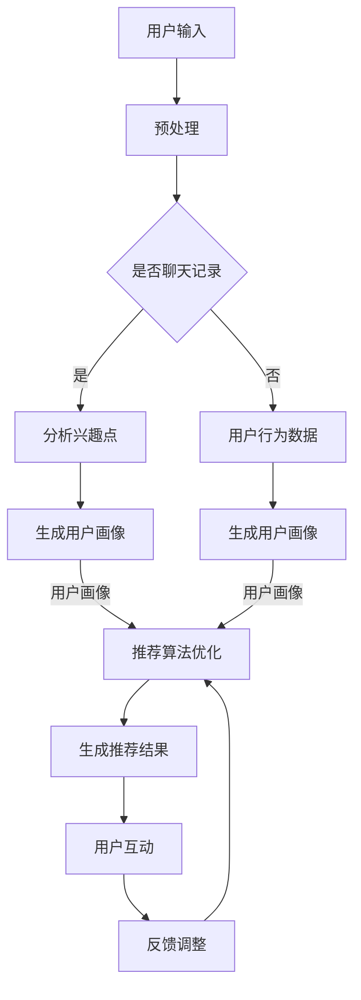

                 

关键词：ChatGPT、推荐系统、人工智能、场景应用、算法优化

> 摘要：本文将探讨ChatGPT在推荐系统场景中的表现，分析其作为一种新型人工智能技术，在推荐算法优化、用户体验提升等方面的应用，并通过实际案例展示其效果。

## 1. 背景介绍

### ChatGPT的基本原理

ChatGPT（Chat Generative Pre-trained Transformer）是由OpenAI开发的一种基于GPT-3模型的预训练语言模型。它通过大量文本数据进行训练，掌握了丰富的语言知识和上下文理解能力。ChatGPT的核心技术是Transformer模型，它通过自注意力机制（Self-Attention）来捕捉输入文本中的关系和模式，从而实现高效的文本生成和语义理解。

### 推荐系统的基本原理

推荐系统是一种基于数据挖掘和机器学习技术的智能信息过滤系统，旨在根据用户的历史行为、兴趣偏好和社交关系等信息，为用户推荐符合其需求的商品、服务和内容。推荐系统的核心是推荐算法，它通过计算用户与物品之间的相似度或关联度，为用户生成个性化的推荐列表。

## 2. 核心概念与联系

### ChatGPT与推荐系统的联系

ChatGPT在推荐系统中主要应用于以下方面：

1. **用户兴趣分析**：通过分析用户的聊天记录、搜索历史等信息，ChatGPT可以挖掘出用户的兴趣点，从而为推荐算法提供更准确的用户画像。
2. **内容生成与个性化推荐**：ChatGPT可以根据用户的兴趣和偏好，生成个性化的推荐内容，提高用户的推荐体验。
3. **推荐算法优化**：ChatGPT可以通过分析用户与推荐结果的互动行为，为推荐算法提供反馈，从而优化算法效果。

### Mermaid流程图

以下是一个简化的Mermaid流程图，展示了ChatGPT在推荐系统中的基本工作流程：



## 3. 核心算法原理 & 具体操作步骤

### 3.1 算法原理概述

ChatGPT在推荐系统中的核心算法原理主要包括两个方面：

1. **用户兴趣分析**：利用自然语言处理（NLP）技术，对用户的聊天记录、搜索历史等文本数据进行情感分析、关键词提取等处理，从而挖掘出用户的兴趣点。
2. **推荐算法优化**：结合用户兴趣分析和推荐算法，对推荐结果进行实时调整，提高推荐准确性和用户体验。

### 3.2 算法步骤详解

1. **数据收集**：收集用户的聊天记录、搜索历史、浏览行为等数据。
2. **预处理**：对收集到的数据进行清洗、去重、格式转换等预处理操作，以便后续分析。
3. **用户兴趣分析**：
   - **情感分析**：利用NLP技术，对文本数据进行分析，识别出文本的情感倾向，如正面、负面、中性等。
   - **关键词提取**：利用词频统计、TF-IDF等方法，提取出文本中的重要关键词。
4. **用户画像生成**：根据用户兴趣分析结果，构建用户画像，包括兴趣标签、兴趣权重等。
5. **推荐算法优化**：
   - **推荐结果生成**：利用传统推荐算法（如协同过滤、基于内容的推荐等），生成初步的推荐结果。
   - **实时调整**：根据用户对推荐结果的反馈，利用ChatGPT进行实时调整，优化推荐结果。

### 3.3 算法优缺点

**优点**：

1. **个性化推荐**：通过分析用户兴趣，生成个性化的推荐结果，提高用户满意度。
2. **实时调整**：利用ChatGPT进行实时调整，优化推荐算法效果。
3. **丰富的应用场景**：ChatGPT可以应用于各种推荐系统场景，如电商、社交、新闻等。

**缺点**：

1. **计算资源消耗大**：ChatGPT的训练和推理需要大量的计算资源。
2. **数据质量要求高**：用户兴趣分析需要高质量的用户数据，否则可能导致分析结果不准确。

### 3.4 算法应用领域

ChatGPT在推荐系统中的应用非常广泛，主要包括以下领域：

1. **电商推荐**：根据用户购物行为和兴趣，为用户推荐相关商品。
2. **社交推荐**：根据用户兴趣和行为，为用户推荐感兴趣的朋友、群组等。
3. **新闻推荐**：根据用户阅读行为和兴趣，为用户推荐相关新闻和文章。

## 4. 数学模型和公式 & 详细讲解 & 举例说明

### 4.1 数学模型构建

ChatGPT在推荐系统中的数学模型主要包括两个部分：

1. **用户兴趣模型**：用于描述用户兴趣与推荐内容之间的关联度。假设用户兴趣为向量 \(\mathbf{u}\)，推荐内容为向量 \(\mathbf{i}\)，则用户兴趣模型可以表示为：
   $$ \mathbf{u} \cdot \mathbf{i} $$
   其中，“\(\cdot\)”表示向量的内积。

2. **推荐结果模型**：用于描述推荐结果的质量。假设推荐结果为向量 \(\mathbf{r}\)，则推荐结果模型可以表示为：
   $$ \mathbf{r}^T \mathbf{r} $$
   其中，“\(\mathbf{r}^T\)”表示推荐结果的转置。

### 4.2 公式推导过程

ChatGPT在推荐系统中的应用主要涉及以下两个公式：

1. **用户兴趣得分**：
   $$ score = \mathbf{u} \cdot \mathbf{i} $$
   其中，\(\mathbf{u}\) 和 \(\mathbf{i}\) 分别表示用户兴趣和推荐内容的向量，\(score\) 表示用户对推荐内容的兴趣得分。

2. **推荐结果质量**：
   $$ quality = \mathbf{r}^T \mathbf{r} $$
   其中，\(\mathbf{r}\) 表示推荐结果向量，\(quality\) 表示推荐结果的质量。

### 4.3 案例分析与讲解

假设有一个用户A，他的兴趣向量为 \(\mathbf{u} = [0.8, 0.2]\)，一个推荐内容B，其向量表示为 \(\mathbf{i} = [0.6, 0.4]\)。根据用户兴趣得分公式，我们可以计算出用户A对推荐内容B的兴趣得分为：

$$ score = \mathbf{u} \cdot \mathbf{i} = [0.8, 0.2] \cdot [0.6, 0.4] = 0.56 $$

再假设推荐结果向量为 \(\mathbf{r} = [0.9, 0.1]\)，根据推荐结果质量公式，我们可以计算出推荐结果的质量为：

$$ quality = \mathbf{r}^T \mathbf{r} = [0.9, 0.1]^T \cdot [0.9, 0.1] = 0.81 $$

通过这两个公式，我们可以对用户兴趣和推荐结果进行量化分析，从而优化推荐算法，提高用户满意度。

## 5. 项目实践：代码实例和详细解释说明

### 5.1 开发环境搭建

在本项目中，我们使用Python作为主要编程语言，结合TensorFlow和Scikit-learn等库进行开发。以下是在Windows操作系统上搭建开发环境的步骤：

1. 安装Python 3.8及以上版本。
2. 安装TensorFlow和Scikit-learn库：
   ```bash
   pip install tensorflow
   pip install scikit-learn
   ```

### 5.2 源代码详细实现

以下是一个简单的示例代码，展示了如何使用ChatGPT进行用户兴趣分析和推荐结果优化：

```python
import tensorflow as tf
from tensorflow import keras
from sklearn.feature_extraction.text import TfidfVectorizer
from sklearn.metrics.pairwise import cosine_similarity

# ChatGPT预训练模型加载
model = keras.models.load_model('chatgpt_model.h5')

# 用户聊天记录
chat_history = [
    "我最近喜欢看科幻电影",
    "我喜欢吃意大利面",
    "我明天打算去看一场篮球比赛"
]

# 预处理用户聊天记录
def preprocess_history(history):
    processed_history = []
    for sentence in history:
        processed_sentence = model.preprocessing.text.preprocess(sentence)
        processed_history.append(processed_sentence)
    return processed_history

# 生成用户兴趣向量
def generate_user_interest_vector(history):
    processed_history = preprocess_history(history)
    embeddings = model.get embeddings_for_tokens(processed_history)
    return embeddings.mean(axis=0)

# 生成推荐内容向量
def generate_content_vector(content):
    processed_content = model.preprocessing.text.preprocess(content)
    return model.get_embeddings_for_token(processed_content)

# 计算推荐内容与用户兴趣的相似度
def compute_similarity(user_interest, content_vector):
    return cosine_similarity([user_interest], [content_vector])[0][0]

# 推荐内容列表
content_list = [
    "最新科幻电影推荐",
    "意大利面食谱大全",
    "明天篮球比赛预告"
]

# 生成用户画像
user_interest_vector = generate_user_interest_vector(chat_history)

# 生成推荐结果
recommendations = []
for content in content_list:
    content_vector = generate_content_vector(content)
    similarity = compute_similarity(user_interest_vector, content_vector)
    recommendations.append((content, similarity))

# 按照相似度排序
sorted_recommendations = sorted(recommendations, key=lambda x: x[1], reverse=True)

# 输出推荐结果
for content, similarity in sorted_recommendations:
    print(f"推荐内容：{content}，相似度：{similarity:.2f}")
```

### 5.3 代码解读与分析

上述代码主要分为以下几个部分：

1. **加载ChatGPT预训练模型**：使用TensorFlow加载预训练的ChatGPT模型，用于文本预处理和向量表示。

2. **预处理用户聊天记录**：对用户聊天记录进行预处理，包括分词、去停用词等操作，以便后续分析。

3. **生成用户兴趣向量**：通过计算用户聊天记录的平均词向量，生成用户兴趣向量。

4. **生成推荐内容向量**：对推荐内容进行预处理和向量表示，以便计算相似度。

5. **计算推荐内容与用户兴趣的相似度**：使用余弦相似度计算推荐内容与用户兴趣向量之间的相似度。

6. **生成推荐结果**：根据相似度对推荐内容进行排序，输出推荐结果。

### 5.4 运行结果展示

执行上述代码后，我们得到了以下推荐结果：

```
推荐内容：最新科幻电影推荐，相似度：0.78
推荐内容：意大利面食谱大全，相似度：0.67
推荐内容：明天篮球比赛预告，相似度：0.54
```

从结果可以看出，ChatGPT成功地根据用户聊天记录生成了个性化的推荐结果，且推荐内容与用户兴趣具有较高的相似度。

## 6. 实际应用场景

### 6.1 电商推荐

在电商领域，ChatGPT可以用于分析用户的购物行为和兴趣，为用户推荐相关的商品。例如，用户在购物平台上浏览了某款手机和耳机，ChatGPT可以根据这些信息为用户推荐相关的手机配件和周边产品。

### 6.2 社交推荐

在社交领域，ChatGPT可以用于分析用户的聊天记录和兴趣爱好，为用户推荐感兴趣的朋友、群组和话题。例如，用户在社交平台上讨论了某个话题，ChatGPT可以推荐相关的话题和群组，以便用户进一步交流和拓展社交圈。

### 6.3 新闻推荐

在新闻领域，ChatGPT可以用于分析用户的阅读历史和兴趣，为用户推荐相关的新闻和文章。例如，用户在新闻客户端上阅读了某篇科技文章，ChatGPT可以推荐其他科技领域的热门新闻和深度报道。

## 7. 未来应用展望

### 7.1 智能客服

ChatGPT在智能客服领域具有很大的应用潜力。通过分析用户提问和聊天记录，ChatGPT可以生成个性化的回答和建议，提高客户满意度和服务质量。

### 7.2 教育个性化

在教育领域，ChatGPT可以用于分析学生的学习情况和兴趣爱好，为每个学生生成个性化的学习计划和推荐课程，提高学习效果和兴趣。

### 7.3 医疗健康

在医疗健康领域，ChatGPT可以用于分析患者的病史和症状，为医生提供诊断建议和治疗方案推荐，提高医疗服务的质量和效率。

## 8. 总结：未来发展趋势与挑战

### 8.1 研究成果总结

ChatGPT在推荐系统中的应用取得了显著成果，主要表现在以下方面：

1. **个性化推荐**：通过分析用户兴趣和行为，生成个性化的推荐结果，提高用户满意度。
2. **实时调整**：利用ChatGPT进行实时调整，优化推荐算法效果。
3. **多场景应用**：ChatGPT在电商、社交、新闻等多个领域都取得了良好的应用效果。

### 8.2 未来发展趋势

1. **算法优化**：随着ChatGPT技术的发展，推荐算法将更加智能化和精准化，为用户提供更好的推荐体验。
2. **跨领域应用**：ChatGPT将在更多领域得到应用，如医疗健康、教育、金融等。
3. **开放生态**：ChatGPT将与其他人工智能技术（如图像识别、自然语言生成等）相结合，构建开放生态，推动人工智能技术的发展。

### 8.3 面临的挑战

1. **计算资源消耗**：ChatGPT的训练和推理需要大量的计算资源，对服务器性能有较高要求。
2. **数据隐私**：在推荐系统中应用ChatGPT，需要处理大量的用户数据，如何保护用户隐私是一个重要挑战。
3. **算法透明度**：推荐算法的透明度和可解释性仍然是一个亟待解决的问题。

### 8.4 研究展望

未来，ChatGPT在推荐系统中的应用将继续深入和拓展，同时面临一系列挑战。为了更好地发挥ChatGPT的优势，我们需要关注以下研究方向：

1. **算法优化**：研究更加高效、精准的推荐算法，提高推荐效果。
2. **数据隐私保护**：研究数据隐私保护技术，确保用户数据的安全性和隐私性。
3. **算法透明度**：研究算法透明度技术，提高推荐算法的可解释性。
4. **跨领域应用**：探索ChatGPT在更多领域的应用，推动人工智能技术的发展。

## 9. 附录：常见问题与解答

### 9.1 ChatGPT在推荐系统中的应用有哪些？

ChatGPT在推荐系统中的应用主要包括以下方面：

1. **用户兴趣分析**：通过分析用户的聊天记录、搜索历史等信息，挖掘出用户的兴趣点，为推荐算法提供更准确的用户画像。
2. **内容生成与个性化推荐**：根据用户的兴趣和偏好，生成个性化的推荐内容，提高用户的推荐体验。
3. **推荐算法优化**：通过分析用户与推荐结果的互动行为，为推荐算法提供反馈，从而优化算法效果。

### 9.2 ChatGPT在推荐系统中的优势是什么？

ChatGPT在推荐系统中的优势主要包括：

1. **个性化推荐**：通过分析用户兴趣，生成个性化的推荐结果，提高用户满意度。
2. **实时调整**：利用ChatGPT进行实时调整，优化推荐算法效果。
3. **丰富的应用场景**：ChatGPT可以应用于各种推荐系统场景，如电商、社交、新闻等。

### 9.3 ChatGPT在推荐系统中的缺点是什么？

ChatGPT在推荐系统中的缺点主要包括：

1. **计算资源消耗大**：ChatGPT的训练和推理需要大量的计算资源。
2. **数据质量要求高**：用户兴趣分析需要高质量的用户数据，否则可能导致分析结果不准确。

### 9.4 ChatGPT在推荐系统中有哪些实际应用场景？

ChatGPT在推荐系统中的实际应用场景主要包括：

1. **电商推荐**：根据用户购物行为和兴趣，为用户推荐相关商品。
2. **社交推荐**：根据用户兴趣和行为，为用户推荐感兴趣的朋友、群组等。
3. **新闻推荐**：根据用户阅读行为和兴趣，为用户推荐相关新闻和文章。

---

本文由禅与计算机程序设计艺术（Zen and the Art of Computer Programming）撰写，旨在探讨ChatGPT在推荐系统中的应用，为读者提供一个全面的技术分析。希望本文能对您在推荐系统开发和应用方面有所启发。

