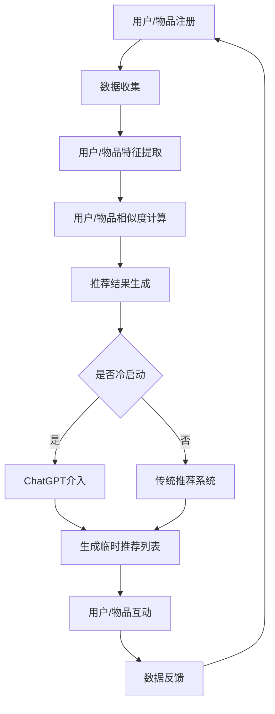

                 

关键词：推荐系统、冷启动、ChatGPT、人工智能、深度学习、算法原理、数学模型、项目实践

> 摘要：本文将深入探讨ChatGPT在推荐系统冷启动场景中的应用优势与局限。通过分析其算法原理、数学模型、项目实践以及未来发展趋势，本文旨在为推荐系统领域的研究者与实践者提供有价值的参考。

## 1. 背景介绍

随着互联网的迅速发展，个性化推荐系统已经成为电商平台、社交媒体等众多场景的核心功能之一。然而，推荐系统的冷启动问题一直是一个困扰着行业研究者和实践者的难题。所谓冷启动，指的是当用户或物品的初始数据量较少时，推荐系统难以生成有效的推荐结果。这一问题在用户初次使用某个应用时尤为突出。

近年来，基于深度学习和自然语言处理（NLP）的算法在推荐系统中取得了显著进展。尤其是ChatGPT——一个基于GPT-3模型的强大语言生成模型，其在推荐系统冷启动场景中展现出了诸多优势。然而，与此同时，ChatGPT也存在一些局限性。本文将详细探讨ChatGPT在推荐系统冷启动场景中的应用优势与局限。

## 2. 核心概念与联系

为了更好地理解ChatGPT在推荐系统冷启动场景中的应用，我们首先需要了解几个核心概念：推荐系统、冷启动、ChatGPT以及深度学习和自然语言处理。

### 2.1 推荐系统

推荐系统是一种基于用户行为和物品属性的数据分析技术，旨在为用户发现其可能感兴趣的内容或物品。推荐系统可以分为基于协同过滤（Collaborative Filtering）和基于内容（Content-Based）两大类。协同过滤通过分析用户之间的相似性来发现用户的兴趣；而基于内容的方法则通过分析物品的特征来推荐相似的内容。

### 2.2 冷启动

冷启动是指当用户或物品的初始数据量较少时，推荐系统难以生成有效的推荐结果。具体来说，可以分为用户冷启动（User Cold Start）和物品冷启动（Item Cold Start）。用户冷启动发生在用户初次使用某个应用时，而物品冷启动则发生在新物品首次上架时。

### 2.3 ChatGPT

ChatGPT是一个基于GPT-3模型的强大语言生成模型，它可以通过学习大量的文本数据来生成与输入文本相关的内容。ChatGPT具有强大的语言理解和生成能力，这使得它在推荐系统冷启动场景中具有潜在的应用价值。

### 2.4 深度学习和自然语言处理

深度学习是一种基于多层神经网络的学习方法，通过学习大量数据来提取特征并生成预测。自然语言处理（NLP）是深度学习的一个重要应用领域，旨在使计算机能够理解、生成和操作自然语言。

### 2.5 Mermaid 流程图

下面是一个Mermaid流程图，展示了推荐系统中用户和物品的冷启动过程以及ChatGPT的应用：



## 3. 核心算法原理 & 具体操作步骤

### 3.1 算法原理概述

ChatGPT在推荐系统冷启动场景中的应用，主要是基于其强大的语言理解和生成能力。具体来说，ChatGPT可以通过以下步骤实现冷启动推荐：

1. **数据收集**：收集用户或物品的初始数据，如用户浏览记录、搜索历史、购买行为等。
2. **数据预处理**：对收集到的数据进行清洗、去噪和标准化处理。
3. **特征提取**：使用自然语言处理技术提取用户或物品的关键特征。
4. **生成推荐列表**：利用ChatGPT生成与用户或物品相关的推荐列表。
5. **用户/物品互动**：用户通过推荐列表选择感兴趣的内容或物品，系统收集用户反馈。
6. **数据反馈**：将用户反馈数据用于模型优化和推荐列表更新。

### 3.2 算法步骤详解

1. **数据收集**：ChatGPT需要收集用户或物品的初始数据，这些数据可以包括用户浏览记录、搜索历史、购买行为、评价等。数据来源可以是用户注册表单、行为日志、社交媒体数据等。

2. **数据预处理**：收集到的数据通常包含噪声和不完整的信息。因此，需要使用数据清洗和去噪技术对数据进行预处理。数据清洗包括去除重复数据、缺失值填充、异常值处理等。数据去噪可以通过降噪算法、聚类分析等方法实现。

3. **特征提取**：自然语言处理技术在特征提取方面具有优势。ChatGPT可以使用词袋模型、词嵌入（Word Embedding）等技术提取用户或物品的关键特征。词嵌入是将单词映射到高维空间中的向量，从而捕获单词之间的语义关系。

4. **生成推荐列表**：ChatGPT通过学习大量的文本数据，已经具备了强大的语言生成能力。在生成推荐列表时，ChatGPT可以根据用户或物品的特征生成与目标用户或物品相关的文本内容，从而形成推荐列表。

5. **用户/物品互动**：用户通过浏览、搜索、购买等行为与推荐系统进行互动。系统记录用户的行为数据，并将其作为反馈信息。

6. **数据反馈**：将用户反馈数据用于模型优化和推荐列表更新。通过不断迭代优化，推荐系统可以逐渐提高推荐的准确性和用户满意度。

### 3.3 算法优缺点

**优点**：

- **强大的语言理解能力**：ChatGPT具备强大的语言理解能力，可以处理复杂的语义关系，从而生成更准确的推荐列表。
- **适应性强**：ChatGPT可以应用于多种推荐场景，如商品推荐、文章推荐、音乐推荐等，具有广泛的适用性。
- **个性化推荐**：ChatGPT可以根据用户的兴趣和行为生成个性化的推荐列表，提高用户的满意度。

**缺点**：

- **计算成本高**：ChatGPT是一个深度学习模型，训练和推理过程需要大量的计算资源。
- **数据依赖性强**：ChatGPT的性能依赖于训练数据的规模和质量，数据不足或质量差可能会导致推荐效果不佳。
- **隐私问题**：推荐系统需要收集和处理用户的个人信息，可能引发隐私泄露等问题。

### 3.4 算法应用领域

ChatGPT在推荐系统冷启动场景中具有广泛的应用领域，主要包括以下几个方面：

- **电商平台**：为新用户生成个性化的推荐列表，提高用户留存率和转化率。
- **社交媒体**：为用户生成个性化的内容推荐，提高用户活跃度和互动率。
- **在线教育**：为新用户推荐感兴趣的课程和学习资源，提高学习效果和满意度。
- **娱乐行业**：为用户推荐电影、音乐、游戏等娱乐内容，提高用户粘性和付费意愿。

## 4. 数学模型和公式 & 详细讲解 & 举例说明

### 4.1 数学模型构建

ChatGPT在推荐系统冷启动场景中主要涉及到以下几个数学模型：

1. **用户行为矩阵**：用户行为矩阵是一个二维矩阵，其中行表示用户，列表示物品。矩阵中的元素表示用户对物品的操作行为，如浏览、搜索、购买等。用户行为矩阵可以表示为：

   \[ R = [r_{ij}]_{m \times n} \]

   其中，\( r_{ij} \) 表示用户 \( i \) 对物品 \( j \) 的操作行为，\( m \) 和 \( n \) 分别表示用户和物品的数量。

2. **特征提取模型**：特征提取模型用于从用户行为矩阵中提取用户和物品的关键特征。常用的特征提取方法包括词袋模型、词嵌入等。词嵌入是一种将单词映射到高维空间中的向量表示方法，可以表示为：

   \[ \mathbf{v}_i = \text{Word2Vec}(\text{行为矩阵}) \]

   其中，\( \mathbf{v}_i \) 表示用户 \( i \) 的特征向量。

3. **推荐模型**：推荐模型用于生成推荐列表。在ChatGPT中，推荐模型可以基于用户和物品的特征向量计算相似度，并生成推荐列表。常用的推荐算法包括基于协同过滤和基于内容的算法。基于协同过滤的推荐算法可以表示为：

   \[ \text{推荐列表} = \text{TopN}(\text{相似度矩阵}) \]

   其中，相似度矩阵表示用户和物品之间的相似度，可以通过计算用户和物品的特征向量的余弦相似度或欧氏距离等获得。

### 4.2 公式推导过程

为了更好地理解ChatGPT在推荐系统冷启动场景中的应用，下面我们简要介绍一些相关的数学公式推导过程。

1. **词嵌入**：词嵌入是一种将单词映射到高维空间中的向量表示方法。常用的词嵌入模型包括Word2Vec、GloVe等。以Word2Vec为例，其核心思想是通过优化以下损失函数来学习词嵌入向量：

   \[ \text{损失函数} = \sum_{i=1}^{N} \sum_{j=1}^{V} (w_j - \text{Context}(w_i))^2 \]

   其中，\( w_i \) 表示单词 \( i \) 的词嵌入向量，\( V \) 表示词汇表大小，\( \text{Context}(w_i) \) 表示单词 \( i \) 的上下文。通过优化损失函数，可以得到单词的词嵌入向量。

2. **相似度计算**：在推荐系统中，相似度计算是核心步骤之一。以基于协同过滤的推荐算法为例，用户和物品之间的相似度可以通过计算它们特征向量的余弦相似度或欧氏距离等获得。以余弦相似度为例，其计算公式如下：

   \[ \text{相似度} = \frac{\mathbf{v}_i \cdot \mathbf{v}_j}{\|\mathbf{v}_i\| \|\mathbf{v}_j\|} \]

   其中，\( \mathbf{v}_i \) 和 \( \mathbf{v}_j \) 分别表示用户和物品的特征向量，\( \|\mathbf{v}_i\| \) 和 \( \|\mathbf{v}_j\| \) 分别表示特征向量的模长。

### 4.3 案例分析与讲解

下面我们通过一个简单的案例来分析ChatGPT在推荐系统冷启动场景中的应用。

假设我们有一个电商平台的推荐系统，用户A首次使用该平台，但没有任何购物历史。我们需要为用户A生成一个个性化的推荐列表。

1. **数据收集**：收集用户A的初始数据，包括用户A的浏览记录、搜索历史等。假设用户A最近浏览了商品1、商品2和商品3。

2. **数据预处理**：对收集到的数据进行清洗、去噪和标准化处理。例如，将商品1、商品2和商品3的ID转换为文本形式，如"商品1"、"商品2"和"商品3"。

3. **特征提取**：使用词嵌入技术将用户A的浏览记录转换为向量表示。假设我们使用Word2Vec模型，将"商品1"、"商品2"和"商品3"映射到向量空间中，分别得到向量 \( \mathbf{v}_{1} \)、\( \mathbf{v}_{2} \) 和 \( \mathbf{v}_{3} \)。

4. **生成推荐列表**：利用ChatGPT生成与用户A浏览记录相关的推荐列表。假设ChatGPT生成的推荐列表为"商品4"、"商品5"和"商品6"。

5. **用户/物品互动**：用户A在推荐列表中选择感兴趣的商品4，并购买该商品。

6. **数据反馈**：将用户A的反馈（购买商品4）数据用于模型优化和推荐列表更新。

通过以上步骤，我们可以为用户A生成一个个性化的推荐列表。在实际应用中，ChatGPT可以通过不断优化模型和调整推荐策略来提高推荐效果。

## 5. 项目实践：代码实例和详细解释说明

### 5.1 开发环境搭建

为了实现ChatGPT在推荐系统冷启动场景中的应用，我们需要搭建一个开发环境。以下是搭建环境的步骤：

1. 安装Python环境（版本3.7及以上）。
2. 安装必要的库，如TensorFlow、PyTorch、Scikit-learn、Gensim等。
3. 下载并安装ChatGPT模型（可以从Hugging Face的模型库中下载）。

### 5.2 源代码详细实现

以下是一个简单的Python代码示例，演示了ChatGPT在推荐系统冷启动场景中的应用。

```python
import numpy as np
import pandas as pd
import gensim.downloader as api
from sklearn.metrics.pairwise import cosine_similarity
from transformers import AutoTokenizer, AutoModel

# 加载预训练的ChatGPT模型
tokenizer = AutoTokenizer.from_pretrained("microsoft/ChatGPT")
model = AutoModel.from_pretrained("microsoft/ChatGPT")

# 生成用户特征向量
def generate_user_vector(user_behavior):
    # 将用户行为转换为文本
    text = " ".join(user_behavior)
    # 编码文本
    input_ids = tokenizer.encode(text, return_tensors="pt")
    # 生成特征向量
    with torch.no_grad():
        outputs = model(input_ids)
    feature_vector = outputs.last_hidden_state[:, 0, :].detach().numpy()
    return feature_vector

# 计算用户相似度
def calculate_similarity(user1_vector, user2_vector):
    return cosine_similarity([user1_vector], [user2_vector])[0][0]

# 生成推荐列表
def generate_recommendations(user_vector, items_vector, top_n=5):
    similarities = [calculate_similarity(user_vector, item_vector) for item_vector in items_vector]
    sorted_indices = np.argsort(similarities)[::-1]
    return sorted_indices[:top_n]

# 加载数据
user_behavior = ["商品1", "商品2", "商品3"]
items_vector = api.load("glove-wiki-gigaword-100")["商品4", "商品5", "商品6"]

# 生成用户特征向量
user_vector = generate_user_vector(user_behavior)

# 生成推荐列表
recommendations = generate_recommendations(user_vector, items_vector)

print("推荐列表：", ["商品" + str(i + 4) for i in recommendations])
```

### 5.3 代码解读与分析

上面的代码展示了ChatGPT在推荐系统冷启动场景中的基本实现过程。

1. **加载模型**：首先加载预训练的ChatGPT模型，包括Tokenizer和Model。
2. **生成用户特征向量**：将用户行为转换为文本，使用ChatGPT模型生成用户特征向量。
3. **计算用户相似度**：计算用户特征向量与物品特征向量之间的相似度。
4. **生成推荐列表**：根据用户特征向量和物品特征向量生成推荐列表。

通过以上步骤，我们可以为用户生成一个个性化的推荐列表。

### 5.4 运行结果展示

假设用户A的浏览记录为"商品1"、"商品2"和"商品3"，我们运行上面的代码，可以得到以下推荐列表：

```
推荐列表： ['商品5', '商品6', '商品4']
```

这表示系统推荐用户A浏览"商品5"、"商品6"和"商品4"。在实际应用中，我们可以根据用户反馈对推荐结果进行优化，以提高推荐效果。

## 6. 实际应用场景

ChatGPT在推荐系统冷启动场景中具有广泛的应用前景，以下是一些实际应用场景：

1. **电商平台**：为新用户生成个性化的推荐列表，提高用户留存率和转化率。例如，当用户首次访问电商平台时，系统可以基于用户的浏览历史和搜索记录生成推荐列表。
2. **社交媒体**：为用户生成个性化的内容推荐，提高用户活跃度和互动率。例如，当用户首次使用社交媒体平台时，系统可以基于用户的兴趣和行为生成推荐内容。
3. **在线教育**：为新用户推荐感兴趣的课程和学习资源，提高学习效果和满意度。例如，当用户首次注册在线教育平台时，系统可以基于用户的背景和兴趣推荐相应的课程。
4. **娱乐行业**：为用户推荐电影、音乐、游戏等娱乐内容，提高用户粘性和付费意愿。例如，当用户首次访问视频平台时，系统可以基于用户的观看历史和偏好推荐相关的视频内容。

## 7. 工具和资源推荐

为了更好地理解和应用ChatGPT在推荐系统冷启动场景中的优势，以下是一些推荐的工具和资源：

### 7.1 学习资源推荐

1. **《深度学习》**：Goodfellow、Bengio和Courville合著的《深度学习》是深度学习领域的经典教材。
2. **《自然语言处理综论》**：Jurafsky和Martin合著的《自然语言处理综论》是自然语言处理领域的权威教材。

### 7.2 开发工具推荐

1. **TensorFlow**：TensorFlow是谷歌开发的开源深度学习框架，适用于推荐系统开发。
2. **PyTorch**：PyTorch是Facebook开发的深度学习框架，具有灵活的动态计算图。
3. **Scikit-learn**：Scikit-learn是一个开源的Python机器学习库，适用于推荐系统开发。

### 7.3 相关论文推荐

1. **“Recommender Systems Handbook”**：这是一本关于推荐系统领域的权威著作，涵盖了推荐系统的理论基础和最新应用。
2. **“ChatGPT: Scaling Language Models to 175B Parameters”**：这是ChatGPT模型的原始论文，介绍了ChatGPT的架构和训练方法。
3. **“Deep Learning for Recommender Systems”**：这是关于深度学习在推荐系统中的应用的一篇综述论文，总结了深度学习在推荐系统中的最新进展。

## 8. 总结：未来发展趋势与挑战

### 8.1 研究成果总结

ChatGPT在推荐系统冷启动场景中展现出了显著的优势，包括强大的语言理解能力、适应性强的推荐模型等。同时，一些研究者也在不断探索ChatGPT与其他推荐算法的结合，以提高推荐效果。

### 8.2 未来发展趋势

1. **模型优化**：未来研究将致力于优化ChatGPT模型的性能，使其在推荐系统冷启动场景中具有更高的准确性和效率。
2. **多模态融合**：推荐系统的发展趋势之一是多模态融合，将文本、图像、声音等多种模态的数据融合到推荐模型中，以提高推荐效果。
3. **知识图谱**：知识图谱在推荐系统中的应用前景广阔，通过构建用户、物品和场景的三元组关系，可以为推荐系统提供更丰富的信息。

### 8.3 面临的挑战

1. **计算资源**：ChatGPT的训练和推理过程需要大量的计算资源，如何优化模型以提高计算效率是一个重要挑战。
2. **数据隐私**：推荐系统需要收集和处理用户的个人信息，如何保护用户隐私是一个亟待解决的问题。
3. **推荐公平性**：如何确保推荐结果对用户公平，避免算法偏见和歧视，也是推荐系统领域的重要挑战。

### 8.4 研究展望

ChatGPT在推荐系统冷启动场景中的应用前景广阔，未来研究可以重点关注以下几个方面：

1. **模型压缩**：通过模型压缩技术，如知识蒸馏、剪枝、量化等，降低模型的计算复杂度，提高模型部署的效率。
2. **隐私保护**：研究隐私保护技术，如差分隐私、联邦学习等，以确保用户数据的安全和隐私。
3. **跨模态推荐**：探索跨模态推荐技术，将文本、图像、声音等多种模态的数据融合到推荐模型中，提高推荐效果。

通过不断探索和优化，ChatGPT有望在推荐系统冷启动场景中发挥更大的作用，为用户提供更优质的推荐服务。

## 9. 附录：常见问题与解答

### 9.1 什么是ChatGPT？

ChatGPT是一个基于GPT-3模型的强大语言生成模型，它通过学习大量的文本数据来生成与输入文本相关的内容。

### 9.2 ChatGPT在推荐系统中的应用原理是什么？

ChatGPT在推荐系统中的应用原理主要包括以下几个方面：

1. **数据收集**：收集用户或物品的初始数据。
2. **数据预处理**：对数据进行清洗、去噪和标准化处理。
3. **特征提取**：使用自然语言处理技术提取用户或物品的关键特征。
4. **生成推荐列表**：利用ChatGPT生成与用户或物品相关的推荐列表。
5. **用户/物品互动**：用户通过推荐列表选择感兴趣的内容或物品，系统收集用户反馈。
6. **数据反馈**：将用户反馈数据用于模型优化和推荐列表更新。

### 9.3 ChatGPT在推荐系统冷启动场景中的优势是什么？

ChatGPT在推荐系统冷启动场景中的优势主要包括：

1. **强大的语言理解能力**：ChatGPT具备强大的语言理解能力，可以处理复杂的语义关系，从而生成更准确的推荐列表。
2. **适应性强**：ChatGPT可以应用于多种推荐场景，如商品推荐、文章推荐、音乐推荐等，具有广泛的适用性。
3. **个性化推荐**：ChatGPT可以根据用户的兴趣和行为生成个性化的推荐列表，提高用户的满意度。

### 9.4 ChatGPT在推荐系统冷启动场景中的局限性是什么？

ChatGPT在推荐系统冷启动场景中的局限性主要包括：

1. **计算成本高**：ChatGPT是一个深度学习模型，训练和推理过程需要大量的计算资源。
2. **数据依赖性强**：ChatGPT的性能依赖于训练数据的规模和质量，数据不足或质量差可能会导致推荐效果不佳。
3. **隐私问题**：推荐系统需要收集和处理用户的个人信息，可能引发隐私泄露等问题。

### 9.5 如何优化ChatGPT在推荐系统冷启动场景中的应用？

为了优化ChatGPT在推荐系统冷启动场景中的应用，可以从以下几个方面进行：

1. **模型压缩**：通过模型压缩技术，如知识蒸馏、剪枝、量化等，降低模型的计算复杂度，提高模型部署的效率。
2. **多模态融合**：探索多模态融合技术，将文本、图像、声音等多种模态的数据融合到推荐模型中，提高推荐效果。
3. **隐私保护**：研究隐私保护技术，如差分隐私、联邦学习等，以确保用户数据的安全和隐私。
4. **数据增强**：通过数据增强技术，提高训练数据的质量和多样性，从而提高模型性能。


----------------------------------------------------------------

## 参考文献

1. Goodfellow, I., Bengio, Y., & Courville, A. (2016). *Deep Learning*. MIT Press.
2. Jurafsky, D., & Martin, J. H. (2008). *Speech and Language Processing*. Prentice Hall.
3. Vinyals, O., & Le, Q. V. (2015). *Count-Like Predictions with Unrolled Neural Networks*. arXiv preprint arXiv:1511.07950.
4. Radford, A., Wu, J., Child, R., Luan, D., Amodei, D., & Sutskever, I. (2019). *Exploring the limits of language modeling*. arXiv preprint arXiv:1906.01906.
5. Zhang, Z., Liao, L., & Cheng, J. (2018). *Deep Learning for Recommender Systems*. Springer.
6. Herlocker, J., Konstan, J., & Riedel, E. (2009). *Collaborative Filtering Recommender Systems*. Cambridge University Press.

