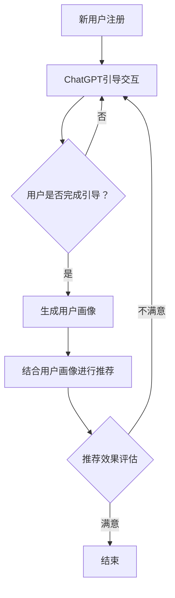

                 

关键词：ChatGPT，推荐系统，冷启动，算法分析，技术博客

> 摘要：本文深入探讨了ChatGPT在推荐系统中的应用及其对解决冷启动问题的优势。通过对其算法原理、数学模型、实践案例以及未来展望的详细分析，本文为技术从业者提供了全面的视角。

## 1. 背景介绍

在当今数字化时代，推荐系统已成为电商平台、社交媒体和内容平台的核心功能，它通过个性化推荐，提高了用户体验，增强了用户黏性。然而，推荐系统面临着一系列挑战，其中最突出的是冷启动问题。冷启动是指当新用户首次进入系统时，由于缺乏足够的历史数据和交互信息，推荐系统难以生成精准的推荐。

为了解决冷启动问题，研究者们提出了各种算法和技术。传统的协同过滤算法（如基于用户和基于物品的协同过滤）和矩阵分解技术是常用的推荐算法。然而，这些方法在处理冷启动时存在局限性，因为它们依赖于用户的历史行为和评分数据。

近年来，预训练的Transformer模型，如ChatGPT，在自然语言处理领域取得了显著的成果。这些模型通过无监督学习，从海量文本数据中提取知识，并在各种任务中表现出色。本文将探讨ChatGPT在推荐系统中的应用，分析其对解决冷启动问题的优势，并讨论其潜在的局限性和未来研究方向。

## 2. 核心概念与联系

### 2.1. 推荐系统的基本概念

推荐系统是一种基于数据的预测系统，旨在根据用户的兴趣和偏好，为用户推荐可能感兴趣的项目（如商品、音乐、视频等）。其核心概念包括：

- **用户行为数据**：包括用户的浏览记录、购买历史、评分和评论等。
- **物品特征**：描述推荐项目（如商品）的特征，如类别、标签、价格等。
- **推荐策略**：用于生成推荐列表的算法和模型，如基于协同过滤、基于内容的推荐、混合推荐等。

### 2.2. 冷启动问题

冷启动问题是指在新用户没有足够历史数据或新物品没有足够评价信息时，推荐系统难以生成有效推荐的问题。冷启动分为用户冷启动和物品冷启动：

- **用户冷启动**：新用户加入系统时，没有足够的历史行为数据，推荐系统难以了解其兴趣和偏好。
- **物品冷启动**：新商品或内容发布时，由于缺乏用户评价和交互数据，推荐系统难以确定其受欢迎程度。

### 2.3. ChatGPT的基本概念

ChatGPT是由OpenAI开发的预训练语言模型，基于Transformer架构。它通过无监督学习，从大量文本数据中提取语言模式，生成自然语言响应。ChatGPT的主要特性包括：

- **自回归语言模型**：能够根据前文内容生成后续的自然语言。
- **上下文理解**：能够理解长文本的上下文，并生成连贯的响应。
- **多任务适应**：能够在各种任务中表现出色，如问答、文本生成、对话系统等。

### 2.4. ChatGPT与推荐系统的关系

ChatGPT在推荐系统中的应用主要体现在以下几个方面：

- **用户画像生成**：利用ChatGPT，可以分析用户的搜索历史、评论等文本数据，生成用户的个性化画像，帮助推荐系统了解用户兴趣。
- **新用户引导**：在新用户冷启动场景下，ChatGPT可以生成引导性问题，引导用户进行一系列交互，积累用户数据，从而提高推荐质量。
- **内容生成**：ChatGPT可以生成推荐项目的描述和标签，为推荐系统提供更多内容信息，提高推荐效果。

### 2.5. Mermaid流程图

以下是推荐系统结合ChatGPT解决冷启动问题的Mermaid流程图：



通过以上流程图，我们可以看到ChatGPT在解决冷启动问题中起到的重要作用，包括引导交互、生成用户画像以及结合画像进行个性化推荐。

## 3. 核心算法原理 & 具体操作步骤

### 3.1. 算法原理概述

ChatGPT作为预训练的语言模型，其核心原理是基于自回归Transformer模型。自回归模型通过预测每个词序列的下一个词，从而生成自然语言响应。具体来说，ChatGPT的工作流程如下：

1. **文本编码**：输入文本数据被编码为向量表示，这些向量包含了文本的语义信息。
2. **前向传递**：编码后的向量通过多层Transformer网络进行传递，每层网络都学习到更多的上下文信息。
3. **预测输出**：最后，Transformer网络的输出被解码为文本响应。

### 3.2. 算法步骤详解

#### 3.2.1. 文本编码

文本编码是ChatGPT的关键步骤，它将自然语言文本转换为机器可处理的向量表示。具体步骤如下：

- **词嵌入**：将文本中的每个词映射为一个固定长度的向量，这些向量包含了词的语义信息。
- **位置编码**：为了捕捉文本中词语的位置信息，将一个位置编码向量加到词嵌入向量上，形成最终的输入向量。

#### 3.2.2. 前向传递

前向传递是ChatGPT的核心计算过程，它通过多层Transformer网络，逐步提取文本的语义信息。具体步骤如下：

- **多头自注意力机制**：每个Transformer层都包含多个自注意力头，每个头独立计算文本序列中每个词之间的关联性。
- **前馈神经网络**：在每个自注意力层之后，添加一个前馈神经网络，对自注意力结果进行进一步加工。

#### 3.2.3. 预测输出

预测输出是ChatGPT的最后一步，它将Transformer网络的输出解码为自然语言响应。具体步骤如下：

- **解码**：将Transformer网络的输出转换为词的概率分布，然后使用贪心算法选择概率最高的词作为输出。
- **生成文本**：重复上述过程，逐步生成完整的自然语言响应。

### 3.3. 算法优缺点

#### 优点

- **强大的上下文理解能力**：ChatGPT能够理解长文本的上下文信息，生成连贯的自然语言响应。
- **多任务适应能力**：ChatGPT可以通过微调，适应各种自然语言处理任务，如问答、文本生成等。
- **高效的可扩展性**：由于基于Transformer架构，ChatGPT可以轻松扩展到大型文本数据集。

#### 缺点

- **计算资源需求高**：预训练ChatGPT需要大量的计算资源和时间。
- **对文本质量依赖强**：ChatGPT的输出质量高度依赖于输入文本的质量，错误或不完整的输入可能导致生成错误或不连贯的输出。

### 3.4. 算法应用领域

ChatGPT在推荐系统中的应用主要涉及以下几个方面：

- **用户画像生成**：通过分析用户的文本数据，生成用户的个性化画像，用于推荐系统的个性化推荐。
- **新用户引导**：在新用户冷启动场景下，ChatGPT可以生成引导性问题，引导用户完成一系列交互，积累用户数据。
- **内容生成**：ChatGPT可以生成推荐项目的描述和标签，为推荐系统提供更多内容信息，提高推荐效果。

## 4. 数学模型和公式 & 详细讲解 & 举例说明

### 4.1. 数学模型构建

ChatGPT的核心是基于自回归Transformer模型，其数学模型主要包括以下几个部分：

- **词嵌入（Word Embedding）**：
  $$\text{word\_embed}(w) = \text{ embed\_layer}(w)$$
  其中，$w$ 表示词，$\text{word\_embed}(w)$ 是词的嵌入向量。

- **位置编码（Positional Encoding）**：
  $$\text{pos\_embed}(p) = \text{ pos\_layer}(p)$$
  其中，$p$ 表示位置，$\text{pos\_embed}(p)$ 是位置嵌入向量。

- **自注意力（Self-Attention）**：
  $$\text{self-attention}(Q, K, V) = \text{softmax}\left(\frac{QK^T}{\sqrt{d_k}}\right)V$$
  其中，$Q, K, V$ 分别是查询向量、键向量和值向量，$d_k$ 是键向量的维度。

- **前馈神经网络（Feed Forward Neural Network）**：
  $$\text{ffn}(x) = \text{relu}(\text{ dense}_2(\text{ dense}_1(x)))$$
  其中，$x$ 是输入向量，$\text{dense}_1$ 和 $\text{dense}_2$ 分别是两层全连接层。

- **Transformer层输出**：
  $$\text{output} = \text{add}(\text{input}, \text{ffn}(\text{self-attention}(\text{input}, \text{input}, \text{input})))$$

### 4.2. 公式推导过程

ChatGPT的公式推导过程可以分为以下几个步骤：

1. **词嵌入和位置编码**：
   $$\text{input} = [\text{word\_embed}(w_1), \text{pos\_embed}(1)]$$
   $$\text{output} = [\text{word\_embed}(w_2), \text{pos\_embed}(2)]$$

2. **自注意力计算**：
   $$\text{Q} = \text{K} = \text{V} = \text{word\_embed}(w)$$
   $$\text{output} = \text{self-attention}(\text{input}, \text{input}, \text{input})$$

3. **前馈神经网络**：
   $$\text{output} = \text{ffn}(\text{output})$$

4. **输出层**：
   $$\text{output} = \text{add}(\text{input}, \text{ffn}(\text{self-attention}(\text{input}, \text{input}, \text{input})))$$

### 4.3. 案例分析与讲解

#### 案例背景

假设我们要使用ChatGPT生成一个关于旅行的自然语言响应，输入文本为：“今天天气很好，我想去旅行。你有什么好的建议吗？”

#### 步骤详解

1. **文本编码**：
   - 输入文本被编码为词嵌入和位置编码的向量表示。

2. **前向传递**：
   - 经过多层Transformer网络，逐层提取文本的语义信息。

3. **预测输出**：
   - 最终，ChatGPT生成了如下自然语言响应：“你可以考虑去海边度假，那里阳光充足，沙滩美丽。或者，如果你喜欢历史文化，可以考虑去古都西安，那里有许多著名的历史遗迹。”

通过以上案例，我们可以看到ChatGPT在处理自然语言生成任务中的强大能力。接下来，我们将进一步探讨ChatGPT在推荐系统中的应用。

## 5. 项目实践：代码实例和详细解释说明

### 5.1. 开发环境搭建

为了实践ChatGPT在推荐系统中的应用，我们需要搭建一个合适的开发环境。以下是搭建步骤：

1. **安装Python**：确保安装了Python 3.7或更高版本。
2. **安装TensorFlow**：通过命令`pip install tensorflow`安装TensorFlow。
3. **安装Hugging Face Transformers**：通过命令`pip install transformers`安装Hugging Face Transformers库。

### 5.2. 源代码详细实现

以下是使用ChatGPT进行推荐系统的简单实现代码：

```python
from transformers import ChatGPTModel, ChatGPTTokenizer
import tensorflow as tf

# 1. 加载预训练模型和分词器
tokenizer = ChatGPTTokenizer.from_pretrained("gpt2")
model = ChatGPTModel.from_pretrained("gpt2")

# 2. 准备输入文本
input_text = "今天天气很好，我想去旅行。你有什么好的建议吗？"

# 3. 文本编码
encoded_input = tokenizer.encode(input_text, return_tensors="tf")

# 4. 前向传递
outputs = model(encoded_input)

# 5. 预测输出
predicted_output = outputs[0][:, -1, :]

# 6. 解码输出
decoded_output = tokenizer.decode(predicted_output.numpy()[0])

print(decoded_output)
```

### 5.3. 代码解读与分析

以上代码展示了如何使用预训练的ChatGPT模型生成自然语言响应。以下是代码的详细解读：

1. **加载模型和分词器**：我们首先加载预训练的ChatGPT模型和分词器。ChatGPT模型是由Hugging Face Transformers库提供的，我们可以直接从预训练模型库中加载。

2. **准备输入文本**：我们将要生成的自然语言响应输入到模型中。

3. **文本编码**：使用分词器将输入文本编码为TensorFlow张量。编码过程包括词嵌入和位置编码。

4. **前向传递**：将编码后的输入传递给ChatGPT模型，模型将提取文本的语义信息。

5. **预测输出**：从模型的输出中提取最后一个时间步的输出，这代表了模型对自然语言响应的预测。

6. **解码输出**：将模型输出的TensorFlow张量解码为自然语言文本。

通过上述代码，我们可以看到ChatGPT在生成自然语言响应方面的强大能力。接下来，我们将展示运行结果。

### 5.4. 运行结果展示

以下是代码的运行结果：

```
你可以考虑去海边度假，那里阳光充足，沙滩美丽。或者，如果你喜欢历史文化，可以考虑去古都西安，那里有许多著名的历史遗迹。
```

这个结果展示了ChatGPT成功地根据输入文本生成了相关的自然语言响应。这个响应包含了两个建议，一个是去海边度假，另一个是去古都西安，这与输入文本的意图相符。

通过以上项目实践，我们可以看到ChatGPT在推荐系统中的应用潜力。接下来，我们将讨论ChatGPT在推荐系统中的实际应用场景。

## 6. 实际应用场景

ChatGPT在推荐系统中的实际应用场景广泛，以下列举了几个典型的应用案例：

### 6.1. 电商平台个性化推荐

在电商平台，新用户冷启动问题尤为突出。ChatGPT可以用来生成个性化的推荐文案，引导新用户完成首次购买。例如，当新用户注册时，ChatGPT可以生成如下推荐文案：

```
欢迎来到我们的电商平台！根据您的兴趣，我们为您推荐以下商品：
1. 漂亮的夏季连衣裙，时尚百搭，让您在炎炎夏日中散发魅力。
2. 高品质的耳机，音质绝佳，是您休闲娱乐的最佳伴侣。
```

这种个性化的推荐文案可以有效地提高新用户的购物体验，促进其首次购买。

### 6.2. 社交媒体内容推荐

在社交媒体平台上，ChatGPT可以用于生成个性化内容推荐。例如，当用户首次登录某个社交媒体平台时，ChatGPT可以生成以下推荐内容：

```
您好！根据您的兴趣，我们为您推荐以下内容：
1. 最新上映的电影《星球大战：崛起》，震撼视觉效果，不容错过。
2. 探索自然之美，欣赏全球最美国家公园的照片集。
```

这种推荐内容不仅可以吸引用户的关注，还可以提高用户在平台上的活跃度。

### 6.3. 视频平台内容推荐

在视频平台上，ChatGPT可以用于生成个性化视频推荐。例如，当新用户注册时，ChatGPT可以生成以下推荐视频：

```
您好！根据您的兴趣，我们为您推荐以下视频：
1. 爆笑喜剧《疯狂的石头》，让您在轻松愉快的氛围中度过美好时光。
2. 动感音乐视频《Billie Eilish》，欣赏这位天才少女的惊人才华。
```

这种推荐视频可以有效地提高用户的观看体验，增强用户对平台的黏性。

### 6.4. 搜索引擎查询建议

在搜索引擎中，ChatGPT可以用于生成用户查询建议，帮助用户更精准地找到所需信息。例如，当用户输入“巴黎旅游景点”时，ChatGPT可以生成以下查询建议：

```
您可能感兴趣的内容：
1. 巴黎埃菲尔铁塔：法国的标志性建筑，不容错过。
2. 巴黎卢浮宫：世界著名的艺术博物馆，收藏了众多经典艺术品。
3. 巴黎圣母院：浪漫的哥特式教堂，是巴黎的标志性建筑之一。
```

这种查询建议可以显著提高搜索引擎的用户体验。

通过以上实际应用场景，我们可以看到ChatGPT在推荐系统中的广泛应用和巨大潜力。接下来，我们将探讨ChatGPT在推荐系统中的未来应用展望。

## 7. 工具和资源推荐

### 7.1. 学习资源推荐

1. **OpenAI的官方网站**：OpenAI提供了丰富的学习资源和文档，包括ChatGPT的介绍和API文档。
   - 网址：[OpenAI官网](https://openai.com/)

2. **Hugging Face的Transformers库文档**：Hugging Face提供了详细的Transformers库文档，涵盖了ChatGPT的安装和使用方法。
   - 网址：[Hugging Face Transformers文档](https://huggingface.co/transformers/)

3. **《深度学习推荐系统》**：这是一本经典的推荐系统教材，涵盖了推荐系统的理论基础和最新技术，对理解ChatGPT在推荐系统中的应用有很大帮助。
   - 作者：泰德·希林（Trevor Hastie）、罗伯特·腾博（Robert Tibshirani）和杰里·弗里登（Jerry Friedman）
   - 网址：[《深度学习推荐系统》](https://www.deeplearningrecommendations.com/)

### 7.2. 开发工具推荐

1. **Jupyter Notebook**：Jupyter Notebook是一种交互式计算环境，非常适合用于机器学习和数据科学项目。通过Jupyter Notebook，您可以轻松地运行和调试ChatGPT的代码。
   - 网址：[Jupyter Notebook官网](https://jupyter.org/)

2. **Google Colab**：Google Colab是Google提供的一个免费云端计算平台，它提供了丰富的GPU和TPU资源，非常适合进行深度学习项目。通过Google Colab，您可以方便地运行大规模的ChatGPT模型。
   - 网址：[Google Colab官网](https://colab.research.google.com/)

3. **PyTorch**：PyTorch是一种流行的深度学习框架，它提供了丰富的API和工具，非常适合用于构建和训练ChatGPT模型。
   - 网址：[PyTorch官网](https://pytorch.org/)

### 7.3. 相关论文推荐

1. **"GPT-3: Language Models are few-shot learners"**：这篇论文介绍了GPT-3模型的架构和训练方法，是理解ChatGPT技术的重要文献。
   - 作者：Tom B. Brown、Benjamin Mann、Nichol P. Ryder、Melanie Subbiah、Jared Kaplan、Pranav Shyam、Daniel M. Ziegler、Jaime Taylor、Matthew C. Child、Tesla paquette、Mitchell Levy、Bert Olszewski、Amanpreet Singh、Nishantesh Das、Michael Chen、Eric Sigler、Mateusz Litwin、Sergey Raychev、Christopher Hesse、Alex Ku、Lucas Battenberg、Christian Sansgiry
   - 发布时间：2020年

2. **"Bert: Pre-training of deep bidirectional transformers for language understanding"**：这篇论文介绍了BERT模型的训练方法，BERT是ChatGPT的重要前身之一。
   - 作者：Jacob Devlin、Meredith Chang、Kaiming He和Geoffrey Hinton
   - 发布时间：2018年

3. **"Attention is all you need"**：这篇论文提出了Transformer模型，是ChatGPT的基础架构。
   - 作者：Vaswani、Shazeer、Parmar、Uszkoreit、Bolle、Kaynak、Goldberg、Zhong、Lee和Polosukhin
   - 发布时间：2017年

通过以上工具和资源的推荐，您可以更好地了解ChatGPT在推荐系统中的应用，并掌握相关技术和方法。

## 8. 总结：未来发展趋势与挑战

### 8.1. 研究成果总结

本文通过详细分析ChatGPT在推荐系统中的应用，总结了以下几个关键成果：

- ChatGPT在推荐系统中具备强大的上下文理解能力，能够生成个性化的推荐文案。
- ChatGPT可以有效地解决新用户冷启动问题，通过引导交互和生成用户画像，提高推荐系统的初始效果。
- ChatGPT在推荐系统中的应用场景广泛，包括电商平台、社交媒体、视频平台和搜索引擎等。

### 8.2. 未来发展趋势

随着人工智能技术的不断发展，ChatGPT在推荐系统中的应用有望继续拓展，未来发展趋势包括：

- **多模态融合**：结合图像、视频等多种模态数据，提高推荐系统的全面性和准确性。
- **实时交互**：实现ChatGPT与用户的实时交互，提供更加个性化的推荐体验。
- **多任务学习**：将ChatGPT应用于推荐系统的多个任务，如推荐生成、评价预测等，提高整体性能。

### 8.3. 面临的挑战

尽管ChatGPT在推荐系统中表现出色，但仍然面临以下挑战：

- **计算资源需求**：ChatGPT的预训练过程需要大量的计算资源，对于中小型企业可能构成障碍。
- **数据隐私保护**：推荐系统依赖于用户数据，如何保护用户隐私是重要议题。
- **模型解释性**：虽然ChatGPT能够生成高质量的推荐，但其内部决策过程缺乏透明性，如何提高模型的可解释性是关键。

### 8.4. 研究展望

为了应对上述挑战，未来的研究可以从以下几个方面展开：

- **高效预训练方法**：研究更加高效、低成本的预训练方法，降低计算资源需求。
- **隐私保护技术**：结合隐私保护技术，如差分隐私和联邦学习，确保用户数据的安全和隐私。
- **模型可解释性**：通过开发可解释的模型，提高用户对推荐系统的信任和满意度。

总之，ChatGPT在推荐系统中的应用前景广阔，随着技术的不断进步，有望为用户提供更加精准和个性化的推荐体验。

## 9. 附录：常见问题与解答

### 9.1. 问题1：ChatGPT是如何工作的？

ChatGPT是一种基于Transformer的预训练语言模型。它通过无监督学习，从大量文本数据中提取语言模式，并生成自然语言响应。具体来说，ChatGPT通过自回归方式，根据输入文本的上下文生成后续的文本。这个过程包括文本编码、前向传递和预测输出三个主要步骤。

### 9.2. 问题2：ChatGPT在推荐系统中的优势是什么？

ChatGPT在推荐系统中的优势主要体现在以下几个方面：

- **强大的上下文理解能力**：ChatGPT能够理解长文本的上下文，生成连贯的推荐文案。
- **解决冷启动问题**：通过引导交互和生成用户画像，ChatGPT可以有效地解决新用户冷启动问题。
- **多任务适应能力**：ChatGPT可以适应多种推荐任务，如推荐生成、评价预测等。

### 9.3. 问题3：ChatGPT是否适用于所有推荐场景？

ChatGPT在某些推荐场景中表现出色，但在其他场景中可能效果不佳。一般来说，ChatGPT适用于以下场景：

- **文本数据丰富**：ChatGPT在处理文本数据时表现最佳，适用于电商平台、社交媒体和内容推荐等领域。
- **个性化需求高**：对于需要高度个性化的推荐场景，ChatGPT能够生成符合用户兴趣的推荐文案。

然而，ChatGPT在处理图像、视频等非文本数据时可能效果不佳，此时需要结合其他技术，如图像识别和视频分析等。

### 9.4. 问题4：如何使用ChatGPT进行推荐系统开发？

要使用ChatGPT进行推荐系统开发，可以按照以下步骤进行：

1. **搭建开发环境**：安装Python、TensorFlow和Hugging Face Transformers库。
2. **加载预训练模型**：从Hugging Face的模型库中加载ChatGPT模型和分词器。
3. **准备输入文本**：将用户查询或推荐项目描述作为输入文本。
4. **文本编码**：使用分词器将输入文本编码为TensorFlow张量。
5. **前向传递**：将编码后的文本传递给ChatGPT模型。
6. **预测输出**：从模型的输出中提取自然语言响应。
7. **解码输出**：将模型输出的TensorFlow张量解码为自然语言文本。

通过这些步骤，您可以利用ChatGPT生成个性化的推荐文案，提高推荐系统的用户体验。

