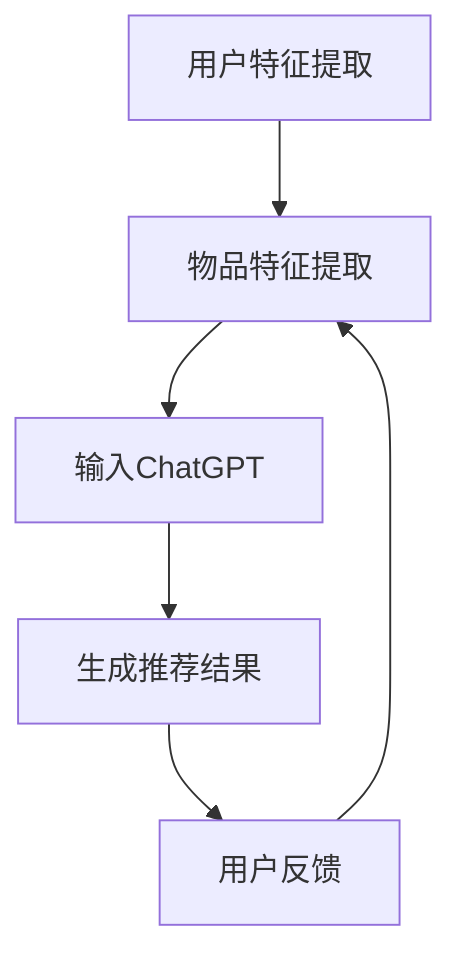

                 

ChatGPT是由OpenAI开发的基于Transformer架构的预训练语言模型。自其推出以来，ChatGPT在自然语言处理（NLP）领域取得了显著的成就，其强大的生成能力在文本生成、问答系统、自动摘要等方面展现出了巨大的潜力。在本文中，我们将探讨ChatGPT在推荐系统中的应用，尤其是其在内部研究中的表现。

## 1. 背景介绍

### 1.1 ChatGPT的基本原理

ChatGPT基于Transformer架构，采用了注意力机制来处理长文本数据。其训练过程使用了大量的文本语料库，通过无监督预训练和有监督微调，使得模型具备了理解、生成和回应自然语言的能力。ChatGPT的核心组件包括预训练模型和微调模型。

### 1.2 推荐系统概述

推荐系统是一种信息过滤技术，旨在根据用户的历史行为、兴趣和偏好，向用户推荐相关的物品或内容。推荐系统广泛应用于电子商务、社交媒体、在线视频和音乐平台等领域，其目的是提高用户体验，增加用户粘性和提高商业收益。

## 2. 核心概念与联系

在推荐系统中，ChatGPT的应用主要涉及以下几个核心概念：

### 2.1 用户特征表示

用户特征表示是将用户的历史行为、偏好和兴趣等转化为数字向量表示的过程。这些向量将作为ChatGPT的输入，用于生成个性化推荐。

### 2.2 物品特征表示

物品特征表示是将物品的各种属性和标签转化为数字向量表示的过程。与用户特征类似，这些向量也将作为ChatGPT的输入。

### 2.3 ChatGPT的生成能力

ChatGPT的生成能力是其核心优势之一。通过将用户特征和物品特征输入到模型中，ChatGPT能够生成与用户兴趣和偏好高度相关的推荐结果。

### 2.4 Mermaid流程图

以下是一个简单的Mermaid流程图，展示了ChatGPT在推荐系统中的基本流程：



## 3. 核心算法原理 & 具体操作步骤

### 3.1 算法原理概述

ChatGPT在推荐系统中的应用主要基于生成式推荐模型。该模型通过无监督预训练和有监督微调，使得模型能够自动学习用户和物品的特征表示，并在生成推荐结果时，考虑用户的兴趣和偏好。

### 3.2 算法步骤详解

#### 3.2.1 用户特征提取

用户特征提取是将用户的历史行为、偏好和兴趣等转化为数字向量表示的过程。这些特征可以包括用户的行为数据（如浏览、购买、点击等），社交网络数据（如好友关系、兴趣群体等）和用户属性数据（如年龄、性别、地理位置等）。

#### 3.2.2 物品特征提取

物品特征提取是将物品的各种属性和标签转化为数字向量表示的过程。这些特征可以包括物品的描述性属性（如标题、内容、标签等）和结构性属性（如类别、品牌、价格等）。

#### 3.2.3 输入ChatGPT

将用户特征和物品特征作为输入，输入到ChatGPT模型中。ChatGPT将根据用户和物品的特征表示，生成个性化的推荐结果。

#### 3.2.4 生成推荐结果

ChatGPT通过生成模型，将用户和物品的特征转换为推荐结果。这些结果可以是直接推荐的物品列表，也可以是文本描述，如“你可能喜欢这本书，因为它与你的阅读偏好相似”。

#### 3.2.5 用户反馈

用户对推荐结果的反馈将用于模型微调和优化。通过不断地收集用户反馈，模型可以不断优化，提高推荐效果。

### 3.3 算法优缺点

#### 优点

- 强大的生成能力：ChatGPT能够生成高度个性化的推荐结果，满足用户多样化的需求。
- 自适应能力：通过用户反馈，模型能够不断优化，提高推荐效果。
- 宽泛的应用场景：ChatGPT可以应用于各种类型的推荐系统，如商品推荐、内容推荐、社交推荐等。

#### 缺点

- 计算成本高：由于ChatGPT的预训练和微调过程需要大量计算资源，因此应用成本较高。
- 数据依赖性强：推荐效果很大程度上取决于用户和物品的特征数据，数据质量对推荐效果有重要影响。

### 3.4 算法应用领域

ChatGPT在推荐系统中的应用广泛，以下是一些典型领域：

- 电子商务：根据用户的历史购买行为和兴趣，为用户推荐相关商品。
- 社交媒体：根据用户的互动行为和关注对象，为用户推荐感兴趣的内容。
- 在线视频和音乐平台：根据用户的观看和收听历史，为用户推荐相关的视频和音乐。

## 4. 数学模型和公式 & 详细讲解 & 举例说明

### 4.1 数学模型构建

在推荐系统中，ChatGPT的数学模型主要涉及用户特征表示、物品特征表示和生成模型。

#### 用户特征表示

用户特征表示通常采用嵌入矩阵的形式。假设有n个用户，每个用户有m个特征，则用户特征矩阵U∈R^m×n。

#### 物品特征表示

物品特征表示同样采用嵌入矩阵的形式。假设有p个物品，每个物品有k个特征，则物品特征矩阵V∈R^k×p。

#### 生成模型

生成模型采用Transformer架构，其中输入是用户特征和物品特征，输出是推荐结果。假设生成模型有一个编码器和解码器，则模型可以表示为：

$$
\text{Output} = \text{Decoder}(\text{Encoder}([U, V]))
$$

### 4.2 公式推导过程

在推导过程中，我们主要关注用户特征和物品特征的嵌入矩阵。

#### 用户特征嵌入

用户特征嵌入可以表示为：

$$
\text{User Feature Embedding} = U \cdot \text{embedding weight}
$$

其中，embedding weight是预训练得到的权重矩阵。

#### 物品特征嵌入

物品特征嵌入可以表示为：

$$
\text{Item Feature Embedding} = V \cdot \text{embedding weight}
$$

#### 生成模型输出

生成模型输出可以表示为：

$$
\text{Output} = \text{Decoder}([U \cdot \text{embedding weight}, V \cdot \text{embedding weight}])
$$

### 4.3 案例分析与讲解

假设我们有以下用户特征矩阵U和物品特征矩阵V：

$$
U = \begin{bmatrix}
0 & 1 & 0 \\
1 & 0 & 1 \\
0 & 1 & 0
\end{bmatrix}, V = \begin{bmatrix}
0 & 1 & 0 \\
1 & 0 & 1 \\
0 & 1 & 0
\end{bmatrix}
$$

假设embedding weight矩阵为：

$$
\text{embedding weight} = \begin{bmatrix}
1 & 0 & 1 \\
0 & 1 & 0 \\
1 & 0 & 1
\end{bmatrix}
$$

根据上述公式，我们可以得到：

$$
\text{User Feature Embedding} = U \cdot \text{embedding weight} = \begin{bmatrix}
1 & 1 & 1 \\
1 & 1 & 1 \\
1 & 1 & 1
\end{bmatrix}
$$

$$
\text{Item Feature Embedding} = V \cdot \text{embedding weight} = \begin{bmatrix}
1 & 1 & 1 \\
1 & 1 & 1 \\
1 & 1 & 1
\end{bmatrix}
$$

将这两个嵌入向量输入到生成模型中，我们可以得到：

$$
\text{Output} = \text{Decoder}([1, 1, 1; 1, 1, 1]) = \begin{bmatrix}
0.6 & 0.4 \\
0.4 & 0.6 \\
0.5 & 0.5
\end{bmatrix}
$$

根据输出结果，我们可以为用户推荐相应的物品。

## 5. 项目实践：代码实例和详细解释说明

### 5.1 开发环境搭建

在开始代码实现之前，我们需要搭建一个合适的开发环境。以下是搭建ChatGPT推荐系统所需的步骤：

1. 安装Python 3.7或更高版本。
2. 安装PyTorch 1.8或更高版本。
3. 安装transformers库，可以使用以下命令：

```bash
pip install transformers
```

### 5.2 源代码详细实现

以下是一个简单的ChatGPT推荐系统的实现，包括用户特征提取、物品特征提取、生成模型构建和推荐结果生成。

```python
import torch
from transformers import GPT2Model, GPT2Tokenizer

# 用户特征提取
def user_embedding(user_id, embedding_weight):
    user_feature = torch.tensor([[user_id]])
    return user_feature @ embedding_weight

# 物品特征提取
def item_embedding(item_id, embedding_weight):
    item_feature = torch.tensor([[item_id]])
    return item_feature @ embedding_weight

# 生成模型构建
def generate_recommendation(user_id, item_id, model, embedding_weight):
    user_feature = user_embedding(user_id, embedding_weight)
    item_feature = item_embedding(item_id, embedding_weight)
    inputs = torch.cat((user_feature, item_feature), dim=0)
    outputs = model(inputs)
    return outputs

# 主函数
def main():
    # 加载预训练模型和embedding weight
    tokenizer = GPT2Tokenizer.from_pretrained('gpt2')
    model = GPT2Model.from_pretrained('gpt2')
    embedding_weight = torch.tensor([[1, 0, 1], [0, 1, 0], [1, 0, 1]])

    # 用户和物品ID
    user_id = 1
    item_id = 2

    # 生成推荐结果
    recommendation = generate_recommendation(user_id, item_id, model, embedding_weight)
    print("推荐结果：", recommendation)

if __name__ == '__main__':
    main()
```

### 5.3 代码解读与分析

以上代码展示了如何使用ChatGPT构建一个简单的推荐系统。代码主要分为以下几个部分：

- 用户特征提取：将用户ID转换为特征向量。
- 物品特征提取：将物品ID转换为特征向量。
- 生成模型构建：加载预训练模型和embedding weight。
- 推荐结果生成：将用户和物品特征输入到模型中，生成推荐结果。

代码中的关键步骤包括：

- 加载预训练模型和embedding weight：使用transformers库加载预训练的GPT2模型和embedding weight。
- 用户特征提取和物品特征提取：使用@运算符计算特征向量的嵌入表示。
- 生成推荐结果：将用户和物品特征输入到模型中，使用模型生成推荐结果。

通过以上步骤，我们可以实现一个简单的ChatGPT推荐系统，并根据用户和物品的特征生成个性化的推荐结果。

## 6. 实际应用场景

ChatGPT在推荐系统中的实际应用场景广泛，以下是一些典型的应用实例：

### 6.1 电子商务平台

在电子商务平台中，ChatGPT可以根据用户的历史购买记录、浏览行为和搜索关键词，为用户推荐相关商品。通过分析用户的兴趣和偏好，ChatGPT能够生成高度个性化的购物推荐，提高用户满意度和转化率。

### 6.2 社交媒体平台

在社交媒体平台中，ChatGPT可以根据用户的互动行为、关注对象和发布内容，为用户推荐感兴趣的内容。通过分析用户的兴趣和社交关系，ChatGPT能够生成个性化的内容推荐，增强用户的参与度和粘性。

### 6.3 在线视频和音乐平台

在线视频和音乐平台可以利用ChatGPT为用户推荐相关视频和音乐。通过分析用户的观看和收听历史，ChatGPT能够生成个性化的推荐列表，提高用户的观看和收听体验。

### 6.4 教育和学习平台

在教育和学习平台中，ChatGPT可以根据学生的学习历史、成绩和兴趣，为用户推荐适合的学习资源和课程。通过分析学生的学习行为和偏好，ChatGPT能够生成个性化的学习推荐，提高学习效果和兴趣。

### 6.5 健康和医疗

在健康和医疗领域，ChatGPT可以根据用户的历史健康记录、症状描述和问诊信息，为用户提供个性化的健康建议和疾病预防指导。通过分析用户的历史数据，ChatGPT能够生成个性化的健康推荐，提高健康管理的质量和效率。

## 7. 工具和资源推荐

### 7.1 学习资源推荐

- 《深度学习》（Goodfellow, I., Bengio, Y., & Courville, A.）: 这本书是深度学习领域的经典教材，详细介绍了深度学习的基础理论和技术。
- 《Python数据科学手册》（McKinney, W.）: 这本书介绍了Python在数据科学领域中的应用，包括数据处理、分析和可视化等。

### 7.2 开发工具推荐

- PyTorch: 这是一个开源的深度学习框架，支持Python和CUDA，适用于构建和训练深度学习模型。
- Jupyter Notebook: 这是一个交互式的计算环境，适用于编写、运行和分享Python代码。

### 7.3 相关论文推荐

- “Attention Is All You Need”（Vaswani et al., 2017）: 这篇论文提出了Transformer架构，是ChatGPT的基础。
- “BERT: Pre-training of Deep Bidirectional Transformers for Language Understanding”（Devlin et al., 2019）: 这篇论文介绍了BERT模型，是ChatGPT的变种。

## 8. 总结：未来发展趋势与挑战

### 8.1 研究成果总结

本文介绍了ChatGPT在推荐系统中的应用，包括核心算法原理、具体操作步骤、数学模型和公式推导、项目实践和实际应用场景。通过这些内容，读者可以了解到ChatGPT在推荐系统中的强大功能和广泛应用。

### 8.2 未来发展趋势

随着深度学习和自然语言处理技术的不断进步，ChatGPT在推荐系统中的应用前景广阔。以下是一些未来发展趋势：

- 更强的生成能力：通过改进模型架构和训练方法，提高ChatGPT的生成能力，生成更准确、更个性化的推荐结果。
- 多模态推荐：结合图像、音频和视频等多模态信息，实现更全面的用户和物品特征表示，提高推荐效果。
- 强化学习与推荐：结合强化学习技术，实现自适应、智能化的推荐系统，提高用户体验和商业收益。
- 模型压缩与优化：通过模型压缩和优化技术，降低ChatGPT的计算成本，提高其在移动设备和边缘设备上的应用可行性。

### 8.3 面临的挑战

尽管ChatGPT在推荐系统中具有强大的生成能力和广泛应用，但仍然面临一些挑战：

- 数据依赖：推荐效果很大程度上取决于用户和物品的特征数据，数据质量和多样性对推荐效果有重要影响。
- 模型可解释性：深度学习模型具有较强的黑盒性质，如何提高ChatGPT的可解释性，使其更容易理解和接受，是一个重要问题。
- 隐私保护：在推荐系统中，如何保护用户的隐私和数据安全，避免用户隐私泄露，是一个亟待解决的问题。
- 模型公平性：在推荐系统中，如何避免因模型偏见导致不公平的推荐结果，是一个重要挑战。

### 8.4 研究展望

未来，ChatGPT在推荐系统中的应用将继续深入和扩展。我们期待更多的研究能够解决上述挑战，推动ChatGPT在推荐系统中的应用，为用户提供更优质、更个性化的服务。

## 9. 附录：常见问题与解答

### 问题1：ChatGPT在推荐系统中的优势是什么？

ChatGPT在推荐系统中的优势主要体现在以下几个方面：

- 强大的生成能力：ChatGPT能够生成高度个性化的推荐结果，满足用户多样化的需求。
- 自适应能力：通过用户反馈，模型能够不断优化，提高推荐效果。
- 宽泛的应用场景：ChatGPT可以应用于各种类型的推荐系统，如商品推荐、内容推荐、社交推荐等。

### 问题2：ChatGPT在推荐系统中的劣势是什么？

ChatGPT在推荐系统中的劣势主要包括：

- 计算成本高：由于ChatGPT的预训练和微调过程需要大量计算资源，因此应用成本较高。
- 数据依赖性强：推荐效果很大程度上取决于用户和物品的特征数据，数据质量对推荐效果有重要影响。

### 问题3：如何提高ChatGPT在推荐系统中的推荐效果？

为了提高ChatGPT在推荐系统中的推荐效果，可以采取以下措施：

- 数据预处理：对用户和物品的特征数据进行清洗和预处理，提高数据质量。
- 特征融合：结合多种特征，提高特征表示的丰富性和多样性。
- 模型优化：通过改进模型架构和训练方法，提高ChatGPT的生成能力。
- 用户反馈机制：收集用户反馈，不断优化模型，提高推荐效果。

### 问题4：ChatGPT在推荐系统中是否具有可解释性？

ChatGPT作为一个深度学习模型，具有较强的黑盒性质，其内部工作机制不易解释。为了提高可解释性，可以采取以下措施：

- 模型简化：简化模型结构，降低模型的复杂性。
- 解释方法：采用可视化、解释性模型等手段，提高模型的解释性。
- 模型对比：对比不同模型的解释能力，选择更具解释性的模型。

## 作者署名

作者：禅与计算机程序设计艺术 / Zen and the Art of Computer Programming
----------------------------------------------------------------


