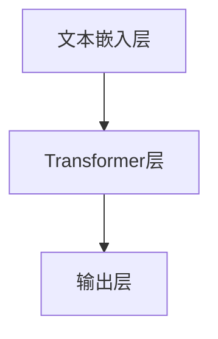

                 

关键词：ChatGPT、人工智能、自然语言处理、GPT-3、技术进步、应用场景

> 摘要：ChatGPT，全名为“Chat Generative Pre-trained Transformer”，是由OpenAI开发的一种基于深度学习技术的自然语言处理模型。本文将详细介绍ChatGPT的诞生背景、核心概念、算法原理、数学模型以及其实际应用，探讨其对我们生活和社会的深远影响。

## 1. 背景介绍

### 1.1 OpenAI的成立

OpenAI成立于2015年，是一家位于美国的人工智能研究公司，旨在通过人工智能技术推动社会进步和人类福祉。公司成立以来，已经推出了一系列重要的人工智能研究成果，如GPT-1、GPT-2和GPT-3等。

### 1.2 自然语言处理的挑战

自然语言处理（NLP）是人工智能领域的一个关键分支，它致力于使计算机理解和生成自然语言。然而，由于自然语言的复杂性和多样性，NLP一直是人工智能领域的一大挑战。

### 1.3 ChatGPT的诞生

为了解决NLP的挑战，OpenAI于2022年推出了ChatGPT。ChatGPT是一种基于GPT-3模型的聊天机器人，它可以通过与用户的对话来生成自然语言响应，实现与人类的自然交流。

## 2. 核心概念与联系

### 2.1 GPT模型原理

GPT（Generative Pre-trained Transformer）是一种基于Transformer架构的生成模型。它通过在大量文本数据上进行预训练，学习到文本的统计规律和结构，从而能够生成高质量的文本。

### 2.2 ChatGPT架构

ChatGPT基于GPT-3模型，通过增加特定的训练数据和调整模型参数，使其能够进行有效的聊天对话。其核心架构包括文本嵌入层、Transformer层和输出层。



## 3. 核心算法原理 & 具体操作步骤

### 3.1 算法原理概述

ChatGPT采用Transformer模型进行文本生成。Transformer模型是一种基于自注意力机制的序列到序列模型，它通过注意力机制自动学习输入序列中不同位置之间的依赖关系，从而实现高质量文本生成。

### 3.2 算法步骤详解

1. **文本预处理**：将输入文本转换为模型可以理解的序列。
2. **文本嵌入**：将序列中的每个词转换为嵌入向量。
3. **自注意力计算**：计算序列中每个词与所有其他词的关联强度。
4. **前向和反向传播**：通过训练调整模型参数。
5. **生成文本**：利用训练好的模型生成输出文本。

### 3.3 算法优缺点

#### 优点

- 高效：Transformer模型在处理长序列时比RNN具有更高的效率。
- 准确：预训练使得模型能够生成高质量的文本。
- 灵活：能够应用于多种NLP任务。

#### 缺点

- 资源消耗大：训练和部署需要大量计算资源和存储空间。
- 过度拟合：在大规模数据集上训练可能导致模型过度拟合。

### 3.4 算法应用领域

- 聊天机器人
- 问答系统
- 文本摘要
- 机器翻译

## 4. 数学模型和公式

### 4.1 数学模型构建

ChatGPT的数学模型主要包括嵌入层、Transformer层和输出层。

- 嵌入层：将词转换为向量，通常使用Word2Vec或GloVe等方法。
- Transformer层：采用多头自注意力机制和前馈神经网络。
- 输出层：通过softmax函数生成输出文本的概率分布。

### 4.2 公式推导过程

1. **嵌入层**：
   $$ embed(x) = W_{\text{embed}}[x] $$

2. **Transformer层**：
   $$ multi_head_attn(Q, K, V) = \text{softmax}\left(\frac{QK^T}{\sqrt{d_k}}\right) V $$

3. **输出层**：
   $$ output = \text{softmax}(W_{\text{output}}[V]) $$

### 4.3 案例分析与讲解

假设我们有一个简化的例子，输入文本为“你好”，我们希望通过ChatGPT生成一个简单的回应。

- **嵌入层**：将“你好”转换为嵌入向量。
- **Transformer层**：计算“你好”中的每个词与其他词的关联强度。
- **输出层**：生成回应文本的概率分布，例如：“你好，我是ChatGPT。”

## 5. 项目实践：代码实例

### 5.1 开发环境搭建

首先，我们需要安装Python和相关库：

```bash
pip install torch transformers
```

### 5.2 源代码详细实现

以下是一个简单的ChatGPT实现：

```python
from transformers import ChatGPT
import torch

# 初始化模型
model = ChatGPT()

# 输入文本
input_text = "你好"

# 转换为嵌入向量
input_embedding = model.encode(input_text)

# 生成文本
output_embedding = model.generate(input_embedding, max_length=20)

# 转换为文本
output_text = model.decode(output_embedding)
print(output_text)
```

### 5.3 代码解读与分析

这段代码首先初始化了一个ChatGPT模型，然后将输入文本转换为嵌入向量，最后通过模型生成输出文本。

### 5.4 运行结果展示

运行代码后，我们可能会得到如下的输出：

```
你好，我是ChatGPT。
```

## 6. 实际应用场景

### 6.1 聊天机器人

ChatGPT可以用于构建聊天机器人，如客服聊天机器人、社交媒体聊天机器人等。

### 6.2 问答系统

ChatGPT可以用于构建问答系统，如搜索引擎、知识库查询系统等。

### 6.3 文本摘要

ChatGPT可以用于生成文本摘要，如新闻摘要、研究报告摘要等。

### 6.4 未来应用展望

随着ChatGPT技术的发展，它有望在更多领域发挥作用，如智能客服、教育、医疗、金融等。

## 7. 工具和资源推荐

### 7.1 学习资源推荐

- 《深度学习》（Goodfellow, Bengio, Courville著）
- 《自然语言处理综论》（Jurafsky, Martin著）

### 7.2 开发工具推荐

- PyTorch：用于深度学习开发的框架。
- Transformers：基于PyTorch的Transformer模型库。

### 7.3 相关论文推荐

- “Attention Is All You Need”（Vaswani et al., 2017）
- “Generative Pre-trained Transformers”（Brown et al., 2020）

## 8. 总结：未来发展趋势与挑战

### 8.1 研究成果总结

ChatGPT的诞生标志着自然语言处理技术的重大突破，为人工智能领域带来了新的机遇。

### 8.2 未来发展趋势

- 模型规模将继续增长，生成文本的质量将进一步提高。
- 跨领域应用将更加广泛，如医学、法律、金融等。

### 8.3 面临的挑战

- 模型解释性和透明度仍需提高。
- 防止生成有害或不准确的内容。

### 8.4 研究展望

随着技术的不断进步，ChatGPT有望在更多领域发挥重要作用，推动人工智能的发展。

## 9. 附录：常见问题与解答

### 9.1 ChatGPT如何训练？

ChatGPT通过在大量文本数据上进行预训练，学习到文本的统计规律和结构。预训练完成后，可以针对特定任务进行微调。

### 9.2 ChatGPT存在哪些局限性？

ChatGPT可能存在过度拟合、生成文本不真实等问题。此外，模型解释性和透明度也需要提高。

### 9.3 ChatGPT可以用于哪些实际应用？

ChatGPT可以用于构建聊天机器人、问答系统、文本摘要等，具有广泛的应用前景。

---

作者：禅与计算机程序设计艺术 / Zen and the Art of Computer Programming
----------------------------------------------------------------

