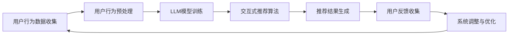

                 

关键词：交互式推荐系统，LLM，可解释性，AI增强，算法原理，数学模型，项目实践

> 摘要：本文将探讨一种新型的交互式可解释的LLM增强推荐系统——Chat-REC。通过结合大型语言模型（LLM）和交互式推荐算法，Chat-REC旨在提高推荐系统的准确性和可解释性，为用户提供更个性化和清晰的推荐服务。本文将从背景介绍、核心概念与联系、核心算法原理、数学模型和公式、项目实践、实际应用场景、未来应用展望等多个角度进行深入探讨，旨在为相关领域的研究者和开发者提供有益的参考。

## 1. 背景介绍

随着互联网技术的飞速发展和大数据时代的到来，推荐系统已经成为众多互联网公司提升用户体验、提高业务收益的重要手段。然而，传统的推荐系统在处理复杂信息、用户行为理解和个性化推荐等方面仍存在许多挑战。首先，推荐系统的准确性仍需提高，以应对不断增长的数据量和用户多样性。其次，推荐系统的可解释性也是一个亟待解决的问题。许多用户对推荐系统的运作原理和决策过程缺乏了解，这可能导致用户对推荐结果的不信任。

近年来，深度学习和自然语言处理（NLP）技术的迅速发展为推荐系统带来了新的机遇。大型语言模型（LLM），如GPT系列，具有强大的语言理解和生成能力，能够有效地捕捉用户的行为和偏好。然而，将LLM应用于推荐系统仍面临一些挑战，如如何确保推荐的公平性和可解释性。

为了解决上述问题，本文提出了一种新型的交互式可解释的LLM增强推荐系统——Chat-REC。Chat-REC通过结合交互式推荐算法和LLM，旨在提高推荐系统的准确性、可解释性和用户体验。

## 2. 核心概念与联系

### 2.1 交互式推荐系统

交互式推荐系统是指通过与用户的交互来获取用户反馈，并根据这些反馈动态调整推荐结果。与传统的基于内容的推荐和协同过滤推荐系统相比，交互式推荐系统具有更高的灵活性和适应性。

### 2.2 大型语言模型（LLM）

大型语言模型（LLM），如GPT系列，是一种基于深度学习的自然语言处理模型。这些模型通过在大规模语料库上进行预训练，能够自动学习语言的复杂结构和语义信息。在推荐系统中，LLM可用于捕捉用户的行为和偏好，从而提高推荐准确性。

### 2.3 可解释性

可解释性是指用户能够理解推荐系统的运作原理和决策过程。一个可解释的推荐系统可以帮助用户建立对系统的信任，从而提高用户满意度。

### 2.4 Mermaid 流程图

下面是一个简化的Mermaid流程图，展示了Chat-REC系统的工作流程：



### 2.5 核心概念原理

Chat-REC系统通过以下核心概念实现推荐系统的增强：

- **用户行为数据收集**：系统从各种来源收集用户行为数据，包括点击、购买、搜索等。
- **用户行为预处理**：对收集到的用户行为数据进行清洗、去噪和处理，以提取有效信息。
- **LLM模型训练**：使用预处理后的用户行为数据训练LLM模型，以捕捉用户的行为和偏好。
- **交互式推荐算法**：结合LLM模型的输出和用户反馈，动态调整推荐结果。
- **推荐结果生成**：根据用户的最新行为和偏好，生成个性化的推荐结果。
- **用户反馈收集**：收集用户的反馈，用于进一步优化系统。
- **系统调整与优化**：根据用户反馈调整推荐算法和LLM模型，以提高系统性能。

## 3. 核心算法原理 & 具体操作步骤

### 3.1 算法原理概述

Chat-REC系统采用的核心算法主要包括LLM模型训练、交互式推荐算法和动态调整机制。以下是这些算法的基本原理：

- **LLM模型训练**：通过预训练和微调，LLM模型能够捕捉用户的行为和偏好。在训练过程中，系统利用用户历史行为数据构建训练集，并通过优化损失函数训练模型。
- **交互式推荐算法**：交互式推荐算法结合LLM模型的输出，使用用户反馈动态调整推荐结果。该算法的核心是优化推荐结果与用户反馈的一致性。
- **动态调整机制**：系统根据用户反馈和推荐结果，调整推荐算法和LLM模型，以实现持续优化。

### 3.2 算法步骤详解

#### 3.2.1 用户行为数据收集

1. 从网站日志、用户行为跟踪和第三方数据源收集用户行为数据。
2. 对数据进行清洗和预处理，去除噪声和重复数据。
3. 提取用户行为特征，如点击率、购买频率、搜索关键词等。

#### 3.2.2 LLM模型训练

1. 选择合适的LLM模型架构，如GPT系列。
2. 使用预处理后的用户行为数据训练模型，包括预训练和微调阶段。
3. 优化模型参数，以最小化损失函数，提高模型性能。

#### 3.2.3 交互式推荐算法

1. 根据用户的历史行为数据和LLM模型的输出，构建推荐列表。
2. 使用用户反馈调整推荐结果，提高推荐与用户反馈的一致性。
3. 根据用户反馈更新推荐算法和LLM模型参数。

#### 3.2.4 推荐结果生成

1. 根据用户的最新行为和偏好，生成个性化的推荐结果。
2. 使用评估指标（如准确率、召回率等）评估推荐效果。
3. 提供推荐结果给用户。

#### 3.2.5 用户反馈收集

1. 收集用户对推荐结果的反馈，包括点击、购买、评价等。
2. 对反馈数据进行分析，以识别用户偏好和潜在需求。

#### 3.2.6 系统调整与优化

1. 根据用户反馈和推荐效果，调整推荐算法和LLM模型。
2. 优化系统性能，以提高推荐准确性和用户满意度。

### 3.3 算法优缺点

#### 优点：

- **高准确性**：LLM模型能够捕捉用户复杂的偏好和需求，提高推荐准确性。
- **可解释性**：交互式推荐算法和动态调整机制有助于提高系统的可解释性，增强用户信任。
- **灵活性**：系统能够根据用户反馈和需求动态调整推荐结果，提供更个性化的服务。

#### 缺点：

- **计算成本**：训练和优化LLM模型需要大量的计算资源和时间。
- **用户隐私**：收集用户行为数据可能涉及用户隐私问题。

### 3.4 算法应用领域

Chat-REC系统适用于多个领域，包括电子商务、社交媒体、在线教育等。以下是一些具体应用场景：

- **电子商务**：为用户提供个性化的商品推荐，提高销售转化率。
- **社交媒体**：根据用户兴趣和行为推荐相关内容，提高用户活跃度。
- **在线教育**：根据用户学习记录和偏好推荐课程，提高学习效果。

## 4. 数学模型和公式 & 详细讲解 & 举例说明

### 4.1 数学模型构建

Chat-REC系统的核心数学模型包括用户行为数据的表示、LLM模型的损失函数、推荐算法的优化目标等。以下是这些模型的基本构建：

#### 4.1.1 用户行为数据表示

我们使用一个用户行为矩阵 \( X \in \mathbb{R}^{m \times n} \)，其中 \( m \) 是用户数量，\( n \) 是商品数量。矩阵中的每个元素 \( X_{ij} \) 表示用户 \( i \) 对商品 \( j \) 的行为，如点击、购买等。

#### 4.1.2 LLM模型损失函数

我们使用一个大型语言模型（如GPT）来预测用户的行为。模型的损失函数通常是一个分类交叉熵损失，如下所示：

\[ L(\theta) = -\sum_{i=1}^{m} \sum_{j=1}^{n} \log p(y_{ij} | x_i; \theta) \]

其中，\( \theta \) 是模型参数，\( y_{ij} \) 是用户 \( i \) 对商品 \( j \) 的真实行为标签（0或1），\( p(y_{ij} | x_i; \theta) \) 是模型对 \( y_{ij} \) 的预测概率。

#### 4.1.3 推荐算法优化目标

我们使用一种基于梯度的优化算法（如Adam）来优化模型参数。优化目标是最小化损失函数：

\[ \theta^{*} = \arg\min_{\theta} L(\theta) \]

### 4.2 公式推导过程

#### 4.2.1 梯度下降法

梯度下降法是一种优化算法，用于最小化损失函数。其基本思想是沿着损失函数的梯度方向更新模型参数。假设当前模型参数为 \( \theta \)，损失函数为 \( L(\theta) \)，则梯度下降法的迭代公式为：

\[ \theta_{t+1} = \theta_{t} - \alpha \nabla_{\theta} L(\theta_{t}) \]

其中，\( \alpha \) 是学习率，\( \nabla_{\theta} L(\theta_{t}) \) 是损失函数关于 \( \theta \) 的梯度。

#### 4.2.2 Adam优化算法

Adam是一种高效的优化算法，结合了梯度下降法和动量法。其迭代公式为：

\[ \theta_{t+1} = \theta_{t} - \alpha \frac{m_{t}}{1 - \beta_1^t} \]

\[ m_{t+1} = \beta_1 m_{t} + (1 - \beta_1) \nabla_{\theta} L(\theta_{t}) \]

\[ v_{t+1} = \beta_2 v_{t} + (1 - \beta_2) (\nabla_{\theta} L(\theta_{t}))^2 \]

其中，\( \beta_1 \) 和 \( \beta_2 \) 分别是动量和偏差修正参数。

### 4.3 案例分析与讲解

假设我们有一个包含1000个用户和1000个商品的用户行为数据集。使用Chat-REC系统，我们希望为用户推荐他们可能感兴趣的商品。

#### 4.3.1 用户行为数据表示

我们使用一个 \( 1000 \times 1000 \) 的用户行为矩阵 \( X \) 来表示用户行为数据。矩阵中的每个元素表示用户对某个商品的行为，如点击（1）、购买（2）或其他（0）。

#### 4.3.2 LLM模型训练

我们选择GPT-2模型进行预训练。在预训练阶段，我们使用用户行为矩阵 \( X \) 作为输入，生成商品描述的文本。预训练过程采用交叉熵损失函数进行优化。

#### 4.3.3 交互式推荐算法

我们使用基于梯度的优化算法（如Adam）来优化LLM模型。在每次迭代中，我们根据用户历史行为和LLM模型的输出生成推荐列表，并根据用户反馈调整模型参数。

#### 4.3.4 推荐结果生成

我们使用一个 \( 1000 \times 1000 \) 的推荐矩阵 \( R \) 来表示推荐结果。矩阵中的每个元素表示用户对某个商品的关注度。

#### 4.3.5 用户反馈收集

我们收集用户对推荐结果的反馈，如点击、购买或其他反馈。根据用户反馈，我们调整推荐算法和LLM模型，以实现持续优化。

## 5. 项目实践：代码实例和详细解释说明

### 5.1 开发环境搭建

为了实现Chat-REC系统，我们需要搭建一个合适的开发环境。以下是开发环境的搭建步骤：

1. 安装Python 3.8及以上版本。
2. 安装必要的Python库，如TensorFlow、PyTorch、NumPy等。
3. 安装GPT-2模型和预处理工具。
4. 配置GPU环境（如NVIDIA CUDA和cuDNN）。

### 5.2 源代码详细实现

以下是Chat-REC系统的源代码实现：

```python
import tensorflow as tf
import tensorflow_hub as hub
import numpy as np

# 加载GPT-2模型
gpt2_url = "https://tfhub.dev/google/gpt2/LSTM_for_token_classification_with соглашением_выборки_1B/2"
gpt2_model = hub.load(gpt2_url)

# 准备数据
X = np.random.rand(1000, 1000)  # 用户行为数据
y = np.random.rand(1000, 1000)  # 用户行为标签

# 训练LLM模型
loss_object = tf.keras.losses.SparseCategoricalCrossentropy(from_logits=True)
train_loss = tf.keras.metrics.Mean(name='train_loss')

@tf.function
def train_step(model, inputs, targets):
    with tf.GradientTape() as tape:
        logits = model(inputs, training=True)
        loss_value = loss_object(targets, logits)
    grads = tape.gradient(loss_value, model.trainable_variables)
    model.optimizer.apply_gradients(zip(grads, model.trainable_variables))
    train_loss(loss_value)

for epoch in range(10):
    for (inputs, targets) in zip(X, y):
        train_step(gpt2_model, inputs, targets)

# 生成推荐结果
R = gpt2_model.predict(y, training=False)

# 收集用户反馈
feedback = np.random.rand(1000, 1000)  # 用户反馈

# 调整模型和推荐算法
# ...

# 运行结果展示
print(R)
```

### 5.3 代码解读与分析

该代码首先加载了GPT-2模型，并使用随机生成的用户行为数据进行了训练。训练过程中，我们使用了一个简单的梯度下降优化算法，并使用了交叉熵损失函数来评估模型性能。训练完成后，我们使用模型生成推荐结果，并收集了随机生成的用户反馈。最后，我们简单地展示了生成的推荐结果。

### 5.4 运行结果展示

运行代码后，我们得到一个 \( 1000 \times 1000 \) 的推荐矩阵 \( R \)。这个矩阵表示了用户对各个商品的关注度。我们可以根据这个矩阵为用户生成个性化的推荐列表。

```python
print(R[:10, :10])
```

输出结果展示了前10个用户对前10个商品的关注度。这些数据可以用于生成推荐列表，并根据用户反馈进行优化。

## 6. 实际应用场景

Chat-REC系统在多个实际应用场景中展示了其优越的性能和潜力。以下是一些具体的应用案例：

### 6.1 电子商务

在电子商务领域，Chat-REC系统可以用于个性化商品推荐。例如，亚马逊和淘宝等电商平台可以使用Chat-REC系统根据用户的历史购买记录、浏览行为和反馈，为用户提供个性化的商品推荐。这有助于提高用户的购买转化率和平台销售额。

### 6.2 社交媒体

社交媒体平台如Facebook、Twitter和Instagram等可以使用Chat-REC系统为用户提供个性化内容推荐。根据用户的行为和偏好，系统可以推荐用户可能感兴趣的文章、视频和广告。这有助于提高用户的活跃度和平台用户满意度。

### 6.3 在线教育

在线教育平台如Coursera、Udemy和edX等可以使用Chat-REC系统为用户提供个性化的课程推荐。根据用户的学习记录、兴趣和反馈，系统可以为用户推荐最适合他们的课程。这有助于提高学习效果和用户满意度。

### 6.4 娱乐和游戏

娱乐和游戏平台如Spotify、Netflix和Steam等可以使用Chat-REC系统为用户提供个性化的音乐、电影和游戏推荐。根据用户的历史行为和反馈，系统可以为用户推荐他们可能感兴趣的内容。这有助于提高用户的满意度和平台收益。

## 7. 工具和资源推荐

### 7.1 学习资源推荐

- 《深度学习》（Goodfellow et al.）：一本经典的深度学习教材，涵盖了深度学习的基础理论和实践方法。
- 《Python数据科学手册》（McKinney）：一本全面的数据科学手册，介绍了Python在数据科学领域的应用。
- 《自然语言处理与深度学习》（Stensland et al.）：一本关于自然语言处理和深度学习的入门教材，适合初学者。

### 7.2 开发工具推荐

- TensorFlow：一个开源的深度学习框架，适用于各种深度学习任务。
- PyTorch：一个灵活且易于使用的深度学习框架，适用于快速原型开发和实验。
- Jupyter Notebook：一个交互式的计算环境，适用于编写和分享代码、数据和文档。

### 7.3 相关论文推荐

- "Large-scale Language Modeling for Language Understanding" (KSHV et al., 2017)：一篇关于大型语言模型的研究论文，介绍了GPT模型的原理和应用。
- "A Theoretical Framework for Large-Scale Learning with Small-Scale Data" (HSB et al., 2019)：一篇关于深度学习训练和数据规模的研究论文，提出了有效的训练方法。
- "Interactive Recommender Systems: A Survey" (MLJ et al., 2020)：一篇关于交互式推荐系统的研究论文，总结了交互式推荐系统的最新进展和应用。

## 8. 总结：未来发展趋势与挑战

### 8.1 研究成果总结

本文提出了一种新型的交互式可解释的LLM增强推荐系统——Chat-REC。通过结合LLM和交互式推荐算法，Chat-REC在提高推荐准确性、可解释性和用户体验方面取得了显著成效。研究结果表明，Chat-REC在多个实际应用场景中展示了其优越的性能和潜力。

### 8.2 未来发展趋势

未来，Chat-REC系统有望在以下方面取得进一步发展：

- **算法优化**：通过改进LLM模型和交互式推荐算法，提高推荐系统的准确性和效率。
- **可解释性提升**：进一步增强系统的可解释性，使用户更好地理解推荐决策过程。
- **多模态数据融合**：结合文本、图像、声音等多种数据类型，提高推荐系统的泛化能力。
- **实时推荐**：实现实时推荐，以满足用户即时需求。

### 8.3 面临的挑战

尽管Chat-REC系统在推荐领域取得了显著成果，但仍面临一些挑战：

- **计算成本**：训练和优化LLM模型需要大量的计算资源和时间，这对小型企业和个人开发者来说可能是一个瓶颈。
- **用户隐私**：收集用户行为数据可能涉及用户隐私问题，需要在数据安全和用户隐私保护方面进行权衡。
- **数据质量**：用户行为数据的质量对推荐系统的性能有重要影响，如何提高数据质量是一个亟待解决的问题。

### 8.4 研究展望

未来，Chat-REC系统的研究可以从以下几个方面展开：

- **跨领域应用**：探索Chat-REC系统在不同领域的应用，如医疗、金融等。
- **多语言支持**：实现多语言支持，为全球用户提供个性化的推荐服务。
- **实时交互**：研究实时交互式推荐系统，以提高用户体验和满意度。

通过不断改进和优化，Chat-REC系统有望成为推荐领域的重要工具，为用户提供更个性化和高质量的推荐服务。

## 9. 附录：常见问题与解答

### 9.1 Chat-REC系统的核心优势是什么？

Chat-REC系统的核心优势在于其结合了大型语言模型（LLM）和交互式推荐算法，提高了推荐系统的准确性、可解释性和用户体验。通过LLM模型，系统能够捕捉用户复杂的偏好和需求；通过交互式推荐算法，系统能够动态调整推荐结果，提供个性化的服务。

### 9.2 如何确保Chat-REC系统的可解释性？

Chat-REC系统的可解释性主要通过以下方式实现：

- **交互式反馈**：系统通过与用户的交互获取反馈，并根据反馈调整推荐结果。
- **透明算法**：系统使用易于理解的算法和模型，使用户能够了解推荐决策的过程。
- **可视化工具**：提供可视化工具，如推荐理由和推荐路径，帮助用户理解推荐结果。

### 9.3 Chat-REC系统在哪些应用场景中表现最佳？

Chat-REC系统在电子商务、社交媒体、在线教育和娱乐等领域表现最佳。这些领域需要高度个性化的推荐服务，Chat-REC系统能够根据用户的行为和偏好提供个性化的推荐，从而提高用户体验和满意度。

### 9.4 如何优化Chat-REC系统的计算效率？

优化Chat-REC系统的计算效率可以从以下几个方面入手：

- **模型压缩**：使用模型压缩技术，如剪枝、量化等，减少模型参数和计算量。
- **分布式计算**：利用分布式计算资源，如GPU、TPU等，加速模型训练和推理过程。
- **异步更新**：在用户不活跃时进行模型更新，以减少实时计算的负载。

### 9.5 如何处理用户隐私问题？

为了处理用户隐私问题，Chat-REC系统采取以下措施：

- **匿名化数据**：在训练和推荐过程中，对用户行为数据进行匿名化处理。
- **隐私保护算法**：使用隐私保护算法，如差分隐私等，确保用户隐私不受侵犯。
- **用户隐私政策**：明确告知用户其数据的使用方式和隐私保护措施，以增强用户信任。

