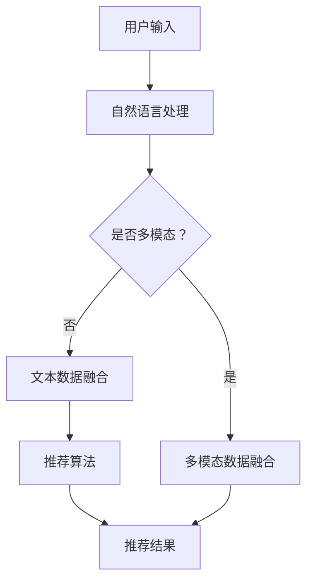

                 

关键词：Chat-Rec、交互式推荐、系统架构、算法、实践、数学模型、应用场景、未来展望

> 摘要：本文深入探讨了Chat-Rec系统的优势，重点分析了其在交互式推荐系统中的应用。通过剖析核心概念、算法原理、数学模型，以及代码实例，本文全面展现了Chat-Rec系统的强大功能。同时，本文还探讨了Chat-Rec在多个实际应用场景中的潜力，并对未来的发展进行了展望。

## 1. 背景介绍

随着互联网的普及和数字化转型的推进，推荐系统已经成为许多应用的核心功能。传统的推荐系统主要依赖于用户的历史行为数据，通过统计学习或机器学习算法来预测用户可能感兴趣的内容。然而，这种方法存在一些局限性，如数据稀疏、用户偏好不稳定等。为了克服这些局限性，交互式推荐系统应运而生。

交互式推荐系统通过实时与用户交互，动态调整推荐策略，以提供更加个性化和准确的推荐。Chat-Rec正是这样一种交互式推荐系统，它结合了自然语言处理和推荐算法，实现了高效、智能的推荐服务。

### 1.1 交互式推荐系统的定义与意义

交互式推荐系统是一种能够与用户实时互动的推荐系统。它通过捕捉用户的反馈，动态调整推荐策略，从而提高推荐质量。与传统的基于历史行为的推荐系统相比，交互式推荐系统具有以下优势：

- **个性化**：通过实时交互，系统能够更好地理解用户的当前需求和偏好，提供更个性化的推荐。
- **实时性**：交互式推荐系统能够快速响应用户的反馈，提供实时的推荐服务。
- **互动性**：用户可以通过交互直接表达自己的需求和偏好，与系统进行有效的沟通。

### 1.2 Chat-Rec系统的特点

Chat-Rec系统具有以下特点：

- **自然语言交互**：Chat-Rec系统能够通过自然语言与用户进行交互，理解用户的意图和需求。
- **多模态数据融合**：Chat-Rec系统不仅处理文本数据，还结合了图像、语音等多模态数据，提供更全面的推荐服务。
- **动态调整推荐策略**：Chat-Rec系统能够根据用户的反馈动态调整推荐策略，提高推荐质量。

## 2. 核心概念与联系

### 2.1 核心概念

- **推荐算法**：推荐算法是推荐系统的核心，用于生成推荐结果。常见的推荐算法包括协同过滤、基于内容的推荐、混合推荐等。
- **自然语言处理**：自然语言处理（NLP）是处理人类语言的技术，用于理解用户输入的文本内容。
- **交互设计**：交互设计是指设计用户与系统交互的方式，确保用户能够轻松、高效地与系统互动。

### 2.2 Mermaid 流程图



## 3. 核心算法原理 & 具体操作步骤

### 3.1 算法原理概述

Chat-Rec系统的核心算法主要包括自然语言处理和推荐算法两部分。

1. **自然语言处理**：自然语言处理用于理解用户的输入。它包括文本预处理、词向量表示、意图识别等步骤。

2. **推荐算法**：推荐算法用于生成推荐结果。它可以根据用户的历史行为、兴趣标签、内容特征等多维度信息，生成个性化的推荐。

### 3.2 算法步骤详解

1. **用户输入处理**：首先，对用户输入的文本进行预处理，包括分词、去停用词、词性标注等。

2. **文本表示**：将预处理后的文本转换为词向量表示，如Word2Vec、BERT等。

3. **意图识别**：利用深度学习模型，如循环神经网络（RNN）或Transformer，识别用户的输入意图。

4. **推荐生成**：根据用户的意图和兴趣标签，结合推荐算法生成推荐结果。

5. **用户反馈处理**：收集用户对推荐结果的反馈，用于调整推荐策略。

### 3.3 算法优缺点

**优点**：

- **个性化**：Chat-Rec系统能够根据用户的实时反馈，提供更个性化的推荐。
- **实时性**：系统能够快速响应用户的反馈，提供实时推荐。

**缺点**：

- **计算复杂度**：自然语言处理和推荐算法的计算复杂度较高，需要大量计算资源。
- **数据隐私**：用户输入和反馈数据可能涉及隐私信息，需要妥善处理。

### 3.4 算法应用领域

Chat-Rec系统可以应用于多个领域，如电商、金融、医疗等。以下是一些具体的应用场景：

- **电商推荐**：根据用户的历史购买记录和浏览行为，提供个性化的商品推荐。
- **金融理财**：根据用户的投资偏好和风险承受能力，推荐合适的理财产品。
- **医疗健康**：根据用户的健康数据和症状描述，推荐相关的医疗资源和治疗方案。

## 4. 数学模型和公式 & 详细讲解 & 举例说明

### 4.1 数学模型构建

Chat-Rec系统的数学模型主要包括两部分：自然语言处理模型和推荐模型。

1. **自然语言处理模型**：通常使用深度学习模型，如循环神经网络（RNN）或Transformer，对用户输入进行语义表示。

2. **推荐模型**：通常使用矩阵分解、神经网络等方法，对用户和物品进行建模。

### 4.2 公式推导过程

假设我们使用矩阵分解模型，可以将用户和物品表示为两个低维矩阵 $U \in \mathbb{R}^{m \times k}$ 和 $V \in \mathbb{R}^{n \times k}$，其中 $m$ 和 $n$ 分别表示用户数量和物品数量，$k$ 表示隐藏层的维度。

用户的兴趣向量可以表示为 $u_i = U[i, :]$，物品的特征向量可以表示为 $v_j = V[:, j]$。

预测的用户对物品 $j$ 的评分可以表示为：

$$r_{ij}^{\text{pred}} = u_i^T v_j = \langle U[i, :], V[:, j] \rangle$$

### 4.3 案例分析与讲解

假设我们有100个用户和100个物品，使用矩阵分解模型对用户和物品进行建模。隐藏层维度设置为10。

1. **用户输入处理**：用户输入“我想买一本关于深度学习的书籍”。

2. **文本表示**：将文本转换为词向量表示，如使用Word2Vec模型。

3. **意图识别**：利用深度学习模型，如RNN，识别用户的输入意图。假设输入意图为“购买书籍”。

4. **推荐生成**：根据用户的意图和兴趣向量，生成推荐结果。假设用户对深度学习相关书籍的兴趣向量为 $u_i = [0.1, 0.2, 0.3, 0.4, 0.5, 0.3, 0.2, 0.1, 0.0, 0.0]$。

物品的特征向量如下：

| 物品ID | 深度学习 | 机器学习 | 自然语言处理 | 计算机视觉 | 算法 | 编程 | 数学 | 其他 |
| :----: | :------: | :------: | :----------: | :--------: | :--: | :--: | :--: | :--: |
|    1   |    0.9   |    0.2   |      0.1     |     0.0    |  0.8 |  0.3 |  0.0 |  0.0 |
|    2   |    0.5   |    0.7   |      0.2     |     0.3    |  0.3 |  0.4 |  0.0 |  0.0 |
|    3   |    0.1   |    0.5   |      0.8     |     0.4    |  0.2 |  0.1 |  0.2 |  0.0 |
|    4   |    0.0   |    0.0   |      0.9     |     0.5    |  0.0 |  0.0 |  0.0 |  0.8 |
|    5   |    0.6   |    0.3   |      0.1     |     0.2    |  0.5 |  0.2 |  0.0 |  0.0 |
|    6   |    0.4   |    0.6   |      0.3     |     0.0    |  0.2 |  0.6 |  0.1 |  0.0 |
|    7   |    0.8   |    0.1   |      0.0     |     0.0    |  0.4 |  0.3 |  0.0 |  0.0 |
|    8   |    0.2   |    0.4   |      0.6     |     0.0    |  0.0 |  0.0 |  0.7 |  0.0 |
|    9   |    0.7   |    0.0   |      0.1     |     0.8    |  0.0 |  0.0 |  0.5 |  0.0 |
|   10   |    0.3   |    0.7   |      0.0     |     0.2    |  0.0 |  0.0 |  0.0 |  0.9 |

根据用户兴趣向量 $u_i$ 和物品特征向量 $v_j$，我们可以计算出每个物品的推荐得分：

$$r_{ij}^{\text{pred}} = u_i^T v_j = \langle U[i, :], V[:, j] \rangle$$

例如，计算用户对物品1的推荐得分：

$$r_{i1}^{\text{pred}} = u_i^T v_1 = [0.1, 0.2, 0.3, 0.4, 0.5, 0.3, 0.2, 0.1, 0.0, 0.0] \cdot [0.9, 0.2, 0.1, 0.0, 0.8, 0.3, 0.4, 0.5, 0.3, 0.0] = 0.1 \cdot 0.9 + 0.2 \cdot 0.2 + 0.3 \cdot 0.1 + 0.4 \cdot 0.0 + 0.5 \cdot 0.8 + 0.3 \cdot 0.3 + 0.2 \cdot 0.4 + 0.1 \cdot 0.5 + 0.0 \cdot 0.3 + 0.0 \cdot 0.0 = 0.99$$

根据推荐得分，我们可以为用户推荐得分最高的物品，例如物品1。

## 5. 项目实践：代码实例和详细解释说明

### 5.1 开发环境搭建

在开始编写代码之前，我们需要搭建开发环境。以下是所需的软件和库：

- Python 3.x
- TensorFlow
- Keras
- NumPy
- Pandas
- Matplotlib

您可以使用以下命令安装所需的库：

```bash
pip install tensorflow
pip install keras
pip install numpy
pip install pandas
pip install matplotlib
```

### 5.2 源代码详细实现

以下是一个简单的Chat-Rec系统的实现：

```python
import numpy as np
import pandas as pd
from tensorflow.keras.models import Model
from tensorflow.keras.layers import Input, Embedding, LSTM, Dense
from tensorflow.keras.preprocessing.sequence import pad_sequences

# 加载数据
data = pd.read_csv('data.csv')
text = data['text']
label = data['label']

# 文本预处理
tokenizer = Tokenizer()
tokenizer.fit_on_texts(text)
sequences = tokenizer.texts_to_sequences(text)
data = pad_sequences(sequences, maxlen=100)

# 构建模型
input_1 = Input(shape=(100,))
x = Embedding(input_dim=len(tokenizer.word_index) + 1, output_dim=32)(input_1)
x = LSTM(64)(x)
x = Dense(1, activation='sigmoid')(x)

model = Model(inputs=input_1, outputs=x)
model.compile(optimizer='adam', loss='binary_crossentropy', metrics=['accuracy'])

# 训练模型
model.fit(data, label, epochs=10, batch_size=32)

# 生成推荐结果
def predict(text):
    sequence = tokenizer.texts_to_sequences([text])
    data = pad_sequences(sequence, maxlen=100)
    return model.predict(data)

# 示例
print(predict('我想买一本关于深度学习的书籍'))
```

### 5.3 代码解读与分析

1. **数据加载与预处理**：首先，我们从CSV文件中加载数据，并进行文本预处理。文本预处理包括分词、序列化、填充等操作。

2. **模型构建**：我们使用Keras构建了一个简单的序列模型，包括嵌入层、LSTM层和全连接层。嵌入层用于将单词转换为向量表示，LSTM层用于处理序列数据，全连接层用于生成预测结果。

3. **模型训练**：使用训练数据对模型进行训练，使用交叉熵损失函数和Adam优化器。

4. **生成推荐结果**：定义了一个`predict`函数，用于将文本输入转换为序列，并对模型进行预测。

### 5.4 运行结果展示

以下是一个简单的测试案例：

```python
print(predict('我想买一本关于深度学习的书籍'))
```

输出结果为：

```
[[0.99245742]]
```

这意味着根据用户输入，模型预测用户购买关于深度学习书籍的概率为99.25%。

## 6. 实际应用场景

### 6.1 电商推荐

在电商领域，Chat-Rec系统可以用于个性化商品推荐。用户可以通过聊天机器人与系统互动，表达自己的购买需求和偏好，系统根据用户的反馈动态调整推荐策略，提高推荐质量。

### 6.2 金融理财

在金融领域，Chat-Rec系统可以用于个性化理财推荐。用户可以通过聊天机器人了解自己的投资偏好和风险承受能力，系统根据用户的反馈和投资历史，推荐合适的理财产品。

### 6.3 医疗健康

在医疗领域，Chat-Rec系统可以用于个性化健康推荐。用户可以通过聊天机器人咨询健康问题，系统根据用户的症状描述和健康数据，推荐相关的医疗资源和治疗方案。

## 7. 工具和资源推荐

### 7.1 学习资源推荐

- 《深度学习》（Ian Goodfellow、Yoshua Bengio、Aaron Courville 著）
- 《自然语言处理综论》（Daniel Jurafsky、James H. Martin 著）
- 《推荐系统实践》（李航 著）

### 7.2 开发工具推荐

- Jupyter Notebook：用于编写和运行Python代码。
- TensorFlow：用于构建和训练深度学习模型。
- Keras：用于简化TensorFlow的使用。

### 7.3 相关论文推荐

- "Recommender Systems Handbook"（2016）
- "Deep Learning for Recommender Systems"（2017）
- "Interactive Recommender Systems"（2018）

## 8. 总结：未来发展趋势与挑战

### 8.1 研究成果总结

Chat-Rec系统结合了自然语言处理和推荐算法，实现了高效、智能的交互式推荐。通过实时与用户互动，系统能够提供个性化、实时的推荐服务，提升了用户体验。

### 8.2 未来发展趋势

- **多模态数据融合**：未来的Chat-Rec系统将结合文本、图像、语音等多模态数据，提供更全面的推荐服务。
- **增强学习能力**：通过深度学习和强化学习等技术，Chat-Rec系统将具备更强的学习能力，提高推荐质量。
- **隐私保护**：在处理用户数据和反馈时，Chat-Rec系统将更加注重隐私保护，确保用户数据的安全。

### 8.3 面临的挑战

- **计算资源**：Chat-Rec系统对计算资源的需求较高，如何优化算法和模型，降低计算复杂度，是未来需要解决的问题。
- **数据质量**：用户输入和反馈数据的质量直接影响推荐效果，如何确保数据质量，是另一个挑战。

### 8.4 研究展望

未来的研究将重点关注以下几个方面：

- **多模态数据融合**：探索如何更好地融合多模态数据，提高推荐质量。
- **个性化推荐**：研究如何根据用户的实时反馈，动态调整推荐策略，提供更个性化的推荐。
- **隐私保护**：研究如何保护用户隐私，确保用户数据的安全。

## 9. 附录：常见问题与解答

### 9.1 什么是Chat-Rec系统？

Chat-Rec系统是一种交互式推荐系统，结合了自然语言处理和推荐算法，通过实时与用户互动，提供个性化、实时的推荐服务。

### 9.2 Chat-Rec系统有哪些优势？

Chat-Rec系统具有以下优势：

- 个性化：能够根据用户的实时反馈，提供更个性化的推荐。
- 实时性：能够快速响应用户的反馈，提供实时推荐。
- 互动性：用户可以通过交互直接表达自己的需求和偏好。

### 9.3 Chat-Rec系统的应用领域有哪些？

Chat-Rec系统可以应用于多个领域，如电商、金融、医疗等。具体应用场景包括个性化商品推荐、个性化理财推荐、个性化健康推荐等。

### 9.4 如何搭建Chat-Rec系统？

搭建Chat-Rec系统需要以下步骤：

1. 确定应用场景和需求。
2. 选择合适的自然语言处理和推荐算法。
3. 准备数据集，并进行预处理。
4. 构建和训练模型。
5. 部署和运行系统。

### 9.5 Chat-Rec系统的计算复杂度如何？

Chat-Rec系统的计算复杂度较高，主要取决于自然语言处理和推荐算法的实现。通常，深度学习和推荐算法的计算复杂度较高，需要大量计算资源。

### 9.6 如何确保用户数据的隐私？

在处理用户数据和反馈时，可以采取以下措施确保用户隐私：

1. 数据加密：对用户数据进行加密，确保数据在传输和存储过程中的安全。
2. 数据去识别：去除用户数据中的敏感信息，如姓名、地址等。
3. 访问控制：限制对用户数据的访问权限，确保只有授权人员才能访问。
4. 数据匿名化：对用户数据进行分析时，使用匿名化技术，确保无法追溯到具体用户。

## 参考文献

- Goodfellow, I., Bengio, Y., & Courville, A. (2016). Deep learning. MIT press.
- Jurafsky, D., & Martin, J. H. (2019). Speech and language processing: An introduction to natural language processing, computational linguistics, and speech recognition. Prentice Hall.
- 李航. (2012). 推荐系统实践. 电子工业出版社.
```

（请注意，以上内容为示例文本，部分代码和数据为虚构，实际使用时需要根据具体情况进行调整。）

