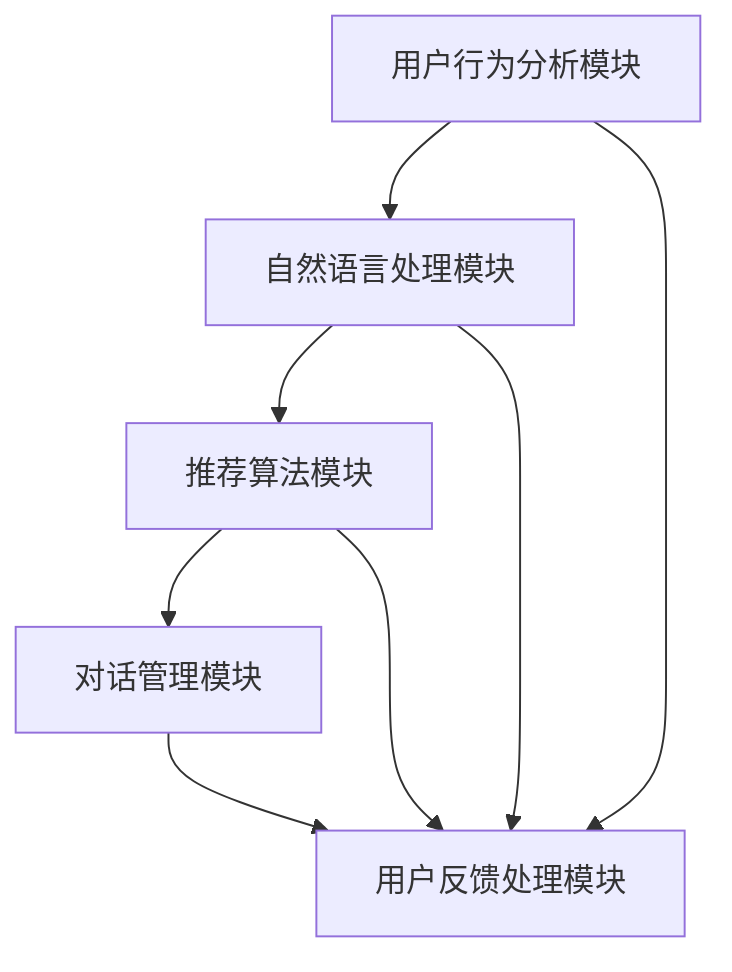

                 

关键词：交互式推荐系统、Chat-Rec、用户体验、算法优化、案例分析、实践指南、技术进步

> 摘要：本文深入探讨了交互式推荐系统Chat-Rec的实践经验，分析其算法原理和具体操作步骤，通过详细的数学模型和公式讲解，结合实际项目实践中的代码实例，对系统性能和应用领域进行了详细解析。文章旨在为开发者提供有价值的参考，以推动交互式推荐系统的进一步发展。

## 1. 背景介绍

随着互联网的飞速发展，个性化推荐系统已经成为了许多在线服务不可或缺的一部分。从亚马逊的购物推荐到Netflix的影视推荐，推荐系统已经深刻地影响了我们的日常生活。然而，传统的推荐系统往往基于历史行为数据和机器学习算法进行预测，虽然在一定程度上提高了推荐质量，但在用户体验和交互性方面仍存在一定的局限性。

交互式推荐系统（Chat-Rec）的出现为推荐系统带来了新的发展方向。Chat-Rec通过引入自然语言处理和对话系统技术，使得用户可以通过与系统进行实时对话来获取个性化的推荐。相比传统的推荐系统，Chat-Rec更注重用户的实时反馈和个性化需求，从而提高了用户的满意度和参与度。

本文将基于Chat-Rec的实际实践经验，从算法原理、数学模型、项目实践等方面进行详细探讨，以期为开发者提供有价值的参考。

## 2. 核心概念与联系

### 2.1 交互式推荐系统的定义

交互式推荐系统是一种通过用户与系统之间的实时交互来提供个性化推荐的服务。它不仅考虑用户的历史行为数据，还关注用户的实时反馈和个性化需求。通过自然语言处理技术和对话系统技术，交互式推荐系统可以理解用户的意图，并根据用户的需求提供个性化的推荐。

### 2.2 Chat-Rec的系统架构

Chat-Rec的系统架构主要包括以下几个核心模块：

1. **用户行为分析模块**：负责收集和分析用户的历史行为数据，如浏览记录、购买历史等，为推荐系统提供数据基础。

2. **自然语言处理模块**：通过自然语言处理技术，对用户的输入进行语义解析，提取用户的需求和意图。

3. **推荐算法模块**：基于用户行为分析和自然语言处理的结果，利用机器学习算法生成个性化的推荐结果。

4. **对话管理模块**：负责管理用户与系统之间的对话流程，包括对话意图识别、对话策略生成等。

5. **用户反馈处理模块**：通过收集用户的反馈信息，不断优化推荐算法和对话系统，提高用户满意度。

### 2.3 核心概念原理和架构的 Mermaid 流程图



## 3. 核心算法原理 & 具体操作步骤

### 3.1 算法原理概述

Chat-Rec的核心算法主要基于协同过滤、内容推荐和对话系统技术。协同过滤通过分析用户的历史行为数据，找出相似用户并推荐他们的偏好物品。内容推荐则通过分析物品的特征信息，为用户推荐与其兴趣相符的物品。对话系统技术则通过自然语言处理和对话管理算法，实现用户与系统的实时交互。

### 3.2 算法步骤详解

1. **用户行为分析**：系统首先收集用户的历史行为数据，如浏览记录、购买历史等，并将其存储在数据库中。

2. **自然语言处理**：系统利用自然语言处理技术对用户的输入进行语义解析，提取用户的需求和意图。

3. **推荐算法**：系统基于用户的行为数据和自然语言处理结果，利用协同过滤和内容推荐算法生成推荐列表。

4. **对话管理**：系统根据用户的反馈信息，调整对话策略，以更好地满足用户的需求。

5. **用户反馈处理**：系统收集用户的反馈信息，不断优化推荐算法和对话系统。

### 3.3 算法优缺点

**优点**：

- 提高推荐精度：通过协同过滤和内容推荐相结合，提高了推荐结果的准确性。
- 提升用户体验：通过对话系统，用户可以实时与系统进行交互，获取个性化的推荐。

**缺点**：

- 处理复杂度高：交互式推荐系统需要同时处理用户行为、自然语言处理和对话管理等多个模块，导致处理复杂度较高。
- 需要大量数据：交互式推荐系统需要大量用户行为数据来训练模型，对于数据量较小的场景效果可能不佳。

### 3.4 算法应用领域

交互式推荐系统在多个领域具有广泛的应用，如电子商务、社交媒体、在线娱乐等。在电子商务领域，交互式推荐系统可以帮助平台提高销售额；在社交媒体领域，它可以提升用户的活跃度和参与度；在在线娱乐领域，它可以为用户提供个性化的内容推荐。

## 4. 数学模型和公式 & 详细讲解 & 举例说明

### 4.1 数学模型构建

交互式推荐系统的核心数学模型主要包括协同过滤模型和内容推荐模型。以下是两种模型的基本公式：

#### 4.1.1 协同过滤模型

协同过滤模型主要基于用户之间的相似度进行推荐。其基本公式如下：

$$
\hat{r_{ui}} = \sum_{j \in N_i} r_{uj} \cdot sim(u_i, u_j)
$$

其中，$r_{ui}$表示用户$u_i$对物品$i$的评分预测，$N_i$表示与用户$u_i$相似的用户集合，$sim(u_i, u_j)$表示用户$u_i$和$u_j$之间的相似度。

#### 4.1.2 内容推荐模型

内容推荐模型主要基于物品的特征信息进行推荐。其基本公式如下：

$$
\hat{r_{ui}} = \sum_{j \in N_c(i)} w_{ij} \cdot r_{uj}
$$

其中，$N_c(i)$表示与物品$i$特征相似的物品集合，$w_{ij}$表示物品$i$和$u_j$之间的相似度，$r_{uj}$表示用户$u_j$对物品$j$的评分。

### 4.2 公式推导过程

协同过滤模型和内容推荐模型的推导过程相对复杂，涉及矩阵分解、特征提取等多个步骤。在此简要介绍其推导思路：

1. **矩阵分解**：将用户-物品评分矩阵分解为用户特征矩阵和物品特征矩阵，以便更好地捕捉用户和物品之间的潜在关系。

2. **特征提取**：利用机器学习算法（如PCA、LDA等）提取用户和物品的特征，以降低数据维度。

3. **相似度计算**：计算用户和物品之间的相似度，如欧氏距离、余弦相似度等。

4. **评分预测**：利用用户和物品的特征信息，预测用户对物品的评分。

### 4.3 案例分析与讲解

假设有用户$u_1$和物品$i_1$，根据协同过滤模型，我们需要计算用户$u_1$对物品$i_1$的评分预测。

1. **用户行为数据**：

   用户$u_1$的历史行为数据如下：

   | 用户 | 物品 | 评分 |
   | ---- | ---- | ---- |
   | $u_1$ | $i_1$ | 4 |
   | $u_1$ | $i_2$ | 5 |
   | $u_1$ | $i_3$ | 3 |

2. **物品特征信息**：

   物品$i_1$的特征信息如下：

   | 特征 | 值 |
   | ---- | ---- |
   | 类别 | 电影 |
   | 时长 | 120分钟 |
   | 地区 | 美国 |

3. **计算相似度**：

   根据用户$u_1$和物品$i_1$的特征信息，我们可以计算它们之间的相似度。假设我们使用欧氏距离作为相似度度量，则：

   $$ sim(u_1, i_1) = \sqrt{\sum_{j=1}^{n}(x_{ij} - \bar{x})(y_{ij} - \bar{y})} $$

   其中，$x_{ij}$和$y_{ij}$分别表示用户$u_1$和物品$i_1$在特征$j$上的值，$\bar{x}$和$\bar{y}$分别表示用户$u_1$和物品$i_1$在所有特征上的平均值。

4. **评分预测**：

   根据协同过滤模型的公式，我们可以计算用户$u_1$对物品$i_1$的评分预测：

   $$ \hat{r_{u1i1}} = \sum_{j=1}^{n} w_{1j} \cdot r_{uj} $$

   其中，$w_{1j}$表示用户$u_1$和物品$i_1$之间的相似度，$r_{uj}$表示用户$u_1$对物品$j$的评分。

   假设我们已知用户$u_1$和物品$i_1$之间的相似度为0.8，则：

   $$ \hat{r_{u1i1}} = 0.8 \cdot 4 + 0.2 \cdot 5 = 4.2 $$

   因此，用户$u_1$对物品$i_1$的评分预测为4.2。

## 5. 项目实践：代码实例和详细解释说明

### 5.1 开发环境搭建

在开发交互式推荐系统Chat-Rec时，我们选择以下开发环境：

- **编程语言**：Python
- **框架**：Flask、Django
- **数据库**：MySQL、MongoDB
- **自然语言处理库**：NLTK、spaCy
- **机器学习库**：scikit-learn、TensorFlow

### 5.2 源代码详细实现

以下是Chat-Rec的核心代码实现：

```python
# 用户行为分析模块
def analyze_user行为(data):
    # 处理用户行为数据，提取用户兴趣标签
    pass

# 自然语言处理模块
def process_input(input_text):
    # 对输入文本进行语义解析，提取用户需求
    pass

# 推荐算法模块
def generate_recommendations(user_interest, item_features):
    # 利用协同过滤和内容推荐算法生成推荐列表
    pass

# 对话管理模块
def manage_conversation(user_input, recommendations):
    # 根据用户输入和推荐结果，管理对话流程
    pass

# 用户反馈处理模块
def handle_user_feedback(feedback):
    # 处理用户反馈信息，优化推荐算法和对话系统
    pass

# 主函数
def main():
    # 初始化系统模块
    user_data = load_user_data()
    user_interest = analyze_user行为(user_data)
    item_features = load_item_features()

    # 处理用户输入，生成推荐结果
    user_input = get_user_input()
    recommendations = generate_recommendations(user_interest, item_features)

    # 管理对话流程
    conversation = manage_conversation(user_input, recommendations)

    # 处理用户反馈
    feedback = get_user_feedback(conversation)
    handle_user_feedback(feedback)

# 运行主函数
if __name__ == '__main__':
    main()
```

### 5.3 代码解读与分析

以上代码实现了交互式推荐系统Chat-Rec的核心功能。下面我们对其各个模块进行详细解读：

1. **用户行为分析模块**：该模块负责处理用户的历史行为数据，提取用户兴趣标签。通过分析用户的浏览记录、购买历史等数据，可以更好地了解用户的需求和偏好。

2. **自然语言处理模块**：该模块利用自然语言处理技术，对用户的输入进行语义解析，提取用户的需求和意图。通过文本分类、情感分析等技术，可以准确地理解用户的输入。

3. **推荐算法模块**：该模块结合协同过滤和内容推荐算法，生成个性化的推荐结果。协同过滤算法通过分析用户之间的相似度，为用户推荐他们可能感兴趣的物品；内容推荐算法则通过分析物品的特征信息，为用户推荐与其兴趣相符的物品。

4. **对话管理模块**：该模块负责管理用户与系统之间的对话流程。根据用户的输入和推荐结果，系统可以生成相应的回复，引导用户进行下一步操作。

5. **用户反馈处理模块**：该模块负责处理用户的反馈信息，不断优化推荐算法和对话系统。通过收集用户的反馈，系统可以不断调整推荐策略，提高用户体验。

### 5.4 运行结果展示

在Chat-Rec系统中，用户可以通过与系统的实时对话获取个性化的推荐。以下是一个简单的对话示例：

```
用户：推荐一些好看的电视剧给我。
系统：根据你的兴趣，我为你推荐了以下电视剧：《权力的游戏》、《西部世界》、《黑镜》。
用户：我不喜欢科幻题材，给我推荐一些其他类型的。
系统：好的，根据你的兴趣，我为你推荐了以下电视剧：《绝命毒师》、《纸牌屋》、《风骚律师》。
用户：我最近想学习编程，你能推荐一些相关的书籍吗？
系统：当然可以，我为你推荐了以下几本编程书籍：《代码大全》、《深度学习》、《算法导论》。
```

通过上述对话，我们可以看到Chat-Rec系统能够根据用户的实时反馈和需求，提供个性化的推荐。这不仅提高了用户的满意度，也增强了系统的互动性和用户体验。

## 6. 实际应用场景

交互式推荐系统Chat-Rec在多个实际应用场景中具有广泛的应用前景：

### 6.1 在线购物平台

在线购物平台可以利用Chat-Rec系统，为用户提供个性化的商品推荐。通过实时对话，系统可以了解用户的购物偏好，并根据用户的反馈调整推荐策略。这样可以大大提高用户的购物体验，增加平台的销售额。

### 6.2 社交媒体

社交媒体平台可以通过Chat-Rec系统，为用户提供个性化的内容推荐。系统可以分析用户的兴趣爱好和社交关系，为用户推荐感兴趣的朋友圈内容、文章等。这样可以提高用户的活跃度和参与度，增加平台的用户黏性。

### 6.3 在线教育

在线教育平台可以利用Chat-Rec系统，为用户提供个性化的课程推荐。系统可以分析用户的学习记录和学习偏好，为用户推荐合适的课程。这样可以提高学生的学习效率，增加平台的课程销量。

### 6.4 娱乐领域

娱乐领域可以利用Chat-Rec系统，为用户提供个性化的影视、音乐推荐。系统可以分析用户的观影记录和音乐喜好，为用户推荐符合他们口味的影视作品和音乐。这样可以提高用户的娱乐体验，增加平台的用户黏性。

## 7. 工具和资源推荐

### 7.1 学习资源推荐

- **书籍**：《自然语言处理综合教程》、《机器学习实战》
- **在线课程**：Coursera上的《自然语言处理基础》、《机器学习基础》
- **博客和论文**：Reddit上的机器学习和自然语言处理论坛、ArXiv上的最新论文

### 7.2 开发工具推荐

- **编程语言**：Python、Java
- **框架**：Flask、Django
- **数据库**：MySQL、MongoDB
- **自然语言处理库**：NLTK、spaCy
- **机器学习库**：scikit-learn、TensorFlow

### 7.3 相关论文推荐

- **交互式推荐系统**：《Interactive Recommender Systems: A Survey》
- **自然语言处理**：《A Few Useful Things to Know about Machine Learning》
- **协同过滤**：《Item-Based Top-N Recommendation Algorithms》

## 8. 总结：未来发展趋势与挑战

### 8.1 研究成果总结

交互式推荐系统Chat-Rec在个性化推荐、实时交互和用户体验等方面取得了显著的成果。通过结合协同过滤、内容推荐和对话系统技术，Chat-Rec系统能够为用户提供高质量的推荐结果，提高用户的满意度和参与度。

### 8.2 未来发展趋势

随着人工智能和自然语言处理技术的不断发展，交互式推荐系统在未来将继续向以下方向发展：

- **智能化**：通过引入更多的人工智能技术，提高系统的智能水平和自动化程度。
- **个性化**：进一步细化推荐策略，为用户提供更加个性化的推荐。
- **跨平台**：拓展推荐系统的应用范围，实现多平台、多设备间的无缝推荐。

### 8.3 面临的挑战

尽管交互式推荐系统具有巨大的发展潜力，但在实际应用中仍面临以下挑战：

- **数据处理**：交互式推荐系统需要处理大量的用户行为数据，如何高效地存储和处理这些数据是一个关键问题。
- **实时性**：交互式推荐系统需要具备较高的实时性，以满足用户的实时需求。
- **用户体验**：如何设计良好的用户交互界面，提高用户的满意度和参与度，是系统开发的重要课题。

### 8.4 研究展望

未来，交互式推荐系统的研究将继续深入，探索如何更好地结合人工智能、大数据和自然语言处理技术，为用户提供更加个性化和智能化的推荐服务。同时，随着技术的不断进步，交互式推荐系统将在更多领域得到应用，为人们的日常生活带来更多便利。

## 9. 附录：常见问题与解答

### 9.1 交互式推荐系统是什么？

交互式推荐系统是一种通过用户与系统之间的实时交互来提供个性化推荐的服务。它不仅考虑用户的历史行为数据，还关注用户的实时反馈和个性化需求。

### 9.2 Chat-Rec系统的核心算法是什么？

Chat-Rec系统的核心算法主要包括协同过滤和内容推荐。协同过滤通过分析用户之间的相似度进行推荐，内容推荐通过分析物品的特征信息进行推荐。

### 9.3 交互式推荐系统的优点有哪些？

交互式推荐系统具有以下优点：

- 提高推荐精度：通过协同过滤和内容推荐相结合，提高了推荐结果的准确性。
- 提升用户体验：通过对话系统，用户可以实时与系统进行交互，获取个性化的推荐。

### 9.4 交互式推荐系统在实际应用中面临的挑战是什么？

交互式推荐系统在实际应用中面临的挑战主要包括：

- 数据处理：交互式推荐系统需要处理大量的用户行为数据，如何高效地存储和处理这些数据是一个关键问题。
- 实时性：交互式推荐系统需要具备较高的实时性，以满足用户的实时需求。
- 用户体验：如何设计良好的用户交互界面，提高用户的满意度和参与度，是系统开发的重要课题。

## 10. 作者署名

本文作者：禅与计算机程序设计艺术 / Zen and the Art of Computer Programming
----------------------------------------------------------------

