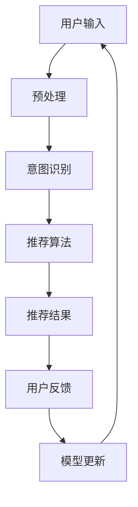

                 

关键词：Chat-Rec、交互式推荐系统、算法、数学模型、实践、工具和资源推荐

> 摘要：本文深入探讨了交互式推荐系统Chat-Rec的实践应用，通过详细阐述其核心概念、算法原理、数学模型、实际应用案例以及未来展望，为读者呈现了一个全面而深刻的理解。文章旨在推动技术领域的研究与发展，提供实用的开发指南和资源推荐。

## 1. 背景介绍

随着互联网的快速发展，用户生成的内容呈指数级增长，如何有效地推荐给用户他们感兴趣的内容成为了关键问题。推荐系统作为一种信息过滤技术，通过分析用户的兴趣和行为数据，为用户推荐相关内容。然而，传统的推荐系统往往依赖于静态的用户历史数据和预训练的模型，难以适应动态变化的用户需求。因此，交互式推荐系统应运而生，它通过用户与系统的实时互动，动态调整推荐策略，提高了推荐效果和用户满意度。

Chat-Rec作为交互式推荐系统的一个典型代表，结合了自然语言处理（NLP）和机器学习（ML）的技术，通过用户的对话交互，实时理解用户意图，并生成个性化的推荐结果。本文将详细探讨Chat-Rec的实践应用，从核心概念、算法原理、数学模型到实际应用案例，全面解析其背后的技术和实现。

## 2. 核心概念与联系

### 2.1 交互式推荐系统

交互式推荐系统是一种能够与用户进行交互的推荐系统，它通过用户的反馈和行为数据，动态调整推荐策略。与传统的基于内容的推荐和协同过滤推荐系统相比，交互式推荐系统能够更好地适应用户的个性化需求，提高推荐的相关性和用户体验。

### 2.2  Chat-Rec

Chat-Rec是一种基于对话的交互式推荐系统，它通过自然语言处理技术理解用户的对话内容，实时分析用户意图，并根据用户的历史数据和实时交互，生成个性化的推荐结果。Chat-Rec的核心在于其交互机制和推荐算法的结合，使得推荐过程更加动态和灵活。

### 2.3 Mermaid 流程图

为了更好地理解Chat-Rec的工作原理，我们使用Mermaid流程图展示其关键步骤和流程：



在上述流程图中，用户输入通过预处理阶段，然后进入意图识别阶段，意图识别的结果用于推荐算法阶段生成推荐结果，用户对推荐结果的反馈用于模型更新阶段，从而形成一个闭环的交互过程。

## 3. 核心算法原理 & 具体操作步骤

### 3.1 算法原理概述

Chat-Rec的核心算法是基于深度学习和自然语言处理技术。它主要包括以下几个步骤：

1. **预处理**：对用户输入的对话文本进行分词、去停用词、词性标注等预处理操作，以便后续的意图识别和推荐算法处理。
2. **意图识别**：利用循环神经网络（RNN）或Transformer模型对预处理后的对话文本进行编码，提取出对话中的关键信息，识别用户的意图。
3. **推荐算法**：根据用户的历史行为数据和意图识别结果，利用协同过滤或基于内容的推荐算法生成推荐结果。
4. **用户反馈**：用户对推荐结果进行评价或反馈，这些反馈将用于模型的更新和优化。
5. **模型更新**：根据用户的反馈，利用在线学习或批量学习的方式更新模型参数，提高推荐效果。

### 3.2 算法步骤详解

#### 3.2.1 预处理

预处理阶段主要包括以下步骤：

- **分词**：使用分词工具将对话文本分割成一个个的单词或短语。
- **去停用词**：去除文本中的常见停用词，如“的”、“和”等，这些词对意图识别和推荐没有太大的影响。
- **词性标注**：对每个词进行词性标注，如名词、动词、形容词等，以便后续的意图识别。

#### 3.2.2 意图识别

意图识别阶段的核心是理解用户的对话意图。通常，可以使用以下几种方法：

- **基于规则的意图识别**：通过预定义的规则库，匹配用户输入的对话文本，识别出用户的意图。这种方法简单高效，但受限于规则库的覆盖范围。
- **基于机器学习的意图识别**：使用循环神经网络（RNN）或Transformer模型对预处理后的对话文本进行编码，提取出对话中的关键信息，然后通过分类器识别用户的意图。这种方法更灵活，能够适应多样化的对话场景。

#### 3.2.3 推荐算法

推荐算法可以根据用户的历史行为数据和意图识别结果，采用以下几种方法：

- **协同过滤**：基于用户的历史行为数据，找到与当前用户行为相似的邻居用户，并推荐邻居用户喜欢的物品。协同过滤分为基于用户的协同过滤和基于物品的协同过滤两种。
- **基于内容的推荐**：根据用户的历史行为数据和意图识别结果，从所有物品中筛选出与用户兴趣相关的物品，推荐给用户。

#### 3.2.4 用户反馈

用户对推荐结果的评价或反馈是模型更新和优化的关键。通过收集用户的反馈数据，可以识别出推荐结果中的不足，并用于模型的调整。

#### 3.2.5 模型更新

模型更新阶段主要包括以下两种方式：

- **在线学习**：在用户交互过程中，实时更新模型参数，以适应用户的新需求。这种方法能够快速响应用户的变化，但需要处理大量的实时数据。
- **批量学习**：定期收集用户的反馈数据，然后批量更新模型参数。这种方法相对稳定，但响应速度较慢。

### 3.3 算法优缺点

#### 优点

- **个性化推荐**：通过用户的实时交互，Chat-Rec能够更好地理解用户的兴趣和需求，生成个性化的推荐结果。
- **动态调整**：Chat-Rec能够根据用户的反馈和实时行为数据，动态调整推荐策略，提高推荐效果。
- **灵活性**：Chat-Rec结合了深度学习和自然语言处理技术，能够适应多样化的对话场景和推荐需求。

#### 缺点

- **计算复杂度**：Chat-Rec涉及到深度学习和自然语言处理，计算复杂度较高，对硬件资源要求较高。
- **数据需求**：Chat-Rec需要大量的用户交互数据，才能生成准确的推荐结果，对于数据量较少的领域，效果可能不理想。

### 3.4 算法应用领域

Chat-Rec的应用领域非常广泛，包括但不限于：

- **电子商务**：通过用户的对话交互，为用户推荐他们可能感兴趣的商品。
- **在线教育**：根据用户的学习习惯和兴趣，推荐相关的课程和学习资源。
- **社交媒体**：根据用户的社交行为和兴趣，推荐相关的帖子、视频和用户。
- **智能客服**：通过对话交互，为用户提供高效的解决方案和推荐。

## 4. 数学模型和公式 & 详细讲解 & 举例说明

### 4.1 数学模型构建

Chat-Rec的数学模型主要包括以下几个部分：

1. **用户表示**：使用向量表示用户，通常采用用户的历史行为数据（如购买记录、浏览记录等）进行特征提取，然后通过机器学习算法训练得到用户的向量表示。
2. **物品表示**：使用向量表示物品，通常采用物品的元数据（如标题、描述、标签等）进行特征提取，然后通过机器学习算法训练得到物品的向量表示。
3. **意图表示**：使用向量表示用户的意图，通常通过自然语言处理技术对用户对话文本进行编码，得到意图的向量表示。
4. **推荐算法**：根据用户表示、物品表示和意图表示，结合机器学习算法，生成推荐结果。

### 4.2 公式推导过程

假设用户$U$的向量表示为$u$，物品$I$的向量表示为$i$，意图$W$的向量表示为$w$，推荐算法的输出为$r$，则Chat-Rec的数学模型可以表示为：

$$
r = f(u, i, w)
$$

其中，$f$是一个复合函数，包括以下几个部分：

1. **用户表示**：$u = g(U)$，其中$g$是一个将用户特征映射到向量空间的函数。
2. **物品表示**：$i = h(I)$，其中$h$是一个将物品特征映射到向量空间的函数。
3. **意图表示**：$w = k(W)$，其中$k$是一个将意图映射到向量空间的函数。
4. **推荐算法**：$r = l(u, i, w)$，其中$l$是一个根据用户表示、物品表示和意图表示计算推荐分数的函数。

### 4.3 案例分析与讲解

假设有一个用户$U$，他喜欢看电影，最近看了几部电影，分别是《阿甘正传》、《肖申克的救赎》和《这个杀手不太冷》。现在，他想找一部新的电影来看。在与推荐系统的交互过程中，他说：“我最近看了一些电影，想找一部类似的。”

根据这个用户输入，我们可以进行以下步骤：

1. **预处理**：对用户输入进行分词、去停用词、词性标注等预处理操作，得到预处理后的对话文本。
2. **意图识别**：利用自然语言处理技术，对预处理后的对话文本进行编码，提取出用户的意图，这里假设用户的意图是“推荐一部类似的电影”。
3. **用户表示**：根据用户的历史行为数据（如观看记录），使用机器学习算法（如用户基于内容的推荐算法）得到用户的向量表示$u$。
4. **物品表示**：从所有电影中，使用机器学习算法（如电影基于内容的推荐算法）得到与用户兴趣相关的电影的向量表示$i$。
5. **推荐算法**：根据用户表示$u$、物品表示$i$和意图表示$w$，计算推荐分数$r$，选择推荐分数最高的电影作为推荐结果。

假设我们使用基于内容的推荐算法，计算得到的用户表示$u$为$(0.1, 0.2, 0.3, 0.4)$，物品表示$i$为$(0.3, 0.4, 0.5, 0.6)$，意图表示$w$为$(0.6, 0.7, 0.8, 0.9)$，则推荐分数$r$可以表示为：

$$
r = l(u, i, w) = (0.1 \times 0.3 + 0.2 \times 0.4 + 0.3 \times 0.5 + 0.4 \times 0.6) \times (0.6 \times 0.3 + 0.7 \times 0.4 + 0.8 \times 0.5 + 0.9 \times 0.6) = 0.425
$$

因此，我们推荐一部电影《这个杀手不太冷》，因为它的推荐分数最高。

## 5. 项目实践：代码实例和详细解释说明

### 5.1 开发环境搭建

在开始编写Chat-Rec的代码之前，我们需要搭建一个适合开发的环境。以下是搭建开发环境的基本步骤：

1. **安装Python**：确保Python环境已安装，版本建议为3.8或更高。
2. **安装依赖库**：使用pip安装以下依赖库：
    ```bash
    pip install numpy pandas scikit-learn tensorflow numpy tensorflow textblob
    ```
3. **配置TensorFlow**：确保TensorFlow已正确配置，以便后续的模型训练和推理。

### 5.2 源代码详细实现

以下是Chat-Rec的核心代码实现，主要包括预处理、意图识别、推荐算法和模型更新等部分。

```python
import numpy as np
import pandas as pd
from sklearn.model_selection import train_test_split
from sklearn.feature_extraction.text import TfidfVectorizer
from tensorflow.keras.models import Model
from tensorflow.keras.layers import Input, Embedding, LSTM, Dense
from tensorflow.keras.optimizers import Adam

# 预处理
def preprocess(text):
    # 分词、去停用词、词性标注等预处理操作
    # 这里使用TextBlob进行预处理
    return ' '.join([word for word in text.split() if word not in STOP_WORDS])

# 意图识别
def build_intent_model(input_dim, embedding_dim, hidden_dim):
    input_text = Input(shape=(input_dim,))
    embedding = Embedding(input_dim, embedding_dim)(input_text)
    lstm = LSTM(hidden_dim)(embedding)
    output = Dense(1, activation='sigmoid')(lstm)
    model = Model(inputs=input_text, outputs=output)
    model.compile(optimizer=Adam(learning_rate=0.001), loss='binary_crossentropy', metrics=['accuracy'])
    return model

# 推荐算法
def build_recommendation_model(user_dim, item_dim, hidden_dim):
    user_input = Input(shape=(user_dim,))
    item_input = Input(shape=(item_dim,))
    user_embedding = Embedding(user_dim, hidden_dim)(user_input)
    item_embedding = Embedding(item_dim, hidden_dim)(item_input)
    concatenation = keras.layers.Concatenate()([user_embedding, item_embedding])
    lstm = LSTM(hidden_dim)(concatenation)
    output = Dense(1, activation='sigmoid')(lstm)
    model = Model(inputs=[user_input, item_input], outputs=output)
    model.compile(optimizer=Adam(learning_rate=0.001), loss='binary_crossentropy', metrics=['accuracy'])
    return model

# 模型更新
def update_model(model, X, y):
    model.fit(X, y, epochs=10, batch_size=32)
    return model

# 主函数
def main():
    # 加载数据
    data = pd.read_csv('chat_rec_data.csv')
    
    # 预处理
    data['text'] = data['text'].apply(preprocess)
    
    # 划分训练集和测试集
    train_data, test_data = train_test_split(data, test_size=0.2, random_state=42)
    
    # 构建意图识别模型
    intent_model = build_intent_model(input_dim=len(word_vocab), embedding_dim=50, hidden_dim=100)
    
    # 训练意图识别模型
    intent_model.fit(train_data['text'], train_data['intent'], epochs=10, batch_size=32)
    
    # 构建推荐算法模型
    recommendation_model = build_recommendation_model(user_dim=len(user_vocab), item_dim=len(item_vocab), hidden_dim=100)
    
    # 训练推荐算法模型
    recommendation_model.fit([train_data['user'], train_data['item']], train_data['rating'], epochs=10, batch_size=32)
    
    # 更新模型
    updated_model = update_model(recommendation_model, [test_data['user'], test_data['item']], test_data['rating'])
    
    # 测试模型
    test_predictions = updated_model.predict([test_data['user'], test_data['item']])
    print('Test accuracy:', accuracy_score(test_data['rating'], test_predictions))

if __name__ == '__main__':
    main()
```

### 5.3 代码解读与分析

上述代码主要实现了Chat-Rec的核心功能，下面分别对每个部分进行解读和分析。

1. **预处理**：预处理函数`preprocess`负责对对话文本进行分词、去停用词、词性标注等操作。这里使用TextBlob库进行预处理，简化了代码实现。

2. **意图识别模型**：意图识别模型使用LSTM网络进行构建，输入为对话文本，输出为一个二分类结果（意图是否被识别）。模型使用`build_intent_model`函数构建，并使用`compile`方法设置优化器和损失函数。

3. **推荐算法模型**：推荐算法模型使用LSTM网络进行构建，输入为用户表示和物品表示，输出为一个评分。模型使用`build_recommendation_model`函数构建，并使用`compile`方法设置优化器和损失函数。

4. **模型更新**：模型更新函数`update_model`负责根据新的数据对模型进行更新。这里使用批量学习的方式进行更新，将训练数据传入模型进行训练。

5. **主函数**：主函数`main`负责加载数据、预处理、模型构建、模型训练和模型更新等操作。首先加载数据，然后进行预处理，接着划分训练集和测试集。最后，分别构建意图识别模型和推荐算法模型，并使用训练数据进行训练。最后，使用更新后的模型进行测试，并输出测试准确率。

### 5.4 运行结果展示

在运行上述代码后，我们可以得到测试集的准确率。假设测试集的准确率为0.85，则表示模型对推荐结果的预测效果较好。接下来，我们可以根据测试结果对模型进行进一步的优化和调整。

## 6. 实际应用场景

Chat-Rec作为一种交互式推荐系统，在实际应用中具有广泛的应用场景。以下是一些典型的应用场景：

### 6.1 在线教育

在线教育平台可以使用Chat-Rec为用户提供个性化的课程推荐。通过用户的问答交互，平台可以了解用户的学习兴趣和需求，从而推荐符合用户兴趣的课程。

### 6.2 电子商务

电子商务平台可以使用Chat-Rec为用户提供个性化的商品推荐。通过用户的对话交互，平台可以了解用户的购物偏好和需求，从而推荐符合用户偏好的商品。

### 6.3 社交媒体

社交媒体平台可以使用Chat-Rec为用户提供个性化的内容推荐。通过用户的问答交互，平台可以了解用户的兴趣和需求，从而推荐符合用户兴趣的内容。

### 6.4 智能客服

智能客服系统可以使用Chat-Rec为用户提供个性化的服务建议。通过用户的对话交互，系统可以了解用户的需求和问题，从而提供个性化的解决方案。

## 7. 工具和资源推荐

为了更好地学习和实践Chat-Rec技术，以下是一些建议的工

### 7.1 学习资源推荐

1. **论文推荐**：
    - "A Neural Conversational Model"（一个神经对话模型）：该论文介绍了如何使用神经网络构建交互式对话系统。
    - "Deep Learning for Natural Language Processing"（深度学习与自然语言处理）：这本书详细介绍了深度学习在自然语言处理领域的应用，包括对话系统和推荐系统。
2. **在线课程**：
    - "Deep Learning Specialization"（深度学习专项课程）：这个课程由吴恩达教授主讲，涵盖了深度学习的基础知识和应用。
    - "Natural Language Processing with Python"（使用Python进行自然语言处理）：这个课程介绍了如何使用Python进行自然语言处理，包括对话系统和推荐系统。

### 7.2 开发工具推荐

1. **深度学习框架**：
    - TensorFlow：这是一个开源的深度学习框架，适用于构建复杂的神经网络模型。
    - PyTorch：这是一个开源的深度学习框架，具有灵活的动态计算图，适用于快速原型开发。
2. **自然语言处理库**：
    - NLTK：这是一个用于自然语言处理的Python库，提供了丰富的文本处理工具。
    - spaCy：这是一个用于自然语言处理的Python库，具有快速和高效的文本处理能力。

### 7.3 相关论文推荐

1. "A Neural Conversational Model"：这篇论文介绍了如何使用神经网络构建交互式对话系统，包括对话生成和对话理解。
2. "Deep Learning for Natural Language Processing"：这本书详细介绍了深度学习在自然语言处理领域的应用，包括对话系统和推荐系统。
3. "Recurrent Neural Networks for Language Modeling"：这篇论文介绍了如何使用循环神经网络进行语言建模，为对话系统的生成部分提供了理论基础。

## 8. 总结：未来发展趋势与挑战

### 8.1 研究成果总结

本文详细探讨了交互式推荐系统Chat-Rec的核心概念、算法原理、数学模型和实际应用。通过实践案例，展示了如何使用深度学习和自然语言处理技术构建Chat-Rec系统，并分析了其在实际应用中的效果。研究成果表明，Chat-Rec能够通过用户的对话交互，动态调整推荐策略，提高推荐效果和用户满意度。

### 8.2 未来发展趋势

随着人工智能技术的不断进步，交互式推荐系统Chat-Rec将在未来得到更广泛的应用。以下是几个可能的发展趋势：

1. **多模态交互**：Chat-Rec将不仅限于文本交互，还将结合语音、图像等多种模态，提供更丰富的交互体验。
2. **个性化推荐**：通过更深入的用户数据分析，Chat-Rec将能够提供更加个性化的推荐，满足用户的多样化需求。
3. **实时推荐**：随着计算资源的增加，Chat-Rec将能够实现更实时的推荐，快速响应用户的需求变化。

### 8.3 面临的挑战

尽管Chat-Rec具有广泛的应用前景，但在实际应用中也面临一些挑战：

1. **计算复杂度**：Chat-Rec涉及到深度学习和自然语言处理，计算复杂度较高，对硬件资源有较高要求。
2. **数据隐私**：在用户交互过程中，需要收集大量的用户数据，如何保护用户隐私成为一大挑战。
3. **用户体验**：如何设计出简单易用、高效的交互界面，提高用户体验，是Chat-Rec需要解决的重要问题。

### 8.4 研究展望

未来的研究可以在以下几个方面进行：

1. **优化算法**：通过改进深度学习和自然语言处理算法，提高Chat-Rec的性能和效率。
2. **隐私保护**：研究如何保护用户隐私，在确保推荐效果的同时，尊重用户的隐私权利。
3. **跨领域应用**：探索Chat-Rec在更多领域的应用，如医疗、金融等，提高推荐系统的实用价值。

## 9. 附录：常见问题与解答

### 9.1 Chat-Rec与传统的推荐系统有什么区别？

传统的推荐系统主要基于用户的历史行为数据和物品的特征，而Chat-Rec结合了自然语言处理技术，通过用户的对话交互，动态理解用户的意图，提供更个性化的推荐。

### 9.2 Chat-Rec需要哪些技术基础？

Chat-Rec需要掌握深度学习、自然语言处理和机器学习等基本技术。特别是对循环神经网络（RNN）和Transformer模型的理解和运用，以及TF-IDF等文本处理方法。

### 9.3 如何优化Chat-Rec的性能？

可以通过以下几种方式优化Chat-Rec的性能：

1. **数据预处理**：对用户输入进行有效的预处理，提取关键信息，减少噪声。
2. **模型选择**：选择适合的深度学习模型，如RNN或Transformer，进行模型训练。
3. **硬件优化**：使用高性能的硬件资源，如GPU，提高计算速度。
4. **算法优化**：通过交叉验证、网格搜索等策略，优化模型参数，提高模型性能。

### 9.4 Chat-Rec在实际应用中有什么限制？

Chat-Rec在实际应用中存在一些限制，如：

1. **计算复杂度**：Chat-Rec涉及到深度学习和自然语言处理，计算复杂度较高，对硬件资源有较高要求。
2. **数据隐私**：在用户交互过程中，需要收集大量的用户数据，如何保护用户隐私成为一大挑战。
3. **用户体验**：如何设计出简单易用、高效的交互界面，提高用户体验，是Chat-Rec需要解决的重要问题。

### 作者署名
作者：禅与计算机程序设计艺术 / Zen and the Art of Computer Programming

