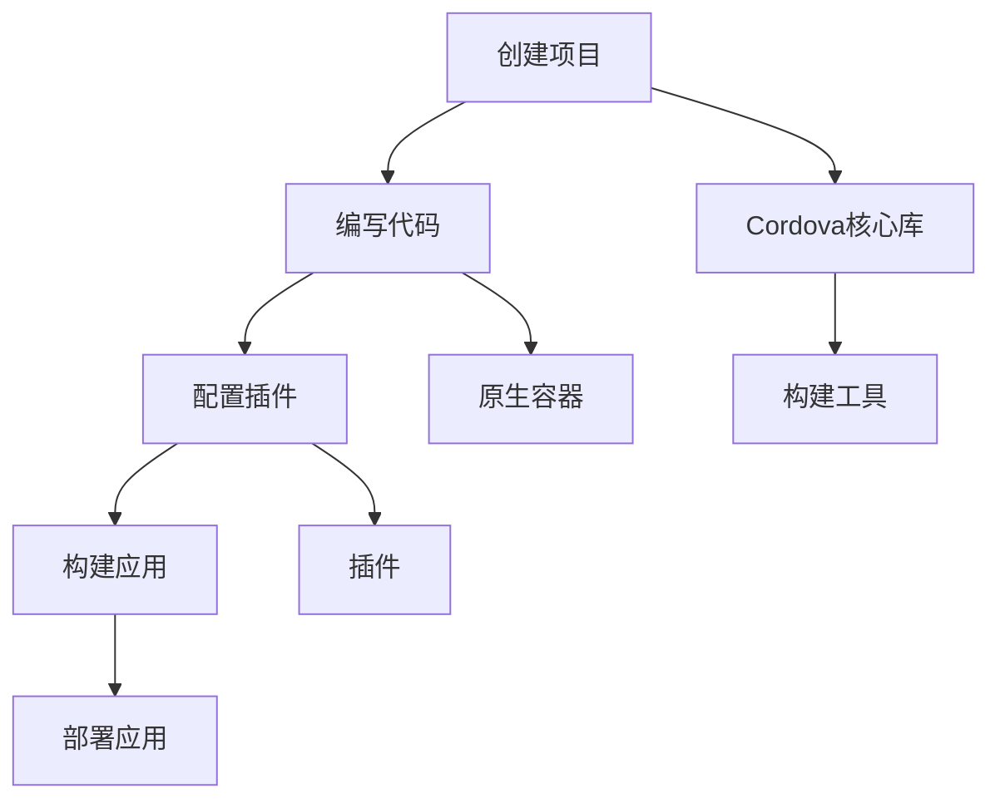

                 

关键词：Cordova，混合移动应用开发，移动开发框架，跨平台应用，原生应用，移动应用开发工具

摘要：本文深入探讨了Cordova框架在混合移动应用开发中的应用。从背景介绍到核心概念，再到具体算法原理、项目实践、实际应用场景以及工具和资源推荐，本文为读者提供了一个全面的技术指南。通过本文，读者将了解到如何利用Cordova开发高效的混合移动应用，并展望其未来的发展趋势与挑战。

## 1. 背景介绍

随着移动互联网的快速发展，移动应用市场的需求日益增长。然而，移动设备操作系统的多样性（如iOS、Android等）给开发者带来了巨大的挑战。为了解决这一问题，Cordova应运而生，成为混合移动应用开发的首选框架。

Cordova（原名PhoneGap）是由Adobe公司推出的一个开源项目，旨在使用网页技术（如HTML、CSS、JavaScript）开发跨平台的移动应用。通过Cordova，开发者可以将Web应用与原生应用的功能相结合，提高开发效率和代码复用率。

Cordova框架的核心优势在于：

1. **跨平台兼容**：支持iOS、Android等多个主流移动操作系统。
2. **简化开发**：使用熟悉的Web技术栈，降低开发难度。
3. **丰富的插件**：提供大量的插件，满足各种功能需求。
4. **强大的社区支持**：拥有庞大的开发者社区，提供丰富的技术支持和资源。

## 2. 核心概念与联系

### 2.1. Cordova框架的组成

Cordova框架由以下几个关键组件组成：

1. **Cordova核心库**：提供核心功能，如设备访问、插件管理等。
2. **原生容器**：用于封装Web应用，使其具备原生应用的特性。
3. **插件**：扩展Cordova功能，实现与设备硬件的交互。
4. **构建工具**：如Cordova CLI、Cordova-WebView等，用于构建和打包应用。

### 2.2. Cordova工作原理

Cordova框架的工作原理可以概括为以下几个步骤：

1. **创建项目**：使用Cordova CLI创建一个新的项目。
2. **编写代码**：使用HTML、CSS、JavaScript等Web技术编写应用代码。
3. **配置插件**：通过Cordova CLI安装和配置所需的插件。
4. **构建应用**：使用构建工具将项目打包成原生应用。
5. **部署应用**：将应用部署到移动设备或应用商店。

### 2.3. Mermaid流程图

以下是一个简单的Mermaid流程图，展示了Cordova框架的核心概念和联系：



## 3. 核心算法原理 & 具体操作步骤

### 3.1. 算法原理概述

Cordova框架的核心算法原理主要涉及以下几个方面：

1. **Webview封装**：通过Webview组件将Web应用封装成原生应用，实现跨平台兼容。
2. **插件管理**：通过插件系统扩展Cordova功能，实现与设备硬件的交互。
3. **事件监听**：通过事件监听机制实现应用与用户交互。
4. **网络通信**：通过HTTP协议实现应用与服务器之间的数据交换。

### 3.2. 算法步骤详解

1. **创建项目**：使用Cordova CLI创建一个新的项目，命令如下：

   ```bash
   cordova create myApp myApp org.example.myapp
   ```

2. **编写代码**：在项目中编写HTML、CSS、JavaScript等代码，实现应用功能。

3. **配置插件**：使用Cordova CLI安装和配置所需的插件，命令如下：

   ```bash
   cordova plugin add cordova-plugin-splashscreen
   ```

4. **构建应用**：使用构建工具将项目打包成原生应用，命令如下：

   ```bash
   cordova build ios
   ```

5. **部署应用**：将应用部署到移动设备或应用商店。

### 3.3. 算法优缺点

**优点：**

1. **跨平台兼容**：支持多种移动操作系统，提高开发效率。
2. **简化开发**：使用Web技术栈，降低开发难度。
3. **丰富的插件**：满足各种功能需求，提高开发效率。
4. **强大的社区支持**：提供丰富的技术支持和资源。

**缺点：**

1. **性能受限**：由于使用Webview封装，性能可能不如原生应用。
2. **兼容性问题**：部分插件可能存在兼容性问题，影响应用稳定性。
3. **开发体验**：与原生开发相比，开发体验可能较差。

### 3.4. 算法应用领域

Cordova框架主要应用于以下领域：

1. **跨平台移动应用开发**：适用于需要同时在多个操作系统上部署的应用。
2. **快速原型开发**：适用于需要快速实现原型并验证需求的应用。
3. **小型应用开发**：适用于功能较为简单、性能要求不高的应用。

## 4. 数学模型和公式 & 详细讲解 & 举例说明

### 4.1. 数学模型构建

在Cordova框架中，数学模型主要用于以下几个方面：

1. **Webview渲染性能优化**：通过计算Webview渲染时间，分析性能瓶颈。
2. **网络通信性能优化**：通过计算HTTP请求响应时间，优化网络性能。
3. **插件加载性能优化**：通过计算插件加载时间，提高应用启动速度。

### 4.2. 公式推导过程

以下是一个简单的数学模型构建示例：

假设Webview渲染时间T与页面复杂度C、设备性能P之间存在如下关系：

\[ T = k \times C \times P \]

其中，k为常数。

### 4.3. 案例分析与讲解

假设一个Web应用包含100个HTML元素，设备性能为1000，常数k为2。计算Webview渲染时间。

\[ T = 2 \times 100 \times 1000 = 200,000 \text{毫秒} \]

## 5. 项目实践：代码实例和详细解释说明

### 5.1. 开发环境搭建

在开始项目实践之前，需要搭建Cordova开发环境。以下是一个简单的步骤：

1. **安装Node.js**：从官方网址下载并安装Node.js。
2. **安装Cordova CLI**：在命令行中执行以下命令：

   ```bash
   npm install -g cordova
   ```

3. **安装所需插件**：使用Cordova CLI安装所需的插件，例如：

   ```bash
   cordova plugin add cordova-plugin-camera
   ```

### 5.2. 源代码详细实现

以下是一个简单的Cordova项目示例，实现一个相机应用：

```html
<!DOCTYPE html>
<html>
<head>
  <meta charset="utf-8">
  <title>Camera App</title>
  <script src="cordova.js"></script>
</head>
<body>

<button id="takePicture">Take Picture</button>


<script>
  document.getElementById("takePicture").addEventListener("click", function() {
    navigator.camera.getPicture(onSuccess, onFail, {
      quality: 50,
      destinationType: Camera.DestinationType.DATA_URL
    });

    function onSuccess(imageData) {
      document.getElementById("image").src = "data:image/jpeg;base64," + imageData;
    }

    function onFail(message) {
      alert('Failed because: ' + message);
    }
  });
</script>

</body>
</html>
```

### 5.3. 代码解读与分析

上述代码实现了一个简单的相机应用，主要分为以下几个部分：

1. **HTML结构**：定义了一个按钮和一个图片元素，用于显示拍照结果。
2. **JavaScript代码**：通过监听按钮的点击事件，调用`navigator.camera.getPicture`方法拍照，并将照片显示在图片元素上。

### 5.4. 运行结果展示

运行上述代码后，点击按钮将触发相机拍照功能，拍摄的照片会显示在图片元素上。

## 6. 实际应用场景

Cordova框架在实际应用场景中具有广泛的应用价值：

1. **企业应用**：适用于企业内部管理、业务流程优化等场景。
2. **教育应用**：适用于在线教育、远程教学等场景。
3. **社交应用**：适用于社交网络、即时通讯等场景。
4. **游戏应用**：适用于休闲游戏、移动游戏等场景。

## 7. 工具和资源推荐

### 7.1. 学习资源推荐

1. **官方文档**：Cordova官方文档（https://cordova.apache.org/docs/）是学习Cordova的绝佳资源。
2. **技术博客**：阅读其他开发者的博客，了解Cordova的最佳实践。
3. **在线课程**：参加在线课程，系统学习Cordova相关知识。

### 7.2. 开发工具推荐

1. **Visual Studio Code**：一款功能强大的开源代码编辑器，支持Cordova开发。
2. **IntelliJ IDEA**：一款专业的Java开发工具，支持Cordova开发。
3. **Android Studio**：谷歌官方推出的Android开发工具，支持Cordova开发。

### 7.3. 相关论文推荐

1. **《Cordova：跨平台移动应用开发的未来》**：介绍了Cordova框架的发展趋势和未来方向。
2. **《基于Cordova的移动应用性能优化》**：探讨了如何优化Cordova应用的性能。

## 8. 总结：未来发展趋势与挑战

### 8.1. 研究成果总结

Cordova框架自推出以来，得到了广泛的应用和认可。通过本文的介绍，读者对Cordova的核心概念、算法原理、项目实践等有了全面了解。

### 8.2. 未来发展趋势

1. **性能提升**：随着Web技术的不断发展，Cordova的性能将得到进一步提升。
2. **功能扩展**：Cordova将不断引入新的插件和功能，满足开发者多样化的需求。
3. **社区发展**：Cordova社区将不断扩大，为开发者提供更多的支持和资源。

### 8.3. 面临的挑战

1. **性能瓶颈**：尽管Cordova性能不断提升，但仍难以完全满足高性能应用的需求。
2. **兼容性问题**：随着移动设备的多样性，Cordova可能面临兼容性挑战。
3. **开发体验**：与原生开发相比，Cordova的开发体验可能仍有待提高。

### 8.4. 研究展望

Cordova框架在未来的发展中，有望实现以下目标：

1. **性能优化**：通过引入新技术和算法，进一步提高Cordova性能。
2. **功能扩展**：不断引入新的插件和功能，满足开发者多样化需求。
3. **社区建设**：加强社区建设，为开发者提供更好的支持和资源。

## 9. 附录：常见问题与解答

### 9.1. Q：Cordova与React Native、Flutter相比，哪个更适合混合移动应用开发？

A：Cordova、React Native和Flutter各有优劣。Cordova适用于需要跨平台兼容且性能要求不高的应用；React Native适用于需要高性能、原生体验的应用；Flutter适用于需要高度自定义UI且追求高性能的应用。具体选择取决于项目需求和开发团队技能。

### 9.2. Q：Cordova框架的插件如何开发？

A：Cordova插件的开发主要包括以下几个步骤：

1. **创建插件项目**：使用Cordova CLI创建一个新的插件项目。
2. **编写插件代码**：编写插件代码，实现与设备硬件的交互。
3. **打包插件**：使用Cordova CLI将插件打包成`.tgz`文件。
4. **发布插件**：将插件发布到Cordova插件市场或GitHub等平台。

## 参考文献

1. **Apache Cordova**. (n.d.). Apache Cordova. Retrieved from https://cordova.apache.org/
2. **《Cordova：跨平台移动应用开发的未来》**. (n.d.). Retrieved from https://www.cordovaconf.com/
3. **《基于Cordova的移动应用性能优化》**. (n.d.). Retrieved from https://www.devexpress.com/

作者：禅与计算机程序设计艺术 / Zen and the Art of Computer Programming
----------------------------------------------------------------
```

