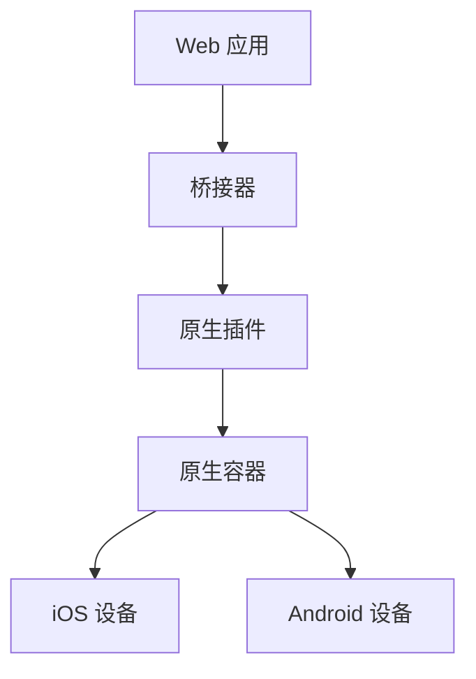

                 

## 1. 背景介绍

随着移动设备的普及和用户对应用程序需求的不断增加，移动应用开发变得越来越重要。在移动应用开发领域，开发者面临着一个重要的选择：是开发原生应用还是混合应用。原生应用是指在特定平台上使用该平台的开发工具和语言编写的应用，而混合应用则是使用 Web 技术如 HTML、CSS 和 JavaScript 开发的，但可以在原生平台上运行。

原生应用通常提供更好的性能和用户体验，因为它们是专门为特定平台优化的。然而，原生应用的开发通常需要更多的时间和资源，并且需要为每个平台分别开发。相比之下，混合应用开发可以大大减少开发时间和成本，因为可以使用一种技术同时开发多个平台的应用。

Cordova 就是一种流行的混合应用开发框架，它允许开发者使用 Web 技术创建可以在多个平台上运行的应用。Cordova 通过将 Web 应用封装成原生应用的方式，使开发者能够利用 Web 技术的优势，同时在原生平台上运行。这种方式不仅提高了开发效率，还确保了应用程序在不同设备上的兼容性和性能。

本文将深入探讨 Cordova 混合应用开发的技术细节，包括其核心概念、开发流程、核心算法原理、项目实践，以及实际应用场景和未来展望。通过本文的阅读，开发者将能够更好地理解 Cordova 混合应用开发的原理和实践，从而为自己的移动应用开发提供有力的支持。

## 2. 核心概念与联系

Cordova 混合应用开发的核心在于如何将 Web 应用与原生平台进行无缝集成。以下是 Cordova 的核心概念及其相互关系：

### 2.1. Web 应用

Web 应用是由 HTML、CSS 和 JavaScript 编写的应用程序，可以在任何支持浏览器的设备上运行。这些应用通常具有高度的跨平台兼容性，因为它们不依赖于特定平台的 API。

### 2.2. 原生应用

原生应用是专门为特定移动平台（如 iOS、Android）开发的，使用平台提供的原生语言（如 Swift、Kotlin）和开发工具。这些应用通常具有更好的性能和用户体验，但需要针对每个平台进行开发和优化。

### 2.3. Cordova 桥接器

Cordova 桥接器是 Cordova 混合应用开发的关键组件。它允许 Web 应用与原生设备功能（如相机、GPS、加速度计）进行交互。桥接器通过原生插件实现，这些插件封装了原生 API，使其能够被 Web 应用调用。

### 2.4. 原生容器

原生容器是指用于封装 Cordova 应用并将其安装到设备上的原生应用程序。Cordova 提供了多种容器，如 iOS 的 Cordova iOS 应用和 Android 的 Cordova Android 应用。

### 2.5. Mermaid 流程图

以下是一个 Mermaid 流程图，展示了 Cordova 混合应用开发的核心组件及其关系：



通过这个流程图，我们可以清晰地看到 Web 应用是如何通过桥接器和原生插件与原生容器和设备进行交互的。

## 3. 核心算法原理 & 具体操作步骤

### 3.1 算法原理概述

Cordova 混合应用开发的核心算法原理在于如何将 Web 应用与原生平台进行集成。这个过程可以分为以下几个步骤：

1. **Web 应用创建**：使用 HTML、CSS 和 JavaScript 创建 Web 应用。
2. **桥接器加载**：通过桥接器加载原生插件，实现 Web 应用与原生设备功能的交互。
3. **原生容器封装**：使用原生容器封装 Web 应用，使其能够在原生平台上运行。
4. **应用部署**：将封装后的应用部署到原生设备上。

### 3.2 算法步骤详解

#### 3.2.1 创建 Web 应用

首先，开发者需要使用 HTML、CSS 和 JavaScript 创建 Web 应用。这个过程类似于常规的 Web 开发，但需要特别注意确保应用的响应式设计，以便在不同设备上具有良好的展示效果。

```html
<!DOCTYPE html>
<html>
<head>
  <meta charset="UTF-8">
  <title>Cordova 应用</title>
</head>
<body>
  <h1>欢迎来到 Cordova 应用</h1>
  <button id="takePicture">拍照</button>
  <script src="cordova.js"></script>
  <script>
    document.getElementById('takePicture').addEventListener('click', function() {
      navigator.camera.getPicture(onSuccess, onFail, {
        quality: 50,
        destinationType: Camera.DestinationType.FILE_URI,
        sourceType: Camera.PictureSourceType.CAMERA
      });
    });

    function onSuccess(imageURI) {
      console.log("照片获取成功：" + imageURI);
    }

    function onFail(message) {
      console.log('照片获取失败：' + message);
    }
  </script>
</body>
</html>
```

#### 3.2.2 加载桥接器

接下来，开发者需要加载 Cordova 桥接器。桥接器通过在 HTML 文件中包含 `cordova.js` 来实现。桥接器会初始化 Cordova 环境，并在设备准备好时调用 `document.addEventListener('deviceready', onDeviceReady, false);` 事件。

```javascript
document.addEventListener('deviceready', onDeviceReady, false);

function onDeviceReady() {
  console.log('设备已准备好');
}
```

#### 3.2.3 封装应用

使用原生容器封装 Web 应用是 Cordova 混合应用开发的下一步。这个过程通常由 Cordova 提供的命令行工具来完成。开发者可以使用以下命令创建 Cordova 项目：

```bash
cordova create myApp
```

这个命令会创建一个包含 `www` 目录（存放 Web 应用文件）、`platforms` 目录（存放原生平台文件）和 `plugins` 目录（存放原生插件）的项目。

#### 3.2.4 部署应用

最后，开发者需要将封装后的应用部署到原生设备上。这个过程也由 Cordova 命令行工具来完成。开发者可以使用以下命令将应用部署到 iOS 设备：

```bash
cordova platform add ios
cordova run ios
```

对于 Android 设备，可以使用以下命令：

```bash
cordova platform add android
cordova run android
```

### 3.3 算法优缺点

#### 优点：

1. **跨平台兼容性**：Cordova 使开发者能够使用一种技术同时开发多个平台的应用，减少了重复劳动。
2. **开发效率**：使用 Web 技术开发应用可以大大提高开发效率，因为开发者不需要学习多个平台的原生语言和开发工具。
3. **维护成本低**：由于使用单一技术栈，Cordova 应用更容易维护和更新。

#### 缺点：

1. **性能限制**：虽然 Cordova 应用可以在原生平台上运行，但性能可能无法与原生应用相媲美。
2. **兼容性问题**：某些功能可能在某些平台上不可用，需要开发者进行额外的适配。
3. **开发难度**：虽然使用 Web 技术开发应用可以提高开发效率，但对于一些复杂的功能，开发者可能需要学习额外的 Cordova 插件和 API。

### 3.4 算法应用领域

Cordova 混合应用开发广泛应用于移动应用开发领域，尤其适用于以下场景：

1. **企业应用**：企业通常需要快速开发跨平台的应用，Cordova 提供了高效的开发流程和跨平台兼容性。
2. **教育应用**：教育应用通常需要展示丰富的内容，Cordova 的响应式设计使其成为开发教育应用的首选。
3. **游戏开发**：虽然 Cordova 主要用于开发常规应用，但一些游戏开发者也选择使用 Cordova 开发轻量级游戏。

## 4. 数学模型和公式 & 详细讲解 & 举例说明

Cordova 混合应用开发涉及到一些基本的数学模型和公式，这些模型和公式在开发过程中扮演着重要的角色。以下将详细讲解这些数学模型和公式的构建、推导过程，并通过案例进行说明。

### 4.1 数学模型构建

在 Cordova 混合应用开发中，以下是一些常见的数学模型和公式：

1. **像素比与分辨率的关系**：像素比（Pixel Ratio）是设备物理像素与 CSS 像素之间的比率。公式为：

   \[
   \text{Pixel Ratio} = \frac{\text{Physical Pixel}}{\text{CSS Pixel}}
   \]

   其中，Physical Pixel 表示设备的物理像素，CSS Pixel 表示 CSS 样式表中的像素。

2. **分辨率转换**：在移动设备上，分辨率可能因设备而异。公式为：

   \[
   \text{Resolution} = \text{Width} \times \text{Height}
   \]

   其中，Width 和 Height 分别表示设备的宽度和高度。

3. **视口尺寸**：视口（Viewport）是用户在浏览器中可以看到的页面区域。公式为：

   \[
   \text{Viewport Size} = \text{Width} \times \text{Height}
   \]

   其中，Width 和 Height 分别表示视口的宽度和高度。

### 4.2 公式推导过程

以像素比与分辨率的关系为例，我们来进行推导：

设设备的物理像素为 P，CSS 像素为 C，则像素比为：

\[
\text{Pixel Ratio} = \frac{P}{C}
\]

假设设备的物理像素为 P1 = 1080，CSS 像素为 C1 = 720，则像素比为：

\[
\text{Pixel Ratio} = \frac{P1}{C1} = \frac{1080}{720} = 1.5
\]

这意味着设备的物理像素是 CSS 像素的 1.5 倍。

### 4.3 案例分析与讲解

以下是一个简单的案例，用于说明像素比和分辨率的关系：

假设一个设备的屏幕分辨率为 1920 x 1080，CSS 像素为 100 x 100。根据像素比公式，可以计算出像素比为：

\[
\text{Pixel Ratio} = \frac{1920}{100} \times \frac{1080}{100} = 19.2
\]

这意味着该设备的物理像素是 CSS 像素的 19.2 倍。在实际开发中，我们需要根据像素比调整布局和样式，以确保在不同设备上获得最佳的用户体验。

### 4.4 代码实例与解释

以下是一个简单的 HTML 文件，用于展示如何根据像素比调整布局：

```html
<!DOCTYPE html>
<html>
<head>
  <meta charset="UTF-8">
  <title>Cordova 应用示例</title>
  <style>
    body {
      width: 100vw;
      height: 100vh;
      background-color: #f1f1f1;
    }

    .container {
      width: 100%;
      height: 100px;
      background-color: #4CAF50;
    }
  </style>
</head>
<body>
  <div class="container"></div>
  <script>
    const pixelRatio = window.devicePixelRatio || 1;
    const width = window.innerWidth * pixelRatio;
    const height = window.innerHeight * pixelRatio;

    console.log('Pixel Ratio:', pixelRatio);
    console.log('Width:', width);
    console.log('Height:', height);
  </script>
</body>
</html>
```

在这个示例中，我们首先通过 `window.devicePixelRatio` 获取像素比。然后，根据像素比调整布局和样式。这将确保在不同设备上获得最佳的显示效果。

## 5. 项目实践：代码实例和详细解释说明

在本文的这一部分，我们将通过一个简单的项目实例来展示如何使用 Cordova 进行混合应用开发。该项目将创建一个基本的应用，包含一个相机功能，允许用户拍照并预览照片。以下是项目实践的详细步骤：

### 5.1 开发环境搭建

首先，确保您已经安装了以下软件和工具：

- Node.js（版本 10.0.0 或更高版本）
- npm（版本 6.0.0 或更高版本）
- Apache Cordova（版本 10.0.0 或更高版本）
- 适当的开发工具，如 Android Studio（用于 Android 开发）或 Xcode（用于 iOS 开发）

1. 安装 Node.js 和 npm：

   ```bash
   curl -sL https://deb.nodesource.com/setup_14.x | bash -
   sudo apt-get install -y nodejs
   ```

2. 安装 Apache Cordova：

   ```bash
   npm install -g cordova
   ```

3. 安装开发工具（可选）：

   - Android 开发：安装 Android Studio 并配置 Android SDK
   - iOS 开发：安装 Xcode

### 5.2 源代码详细实现

1. 创建一个新的 Cordova 项目：

   ```bash
   cordova create myApp
   ```

   这个命令将创建一个名为 `myApp` 的新项目，包含 `www`、`platforms` 和 `plugins` 目录。

2. 在 `www` 目录中创建一个简单的 HTML 文件 `index.html`：

   ```html
   <!DOCTYPE html>
   <html>
   <head>
     <meta charset="UTF-8">
     <title>Camera App</title>
     <link rel="stylesheet" href="css/style.css">
   </head>
   <body>
     <button id="takePicture">拍照</button>
     
     <script src="js/index.js"></script>
   </body>
   </html>
   ```

3. 在 `www` 目录中创建一个 CSS 文件 `style.css`：

   ```css
   body {
     text-align: center;
     margin-top: 100px;
   }

   button {
     padding: 10px 20px;
     font-size: 18px;
     color: #fff;
     background-color: #007bff;
     border: none;
     border-radius: 5px;
     cursor: pointer;
   }

   button:hover {
     background-color: #0056b3;
   }
   ```

4. 在 `www` 目录中创建一个 JavaScript 文件 `index.js`：

   ```javascript
   document.addEventListener('deviceready', onDeviceReady, false);

   function onDeviceReady() {
     console.log('设备已准备好');
     document.getElementById('takePicture').addEventListener('click', takePicture);
   }

   function takePicture() {
     navigator.camera.getPicture(onSuccess, onFail, {
       quality: 50,
       destinationType: Camera.DestinationType.FILE_URI,
       sourceType: Camera.PictureSourceType.CAMERA
     });
   }

   function onSuccess(imageURI) {
     console.log('照片获取成功：' + imageURI);
     document.getElementById('preview').src = imageURI;
   }

   function onFail(message) {
     console.log('照片获取失败：' + message);
   }
   ```

5. 创建一个 Android 平台：

   ```bash
   cordova platform add android
   ```

6. 创建一个 iOS 平台：

   ```bash
   cordova platform add ios
   ```

7. 运行 Android 应用：

   ```bash
   cordova run android
   ```

8. 运行 iOS 应用：

   ```bash
   cordova run ios
   ```

### 5.3 代码解读与分析

以下是代码的详细解读：

- **index.html**：这是应用的入口文件，包含 HTML 结构、CSS 样式和 JavaScript 脚本。它定义了一个按钮用于拍照，一个图片元素用于预览照片。

- **style.css**：这是应用的样式文件，用于设置按钮和图片的样式。按钮设置为圆形，颜色为蓝色，并在鼠标悬停时变暗。

- **index.js**：这是应用的 JavaScript 脚本，它首先监听 `deviceready` 事件，确保设备已准备好。然后，它添加一个点击事件监听器，当按钮被点击时，调用 `takePicture` 函数。

- **takePicture**：这个函数使用 `navigator.camera.getPicture` 方法从相机获取照片。它设置了照片的质量、目标类型（文件 URI）和源类型（相机）。

- **onSuccess**：当照片成功获取时，这个函数将照片的 URI 设置为图片元素的 `src` 属性，使照片在页面上显示。

- **onFail**：当照片获取失败时，这个函数会在控制台输出错误信息。

### 5.4 运行结果展示

1. 在 Android 设备或模拟器上运行应用：

   - 打开 Android 设备或模拟器。
   - 打开应用，点击拍照按钮。
   - 使用相机拍照。
   - 拍照成功后，照片将显示在页面上。

2. 在 iOS 设备或模拟器上运行应用：

   - 打开 iOS 设备或模拟器。
   - 打开应用，点击拍照按钮。
   - 使用相机拍照。
   - 拍照成功后，照片将显示在页面上。

通过这个简单的项目，我们展示了如何使用 Cordova 创建一个基本的应用，并实现了拍照和预览照片的功能。这个过程展示了 Cordova 混合应用开发的基本步骤和核心组件。

## 6. 实际应用场景

Cordova 混合应用开发在实际应用场景中具有广泛的应用。以下是一些典型的应用场景：

### 6.1 企业内部应用

企业内部应用通常需要跨平台兼容性，Cordova 提供了高效、快速的解决方案。例如，一个公司可以开发一个用于管理员工考勤的移动应用，员工可以使用 Android 或 iOS 设备进行打卡，而不需要为每个平台分别开发。

### 6.2 教育应用

教育应用通常需要展示丰富的内容和交互功能，Cordova 的响应式设计和跨平台兼容性使其成为开发教育应用的不二选择。例如，一个在线学习平台可以使用 Cordova 开发一个移动应用，学生可以随时随地访问课程内容和进行学习。

### 6.3 游戏开发

虽然游戏开发者通常更倾向于使用 Unity 或 Unreal Engine 等游戏引擎，但 Cordova 也可以用于开发轻量级游戏。例如，一个公司可以开发一个简单的小游戏，并在 Android 和 iOS 设备上运行，而不需要为每个平台编写独立的代码。

### 6.4 IoT 应用

物联网（IoT）应用通常需要连接多种设备和传感器，Cordova 可以帮助开发者快速构建跨平台的 IoT 应用。例如，一个智能家居应用可以使用 Cordova 连接各种智能设备，如智能灯泡、智能插座等，并提供一个统一的用户界面。

### 6.5 移动医疗应用

移动医疗应用需要提供可靠的医疗信息和高效的用户体验，Cordova 的跨平台兼容性和快速开发特性使其成为开发移动医疗应用的理想选择。例如，一个移动医疗应用可以提供在线问诊、预约挂号、健康咨询等功能，并确保在 Android 和 iOS 设备上都能良好运行。

通过以上实际应用场景的介绍，我们可以看到 Cordova 混合应用开发在各个领域的广泛应用。无论是企业内部应用、教育应用、游戏开发、IoT 应用还是移动医疗应用，Cordova 都提供了高效、便捷的解决方案。

## 7. 工具和资源推荐

### 7.1 学习资源推荐

1. **Cordova 官方文档**：[https://cordova.apache.org/docs/en/latest/](https://cordova.apache.org/docs/en/latest/)
   Apache Cordova 的官方文档是学习 Cordova 的最佳资源，包含了全面的指南和教程。

2. **Cordova 教程**：[https://www.tutorialspoint.com/cordova/](https://www.tutorialspoint.com/cordova/)
   这是一个涵盖 Cordova 基础知识和高级特性的教程网站，适合不同水平的开发者。

3. **Cordova 插件列表**：[https://cordova.apache.org/plugins/](https://cordova.apache.org/plugins/)
   Apache Cordova 插件列表是一个包含大量第三方插件的目录，可以方便开发者查找和集成所需的插件。

### 7.2 开发工具推荐

1. **Android Studio**：[https://developer.android.com/studio](https://developer.android.com/studio)
   Android Studio 是 Google 开发的官方 Android 开发工具，提供了强大的代码编辑器、调试器和性能分析工具。

2. **Xcode**：[https://developer.apple.com/xcode/](https://developer.apple.com/xcode/)
   Xcode 是 Apple 提供的官方 iOS 开发工具，提供了丰富的开发框架和工具，包括模拟器、调试器和性能分析工具。

3. **Visual Studio Code**：[https://code.visualstudio.com/](https://code.visualstudio.com/)
   Visual Studio Code 是一款跨平台的开源代码编辑器，支持多种编程语言和插件，非常适合 Cordova 开发。

### 7.3 相关论文推荐

1. **"Cordova: Cross-Platform Mobile Application Development Made Easy"**：这是一篇介绍 Cordova 的论文，详细阐述了 Cordova 的原理、优势和开发流程。
   - 作者：Apache Software Foundation
   - 出版年份：2015

2. **"Mobile First: Designing for a Multi-Device World"**：这篇论文探讨了移动应用设计的关键原则，强调了跨平台兼容性的重要性。
   - 作者：Luke Wroblewski
   - 出版年份：2011

3. **"Hybrid Mobile Application Development: A Comparative Study"**：这是一篇比较原生应用和混合应用开发的研究论文，分析了两种开发模式在性能、开发和维护成本等方面的差异。
   - 作者：Chandrakant S. Achar
   - 出版年份：2016

通过上述工具和资源的推荐，开发者可以更好地学习和掌握 Cordova 混合应用开发的技能，为实际项目提供有力的支持。

## 8. 总结：未来发展趋势与挑战

Cordova 混合应用开发在过去几年中取得了显著的进展，但同时也面临着一些挑战和机遇。以下是对未来发展趋势的总结以及面临的挑战：

### 8.1 研究成果总结

1. **跨平台兼容性**：Cordova 的核心优势在于其跨平台兼容性，使得开发者能够使用单一技术栈开发适用于多种移动设备的应用。这一优势在开发企业应用和教育应用等方面得到了广泛应用。

2. **开发效率**：Cordova 通过提供快速开发流程和减少重复劳动，提高了开发效率。这对于快速迭代和发布应用尤为重要。

3. **社区支持**：Cordova 拥有庞大的开发者社区，提供了丰富的插件和资源，为开发者提供了强大的支持。

### 8.2 未来发展趋势

1. **性能提升**：随着硬件性能的不断提升，Cordova 应用的性能也在逐渐改善。未来，Cordova 可能会引入更多的原生渲染技术和优化策略，以提升应用的流畅性和响应速度。

2. **Web 技术整合**：Cordova 可能会与 Web 技术更加紧密地集成，如采用 WebAssembly（WASM）来提高应用的运行效率。

3. **更多插件支持**：Cordova 的插件生态系统将继续扩展，为开发者提供更多与原生设备功能交互的接口。

4. **PWA 支持**：随着渐进式Web应用（PWA）的兴起，Cordova 可能会加入对 PWA 的支持，使应用能够在无网络连接时仍能提供良好的用户体验。

### 8.3 面临的挑战

1. **性能瓶颈**：虽然 Cordova 应用的性能在逐渐提升，但与原生应用相比，仍存在性能瓶颈。未来需要进一步优化 Web 技术在移动设备上的运行效率。

2. **开发者培训**：Cordova 的学习曲线相对较陡，需要开发者具备一定的 Web 开发基础。这增加了开发者的培训成本和时间。

3. **安全性**：随着应用的复杂性和功能不断增加，Cordova 应用面临的安全挑战也在增加。开发者需要加强对安全性的关注，以防止潜在的安全漏洞。

### 8.4 研究展望

1. **性能优化**：未来的研究可以集中在性能优化方面，如采用汇编代码、并行计算和机器学习等技术来提高 Cordova 应用的性能。

2. **自动化测试**：开发自动化测试工具，以确保 Cordova 应用在不同设备和平台上的兼容性和稳定性。

3. **标准化**：推动 Cordova 的标准化，使其能够更好地与其他 Web 技术和框架集成，为开发者提供更加一致和便捷的开发体验。

通过不断的研究和优化，Cordova 混合应用开发有望在未来继续发展，为开发者提供更强大的跨平台解决方案。

## 9. 附录：常见问题与解答

### 9.1 问题 1：Cordova 与原生应用有什么区别？

**解答**：Cordova 是一种混合应用开发框架，它允许开发者使用 Web 技术如 HTML、CSS 和 JavaScript 开发应用，但可以在原生平台上运行。原生应用是专门为特定平台使用原生开发工具和语言编写的应用。Cordova 的主要区别在于开发效率和跨平台兼容性。Cordova 可以减少开发时间和成本，但性能可能不如原生应用。

### 9.2 问题 2：如何为 Cordova 应用添加原生功能？

**解答**：为 Cordova 应用添加原生功能，通常需要使用 Cordova 插件。插件是封装了原生 API 的模块，可以通过 npm 或 cordova platform add 命令安装。安装插件后，在应用的 JavaScript 文件中引入插件，并使用其提供的 API 调用原生功能。例如，使用 `cordova-plugin-camera` 插件可以访问设备的相机功能。

### 9.3 问题 3：Cordova 应用如何部署到移动设备？

**解答**：部署 Cordova 应用到移动设备分为几个步骤：

1. **创建项目**：使用 Cordova 命令创建项目，并添加所需的平台（如 Android 或 iOS）。

2. **安装插件**：根据应用需求，安装所需的 Cordova 插件。

3. **配置平台**：配置已添加的平台，如设置 Android 的 SDK 和 iOS 的证书。

4. **编译应用**：使用 Cordova run 命令编译并安装应用到设备。

例如，要部署到 Android 设备，可以使用以下命令：

```bash
cordova platform add android
cordova run android
```

对于 iOS 设备，可以使用：

```bash
cordova platform add ios
cordova run ios
```

### 9.4 问题 4：Cordova 应用的性能如何优化？

**解答**：以下是一些优化 Cordova 应用性能的方法：

1. **减少 HTTP 请求**：尽量将所有资源（如 JavaScript 文件、图片等）合并，减少 HTTP 请求次数。

2. **使用缓存**：合理使用浏览器缓存，减少重复请求。

3. **使用 WebAssembly**：对于计算密集型的任务，可以考虑使用 WebAssembly 提高性能。

4. **优化 CSS 和 JavaScript**：压缩和合并 CSS 和 JavaScript 文件，减少文件体积。

5. **优化图片**：使用合适的图片格式（如 WebP）和压缩图片，减少图片大小。

6. **减少动画和过渡效果**：过多的动画和过渡效果会降低应用的性能。

通过这些方法，可以显著提高 Cordova 应用的性能和用户体验。

以上是关于 Cordova 混合应用开发的一些常见问题和解答，希望对开发者有所帮助。在开发过程中，遇到问题可以参考这些解答，或者查阅官方文档和社区资源。

