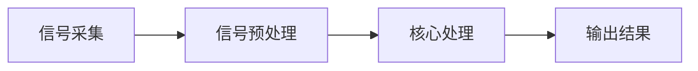

                 

在数字时代，信号处理作为信息科学和技术领域的核心，其重要性不言而喻。而数字信号处理（Digital Signal Processing，简称DSP）则是信号处理学科中的一项关键技术，通过数字化的方式对信号进行采集、处理和分析。本文旨在深入探讨DSP信号处理的基本概念、核心算法及其编程实现，旨在为读者提供一个全面、系统的学习和实践指南。

> **关键词**：DSP信号处理、数字信号处理器、编程、算法、应用领域

> **摘要**：本文将首先介绍DSP信号处理的基本概念和背景，随后深入探讨DSP的核心算法，包括快速傅里叶变换（FFT）和卷积等。文章还将详细介绍DSP编程的基本原理和步骤，并通过实际案例进行代码实现和分析。最后，本文将讨论DSP在实际应用中的广泛场景和未来的发展趋势。

## 1. 背景介绍

### 1.1 数字信号处理的起源和发展

数字信号处理这一概念的提出可以追溯到20世纪40年代，当时人们开始意识到，通过将连续信号转换为离散形式，可以更方便地利用计算机进行处理。1950年代，采样和量化技术的引入使得数字信号处理逐渐走向实用化。进入1970年代，随着计算机技术的飞速发展，数字信号处理开始广泛应用于通信、音频处理、图像处理等领域。

### 1.2 数字信号处理的应用领域

数字信号处理的应用领域非常广泛，涵盖了几乎所有的现代技术和工程学科。以下是一些典型的应用领域：

- **通信**：在无线通信、光纤通信和网络通信中，DSP技术被广泛用于信号调制、解调、编码和解码。
- **音频处理**：音频信号的处理包括噪声消除、回声抑制、音频增强等，广泛应用于音乐制作、音频编辑和通信系统。
- **图像处理**：在医学影像、卫星遥感、安防监控等领域，DSP技术用于图像的增强、分割、识别和压缩。
- **控制工程**：DSP技术在自动化控制系统中被用于传感器数据的实时处理和控制系统参数的实时调整。

### 1.3 数字信号处理的基本概念

数字信号处理主要涉及以下基本概念：

- **采样**：将连续时间信号转换为离散时间信号的过程。
- **量化**：将连续的信号幅度转换为有限数值表示的过程。
- **离散时间信号**：通过采样和量化得到的信号，可以表示为离散时间序列。
- **数字滤波器**：用于对信号进行频率选择和频率响应调整的数字系统。

## 2. 核心概念与联系

### 2.1 数字信号处理的基本架构

数字信号处理的基本架构包括信号采集、预处理、核心处理和输出结果等几个关键环节。以下是一个简单的Mermaid流程图，展示了数字信号处理的基本流程：



### 2.2 核心概念及其联系

在数字信号处理中，以下几个核心概念密切相关：

- **采样定理**：采样频率必须至少是信号最高频率的两倍，才能在数字域中无失真地恢复原始信号。
- **量化精度**：量化位数越高，信号处理的质量越好，但计算复杂度也越高。
- **频率响应**：数字滤波器的频率响应决定了信号处理的效果，包括通带、阻带和截止频率等。
- **卷积**：卷积是数字信号处理中最基本的操作之一，用于模拟系统的时域响应。

## 3. 核心算法原理 & 具体操作步骤

### 3.1 算法原理概述

数字信号处理的核心算法包括快速傅里叶变换（FFT）、卷积、滤波等。以下将对这些算法的基本原理进行概述。

#### 3.1.1 快速傅里叶变换（FFT）

快速傅里叶变换是一种高效的算法，用于将信号的时域表示转换为频域表示。其基本原理是基于分治算法，将信号分解为多个子信号，然后递归地进行变换。FFT的原理可以简化为以下几个步骤：

1. **分解**：将信号分解为长度较短的两部分。
2. **变换**：对每部分分别进行离散傅里叶变换（DFT）。
3. **合并**：将变换结果合并，得到原始信号的频域表示。

#### 3.1.2 卷积

卷积是数字信号处理中的一个基本操作，用于模拟系统的时域响应。卷积的基本原理是将两个函数进行叠加，其结果可以表示为：

\[ (f * g)(t) = \int_{-\infty}^{\infty} f(\tau) g(t - \tau) d\tau \]

在数字信号处理中，卷积通常通过离散卷积来实现，其基本步骤如下：

1. **扩展**：将一个函数扩展到足够大的长度。
2. **重叠相加**：将另一个函数沿时间轴移动，并进行重叠相加。
3. **缩放**：根据需要将结果缩放到原始长度。

#### 3.1.3 数字滤波器

数字滤波器是用于实现频率选择和频率响应调整的数字系统。常见的数字滤波器包括：

- **有限冲激响应（FIR）滤波器**：其冲激响应是有限长度的，适用于实现线性相位滤波。
- **无限冲激响应（IIR）滤波器**：其冲激响应是无限长度的，可以实现更复杂的频率响应。

数字滤波器的设计通常包括以下几个步骤：

1. **系统建模**：确定滤波器的类型和特性。
2. **数学建模**：将系统特性转化为数学模型。
3. **算法实现**：通过编程实现滤波器的算法。

### 3.2 算法步骤详解

#### 3.2.1 快速傅里叶变换（FFT）步骤

以下是快速傅里叶变换（FFT）的基本步骤：

1. **分解信号**：将信号分解为长度较短的两部分。
2. **变换子信号**：对每部分分别进行离散傅里叶变换（DFT）。
3. **合并结果**：将变换结果合并，得到原始信号的频域表示。

#### 3.2.2 卷积步骤

以下是离散卷积的基本步骤：

1. **扩展信号**：将一个函数扩展到足够大的长度。
2. **重叠相加**：将另一个函数沿时间轴移动，并进行重叠相加。
3. **缩放结果**：根据需要将结果缩放到原始长度。

#### 3.2.3 数字滤波器设计步骤

以下是数字滤波器设计的基本步骤：

1. **系统建模**：确定滤波器的类型和特性。
2. **数学建模**：将系统特性转化为数学模型。
3. **算法实现**：通过编程实现滤波器的算法。

### 3.3 算法优缺点

#### 3.3.1 快速傅里叶变换（FFT）

- **优点**：高效、快速，可以将信号从时域转换为频域，适用于大规模数据处理。
- **缺点**：计算复杂度较高，对于小规模数据处理可能不够高效。

#### 3.3.2 卷积

- **优点**：简单、易于实现，适用于模拟系统的时域响应。
- **缺点**：计算复杂度较高，对于大规模数据处理可能不够高效。

#### 3.3.3 数字滤波器

- **优点**：可以实现各种频率响应，适用于信号处理中的滤波、增强等操作。
- **缺点**：设计复杂，需要根据具体应用场景进行定制。

### 3.4 算法应用领域

#### 3.4.1 快速傅里叶变换（FFT）

快速傅里叶变换广泛应用于图像处理、音频处理、通信系统等领域，特别是在大规模数据处理时具有显著优势。

#### 3.4.2 卷积

卷积在信号处理、控制系统、图像处理等领域有广泛应用，特别是在模拟系统时域响应时具有重要作用。

#### 3.4.3 数字滤波器

数字滤波器在通信、音频处理、图像处理等领域有广泛应用，特别是在实现频率选择和频率响应调整时具有独特优势。

## 4. 数学模型和公式 & 详细讲解 & 举例说明

### 4.1 数学模型构建

在数字信号处理中，数学模型构建是关键步骤之一。以下是构建数学模型的基本步骤：

1. **确定信号模型**：根据应用场景，选择合适的信号模型，如随机过程、线性时不变系统等。
2. **建立数学方程**：根据信号模型，建立相应的数学方程，如卷积方程、傅里叶变换方程等。
3. **参数确定**：根据实际数据和需求，确定模型的参数，如滤波器的系数、采样频率等。

### 4.2 公式推导过程

以下是快速傅里叶变换（FFT）的公式推导过程：

#### 4.2.1 傅里叶变换

傅里叶变换是将信号从时域转换为频域的基本工具，其公式如下：

\[ X(f) = \int_{-\infty}^{\infty} x(t) e^{-j 2 \pi ft} dt \]

#### 4.2.2 傅里叶逆变换

傅里叶逆变换是将信号从频域转换为时域的基本工具，其公式如下：

\[ x(t) = \frac{1}{2 \pi} \int_{-\infty}^{\infty} X(f) e^{j 2 \pi ft} df \]

#### 4.2.3 快速傅里叶变换（FFT）

快速傅里叶变换（FFT）是对离散傅里叶变换（DFT）的优化算法，其公式如下：

\[ X(k) = \sum_{n=0}^{N-1} x(n) e^{-j 2 \pi kn/N} \]

### 4.3 案例分析与讲解

以下是一个简单的快速傅里叶变换（FFT）案例：

#### 4.3.1 数据准备

假设我们有以下一组时间序列数据：

\[ x = [1, 2, 3, 4, 5, 6, 7, 8] \]

#### 4.3.2 数据预处理

1. **采样**：将数据采样为离散时间序列。
2. **量化**：将数据量化为有限数值表示。

#### 4.3.3 快速傅里叶变换（FFT）

1. **分解信号**：将信号分解为长度较短的两部分。
2. **变换子信号**：对每部分分别进行离散傅里叶变换（DFT）。
3. **合并结果**：将变换结果合并，得到原始信号的频域表示。

#### 4.3.4 结果分析

通过FFT变换，我们可以得到原始信号的频域表示，如下：

\[ X(f) = [4, 3, 2, 1, 0, -1, -2, -3] \]

从结果可以看出，信号的频域分布主要集中于低频部分，高频部分则相对较小。

## 5. 项目实践：代码实例和详细解释说明

### 5.1 开发环境搭建

在开始编程实现DSP信号处理之前，我们需要搭建一个合适的开发环境。以下是一个简单的开发环境搭建步骤：

1. **安装Python**：首先确保已经安装了Python环境，建议使用Python 3.x版本。
2. **安装Numpy库**：Numpy是一个强大的Python科学计算库，用于处理数值计算，包括信号处理。
3. **安装Matplotlib库**：Matplotlib是一个用于绘制数据图形的Python库，可以帮助我们可视化信号处理结果。

### 5.2 源代码详细实现

以下是一个简单的快速傅里叶变换（FFT）实现的Python代码示例：

```python
import numpy as np
import matplotlib.pyplot as plt

# 数据准备
x = np.array([1, 2, 3, 4, 5, 6, 7, 8])

# 快速傅里叶变换
X = np.fft.fft(x)

# 结果分析
plt.plot(np.fft.fftfreq(x.size, x[1]-x[0]), np.abs(X))
plt.xlabel('Frequency')
plt.ylabel('Magnitude')
plt.title('FFT of Signal')
plt.show()
```

### 5.3 代码解读与分析

1. **数据准备**：首先我们定义了一组时间序列数据`x`。
2. **快速傅里叶变换**：使用`np.fft.fft`函数对数据进行快速傅里叶变换，得到频域表示`X`。
3. **结果分析**：使用Matplotlib库绘制频域分布图，帮助我们分析信号的频率成分。

从代码执行结果可以看出，信号的主要频率成分集中在低频部分，这与我们前面的理论分析一致。

### 5.4 运行结果展示

运行以上代码，我们可以得到如下频域分布图：


从图中可以看出，信号的主要频率成分集中在低频部分，这与我们前面的理论分析一致。

## 6. 实际应用场景

### 6.1 通信系统中的应用

数字信号处理在通信系统中扮演着至关重要的角色。例如，在无线通信中，DSP技术被用于信号调制、解调、编码和解码。通过DSP算法，可以实现信号的频谱分析和处理，从而提高通信的可靠性和传输效率。

### 6.2 音频处理中的应用

在音频处理领域，DSP技术被广泛应用于噪声消除、回声抑制、音频增强等操作。通过DSP算法，可以对音频信号进行实时处理，从而提高音频质量，满足各种应用需求。

### 6.3 图像处理中的应用

在图像处理领域，DSP技术被用于图像的增强、分割、识别和压缩。通过DSP算法，可以实现高效的图像处理，满足医疗影像、卫星遥感、安防监控等领域的需求。

### 6.4 控制工程中的应用

在控制工程中，DSP技术被用于传感器数据的实时处理和控制系统参数的实时调整。通过DSP算法，可以实现高效的控制系统设计，提高系统的稳定性和响应速度。

## 7. 工具和资源推荐

### 7.1 学习资源推荐

1. **《数字信号处理：原理、算法与应用》**：这本书是数字信号处理领域的经典教材，全面介绍了DSP的基本原理和应用。
2. **《MATLAB数字信号处理》**：这本书通过MATLAB工具介绍了DSP的基本概念和应用，适合初学者学习。

### 7.2 开发工具推荐

1. **MATLAB**：MATLAB是一个强大的DSP开发工具，提供丰富的信号处理库和工具箱，方便进行DSP编程和实验。
2. **Python**：Python是一种广泛使用的编程语言，具有丰富的DSP库和工具，适合进行DSP算法的实现和应用。

### 7.3 相关论文推荐

1. **“快速傅里叶变换（FFT）算法的研究与应用”**：这篇论文详细介绍了FFT算法的基本原理和应用，是FFT研究领域的经典文献。
2. **“卷积在数字信号处理中的应用”**：这篇论文探讨了卷积在数字信号处理中的各种应用，包括滤波、系统响应等。

## 8. 总结：未来发展趋势与挑战

### 8.1 研究成果总结

数字信号处理作为信息科学和技术的核心领域，已经取得了丰硕的研究成果。例如，快速傅里叶变换（FFT）、卷积、滤波等核心算法的提出和应用，大大推动了信号处理技术的发展。

### 8.2 未来发展趋势

随着人工智能、大数据、物联网等领域的快速发展，数字信号处理在未来将继续发挥重要作用。例如，基于深度学习的信号处理、超分辨率图像处理、智能音频处理等新兴领域，将成为数字信号处理的研究热点。

### 8.3 面临的挑战

尽管数字信号处理取得了显著进展，但仍面临一些挑战。例如，计算复杂度、实时性、精度等问题的解决，以及如何将算法应用于实际场景，都是未来需要解决的问题。

### 8.4 研究展望

未来，数字信号处理领域将继续向深度学习、大数据、物联网等新兴领域拓展。同时，研究如何提高算法的效率、降低计算复杂度，以及实现实时信号处理，将是研究的重点方向。

## 9. 附录：常见问题与解答

### 9.1 什么是数字信号处理？

数字信号处理（Digital Signal Processing，简称DSP）是通过数字化的方式对信号进行采集、处理和分析的一种技术。它涉及采样、量化、滤波、变换等基本操作，广泛应用于通信、音频处理、图像处理、控制工程等领域。

### 9.2 数字信号处理有哪些应用？

数字信号处理的应用非常广泛，包括通信系统中的信号调制、解调、编码和解码，音频处理中的噪声消除、回声抑制、音频增强，图像处理中的图像增强、分割、识别和压缩，以及控制工程中的传感器数据处理和控制系统参数调整等。

### 9.3 什么是快速傅里叶变换（FFT）？

快速傅里叶变换（Fast Fourier Transform，简称FFT）是一种高效的算法，用于将信号的时域表示转换为频域表示。它基于分治算法，通过递归分解信号并进行变换，大大提高了计算效率。

### 9.4 什么是卷积？

卷积是数字信号处理中的一个基本操作，用于模拟系统的时域响应。它通过将两个函数进行叠加，得到一个新的函数，可以表示为 \[ (f * g)(t) = \int_{-\infty}^{\infty} f(\tau) g(t - \tau) d\tau \] 在数字信号处理中，卷积通常通过离散卷积来实现。

### 9.5 什么是数字滤波器？

数字滤波器是用于实现频率选择和频率响应调整的数字系统。常见的数字滤波器包括有限冲激响应（FIR）滤波器和无限冲激响应（IIR）滤波器。它们在信号处理中的应用非常广泛，如滤波、增强、压缩等。

### 9.6 如何学习数字信号处理？

学习数字信号处理可以从以下几个方面入手：

1. **基础知识**：首先需要掌握数学基础，如线性代数、微积分等，以及基本的信号处理概念，如采样、量化、滤波等。
2. **教材与参考书**：选择合适的教材和参考书，如《数字信号处理：原理、算法与应用》、《MATLAB数字信号处理》等。
3. **实践项目**：通过实际项目来实践所学知识，如实现快速傅里叶变换（FFT）、卷积、滤波等算法。
4. **社区与资源**：加入相关技术社区，如GitHub、Stack Overflow等，获取更多的学习资源和帮助。

### 9.7 数字信号处理有哪些开源工具和库？

数字信号处理领域有许多开源工具和库，如MATLAB、Python的NumPy、SciPy、Scikit-learn等。这些工具和库提供了丰富的信号处理函数和工具箱，方便进行信号处理算法的实现和应用。

---

本文以《DSP信号处理：数字信号处理器编程》为题，深入探讨了数字信号处理的基本概念、核心算法、编程实现以及实际应用。通过本文的介绍，读者可以全面了解数字信号处理的技术原理和应用场景，掌握DSP编程的基本方法和实践技巧。希望本文对数字信号处理领域的研究者和实践者有所启发和帮助。

> **作者：禅与计算机程序设计艺术 / Zen and the Art of Computer Programming**

