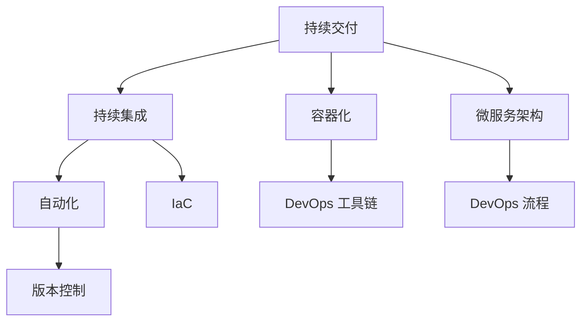

                 

# DevOps 实践指南更新：持续交付和部署的最新技术

> 关键词：DevOps, 持续交付, 持续集成, 容器化, 微服务, 基础设施即代码, 自动化, 版本控制

## 1. 背景介绍

在当今快速变化的数字化时代，软件开发的速度和质量已成为企业竞争力的重要因素。DevOps实践旨在加速软件交付周期，提升软件交付的质量和效率，并实现持续交付和持续集成。DevOps不仅仅是一种技术实践，更是一种文化和思维方式的变革。

### 1.1 问题由来

传统的软件开发和运维流程，往往面临着沟通不畅、协作低效、迭代周期长、交付速度慢等问题。而DevOps通过打破开发和运维的壁垒，实现跨职能团队的紧密协作，推动了开发流程的自动化和优化，从而显著提升了软件的交付速度和稳定性。

### 1.2 问题核心关键点

DevOps的关键在于自动化和持续反馈。自动化流程可以显著减少人工操作，提升效率和质量。持续反馈则能够实时监控和调整流程，确保交付的准确性和可靠性。DevOps的成功离不开工具链、流程、文化等多个方面的协同支撑。

### 1.3 问题研究意义

在数字化转型的今天，DevOps已经成为推动企业数字化创新和快速响应市场变化的重要手段。企业通过实施DevOps实践，可以大幅缩短产品上市时间，降低运营成本，提升用户体验和满意度。因此，掌握和实践DevOps技术已成为企业和开发者必备的能力。

## 2. 核心概念与联系

### 2.1 核心概念概述

为了更好地理解DevOps实践，本节将介绍几个关键概念及其相互关系：

- **持续交付(Continuous Delivery, CD)**：在DevOps中，持续交付指的是通过自动化流程，快速、安全地将软件产品交付给用户。持续交付不仅包括自动构建和部署，还涵盖了代码审查、质量检测、安全扫描、用户反馈等多个环节。

- **持续集成(Continuous Integration, CI)**：持续集成是一种开发实践，通过自动化集成和测试流程，快速检测代码变更的影响。持续集成能够尽早发现问题，提升代码质量和协作效率。

- **容器化(Containerization)**：容器化是通过将应用程序及其依赖打包到一个独立运行环境中，以实现跨平台部署和资源隔离。容器化简化了软件部署和维护过程，提升了系统的灵活性和可移植性。

- **微服务架构(Microservices Architecture)**：微服务架构是将大型应用拆分成一组小型、独立的服务单元，每个服务独立运行、单独部署，并通过API进行通信。微服务架构提升了系统的可扩展性、可维护性和创新速度。

- **基础设施即代码(Infrastructure as Code, IaC)**：基础设施即代码是一种编程思想，通过编写代码定义和管理基础资源，如服务器、网络、存储等。IaC实现了基础设施的自动化和版本控制，提升了资源管理的效率和一致性。

- **自动化(Automation)**：自动化是通过编程脚本和工具，实现软件开发和运维流程的自动化。自动化减少了人工操作，提高了效率和准确性，是DevOps的核心技术手段。

- **版本控制(Version Control)**：版本控制是一种管理代码变更和历史的管理工具，通过分支、合并、回滚等操作，实现了代码变更的跟踪和追溯。版本控制是DevOps流程的基础。

这些概念之间的联系可以通过以下Mermaid流程图来展示：



这个流程图展示了DevOps中各个核心概念的相互关系：

1. 持续交付和持续集成是DevOps的核心实践。
2. 容器化和微服务架构是提升系统可扩展性和灵活性的关键技术。
3. 自动化和IaC是实现持续交付和持续集成的重要手段。
4. 版本控制是DevOps流程的基础。
5. DevOps工具链和流程紧密配合，支持整个DevOps实践的运转。

## 3. 核心算法原理 & 具体操作步骤
### 3.1 算法原理概述

DevOps实践的算法原理主要围绕自动化和持续反馈两个核心概念展开。其基本思路是通过编写脚本和配置自动化流程，将软件开发和运维环节高度自动化。通过持续集成和持续交付，实现代码变更的快速检测、构建、测试、部署和发布。

形式化地，我们可以将DevOps实践定义为一系列自动化流程的组合，用于实现软件的快速、安全交付。其中，自动化流程包括代码变更管理、自动化构建、测试、发布等环节。持续反馈则通过监控和自动化测试，实时监控流程状态和质量，确保交付的准确性和可靠性。

### 3.2 算法步骤详解

基于DevOps的核心算法原理，以下是一个典型的DevOps实践流程：

**Step 1: 版本控制与代码变更管理**
- 使用版本控制工具（如Git）管理代码变更历史，并设定分支策略。
- 通过合并请求（Pull Request）进行代码审查，确保代码变更的质量和一致性。

**Step 2: 持续集成**
- 设置持续集成工具（如Jenkins、Travis CI等），自动检测代码变更。
- 通过自动化构建工具（如Maven、Gradle等）编译和构建代码。
- 运行单元测试、集成测试、静态分析等，确保代码质量和安全性。

**Step 3: 持续交付**
- 使用容器化技术（如Docker）将应用程序和依赖打包成容器。
- 通过容器编排工具（如Kubernetes、Docker Compose等）实现容器部署和管理。
- 在生产环境中部署和监控，确保交付的稳定性和可靠性。

**Step 4: 持续反馈**
- 集成监控工具（如Prometheus、Grafana等）实时监控系统状态和性能。
- 通过日志分析和异常检测工具（如ELK Stack、Splunk等）收集和分析日志数据。
- 通过自动化测试和用户反馈，及时发现和修复问题，提升交付质量。

### 3.3 算法优缺点

DevOps实践具有以下优点：
1. 提升交付速度和质量。通过自动化流程，实现了快速、可靠的软件交付。
2. 增强团队协作。DevOps打破了开发和运维的壁垒，促进了跨职能团队的协作和沟通。
3. 提高资源利用率。自动化流程减少了人工操作，提升了系统效率和稳定性。
4. 改善用户体验。通过持续反馈和自动化测试，确保软件质量和服务可靠性。

同时，该方法也存在一些局限性：
1. 依赖自动化工具。DevOps的实现需要依赖多种自动化工具，工具链复杂度较高。
2. 技术门槛较高。实现DevOps需要一定的技术积累和实践经验。
3. 初始成本较高。自动化工具和流程的部署和维护需要一定的时间和资源投入。
4. 文化和变革难度。DevOps不仅仅是技术实践，更是一种文化和思维方式的变革，需要组织内部的广泛支持和变革。

尽管存在这些局限性，但就目前而言，DevOps已成为软件开发和运维的标准实践，被广泛应用于各种规模和类型的企业中。

### 3.4 算法应用领域

DevOps实践广泛应用于软件开发、运维、测试等多个领域，具体包括：

- 软件开发：通过持续集成和持续交付，实现快速、可靠的软件开发和交付。
- 运维管理：通过自动化流程和持续监控，实现系统的高效管理和维护。
- 安全测试：通过自动化测试和监控，及时发现和修复安全漏洞，提升系统安全性。
- 质量保障：通过自动化测试和代码审查，确保软件质量和可靠性。
- 云服务：通过IaC和容器化技术，实现云资源的自动化管理和部署。
- 移动应用开发：通过DevOps流程，实现移动应用的快速迭代和优化。

此外，DevOps实践在金融、医疗、制造等多个行业中也得到了广泛应用，推动了这些行业的信息化进程和创新能力。

## 4. 数学模型和公式 & 详细讲解 & 举例说明
### 4.1 数学模型构建

DevOps实践的数学模型主要涉及自动化流程的优化和持续反馈的机制设计。以下是一个简化的DevOps数学模型：

**模型目标**：最大化软件交付的速度和质量，最小化交付的时间和成本。

**输入变量**：代码变更频率、自动化构建和测试效率、容器部署和维护成本、系统监控和异常检测效果。

**输出变量**：软件交付周期、交付质量、用户满意度、运营成本。

### 4.2 公式推导过程

为了实现DevOps的目标，我们通过构建如下优化模型：

$$
\maximize \sum_{i=1}^n ( delivering\_speed_i \times delivering\_quality_i ) - \text{operational\_cost_i} 
$$

其中，$delivering\_speed_i$和$delivering\_quality_i$分别表示第$i$次交付的速度和质量，$\text{operational\_cost_i}$表示第$i$次交付的运营成本。

通过求解上述优化模型，可以得出最优的交付策略，实现最大化交付速度和质量的同时，最小化运营成本。

### 4.3 案例分析与讲解

假设我们有一个软件开发团队，开发周期为每月一次。每次交付需要进行自动化构建和测试，耗时1天，测试通过后部署到生产环境，耗时2天。部署后需要持续监控和维护，耗时1周。

在传统方式下，开发团队每次交付都需要手动进行构建、测试和部署，且无法实时监控系统状态。这种情况下，每次交付需要3周的时间，且交付质量难以保障。

通过引入DevOps实践，我们采用持续集成和持续交付流程。每次代码变更后，自动化工具会立即启动构建和测试流程，并在测试通过后自动部署到生产环境。通过持续监控工具实时监控系统状态，一旦发现异常，立即进行修复。这种情况下，每次交付仅需1天，且交付质量和系统稳定性显著提升。

## 5. 项目实践：代码实例和详细解释说明
### 5.1 开发环境搭建

在进行DevOps实践前，我们需要准备好开发环境。以下是使用Jenkins进行持续集成的环境配置流程：

1. 安装Jenkins：从官网下载并安装Jenkins。
2. 安装Jenkins插件：根据需要安装各种插件，如Git插件、Maven插件、Junit插件等。
3. 配置Jenkins：在Jenkins界面进行用户、项目、构建等配置。

### 5.2 源代码详细实现

以下是一个使用Jenkins进行持续集成的示例代码实现。

**pom.xml**：

```xml
<project xmlns="http://maven.apache.org/POM/4.0.0" xmlns:xsi="http://www.w3.org/2001/XMLSchema-instance"
         xsi:schemaLocation="http://maven.apache.org/POM/4.0.0 http://maven.apache.org/xsd/maven-4.0.0.xsd">
    <modelVersion>4.0.0</modelVersion>
    <groupId>com.example</groupId>
    <artifactId>myapp</artifactId>
    <version>1.0</version>
    <properties>
        <java.version>1.8</java.version>
    </properties>
    <dependencies>
        <dependency>
            <groupId>org.springframework.boot</groupId>
            <artifactId>spring-boot-starter</artifactId>
        </dependency>
    </dependencies>
</project>
```

**src/main/java/MyApplication.java**：

```java
import org.springframework.boot.SpringApplication;
import org.springframework.boot.autoconfigure.SpringBootApplication;

@SpringBootApplication
public class MyApplication {
    public static void main(String[] args) {
        SpringApplication.run(MyApplication.class, args);
    }
}
```

**src/main/webapp/index.html**：

```html
<!DOCTYPE html>
<html lang="en">
<head>
    <meta charset="UTF-8">
    <title>My Application</title>
</head>
<body>
    <h1>Hello, World!</h1>
</body>
</html>
```

### 5.3 代码解读与分析

**pom.xml**：
- 定义了项目的依赖关系，使用Spring Boot框架进行开发。

**MyApplication.java**：
- 使用Spring Boot的@EnableAutoConfiguration注解自动配置Spring应用，启动Spring Boot应用。

**index.html**：
- 定义了一个简单的HTML页面，用于测试Spring Boot应用的运行效果。

### 5.4 运行结果展示

执行以下命令启动Jenkins构建：

```bash
java -jar target/myapp.jar
```

在Jenkins控制台查看构建日志，确认构建成功。访问http://localhost:8080/hello-world，验证应用程序的运行效果。

## 6. 实际应用场景
### 6.1 软件开发公司

软件开发公司通过实施DevOps实践，可以实现快速、高效的软件交付。公司可以利用持续集成和持续交付流程，确保每次代码变更的自动化构建和测试。通过容器化技术，快速部署到生产环境，实现快速迭代和持续交付。

### 6.2 银行金融系统

银行金融系统需要高效、可靠的软件交付。通过引入DevOps实践，银行可以实现持续集成和持续交付，快速响应市场需求和变化。同时，通过持续监控和自动化测试，确保系统的稳定性和安全性。

### 6.3 政府服务机构

政府服务机构需要高效、透明的软件交付。通过DevOps实践，政府服务机构可以实现快速构建和部署应用，提升公共服务的效率和质量。同时，通过持续监控和自动化测试，确保公共服务的稳定性和可靠性。

### 6.4 未来应用展望

随着DevOps实践的不断演进，未来将呈现以下几个发展趋势：

1. **云原生应用**：云原生应用通过容器化和微服务架构，实现了应用的自动化部署和扩展。DevOps实践将进一步与云原生应用深度融合，实现更高效、灵活的应用交付。
2. **人工智能与DevOps结合**：通过引入机器学习和自动化测试技术，DevOps实践将进一步提升软件交付的质量和效率。
3. **DevSecOps**：DevSecOps是将安全融入DevOps实践，通过自动化安全检测和漏洞修复，提升系统的安全性和可靠性。
4. **无服务器架构**：无服务器架构通过云平台的服务化接口，实现了应用的自动部署和扩展。DevOps实践将进一步与无服务器架构结合，实现更高效、轻量级的应用交付。
5. **持续反馈和监控**：通过引入实时监控和异常检测技术，DevOps实践将进一步提升交付的质量和效率，确保系统的稳定性和可靠性。

## 7. 工具和资源推荐
### 7.1 学习资源推荐

为了帮助开发者系统掌握DevOps实践，这里推荐一些优质的学习资源：

1. **《DevOps实践指南》书籍**：详细介绍DevOps实践的基本概念、核心技术和实战案例，适合初学者和实践者阅读。
2. **《Jenkins用户手册》文档**：详细介绍了Jenkins的安装、配置和插件使用，是使用Jenkins进行持续集成的好帮手。
3. **Kubernetes官方文档**：Kubernetes作为容器编排工具，是DevOps实践中的重要组件。官方文档详细介绍了Kubernetes的安装、配置和操作，是学习DevOps实践的重要资源。
4. **GitHub Learning Lab**：GitHub Learning Lab提供了丰富的Git和GitHub实战课程，适合初学者和实践者快速上手DevOps实践。
5. **Docker官方文档**：Docker作为容器化技术，是DevOps实践中的重要工具。官方文档详细介绍了Docker的安装、配置和使用，是学习DevOps实践的重要资源。

### 7.2 开发工具推荐

以下是几款用于DevOps实践开发的常用工具：

1. **Jenkins**：开源的持续集成和持续部署工具，支持丰富的插件和配置选项，适用于各种规模的开发项目。
2. **Git**：全球最流行的版本控制工具，支持分支、合并、回滚等操作，是DevOps实践的基础工具。
3. **Maven/Gradle**：常用的自动化构建工具，支持构建、测试、发布等环节，适用于Java项目。
4. **Docker**：轻量级的容器化技术，支持跨平台部署和管理，适用于任何开发语言的项目。
5. **Kubernetes**：开源的容器编排工具，支持自动化部署、扩展和管理，适用于大规模分布式系统。
6. **Prometheus/Grafana**：开源的监控和可视化工具，支持实时监控和数据分析，适用于任何规模的系统。

合理利用这些工具，可以显著提升DevOps实践的开发效率，加速创新迭代的步伐。

### 7.3 相关论文推荐

DevOps实践的不断发展源于学界的持续研究。以下是几篇奠基性的相关论文，推荐阅读：

1. **《DevOps与敏捷开发：一种新型的软件工程方法》**：介绍了DevOps与敏捷开发的结合，探讨了DevOps在敏捷开发中的作用和优势。
2. **《DevOps的测量和评估方法》**：讨论了DevOps实践的测量和评估方法，为DevOps的实施提供了数据支持。
3. **《云原生应用与DevOps的融合》**：探讨了云原生应用与DevOps的深度融合，提出了基于DevOps的云原生应用实践。
4. **《DevSecOps的实现和应用》**：讨论了DevSecOps的实现和应用，探讨了如何在DevOps中融入安全检测和漏洞修复。
5. **《DevOps的持续改进与优化》**：探讨了DevOps实践的持续改进与优化方法，为DevOps的持续改进提供了指导。

这些论文代表了大规模DevOps实践的发展脉络，通过学习这些前沿成果，可以帮助研究者把握学科前进方向，激发更多的创新灵感。

## 8. 总结：未来发展趋势与挑战
### 8.1 研究成果总结

DevOps实践已经成为软件开发和运维的标准实践，被广泛应用于各种规模和类型的企业中。通过实施DevOps实践，企业可以显著提升软件开发和运维的效率和质量，实现快速交付和持续创新。

### 8.2 未来发展趋势

展望未来，DevOps实践将呈现以下几个发展趋势：

1. **云原生应用**：云原生应用通过容器化和微服务架构，实现了应用的自动化部署和扩展。DevOps实践将进一步与云原生应用深度融合，实现更高效、灵活的应用交付。
2. **人工智能与DevOps结合**：通过引入机器学习和自动化测试技术，DevOps实践将进一步提升软件交付的质量和效率。
3. **DevSecOps**：DevSecOps是将安全融入DevOps实践，通过自动化安全检测和漏洞修复，提升系统的安全性和可靠性。
4. **无服务器架构**：无服务器架构通过云平台的服务化接口，实现了应用的自动部署和扩展。DevOps实践将进一步与无服务器架构结合，实现更高效、轻量级的应用交付。
5. **持续反馈和监控**：通过引入实时监控和异常检测技术，DevOps实践将进一步提升交付的质量和效率，确保系统的稳定性和可靠性。

### 8.3 面临的挑战

尽管DevOps实践已经取得了显著成效，但在迈向更加智能化、普适化应用的过程中，它仍面临诸多挑战：

1. **技术门槛**：DevOps实践需要依赖多种自动化工具和流程，技术门槛较高，需要一定的技术积累和实践经验。
2. **文化和变革难度**：DevOps不仅仅是技术实践，更是一种文化和思维方式的变革，需要组织内部的广泛支持和变革。
3. **工具链复杂性**：DevOps的实现需要依赖多种自动化工具和插件，工具链复杂度较高，需要系统化的管理和维护。
4. **成本和资源投入**：DevOps实践的实施需要一定的时间和资源投入，初期成本较高。

### 8.4 研究展望

未来，DevOps实践需要在以下几个方面进行深入探索：

1. **更高效的工具链**：开发更高效、易用的自动化工具，降低技术门槛和工具链复杂性。
2. **更智能的自动化**：引入机器学习和自动化技术，提升自动化流程的智能化水平，减少人工操作。
3. **更灵活的配置**：实现更灵活、可定制的自动化流程配置，适应不同规模和类型的项目。
4. **更全面的安全**：将安全融入DevOps实践，实现自动化安全检测和漏洞修复，提升系统安全性。
5. **更广泛的应用**：将DevOps实践推广到更多领域，如工业互联网、智慧城市等，推动各行各业的数字化转型。

通过不断创新和突破，DevOps实践必将在未来实现更广泛的应用和更深远的变革，推动软件开发和运维的不断进步。

## 9. 附录：常见问题与解答

**Q1：什么是DevOps？**

A: DevOps是一种跨职能团队协作的软件交付模式，通过自动化流程、持续反馈和持续监控，实现快速、可靠的软件交付。

**Q2：DevOps的优缺点是什么？**

A: DevOps的优点包括提升交付速度和质量、增强团队协作、提高资源利用率、改善用户体验。缺点包括依赖自动化工具、技术门槛较高、初始成本较高、文化和变革难度较大。

**Q3：如何实施DevOps实践？**

A: 实施DevOps实践需要遵循以下步骤：
1. 选择工具和平台，如Jenkins、Git、Maven/Gradle、Docker、Kubernetes等。
2. 配置自动化流程，包括代码变更管理、自动化构建、测试、部署等。
3. 实施持续反馈和监控，通过日志分析、异常检测等手段，实时监控系统状态和性能。
4. 持续优化和改进，不断迭代和优化自动化流程，提升交付速度和质量。

**Q4：DevOps与敏捷开发有何区别？**

A: DevOps与敏捷开发都是软件交付实践，但DevOps更强调跨职能团队的协作和自动化流程的实施，而敏捷开发则更注重快速迭代和用户反馈。DevOps将敏捷开发的快速交付与持续集成、持续交付相结合，实现了更高效的软件交付模式。

**Q5：如何评估DevOps实践的效果？**

A: 评估DevOps实践的效果需要从以下几个方面进行：
1. 交付速度：通过统计交付周期和交付频率，评估交付速度。
2. 交付质量：通过自动化测试和代码审查，评估交付质量。
3. 系统稳定性：通过持续监控和异常检测，评估系统稳定性。
4. 用户体验：通过用户反馈和满意度调查，评估用户体验。

通过综合评估DevOps实践的效果，可以发现问题和改进空间，进一步优化交付流程。

---

作者：禅与计算机程序设计艺术 / Zen and the Art of Computer Programming

