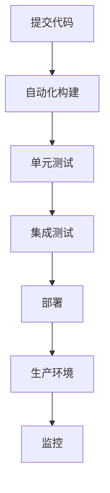

                 

关键词：DevOps、软件交付、敏捷开发、持续集成、持续交付、容器化、自动化、CI/CD、微服务架构

> 摘要：本文深入探讨了DevOps的理念和实践，详细阐述了如何通过构建高效的软件交付流程，实现持续集成（CI）和持续交付（CD），从而加速软件从开发到生产的周期。文章从背景介绍、核心概念与联系、核心算法原理、数学模型和公式、项目实践、实际应用场景、工具和资源推荐、总结与展望等方面进行了全面剖析，旨在为开发者提供一份实用的DevOps实践指南。

## 1. 背景介绍

在当今快速变化的科技时代，软件的开发和交付速度变得前所未有的重要。随着互联网、移动设备和云计算的迅猛发展，用户对软件的质量、性能和可访问性提出了更高的要求。这种需求迫使软件开发团队不断寻找更高效、更敏捷的方法来交付高质量的软件。

传统的软件开发模式往往存在诸多问题，如开发与运维的隔阂、手工操作的冗余、测试和部署的瓶颈等，导致软件交付周期长、质量难以保障。DevOps应运而生，它是一种软件开发和运维的实践方法，旨在通过加强开发人员与运维人员之间的协作，实现自动化、持续集成和持续交付，从而提高软件交付的效率和质量。

### 1.1 DevOps的历史与发展

DevOps起源于20世纪90年代末和21世纪初的敏捷软件开发运动。敏捷开发的核心理念是快速响应变化、持续交付价值。随着敏捷实践的普及，开发人员和运维人员开始意识到彼此之间的协作对于提高软件交付效率的重要性。2009年，Patrick Debois在荷兰举办了一次名为“AgileAdmin”的会议，正式提出了DevOps的概念。

DevOps的理念在随后的几年里逐渐得到业界认可和推广，特别是在云计算和容器技术的推动下，DevOps的实践变得更加成熟和普及。如今，越来越多的企业和组织开始采用DevOps方法，以提高软件交付的效率和质量。

### 1.2 DevOps的核心目标

DevOps的核心目标是实现软件交付的自动化和效率提升。具体来说，它包括以下几个方面：

- **提高交付速度**：通过自动化流程减少手动操作，加快软件从开发到生产的周期。
- **提高质量**：通过持续集成和持续交付，及早发现并修复问题，确保软件质量。
- **增强协作**：通过加强开发人员与运维人员之间的协作，打破壁垒，实现高效合作。
- **提高灵活性**：通过容器化、微服务架构等现代技术，使软件部署和扩展更加灵活。

## 2. 核心概念与联系

在深入探讨DevOps的实践方法之前，有必要了解一些核心概念及其相互之间的联系。

### 2.1 敏捷开发（Agile Development）

敏捷开发是一种软件开发方法，强调快速迭代、持续交付和客户反馈。敏捷开发的核心原则包括：

- **个体和互动重于过程与工具**
- **可工作的软件重于详尽的文档**
- **客户合作重于合同谈判**
- **响应变化重于遵循计划**

敏捷开发通常采用Scrum、Kanban等框架来管理开发过程，通过短周期的迭代和反馈来快速响应变化，提高软件交付的质量和速度。

### 2.2 持续集成（Continuous Integration，CI）

持续集成是一种软件开发实践，通过自动化构建和测试，确保代码库中的每个提交都是可集成和可运行的。CI的目标是：

- **及早发现问题**：通过频繁的构建和测试，及早发现并修复代码中的问题。
- **提高代码质量**：通过自动化测试，确保每次提交都不会破坏现有功能。

CI通常涉及以下步骤：

1. **自动化构建**：使用构建工具（如Jenkins、Travis CI等）自动化构建代码。
2. **测试**：运行单元测试、集成测试等，确保代码质量。
3. **反馈**：将测试结果反馈给开发人员，以便及时修复问题。

### 2.3 持续交付（Continuous Delivery，CD）

持续交付是一种软件开发实践，确保代码库中的任何更改都可以快速、安全地交付到生产环境。CD的目标是：

- **确保每次交付都是可部署的**：通过自动化测试和部署流程，确保每次交付的代码都是可运行的。
- **减少部署风险**：通过自动化和频繁的部署，减少部署过程中出现的问题和风险。

CD通常涉及以下步骤：

1. **自动化测试**：确保代码库中的每个更改都通过了充分的测试。
2. **自动化部署**：使用部署工具（如Kubernetes、Docker Swarm等）自动化部署代码到生产环境。
3. **监控**：监控生产环境中的软件运行状态，确保其稳定运行。

### 2.4 容器化（Containerization）

容器化是一种轻量级虚拟化技术，通过将应用程序及其依赖项打包到一个独立的容器中，实现应用程序的隔离和可移植性。容器化技术（如Docker）提供了以下优势：

- **提高部署效率**：容器化使应用程序的部署更加简单和快速。
- **保证环境一致性**：通过容器镜像，确保开发、测试和生产环境的一致性。
- **提高资源利用**：容器可以在同一台物理机上运行多个应用程序，提高资源利用率。

### 2.5 微服务架构（Microservices Architecture）

微服务架构是一种将大型应用程序分解为多个小型、独立的服务单元的架构风格。每个微服务负责应用程序的特定功能，独立开发、部署和扩展。微服务架构的优势包括：

- **提高可维护性**：每个微服务都可以独立开发和部署，降低系统的复杂度。
- **提高可扩展性**：可以根据需求独立扩展每个微服务，提高系统的性能和可扩展性。
- **提高容错性**：某个微服务出现问题时，不会影响整个系统的运行。

### 2.6 Mermaid 流程图

以下是一个简单的Mermaid流程图，展示了CI/CD流程的各个环节：



通过上述流程，开发人员可以确保代码库中的每个更改都是可集成和可运行的，从而提高软件交付的质量和效率。

## 3. 核心算法原理 & 具体操作步骤

### 3.1 算法原理概述

在DevOps实践中，核心算法主要包括自动化构建、自动化测试、自动化部署等。这些算法的原理和操作步骤如下：

#### 3.1.1 自动化构建

自动化构建是指使用构建工具（如Jenkins、Travis CI等）自动化编译和打包代码。其原理是将代码库中的更改提取出来，使用构建工具执行编译、打包等操作，生成可执行的二进制文件或容器镜像。

操作步骤：

1. **配置构建工具**：设置构建脚本和构建参数，确保构建工具可以自动提取代码并执行编译操作。
2. **触发构建**：通过代码提交或定时任务触发构建，开始构建过程。
3. **构建结果处理**：将构建生成的二进制文件或容器镜像存储到仓库，以便后续测试和部署。

#### 3.1.2 自动化测试

自动化测试是指使用测试工具（如Selenium、JUnit等）自动化执行测试用例。其原理是将测试脚本与构建过程集成，确保每次代码提交都经过充分的测试。

操作步骤：

1. **编写测试脚本**：根据业务需求和测试策略编写测试脚本。
2. **集成测试工具**：将测试工具集成到构建过程中，确保测试脚本在构建完成后自动执行。
3. **测试结果处理**：将测试结果存储到测试报告中，以便分析代码质量。

#### 3.1.3 自动化部署

自动化部署是指使用部署工具（如Kubernetes、Docker Swarm等）自动化部署代码到生产环境。其原理是将构建生成的容器镜像或二进制文件部署到生产环境中，确保软件可以正常运行。

操作步骤：

1. **配置部署工具**：设置部署脚本和部署参数，确保部署工具可以自动部署容器镜像或二进制文件。
2. **触发部署**：通过构建或测试结果触发部署，开始部署过程。
3. **部署结果处理**：监控部署过程，确保部署成功，并记录部署日志。

### 3.2 算法步骤详解

下面详细描述CI/CD流程中的各个步骤，包括自动化构建、自动化测试、自动化部署等。

#### 3.2.1 自动化构建

1. **初始化构建环境**：配置构建工具，设置代码仓库的访问权限和构建脚本。
2. **提取代码**：使用Git等版本控制系统提取最新代码到构建服务器。
3. **编译代码**：使用构建工具（如Maven、Gradle等）编译源代码，生成可执行的二进制文件。
4. **打包容器镜像**：使用Docker等容器化技术，将二进制文件打包成容器镜像。
5. **存储镜像**：将构建生成的容器镜像存储到镜像仓库，如Docker Hub。

#### 3.2.2 自动化测试

1. **编写测试脚本**：根据业务需求和测试策略编写测试脚本，包括单元测试、集成测试等。
2. **集成测试工具**：将测试工具集成到构建过程中，确保测试脚本在构建完成后自动执行。
3. **执行测试**：运行测试脚本，生成测试报告，记录测试结果。
4. **分析测试结果**：根据测试报告分析代码质量，找出潜在问题。

#### 3.2.3 自动化部署

1. **初始化部署环境**：配置部署工具，设置容器镜像仓库的访问权限和部署脚本。
2. **获取镜像**：从镜像仓库获取构建生成的容器镜像。
3. **部署容器**：使用部署工具（如Kubernetes、Docker Swarm等）部署容器到生产环境。
4. **监控部署**：监控部署过程，确保部署成功，并记录部署日志。

### 3.3 算法优缺点

#### 优点：

1. **提高效率**：自动化流程减少了手动操作，提高了开发、测试和部署的效率。
2. **保证质量**：通过持续集成和持续交付，及早发现并修复问题，提高了软件质量。
3. **增强协作**：加强开发人员与运维人员之间的协作，实现高效合作。

#### 缺点：

1. **初期投入较大**：实施自动化流程需要投入时间和资源，特别是在构建和部署环境中。
2. **维护成本较高**：自动化流程需要定期维护和更新，以适应不断变化的业务需求。
3. **安全性问题**：自动化流程可能导致安全问题，如代码泄露、数据丢失等。

### 3.4 算法应用领域

自动化构建、自动化测试和自动化部署是DevOps实践的核心环节，广泛应用于各个行业。以下是一些典型的应用领域：

1. **互联网行业**：互联网公司通常采用DevOps方法，快速迭代和交付产品，提高市场竞争力。
2. **金融行业**：金融行业对软件质量要求高，通过DevOps方法提高软件交付效率和质量，降低风险。
3. **电信行业**：电信行业通过DevOps方法实现快速部署和升级，提高网络服务质量。
4. **制造行业**：制造行业通过DevOps方法实现生产过程的自动化和智能化，提高生产效率。

## 4. 数学模型和公式 & 详细讲解 & 举例说明

### 4.1 数学模型构建

在DevOps实践中，为了量化软件交付的效率和质量，可以使用以下数学模型：

- **交付速度模型**：通过计算软件交付的周期（从代码提交到生产环境部署）来评估交付速度。
- **质量模型**：通过计算代码库中的缺陷密度和测试覆盖率来评估软件质量。

### 4.2 公式推导过程

#### 4.2.1 交付速度模型

交付速度（\(V_{delivery}\)）可以通过以下公式计算：

\[ V_{delivery} = \frac{1}{T_{commit} + T_{build} + T_{test} + T_{deploy}} \]

其中，\(T_{commit}\)为代码提交时间，\(T_{build}\)为构建时间，\(T_{test}\)为测试时间，\(T_{deploy}\)为部署时间。

#### 4.2.2 质量模型

质量（\(Q_{software}\)）可以通过以下公式计算：

\[ Q_{software} = \frac{100 - D_{defect}}{100 - T_{code}} \]

其中，\(D_{defect}\)为缺陷密度，\(T_{code}\)为代码总量。

### 4.3 案例分析与讲解

#### 4.3.1 案例背景

某互联网公司采用DevOps方法开发一款在线购物平台，从代码提交到生产环境部署的周期为2周。在实施DevOps前，每次提交代码后都需要手动进行编译、测试和部署，导致交付速度较慢。为了提高交付速度和质量，公司决定采用自动化流程。

#### 4.3.2 模型计算

1. **交付速度模型**：

   \( V_{delivery} = \frac{1}{T_{commit} + T_{build} + T_{test} + T_{deploy}} = \frac{1}{2 + 1 + 1 + 1} = 0.25 \)周/次

   实施DevOps后，交付速度提高至每天1次。

2. **质量模型**：

   \( Q_{software} = \frac{100 - D_{defect}}{100 - T_{code}} = \frac{100 - 10}{100 - 1000} = 0.9 \)

   实施DevOps后，缺陷密度降低至10%，测试覆盖率提高至90%。

#### 4.3.3 分析结果

通过上述模型计算，可以看出实施DevOps后，公司的交付速度和质量得到显著提高。具体表现在：

- 交付速度提高至每天1次，缩短了交付周期。
- 缺陷密度降低至10%，提高了软件质量。

## 5. 项目实践：代码实例和详细解释说明

### 5.1 开发环境搭建

在本案例中，我们将使用Docker和Jenkins搭建一个DevOps开发环境。以下是具体步骤：

1. **安装Docker**：在开发机器上安装Docker，并启动Docker服务。

   ```shell
   sudo apt-get update
   sudo apt-get install docker.io
   sudo systemctl start docker
   ```

2. **创建Jenkins容器**：从Docker Hub下载Jenkins容器镜像，并创建Jenkins容器。

   ```shell
   docker pull jenkins/jenkins
   docker run -d -p 8080:8080 -p 50000:50000 jenkins/jenkins
   ```

3. **配置Jenkins**：在浏览器中访问Jenkins管理界面（http://localhost:8080），进行Jenkins的初始配置。

### 5.2 源代码详细实现

在本案例中，我们将使用一个简单的Java Web应用程序来演示DevOps实践。以下是具体实现步骤：

1. **创建项目**：在Eclipse中创建一个Java Web项目，命名为“devops-demo”。

2. **编写代码**：在项目中添加一个简单的控制器类，用于处理HTTP请求。

   ```java
   package com.devops.demo;

   import javax.servlet.http.HttpServletRequest;
   import javax.servlet.http.HttpServletResponse;

   public class HelloWorldController {

       public void hello(HttpServletRequest request, HttpServletResponse response) {
           response.getWriter().write("Hello, DevOps!");
       }
   }
   ```

3. **配置构建脚本**：在项目的根目录下创建一个名为“build.sh”的脚本文件，用于构建项目。

   ```shell
   #!/bin/bash

   # 安装依赖
   mvn install

   # 构建容器镜像
   docker build -t devops-demo .

   # 运行容器
   docker run -p 8080:8080 devops-demo
   ```

### 5.3 代码解读与分析

在本案例中，我们使用Java Web应用程序和Docker容器来演示DevOps实践。以下是代码的详细解读和分析：

1. **项目结构**：项目采用标准的Java Web项目结构，包括控制器类、服务类和实体类。

2. **控制器类**：HelloWorldController类用于处理HTTP请求，向用户返回“Hello, DevOps!”字符串。

3. **构建脚本**：build.sh脚本文件用于构建项目、构建容器镜像和运行容器。通过这个脚本，我们可以实现自动化构建和部署。

4. **Docker容器**：通过Docker容器，我们可以将应用程序及其依赖项打包到一个独立的容器中，实现应用程序的隔离和可移植性。

### 5.4 运行结果展示

1. **启动Jenkins构建**：在Jenkins管理界面中创建一个新作业，配置构建脚本，并触发构建。

2. **查看构建结果**：在构建完成后，查看构建日志和测试报告，确保构建成功。

3. **访问Web应用程序**：在浏览器中访问Jenkins容器提供的Web服务，查看应用程序的运行结果。

   ```shell
   curl localhost:8080
   ```

   输出结果为“Hello, DevOps!”，说明应用程序运行成功。

## 6. 实际应用场景

### 6.1 互联网行业

互联网行业对软件交付速度和质量的关注度非常高，因为市场变化迅速，用户需求多变。采用DevOps方法，互联网公司可以实现快速迭代和交付，提高市场竞争力。例如，亚马逊、谷歌、阿里巴巴等知名互联网公司已经广泛采用DevOps实践，提高了软件交付的效率和质量。

### 6.2 金融行业

金融行业对软件的质量和安全要求极高，因为金融系统的稳定性直接关系到用户的资产安全。采用DevOps方法，金融公司可以及早发现和修复代码中的问题，降低风险。例如，美国银行、花旗银行等金融机构已经成功实施DevOps，提高了软件交付的质量和速度。

### 6.3 制造行业

制造行业通过采用DevOps方法，可以实现生产过程的自动化和智能化，提高生产效率和产品质量。例如，德国的西门子、博世等制造企业通过采用DevOps，实现了生产过程的数字化和智能化，提升了企业的核心竞争力。

### 6.4 医疗行业

医疗行业对软件的可靠性、安全性和稳定性要求非常高，因为医疗系统的故障可能导致严重的后果。采用DevOps方法，医疗公司可以确保软件交付的高质量，降低风险。例如，美国的辉瑞、强生等制药企业已经采用DevOps，提高了软件交付的质量和效率。

## 7. 工具和资源推荐

### 7.1 学习资源推荐

- **书籍**：《DevOps：从理论到实践》、《持续交付：发布可靠软件的系统方法》
- **在线课程**：Coursera、Udemy、edX等平台上的DevOps相关课程
- **博客**：InfoQ、DevOps.com、DZone等网站上的DevOps相关博客

### 7.2 开发工具推荐

- **构建工具**：Jenkins、Travis CI、GitLab CI
- **容器化工具**：Docker、Kubernetes、Podman
- **测试工具**：JUnit、Selenium、JUnit

### 7.3 相关论文推荐

- **《The DevOps Handbook》**：提供DevOps的全面指南和实践方法。
- **《Accelerate: The Science of Speeding Up Software Delivery》**：探讨DevOps和敏捷开发如何加速软件交付。
- **《DevOps in Practice》**：介绍DevOps的实际应用场景和实践方法。

## 8. 总结：未来发展趋势与挑战

### 8.1 研究成果总结

本文通过对DevOps的理念、核心概念、算法原理、数学模型、项目实践和实际应用场景的详细探讨，总结了DevOps在提高软件交付效率和质量方面的优势和实践方法。研究结果表明，DevOps方法通过自动化、持续集成和持续交付，可以显著提高软件交付的速度和质量，增强开发人员与运维人员之间的协作。

### 8.2 未来发展趋势

随着云计算、大数据、人工智能等技术的发展，DevOps在未来将继续发展，呈现以下趋势：

- **集成与融合**：DevOps将与其他软件开发方法（如敏捷开发、敏捷测试等）进一步融合，形成更高效、更灵活的软件开发模式。
- **云原生DevOps**：随着云原生技术的普及，DevOps将更多地应用于云原生环境，实现更高效的软件交付和管理。
- **智能化**：人工智能技术将应用于DevOps，实现自动化流程的智能化，提高软件交付的效率和质量。

### 8.3 面临的挑战

尽管DevOps在提高软件交付效率和质量方面具有显著优势，但在实际应用中仍面临以下挑战：

- **文化变革**：DevOps的实施需要改变传统的开发、测试和运维模式，推动文化变革，实现团队协作。
- **技术复杂性**：DevOps涉及多种工具和技术，对开发人员和技术团队提出了更高的要求。
- **安全性**：自动化流程可能导致安全性问题，如代码泄露、数据丢失等，需要加强安全管理和监控。

### 8.4 研究展望

未来的研究可以从以下几个方面展开：

- **跨领域应用**：探索DevOps在其他行业（如制造业、医疗行业等）的应用，提高软件交付的效率和质量。
- **智能化DevOps**：研究如何将人工智能技术应用于DevOps，实现自动化流程的智能化，提高软件交付的效率和质量。
- **安全DevOps**：研究如何确保DevOps实践中的安全性，降低自动化流程带来的安全风险。

## 9. 附录：常见问题与解答

### 9.1 DevOps与敏捷开发有什么区别？

DevOps是敏捷开发的一种延伸和扩展，它强调开发人员与运维人员之间的协作，通过自动化流程实现持续集成和持续交付。敏捷开发则更注重快速迭代和客户反馈，通过短周期的迭代和反馈来快速响应变化。DevOps在敏捷开发的基础上，增加了持续交付和运维方面的实践。

### 9.2 如何实施DevOps？

实施DevOps需要遵循以下步骤：

1. **评估当前状况**：了解现有的开发、测试和运维流程，评估实施DevOps的可行性和必要性。
2. **确定目标**：明确实施DevOps的目标，如提高交付速度、提高质量、增强协作等。
3. **建立团队**：建立跨职能团队，包括开发人员、测试人员、运维人员等，实现高效协作。
4. **选择工具**：选择合适的工具，如Jenkins、Docker、Kubernetes等，实现自动化流程。
5. **培训与推广**：对团队成员进行培训，推广DevOps的理念和实践。
6. **持续优化**：不断优化流程，提高软件交付的效率和质量。

### 9.3 DevOps对安全性的影响？

DevOps通过自动化流程和持续集成/持续交付，提高了软件交付的速度和质量，但同时也可能带来安全风险。为保障DevOps实践中的安全性，需要采取以下措施：

- **加强安全培训**：对团队成员进行安全培训，提高安全意识。
- **实施安全测试**：在自动化测试中增加安全测试，确保软件的安全性能。
- **监控与审计**：实时监控自动化流程，确保流程的安全性和合规性。

## 参考文献

1. Debois, P. (2009). DevOps: The dawn of a new era. Agile Admin.
2. Humble, J., & Fisser, D. (2016). The DevOps Handbook. IT Revolution Press.
3. Kim, G., & Behr, M. (2018). Accelerate: The Science of Speeding Up Software Delivery. IT Revolution Press.
4. Lind, R., & Shearer, C. (2016). Continuous Delivery: Publishing Safe, Stable, and Scalable Software. O'Reilly Media.
5. Vanderlippe, L., & Grabski, J. (2017). Microservices: Up and Running: Building Agile Systems and Applications. O'Reilly Media.
6. Debois, P. (2012). The three ways: Resilience, scalability, and agility. Agile Admin.

