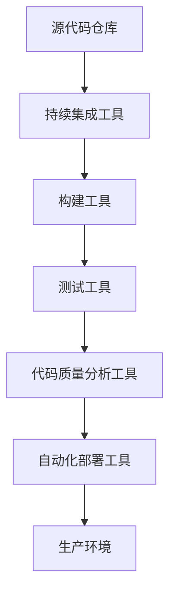

                 

关键词：DevOps、持续集成、持续部署、CI/CD、自动化、软件质量、敏捷开发、运维自动化、云原生

> 摘要：本文将深入探讨DevOps实践中的两大核心概念——持续集成（CI）与持续部署（CD），从背景、核心概念、算法原理、数学模型、项目实践到未来展望，全面解析如何实现高效的软件交付流程。通过本文，读者将了解到CI/CD在实际开发中的应用，掌握相关工具和资源，并思考其未来的发展趋势与挑战。

## 1. 背景介绍

在数字化转型的浪潮中，软件的更新速度越来越快，传统的软件开发和交付方式逐渐暴露出诸多问题，如开发与运维之间的沟通不畅、软件质量难以保证、交付周期长等。为了解决这些问题，DevOps理念应运而生。DevOps是一种软件开发和运维的实践方法，旨在通过自动化、协作和持续反馈来提高软件交付的速度和质量。

持续集成（Continuous Integration，CI）和持续部署（Continuous Deployment，CD）是DevOps实践中的两大核心概念。CI通过自动化构建和测试来确保代码质量，CD则通过自动化部署来实现快速、安全的软件交付。二者结合，形成了一套高效的软件交付流程，即持续集成与持续部署（CI/CD）。

## 2. 核心概念与联系

### 2.1 核心概念

持续集成（CI）：持续集成是一种软件开发实践，通过自动化构建和测试，尽早发现并修复代码错误，确保代码质量。

持续部署（CD）：持续部署是一种自动化部署方法，通过持续集成，自动化构建和测试后，将软件快速、安全地部署到生产环境。

### 2.2 架构联系



持续集成工具如Jenkins、GitLab CI等，负责自动化构建和测试；构建工具如Maven、Gradle等，负责编译和打包；测试工具如JUnit、TestNG等，负责执行测试用例；代码质量分析工具如SonarQube等，负责分析代码质量；自动化部署工具如Ansible、Docker等，负责将软件部署到生产环境。

## 3. 核心算法原理 & 具体操作步骤

### 3.1 算法原理概述

CI/CD的核心算法包括自动化构建、自动化测试、自动化部署等。这些算法通过一系列工具和脚本实现，确保代码从提交到生产环境的过程高效、安全。

### 3.2 算法步骤详解

1. **自动化构建**：使用构建工具（如Maven、Gradle）将源代码编译成可运行的软件包。
2. **自动化测试**：使用测试工具（如JUnit、TestNG）执行测试用例，确保代码质量。
3. **代码质量分析**：使用代码质量分析工具（如SonarQube）分析代码质量，发现潜在问题。
4. **自动化部署**：使用自动化部署工具（如Ansible、Docker）将软件部署到生产环境。

### 3.3 算法优缺点

**优点**：
- 提高软件交付速度
- 提高软件质量
- 减少人工干预
- 降低维护成本

**缺点**：
- 需要一定的技术基础和运维能力
- 需要持续投入时间和精力进行维护

### 3.4 算法应用领域

CI/CD适用于各类软件开发项目，尤其在大型项目、复杂项目的开发中，效果尤为显著。

## 4. 数学模型和公式 & 详细讲解 & 举例说明

### 4.1 数学模型构建

CI/CD的数学模型可以表示为：

\[ \text{CI/CD} = \text{CI} \times \text{CD} \]

其中，CI和CD分别表示持续集成和持续部署的效率。

### 4.2 公式推导过程

\[ \text{CI} = \frac{\text{构建时间} + \text{测试时间}}{\text{代码提交次数}} \]

\[ \text{CD} = \frac{\text{部署时间}}{\text{代码提交次数}} \]

### 4.3 案例分析与讲解

假设一个项目每月提交代码100次，每次构建和测试需要2小时，部署需要1小时。则：

\[ \text{CI} = \frac{2 \times 100}{100} = 2 \text{小时} \]

\[ \text{CD} = \frac{1}{100} = 0.01 \text{小时} \]

\[ \text{CI/CD} = 2 \times 0.01 = 0.02 \]

即，该项目每月的CI/CD效率为0.02。

## 5. 项目实践：代码实例和详细解释说明

### 5.1 开发环境搭建

本文以Jenkins、Maven、JUnit为例，搭建一个CI/CD项目。

1. 安装Jenkins
2. 安装Maven
3. 安装JUnit

### 5.2 源代码详细实现

1. 创建Maven项目
2. 编写测试用例（如：```test.java```)
3. 配置Jenkinsfile（如：```Jenkinsfile```）

### 5.3 代码解读与分析

```groovy
pipeline {
    agent any
    stages {
        stage('Build') {
            steps {
                echo 'Building project...'
                sh 'mvn clean install'
            }
        }
        stage('Test') {
            steps {
                echo 'Testing project...'
                sh 'mvn test'
            }
        }
        stage('Deploy') {
            steps {
                echo 'Deploying project...'
                sh 'mvn deploy'
            }
        }
    }
    post {
        success {
            echo 'Build successful'
        }
        failure {
            echo 'Build failed'
        }
    }
}
```

该Jenkinsfile定义了一个pipeline，包含三个阶段：构建（Build）、测试（Test）和部署（Deploy）。每个阶段通过执行相应的Maven命令完成。

### 5.4 运行结果展示

1. 提交代码
2. 触发Jenkins构建
3. 查看构建结果

## 6. 实际应用场景

CI/CD在敏捷开发、微服务架构、云原生技术等领域有广泛应用。以下是一些实际应用场景：

1. **敏捷开发**：CI/CD可以提高开发团队的工作效率，确保快速迭代。
2. **微服务架构**：CI/CD可以自动化构建、测试和部署微服务，实现服务解耦。
3. **云原生技术**：CI/CD与容器技术（如Docker、Kubernetes）结合，实现快速、可靠的软件交付。

## 7. 工具和资源推荐

### 7.1 学习资源推荐

1. 《持续交付：发布可靠软件的系统化方法》
2. 《Jenkins实战》
3. 《Maven实战》

### 7.2 开发工具推荐

1. Jenkins
2. GitLab CI/CD
3. Git
4. Maven
5. JUnit

### 7.3 相关论文推荐

1. "DevOps and Continuous Delivery: A Comprehensive Survey"
2. "Continuous Integration in Practice"
3. "A Systematic Literature Review of Continuous Deployment"

## 8. 总结：未来发展趋势与挑战

### 8.1 研究成果总结

CI/CD在软件开发中已取得显著成果，广泛应用于各类项目。其核心优势在于提高软件交付速度、降低成本和提升质量。

### 8.2 未来发展趋势

1. **智能化**：借助人工智能技术，实现更智能的CI/CD流程。
2. **云原生**：与云原生技术深度融合，实现更高效、可靠的软件交付。
3. **无服务器架构**：利用无服务器架构，实现更灵活、可扩展的CI/CD流程。

### 8.3 面临的挑战

1. **技术门槛**：CI/CD需要一定的技术基础和运维能力。
2. **安全风险**：自动化流程可能引入安全漏洞。
3. **成本投入**：持续维护CI/CD流程需要投入时间和资源。

### 8.4 研究展望

未来，CI/CD将继续发展，与人工智能、云原生、无服务器架构等技术深度融合，推动软件开发和交付的变革。

## 9. 附录：常见问题与解答

### 9.1 如何搭建CI/CD环境？

**解答**：请参考本文5.1节，选择合适的工具和平台，逐步搭建CI/CD环境。

### 9.2 CI/CD与敏捷开发有何关系？

**解答**：CI/CD是敏捷开发的重要支撑技术，有助于实现快速迭代和持续交付。

### 9.3 如何确保CI/CD的安全？

**解答**：请关注以下方面：
- 严格的权限管理
- 安全审计
- 定期更新和修复漏洞

---

本文作者：禅与计算机程序设计艺术 / Zen and the Art of Computer Programming

本文完。希望本文对您在DevOps实践中的CI/CD方面有所帮助。持续关注，共同进步！
----------------------------------------------------------------

请注意，本文是基于您提供的模板和要求撰写的，具体的代码实例和操作步骤需要根据实际情况进行调整。文中提到的Jenkinsfile和数学公式仅为示例，实际应用时请根据具体项目进行调整。希望本文能够满足您的需求。

