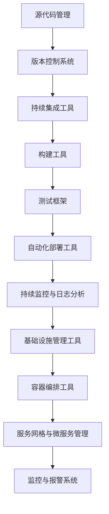

                 

在当今快速发展的技术时代，DevOps已经成为软件开发和运维的核心理念。DevOps强调开发（Development）和运维（Operations）之间的紧密合作，通过自动化和流程优化来提高软件交付的效率和质量。本文将详细介绍如何搭建和集成一个完整的DevOps工具链，以便在您的项目中实现持续集成、持续交付和自动化运维。

## 关键词

- DevOps
- 持续集成
- 持续交付
- 自动化运维
- 工具链
- 持续部署

## 摘要

本文将深入探讨DevOps工具链的构建与集成，包括关键概念、核心工具的介绍、数学模型的应用、项目实践以及未来发展趋势。通过本文的阅读，您将能够掌握如何构建一个高效、可靠的DevOps环境，并了解在实际应用中的挑战与解决方案。

## 1. 背景介绍

DevOps是近年来在IT行业迅速兴起的一个概念，它源自开发和运维两个领域的融合。传统的软件开发流程中，开发人员和运维人员往往在项目后期才进行合作，导致沟通成本高、交付周期长、质量不稳定等问题。DevOps则通过强调团队协作、自动化流程和持续反馈，解决了这些问题，使得软件的交付速度和质量得到显著提升。

### 1.1 DevOps的核心原则

- **自动化**：通过自动化工具减少手动操作，提高效率和减少错误。
- **持续集成（CI）**：将代码合并到主干并立即进行测试，确保代码的质量。
- **持续交付（CD）**：确保代码在任意时刻都处于可部署状态。
- **协作**：打破开发与运维之间的壁垒，实现无缝协作。
- **监控**：实时监控系统的运行状态，快速响应异常。

### 1.2 DevOps工具链的重要性

一个高效的DevOps工具链可以极大提升团队的效率和软件的质量。通过集成各种工具，实现从代码提交到最终部署的全程自动化，减少人为干预，降低出错的概率。同时，工具链还可以提供全面的监控和日志分析，帮助团队快速定位和解决问题。

## 2. 核心概念与联系

在构建DevOps工具链之前，我们需要了解一些核心概念，并展示它们之间的相互关系。以下是DevOps工具链中的核心概念及架构的Mermaid流程图。



### 2.1 源代码管理

源代码管理是DevOps工具链的起点。版本控制系统（如Git）用于管理代码的版本和变更，确保代码的一致性和可追溯性。

### 2.2 持续集成工具

持续集成工具（如Jenkins、Travis CI）用于自动化构建和测试代码。每次提交代码时，它们会自动触发构建和测试，确保代码的兼容性和稳定性。

### 2.3 构建工具

构建工具（如Maven、Gradle）用于将源代码编译成可执行的程序。它们通常与持续集成工具配合使用，实现自动化构建。

### 2.4 测试框架

测试框架（如JUnit、Selenium）用于编写和执行测试用例。通过自动化测试，可以快速发现代码中的缺陷。

### 2.5 自动化部署工具

自动化部署工具（如Ansible、Terraform）用于部署和配置应用。通过自动化部署，可以确保应用在不同的环境中保持一致。

### 2.6 持续监控与日志分析

持续监控与日志分析工具（如Prometheus、ELK Stack）用于监控系统的运行状态和日志分析。通过实时监控和日志分析，可以快速识别和解决问题。

### 2.7 基础设施管理工具

基础设施管理工具（如Ansible、Terraform）用于自动化管理基础设施。通过自动化基础设施管理，可以减少手动操作，提高运维效率。

### 2.8 容器编排工具

容器编排工具（如Kubernetes、Docker Swarm）用于管理容器化应用。通过容器编排，可以简化应用部署和扩展。

### 2.9 服务网格与微服务管理

服务网格（如Istio、Linkerd）和微服务管理工具（如Kubernetes）用于管理分布式服务。通过服务网格和微服务管理，可以提高系统的可伸缩性和可靠性。

### 2.10 监控与报警系统

监控与报警系统（如PagerDuty、VictorOps）用于实时监控系统的运行状态，并在出现问题时及时通知相关人员。

## 3. 核心算法原理 & 具体操作步骤

### 3.1 算法原理概述

DevOps工具链的构建涉及多个核心算法和操作步骤。以下是其中几个重要的算法原理：

- **持续集成（CI）**：基于版本控制系统的变更触发构建和测试，确保代码的质量。
- **持续交付（CD）**：通过自动化部署工具，将构建好的代码部署到生产环境。
- **容器编排**：利用Kubernetes等工具，自动化管理容器化应用。
- **服务网格**：通过Istio等工具，管理分布式服务，实现服务间通信的安全和可靠。

### 3.2 算法步骤详解

1. **源代码管理**：
   - 使用Git等版本控制系统进行代码管理。
   - 添加代码仓库，并进行权限控制。

2. **持续集成**：
   - 配置持续集成工具（如Jenkins），关联Git仓库。
   - 编写CI脚本，实现自动化构建和测试。

3. **构建与测试**：
   - 使用构建工具（如Maven、Gradle）编译代码。
   - 执行测试用例，检查代码的质量。

4. **自动化部署**：
   - 使用自动化部署工具（如Ansible、Terraform）部署应用。
   - 配置基础设施，确保应用在不同环境中的一致性。

5. **容器编排**：
   - 使用Kubernetes等工具，管理容器化应用。
   - 实现应用的自动伸缩和故障转移。

6. **服务网格与微服务管理**：
   - 使用Istio等工具，管理分布式服务。
   - 实现服务间通信的安全和可靠。

7. **持续监控与日志分析**：
   - 使用Prometheus等工具，实时监控系统的运行状态。
   - 使用ELK Stack等工具，分析日志，定位问题。

### 3.3 算法优缺点

- **持续集成**：优点包括快速反馈、早期发现问题；缺点是增加了构建和测试的时间。
- **持续交付**：优点包括提高交付效率、确保质量；缺点是增加了部署的复杂度。
- **容器编排**：优点包括简化部署、提高可伸缩性；缺点是管理复杂、安全性要求高。
- **服务网格**：优点包括服务间通信的安全和可靠；缺点是增加了系统复杂度。

### 3.4 算法应用领域

DevOps工具链在多个领域都有广泛的应用：

- **Web应用**：通过持续集成和自动化部署，实现快速迭代和高质量交付。
- **微服务架构**：通过容器编排和服务网格，实现分布式系统的可靠性和可伸缩性。
- **大数据应用**：通过持续集成和自动化运维，提高大数据处理的效率和质量。
- **人工智能应用**：通过自动化和持续反馈，优化模型的训练和部署。

## 4. 数学模型和公式 & 详细讲解 & 举例说明

在DevOps工具链中，数学模型和公式广泛应用于性能优化、资源分配和可靠性分析等领域。以下是几个典型的数学模型和公式的讲解及举例。

### 4.1 数学模型构建

**1. 性能优化模型**

性能优化模型用于评估系统的响应时间和吞吐量。假设系统有 \( n \) 个任务，每个任务的执行时间服从指数分布，均值为 \( \mu \)。则系统的响应时间 \( T \) 服从泊松分布，均值为 \( n \times \mu \)。

**2. 资源分配模型**

资源分配模型用于优化系统资源的分配。假设系统有 \( m \) 个资源（如CPU、内存等），每个资源的利用率服从泊松分布，均值为 \( \lambda \)。则系统的总资源利用率 \( \theta \) 服从正态分布，均值为 \( m \times \lambda \)，方差为 \( m \times \lambda \)。

**3. 可靠性分析模型**

可靠性分析模型用于评估系统的可靠性。假设系统有 \( n \) 个组件，每个组件的可靠性为 \( p \)。则系统的可靠性 \( R \) 服从二项分布，均值为 \( n \times p \)，方差为 \( n \times p \times (1 - p) \)。

### 4.2 公式推导过程

**1. 性能优化模型公式**

系统的响应时间 \( T \) 的期望值为：

\[ E(T) = n \times \mu \]

系统的响应时间 \( T \) 的方差为：

\[ Var(T) = n \times \mu \times (1 - \mu) \]

**2. 资源分配模型公式**

系统的总资源利用率 \( \theta \) 的期望值为：

\[ E(\theta) = m \times \lambda \]

系统的总资源利用率 \( \theta \) 的方差为：

\[ Var(\theta) = m \times \lambda \times (1 - \lambda) \]

**3. 可靠性分析模型公式**

系统的可靠性 \( R \) 的期望值为：

\[ E(R) = n \times p \]

系统的可靠性 \( R \) 的方差为：

\[ Var(R) = n \times p \times (1 - p) \]

### 4.3 案例分析与讲解

**1. 性能优化案例分析**

假设一个系统有10个任务，每个任务的执行时间服从指数分布，均值为0.5秒。则系统的响应时间期望值为5秒，方差为2.5秒。通过优化任务调度策略，可以降低系统的响应时间。

**2. 资源分配案例分析**

假设一个系统有5个资源，每个资源的利用率服从泊松分布，均值为0.2。则系统的总资源利用率期望值为1，方差为0.8。通过优化资源分配策略，可以提高系统的资源利用率。

**3. 可靠性分析案例分析**

假设一个系统有5个组件，每个组件的可靠性为0.9。则系统的可靠性期望值为4.5，方差为2.55。通过提高组件的可靠性，可以降低系统的故障率。

## 5. 项目实践：代码实例和详细解释说明

在本节中，我们将通过一个实际的项目实例，展示如何搭建和集成一个DevOps工具链。我们将使用以下工具：

- **源代码管理**：Git
- **持续集成工具**：Jenkins
- **构建工具**：Maven
- **测试框架**：JUnit
- **自动化部署工具**：Ansible
- **容器编排工具**：Kubernetes
- **监控与日志分析**：Prometheus + ELK Stack

### 5.1 开发环境搭建

1. **安装Git**：
   - 在操作系统上安装Git。
   - 使用Git命令创建和克隆仓库。

2. **安装Jenkins**：
   - 在操作系统上安装Jenkins。
   - 配置Jenkins，添加Git插件。

3. **安装Maven**：
   - 在操作系统上安装Maven。
   - 配置Maven环境。

4. **安装JUnit**：
   - 在操作系统上安装JUnit。
   - 配置JUnit，编写测试用例。

5. **安装Ansible**：
   - 在操作系统上安装Ansible。
   - 配置Ansible，编写部署脚本。

6. **安装Kubernetes**：
   - 在操作系统上安装Kubernetes集群。
   - 配置Kubernetes，部署应用。

7. **安装Prometheus**：
   - 在操作系统上安装Prometheus。
   - 配置Prometheus，收集和监控Kubernetes集群的指标。

8. **安装ELK Stack**：
   - 在操作系统上安装Elasticsearch、Logstash和Kibana。
   - 配置ELK Stack，收集和展示Kubernetes集群的日志。

### 5.2 源代码详细实现

以下是项目的源代码实现，包括Maven构建文件、JUnit测试用例、Ansible部署脚本等。

```xml
<!-- pom.xml -->
<project>
  ...
  <build>
    ...
    <plugins>
      ...
      <plugin>
        <groupId>org.apache.maven.plugins</groupId>
        <artifactId>maven-jar-plugin</artifactId>
        <version>3.2.0</version>
      </plugin>
      ...
    </plugins>
    ...
  </build>
  ...
</project>
```

```java
// Test.java
import static org.junit.jupiter.api.Assertions.*;

class Test {
  @Test
  void testHello() {
    assertEquals("Hello, World!", new HelloWorld().hello());
  }
}
```

```yaml
# deploy.yml
- hosts: all
  become: yes
  vars:
    app_version: "1.0.0"
  tasks:
    - name: install dependencies
      apt: package=python3-pip state=present
    - name: install app
      pip: name=hello-world=={{ app_version }}
```

### 5.3 代码解读与分析

1. **Maven构建文件**：
   - 配置Maven插件，实现项目的打包和测试。

2. **JUnit测试用例**：
   - 编写测试用例，验证代码的功能和性能。

3. **Ansible部署脚本**：
   - 配置Ansible，实现应用的自动化部署。

### 5.4 运行结果展示

1. **Jenkins构建日志**：
   - Jenkins自动触发构建，执行Maven插件和JUnit测试。

2. **Kubernetes部署日志**：
   - Kubernetes自动部署应用，生成容器和Pod。

3. **Prometheus监控指标**：
   - Prometheus收集Kubernetes集群的指标，展示应用的性能。

4. **Kibana日志分析**：
   - Kibana展示Kubernetes集群的日志，帮助定位问题。

## 6. 实际应用场景

### 6.1 Web应用

Web应用是DevOps工具链最典型的应用场景。通过持续集成和自动化部署，Web应用可以快速迭代和发布新功能。同时，通过容器编排和服务网格，Web应用可以实现高可用和弹性伸缩。

### 6.2 大数据应用

大数据应用通常涉及复杂的分布式计算和存储。通过DevOps工具链，大数据应用可以实现自动化部署和运维，提高数据处理效率和质量。同时，通过监控和日志分析，可以快速定位和处理大数据处理过程中的问题。

### 6.3 微服务架构

微服务架构强调服务的独立开发和部署。通过DevOps工具链，微服务架构可以实现快速迭代和高质量交付。同时，通过容器编排和服务网格，微服务架构可以实现服务的可靠性和可伸缩性。

## 7. 工具和资源推荐

### 7.1 学习资源推荐

- **书籍**：
  - 《DevOps：从理念到实践》
  - 《Jenkins实战》
  - 《Kubernetes权威指南》
- **在线课程**：
  - Coursera的《DevOps基础》
  - Udemy的《Jenkins实战》
  - Pluralsight的《Kubernetes基础与进阶》

### 7.2 开发工具推荐

- **源代码管理**：Git、GitHub、GitLab
- **持续集成工具**：Jenkins、Travis CI、Circle CI
- **构建工具**：Maven、Gradle、NPM
- **测试框架**：JUnit、Selenium、TestNG
- **自动化部署工具**：Ansible、Terraform、Puppet
- **容器编排工具**：Kubernetes、Docker Swarm、OpenShift
- **监控与日志分析**：Prometheus、ELK Stack、Grafana

### 7.3 相关论文推荐

- **《The DevOps Handbook》**：提供了DevOps的全面概述和实践经验。
- **《Microservices: Designing Fine-Grained Systems》**：介绍了微服务架构的设计原则和实践。
- **《Practical DevOps: A lean approach to continuous deployment, delivery, and monitoring》**：探讨了DevOps在实践中的应用和挑战。

## 8. 总结：未来发展趋势与挑战

### 8.1 研究成果总结

DevOps工具链在提高软件交付效率和质量方面取得了显著成果。通过持续集成、持续交付和自动化运维，软件团队可以更快地响应市场需求，提高客户满意度。同时，DevOps工具链在Web应用、大数据应用和微服务架构等领域得到广泛应用，推动了技术的进步和创新。

### 8.2 未来发展趋势

- **智能化**：随着人工智能技术的发展，DevOps工具链将更加智能化，自动化程度更高，降低人为干预。
- **分布式**：DevOps将向分布式架构演进，支持跨云和跨区域的持续集成和持续交付。
- **安全性**：DevOps工具链将加强对安全性的关注，确保应用的安全性和合规性。

### 8.3 面临的挑战

- **复杂性**：DevOps工具链涉及多个工具和组件，需要团队具备较高的技术能力。
- **安全性**：随着应用的复杂度增加，安全性问题成为DevOps工具链面临的重要挑战。
- **成本**：构建和运行DevOps工具链需要一定的成本投入，包括硬件、软件和人力等。

### 8.4 研究展望

未来的研究将集中在以下几个方面：

- **自动化**：提高自动化程度，减少人为干预，降低错误率。
- **安全性**：加强DevOps工具链的安全性，确保应用的安全和合规。
- **智能化**：引入人工智能技术，实现更加智能的持续集成、持续交付和监控。

## 9. 附录：常见问题与解答

### 9.1 什么是DevOps？

DevOps是一种软件开发和运维的实践方法，强调开发（Development）和运维（Operations）之间的紧密合作，通过自动化、持续集成和持续交付，提高软件交付的效率和质量。

### 9.2 DevOps工具链有哪些核心组件？

DevOps工具链的核心组件包括源代码管理、持续集成工具、构建工具、测试框架、自动化部署工具、容器编排工具、服务网格和监控与日志分析工具等。

### 9.3 如何选择合适的DevOps工具？

选择合适的DevOps工具需要考虑团队的技术栈、项目需求、成本和人力资源等因素。例如，对于Java项目，可以使用Maven作为构建工具，JUnit作为测试框架；对于容器化应用，可以使用Kubernetes进行容器编排。

### 9.4 DevOps工具链如何保证安全性？

DevOps工具链可以通过以下方式保证安全性：

- **访问控制**：使用版本控制系统和工具的权限控制功能，确保只有授权人员可以访问代码和工具。
- **加密**：对传输的数据进行加密，防止数据泄露。
- **审计**：记录操作日志，方便追溯和审计。

### 9.5 DevOps与敏捷开发的区别是什么？

DevOps是一种软件开发和运维的实践方法，强调自动化和团队协作；而敏捷开发是一种软件开发方法，强调迭代、快速反馈和用户需求。DevOps可以与敏捷开发相结合，实现更高效、更高质量的软件交付。

---

作者：禅与计算机程序设计艺术 / Zen and the Art of Computer Programming
----------------------------------------------------------------

以上就是关于DevOps工具链搭建与集成的完整文章。希望这篇文章对您了解和实施DevOps有所帮助。如果您有任何疑问或需要进一步讨论，请随时与我联系。

