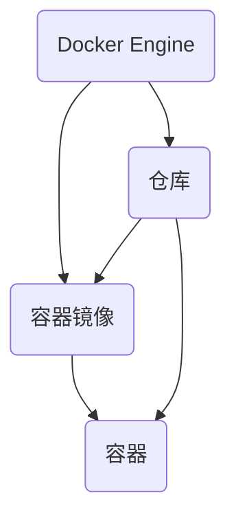

                 

关键词：Docker、容器化、部署、实战、自动化

> 摘要：本文将深入探讨Docker容器化部署的实战，从基本概念到具体操作，再到实际应用场景，为您呈现一个完整的容器化部署过程。通过本文的阅读，您将掌握Docker的核心知识，学会如何高效地进行容器化部署，并能够应对实际开发中的各种挑战。

## 1. 背景介绍

### Docker的起源与发展

Docker是一个开源的应用容器引擎，它允许开发者将应用及其依赖环境打包到一个可移植的容器中，然后发布到任何流行的Linux或Windows操作系统上，也可以实现虚拟化。这种容器化技术为开发者提供了更加灵活、高效的软件开发和部署方式。

Docker最初由Solomon Hykes在2013年推出，自那时以来，Docker技术得到了快速的发展和广泛应用。Docker的社区版本和商业版本（Docker Enterprise）都在不断发展，为企业提供了强大的容器化解决方案。

### 容器化部署的重要性

随着云计算、微服务架构的兴起，容器化部署成为了现代软件开发和运维的标配。容器化部署具有以下优势：

- **快速交付**：通过容器化，开发者可以将应用及其依赖环境打包成一个标准化的容器镜像，大大缩短了应用的交付周期。
- **环境一致性**：容器镜像确保了开发、测试和生产环境的一致性，减少了因环境差异导致的bug。
- **高效资源利用**：容器是轻量级的，多个容器可以在同一台宿主机上并行运行，提高了资源利用效率。
- **灵活部署**：容器可以轻松地在不同操作系统和硬件平台上运行，提高了应用的兼容性和可移植性。

## 2. 核心概念与联系

### Docker的基本概念

- **容器镜像（Image）**：容器镜像是一个静态的文件系统，包含了应用及其依赖环境。它类似于虚拟机的镜像，但更为轻量。
- **容器（Container）**：容器是基于容器镜像创建的动态运行实例。容器可以启动、停止、重启，并与其他容器共享宿主机的资源。
- **Docker Engine**：Docker Engine是一个运行容器引擎，负责管理容器镜像的构建和容器的运行。

### Docker架构图（使用Mermaid绘制）



## 3. 核心算法原理 & 具体操作步骤

### 3.1 算法原理概述

Docker容器化部署的核心算法原理是容器镜像的构建和分发。具体来说，容器镜像的构建过程包括以下步骤：

1. **基础镜像**：选择一个基础镜像作为容器镜像的起点，如Ubuntu、CentOS等。
2. **添加依赖**：在基础镜像上安装应用所需的依赖库和工具。
3. **配置环境**：配置应用的运行环境，如安装应用、设置环境变量等。
4. **构建镜像**：将配置好的环境打包成一个容器镜像。

### 3.2 算法步骤详解

1. **安装Docker**

   在宿主机上安装Docker，可以选择从Docker Hub下载安装包或者使用包管理工具安装。

   ```shell
   # 使用包管理工具安装（以Ubuntu为例）
   sudo apt-get update
   sudo apt-get install docker-ce docker-ce-cli containerd.io
   ```

2. **构建容器镜像**

   使用Dockerfile定义容器镜像的构建过程，例如：

   ```dockerfile
   # 使用官方的Python镜像作为基础镜像
   FROM python:3.8

   # 安装依赖
   RUN pip install Flask

   # 将当前目录下的应用代码复制到容器镜像中
   COPY . /app

   # 暴露应用端口
   EXPOSE 5000

   # 运行应用
   CMD ["python", "app.py"]
   ```

   使用以下命令构建容器镜像：

   ```shell
   docker build -t myapp .
   ```

3. **运行容器**

   使用以下命令运行容器：

   ```shell
   docker run -d -p 8080:5000 myapp
   ```

   这里的`-d`参数表示后台运行，`-p`参数用于将宿主机的端口映射到容器内部的端口。

### 3.3 算法优缺点

**优点**：

- **快速部署**：容器镜像的构建和运行过程非常高效，大大缩短了应用的部署时间。
- **环境一致性**：容器镜像确保了应用在不同环境下的运行一致性。
- **灵活部署**：容器可以轻松地在不同操作系统和硬件平台上运行。

**缺点**：

- **依赖复杂**：容器镜像的构建过程需要依赖多个外部资源和工具，增加了部署的复杂性。
- **安全性问题**：容器与宿主机共享操作系统内核，存在潜在的安全风险。

### 3.4 算法应用领域

Docker容器化部署在以下领域具有广泛的应用：

- **Web应用**：快速部署和扩展Web应用，如使用Flask、Django等框架开发的网站。
- **后台服务**：部署后台服务，如消息队列、缓存服务等。
- **数据库**：部署数据库服务，如MySQL、PostgreSQL等。

## 4. 数学模型和公式 & 详细讲解 & 举例说明

### 4.1 数学模型构建

在容器化部署中，我们可以使用以下数学模型来描述容器资源分配：

$$
C_{total} = C_{CPU} + C_{MEM} + C_{DISK}
$$

其中，$C_{total}$表示容器总资源，$C_{CPU}$表示CPU资源，$C_{MEM}$表示内存资源，$C_{DISK}$表示磁盘资源。

### 4.2 公式推导过程

容器的资源需求可以通过以下步骤进行推导：

1. **确定应用需求**：根据应用的性能需求和资源消耗，确定容器所需的CPU、内存和磁盘资源。
2. **评估宿主机资源**：评估宿主机的总资源，包括CPU、内存和磁盘资源。
3. **资源分配策略**：根据宿主机的资源情况，制定资源分配策略，确保容器能够高效运行。

### 4.3 案例分析与讲解

假设有一个Web应用，需要CPU资源为2核、内存资源为2GB、磁盘资源为20GB。现有的一台宿主机资源为4核CPU、8GB内存、200GB磁盘。我们可以使用以下公式进行资源分配：

$$
C_{total} = 2C_{CPU} + 2C_{MEM} + 20C_{DISK}
$$

$$
C_{total} = 4C_{CPU} + 8C_{MEM} + 200C_{DISK}
$$

通过求解上述方程组，我们可以得到：

$$
C_{CPU} = 1
$$

$$
C_{MEM} = 1
$$

$$
C_{DISK} = 20
$$

因此，容器可以分配1核CPU、1GB内存和20GB磁盘资源。这样，宿主机的资源可以最大化地被利用，同时保证容器的高效运行。

## 5. 项目实践：代码实例和详细解释说明

### 5.1 开发环境搭建

在本项目实践中，我们将使用Python编写一个简单的Web应用，并使用Docker进行容器化部署。

首先，确保宿主机已经安装了Docker。然后，创建一个名为`myapp`的目录，并在此目录下编写Dockerfile和Flask应用的源代码。

### 5.2 源代码详细实现

**Dockerfile**

```dockerfile
# 使用官方的Python镜像作为基础镜像
FROM python:3.8

# 安装依赖
RUN pip install Flask

# 将当前目录下的应用代码复制到容器镜像中
COPY . /app

# 暴露应用端口
EXPOSE 5000

# 运行应用
CMD ["python", "app.py"]
```

**app.py**

```python
from flask import Flask
app = Flask(__name__)

@app.route('/')
def hello():
    return 'Hello, Docker!'

if __name__ == '__main__':
    app.run()
```

### 5.3 代码解读与分析

**Dockerfile解析**

- `FROM python:3.8`：指定基础镜像为Python 3.8版本。
- `RUN pip install Flask`：在基础镜像上安装Flask依赖库。
- `COPY . /app`：将当前目录下的应用代码复制到容器镜像的`/app`目录。
- `EXPOSE 5000`：暴露应用端口5000。
- `CMD ["python", "app.py"]`：运行应用的主程序。

**app.py解析**

- `from flask import Flask`：导入Flask框架。
- `app = Flask(__name__)`：创建Flask应用实例。
- `@app.route('/')`：定义应用的主路由。
- `def hello(): return 'Hello, Docker!'`：返回一个简单的字符串。
- `if __name__ == '__main__': app.run()`：运行应用。

### 5.4 运行结果展示

首先，构建容器镜像：

```shell
docker build -t myapp .
```

然后，运行容器：

```shell
docker run -d -p 8080:5000 myapp
```

在浏览器中访问`http://localhost:8080`，可以看到输出`Hello, Docker!`。

## 6. 实际应用场景

### 6.1 Web应用部署

容器化部署在Web应用部署中具有广泛的应用。通过Docker，开发者可以将Web应用及其依赖环境打包成一个容器镜像，然后部署到任何支持Docker的宿主机上。这种方式大大简化了部署过程，提高了部署效率。

### 6.2 后台服务部署

容器化部署也适用于后台服务的部署。例如，可以使用Docker部署消息队列服务（如RabbitMQ）、缓存服务（如Redis）等。通过容器化，后台服务可以实现快速部署和灵活扩展。

### 6.3 数据库服务部署

容器化部署可以用于数据库服务的部署。例如，可以使用Docker部署MySQL、PostgreSQL等数据库服务。通过容器化，数据库服务可以实现自动化部署、故障转移和高可用性。

## 7. 工具和资源推荐

### 7.1 学习资源推荐

- 《Docker实战》
- 《Docker Deep Dive》
- Docker官方文档（[https://docs.docker.com](https://docs.docker.com)）

### 7.2 开发工具推荐

- Docker Desktop（适用于Windows和Mac OS）
- Docker CLI（适用于Linux、Mac OS和Windows）

### 7.3 相关论文推荐

- "Docker: Lightweight Linux Containers for Developing, Testing, and Deploying Applications"（Docker：用于开发、测试和部署应用的超轻量级Linux容器）

## 8. 总结：未来发展趋势与挑战

### 8.1 研究成果总结

Docker容器化部署技术自推出以来，得到了广泛的应用和认可。容器化技术为开发者提供了高效、灵活的部署方式，简化了应用的部署和运维过程。在未来，容器化技术将继续发展，为更多领域带来变革。

### 8.2 未来发展趋势

- **容器编排**：随着容器化应用的增多，容器编排工具（如Kubernetes）将得到更广泛的应用，实现大规模容器集群的管理和调度。
- **服务网格**：服务网格技术（如Istio）将帮助开发者更好地管理和监控容器化微服务，提高服务质量和安全性。
- **云原生**：云原生技术（如Kubernetes、服务网格等）将逐渐成为企业数字化转型的主要方向。

### 8.3 面临的挑战

- **安全性**：容器与宿主机共享操作系统内核，存在潜在的安全风险。如何提高容器安全性，确保数据安全，是未来需要关注的重要问题。
- **资源管理**：容器化部署需要高效地管理和调度资源，如何实现资源的动态分配和负载均衡，是未来需要解决的问题。

### 8.4 研究展望

在未来，容器化技术将继续发展，为软件开发和运维带来更多便利。随着云计算、人工智能等技术的融合，容器化技术将推动企业实现更高效、更智能的数字化转型。

## 9. 附录：常见问题与解答

### Q：Docker与虚拟机的区别是什么？

A：Docker容器化技术与虚拟机技术有显著的区别：

- **资源隔离**：虚拟机通过虚拟化技术模拟完整的硬件环境，提供与宿主机完全隔离的运行环境；而容器则通过操作系统的 Namespace 和 Cgroup 实现资源隔离，但与宿主机共享操作系统内核。
- **性能开销**：虚拟机需要额外的虚拟化层，性能开销较大；容器则更为轻量，性能开销较小。
- **部署方式**：虚拟机通常需要复杂的部署流程，而容器可以通过简单的命令行或自动化脚本进行部署。

### Q：如何保证容器安全性？

A：容器安全性可以从以下几个方面进行保障：

- **最小权限原则**：容器应运行在最小权限模式下，避免运行具有高权限的容器。
- **容器镜像审计**：定期对容器镜像进行安全审计，确保镜像中没有安全漏洞。
- **容器网络隔离**：通过容器网络隔离策略，限制容器之间的网络通信。
- **容器监控与日志**：实时监控容器运行状态，记录容器日志，以便在发生安全事件时进行追溯和应对。

## 作者署名

本文作者：禅与计算机程序设计艺术 / Zen and the Art of Computer Programming

----------------------------------------------------------------

<|assistant|>

