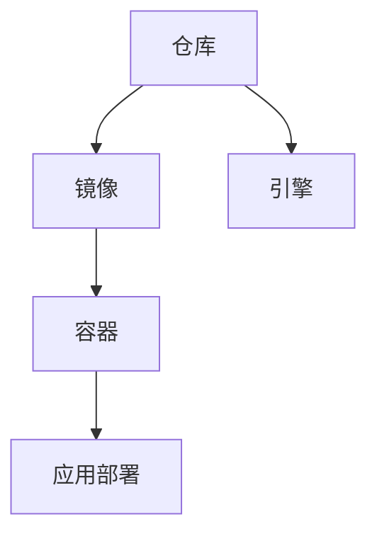

                 

在当今的云计算和分布式系统中，容器技术已经成为了一种重要的基础架构。本文将深入探讨Docker，这是一种轻量级容器化解决方案，它如何改变了应用部署、开发和运维的方式。

## 关键词

- Docker
- 容器化
- 轻量级
- 应用部署
- 分布式系统

## 摘要

本文旨在介绍Docker的工作原理、核心概念、操作步骤以及它的优点和应用场景。我们将通过实例展示如何使用Docker进行应用部署，并讨论它在未来的发展趋势和面临的挑战。

---

## 1. 背景介绍

容器技术的兴起可以追溯到2000年代初，当时Linux用户空间命名管道（LXC）首次被引入，为容器化提供了基础。然而，真正让容器技术成为主流的是Docker的诞生。Docker在2013年由Solomon Hykes在Pivotal创建，并迅速获得了广泛的关注和采用。Docker通过提供一种简单、轻量级和可移植的容器化解决方案，改变了传统应用部署的方式。

传统的应用部署往往依赖于大量的环境配置和依赖项管理，这增加了部署的复杂性和不确定性。而Docker通过将应用及其运行时环境封装在一个容器中，实现了应用的独立运行和环境的隔离，从而简化了部署过程。

### 1.1 容器技术的定义

容器是一种轻量级的、可执行的独立包，它包含应用程序的所有依赖项和配置，可以在不同的计算环境中独立运行。容器与虚拟机相比，具有更少的资源开销，因为它们不依赖于宿主机的操作系统内核，而是依赖于宿主机的应用层。

### 1.2 容器与虚拟机的区别

虚拟机通过虚拟化技术模拟出完整的操作系统环境，每个虚拟机都有独立的内核和资源分配。而容器则直接运行在宿主机的操作系统上，共享宿主机的内核，并通过cgroup和namespace实现资源隔离和隔离环境。

## 2. 核心概念与联系

Docker的核心概念包括镜像（Image）、容器（Container）、仓库（Registry）和引擎（Engine）。以下是一个简化的Mermaid流程图，展示了这些概念之间的关系。



### 2.1 镜像

镜像是一个静态的、只读的文件系统，它是容器的基础。Docker镜像通常由基础镜像（如Ubuntu、CentOS等）和应用打包组成。例如，一个Python应用的镜像可能基于Ubuntu镜像，并包含了Python环境和应用的代码。

### 2.2 容器

容器是基于镜像的动态实例，它可以运行应用程序。容器是可执行的，可以启动、停止、重启和移除。容器通过Docker引擎创建和管理，它们可以是临时的或持久的。

### 2.3 仓库

仓库是一个存储和管理镜像的集中地。Docker Hub是Docker官方的仓库，用户可以在这里找到和分享各种公共和私有镜像。

### 2.4 引擎

Docker引擎是Docker的核心组件，它负责构建、运行和管理容器。引擎通过Docker命令行界面（CLI）与用户交互。

### 2.5 应用部署

应用部署是将应用程序部署到容器中，并确保它在不同的环境中正常运行。Docker提供了简单的命令行工具，用户可以使用Dockerfile（一个包含构建指令的文本文件）来创建镜像，并使用docker run命令来启动容器。

---

## 3. 核心算法原理 & 具体操作步骤

Docker的实现依赖于几个关键技术和算法，包括分层存储、联合文件系统和cgroup。

### 3.1 分层存储

Docker使用分层存储来管理镜像和容器。每个镜像由多个层组成，这些层可以是只读的，也可以是可写的。容器是基于镜像的读写层构建的，这样可以实现资源的共享和隔离。

### 3.2 联合文件系统

Docker使用联合文件系统（UnionFS）来管理镜像和容器的文件系统。UnionFS允许用户将多个文件系统合并为一个单一的用户视图，从而实现镜像和容器的分层存储。

### 3.3 cgroup

cgroup是一种Linux内核功能，它允许用户对进程进行资源隔离和限制。Docker使用cgroup来实现容器的资源控制，例如CPU、内存和网络。

### 3.4 具体操作步骤

下面是使用Docker进行应用部署的详细步骤：

### 3.1 算法原理概述

分层存储、联合文件系统和cgroup是Docker实现容器化技术的核心原理。分层存储允许用户快速构建和更新镜像，联合文件系统实现了镜像和容器的分层存储和管理，而cgroup则实现了容器的资源控制和隔离。

### 3.2 算法步骤详解

1. **创建Dockerfile**：编写一个Dockerfile，其中包含构建镜像所需的指令，例如安装依赖项、复制代码等。

2. **构建镜像**：使用docker build命令，根据Dockerfile构建镜像。

3. **推送到仓库**：将构建好的镜像推送到Docker Hub或其他私有仓库。

4. **启动容器**：使用docker run命令，根据镜像启动容器。

5. **管理容器**：使用docker命令行工具对容器进行启动、停止、重启和移除等操作。

### 3.3 算法优缺点

**优点：**
- **轻量级**：容器比虚拟机更轻量，因为它们不依赖宿主机的操作系统内核。
- **可移植性**：容器可以在任何支持Docker的操作系统上运行，无需修改应用程序代码。
- **快速部署**：容器可以快速启动和停止，从而实现快速部署和回滚。

**缺点：**
- **安全性**：容器共享宿主机的内核，因此可能存在安全风险。
- **依赖性**：容器依赖于Docker引擎和其他相关组件，这可能导致部署和管理复杂。

### 3.4 算法应用领域

Docker广泛应用于以下领域：
- **开发**：容器化简化了应用的开发和测试过程。
- **部署**：容器化简化了应用的部署和运维。
- **云计算**：容器化是云计算和分布式系统的基础。

---

## 4. 数学模型和公式 & 详细讲解 & 举例说明

Docker的实现涉及一些基本的数学模型和公式，以下是几个常用的模型和解释。

### 4.1 数学模型构建

Docker的分层存储和联合文件系统可以使用以下数学模型表示：

- **分层存储**：每个镜像由多个层组成，每层代表一个文件系统。假设有n层，每层的大小为\(L_i\)，则总大小为：

  \[
  \sum_{i=1}^{n} L_i
  \]

- **联合文件系统**：联合文件系统可以将多个文件系统合并为一个用户视图，假设有m个文件系统，每个文件系统的路径为\(P_j\)，则用户视图的路径为：

  \[
  \bigcup_{j=1}^{m} P_j
  \]

### 4.2 公式推导过程

Docker的分层存储和联合文件系统的公式推导基于文件系统的基本操作和属性。

- **分层存储**：假设每个层的大小是已知的，那么总大小可以通过对每层大小的求和得到。

- **联合文件系统**：联合文件系统通过将多个文件系统的inode和dentry结构合并，实现了文件系统的合并。这个合并过程可以通过递归地遍历每个文件系统的inode和dentry结构，并将它们合并到用户视图中得到。

### 4.3 案例分析与讲解

以下是一个简单的案例，展示了如何使用Docker进行应用部署。

- **应用描述**：一个简单的Python Web应用，使用Flask框架。

- **Dockerfile**：

  ```Dockerfile
  FROM python:3.8

  WORKDIR /app

  COPY requirements.txt .

  RUN pip install -r requirements.txt

  COPY . .

  EXPOSE 5000

  CMD ["python", "app.py"]
  ```

- **构建镜像**：

  ```bash
  docker build -t myapp .
  ```

- **运行容器**：

  ```bash
  docker run -d -p 5000:5000 myapp
  ```

在这个案例中，我们首先从Python 3.8基础镜像开始构建，然后在容器中安装依赖项，复制应用代码，并暴露Web服务端口。最后，我们使用docker run命令启动容器。

---

## 5. 项目实践：代码实例和详细解释说明

在这个部分，我们将通过一个实际的Docker项目来展示如何进行应用部署。这个项目是一个简单的Web应用，使用Flask框架。

### 5.1 开发环境搭建

为了运行这个项目，我们需要安装Docker和Python 3.8。

- **安装Docker**：根据你的操作系统，从Docker官方网站下载并安装Docker。

- **安装Python 3.8**：在终端运行以下命令安装Python 3.8：

  ```bash
  sudo apt-get update
  sudo apt-get install python3.8
  ```

### 5.2 源代码详细实现

项目源代码如下：

- **app.py**：

  ```python
  from flask import Flask

  app = Flask(__name__)

  @app.route('/')
  def hello():
      return 'Hello, World!'

  if __name__ == '__main__':
      app.run()
  ```

- **requirements.txt**：

  ```
  Flask==1.1.2
  ```

### 5.3 代码解读与分析

- **app.py**：这是一个简单的Flask Web应用，它定义了一个路由`/`，返回一个`Hello, World!`字符串。

- **requirements.txt**：这是一个依赖文件，它指定了应用所需的依赖项。

### 5.4 运行结果展示

使用以下命令运行容器：

```bash
docker run -d -p 5000:5000 myapp
```

在浏览器中访问`http://localhost:5000`，你应该会看到`Hello, World!`字符串。

---

## 6. 实际应用场景

Docker在多个实际应用场景中取得了显著成果：

- **开发**：Docker简化了应用的开发和测试过程，通过容器化可以轻松地在不同的环境中运行应用。

- **部署**：Docker简化了应用的部署和运维，通过镜像可以快速部署和回滚应用。

- **云计算**：Docker是云计算和分布式系统的基础，许多云服务平台都支持Docker容器。

- **微服务**：Docker是微服务架构的重要组成部分，它支持将应用分解为独立的、可管理的服务。

### 6.4 未来应用展望

未来，Docker将继续在以下方面发展：

- **性能优化**：随着容器技术的普及，对容器性能的要求越来越高，Docker将持续优化其性能。

- **安全增强**：容器安全是一个重要领域，Docker将加强安全功能，以保护容器和容器化应用。

- **跨平台支持**：Docker将继续扩大其对不同操作系统和硬件平台的兼容性。

- **生态建设**：Docker将持续发展其生态系统，包括工具、插件和第三方库，以简化容器化过程。

---

## 7. 工具和资源推荐

### 7.1 学习资源推荐

- **官方文档**：Docker的官方文档是学习Docker的最佳资源。
- **在线教程**：有许多在线平台提供Docker的免费教程，如Udemy、Coursera等。
- **书籍**：《Docker Deep Dive》是一本深入介绍Docker的书籍。

### 7.2 开发工具推荐

- **Docker Desktop**：适用于Windows和Mac的Docker桌面应用程序。
- **Kitematic**：一个简洁的Docker桌面应用程序，适用于Mac。
- **Docker CLI**：Docker命令行界面，用于与Docker引擎交互。

### 7.3 相关论文推荐

- **“Docker: Lightweight Container for Lightweight Applications”**：这篇论文详细介绍了Docker的设计和实现。
- **“Containerization: A Practical Guide to Docker and Kubernetes”**：这篇论文提供了关于容器化和Docker的实用指南。

---

## 8. 总结：未来发展趋势与挑战

### 8.1 研究成果总结

Docker作为轻量级容器化解决方案，在简化应用部署、开发和运维方面取得了显著成果。它改变了传统应用部署的方式，推动了容器技术的普及。

### 8.2 未来发展趋势

未来，Docker将继续在性能优化、安全增强、跨平台支持和生态建设方面发展。容器技术将成为云计算和分布式系统的核心基础设施。

### 8.3 面临的挑战

- **安全性**：容器共享宿主机的内核，可能存在安全风险。
- **兼容性**：Docker需要与不同操作系统和硬件平台兼容。
- **标准化**：容器化技术的标准化工作需要进一步加强。

### 8.4 研究展望

随着容器技术的不断发展，Docker将继续发挥其优势，推动容器化技术在各个领域的应用。未来，Docker有望在性能、安全和兼容性方面取得更大的突破。

---

## 9. 附录：常见问题与解答

### 9.1 什么是Docker？

Docker是一种轻量级容器化解决方案，它允许用户将应用及其依赖项封装在一个容器中，实现应用的独立运行和环境的隔离。

### 9.2 Docker与虚拟机有什么区别？

虚拟机通过虚拟化技术模拟完整的操作系统环境，而容器直接运行在宿主机的操作系统上，共享宿主机的内核。容器比虚拟机更轻量，因为它们不依赖宿主机的操作系统内核。

### 9.3 如何安装Docker？

安装Docker的方法取决于操作系统。在Linux上，可以通过包管理器安装Docker，例如在Ubuntu上，可以运行以下命令：

```bash
sudo apt-get update
sudo apt-get install docker-ce docker-ce-cli containerd.io
```

在Windows和Mac上，可以从Docker官方网站下载并安装Docker Desktop。

---

作者：禅与计算机程序设计艺术 / Zen and the Art of Computer Programming

