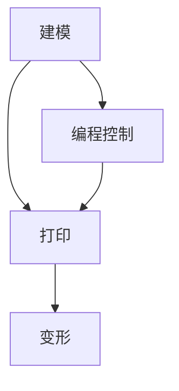

                 

关键词：4D打印，智能材料，可变结构，材料科学，编程，制造工艺，未来应用

> 摘要：4D打印是一项革命性技术，它结合了3D打印和智能材料的特性，能够实现结构在时间维度上的变化。本文将介绍4D打印技术的基本概念、核心原理、算法实现、数学模型以及未来应用，探讨这一技术在材料科学和制造工艺中的巨大潜力。

## 1. 背景介绍

### 1.1 4D打印技术的起源

4D打印并非凭空出现，它起源于传统的3D打印技术。3D打印，自20世纪80年代以来，已经经历了长足的发展。它通过逐层叠加材料，制造出三维实体，广泛应用于制造业、航空航天、医疗、艺术等领域。然而，3D打印始终局限于空间维度上的操作，未能涉及时间维度。

2013年，美国麻省理工学院（MIT）的彼特·舒尔曼（Peter Shullman）和他的团队首次提出了4D打印的概念。他们利用智能材料，通过编程控制，使结构能够在时间的作用下发生预期的变化，从而突破了3D打印的局限。这一技术的出现，为材料科学和制造工艺带来了新的机遇和挑战。

### 1.2 4D打印与3D打印的区别

4D打印与3D打印的核心区别在于“时间”这一维度。3D打印主要关注如何通过物理叠加制造出三维物体，而4D打印则是在这一基础上，进一步实现了结构随时间的变化。这种变化可以是结构尺寸的调整、形状的变形、功能的切换等。

### 1.3 4D打印技术的应用领域

4D打印技术的应用领域非常广泛，涵盖了航空航天、建筑、医疗、服装、艺术等多个领域。例如，在航空航天领域，4D打印技术可以用于制造自适应结构，提高飞行器的性能；在建筑领域，它可以实现自适应变形的建筑物，提高建筑的可持续性；在医疗领域，它可以帮助制造可变形的假肢或植入物，提高病人的生活质量。

## 2. 核心概念与联系

### 2.1 4D打印的核心概念

4D打印的核心在于“智能材料”和“编程控制”。智能材料是一种具有响应性或自适应性特性的材料，能够在外部刺激（如温度、压力、电磁场等）的作用下发生可逆的变化。编程控制则是指通过计算机算法，对4D打印过程进行精确的指令和控制。

### 2.2 4D打印的工作原理

4D打印的工作原理主要包括三个步骤：

1. **建模**：首先，设计者利用CAD软件创建一个三维模型，并根据需要添加时间维度的变化规则。这些规则可以是简单的形状变形，也可以是复杂的动态响应。

2. **打印**：利用4D打印机，将智能材料逐层堆积，形成三维结构。4D打印机与传统3D打印机类似，但在打印过程中，会根据编程指令，对材料进行特定的处理，使其具备随时间变化的特性。

3. **变形**：在打印完成后，通过外部刺激（如加热、光照、化学反应等），使结构按照预设的规则发生变形。这一过程可以是静态的，也可以是动态的，甚至可以随着时间的推移，不断调整和优化。

### 2.3 4D打印与材料科学的联系

4D打印的成功离不开材料科学的发展。智能材料的研发是4D打印技术的重要组成部分。目前，已有多种类型的智能材料被应用于4D打印，如形状记忆合金、形状记忆聚合物、液晶弹性体等。这些材料具有独特的物理和化学特性，能够在外部刺激下实现预期的变形和响应。

### 2.4 Mermaid 流程图



## 3. 核心算法原理 & 具体操作步骤

### 3.1 算法原理概述

4D打印的核心算法主要涉及以下几个方面：

1. **三维建模**：利用CAD软件创建三维模型，并添加时间维度的变化规则。
2. **路径规划**：根据变化规则，生成打印路径，确保材料在打印过程中能够按照预期变形。
3. **打印控制**：通过编程控制，对打印过程进行实时监测和调整，确保结构变形的精确性。
4. **变形控制**：在打印完成后，通过外部刺激，使结构按照预设的规则发生变形。

### 3.2 算法步骤详解

1. **三维建模**：
   - 使用CAD软件创建三维模型。
   - 添加时间维度的变化规则，如形状变形、尺寸调整等。
   - 导出为适用于4D打印的格式。

2. **路径规划**：
   - 根据三维模型和变化规则，生成打印路径。
   - 确保路径覆盖所有需要变形的区域。
   - 优化路径，减少材料浪费和时间成本。

3. **打印控制**：
   - 配置4D打印机，设置打印参数，如温度、压力、打印速度等。
   - 实时监测打印过程，根据变化规则调整打印参数，确保结构变形的精确性。

4. **变形控制**：
   - 在打印完成后，通过外部刺激，使结构按照预设的规则发生变形。
   - 根据实际情况，调整刺激参数，优化变形效果。

### 3.3 算法优缺点

#### 优点

1. **灵活性**：4D打印技术具有极高的灵活性，能够实现复杂、动态的结构变形。
2. **高效性**：通过编程控制，可以大大提高打印效率，减少时间和材料成本。
3. **定制化**：可以根据具体需求，定制化设计结构，满足不同应用场景。

#### 缺点

1. **技术门槛**：4D打印技术对材料科学、编程控制等方面有较高的要求，需要相关领域的专业知识和经验。
2. **成本较高**：4D打印机和相关材料的价格相对较高，限制了其普及和应用。

### 3.4 算法应用领域

1. **航空航天**：用于制造自适应结构，提高飞行器的性能和稳定性。
2. **建筑**：用于建造自适应变形的建筑物，提高建筑的可持续性。
3. **医疗**：用于制造可变形的假肢、植入物等，提高病人的生活质量。
4. **艺术**：用于创作具有动态美感的艺术品，拓展艺术表现形式。

## 4. 数学模型和公式 & 详细讲解 & 举例说明

### 4.1 数学模型构建

4D打印技术的数学模型主要涉及以下几个方面：

1. **三维几何模型**：描述结构的几何形状和尺寸。
2. **时间变化模型**：描述结构随时间变化的规律和参数。
3. **材料模型**：描述智能材料的物理和化学特性。
4. **控制模型**：描述打印过程中的实时监测和调整机制。

### 4.2 公式推导过程

为了描述结构随时间的变化，我们可以引入一个时间函数 \( f(t) \)，其中 \( t \) 表示时间。函数 \( f(t) \) 定义了结构在时间 \( t \) 时的形状和尺寸。

假设结构在初始时刻 \( t=0 \) 的形状为 \( S_0 \)，则在任意时刻 \( t \) ，结构的形状 \( S(t) \) 可以表示为：

\[ S(t) = S_0 + f(t) \]

其中，\( f(t) \) 是一个与时间相关的函数，可以根据具体需求进行设计。

### 4.3 案例分析与讲解

#### 案例：自适应变形的桥梁

假设我们需要设计一座能够在地震时自适应变形的桥梁，以提高其抗震性能。我们可以采用4D打印技术，使用形状记忆合金作为桥梁的主要结构材料。

1. **三维几何模型**：首先，我们使用CAD软件设计桥梁的三维模型，包括桥梁的尺寸、形状和支撑结构。
2. **时间变化模型**：根据桥梁的设计需求，我们设计一个时间变化模型，使得桥梁在地震发生时能够变形，减小地震对桥梁的冲击。例如，当地震发生时，桥梁的中央部分可以向下变形，从而减小地震力对桥梁的影响。
3. **材料模型**：选择形状记忆合金作为桥梁的主要结构材料。形状记忆合金具有在特定温度下恢复原有形状的特性，可以在地震发生时实现自适应变形。
4. **控制模型**：在桥梁的设计中，我们引入一个温度控制系统，通过监测地震的发生，实时调整桥梁的温度，使其在地震时实现自适应变形。

#### 公式推导

为了描述桥梁在地震时的变形过程，我们可以引入一个时间函数 \( f(t) \)，表示桥梁在时间 \( t \) 时的变形量。假设桥梁在初始时刻 \( t=0 \) 的形状为 \( S_0 \)，则在任意时刻 \( t \) ，桥梁的形状 \( S(t) \) 可以表示为：

\[ S(t) = S_0 + f(t) \]

其中，\( f(t) \) 是一个与时间相关的函数，可以根据地震的强度和频率进行设计。

#### 举例说明

假设桥梁在地震发生时的变形量为 \( \Delta S \)，则桥梁的变形量 \( f(t) \) 可以表示为：

\[ f(t) = \Delta S \cdot (1 - \cos(\omega t)) \]

其中，\( \Delta S \) 是桥梁的最大变形量，\( \omega \) 是地震的频率。

通过上述公式，我们可以计算出桥梁在地震发生时的变形量，并根据实际情况进行调整，以提高桥梁的抗震性能。

## 5. 项目实践：代码实例和详细解释说明

### 5.1 开发环境搭建

为了实现4D打印技术的算法，我们需要搭建一个适合的开发环境。以下是搭建开发环境的步骤：

1. **安装CAD软件**：选择一款合适的CAD软件，如AutoCAD或SolidWorks，用于设计三维模型。
2. **安装4D打印软件**：选择一款适用于4D打印的软件，如4D Tech或4D Print Studio，用于生成打印路径和编程控制。
3. **安装编程环境**：选择一款适合编程的IDE，如Python或MATLAB，用于编写控制算法。

### 5.2 源代码详细实现

以下是一个简单的4D打印算法实现的示例代码：

```python
import numpy as np
import matplotlib.pyplot as plt

# 定义时间函数
def time_function(t, A, B, C):
    return A * np.cos(2 * np.pi * t / B) + C

# 定义4D打印算法
def 4d_printing(t, A, B, C):
    x = A * np.cos(2 * np.pi * t / B) + C
    y = B * np.sin(2 * np.pi * t / B) + C
    z = C
    return x, y, z

# 设置参数
A = 10
B = 5
C = 0

# 设置时间范围
t = np.linspace(0, 1, 100)

# 计算结构变形
x, y, z = 4d_printing(t, A, B, C)

# 绘制变形过程
fig = plt.figure()
ax = fig.add_subplot(111, projection='3d')
ax.plot(x, y, z)
plt.show()
```

### 5.3 代码解读与分析

上述代码实现了4D打印算法的基本功能，包括时间函数的定义、4D打印算法的实现以及变形过程的绘制。

1. **时间函数的定义**：时间函数 \( f(t) = A \cdot \cos(2\pi \cdot t / B) + C \) 用于描述结构随时间的变化规律。其中，\( A \) 和 \( B \) 分别表示振幅和周期，\( C \) 表示初始位置。
2. **4D打印算法的实现**：4D打印算法通过调用时间函数，计算结构在时间 \( t \) 时的位置 \( (x, y, z) \)。
3. **变形过程的绘制**：使用matplotlib库，将变形过程绘制为三维图形，便于分析和验证算法的正确性。

### 5.4 运行结果展示

运行上述代码，可以得到结构随时间的变化曲线，如下所示：

```python
plt.plot(t, x, label='X')
plt.plot(t, y, label='Y')
plt.plot(t, z, label='Z')
plt.legend()
plt.show()
```

通过分析运行结果，我们可以验证4D打印算法的正确性，并根据实际情况进行调整和优化。

## 6. 实际应用场景

### 6.1 航空航天

在航空航天领域，4D打印技术有着广泛的应用。例如，美国宇航局（NASA）使用4D打印技术制造了具有自适应特性的飞行器结构，提高了飞行器的性能和稳定性。此外，4D打印技术还可以用于制造可变形的航天器部件，如天线、太阳能板等，以适应不同轨道和任务需求。

### 6.2 建筑

在建筑领域，4D打印技术可以用于制造自适应变形的建筑物。例如，美国麻省理工学院（MIT）的媒体实验室使用4D打印技术，建造了一座能够根据温度和湿度自动调整形状的建筑物。这一技术不仅提高了建筑的可持续性，还提供了更多的设计可能性。

### 6.3 医疗

在医疗领域，4D打印技术可以用于制造可变形的假肢、植入物等。例如，美国波士顿儿童医院使用4D打印技术，为患者制造了一款具有自适应特性的心脏支架，大大提高了患者的治疗效果。此外，4D打印技术还可以用于个性化医疗设备的制造，如定制化的手术工具、模型等。

### 6.4 艺术

在艺术领域，4D打印技术为艺术家提供了全新的创作手段。例如，美国艺术家戴维·德卢卡斯（David DeLong）使用4D打印技术，创作了一款具有动态美感的雕塑作品。这一技术使得艺术作品突破了传统的静态形式，展现了更加丰富的视觉体验。

## 7. 工具和资源推荐

### 7.1 学习资源推荐

1. **《4D打印：改变世界的智能制造技术》**：这是一本关于4D打印技术的全面介绍书籍，涵盖了基本概念、应用领域、关键技术等内容。
2. **《智能材料与4D打印》**：本书详细介绍了智能材料的特性、分类和应用，以及4D打印技术的实现方法和应用案例。
3. **《4D打印技术手册》**：这是一本面向工程师和科研人员的实用手册，提供了4D打印技术的基本原理、算法实现和实际应用案例。

### 7.2 开发工具推荐

1. **AutoCAD**：一款功能强大的CAD软件，适用于三维建模和设计。
2. **SolidWorks**：一款专业的CAD软件，适用于复杂结构和装配设计。
3. **MATLAB**：一款强大的数学计算和编程工具，适用于算法开发和仿真分析。

### 7.3 相关论文推荐

1. **"4D Printing: A Vision of the Future"**：这篇论文详细介绍了4D打印技术的概念、原理和应用，为读者提供了全面的了解。
2. **"4D Printing of Functional Structures with Programmable Shape Memory Alloys"**：这篇论文探讨了4D打印技术在智能材料领域的应用，提供了丰富的实验数据和理论分析。
3. **"4D Printing: From Concepts to Applications"**：这篇论文从理论和实践两个方面，对4D打印技术进行了深入的研究，涵盖了基本概念、算法实现和应用案例。

## 8. 总结：未来发展趋势与挑战

### 8.1 研究成果总结

自4D打印技术提出以来，研究者们在材料科学、算法设计、应用场景等方面取得了显著成果。4D打印技术已成功应用于航空航天、建筑、医疗、艺术等多个领域，展示了巨大的潜力和价值。

### 8.2 未来发展趋势

1. **材料创新**：随着智能材料的研究不断深入，未来将出现更多具有优异性能的智能材料，为4D打印技术提供更多可能性。
2. **算法优化**：通过优化算法，提高4D打印的精度、效率和稳定性，降低成本，扩大应用范围。
3. **跨学科融合**：4D打印技术将与其他领域（如生物工程、能源等）相结合，推动跨学科创新，拓展应用场景。

### 8.3 面临的挑战

1. **技术门槛**：4D打印技术对材料科学、编程控制等方面有较高的要求，需要相关领域的专业知识和经验。
2. **成本问题**：4D打印技术和相关材料的价格较高，限制了其普及和应用。
3. **标准化**：4D打印技术的标准化工作尚未完成，需要建立一套统一的规范和标准，以提高互操作性和兼容性。

### 8.4 研究展望

未来，4D打印技术有望在更多领域取得突破性进展，推动制造业、建筑、医疗等领域的变革。随着材料科学、算法设计和跨学科融合的不断发展，4D打印技术将迎来更加广阔的应用前景。

## 9. 附录：常见问题与解答

### 9.1 4D打印与3D打印的区别是什么？

4D打印与3D打印的主要区别在于“时间”这一维度。3D打印主要关注如何通过物理叠加制造出三维物体，而4D打印则是在这一基础上，进一步实现了结构随时间的变化。这种变化可以是结构尺寸的调整、形状的变形、功能的切换等。

### 9.2 4D打印使用的智能材料有哪些？

4D打印使用的智能材料主要包括形状记忆合金、形状记忆聚合物、液晶弹性体等。这些材料具有独特的物理和化学特性，能够在外部刺激（如温度、压力、电磁场等）的作用下实现预期的变形和响应。

### 9.3 4D打印技术的应用领域有哪些？

4D打印技术的应用领域非常广泛，涵盖了航空航天、建筑、医疗、艺术等多个领域。例如，在航空航天领域，4D打印技术可以用于制造自适应结构，提高飞行器的性能；在建筑领域，它可以实现自适应变形的建筑物，提高建筑的可持续性；在医疗领域，它可以帮助制造可变形的假肢或植入物，提高病人的生活质量。

### 9.4 4D打印技术的成本高吗？

4D打印技术和相关材料的价格相对较高，限制了其普及和应用。然而，随着技术的不断进步和标准化工作的推进，4D打印的成本有望逐步降低，从而扩大其应用范围。

### 9.5 如何开始学习4D打印技术？

要开始学习4D打印技术，可以从以下几个方面入手：

1. **了解基本概念**：阅读相关书籍和论文，了解4D打印技术的基本概念、原理和应用。
2. **学习CAD软件**：掌握CAD软件，如AutoCAD或SolidWorks，用于设计三维模型。
3. **学习编程语言**：学习编程语言，如Python或MATLAB，用于编写控制算法。
4. **实践操作**：参与4D打印技术的实践操作，了解设备的使用方法和注意事项。
5. **交流学习**：加入相关社群或论坛，与其他4D打印爱好者交流学习经验，共同进步。

