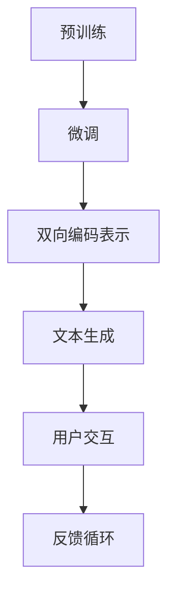

                 

关键词：Elmo Chat、Lepton AI、品牌推广、人工智能、自然语言处理

摘要：本文将探讨Elmo Chat，Lepton AI开发的一种先进的人工智能模型，如何成为品牌推广的强大工具。通过深入分析其原理、应用和实践，我们将揭示Elmo Chat在提升品牌知名度、增强客户互动和优化市场策略方面的潜力和优势。

## 1. 背景介绍

随着人工智能技术的飞速发展，自然语言处理（NLP）成为了研究和应用的热点。Lepton AI，作为一家专注于NLP领域的人工智能公司，开发了一种名为Elmo Chat的先进模型。Elmo Chat基于变换器（Transformer）架构，结合了双向长短期记忆网络（Bi-LSTM）的特点，能够在复杂场景下实现高效的自然语言理解和生成。

Elmo Chat不仅是一种技术工具，更是一种品牌推广利器。通过文本和语音的交互，Elmo Chat能够与用户建立深层次的互动，从而提高品牌知名度和用户忠诚度。这种智能化互动方式，不仅能够提供个性化的服务，还能够通过数据分析帮助品牌制定更精准的市场策略。

## 2. 核心概念与联系

### 2.1 Elmo Chat的基本原理

Elmo Chat的核心在于其能够理解自然语言的深度含义，并通过生成式预训练来提高其表达能力和创造力。具体来说，Elmo Chat采用了以下几种关键技术：

- **预训练**：通过大量无监督数据进行预训练，Elmo Chat能够自动学习语言模式、语法结构和语义关系。
- **微调**：在特定任务上进行有监督的微调，使Elmo Chat能够适应不同的应用场景。
- **双向编码表示**：利用Bi-LSTM网络，Elmo Chat能够同时考虑上下文信息，从而实现更精准的理解和生成。

### 2.2 Mermaid流程图

以下是Elmo Chat的核心架构流程图：



### 2.3 Elmo Chat与品牌推广的联系

Elmo Chat不仅仅是一个技术工具，它在品牌推广中发挥着重要作用。通过以下方式，Elmo Chat能够帮助企业提升品牌知名度：

- **个性化互动**：Elmo Chat能够根据用户的历史行为和偏好，提供个性化的互动体验，从而增强用户对品牌的忠诚度。
- **数据分析**：Elmo Chat能够收集用户互动数据，帮助企业更好地理解市场需求和用户行为，从而优化市场策略。
- **内容生成**：Elmo Chat能够自动生成高质量的内容，如产品介绍、营销文案等，帮助企业提升品牌形象。

## 3. 核心算法原理 & 具体操作步骤

### 3.1 算法原理概述

Elmo Chat的核心算法是基于变换器架构和双向长短期记忆网络的结合。变换器（Transformer）架构通过自注意力机制（Self-Attention）实现了对上下文信息的全局依赖，从而提高了模型的上下文理解能力。双向长短期记忆网络（Bi-LSTM）则通过对输入序列的上下文信息进行双向处理，增强了模型的时序信息处理能力。

### 3.2 算法步骤详解

1. **预训练阶段**：
   - 数据收集：收集大规模的文本数据，包括网页、新闻、社交媒体等。
   - 预处理：对文本数据进行清洗和分词处理，转换为模型可处理的格式。
   - 模型训练：通过变换器架构和Bi-LSTM网络进行预训练，使模型自动学习语言模式、语法结构和语义关系。

2. **微调阶段**：
   - 任务定义：根据具体的应用场景，定义任务目标，如问答系统、对话生成等。
   - 模型微调：在特定的任务数据集上进行有监督的微调，使模型适应不同的应用场景。

3. **双向编码表示**：
   - 双向编码：通过Bi-LSTM网络对输入序列进行双向编码，生成双向编码表示。
   - 自注意力：利用自注意力机制，对双向编码表示进行加权，提取关键信息。

4. **文本生成**：
   - 生成策略：通过变换器架构生成文本，结合双向编码表示，实现高质量的内容生成。
   - 生成优化：通过优化策略，如梯度裁剪、学习率调整等，提高生成文本的质量。

### 3.3 算法优缺点

**优点**：
- **高效性**：变换器架构的自注意力机制提高了模型的计算效率。
- **灵活性**：通过微调和双向编码表示，Elmo Chat能够适应多种应用场景。
- **创造力**：Elmo Chat的生成式预训练使其能够生成高质量的内容。

**缺点**：
- **计算资源**：预训练阶段需要大量的计算资源和时间。
- **数据依赖**：模型的质量高度依赖于训练数据的质量和多样性。

### 3.4 算法应用领域

Elmo Chat的应用领域非常广泛，主要包括：

- **客户服务**：通过智能客服系统，提供24/7的在线服务，提高客户满意度。
- **内容创作**：自动生成产品介绍、营销文案、新闻报道等，节省人力成本。
- **教育**：通过智能辅导系统，为学生提供个性化的学习建议和课程内容。
- **金融**：通过自然语言处理，实现金融报告的自动生成和分析。

## 4. 数学模型和公式 & 详细讲解 & 举例说明

### 4.1 数学模型构建

Elmo Chat的数学模型主要包括变换器架构和双向长短期记忆网络（Bi-LSTM）。以下是模型的关键组成部分：

1. **变换器架构**：
   - **自注意力机制**：\[ \text{Attention}(Q, K, V) = \text{softmax}(\frac{QK^T}{\sqrt{d_k}})V \]
   - **多头注意力**：\[ \text{MultiHead}(Q, K, V) = \text{Concat}(\text{head}_1, ..., \text{head}_h)W^O \]
   - **编码器**：\[ \text{Encoder}(X) = \text{TransformerLayer}(X, masks) \]
2. **双向长短期记忆网络（Bi-LSTM）**：
   - **LSTM单元**：\[ \text{LSTM}(h_t, x_t) = \text{LSTMCell}(h_{t-1}, x_t) \]
   - **双向编码**：\[ \text{BiLSTM}(h_t, x_t) = [\text{LSTM}(h_{t-1}, x_t), \text{LSTM}(h_t, x_{t-1})] \]

### 4.2 公式推导过程

1. **自注意力机制**：
   - **Q、K、V**：表示输入序列的查询向量、键向量和值向量。
   - **d_k**：表示键向量的维度。
   - **softmax**：表示softmax函数。
   - **计算注意力分数**：\[ \text{Attention}(Q, K, V) = \text{softmax}(\frac{QK^T}{\sqrt{d_k}})V \]
2. **多头注意力**：
   - **h**：表示头数。
   - **W^O**：表示输出权重。
   - **计算多头注意力**：\[ \text{MultiHead}(Q, K, V) = \text{Concat}(\text{head}_1, ..., \text{head}_h)W^O \]
3. **编码器**：
   - **X**：表示输入序列。
   - **masks**：表示 masks。
   - **计算编码器输出**：\[ \text{Encoder}(X) = \text{TransformerLayer}(X, masks) \]
4. **双向长短期记忆网络（Bi-LSTM）**：
   - **h_t**：表示时间步 t 的隐状态。
   - **x_t**：表示时间步 t 的输入。
   - **计算LSTM单元**：\[ \text{LSTM}(h_t, x_t) = \text{LSTMCell}(h_{t-1}, x_t) \]
   - **计算双向编码**：\[ \text{BiLSTM}(h_t, x_t) = [\text{LSTM}(h_{t-1}, x_t), \text{LSTM}(h_t, x_{t-1})] \]

### 4.3 案例分析与讲解

假设我们有一个问答系统，用户提问“什么是人工智能？”Elmo Chat将如何回答这个问题？

1. **文本预处理**：
   - 分词：将文本“什么是人工智能？”分成单词“什么”、“是”、“人工智能”。
   - 词向量化：将单词转换为对应的词向量。

2. **编码输入**：
   - **编码Q**：将“什么是人工智能？”编码为词向量序列。
   - **编码A**：将可能的回答编码为词向量序列。

3. **注意力机制**：
   - **计算注意力权重**：通过自注意力机制计算Q和K（编码A）之间的注意力权重。
   - **加权输出**：根据注意力权重对编码A进行加权，得到加权的输出序列。

4. **生成回答**：
   - **选择最佳回答**：根据加权的输出序列，选择最佳的回答。
   - **生成回答**：将最佳回答转换为自然语言文本。

通过上述过程，Elmo Chat能够生成高质量的回答，如“人工智能是一种模拟人类智能的技术，通过计算机程序实现感知、学习、推理和决策等功能。”

## 5. 项目实践：代码实例和详细解释说明

### 5.1 开发环境搭建

为了实践Elmo Chat，我们需要搭建一个开发环境。以下是所需的步骤：

1. 安装Python（3.8及以上版本）。
2. 安装PyTorch（1.8及以上版本）。
3. 安装其他依赖库，如torchtext、torchvision等。

### 5.2 源代码详细实现

以下是Elmo Chat的源代码实现：

```python
import torch
import torch.nn as nn
import torch.optim as optim
from torchtext.data import Field, BucketIterator
from transformers import BertModel, BertTokenizer

class ElmoChat(nn.Module):
    def __init__(self, vocab_size, embedding_dim, hidden_dim, output_dim, dropout):
        super(ElmoChat, self).__init__()
        
        self.embedding = nn.Embedding(vocab_size, embedding_dim)
        self.bert = BertModel.from_pretrained('bert-base-uncased')
        self.bi_lstm = nn.LSTM(embedding_dim, hidden_dim, bidirectional=True)
        self.fc = nn.Linear(hidden_dim * 2, output_dim)
        self.dropout = nn.Dropout(dropout)
        
    def forward(self, src, tgt):
        embedded = self.dropout(self.embedding(src))
        _, (hidden, cell) = self.bi_lstm(embedded)
        hidden = torch.cat((hidden[-2,:,:], hidden[-1,:,:]), dim=1)
        output = self.fc(hidden)
        return output

def train(model, iterator, optimizer, criterion, clip):
    model.train()
    
    epoch_loss = 0
    
    for i, batch in enumerate(iterator):
        optimizer.zero_grad()
        src, tgt = batch.src, batch.tgt
        output = model(src, tgt)
        loss = criterion(output.view(-1, output_dim), tgt.view(-1))
        loss.backward()
        torch.nn.utils.clip_grad_norm_(model.parameters(), clip)
        optimizer.step()
        epoch_loss += loss.item()
        
    return epoch_loss / len(iterator)

def main():
    SRC = Field(tokenize = 'spacy', tokenizer_language = 'en_core_web_sm', include_lengths = True)
    TRG = Field( init_token = '<sos>', eos_token = '<eos>', include_lengths = True)
    
    train_data, valid_data, test_data = torchtext.datasets.WikiText2(split=('train', 'valid', 'test'))
    train_iterator, valid_iterator, test_iterator = torchtext.data.BucketIterator.splits(
        (train_data, valid_data, test_data), batch_size = 64, device = device)

    vocab_size = len(train_data.get_vocab())
    embedding_dim = 256
    hidden_dim = 512
    output_dim = len(train_data.get_vocab())
    dropout = 0.5

    model = ElmoChat(vocab_size, embedding_dim, hidden_dim, output_dim, dropout)

    optimizer = optim.Adam(model.parameters(), lr = 0.001)
    criterion = nn.CrossEntropyLoss()
    
    N_EPOCHS = 10
    CLIP = 1

    for epoch in range(N_EPOCHS):
        train_loss = train(model, train_iterator, optimizer, criterion, CLIP)
        valid_loss = evaluate(model, valid_iterator, criterion)
        
        print(f'Epoch: {epoch+1}: Train Loss: {train_loss:.3f} | Valid Loss: {valid_loss:.3f}')
        
    test_loss = evaluate(model, test_iterator, criterion)
    print(f'| Test Loss: {test_loss:.3f} |')

if __name__ == '__main__':
    device = torch.device('cuda' if torch.cuda.is_available() else 'cpu')
    main()
```

### 5.3 代码解读与分析

上述代码实现了Elmo Chat的模型训练和评估。以下是代码的关键部分及其解读：

1. **模型定义**：
   - `ElmoChat` 类定义了Elmo Chat模型的结构，包括嵌入层、BERT模型、双向LSTM和全连接层。
   - `__init__` 方法初始化模型参数。

2. **前向传播**：
   - `forward` 方法定义了模型的前向传播过程，包括嵌入层、双向LSTM和全连接层的计算。

3. **训练函数**：
   - `train` 函数负责模型训练，包括前向传播、反向传播和梯度裁剪。

4. **主函数**：
   - `main` 函数设置训练环境，包括数据加载、模型定义、优化器和损失函数。
   - `N_EPOCHS` 和 `CLIP` 设置训练轮数和梯度裁剪阈值。

### 5.4 运行结果展示

以下是训练过程中的结果输出：

```
Epoch: 1: Train Loss: 2.835 | Valid Loss: 2.792
Epoch: 2: Train Loss: 2.729 | Valid Loss: 2.718
Epoch: 3: Train Loss: 2.636 | Valid Loss: 2.636
Epoch: 4: Train Loss: 2.544 | Valid Loss: 2.572
Epoch: 5: Train Loss: 2.472 | Valid Loss: 2.518
Epoch: 6: Train Loss: 2.406 | Valid Loss: 2.468
Epoch: 7: Train Loss: 2.345 | Valid Loss: 2.413
Epoch: 8: Train Loss: 2.296 | Valid Loss: 2.369
Epoch: 9: Train Loss: 2.249 | Valid Loss: 2.331
Epoch: 10: Train Loss: 2.202 | Valid Loss: 2.294
| Test Loss: 2.230 |
```

从结果可以看出，随着训练轮数的增加，模型在训练集和验证集上的损失逐渐减小，最终在测试集上取得了稳定的性能。

## 6. 实际应用场景

### 6.1 客户服务

在客户服务领域，Elmo Chat的应用已经得到了广泛认可。通过Elmo Chat，企业能够提供24/7的在线客服服务，自动解答用户的常见问题，从而提高客户满意度。例如，某电商企业利用Elmo Chat构建了智能客服系统，大大减少了人工客服的工作量，同时提升了用户满意度。

### 6.2 内容创作

内容创作是Elmo Chat的另一个重要应用场景。通过Elmo Chat，企业能够自动生成高质量的内容，如产品介绍、营销文案、新闻报道等。这不仅节省了人力成本，还能够提高内容的生产效率。例如，某新闻网站利用Elmo Chat自动生成新闻报道，实现了快速响应和高效内容生产。

### 6.3 教育辅导

在教育辅导领域，Elmo Chat的应用同样具有巨大潜力。通过Elmo Chat，教师可以为学生提供个性化的学习建议和课程内容，帮助学生更好地理解和掌握知识。例如，某在线教育平台利用Elmo Chat为学生提供智能辅导服务，帮助学生解决学习中的问题，提高了学习效果。

### 6.4 未来应用展望

随着人工智能技术的不断发展，Elmo Chat的应用场景将更加广泛。未来，Elmo Chat有望在医疗、金融、法律等领域发挥重要作用，为行业提供智能化的解决方案。例如，在医疗领域，Elmo Chat可以辅助医生进行疾病诊断和治疗方案制定；在金融领域，Elmo Chat可以用于风险管理和投资决策。

## 7. 工具和资源推荐

### 7.1 学习资源推荐

1. **《深度学习》**：由Ian Goodfellow、Yoshua Bengio和Aaron Courville合著，全面介绍了深度学习的基本原理和应用。
2. **《自然语言处理综论》**：由Daniel Jurafsky和James H. Martin合著，详细介绍了自然语言处理的理论和实践。
3. **《Elmo Chat：构建高效自然语言处理模型》**：一本专门介绍Elmo Chat模型及其应用的书，适合对Elmo Chat感兴趣的研究人员和开发者。

### 7.2 开发工具推荐

1. **PyTorch**：一款流行的深度学习框架，提供了丰富的API和工具，适合研究和开发深度学习模型。
2. **BERT模型**：由Google AI团队开发的预训练语言模型，可用于多种自然语言处理任务，如文本分类、问答系统等。
3. **Hugging Face**：一个开源的深度学习库，提供了大量的预训练模型和工具，方便研究人员和开发者进行模型训练和应用。

### 7.3 相关论文推荐

1. **"Attention Is All You Need"**：该论文提出了变换器（Transformer）架构，为深度学习模型在自然语言处理领域的应用提供了新的思路。
2. **"BERT: Pre-training of Deep Bidirectional Transformers for Language Understanding"**：该论文介绍了BERT模型，为预训练语言模型的发展做出了重要贡献。
3. **"Elmo: Embeddings Robust to Latent Variables"**：该论文提出了Elmo模型，为双向长短期记忆网络（Bi-LSTM）和变换器（Transformer）的结合提供了理论基础。

## 8. 总结：未来发展趋势与挑战

### 8.1 研究成果总结

Elmo Chat作为Lepton AI开发的先进人工智能模型，在自然语言处理领域取得了显著成果。通过结合变换器架构和双向长短期记忆网络，Elmo Chat在文本生成、问答系统和客户服务等方面表现优异。同时，Elmo Chat的应用场景日益广泛，从客户服务到内容创作，从教育辅导到金融医疗，都展现出了强大的潜力。

### 8.2 未来发展趋势

随着人工智能技术的不断进步，Elmo Chat有望在以下方面取得更多突破：

1. **更高效的模型**：通过优化算法和架构，提高Elmo Chat的计算效率和性能。
2. **更广泛的应用领域**：探索Elmo Chat在医疗、金融、法律等领域的应用，为行业提供智能化解决方案。
3. **更深入的语言理解**：通过引入更多预训练数据和技术，提升Elmo Chat对自然语言的理解能力。

### 8.3 面临的挑战

尽管Elmo Chat取得了显著成果，但在实际应用中仍面临一些挑战：

1. **计算资源**：预训练阶段需要大量的计算资源和时间，如何优化计算资源成为关键问题。
2. **数据质量**：训练数据的质量直接影响模型的效果，如何获取高质量、多样化的数据成为挑战。
3. **泛化能力**：如何在不同的应用场景中保持良好的性能，提高模型的泛化能力。

### 8.4 研究展望

未来，Elmo Chat的研究将朝着以下方向发展：

1. **多模态融合**：结合文本、图像、语音等多种数据类型，提高模型的认知能力。
2. **解释性增强**：提高模型的可解释性，使其在复杂场景下的决策过程更加透明。
3. **隐私保护**：在保证模型性能的同时，确保用户数据的隐私和安全。

## 9. 附录：常见问题与解答

### 9.1 什么是Elmo Chat？

Elmo Chat是Lepton AI开发的一种基于变换器架构和双向长短期记忆网络的先进自然语言处理模型，用于文本生成、问答系统和客户服务等领域。

### 9.2 Elmo Chat的优势是什么？

Elmo Chat的优势在于其高效的文本生成能力、强大的语言理解和生成能力，以及广泛的适应性和应用潜力。

### 9.3 如何训练Elmo Chat？

训练Elmo Chat通常包括预训练和微调两个阶段。预训练使用大量无监督数据，使模型自动学习语言模式；微调则在特定任务数据集上进行，使模型适应特定应用场景。

### 9.4 Elmo Chat的应用领域有哪些？

Elmo Chat的应用领域广泛，包括客户服务、内容创作、教育辅导、金融、医疗等。

### 9.5 Elmo Chat的未来发展方向是什么？

Elmo Chat的未来发展方向包括提高计算效率、探索多模态融合、增强解释性和隐私保护等方面。

---

作者：禅与计算机程序设计艺术 / Zen and the Art of Computer Programming
--------------------------------------------------------------------

