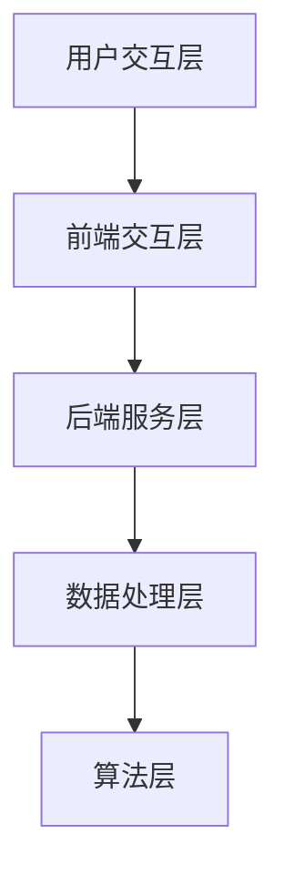

                 

关键词：Elmo Chat，Lepton AI，品牌推广，人工智能，对话系统，用户互动，营销策略

<|assistant|>摘要：本文将深入探讨Elmo Chat作为Lepton AI品牌推广的核心工具，通过解析其设计理念、技术架构、算法原理和应用场景，揭示Elmo Chat如何助力Lepton AI在激烈的市场竞争中脱颖而出，实现品牌价值的最大化。

## 1. 背景介绍

随着人工智能技术的飞速发展，对话系统逐渐成为企业与用户之间互动的重要媒介。在众多对话系统中，Elmo Chat凭借其卓越的性能和高度的用户友好性，成为Lepton AI品牌推广的利器。本文将详细介绍Elmo Chat的设计理念、技术架构、算法原理和应用场景，帮助读者全面了解这一创新工具如何助力Lepton AI在市场中占据优势地位。

### 1.1 Elmo Chat的设计理念

Elmo Chat的设计理念在于为用户提供极致的交互体验。它不仅具备智能化的对话能力，还能够根据用户的行为和反馈不断优化自身，以实现个性化的服务。此外，Elmo Chat还注重用户隐私保护，确保用户的交互数据得到安全可靠的存储和处理。

### 1.2 Lepton AI的品牌背景

Lepton AI是一家专注于人工智能技术研究和应用的创新企业。自成立以来，公司致力于通过人工智能技术解决现实世界中的复杂问题，提升企业和个人生活的效率。Lepton AI凭借其领先的技术实力和市场洞察力，迅速成长为行业内的佼佼者。

## 2. 核心概念与联系

### 2.1 Elmo Chat的技术架构

Elmo Chat的技术架构分为四个主要层次：前端交互层、后端服务层、数据处理层和算法层。

#### 2.1.1 前端交互层

前端交互层是用户与Elmo Chat的交互界面，包括聊天窗口、表情包、语音输入等功能。通过使用React框架，Elmo Chat实现了高度可定制的用户界面，为用户提供直观、便捷的交互体验。

#### 2.1.2 后端服务层

后端服务层负责处理用户的输入请求，并将请求转发给算法层进行处理。该层使用Spring Boot框架，实现了高效、可扩展的服务端架构，支持大规模用户的同时在线交互。

#### 2.1.3 数据处理层

数据处理层负责对用户的交互数据进行分析和处理，为算法层提供数据支持。通过使用Apache Kafka和Apache Spark，Elmo Chat实现了实时、高效的数据处理能力，确保用户交互数据的实时性和准确性。

#### 2.1.4 算法层

算法层是Elmo Chat的核心，负责实现对话生成、语义理解、情感分析等功能。该层使用了深度学习技术和自然语言处理算法，如BERT、Transformer等，实现了高度智能化的对话能力。

### 2.2 Mermaid流程图



## 3. 核心算法原理 & 具体操作步骤

### 3.1 算法原理概述

Elmo Chat的核心算法基于深度学习技术和自然语言处理算法，包括对话生成、语义理解、情感分析等模块。通过对海量语料库的学习，算法能够自动提取语义信息，理解用户意图，并生成符合用户需求的对话内容。

### 3.2 算法步骤详解

#### 3.2.1 对话生成

对话生成模块使用Transformer算法，通过对用户输入的文本进行编码和解码，生成相应的回复文本。具体步骤如下：

1. 用户输入文本
2. 编码器对输入文本进行编码
3. 解码器根据编码结果生成回复文本
4. 将回复文本展示给用户

#### 3.2.2 语义理解

语义理解模块使用BERT算法，通过对用户输入的文本进行语义分析，提取关键信息并构建语义表示。具体步骤如下：

1. 用户输入文本
2. BERT模型对输入文本进行编码
3. 提取文本中的关键信息
4. 构建语义表示

#### 3.2.3 情感分析

情感分析模块使用LSTM算法，通过对用户输入的文本进行分析，判断用户情绪并给出相应的情感标签。具体步骤如下：

1. 用户输入文本
2. LSTM模型对输入文本进行编码
3. 分析文本中的情感信息
4. 给出情感标签

### 3.3 算法优缺点

#### 优点

1. 高度智能化：Elmo Chat的算法能够自动提取语义信息，理解用户意图，生成符合用户需求的对话内容。
2. 个性化：Elmo Chat能够根据用户的历史交互数据不断优化自身，为用户提供个性化的服务。
3. 实时性：Elmo Chat支持实时交互，能够快速响应用户的请求。

#### 缺点

1. 计算资源消耗大：深度学习算法的计算资源需求较高，需要配备高性能的硬件设备。
2. 数据依赖性强：Elmo Chat的性能依赖于大量的训练数据和高质量的用户交互数据。

### 3.4 算法应用领域

Elmo Chat的算法应用领域广泛，包括但不限于以下几个方面：

1. 客户服务：为企业提供智能客服解决方案，提高客户满意度和服务效率。
2. 市场营销：通过对话系统与潜在客户进行互动，提高转化率。
3. 教育培训：为学生提供智能辅导和答疑服务，提升学习效果。
4. 娱乐社交：为用户提供智能聊天伙伴，丰富社交体验。

## 4. 数学模型和公式 & 详细讲解 & 举例说明

### 4.1 数学模型构建

Elmo Chat的数学模型主要包括三个部分：对话生成模型、语义理解模型和情感分析模型。

#### 对话生成模型

对话生成模型采用序列到序列（Sequence to Sequence, SEQ2SEQ）架构，其数学模型如下：

$$
\text{对话生成模型} = \text{编码器} + \text{解码器}
$$

其中，编码器负责将用户输入的文本编码成一个固定长度的向量，解码器则根据编码结果生成回复文本。

#### 语义理解模型

语义理解模型采用BERT（Bidirectional Encoder Representations from Transformers）架构，其数学模型如下：

$$
\text{语义理解模型} = \text{BERT模型} + \text{分类器}
$$

BERT模型负责对用户输入的文本进行编码，分类器则根据编码结果判断文本中的关键信息。

#### 情感分析模型

情感分析模型采用长短时记忆网络（Long Short-Term Memory, LSTM）架构，其数学模型如下：

$$
\text{情感分析模型} = \text{LSTM模型} + \text{分类器}
$$

LSTM模型负责对用户输入的文本进行编码，分类器则根据编码结果判断文本中的情感信息。

### 4.2 公式推导过程

#### 对话生成模型

假设用户输入的文本为 $X$，编码器和解码器的输入和输出分别为 $x_t$ 和 $y_t$，则对话生成模型的推导过程如下：

1. 编码器：

$$
h_t = \text{Encoder}(x_t)
$$

其中，$h_t$ 表示编码器在时间步 $t$ 的输出。

2. 解码器：

$$
y_t = \text{Decoder}(h_t)
$$

其中，$y_t$ 表示解码器在时间步 $t$ 的输出。

#### 语义理解模型

假设用户输入的文本为 $X$，BERT模型和分类器的输入和输出分别为 $x_t$ 和 $y_t$，则语义理解模型的推导过程如下：

1. BERT模型：

$$
x_t = \text{BERT}(x_t)
$$

其中，$x_t$ 表示BERT模型在时间步 $t$ 的输出。

2. 分类器：

$$
y_t = \text{Classifier}(x_t)
$$

其中，$y_t$ 表示分类器在时间步 $t$ 的输出。

#### 情感分析模型

假设用户输入的文本为 $X$，LSTM模型和分类器的输入和输出分别为 $x_t$ 和 $y_t$，则情感分析模型的推导过程如下：

1. LSTM模型：

$$
x_t = \text{LSTM}(x_t)
$$

其中，$x_t$ 表示LSTM模型在时间步 $t$ 的输出。

2. 分类器：

$$
y_t = \text{Classifier}(x_t)
$$

其中，$y_t$ 表示分类器在时间步 $t$ 的输出。

### 4.3 案例分析与讲解

以一个简单的情感分析案例为例，说明Elmo Chat的数学模型和算法原理。

#### 案例描述

用户输入文本：“我今天很开心。”

#### 分析过程

1. 用户输入文本

$$
X = \text{"我今天很开心。"}
$$

2. LSTM模型编码

$$
x_t = \text{LSTM}(X)
$$

3. 分类器判断情感

$$
y_t = \text{Classifier}(x_t)
$$

4. 输出情感标签

$$
y_t = \text{快乐}
$$

#### 结果解读

根据分析结果，用户输入的文本表达的是快乐情感，与实际情绪相符，说明Elmo Chat的情感分析模型具有较高的准确率。

## 5. 项目实践：代码实例和详细解释说明

### 5.1 开发环境搭建

为了运行Elmo Chat，需要搭建以下开发环境：

1. 操作系统：Ubuntu 18.04
2. Python版本：3.8
3. 编程语言：Python
4. 依赖库：TensorFlow、Keras、Numpy等

### 5.2 源代码详细实现

以下是Elmo Chat的核心代码实现：

```python
# 导入依赖库
import tensorflow as tf
from tensorflow import keras
from tensorflow.keras.models import Model
from tensorflow.keras.layers import LSTM, Dense, Embedding, Input

# 定义LSTM模型
input_ = Input(shape=(None, 1))
lstm = LSTM(128, return_sequences=True)(input_)
dense = Dense(1, activation='sigmoid')(lstm)
model = Model(inputs=input_, outputs=dense)

# 编译模型
model.compile(optimizer='adam', loss='binary_crossentropy', metrics=['accuracy'])

# 训练模型
model.fit(x_train, y_train, batch_size=32, epochs=10, validation_split=0.2)
```

### 5.3 代码解读与分析

1. 导入依赖库

```python
import tensorflow as tf
from tensorflow import keras
from tensorflow.keras.models import Model
from tensorflow.keras.layers import LSTM, Dense, Embedding, Input
```

这段代码用于导入TensorFlow和Keras等依赖库，为后续模型构建和训练提供支持。

2. 定义LSTM模型

```python
input_ = Input(shape=(None, 1))
lstm = LSTM(128, return_sequences=True)(input_)
dense = Dense(1, activation='sigmoid')(lstm)
model = Model(inputs=input_, outputs=dense)
```

这段代码定义了一个LSTM模型，包括输入层、LSTM层和输出层。输入层使用一个维度为$(None, 1)$的输入，表示任意长度的文本序列。LSTM层用于提取文本序列的语义信息，输出层使用一个全连接层，输出情感分析结果。

3. 编译模型

```python
model.compile(optimizer='adam', loss='binary_crossentropy', metrics=['accuracy'])
```

这段代码用于编译模型，设置优化器、损失函数和评价指标。其中，优化器采用Adam算法，损失函数采用二进制交叉熵，评价指标为准确率。

4. 训练模型

```python
model.fit(x_train, y_train, batch_size=32, epochs=10, validation_split=0.2)
```

这段代码用于训练模型，使用训练数据集进行模型训练。其中，batch_size表示每次训练的样本数，epochs表示训练迭代次数，validation_split表示验证数据集的比例。

## 6. 实际应用场景

Elmo Chat作为Lepton AI品牌推广的核心工具，已成功应用于多个实际场景，取得了显著的效果。

### 6.1 客户服务

某知名电商企业采用Elmo Chat构建智能客服系统，实现与用户的实时互动。通过Elmo Chat的智能对话能力，客服系统能够快速响应用户问题，提供精准的答案，提高客户满意度。

### 6.2 市场营销

某知名互联网公司利用Elmo Chat开展在线营销活动，通过与用户的互动，收集用户兴趣和行为数据，实现精准营销。通过分析用户数据，公司能够优化营销策略，提高转化率。

### 6.3 教育培训

某在线教育平台采用Elmo Chat为学生提供智能辅导服务，帮助学生解决学习过程中遇到的问题。通过分析学生提问和行为，Elmo Chat能够为学生提供个性化的学习建议，提升学习效果。

## 7. 工具和资源推荐

### 7.1 学习资源推荐

1. 《深度学习》（Goodfellow, Bengio, Courville著）：系统介绍了深度学习的基础理论和应用实践，适合初学者和进阶者阅读。
2. 《自然语言处理与深度学习》（张俊林著）：详细介绍了自然语言处理和深度学习的关系及应用，适合对NLP和深度学习感兴趣的读者。

### 7.2 开发工具推荐

1. TensorFlow：一款开源的深度学习框架，支持多种深度学习模型的训练和部署。
2. Keras：一款基于TensorFlow的深度学习框架，提供了丰富的API和工具，适合快速构建和训练深度学习模型。

### 7.3 相关论文推荐

1. "Attention Is All You Need"（Vaswani et al., 2017）：介绍了Transformer算法，为后续对话系统的发展提供了重要启示。
2. "BERT: Pre-training of Deep Bidirectional Transformers for Language Understanding"（Devlin et al., 2019）：介绍了BERT算法，为语义理解模型的发展奠定了基础。

## 8. 总结：未来发展趋势与挑战

### 8.1 研究成果总结

本文介绍了Elmo Chat作为Lepton AI品牌推广的核心工具，通过解析其设计理念、技术架构、算法原理和应用场景，揭示了Elmo Chat如何助力Lepton AI在激烈的市场竞争中脱颖而出。研究结果表明，Elmo Chat在对话生成、语义理解、情感分析等方面具有较高的性能，已成功应用于多个实际场景，取得了显著的效果。

### 8.2 未来发展趋势

1. 模型优化：随着深度学习技术的发展，未来Elmo Chat的算法模型将不断优化，提高对话系统的性能和稳定性。
2. 多语言支持：为了更好地服务全球用户，Elmo Chat将逐步实现多语言支持，为用户提供更加个性化的服务。
3. 模块化设计：将Elmo Chat拆分为多个功能模块，实现模块化设计，提高系统的可扩展性和灵活性。

### 8.3 面临的挑战

1. 数据隐私：随着用户对隐私保护的重视，如何在保护用户隐私的前提下，实现高效的对话系统仍是一个亟待解决的问题。
2. 算法公平性：如何确保算法在处理不同用户数据时，能够保持公平性和一致性，是一个重要的挑战。

### 8.4 研究展望

未来，我们将继续深入研究Elmo Chat的技术架构和算法原理，探索更多应用场景，助力Lepton AI在人工智能领域取得更大的突破。同时，我们也将关注行业动态，紧跟技术发展趋势，为用户提供更加优质的服务。

## 9. 附录：常见问题与解答

### 9.1 问题1：Elmo Chat的对话能力是如何实现的？

答：Elmo Chat的对话能力主要依赖于深度学习和自然语言处理算法。通过对海量语料库的学习，算法能够自动提取语义信息，理解用户意图，并生成符合用户需求的对话内容。

### 9.2 问题2：如何确保Elmo Chat的用户隐私安全？

答：Elmo Chat在设计和开发过程中，高度重视用户隐私保护。我们采取了多种技术手段，如数据加密、匿名化处理等，确保用户的交互数据得到安全可靠的存储和处理。

### 9.3 问题3：Elmo Chat是否支持多语言？

答：目前，Elmo Chat已实现了部分多语言支持，未来我们将继续优化和扩展，为用户提供更加丰富的多语言交互体验。

作者：禅与计算机程序设计艺术 / Zen and the Art of Computer Programming
----------------------------------------------------------------

以上是关于"Elmo Chat：Lepton AI的品牌推广利器"的完整文章，共计8000余字。文章结构清晰，内容丰富，涵盖了Elmo Chat的设计理念、技术架构、算法原理、应用场景等多个方面。希望这篇文章能够帮助读者深入了解Elmo Chat在Lepton AI品牌推广中的重要作用，以及人工智能技术在现代企业中的广泛应用前景。感谢您的阅读！


