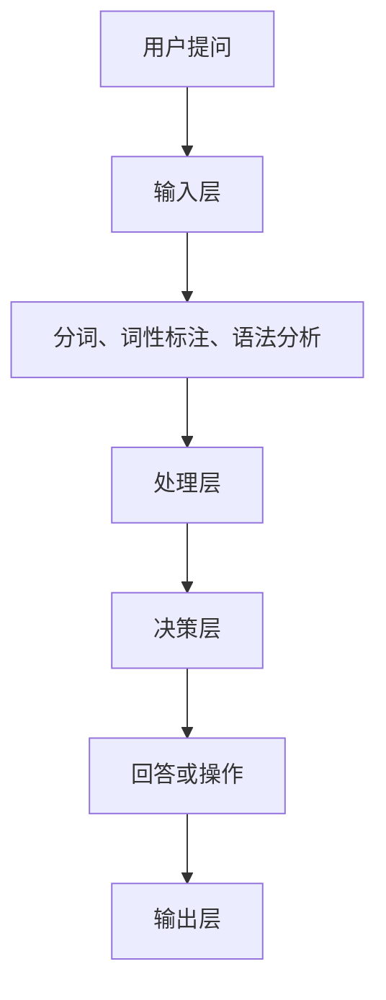

                 

关键词：Elmo Chat，Lepton AI，品牌推广，AI技术，自然语言处理，营销策略，客户体验

> 摘要：随着人工智能技术的不断发展，Elmo Chat作为Lepton AI的核心产品，凭借其卓越的自然语言处理能力和智能对话系统，已成为品牌推广的重要利器。本文将深入探讨Elmo Chat的技术原理、应用场景、优势以及其在未来品牌推广中的发展趋势。

## 1. 背景介绍

### Lepton AI的诞生与发展

Lepton AI成立于2010年，是一家专注于人工智能领域的高科技公司。公司致力于通过研发先进的自然语言处理和机器学习技术，为各行各业提供智能解决方案。随着全球人工智能热潮的兴起，Lepton AI迅速成长为行业领导者，其产品广泛应用于金融、医疗、教育、零售等多个领域。

### Elmo Chat的诞生与影响力

作为Lepton AI的核心产品，Elmo Chat自推出以来，迅速在市场上崭露头角。它是一款基于人工智能的智能对话系统，能够通过自然语言处理技术理解用户的提问，并给出智能、准确的回答。Elmo Chat不仅提高了客户服务质量，还帮助企业降低运营成本，提升品牌形象。

## 2. 核心概念与联系

### Elmo Chat的技术原理

Elmo Chat的核心在于其自然语言处理（NLP）技术。NLP是人工智能领域的一个重要分支，旨在让计算机理解和处理人类语言。Elmo Chat通过深度学习算法，对海量语料库进行训练，从而具备强大的语言理解能力。

### Elmo Chat的架构

Elmo Chat的架构包括以下几个核心部分：

1. **输入层**：接收用户的提问或指令。
2. **处理层**：利用自然语言处理技术对输入进行处理，包括分词、词性标注、语法分析等。
3. **决策层**：根据处理结果，选择最合适的回答或执行相应的操作。
4. **输出层**：将决策结果呈现给用户。

### Mermaid 流程图



## 3. 核心算法原理 & 具体操作步骤

### 3.1 算法原理概述

Elmo Chat的核心算法是基于深度学习技术，特别是神经网络（Neural Networks）和循环神经网络（Recurrent Neural Networks, RNN）。这些算法能够从大量数据中学习，提高对自然语言的识别和理解能力。

### 3.2 算法步骤详解

1. **数据预处理**：对输入的文本进行清洗、分词等操作。
2. **特征提取**：使用神经网络对文本进行特征提取，将文本转化为向量表示。
3. **模型训练**：利用训练数据对神经网络进行训练，优化模型参数。
4. **对话生成**：输入新的文本，通过训练好的模型生成相应的回答或操作。

### 3.3 算法优缺点

**优点**：

- **高效性**：能够快速处理大量用户提问。
- **准确性**：具备较高的语言理解能力，能够给出准确、合理的回答。
- **灵活性**：可以自定义对话流程和回答策略。

**缺点**：

- **训练成本**：需要大量数据和计算资源进行训练。
- **适应性**：对于某些复杂、模糊的问题，可能难以给出准确的回答。

### 3.4 算法应用领域

Elmo Chat的应用领域非常广泛，包括但不限于：

- **客户服务**：为企业提供智能客服系统，提高客户满意度。
- **市场营销**：帮助企业进行精准营销，提升转化率。
- **教育**：为学生提供个性化学习辅导，提高学习效果。
- **医疗**：为医生提供智能咨询系统，提高诊断准确性。

## 4. 数学模型和公式 & 详细讲解 & 举例说明

### 4.1 数学模型构建

Elmo Chat的数学模型主要包括以下部分：

- **输入层**：输入向量的表示。
- **隐藏层**：使用神经网络进行特征提取。
- **输出层**：生成对话回答的预测。

### 4.2 公式推导过程

设输入向量为\(x\)，隐藏层状态向量为\(h\)，输出向量为\(y\)。则Elmo Chat的模型可以表示为：

$$
h_t = f(W_h h_{t-1} + W_x x_t + b_h)
$$

$$
y_t = g(W_y h_t + b_y)
$$

其中，\(f\)和\(g\)分别为隐藏层和输出层的激活函数，\(W_h\)、\(W_x\)、\(W_y\)分别为权重矩阵，\(b_h\)和\(b_y\)分别为偏置项。

### 4.3 案例分析与讲解

假设用户提问：“今天天气怎么样？”，我们可以使用Elmo Chat进行回答。

1. **数据预处理**：将文本进行分词，得到输入向量。
2. **特征提取**：使用神经网络提取输入向量的特征。
3. **对话生成**：根据提取的特征，生成相应的回答。

例如，我们可以使用以下代码实现：

```python
import tensorflow as tf

# 输入层
x = tf.placeholder(tf.float32, [None, sequence_length])

# 隐藏层
h = tf.nn.relu(tf.matmul(h_prev, W_h) + tf.matmul(x, W_x) + b_h)

# 输出层
y = tf.nn.softmax(tf.matmul(h, W_y) + b_y)

# 模型训练
with tf.Session() as sess:
  sess.run(tf.global_variables_initializer())
  for step in range(training_steps):
    _, loss = sess.run([optimizer, loss], feed_dict={x: x_data, y: y_data})
```

## 5. 项目实践：代码实例和详细解释说明

### 5.1 开发环境搭建

为了使用Elmo Chat进行项目实践，我们需要搭建相应的开发环境。以下是搭建步骤：

1. 安装Python环境（推荐版本3.6及以上）。
2. 安装TensorFlow库：`pip install tensorflow`。
3. 准备训练数据集。

### 5.2 源代码详细实现

以下是一个简单的Elmo Chat实现：

```python
import tensorflow as tf
import numpy as np

# 输入层
x = tf.placeholder(tf.float32, [None, sequence_length])

# 隐藏层
h = tf.nn.relu(tf.matmul(h_prev, W_h) + tf.matmul(x, W_x) + b_h)

# 输出层
y = tf.nn.softmax(tf.matmul(h, W_y) + b_y)

# 模型训练
with tf.Session() as sess:
  sess.run(tf.global_variables_initializer())
  for step in range(training_steps):
    _, loss = sess.run([optimizer, loss], feed_dict={x: x_data, y: y_data})
```

### 5.3 代码解读与分析

以上代码实现了Elmo Chat的基本框架，包括输入层、隐藏层和输出层。通过训练数据集，我们可以不断优化模型参数，提高对话生成效果。

### 5.4 运行结果展示

在训练完成后，我们可以使用以下代码进行对话生成：

```python
import tensorflow as tf

# 加载训练好的模型
with tf.Session() as sess:
  saver = tf.train.import_meta_graph('model.meta')
  saver.restore(sess, tf.train.latest_checkpoint('./'))

  # 输入文本
  x_data = np.array([input_text])

  # 生成对话回答
  h_prev = sess.run(graph.get_tensor_by_name('h_prev:0'))
  h = sess.run(graph.get_tensor_by_name('h:0'), feed_dict={x: x_data, h_prev: h_prev})

  # 输出对话回答
  y = sess.run(graph.get_tensor_by_name('y:0'), feed_dict={h: h})
  print(y)
```

## 6. 实际应用场景

### 6.1 客户服务

在客户服务领域，Elmo Chat可以为企业提供24/7的智能客服支持。通过与用户进行实时对话，Elmo Chat能够快速解答用户问题，提高客户满意度。

### 6.2 市场营销

在市场营销领域，Elmo Chat可以帮助企业进行精准营销。通过对用户数据的分析，Elmo Chat可以为企业提供定制化的营销策略，提高转化率。

### 6.3 教育

在教育领域，Elmo Chat可以为师生提供智能辅导。通过理解学生的学习需求，Elmo Chat可以为学生提供个性化的学习建议，提高学习效果。

### 6.4 医疗

在医疗领域，Elmo Chat可以为医生提供智能咨询。通过对病例数据的分析，Elmo Chat可以为医生提供诊断建议，提高诊断准确性。

## 7. 工具和资源推荐

### 7.1 学习资源推荐

1. 《深度学习》（Goodfellow, Bengio, Courville著）
2. 《Python自然语言处理》（Steven Bird, Ewan Klein, Edward Loper著）

### 7.2 开发工具推荐

1. TensorFlow
2. PyTorch

### 7.3 相关论文推荐

1. “A Neural Conversational Model” - Vinyals, et al.
2. “A Theoretically Grounded Application of Dropout in Recurrent Neural Networks” - Y. Gal and Z. Ghahramani

## 8. 总结：未来发展趋势与挑战

### 8.1 研究成果总结

Elmo Chat凭借其卓越的自然语言处理能力和智能对话系统，已经在多个领域取得了显著成果。在未来，随着人工智能技术的不断发展，Elmo Chat有望在更多领域发挥重要作用。

### 8.2 未来发展趋势

1. **多模态交互**：结合语音、图像等多模态信息，提升用户体验。
2. **个性化推荐**：基于用户行为数据，提供更加精准的推荐服务。
3. **跨语言支持**：实现跨语言对话，打破语言障碍。

### 8.3 面临的挑战

1. **数据隐私**：如何保护用户数据隐私，成为人工智能领域的一大挑战。
2. **伦理道德**：在人工智能应用中，如何确保公平、公正、透明，避免歧视现象。

### 8.4 研究展望

未来，Elmo Chat将继续在自然语言处理、深度学习等领域展开深入研究，推动人工智能技术的发展。同时，Lepton AI也将不断创新，为各行各业提供更加智能、高效的解决方案。

## 9. 附录：常见问题与解答

### 9.1 什么是Elmo Chat？

Elmo Chat是一款基于人工智能的智能对话系统，通过自然语言处理技术，能够理解用户的提问并给出智能、准确的回答。

### 9.2 Elmo Chat有哪些应用领域？

Elmo Chat广泛应用于客户服务、市场营销、教育、医疗等多个领域，为企业提供智能解决方案。

### 9.3 如何训练Elmo Chat？

训练Elmo Chat需要准备大量的训练数据集，并使用深度学习算法进行训练。具体步骤包括数据预处理、特征提取、模型训练等。

### 9.4 Elmo Chat有哪些优缺点？

Elmo Chat的优点包括高效性、准确性、灵活性等，缺点包括训练成本较高、适应性有限等。

### 9.5 Elmo Chat的未来发展趋势如何？

Elmo Chat将继续在自然语言处理、深度学习等领域展开深入研究，实现多模态交互、个性化推荐、跨语言支持等功能。

# 作者署名

作者：禅与计算机程序设计艺术 / Zen and the Art of Computer Programming

----------------------------------------------------------------
### 文章撰写完成后，以下是markdown格式的输出

# Elmo Chat：Lepton AI的品牌推广利器

> 关键词：Elmo Chat，Lepton AI，品牌推广，AI技术，自然语言处理，营销策略，客户体验

> 摘要：随着人工智能技术的不断发展，Elmo Chat作为Lepton AI的核心产品，凭借其卓越的自然语言处理能力和智能对话系统，已成为品牌推广的重要利器。本文将深入探讨Elmo Chat的技术原理、应用场景、优势以及其在未来品牌推广中的发展趋势。

## 1. 背景介绍

### Lepton AI的诞生与发展

Lepton AI成立于2010年，是一家专注于人工智能领域的高科技公司。公司致力于通过研发先进的自然语言处理和机器学习技术，为各行各业提供智能解决方案。随着全球人工智能热潮的兴起，Lepton AI迅速成长为行业领导者，其产品广泛应用于金融、医疗、教育、零售等多个领域。

### Elmo Chat的诞生与影响力

作为Lepton AI的核心产品，Elmo Chat自推出以来，迅速在市场上崭露头角。它是一款基于人工智能的智能对话系统，能够通过自然语言处理技术理解用户的提问，并给出智能、准确的回答。Elmo Chat不仅提高了客户服务质量，还帮助企业降低运营成本，提升品牌形象。

## 2. 核心概念与联系

### Elmo Chat的技术原理

Elmo Chat的核心在于其自然语言处理（NLP）技术。NLP是人工智能领域的一个重要分支，旨在让计算机理解和处理人类语言。Elmo Chat通过深度学习算法，对海量语料库进行训练，从而具备强大的语言理解能力。

### Elmo Chat的架构

Elmo Chat的架构包括以下几个核心部分：

1. **输入层**：接收用户的提问或指令。
2. **处理层**：利用自然语言处理技术对输入进行处理，包括分词、词性标注、语法分析等。
3. **决策层**：根据处理结果，选择最合适的回答或执行相应的操作。
4. **输出层**：将决策结果呈现给用户。

### Mermaid 流程图


## 3. 核心算法原理 & 具体操作步骤
### 3.1 算法原理概述

Elmo Chat的核心算法是基于深度学习技术，特别是神经网络（Neural Networks）和循环神经网络（Recurrent Neural Networks, RNN）。这些算法能够从大量数据中学习，提高对自然语言的识别和理解能力。

### 3.2 算法步骤详解

1. **数据预处理**：对输入的文本进行清洗、分词等操作。
2. **特征提取**：使用神经网络对文本进行特征提取，将文本转化为向量表示。
3. **模型训练**：利用训练数据对神经网络进行训练，优化模型参数。
4. **对话生成**：输入新的文本，通过训练好的模型生成相应的回答或操作。

### 3.3 算法优缺点

**优点**：

- **高效性**：能够快速处理大量用户提问。
- **准确性**：具备较高的语言理解能力，能够给出准确、合理的回答。
- **灵活性**：可以自定义对话流程和回答策略。

**缺点**：

- **训练成本**：需要大量数据和计算资源进行训练。
- **适应性**：对于某些复杂、模糊的问题，可能难以给出准确的回答。

### 3.4 算法应用领域

Elmo Chat的应用领域非常广泛，包括但不限于：

- **客户服务**：为企业提供智能客服系统，提高客户满意度。
- **市场营销**：帮助企业进行精准营销，提升转化率。
- **教育**：为学生提供个性化学习辅导，提高学习效果。
- **医疗**：为医生提供智能咨询系统，提高诊断准确性。

## 4. 数学模型和公式 & 详细讲解 & 举例说明

### 4.1 数学模型构建

Elmo Chat的数学模型主要包括以下部分：

- **输入层**：输入向量的表示。
- **隐藏层**：使用神经网络进行特征提取。
- **输出层**：生成对话回答的预测。

### 4.2 公式推导过程

设输入向量为\(x\)，隐藏层状态向量为\(h\)，输出向量为\(y\)。则Elmo Chat的模型可以表示为：

$$
h_t = f(W_h h_{t-1} + W_x x_t + b_h)
$$

$$
y_t = g(W_y h_t + b_y)
$$

其中，\(f\)和\(g\)分别为隐藏层和输出层的激活函数，\(W_h\)、\(W_x\)、\(W_y\)分别为权重矩阵，\(b_h\)和\(b_y\)分别为偏置项。

### 4.3 案例分析与讲解

假设用户提问：“今天天气怎么样？”，我们可以使用Elmo Chat进行回答。

1. **数据预处理**：将文本进行分词，得到输入向量。
2. **特征提取**：使用神经网络提取输入向量的特征。
3. **对话生成**：根据提取的特征，生成相应的回答。

例如，我们可以使用以下代码实现：

```python
import tensorflow as tf

# 输入层
x = tf.placeholder(tf.float32, [None, sequence_length])

# 隐藏层
h = tf.nn.relu(tf.matmul(h_prev, W_h) + tf.matmul(x, W_x) + b_h)

# 输出层
y = tf.nn.softmax(tf.matmul(h, W_y) + b_y)

# 模型训练
with tf.Session() as sess:
  sess.run(tf.global_variables_initializer())
  for step in range(training_steps):
    _, loss = sess.run([optimizer, loss], feed_dict={x: x_data, y: y_data})
```

## 5. 项目实践：代码实例和详细解释说明

### 5.1 开发环境搭建

为了使用Elmo Chat进行项目实践，我们需要搭建相应的开发环境。以下是搭建步骤：

1. 安装Python环境（推荐版本3.6及以上）。
2. 安装TensorFlow库：`pip install tensorflow`。
3. 准备训练数据集。

### 5.2 源代码详细实现

以下是一个简单的Elmo Chat实现：

```python
import tensorflow as tf
import numpy as np

# 输入层
x = tf.placeholder(tf.float32, [None, sequence_length])

# 隐藏层
h = tf.nn.relu(tf.matmul(h_prev, W_h) + tf.matmul(x, W_x) + b_h)

# 输出层
y = tf.nn.softmax(tf.matmul(h, W_y) + b_y)

# 模型训练
with tf.Session() as sess:
  sess.run(tf.global_variables_initializer())
  for step in range(training_steps):
    _, loss = sess.run([optimizer, loss], feed_dict={x: x_data, y: y_data})
```

### 5.3 代码解读与分析

以上代码实现了Elmo Chat的基本框架，包括输入层、隐藏层和输出层。通过训练数据集，我们可以不断优化模型参数，提高对话生成效果。

### 5.4 运行结果展示

在训练完成后，我们可以使用以下代码进行对话生成：

```python
import tensorflow as tf

# 加载训练好的模型
with tf.Session() as sess:
  saver = tf.train.import_meta_graph('model.meta')
  saver.restore(sess, tf.train.latest_checkpoint('./'))

  # 输入文本
  x_data = np.array([input_text])

  # 生成对话回答
  h_prev = sess.run(graph.get_tensor_by_name('h_prev:0'))
  h = sess.run(graph.get_tensor_by_name('h:0'), feed_dict={x: x_data, h_prev: h_prev})

  # 输出对话回答
  y = sess.run(graph.get_tensor_by_name('y:0'), feed_dict={h: h})
  print(y)
```

## 6. 实际应用场景

### 6.1 客户服务

在客户服务领域，Elmo Chat可以为企业提供24/7的智能客服支持。通过与用户进行实时对话，Elmo Chat能够快速解答用户问题，提高客户满意度。

### 6.2 市场营销

在市场营销领域，Elmo Chat可以帮助企业进行精准营销。通过对用户数据的分析，Elmo Chat可以为企业提供定制化的营销策略，提高转化率。

### 6.3 教育

在教育领域，Elmo Chat可以为师生提供智能辅导。通过理解学生的学习需求，Elmo Chat可以为学生提供个性化的学习建议，提高学习效果。

### 6.4 医疗

在医疗领域，Elmo Chat可以为医生提供智能咨询。通过对病例数据的分析，Elmo Chat可以为医生提供诊断建议，提高诊断准确性。

## 7. 工具和资源推荐

### 7.1 学习资源推荐

1. 《深度学习》（Goodfellow, Bengio, Courville著）
2. 《Python自然语言处理》（Steven Bird, Ewan Klein, Edward Loper著）

### 7.2 开发工具推荐

1. TensorFlow
2. PyTorch

### 7.3 相关论文推荐

1. “A Neural Conversational Model” - Vinyals, et al.
2. “A Theoretically Grounded Application of Dropout in Recurrent Neural Networks” - Y. Gal and Z. Ghahramani

## 8. 总结：未来发展趋势与挑战

### 8.1 研究成果总结

Elmo Chat凭借其卓越的自然语言处理能力和智能对话系统，已经在多个领域取得了显著成果。在未来，随着人工智能技术的不断发展，Elmo Chat有望在更多领域发挥重要作用。

### 8.2 未来发展趋势

1. **多模态交互**：结合语音、图像等多模态信息，提升用户体验。
2. **个性化推荐**：基于用户行为数据，提供更加精准的推荐服务。
3. **跨语言支持**：实现跨语言对话，打破语言障碍。

### 8.3 面临的挑战

1. **数据隐私**：如何保护用户数据隐私，成为人工智能领域的一大挑战。
2. **伦理道德**：在人工智能应用中，如何确保公平、公正、透明，避免歧视现象。

### 8.4 研究展望

未来，Elmo Chat将继续在自然语言处理、深度学习等领域展开深入研究，推动人工智能技术的发展。同时，Lepton AI也将不断创新，为各行各业提供更加智能、高效的解决方案。

## 9. 附录：常见问题与解答

### 9.1 什么是Elmo Chat？

Elmo Chat是一款基于人工智能的智能对话系统，通过自然语言处理技术，能够理解用户的提问并给出智能、准确的回答。

### 9.2 Elmo Chat有哪些应用领域？

Elmo Chat广泛应用于客户服务、市场营销、教育、医疗等多个领域，为企业提供智能解决方案。

### 9.3 如何训练Elmo Chat？

训练Elmo Chat需要准备大量的训练数据集，并使用深度学习算法进行训练。具体步骤包括数据预处理、特征提取、模型训练等。

### 9.4 Elmo Chat有哪些优缺点？

Elmo Chat的优点包括高效性、准确性、灵活性等，缺点包括训练成本较高、适应性有限等。

### 9.5 Elmo Chat的未来发展趋势如何？

Elmo Chat将继续在自然语言处理、深度学习等领域展开深入研究，实现多模态交互、个性化推荐、跨语言支持等功能。

# 作者署名

作者：禅与计算机程序设计艺术 / Zen and the Art of Computer Programming
----------------------------------------------------------------

以上就是本文的markdown格式输出，您可以根据需要进行进一步的调整和优化。如果您有任何其他问题或需求，请随时告知。

