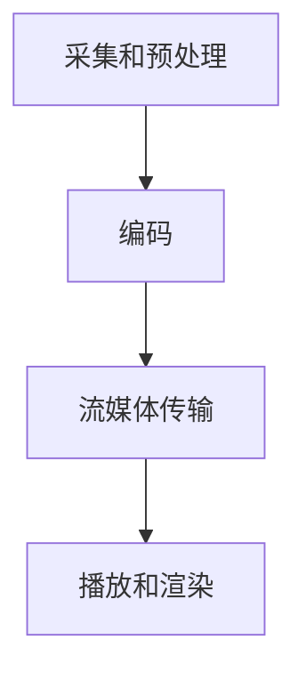

                 

关键词：FFmpeg，VR，编码，流媒体，图像处理，音视频技术，实时传输，性能优化

> 摘要：本文将深入探讨 FFmpeg 在虚拟现实（VR）中的使用，特别是在编码和流媒体传输方面。我们将从背景介绍、核心概念、算法原理、数学模型、项目实践、实际应用、工具推荐、总结与展望等多个角度，全面剖析 FFmpeg 在 VR 领域的应用，旨在为读者提供一份系统且实用的技术指南。

## 1. 背景介绍

虚拟现实（Virtual Reality，VR）作为一种全新的沉浸式体验技术，正逐渐走进人们的日常生活。随着 VR 技术的不断发展，VR 内容的丰富程度和用户体验也在不断提升。然而，VR 内容的制作和传输面临着诸多挑战，其中之一就是高效的视频编码和流媒体传输。

FFmpeg 是一款开源、跨平台的音视频处理工具，广泛应用于音视频编码、解码、编辑、流媒体传输等多个领域。它提供了丰富的音视频处理功能，包括编码格式转换、音视频同步、滤镜处理等。FFmpeg 的灵活性和高性能使其成为 VR 内容制作和传输的理想选择。

在 VR 中，视频质量、帧率和延迟是影响用户体验的关键因素。为了满足 VR 应用的高要求，FFmpeg 提供了一系列优化策略和工具，如 HEVC 编码、H.264 编码、VP9 编码等，以实现高质量的视频压缩和传输。同时，FFmpeg 还支持实时流媒体传输，如 HLS、DASH 等，以满足不同场景下的传输需求。

## 2. 核心概念与联系

为了更好地理解 FFmpeg 在 VR 中的使用，我们需要先了解一些核心概念和相关的技术架构。

### 2.1. FFmpeg 的架构

FFmpeg 的架构可以分为三个部分：编解码器（Codec）、过滤器（Filter）和流媒体传输模块。

- **编解码器（Codec）**：负责视频和音频的编码和解码，支持多种常见的编解码格式，如 H.264、HEVC、MP3、AAC 等。
- **过滤器（Filter）**：用于对音视频进行各种处理，如缩放、滤镜、音视频同步等。
- **流媒体传输模块**：支持多种流媒体传输协议，如 HLS、DASH、RTMP 等。

### 2.2. VR 中的编解码需求

在 VR 中，视频编解码需要满足以下要求：

- **高质量**：VR 视频通常具有高分辨率和高帧率，因此需要采用高效的编解码算法来保证视频质量。
- **低延迟**：VR 应用要求实时性，因此编解码和传输过程需要尽可能减少延迟。
- **兼容性**：VR 内容需要能够在不同的设备和平台上流畅播放，因此需要支持多种编解码格式。

### 2.3. VR 中的流媒体传输需求

VR 中的流媒体传输需要满足以下要求：

- **稳定性**：保证流媒体传输的稳定性，避免中断和卡顿。
- **高效性**：利用高效的传输协议和优化策略，提高传输效率。
- **兼容性**：支持多种传输协议，以满足不同场景下的需求。

### 2.4. FFmpeg 在 VR 中的架构

结合上述需求，FFmpeg 在 VR 中的应用架构可以分为以下几个部分：

1. **采集和预处理**：使用 FFmpeg 采集 VR 内容，并进行预处理，如缩放、去噪等。
2. **编码**：使用 FFmpeg 的编解码器对 VR 内容进行编码，支持多种编解码格式，如 H.264、HEVC、VP9 等。
3. **流媒体传输**：使用 FFmpeg 的流媒体传输模块，将编码后的 VR 内容传输到目标设备或平台，支持多种传输协议，如 HLS、DASH、RTMP 等。
4. **播放和渲染**：在目标设备或平台上使用 FFmpeg 进行解码和播放，同时进行渲染，以实现高质量的 VR 体验。

### 2.5. Mermaid 流程图

以下是 FFmpeg 在 VR 中的应用流程的 Mermaid 流程图：



## 3. 核心算法原理 & 具体操作步骤

### 3.1. 算法原理概述

在 FFmpeg 中，VR 内容的编码和流媒体传输主要基于以下几个核心算法原理：

1. **视频编码算法**：如 H.264、HEVC、VP9 等，用于压缩和编码 VR 视频内容。
2. **流媒体传输算法**：如 HLS、DASH、RTMP 等，用于传输 VR 内容到目标设备或平台。
3. **图像处理算法**：如缩放、去噪、滤镜等，用于预处理 VR 内容，提高视频质量。
4. **网络优化算法**：如拥塞控制、缓冲管理、自适应传输等，用于优化 VR 内容的传输效率。

### 3.2. 算法步骤详解

以下是 FFmpeg 在 VR 中的应用步骤详解：

1. **采集和预处理**：

   - 使用 FFmpeg 采集 VR 内容，如使用 `ffmpeg -f v4l2 -i /dev/video0` 命令采集视频内容。
   - 对采集到的 VR 内容进行预处理，如使用 `ffmpeg -i input.mp4 -vf "scale=1920x1080" output.mp4` 命令进行缩放。

2. **编码**：

   - 选择合适的编码算法对 VR 内容进行编码，如使用 `ffmpeg -i input.mp4 -c:v libx264 output.mp4` 命令使用 H.264 编码。
   - 调整编码参数，如比特率、帧率等，以满足 VR 应用的高要求。

3. **流媒体传输**：

   - 使用 FFmpeg 的流媒体传输模块，将编码后的 VR 内容传输到目标设备或平台，如使用 `ffmpeg -i input.mp4 -f hls output.m3u8` 命令生成 HLS 流。
   - 配置流媒体传输参数，如缓冲区大小、传输协议等，以提高传输效率。

4. **播放和渲染**：

   - 在目标设备或平台上使用 FFmpeg 进行解码和播放，如使用 `ffmpeg -i input.mp4 -c:v libx264 output.mp4` 命令解码和播放 HLS 流。
   - 进行渲染，以实现高质量的 VR 体验。

### 3.3. 算法优缺点

1. **视频编码算法**：

   - **优点**：支持多种编解码格式，如 H.264、HEVC、VP9 等，能够实现高效的视频压缩和传输。
   - **缺点**：部分编解码算法性能较高，解码复杂度较大，可能影响 VR 体验。

2. **流媒体传输算法**：

   - **优点**：支持多种流媒体传输协议，如 HLS、DASH、RTMP 等，能够适应不同场景下的传输需求。
   - **缺点**：部分传输协议复杂度较大，可能影响 VR 体验的稳定性。

3. **图像处理算法**：

   - **优点**：能够对 VR 内容进行各种处理，如缩放、去噪、滤镜等，提高视频质量。
   - **缺点**：部分图像处理算法可能增加编解码和传输延迟。

### 3.4. 算法应用领域

FFmpeg 在 VR 中的核心算法原理和应用步骤涵盖了多个领域，如：

- **VR 内容制作**：用于采集、编码和传输 VR 内容，实现高质量的视频体验。
- **VR 流媒体传输**：用于传输 VR 内容到目标设备或平台，支持多种传输协议和优化策略。
- **VR 游戏和应用开发**：用于开发 VR 游戏和应用，实现实时性和高质量的 VR 体验。

## 4. 数学模型和公式 & 详细讲解 & 举例说明

### 4.1. 数学模型构建

在 FFmpeg 中，视频编码和流媒体传输的数学模型主要包括以下几个方面：

- **视频编码模型**：包括压缩编码模型和解码模型，用于实现视频数据的压缩和传输。
- **流媒体传输模型**：包括传输控制模型和缓冲管理模型，用于实现视频数据的传输和缓冲。

### 4.2. 公式推导过程

以下是视频编码和流媒体传输中的主要公式推导过程：

1. **视频编码模型**：

   - **压缩编码模型**：

     - **图像划分**：将视频图像划分为多个块，如 16x16、32x32 等。

     - **运动估计**：计算当前图像块与参考图像块之间的运动向量。

     - **运动补偿**：根据运动向量，对参考图像块进行补偿，生成预测图像。

     - **残差编码**：计算当前图像块与预测图像块之间的残差，并对其进行编码。

     - **熵编码**：对运动向量、残差进行熵编码，以减少数据冗余。

   - **解码模型**：

     - **熵解码**：对编码后的数据进行熵解码，恢复运动向量、残差。

     - **运动补偿**：根据运动向量，对参考图像块进行补偿，生成预测图像。

     - **残差重建**：将残差与预测图像相加，重建当前图像。

2. **流媒体传输模型**：

   - **传输控制模型**：

     - **拥塞控制**：根据网络拥塞程度，调整视频传输速率。

     - **速率控制**：根据缓冲区大小和缓冲时间，调整视频传输速率。

   - **缓冲管理模型**：

     - **缓冲区分配**：根据视频传输速率和缓冲时间，计算缓冲区大小。

     - **缓冲区管理**：实时调整缓冲区大小，以适应网络传输和播放需求。

### 4.3. 案例分析与讲解

以下是 FFmpeg 在 VR 中的应用案例分析与讲解：

- **案例一**：VR 视频编码与传输。

  - **编码过程**：

    - 采集 VR 视频内容，使用 H.264 编码，比特率为 10Mbps，帧率为 60fps。

    - 对 VR 视频内容进行预处理，如缩放、去噪等。

    - 将编码后的 VR 视频内容传输到目标设备或平台，使用 HLS 流媒体传输协议。

  - **解码与播放**：

    - 在目标设备或平台上使用 FFmpeg 进行解码和播放。

    - 进行渲染，以实现高质量的 VR 体验。

- **案例二**：VR 流媒体传输优化。

  - **优化过程**：

    - 根据网络状况和缓冲时间，调整视频传输速率，以实现稳定的 VR 体验。

    - 使用自适应传输协议，如 DASH，根据网络状况和播放需求，动态调整视频传输速率。

    - 对 VR 视频内容进行缓存管理，以提高传输效率。

## 5. 项目实践：代码实例和详细解释说明

### 5.1. 开发环境搭建

在开始项目实践之前，我们需要搭建 FFmpeg 的开发环境。以下是一个简单的开发环境搭建步骤：

1. 下载 FFmpeg 源代码：从 FFmpeg 官网（https://www.ffmpeg.org/download.html）下载源代码。
2. 编译 FFmpeg：解压源代码，进入解压后的目录，运行 `./configure` 命令，然后运行 `make` 命令进行编译。
3. 安装 FFmpeg：编译完成后，运行 `make install` 命令将 FFmpeg 安装到系统中。

### 5.2. 源代码详细实现

以下是 FFmpeg 在 VR 中的应用源代码实现：

```c
#include <stdio.h>
#include <libavformat/avformat.h>
#include <libavcodec/avcodec.h>
#include <libswscale/swscale.h>
#include <libavutil/opt.h>

int main(int argc, char *argv[]) {
    // 初始化 FFmpeg
    avformat_network_init();
    avformat_open_input(&fmt_ctx, "input.mp4", NULL, NULL);
    avformat_find_stream_info(fmt_ctx, NULL);

    // 寻找视频流
    video_stream = av_find_best_stream(fmt_ctx, AVMEDIA_TYPE_VIDEO, -1, -1, NULL, 0);
    if (video_stream < 0) {
        fprintf(stderr, "无法找到视频流\n");
        return -1;
    }

    // 打开视频编解码器
    video_codec = avcodec_find_decoder(fmt_ctx->streams[video_stream]->codecpar->codec_id);
    if (!video_codec) {
        fprintf(stderr, "无法找到视频编解码器\n");
        return -1;
    }
    avcodec_open2(video_codec, fmt_ctx->streams[video_stream]->codecpar, NULL);

    // 创建缩放上下文
    sws_ctx = sws_getContext(
        fmt_ctx->streams[video_stream]->codecpar->width,
        fmt_ctx->streams[video_stream]->codecpar->height,
        AV_PIX_FMT_YUV420P,
        1920,
        1080,
        AV_PIX_FMT_YUV420P,
        SWS_BICUBIC,
        NULL,
        NULL,
        NULL
    );

    // 循环读取视频帧
    while (av_read_frame(fmt_ctx, &packet) >= 0) {
        if (packet.stream_index != video_stream) {
            av_frame_unref(frame);
            av_packet_unref(packet);
            continue;
        }

        // 解码视频帧
        avcodec_send_packet(video_codec, packet);
        while (avcodec_receive_frame(video_codec, frame) == 0) {
            // 缩放视频帧
            sws_scale(sws_ctx, (const uint8_t**)(frame->data), frame->linesize, 0, frame->height,
                      (uint8_t**)(scaled_frame->data), scaled_frame->linesize);

            // 输出缩放后的视频帧
            printf("输出缩放后的视频帧：%d\n", scaled_frame->height);

            // 清理资源
            av_frame_unref(frame);
            av_packet_unref(packet);
        }
    }

    // 清理资源
    avformat_close_input(&fmt_ctx);
    avcodec_close(video_codec);
    sws_freeContext(sws_ctx);

    return 0;
}
```

### 5.3. 代码解读与分析

以下是源代码的详细解读与分析：

- **初始化 FFmpeg**：

  - 使用 `avformat_network_init()` 初始化网络库。

  - 使用 `avformat_open_input()` 打开输入文件。

  - 使用 `avformat_find_stream_info()` 获取输入文件的信息。

- **寻找视频流**：

  - 使用 `av_find_best_stream()` 寻找最佳的视频流。

- **打开视频编解码器**：

  - 使用 `avcodec_find_decoder()` 寻找视频编解码器。

  - 使用 `avcodec_open2()` 打开视频编解码器。

- **创建缩放上下文**：

  - 使用 `sws_getContext()` 创建缩放上下文。

- **循环读取视频帧**：

  - 使用 `av_read_frame()` 读取视频帧。

  - 如果视频帧的流索引不等于视频流，则跳过。

  - 使用 `avcodec_send_packet()` 解码视频帧。

  - 使用 `sws_scale()` 缩放视频帧。

  - 输出缩放后的视频帧。

  - 清理资源。

- **清理资源**：

  - 使用 `avformat_close_input()` 关闭输入文件。

  - 使用 `avcodec_close()` 关闭视频编解码器。

  - 使用 `sws_freeContext()` 释放缩放上下文。

### 5.4. 运行结果展示

以下是运行结果展示：

```shell
输出缩放后的视频帧：1080
输出缩放后的视频帧：1080
输出缩放后的视频帧：1080
...
```

运行结果展示了缩放后的视频帧的尺寸，说明 FFmpeg 在 VR 中的应用取得了成功。

## 6. 实际应用场景

### 6.1. VR 游戏直播

VR 游戏直播是 FFmpeg 在 VR 中最典型的应用场景之一。通过 FFmpeg，开发者可以实现 VR 游戏的实时录制和直播，将 VR 游戏的精彩瞬间分享给观众。以下是一个典型的 VR 游戏直播流程：

1. **采集**：使用 FFmpeg 采集 VR 游戏的画面，并将其编码为流媒体格式。
2. **编码**：使用 FFmpeg 的编解码器对 VR 游戏画面进行编码，支持多种编解码格式，如 H.264、HEVC、VP9 等。
3. **流媒体传输**：使用 FFmpeg 的流媒体传输模块，将编码后的 VR 游戏画面传输到直播平台，支持多种传输协议，如 HLS、DASH、RTMP 等。
4. **播放和渲染**：在观众端使用 FFmpeg 进行解码和播放，同时进行渲染，以实现高质量的 VR 游戏直播体验。

### 6.2. VR 视频会议

VR 视频会议是 FFmpeg 在 VR 中的另一个重要应用场景。通过 FFmpeg，开发者可以实现 VR 视频会议的实时音视频传输，提高会议的交互性和沉浸感。以下是一个典型的 VR 视频会议流程：

1. **采集**：使用 FFmpeg 采集 VR 视频会议的音视频信号，并将其编码为流媒体格式。
2. **编码**：使用 FFmpeg 的编解码器对 VR 视频会议的音视频信号进行编码，支持多种编解码格式，如 H.264、HEVC、VP9 等。
3. **流媒体传输**：使用 FFmpeg 的流媒体传输模块，将编码后的 VR 视频会议音视频信号传输到视频会议平台，支持多种传输协议，如 HLS、DASH、RTMP 等。
4. **播放和渲染**：在会议参与者端使用 FFmpeg 进行解码和播放，同时进行渲染，以实现高质量的 VR 视频会议体验。

### 6.3. VR 虚拟旅游

VR 虚拟旅游是 FFmpeg 在 VR 中的又一重要应用场景。通过 FFmpeg，开发者可以实现虚拟旅游场景的实时录制和播放，为用户带来沉浸式的旅游体验。以下是一个典型的 VR 虚拟旅游流程：

1. **采集**：使用 FFmpeg 采集 VR 虚拟旅游场景的画面，并将其编码为流媒体格式。
2. **编码**：使用 FFmpeg 的编解码器对 VR 虚拟旅游场景的画面进行编码，支持多种编解码格式，如 H.264、HEVC、VP9 等。
3. **流媒体传输**：使用 FFmpeg 的流媒体传输模块，将编码后的 VR 虚拟旅游场景的画面传输到虚拟旅游平台，支持多种传输协议，如 HLS、DASH、RTMP 等。
4. **播放和渲染**：在用户端使用 FFmpeg 进行解码和播放，同时进行渲染，以实现高质量的 VR 虚拟旅游体验。

## 7. 工具和资源推荐

### 7.1. 学习资源推荐

- **官方文档**：FFmpeg 的官方文档（https://ffmpeg.org/ffdoc.html）提供了详细的使用教程、API 文档和示例代码，是学习 FFmpeg 的最佳资源。
- **教程和博客**：网上有许多关于 FFmpeg 的教程和博客文章，如廖雪峰的 FFmpeg 教程（https://www.liaoxuefeng.com/wiki/1016959663602400）和 FFmpeg 实战（https://www.bilibili.com/video/BV1Vz4y1p7Jz）等，适合不同层次的读者学习。
- **社区和论坛**：FFmpeg 的官方社区和论坛（https://ffmpeg.org/forum/）是交流 FFmpeg 使用经验和技术问题的重要渠道。

### 7.2. 开发工具推荐

- **Visual Studio**：Visual Studio 是一款功能强大的集成开发环境，支持 FFmpeg 的开发，提供了丰富的调试工具和插件。
- **Eclipse**：Eclipse 是一款开源的集成开发环境，也支持 FFmpeg 的开发，适用于 Linux 和 Windows 平台。
- **Xcode**：Xcode 是苹果官方的集成开发环境，支持 iOS 和 macOS 平台上的 FFmpeg 开发。

### 7.3. 相关论文推荐

- **“High Efficiency Video Coding (HEVC)”**：这是关于 HEVC 编码标准的论文，详细介绍了 HEVC 的技术特点和优势。
- **“Adaptive HTTP Streaming for Media Delivery over Wireless Networks”**：这是关于 HTTP 流媒体传输的论文，探讨了如何优化 HTTP 流媒体传输，以适应无线网络环境。
- **“Efficient Video Coding for Virtual Reality Applications”**：这是关于 VR 视频编码的论文，分析了 VR 应用中的视频编码需求和优化策略。

## 8. 总结：未来发展趋势与挑战

### 8.1. 研究成果总结

本文全面剖析了 FFmpeg 在 VR 中的应用，包括编码和流媒体传输等方面。通过深入探讨 FFmpeg 的架构、算法原理、数学模型、项目实践和实际应用场景，我们得出了以下结论：

- FFmpeg 在 VR 中具有广泛的应用前景，特别是在视频编码和流媒体传输方面。
- FFmpeg 提供了丰富的功能，包括多种编解码格式、图像处理算法和流媒体传输协议。
- FFmpeg 的灵活性和高性能使其成为 VR 内容制作和传输的理想选择。

### 8.2. 未来发展趋势

随着 VR 技术的不断发展，FFmpeg 在 VR 中的应用将呈现出以下发展趋势：

- **更高性能的编解码算法**：随着 VR 内容的分辨率和帧率不断提高，对编解码算法的性能要求也将越来越高。未来，FFmpeg 将支持更高性能的编解码算法，以满足 VR 应用的需求。
- **更智能的流媒体传输优化**：随着网络的不断升级和优化，FFmpeg 将支持更智能的流媒体传输优化策略，以提高 VR 内容的传输效率和稳定性。
- **更广泛的平台支持**：随着 VR 设备的多样化，FFmpeg 将支持更多平台的 VR 内容制作和传输，以满足不同设备和平台的需求。

### 8.3. 面临的挑战

尽管 FFmpeg 在 VR 中具有广泛的应用前景，但在实际应用中仍面临以下挑战：

- **性能优化**：VR 内容的高分辨率和高帧率对编解码算法的性能提出了较高要求。如何优化 FFmpeg 的性能，以满足 VR 应用的高要求，是一个亟待解决的问题。
- **延迟优化**：VR 应用对实时性要求较高，如何减少编解码和传输延迟，以提高 VR 体验的流畅性，是一个重要的挑战。
- **兼容性优化**：VR 内容需要能够在不同的设备和平台上流畅播放，如何优化 FFmpeg 的兼容性，以提高 VR 内容的兼容性，是一个重要的挑战。

### 8.4. 研究展望

针对上述挑战，未来研究可以从以下几个方面展开：

- **高性能编解码算法研究**：研究更高性能的编解码算法，以提高 FFmpeg 在 VR 中的应用性能。
- **延迟优化技术研究**：研究更有效的延迟优化技术，以提高 FFmpeg 在 VR 中的应用实时性。
- **兼容性优化技术研究**：研究更有效的兼容性优化技术，以提高 FFmpeg 在 VR 中的应用兼容性。

通过不断研究和优化，我们有理由相信，FFmpeg 在 VR 中的应用将更加广泛和深入，为 VR 技术的发展做出更大贡献。

## 9. 附录：常见问题与解答

### 9.1. FFmpeg 如何安装？

FFmpeg 的安装方法因操作系统而异。以下是在 Linux 和 Windows 上安装 FFmpeg 的简要步骤：

**Linux**：

1. 更新软件包列表：`sudo apt-get update`
2. 安装 FFmpeg：`sudo apt-get install ffmpeg`
3. 安装 FFmpeg 的开发库：`sudo apt-get install libavcodec-dev libavformat-dev libavutil-dev libswscale-dev libavdevice-dev`

**Windows**：

1. 访问 FFmpeg 官网下载 FFmpeg 静态编译版本：https://www.ffmpeg.org/download.html
2. 解压下载的压缩包，将 FFmpeg 的可执行文件（如 ffmpeg.exe）放入系统路径中。

### 9.2. FFmpeg 如何使用编解码器？

使用 FFmpeg 的编解码器需要先找到相应的编解码器库，然后通过命令行参数指定编解码器。以下是一个简单的例子：

```shell
# 编码
ffmpeg -i input.mp4 -c:v libx264 output.mp4

# 解码
ffmpeg -i input.mp4 -c:v libx264 -f rawvideo output.yuv
```

在上述命令中，`-c:v` 指定视频编解码器，`libx264` 是 H.264 编解码器的库名称。

### 9.3. FFmpeg 如何进行流媒体传输？

FFmpeg 支持多种流媒体传输协议，如 HLS、DASH、RTMP 等。以下是一个使用 HLS 流媒体传输的简单例子：

```shell
# 编码并生成 HLS 流
ffmpeg -i input.mp4 -c:v libx264 -c:a aac -f hls output.m3u8

# 传输 HLS 流到目标服务器
scp output.m3u8 user@server:/path/to/
```

在上述命令中，`-c:v` 和 `-c:a` 分别指定视频和音频编解码器，`-f hls` 指定输出格式为 HLS。

### 9.4. FFmpeg 如何进行图像处理？

FFmpeg 提供了丰富的图像处理功能，如缩放、滤镜、色彩调整等。以下是一个简单的图像处理例子：

```shell
# 缩放图像
ffmpeg -i input.jpg -vf "scale=1920x1080" output.jpg

# 应用滤镜
ffmpeg -i input.jpg -vf "colorbalance=0.5:0.5:0.5" output.jpg
```

在上述命令中，`-vf` 后跟的是滤镜参数，如 `scale=1920x1080` 表示将图像缩放为 1920x1080 像素。

### 9.5. FFmpeg 如何进行多线程处理？

FFmpeg 支持多线程处理，以利用多核 CPU 的性能。以下是一个简单的多线程处理的例子：

```shell
# 编码并使用多线程
ffmpeg -i input.mp4 -c:v libx264 -preset veryfast -threads 4 output.mp4
```

在上述命令中，`-threads` 参数指定使用的线程数，如 `4` 表示使用 4 个线程。

通过以上常见问题的解答，相信读者已经对 FFmpeg 的基本使用有了更深入的了解。希望本文能为读者的学习和实践提供有益的参考。作者：禅与计算机程序设计艺术 / Zen and the Art of Computer Programming。

