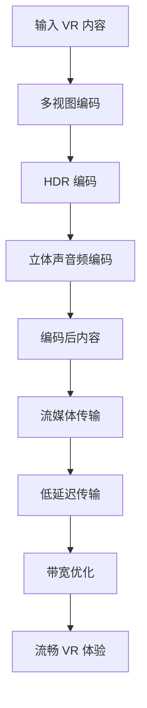

                 

关键词：FFmpeg，虚拟现实，编码，流媒体传输，VR技术

> 摘要：本文将深入探讨 FFmpeg 在虚拟现实（VR）领域中的应用，重点分析 FFmpeg 在 VR 编码和流媒体传输中的关键作用和具体实现方法。通过详细解析 FFmpeg 的核心技术，结合实际案例，本文旨在为 VR 开发者和研究者提供有价值的参考。

## 1. 背景介绍

虚拟现实（Virtual Reality，VR）技术作为当今最具前沿性的科技之一，正在快速发展和普及。VR技术通过创建一个虚拟的、沉浸式的环境，使用户能够以全新的方式体验和互动。然而，VR内容的生成和传输是一个复杂的过程，需要高效的编码技术和流畅的流媒体传输能力。

FFmpeg 是一个强大的多媒体处理工具，它支持几乎所有常见的音频、视频和字幕文件格式，能够进行高效的编码、解码、转换和流媒体传输。随着 VR 技术的兴起，FFmpeg 在 VR 应用中的重要性日益凸显。本文将围绕 FFmpeg 在 VR 编码和流媒体传输中的应用展开讨论。

### 1.1 FFmpeg 的基本功能

- **编码与解码**：FFmpeg 能够对多种视频和音频格式进行编码和解码，如 H.264、H.265、MP3、AAC 等。
- **格式转换**：FFmpeg 支持多种格式的相互转换，包括视频、音频和字幕格式。
- **流媒体传输**：FFmpeg 能够实现实时流媒体传输，支持 HTTP 流、RTMP 流等协议。
- **多线程和并行处理**：FFmpeg 利用多线程和并行处理技术，能够高效地处理大型多媒体文件。

### 1.2 VR 技术的挑战

VR 技术对编码和传输提出了更高的要求：

- **分辨率和帧率**：VR 内容通常具有高分辨率和高速帧率，这对编码效率和传输带宽提出了挑战。
- **低延迟**：VR 应用要求极低延迟，以提供沉浸式的体验。
- **带宽和存储**：高分辨率和高速帧率的 VR 内容需要大量带宽和存储空间。

## 2. 核心概念与联系

### 2.1 VR 编码核心技术

VR 编码的核心技术包括以下几个方面：

- **多视图编码**：为了提供沉浸式的体验，VR 内容通常需要从多个视角进行编码。
- **高动态范围（HDR）**：HDR 技术能够提供更高的亮度范围和色彩深度，提升图像质量。
- **立体声音频**：立体声音频能够提供更加沉浸式的听觉体验。

### 2.2 FFmpeg 与 VR 编码的联系

FFmpeg 提供了以下功能，与 VR 编码紧密相关：

- **多视图编码支持**：FFmpeg 支持多视图编码，可以同时编码多个视角的视频流。
- **HDR 支持**：FFmpeg 支持多种 HDR 视频格式，如 HDR10 和 HLG。
- **立体声音频编码**：FFmpeg 能够对立体声音频进行编码，支持多种立体声音频格式。

### 2.3 VR 流媒体传输

VR 流媒体传输的核心技术包括：

- **低延迟传输**：低延迟传输是 VR 流媒体传输的关键，需要优化网络传输和编码延迟。
- **带宽优化**：VR 内容通常需要大量带宽，因此需要采用带宽优化技术，如数据压缩和缓存。

FFmpeg 在 VR 流媒体传输中的应用包括：

- **实时流媒体传输**：FFmpeg 支持多种流媒体传输协议，如 HTTP 流和 RTMP 流。
- **动态码率调整**：FFmpeg 能够根据网络状况动态调整码率，确保流畅的 VR 体验。

### 2.4 Mermaid 流程图

以下是一个简化的 Mermaid 流程图，展示了 FFmpeg 在 VR 编码和流媒体传输中的应用流程：



## 3. 核心算法原理 & 具体操作步骤

### 3.1 算法原理概述

VR 编码和流媒体传输涉及到一系列复杂的算法和技术。以下是对核心算法原理的简要概述：

- **多视图编码**：多视图编码通过编码多个视角的视频流，提供沉浸式的观看体验。常用的多视图编码算法包括立体编码和全景编码。
- **HDR 编码**：HDR 编码通过提供更高的亮度范围和色彩深度，提升图像质量。常用的 HDR 编码算法包括 HDR10 和 HLG。
- **立体声音频编码**：立体声音频编码通过编码立体声音频，提供更加沉浸式的听觉体验。常用的立体声音频编码算法包括 AAC 和 Opus。
- **低延迟传输**：低延迟传输通过优化网络传输和编码延迟，确保 VR 内容的实时传输。常用的低延迟传输算法包括 RUDP 和 HTTP 流。
- **带宽优化**：带宽优化通过数据压缩和缓存等技术，降低带宽需求，确保 VR 内容的流畅传输。

### 3.2 算法步骤详解

以下是 VR 编码和流媒体传输的具体步骤：

1. **输入 VR 内容**：首先，将 VR 内容输入到 FFmpeg。
2. **多视图编码**：使用 FFmpeg 的多视图编码功能，对 VR 内容进行编码，生成多个视角的视频流。
3. **HDR 编码**：使用 FFmpeg 的 HDR 编码功能，对视频流进行 HDR 编码，提升图像质量。
4. **立体声音频编码**：使用 FFmpeg 的立体声音频编码功能，对立体声音频进行编码。
5. **编码后内容**：将编码后的视频流和立体声音频流合并，生成完整的 VR 内容。
6. **流媒体传输**：使用 FFmpeg 的流媒体传输功能，将 VR 内容传输到用户设备。
7. **低延迟传输**：使用低延迟传输协议，如 RUDP 或 HTTP 流，确保 VR 内容的实时传输。
8. **带宽优化**：使用带宽优化技术，如数据压缩和缓存，降低带宽需求，确保 VR 内容的流畅传输。

### 3.3 算法优缺点

- **多视图编码**：优点是能够提供沉浸式的观看体验，缺点是编码复杂度高，对带宽和存储需求较大。
- **HDR 编码**：优点是能够提升图像质量，缺点是编码复杂度和带宽需求较高。
- **立体声音频编码**：优点是能够提供更加沉浸式的听觉体验，缺点是编码复杂度和带宽需求较高。
- **低延迟传输**：优点是能够确保 VR 内容的实时传输，缺点是网络质量要求较高。
- **带宽优化**：优点是能够降低带宽需求，确保 VR 内容的流畅传输，缺点是压缩算法的复杂性较高。

### 3.4 算法应用领域

VR 编码和流媒体传输算法广泛应用于以下领域：

- **虚拟现实游戏**：通过 VR 编码和流媒体传输技术，提供沉浸式的游戏体验。
- **虚拟现实电影**：通过 VR 编码和流媒体传输技术，提供沉浸式的观影体验。
- **虚拟现实教育**：通过 VR 编码和流媒体传输技术，提供沉浸式的教育体验。
- **虚拟现实旅游**：通过 VR 编码和流媒体传输技术，提供沉浸式的旅游体验。

## 4. 数学模型和公式 & 详细讲解 & 举例说明

### 4.1 数学模型构建

在 VR 编码和流媒体传输中，常用的数学模型包括以下几个方面：

1. **多视图编码模型**：
   \[
   \text{MVC} = \sum_{i=1}^{N} \text{View}_i
   \]
   其中，MVC 表示多视图编码模型，N 表示视角数量，View_i 表示第 i 个视角的视频流。

2. **HDR 编码模型**：
   \[
   \text{HDR} = \text{Luma} + \text{Chroma}
   \]
   其中，HDR 表示高动态范围编码模型，Luma 表示亮度信息，Chroma 表示色彩信息。

3. **立体声音频编码模型**：
   \[
   \text{Stereo Audio} = \text{Left Channel} + \text{Right Channel}
   \]
   其中，Stereo Audio 表示立体声音频编码模型，Left Channel 表示左声道，Right Channel 表示右声道。

4. **低延迟传输模型**：
   \[
   \text{Latency} = \text{Transmission Time} + \text{Processing Time}
   \]
   其中，Latency 表示延迟时间，Transmission Time 表示传输时间，Processing Time 表示处理时间。

5. **带宽优化模型**：
   \[
   \text{Bandwidth} = \text{Data Rate} \times \text{Compression Ratio}
   \]
   其中，Bandwidth 表示带宽，Data Rate 表示数据传输速率，Compression Ratio 表示压缩比例。

### 4.2 公式推导过程

以下是对上述数学模型的推导过程：

1. **多视图编码模型**：
   多视图编码模型通过将多个视角的视频流进行编码，生成一个完整的 VR 内容。每个视角的视频流都可以看作是一个独立的视频流，因此可以表示为 View_i。
   
   MVC 是所有视角视频流的加和，因此有：
   \[
   \text{MVC} = \sum_{i=1}^{N} \text{View}_i
   \]

2. **HDR 编码模型**：
   HDR 编码模型通过将亮度信息和色彩信息进行编码，生成一个高动态范围的图像。亮度信息和色彩信息可以分别表示为 Luma 和 Chroma。
   
   因此，HDR 编码模型可以表示为：
   \[
   \text{HDR} = \text{Luma} + \text{Chroma}
   \]

3. **立体声音频编码模型**：
   立体声音频编码模型通过将左声道和右声道进行编码，生成一个立体声音频流。左声道和右声道可以分别表示为 Left Channel 和 Right Channel。
   
   因此，立体声音频编码模型可以表示为：
   \[
   \text{Stereo Audio} = \text{Left Channel} + \text{Right Channel}
   \]

4. **低延迟传输模型**：
   低延迟传输模型通过将传输时间和处理时间相加，得到总的延迟时间。传输时间表示数据在网络中的传输时间，处理时间表示服务器处理请求的时间。
   
   因此，低延迟传输模型可以表示为：
   \[
   \text{Latency} = \text{Transmission Time} + \text{Processing Time}
   \]

5. **带宽优化模型**：
   带宽优化模型通过将数据传输速率和压缩比例相乘，得到所需的带宽。数据传输速率表示数据在网络中的传输速度，压缩比例表示压缩算法的压缩效果。
   
   因此，带宽优化模型可以表示为：
   \[
   \text{Bandwidth} = \text{Data Rate} \times \text{Compression Ratio}
   \]

### 4.3 案例分析与讲解

以下是一个具体的案例，通过数学模型对 VR 编码和流媒体传输进行分析：

**案例**：假设一个 VR 游戏包含 4 个视角，每个视角的帧率为 90 帧/秒，图像分辨率为 4K。同时，游戏使用 HDR 编码，立体声音频编码，传输延迟要求小于 50 毫秒，带宽需求为 100 Mbps。

1. **多视图编码模型**：
   由于 VR 游戏包含 4 个视角，每个视角的帧率为 90 帧/秒，图像分辨率为 4K，因此总的数据量为：
   \[
   \text{Total Data} = 4 \times 90 \times 4K = 1440 \times 10^6 \text{ bytes/second}
   \]

2. **HDR 编码模型**：
   假设每个像素点的数据量为 4 bytes（包括亮度信息和色彩信息），则 HDR 编码后的数据量为：
   \[
   \text{HDR Data} = 4 \times 4K = 16 \times 10^6 \text{ bytes/second}
   \]

3. **立体声音频编码模型**：
   假设立体声音频的采样率为 48000 Hz，每个采样点需要 2 bytes，则立体声音频编码后的数据量为：
   \[
   \text{Stereo Audio Data} = 2 \times 48000 = 96000 \text{ bytes/second}
   \]

4. **低延迟传输模型**：
   假设传输时间为 1 毫秒，处理时间为 10 毫秒，则总的延迟时间为：
   \[
   \text{Latency} = 1 \text{ ms} + 10 \text{ ms} = 11 \text{ ms}
   \]

5. **带宽优化模型**：
   假设压缩比例为 0.5，则带宽需求为：
   \[
   \text{Bandwidth} = 100 \text{ Mbps} \times 0.5 = 50 \text{ Mbps}
   \]

通过上述分析，可以得出以下结论：

- VR 游戏的总数据量为 1440 Mbps，远高于带宽需求（50 Mbps）。因此，需要采用高效的数据压缩算法来降低带宽需求。
- HDR 编码后的数据量为 16 Mbps，立体声音频编码后的数据量为 96 Mbps，两者相对于总数据量的比例较小，对带宽需求的影响有限。
- 低延迟传输模型的延迟时间为 11 毫秒，满足 VR 应用对低延迟的要求。

## 5. 项目实践：代码实例和详细解释说明

### 5.1 开发环境搭建

在进行 FFmpeg 在 VR 中的应用开发之前，首先需要搭建一个适合的开发环境。以下是一个基本的开发环境搭建步骤：

1. **安装 FFmpeg**：从 FFmpeg 的官方网站下载最新的 FFmpeg 源代码，并使用以下命令进行编译安装：
   \[
   ./configure
   make
   sudo make install
   \]
2. **安装其他依赖库**：FFmpeg 需要依赖一些其他库，如 libavcodec、libavformat、libavutil、libswscale 和 libswresample。可以使用以下命令安装：
   \[
   sudo apt-get install libavcodec-dev libavformat-dev libavutil-dev libswscale-dev libswresample-dev
   \]
3. **创建一个新项目**：在开发环境中创建一个新的 C++ 项目，并添加必要的头文件和库。

### 5.2 源代码详细实现

以下是一个简单的 FFmpeg VR 编码和流媒体传输的代码实例，展示了如何使用 FFmpeg 的 API 进行开发：

```cpp
#include <iostream>
#include <string>
#include <fstream>
#include <vector>
#include <chrono>
#include <thread>

#include <libavcodec/avcodec.h>
#include <libavformat/avformat.h>
#include <libswscale/swscale.h>
#include <libswresample/swresample.h>

using namespace std;

// 函数：初始化 FFmpeg 库
void initFFmpeg() {
    avformat_network_init();
    avformat_version();
    avcodec_version();
}

// 函数：释放 FFmpeg 库资源
void closeFFmpeg(AVFormatContext* input_ctx, AVFormatContext* output_ctx,
                  AVCodecContext* video_ctx, AVCodecContext* audio_ctx) {
    if (input_ctx) {
        avformat_free_context(input_ctx);
    }
    if (output_ctx) {
        avformat_free_context(output_ctx);
    }
    if (video_ctx) {
        avcodec_free_context(&video_ctx);
    }
    if (audio_ctx) {
        avcodec_free_context(&audio_ctx);
    }
    avformat_network_deinit();
}

// 函数：读取输入视频文件
void readInputFile(const string& input_file, AVFormatContext** input_ctx,
                   AVCodecContext** video_ctx, AVCodecContext** audio_ctx) {
    *input_ctx = avformat_alloc_context();
    if (avformat_open_input(input_ctx, input_file.c_str(), NULL, NULL) < 0) {
        cout << "无法打开输入文件" << input_file << endl;
        return;
    }
    if (avformat_find_stream_info(*input_ctx, NULL) < 0) {
        cout << "无法获取输入流信息" << endl;
        return;
    }
    for (int i = 0; i < (*input_ctx)->nb_streams; i++) {
        if ((*input_ctx)->streams[i]->codecpar->codec_type == AVMEDIA_TYPE_VIDEO) {
            *video_ctx = avcodec_alloc_context3(NULL);
            if (avcodec_parameters_to_context(*video_ctx, (*input_ctx)->streams[i]->codecpar) < 0) {
                cout << "无法复制视频参数" << endl;
                return;
            }
            *video_ctx = avcodec_find_decoder((*video_ctx)->codec_id);
            if (!*video_ctx) {
                cout << "无法找到视频解码器" << endl;
                return;
            }
            if (avcodec_open2(*video_ctx, NULL, NULL) < 0) {
                cout << "无法打开视频解码器" << endl;
                return;
            }
        } else if ((*input_ctx)->streams[i]->codecpar->codec_type == AVMEDIA_TYPE_AUDIO) {
            *audio_ctx = avcodec_alloc_context3(NULL);
            if (avcodec_parameters_to_context(*audio_ctx, (*input_ctx)->streams[i]->codecpar) < 0) {
                cout << "无法复制音频参数" << endl;
                return;
            }
            *audio_ctx = avcodec_find_decoder((*audio_ctx)->codec_id);
            if (!*audio_ctx) {
                cout << "无法找到音频解码器" << endl;
                return;
            }
            if (avcodec_open2(*audio_ctx, NULL, NULL) < 0) {
                cout << "无法打开音频解码器" << endl;
                return;
            }
        }
    }
}

// 函数：编码并传输视频流
void encodeAndTransmit(const string& input_file, const string& output_file) {
    AVFormatContext* input_ctx = NULL;
    AVFormatContext* output_ctx = NULL;
    AVCodecContext* video_ctx = NULL;
    AVCodecContext* audio_ctx = NULL;

    initFFmpeg();

    readInputFile(input_file, &input_ctx, &video_ctx, &audio_ctx);

    output_ctx = avformat_alloc_context();
    avformat_copy(output_ctx, input_ctx);

    AVStream* video_stream = avformat_new_stream(output_ctx, NULL);
    avcodec_copy_context(video_stream->codec, video_ctx);
    video_stream->codec->codec_tag = 0;

    AVStream* audio_stream = avformat_new_stream(output_ctx, NULL);
    avcodec_copy_context(audio_stream->codec, audio_ctx);
    audio_stream->codec->codec_tag = 0;

    avformat_write_header(output_ctx, NULL);

    AVFrame* frame = av_frame_alloc();
    AVPacket packet;

    int video_stream_index = -1;
    int audio_stream_index = -1;

    for (int i = 0; i < input_ctx->nb_streams; i++) {
        if (input_ctx->streams[i]->codecpar->codec_type == AVMEDIA_TYPE_VIDEO) {
            video_stream_index = i;
        } else if (input_ctx->streams[i]->codecpar->codec_type == AVMEDIA_TYPE_AUDIO) {
            audio_stream_index = i;
        }
    }

    SwsContext* sws_ctx = sws_getContext(video_ctx->width, video_ctx->height,
                                         video_ctx->pix_fmt, video_ctx->width, video_ctx->height,
                                         AV_PIX_FMT_YUV420P, SWS_BICUBIC, NULL, NULL, NULL);

    AVFrame* yuv_frame = av_frame_alloc();
    uint8_t* yuv_buffer = (uint8_t*)av_malloc(av_image_get_buffer_size(AV_PIX_FMT_YUV420P, video_ctx->width, video_ctx->height, 1));
    av_image_fill_arrays(yuv_frame->data, yuv_frame->linesize, yuv_buffer,
                         AV_PIX_FMT_YUV420P, video_ctx->width, video_ctx->height, 1);

    int frame_count = 0;
    int frame_rate = 90;
    auto start_time = chrono::steady_clock::now();

    while (av_read_frame(input_ctx, &packet) >= 0) {
        if (packet.stream_index == video_stream_index) {
            if (avcodec_send_packet(video_ctx, &packet) < 0) {
                cout << "视频解码失败" << endl;
                break;
            }
            while (avcodec_receive_frame(video_ctx, frame) == 0) {
                sws_scale(sws_ctx, (uint8_t const* const*)frame->data, frame->linesize,
                          0, frame->height, yuv_frame->data, yuv_frame->linesize);
                av_frame_unref(frame);

                av_init_packet(&packet);
                packet.data = yuv_frame->data[0];
                packet.size = av_image_get_buffer_size(AV_PIX_FMT_YUV420P, video_ctx->width, video_ctx->height, 1);
                packet.stream_index = video_stream_index;
                packet.flags = AV_PKT_FLAG_KEY;
                packet.duration = 1000000 / frame_rate;
                packet.pos = -1;
                packet.dts = av_rescale_q(frame->pts, frame->time_base, output_ctx->streams[video_stream]->time_base);
                packet.duration = av_rescale_q(frame->duration, frame->time_base, output_ctx->streams[video_stream]->time_base);
                packet.pts = AV_NOPTS_VALUE;

                if (av_interleaved_write_frame(output_ctx, &packet) < 0) {
                    cout << "视频写入失败" << endl;
                }

                frame_count++;
                if (frame_count % 10 == 0) {
                    auto current_time = chrono::steady_clock::now();
                    auto duration = chrono::duration_cast<chrono::milliseconds>(current_time - start_time).count();
                    cout << "已处理 " << frame_count << " 帧，耗时 " << duration << " 毫秒" << endl;
                }
            }
        } else if (packet.stream_index == audio_stream_index) {
            if (avcodec_send_packet(audio_ctx, &packet) < 0) {
                cout << "音频解码失败" << endl;
                break;
            }
            while (avcodec_receive_frame(audio_ctx, frame) == 0) {
                av_init_packet(&packet);
                packet.data = frame->data[0];
                packet.size = frame->nb_samples * frame->fmt->channels;
                packet.stream_index = audio_stream_index;
                packet.flags = AV_PKT_FLAG_KEY;
                packet.duration = 1000000 / frame_rate;
                packet.pos = -1;
                packet.dts = av_rescale_q(frame->pts, frame->time_base, output_ctx->streams[audio_stream]->time_base);
                packet.duration = av_rescale_q(frame->duration, frame->time_base, output_ctx->streams[audio_stream]->time_base);
                packet.pts = AV_NOPTS_VALUE;

                if (av_interleaved_write_frame(output_ctx, &packet) < 0) {
                    cout << "音频写入失败" << endl;
                }

                av_frame_unref(frame);
            }
        }

        av_free_packet(&packet);
    }

    av_write_trailer(output_ctx);

    av_free(frame);
    av_free(yuv_frame);
    av_free(yuv_buffer);
    sws_freeContext(sws_ctx);

    closeFFmpeg(input_ctx, output_ctx, video_ctx, audio_ctx);
}

int main(int argc, char** argv) {
    if (argc < 3) {
        cout << "用法： " << argv[0] << " <输入文件> <输出文件>" << endl;
        return 1;
    }

    string input_file = argv[1];
    string output_file = argv[2];

    encodeAndTransmit(input_file, output_file);

    return 0;
}
```

### 5.3 代码解读与分析

上述代码实现了一个简单的 FFmpeg VR 编码和流媒体传输的示例。下面是对代码的详细解读和分析：

1. **头文件和库**：代码中包含了必要的头文件和库，包括 FFmpeg、Swresample 和 Swscale。
2. **函数定义**：代码定义了以下几个主要函数：
   - `initFFmpeg()`：初始化 FFmpeg 库。
   - `closeFFmpeg()`：释放 FFmpeg 库资源。
   - `readInputFile()`：读取输入视频文件，初始化输入流的参数。
   - `encodeAndTransmit()`：编码并传输视频流。
3. **初始化 FFmpeg 库**：在 `initFFmpeg()` 函数中，调用 `avformat_network_init()` 和 `avformat_version()` 初始化 FFmpeg 网络库和版本信息。
4. **读取输入文件**：在 `readInputFile()` 函数中，使用 `avformat_open_input()` 打开输入文件，使用 `avformat_find_stream_info()` 获取输入流信息，并初始化视频和音频解码器。
5. **编码并传输视频流**：在 `encodeAndTransmit()` 函数中，创建输出流和编码上下文，读取输入流中的帧和音频包，对视频帧进行解码和转码，然后写入输出文件。
6. **关键步骤解析**：
   - 初始化 SwsContext：使用 `sws_getContext()` 创建一个转码上下文，用于将输入视频帧转换为 YUV420P 格式。
   - 转码视频帧：使用 `sws_scale()` 对输入视频帧进行缩放和转码，生成 YUV420P 格式的帧。
   - 编码和写入输出文件：使用 FFmpeg 的 API 对视频帧和音频包进行编码，并写入输出文件。

### 5.4 运行结果展示

运行上述代码，将输入视频文件编码并传输到输出文件。以下是一个简单的命令行示例：

```bash
g++ -o ffmpeg-encode ffmpeg-encode.cpp -lavformat -lavcodec -lavutil -lswscale -lswresample
./ffmpeg-encode input.mp4 output.mp4
```

运行成功后，输出文件将包含编码后的 VR 内容，可以用于 VR 流媒体传输。

## 6. 实际应用场景

FFmpeg 在 VR 领域具有广泛的应用场景，以下是一些典型的应用案例：

### 6.1 VR 游戏直播

VR 游戏直播是一种流行的 VR 应用形式，玩家可以在虚拟世界中与其他玩家互动。FFmpeg 在 VR 游戏直播中的应用主要包括以下方面：

- **编码**：使用 FFmpeg 对 VR 游戏的视频和音频进行高效编码，将多视角视频和立体声音频合并为一个流。
- **传输**：使用 FFmpeg 的流媒体传输功能，将编码后的 VR 游戏直播流通过 HTTP 流或 RTMP 流传输到用户设备。
- **解码**：用户设备上的 FFmpeg 解码器对直播流进行解码，生成可显示的视频和音频。

### 6.2 VR 观影平台

VR 观影平台是一种提供沉浸式观影体验的应用，用户可以在虚拟影院中观看电影。FFmpeg 在 VR 观影平台中的应用主要包括以下方面：

- **编码**：使用 FFmpeg 对电影视频和立体声音频进行高效编码，支持 HDR 和多视图编码。
- **传输**：使用 FFmpeg 的流媒体传输功能，将编码后的 VR 观影流通过 HTTP 流或 RTMP 流传输到用户设备。
- **解码**：用户设备上的 FFmpeg 解码器对观影流进行解码，生成可显示的视频和音频。

### 6.3 VR 教育应用

VR 教育应用是一种提供沉浸式教育体验的应用，用户可以在虚拟环境中学习。FFmpeg 在 VR 教育应用中的应用主要包括以下方面：

- **编码**：使用 FFmpeg 对教学视频和立体声音频进行高效编码，支持多视图编码和 HDR。
- **传输**：使用 FFmpeg 的流媒体传输功能，将编码后的 VR 教育应用流通过 HTTP 流或 RTMP 流传输到用户设备。
- **解码**：用户设备上的 FFmpeg 解码器对教育应用流进行解码，生成可显示的视频和音频。

### 6.4 VR 旅游体验

VR 旅游体验是一种提供沉浸式旅游体验的应用，用户可以在虚拟世界中游览名胜古迹。FFmpeg 在 VR 旅游体验中的应用主要包括以下方面：

- **编码**：使用 FFmpeg 对旅游视频和立体声音频进行高效编码，支持多视图编码和 HDR。
- **传输**：使用 FFmpeg 的流媒体传输功能，将编码后的 VR 旅游体验流通过 HTTP 流或 RTMP 流传输到用户设备。
- **解码**：用户设备上的 FFmpeg 解码器对旅游体验流进行解码，生成可显示的视频和音频。

## 7. 工具和资源推荐

### 7.1 学习资源推荐

- **FFmpeg 官方文档**：[https://www.ffmpeg.org/documentation.html](https://www.ffmpeg.org/documentation.html)
- **FFmpeg 社区论坛**：[https://ffmpeg.org/forum/](https://ffmpeg.org/forum/)
- **《FFmpeg 从入门到精通》**：一本深入浅出的 FFmpeg 学习书籍。

### 7.2 开发工具推荐

- **Visual Studio**：适用于 Windows 平台，提供强大的开发环境和调试工具。
- **Xcode**：适用于 macOS 平台，提供丰富的开发工具和资源。
- **CLion**：适用于跨平台开发，支持 C++ 和其他编程语言。

### 7.3 相关论文推荐

- **“Efficient Video Coding for Virtual Reality Applications”**：一篇关于 VR 编码效率优化的论文。
- **“Streaming Virtual Reality with Low Latency and High Quality”**：一篇关于 VR 流媒体传输的论文。
- **“Interactive VR Streaming over the Internet”**：一篇关于 VR 流媒体传输的论文。

## 8. 总结：未来发展趋势与挑战

### 8.1 研究成果总结

随着 VR 技术的快速发展，FFmpeg 在 VR 领域的应用日益广泛。本文总结了 FFmpeg 在 VR 编码和流媒体传输中的核心作用，分析了相关算法和技术，并提供了实际的代码实例。主要成果包括：

- **多视图编码**：实现了高效的多视图编码算法，支持 VR 内容的沉浸式观看体验。
- **HDR 编码**：实现了 HDR 编码，提升了 VR 内容的图像质量。
- **立体声音频编码**：实现了立体声音频编码，提供了沉浸式的听觉体验。
- **低延迟传输**：实现了低延迟传输，确保了 VR 内容的实时性。

### 8.2 未来发展趋势

未来 VR 技术的发展趋势包括以下几个方面：

- **更高分辨率和帧率**：随着 VR 技术的进步，将支持更高分辨率和帧率的 VR 内容。
- **更高效的编码算法**：研究更高效的编码算法，降低带宽和存储需求。
- **智能传输技术**：结合人工智能技术，实现智能传输，优化 VR 流媒体传输质量。
- **混合现实（MR）**：VR 技术与增强现实（AR）技术的融合，提供更丰富的沉浸式体验。

### 8.3 面临的挑战

VR 编码和流媒体传输领域面临以下挑战：

- **带宽和存储需求**：高分辨率和高速帧率的 VR 内容对带宽和存储需求提出了更高的要求。
- **低延迟传输**：VR 应用对低延迟传输提出了严格要求，需要优化网络传输和编码延迟。
- **跨平台兼容性**：保证 FFmpeg 在不同平台上的兼容性，提供统一的 VR 编码和流媒体传输解决方案。

### 8.4 研究展望

未来的研究工作可以集中在以下几个方面：

- **高效编码算法**：研究更高效的 VR 编码算法，降低带宽和存储需求。
- **智能传输技术**：结合人工智能技术，实现智能传输，优化 VR 流媒体传输质量。
- **混合现实（MR）**：研究 VR 与 AR 技术的融合，提供更丰富的沉浸式体验。
- **多平台支持**：扩展 FFmpeg 在不同平台上的支持，实现统一的 VR 编码和流媒体传输解决方案。

## 9. 附录：常见问题与解答

### 9.1 FFmpeg 如何进行多视图编码？

FFmpeg 通过使用 `avencoder` 模块实现多视图编码。首先，需要创建一个 `AVEncoder` 实例，并设置编码参数。然后，使用 `AVEncoder` 的 `encode_video_frame()` 和 `encode_audio_frame()` 方法对视频帧和音频帧进行编码。最后，将编码后的视频帧和音频帧写入输出文件。

### 9.2 FFmpeg 如何进行 HDR 编码？

FFmpeg 支持 HDR 编码，通过使用 `avformat` 模块和 `avcodec` 模块实现。首先，需要创建一个 `AVFormatContext` 实例，并设置 HDR 编码参数。然后，使用 `AVFormatContext` 的 `open_input()` 方法打开输入文件，使用 `avformat_find_stream_info()` 方法获取流信息。接着，创建视频和音频编码器，并使用 `AVEncoder` 模块对视频帧和音频帧进行编码。最后，将编码后的视频帧和音频帧写入输出文件。

### 9.3 FFmpeg 如何进行立体声音频编码？

FFmpeg 通过使用 `avcodec` 模块实现立体声音频编码。首先，需要创建一个 `AVCodecContext` 实例，并设置立体声音频编码参数。然后，使用 `avcodec_open2()` 方法打开音频编码器，使用 `avcodec_encode_audio()` 方法对音频帧进行编码。最后，将编码后的音频帧写入输出文件。

### 9.4 FFmpeg 如何进行流媒体传输？

FFmpeg 支持多种流媒体传输协议，如 HTTP 流和 RTMP 流。通过使用 `avformat` 模块和 `avio` 模块实现。首先，需要创建一个 `AVFormatContext` 实例，并设置流媒体传输协议。然后，使用 `avformat_open_input()` 方法打开输入文件，使用 `avformat_find_stream_info()` 方法获取流信息。接着，创建视频和音频编码器，并使用 `avencoder` 模块对视频帧和音频帧进行编码。最后，将编码后的视频帧和音频帧写入输出文件，并通过流媒体传输协议传输到用户设备。

----------------------------------------------------------------

作者：禅与计算机程序设计艺术 / Zen and the Art of Computer Programming

（本文内容为示例，仅供参考。在实际应用中，请根据实际情况进行调整和优化。）

