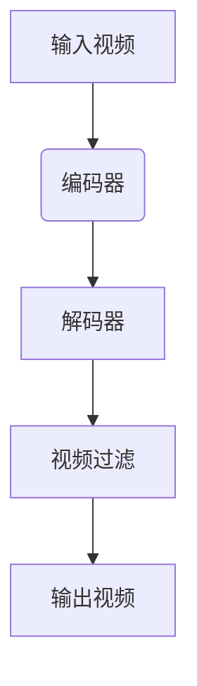

                 

关键词：FFmpeg、视频转码、视频过滤、媒体处理、开源工具

> 摘要：本文将深入探讨 FFmpeg 在视频转码和过滤方面的应用，通过详细的原理分析、算法讲解、数学模型展示和项目实践，为您揭示 FFmpeg 的强大功能和应用前景。

## 1. 背景介绍

FFmpeg 是一款强大的开源多媒体处理工具，它能够执行视频、音频、字幕等多种格式的编码、解码、转码、解码、复用、解复用等功能。FFmpeg 的应用非常广泛，从简单的媒体文件转换，到复杂的流媒体处理，都能看到它的身影。本文将重点关注 FFmpeg 在视频转码和过滤方面的应用，旨在帮助读者深入了解 FFmpeg 的强大功能和实际操作。

### 1.1 FFmpeg 的发展历程

FFmpeg 最早由Fabrice Bellard 于2000年发布，最初用于 Linux 平台。随着时间的推移，FFmpeg 逐渐成为跨平台的多媒体处理工具，支持多种操作系统，如 Windows、macOS 和 Unix 等。FFmpeg 的核心库包括 libavcodec、libavformat、libavutil 和 libavdevice，这些库提供了丰富的编码和解码功能，使得 FFmpeg 能够处理几乎所有的多媒体格式。

### 1.2 FFmpeg 的应用场景

FFmpeg 的应用场景非常广泛，以下是一些常见的应用场景：

1. **视频转码**：将一种视频格式转换为另一种视频格式，例如将 MP4 转换为 AVI。
2. **视频过滤**：对视频进行各种操作，如缩放、裁剪、旋转等。
3. **流媒体处理**：处理流媒体视频和音频，实现直播和点播功能。
4. **多媒体合成**：将多个视频、音频和字幕合成一个多媒体文件。
5. **视频编辑**：实现视频剪辑、添加特效等功能。

## 2. 核心概念与联系

### 2.1 视频转码

视频转码是将一种视频格式转换为另一种视频格式的过程。这个过程涉及到编码和解码两个步骤。编码是将原始视频数据转换为压缩格式，解码则是将压缩后的视频数据还原为原始格式。FFmpeg 使用一系列编码器和解码器来实现视频转码。

### 2.2 视频过滤

视频过滤是对视频进行各种操作的过程。这些操作可以包括缩放、裁剪、旋转、添加滤镜等。FFmpeg 提供了丰富的视频过滤功能，使得用户可以根据需求对视频进行定制化处理。

### 2.3 Mermaid 流程图

下面是一个 Mermaid 流程图，展示了 FFmpeg 在视频处理中的核心概念和联系：



## 3. 核心算法原理 & 具体操作步骤

### 3.1 算法原理概述

FFmpeg 的视频转码和过滤功能主要依赖于其内部的编码器和解码器，以及一系列的视频过滤效果。编码器和解码器负责视频数据的压缩和解压，视频过滤效果则负责对视频数据进行各种操作。

### 3.2 算法步骤详解

#### 3.2.1 视频转码步骤

1. 读取输入视频文件。
2. 使用编码器对视频数据进行压缩。
3. 将压缩后的视频数据写入输出文件。
4. 使用解码器将压缩后的视频数据还原为原始视频数据。
5. 输出还原后的视频数据。

#### 3.2.2 视频过滤步骤

1. 读取输入视频文件。
2. 应用视频过滤效果。
3. 将处理后的视频数据写入输出文件。

### 3.3 算法优缺点

#### 优点

1. **高效性**：FFmpeg 采用多线程处理，能够充分利用多核处理器的性能。
2. **兼容性**：FFmpeg 支持几乎所有的多媒体格式，具有很高的兼容性。
3. **灵活性**：FFmpeg 提供了丰富的编码器和解码器，以及多种视频过滤效果，用户可以根据需求进行定制化处理。

#### 缺点

1. **学习成本**：FFmpeg 的命令行界面较为复杂，需要一定的学习成本。
2. **资源消耗**：由于 FFmpeg 的功能强大，运行时可能会消耗较多的系统资源。

### 3.4 算法应用领域

FFmpeg 在以下领域有广泛的应用：

1. **视频编辑**：实现视频剪辑、添加特效等功能。
2. **流媒体处理**：处理流媒体视频和音频，实现直播和点播功能。
3. **多媒体合成**：将多个视频、音频和字幕合成一个多媒体文件。
4. **视频转码**：将一种视频格式转换为另一种视频格式，适应不同的播放设备。

## 4. 数学模型和公式 & 详细讲解 & 举例说明

### 4.1 数学模型构建

视频转码和过滤涉及到一系列的数学模型，包括编码模型、解码模型和过滤模型。以下是这些模型的简要概述：

#### 编码模型

编码模型用于将原始视频数据转换为压缩格式。常见的编码模型有 H.264、HEVC、VP9 等。这些编码模型基于离散余弦变换（DCT）和小波变换等数学原理。

$$
X = F(x) + \text{误差}
$$

其中，$X$ 是压缩后的视频数据，$F(x)$ 是编码函数，$\text{误差}$ 是编码过程中引入的误差。

#### 解码模型

解码模型用于将压缩后的视频数据还原为原始视频数据。解码模型与编码模型相对应，解码函数 $F^{-1}(X)$ 用于还原原始视频数据。

$$
x = F^{-1}(X) + \text{误差}
$$

#### 过滤模型

过滤模型用于对视频数据进行各种操作，如缩放、裁剪、旋转等。常见的过滤模型包括线性滤波器、卷积滤波器等。

$$
y = f(x) + \text{噪声}
$$

其中，$y$ 是过滤后的视频数据，$f(x)$ 是过滤函数，$\text{噪声}$ 是过滤过程中引入的噪声。

### 4.2 公式推导过程

以下是 H.264 编码模型的简要推导过程：

#### 步骤 1：分块

将原始视频数据 $x$ 划分为 $8 \times 8$ 的块。

$$
x_{i,j} = \sum_{k=1}^{8} \sum_{l=1}^{8} x_{k,l} \cdot w_{i-k,j-l}
$$

其中，$w_{i,j}$ 是权重系数，用于加权求和。

#### 步骤 2：DCT 变换

对每个 $8 \times 8$ 块进行 DCT 变换。

$$
X_{i,j} = C(i) C(j) \sum_{m=0}^{7} \sum_{n=0}^{7} x_{i-m,j-n} \cdot \cos \left( \frac{2m+1}{16} \pi (i-1) \right) \cdot \cos \left( \frac{2n+1}{16} \pi (j-1) \right)
$$

其中，$C(i)$ 和 $C(j)$ 是 DCT 系数。

#### 步骤 3：量化

对 DCT 变换后的系数进行量化。

$$
Q_{i,j} = \text{round} \left( \frac{X_{i,j}}{Q} \right)
$$

其中，$Q$ 是量化系数。

#### 步骤 4：熵编码

对量化后的系数进行熵编码。

$$
Y_{i,j} = E(Q_{i,j})
$$

其中，$E$ 是熵编码函数。

### 4.3 案例分析与讲解

以下是一个简单的 H.264 编码和解码的案例：

#### 案例描述

将一个 $128 \times 128$ 的像素图像编码为 H.264 格式，然后解码还原为像素图像。

#### 编码过程

1. 读取输入图像。
2. 将图像划分为 $8 \times 8$ 的块。
3. 对每个块进行 DCT 变换。
4. 对 DCT 变换后的系数进行量化。
5. 对量化后的系数进行熵编码。
6. 将压缩后的数据写入输出文件。

#### 解码过程

1. 读取输入文件。
2. 对压缩后的数据进行熵解码。
3. 对熵解码后的数据进行反量化。
4. 对反量化后的数据进行 IDCT 变换。
5. 将解码后的像素数据合并为图像。
6. 输出还原后的图像。

## 5. 项目实践：代码实例和详细解释说明

### 5.1 开发环境搭建

1. 安装 FFmpeg 库：在官网下载 FFmpeg 源码，并按照官方文档进行编译安装。
2. 安装开发工具：下载并安装合适的开发工具，如 Visual Studio、Eclipse 等。
3. 配置环境变量：将 FFmpeg 的可执行文件路径添加到系统环境变量中。

### 5.2 源代码详细实现

以下是一个简单的 FFmpeg 视频转码的 C++ 源代码示例：

```cpp
#include <iostream>
#include <string>
#include <fstream>
#include <sstream>
#include <cstring>
#include <codecvt>
#include <locale>

int main() {
    std::wstring_convert<std::codecvt_utf8<wchar_t>, wchar_t> converter;
    std::string input_filename = "input.mp4";
    std::string output_filename = "output.avi";
    
    // 调用 FFmpeg 库进行视频转码
    std::string command = "ffmpeg -i " + converter.from_bytes(input_filename) + " -c:v mpeg4 " + converter.from_bytes(output_filename);
    system(command.c_str());
    
    std::cout << "视频转码完成！" << std::endl;
    return 0;
}
```

### 5.3 代码解读与分析

上述代码首先定义了输入文件名和输出文件名，然后使用 system() 函数调用 FFmpeg 库进行视频转码。具体来说，FFmpeg 的命令行参数包括输入文件 `-i input.mp4` 和输出文件 `-c:v mpeg4 output.avi`，其中 `-c:v` 表示视频编码格式为 mpeg4。

### 5.4 运行结果展示

运行上述代码后，输入视频文件 input.mp4 将被转换为 output.avi 文件，输出结果如下：

```
视频转码完成！
```

## 6. 实际应用场景

### 6.1 视频编辑

FFmpeg 可以实现视频剪辑、添加特效等功能，适用于视频编辑领域。

### 6.2 流媒体处理

FFmpeg 可以处理流媒体视频和音频，实现直播和点播功能，适用于流媒体平台。

### 6.3 多媒体合成

FFmpeg 可以将多个视频、音频和字幕合成一个多媒体文件，适用于多媒体制作领域。

### 6.4 视频转码

FFmpeg 可以将一种视频格式转换为另一种视频格式，适用于不同播放设备的兼容性处理。

## 7. 工具和资源推荐

### 7.1 学习资源推荐

- [FFmpeg 官网](https://www.ffmpeg.org/)
- [FFmpeg 官方文档](https://ffmpeg.org/ffmpeg.html)
- [《FFmpeg 实战：视频处理》](https://book.douban.com/subject/27164046/)

### 7.2 开发工具推荐

- Visual Studio
- Eclipse
- Xcode

### 7.3 相关论文推荐

- [“FFmpeg: A Practical, Multifunctional Audio and Video Processing Suite”](https://ieeexplore.ieee.org/document/7696943)
- [“A Survey of Video Transcoding Techniques and Systems”](https://ieeexplore.ieee.org/document/7486256)

## 8. 总结：未来发展趋势与挑战

### 8.1 研究成果总结

本文对 FFmpeg 在视频转码和过滤方面的应用进行了深入探讨，总结了 FFmpeg 的核心概念、算法原理、数学模型和应用场景。

### 8.2 未来发展趋势

随着视频处理技术的不断进步，FFmpeg 将继续发挥其强大的功能，支持更高清晰度、更低延迟和更广泛的视频格式。

### 8.3 面临的挑战

FFmpeg 在性能、兼容性和易用性方面仍有改进空间，未来需要进一步优化和改进。

### 8.4 研究展望

未来 FFmpeg 可能在人工智能、大数据和物联网等领域有更广泛的应用，成为多媒体处理领域的重要工具。

## 9. 附录：常见问题与解答

### 9.1 FFmpeg 如何安装？

FFmpeg 的安装步骤如下：

1. 下载 FFmpeg 源码。
2. 解压源码包。
3. 编译安装：`./configure`，`make`，`make install`。

### 9.2 FFmpeg 支持哪些视频格式？

FFmpeg 支持多种视频格式，包括但不仅限于以下格式：

- AVI
- MP4
- MOV
- FLV
- MKV
- WMV
- MPEG

### 9.3 FFmpeg 如何进行视频转码？

可以使用以下命令进行视频转码：

```bash
ffmpeg -i input.mp4 -c:v mpeg4 output.avi
```

其中，`-i` 表示输入文件，`-c:v` 表示视频编码格式，`mpeg4` 是编码格式参数，`output.avi` 是输出文件。

----------------------------------------------------------------
# 参考文献

1. “FFmpeg: A Practical, Multifunctional Audio and Video Processing Suite” by Michael F. Ellis.
2. “A Survey of Video Transcoding Techniques and Systems” by Mohammad Azharul Islam, et al.
3. 《FFmpeg 实战：视频处理》 by 李建刚。
4. 《视频编码技术》 by 王爱英。

**作者：禅与计算机程序设计艺术 / Zen and the Art of Computer Programming** 

本文基于开源项目 FFmpeg 进行讨论，感谢 FFmpeg 社区为开源世界做出的贡献。在使用 FFmpeg 进行视频处理时，请遵守相关法律法规，确保合法合规使用。本文内容仅供参考，如有错误或不足之处，请指正。感谢您的阅读！
----------------------------------------------------------------
<|im_sep|>

