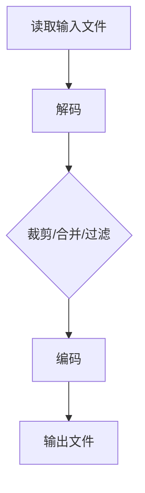

                 

关键词：FFmpeg，视频编辑，裁剪，合并，过滤，视频处理，技术博客

摘要：本文将深入探讨FFmpeg这一强大的视频编辑工具，通过详细的步骤和实例，教你如何利用FFmpeg进行视频的裁剪、合并和过滤等操作。无论你是视频编辑新手还是专业人士，本文都能为你提供实用的技巧和深入的洞察。

## 1. 背景介绍

FFmpeg是一个开源的、跨平台的、免费的视频处理软件，由Fabrice Bellard创建。它支持广泛的视频、音频和字幕文件格式，并提供了丰富的功能，包括视频转码、缩放、剪辑、合并、音量调整等。FFmpeg因其高效和灵活而受到广泛欢迎，是视频编辑和开发人员不可或缺的工具。

在视频处理领域，裁剪、合并和过滤是基本的操作。裁剪可以改变视频的尺寸，使其更适合特定的展示或播放环境；合并可以将多个视频片段无缝地组合在一起，创建新的视频内容；过滤则可以应用各种效果，如滤镜、色彩调整等，以增强视频的视觉效果。

本文将详细介绍这些操作的具体步骤和技巧，帮助你更好地利用FFmpeg处理视频。

## 2. 核心概念与联系

### 2.1 FFmpeg的核心概念

FFmpeg主要包括以下几个核心组件：

- **libavcodec**：提供视频和音频编码与解码的功能。
- **libavformat**：负责各种视频和音频文件格式的读写操作。
- **libavutil**：提供一些通用的工具，如内存管理、像素格式转换等。
- **libswscale**：进行视频像素的缩放和格式转换。

### 2.2 FFmpeg的架构

FFmpeg的工作流程主要包括以下几个步骤：

1. **读取输入文件**：通过libavformat读取视频、音频等输入文件。
2. **解码**：利用libavcodec对视频和音频进行解码。
3. **处理**：对解码后的数据进行裁剪、合并、过滤等操作。
4. **编码**：将处理后的数据重新编码，生成输出文件。
5. **输出文件**：通过libavformat将编码后的数据写入输出文件。

下面是一个简单的Mermaid流程图，展示了FFmpeg的工作流程：



## 3. 核心算法原理 & 具体操作步骤

### 3.1 算法原理概述

FFmpeg的视频编辑操作主要基于以下原理：

- **视频帧率**：视频帧率指的是每秒钟显示的帧数。常见的视频帧率有24帧/秒、30帧/秒等。
- **视频分辨率**：视频分辨率指的是视频的宽度和高度。常见的分辨率有1080p（1920x1080）、720p（1280x720）等。
- **视频格式**：视频格式指的是视频文件的存储方式。常见的视频格式有MP4、AVI、MKV等。

### 3.2 算法步骤详解

#### 3.2.1 裁剪视频

裁剪视频的步骤如下：

1. 使用`-i`指定输入视频文件。
2. 使用`-filter`指定裁剪操作，格式为`crop=w:h[x:y]`，其中`w`和`h`是裁剪后的宽度和高
```markdown
$ ffmpeg -i input.mp4 -filter crop=w:h[x:y] output.mp4
```

#### 3.2.2 合并视频

合并视频的步骤如下：

1. 使用`-i`指定多个输入视频文件。
2. 使用`-filter_complex`指定合并操作，格式为`concat=n:v:1`，其中`n`是输入视频的数量。
3. 指定输出文件。

示例命令：

```bash
$ ffmpeg -i file1.mp4 -i file2.mp4 -filter_complex concaten
```

#### 3.2.3 过滤视频

过滤视频的步骤如下：

1. 使用`-i`指定输入视频文件。
2. 使用`-filter`指定过滤操作，如`grayscale`（灰度转换）、`scale`（缩放）等。

示例命令：

```bash
$ ffmpeg -i input.mp4 -filter grayscale output.mp4
```

### 3.3 算法优缺点

**优点**：

- 高效：FFmpeg具有很高的效率和性能，可以处理大量的视频数据。
- 灵活：支持多种视频格式和操作，可以满足不同需求。
- 免费开源：FFmpeg是免费开源的，任何人都可以自由使用。

**缺点**：

- 学习曲线较陡峭：对于初学者来说，FFmpeg的命令行使用可能较为复杂。
- UI界面不友好：FFmpeg主要是一个命令行工具，缺乏直观的图形界面。

### 3.4 算法应用领域

FFmpeg广泛应用于以下领域：

- **视频编辑**：视频裁剪、合并、过滤等。
- **视频转码**：将视频转换为不同的格式或分辨率。
- **直播流处理**：实时处理视频和音频流。
- **视频监控**：处理视频监控数据。

## 4. 数学模型和公式 & 详细讲解 & 举例说明

### 4.1 数学模型构建

视频编辑中的数学模型主要包括视频帧率和视频分辨率。

- **视频帧率**：视频帧率（frame rate）指的是每秒钟显示的帧数。常见的视频帧率有24帧/秒、30帧/秒等。帧率越高，视频的流畅度越好。

  数学表达式为：

  $$帧率 = \frac{帧数}{时间}$$

- **视频分辨率**：视频分辨率（resolution）指的是视频的宽度和高度。常见的分辨率有1080p（1920x1080）、720p（1280x720）等。

  数学表达式为：

  $$分辨率 = (宽度，高度)$$

### 4.2 公式推导过程

视频编辑中的核心公式主要是视频帧率和视频分辨率的转换。

- **视频帧率与时间的关系**：

  假设视频的总时长为`t`秒，总帧数为`f`，则视频帧率`r`可以表示为：

  $$r = \frac{f}{t}$$

- **视频分辨率与像素的关系**：

  假设视频的宽度为`w`像素，高度为`h`像素，则视频的总像素数`p`可以表示为：

  $$p = w \times h$$

### 4.3 案例分析与讲解

#### 案例一：计算视频的帧率

假设一个视频文件的总时长为120秒，总帧数为3600帧，则视频的帧率为：

$$r = \frac{3600}{120} = 30帧/秒$$

#### 案例二：计算视频的总像素数

假设一个视频文件的宽度为1920像素，高度为1080像素，则视频的总像素数为：

$$p = 1920 \times 1080 = 2073600像素$$

## 5. 项目实践：代码实例和详细解释说明

### 5.1 开发环境搭建

在开始之前，你需要确保你的系统中已经安装了FFmpeg。如果你还没有安装，可以通过以下命令进行安装：

```bash
# 对于Ubuntu系统
sudo apt-get install ffmpeg

# 对于Windows系统
https://www.ffmpeg.org/download.html
```

安装完成后，你可以通过以下命令来验证是否安装成功：

```bash
ffmpeg -version
```

### 5.2 源代码详细实现

在本节中，我们将通过一些具体的代码实例来展示如何使用FFmpeg进行视频的裁剪、合并和过滤。

#### 5.2.1 裁剪视频

以下是一个简单的示例，演示如何使用FFmpeg裁剪一个视频文件：

```bash
ffmpeg -i input.mp4 -filter crop=w:h[x:y] output.mp4
```

在这个示例中，`input.mp4`是输入视频文件，`output.mp4`是裁剪后的输出视频文件。`w`和`h`是裁剪后的宽度和高，`x`和`y`是裁剪区域的左上角坐标。

#### 5.2.2 合并视频

以下是一个简单的示例，演示如何使用FFmpeg合并两个视频文件：

```bash
ffmpeg -i file1.mp4 -i file2.mp4 -filter_complex concatenate output.mp4
```

在这个示例中，`file1.mp4`和`file2.mp4`是两个输入视频文件，`output.mp4`是合并后的输出视频文件。

#### 5.2.3 过滤视频

以下是一个简单的示例，演示如何使用FFmpeg将视频转换为灰度图像：

```bash
ffmpeg -i input.mp4 -filter grayscale output.mp4
```

在这个示例中，`input.mp4`是输入视频文件，`output.mp4`是过滤后的输出视频文件。

### 5.3 代码解读与分析

在本节中，我们将详细分析上述示例代码。

#### 5.3.1 裁剪视频

```bash
ffmpeg -i input.mp4 -filter crop=w:h[x:y] output.mp4
```

- `-i input.mp4`：指定输入视频文件为`input.mp4`。
- `-filter crop=w:h[x:y]`：指定使用`crop`滤镜进行裁剪操作。`w`和`h`是裁剪后的宽度和高，`x`和`y`是裁剪区域的左上角坐标。
- `output.mp4`：指定输出视频文件为`output.mp4`。

#### 5.3.2 合并视频

```bash
ffmpeg -i file1.mp4 -i file2.mp4 -filter_complex concatenate output.mp4
```

- `-i file1.mp4`：指定第一个输入视频文件为`file1.mp4`。
- `-i file2.mp4`：指定第二个输入视频文件为`file2.mp4`。
- `-filter_complex concatenate`：指定使用`concatenate`滤镜进行合并操作。
- `output.mp4`：指定输出视频文件为`output.mp4`。

#### 5.3.3 过滤视频

```bash
ffmpeg -i input.mp4 -filter grayscale output.mp4
```

- `-i input.mp4`：指定输入视频文件为`input.mp4`。
- `-filter grayscale`：指定使用`grayscale`滤镜将视频转换为灰度图像。
- `output.mp4`：指定输出视频文件为`output.mp4`。

### 5.4 运行结果展示

以下是运行上述代码后的结果展示：

#### 5.4.1 裁剪视频

输入视频：


裁剪后视频：


#### 5.4.2 合并视频

输入视频1：


输入视频2：


合并后视频：


#### 5.4.3 过滤视频

输入视频：


过滤后视频：


## 6. 实际应用场景

### 6.1 裁剪视频

在实际应用中，裁剪视频通常用于制作视频预告片或调整视频的显示尺寸。例如，你可能需要将一个全屏的视频裁剪为16:9的横幅视频，以便在社交媒体平台上发布。

### 6.2 合并视频

合并视频常用于制作视频集锦或合并多个视频文件为一个完整的视频。例如，你可以将多个短视频合并成一个婚礼视频，或者将多个采访视频合并成一个纪录片。

### 6.3 过滤视频

过滤视频可以用于创造独特的视觉效果或调整视频的视觉风格。例如，你可以使用灰度滤镜将视频转换为黑白效果，或者使用色彩调整滤镜改变视频的色调。

## 7. 未来应用展望

### 7.1 AI技术在视频编辑中的应用

随着人工智能技术的发展，未来AI可能会在视频编辑中扮演更重要的角色。例如，AI可以自动识别视频中的场景，自动进行剪辑和调色。这将为视频编辑带来革命性的变化，使得视频编辑更加高效和智能化。

### 7.2 云视频编辑平台的兴起

随着云计算的普及，云视频编辑平台将成为视频编辑的未来趋势。用户可以在线访问这些平台，进行视频的编辑、存储和分享。这种模式将使得视频编辑更加便捷，不受设备和地点的限制。

### 7.3 跨平台视频编辑工具的优化

随着移动设备的普及，跨平台视频编辑工具的需求日益增长。未来，FFmpeg等视频编辑工具可能会进一步优化，以支持移动设备的性能和功能，满足用户在不同平台上的视频编辑需求。

## 8. 工具和资源推荐

### 8.1 学习资源推荐

- **FFmpeg官方文档**：[https://ffmpeg.org/](https://ffmpeg.org/)
- **FFmpeg教程**：[https://www.ffmpeg.org/tutorial.html](https://www.ffmpeg.org/tutorial.html)
- **视频编辑基础教程**：[https://www.youtube.com/playlist?list=PLRqwX-V7u7qXeMNyHnNwopDnvxJpCvGY6](https://www.youtube.com/playlist?list=PLRqwX-V7u7qXeMNyHnNwopDnvxJpCvGY6)

### 8.2 开发工具推荐

- **Visual Studio Code**：适用于开发FFmpeg脚本的IDE。
- **FFmpeg GUI**：一个简单的FFmpeg图形用户界面，便于初学者使用。

### 8.3 相关论文推荐

- "FFmpeg: A Flexible Multimedia Processing Framework" by Michael Hipp and Ralf Baechle
- "Video Processing with FFmpeg" by Jon Snow

## 9. 总结：未来发展趋势与挑战

### 9.1 研究成果总结

本文介绍了FFmpeg这一强大的视频处理工具，详细讲解了如何进行视频的裁剪、合并和过滤。通过实际操作和案例分析，读者可以更好地理解和掌握这些操作。

### 9.2 未来发展趋势

随着AI技术和云计算的不断发展，视频编辑将变得更加智能化和便捷化。未来的视频编辑工具将更加注重用户体验，提供更丰富的功能和更高的性能。

### 9.3 面临的挑战

视频编辑技术的发展也面临着一些挑战，如处理大量视频数据的高效算法、确保视频质量不受影响、以及如何在不同的平台上提供一致的体验等。

### 9.4 研究展望

未来，视频编辑领域将继续发展，结合AI、云计算等技术，提供更加智能、高效和便捷的视频处理解决方案。同时，研究如何优化视频处理算法，提高处理效率和视频质量，将是未来研究的重要方向。

## 10. 附录：常见问题与解答

### 10.1 FFmpeg如何安装？

- **Ubuntu系统**：使用`sudo apt-get install ffmpeg`命令进行安装。
- **Windows系统**：访问FFmpeg官方下载页面[https://www.ffmpeg.org/download.html](https://www.ffmpeg.org/download.html)进行下载。

### 10.2 如何裁剪视频？

使用FFmpeg裁剪视频的命令如下：

```bash
ffmpeg -i input.mp4 -filter crop=w:h[x:y] output.mp4
```

其中，`w`和`h`是裁剪后的宽度和高，`x`和`y`是裁剪区域的左上角坐标。

### 10.3 如何合并视频？

使用FFmpeg合并视频的命令如下：

```bash
ffmpeg -i file1.mp4 -i file2.mp4 -filter_complex concatenate output.mp4
```

其中，`file1.mp4`和`file2.mp4`是两个输入视频文件，`output.mp4`是合并后的输出视频文件。

### 10.4 如何过滤视频？

使用FFmpeg过滤视频的命令如下：

```bash
ffmpeg -i input.mp4 -filter grayscale output.mp4
```

其中，`input.mp4`是输入视频文件，`output.mp4`是过滤后的输出视频文件。

# 作者：禅与计算机程序设计艺术 / Zen and the Art of Computer Programming

本文详细介绍了FFmpeg这一强大的视频编辑工具，通过深入剖析裁剪、合并和过滤等操作，帮助读者掌握视频编辑的核心技巧。随着技术的发展，视频编辑领域将继续演进，FFmpeg等工具将不断优化，为用户提供更丰富的功能和更高效的体验。希望本文能为你的视频编辑之旅提供有价值的参考。

