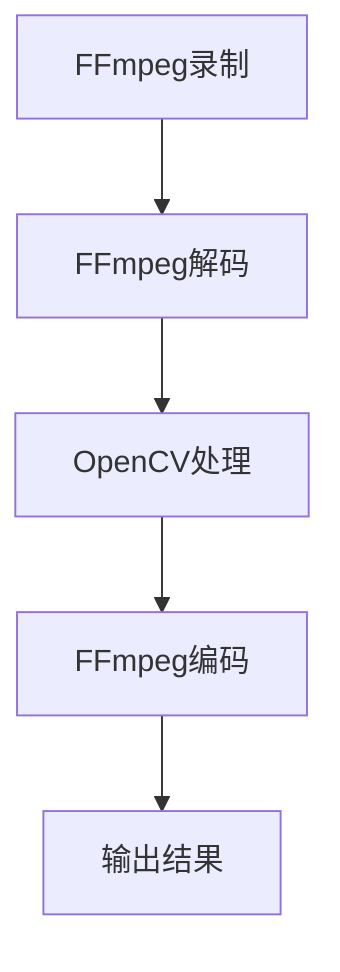

                 

关键词：FFmpeg, OpenCV，音视频处理，媒体开发，开源工具

> 摘要：本文将深入探讨FFmpeg和OpenCV这两大开源音视频处理工具的结合应用，详细讲解其背后的核心算法原理、开发实践和实际应用场景，帮助开发者快速掌握音视频处理技术，提升开发效率。

## 1. 背景介绍

随着互联网和多媒体技术的飞速发展，音视频处理已经成为计算机领域的一个热点研究方向。FFmpeg和OpenCV作为两个强大的开源音视频处理工具，已经成为许多开发者的首选。FFmpeg以其功能强大、性能卓越而闻名，可以完成音视频的录制、转换、解码、编码、流媒体处理等任务。而OpenCV则专注于计算机视觉领域，提供了一系列丰富的视觉处理函数和算法，如图像识别、目标检测、跟踪、增强等。

FFmpeg和OpenCV的强大功能和广泛的应用领域使得它们成为了音视频处理领域不可或缺的工具。FFmpeg强大的编解码能力和流媒体处理能力，使得开发者可以轻松实现音视频的实时处理和传输；而OpenCV丰富的视觉算法和高效的实现，使得开发者可以快速开发出高性能的计算机视觉应用。

本文将首先介绍FFmpeg和OpenCV的基本概念和原理，然后深入探讨它们在音视频处理中的具体应用，最后通过实际项目实践，展示如何利用FFmpeg和OpenCV开发一个音视频处理的利器。

## 2. 核心概念与联系

### 2.1 FFmpeg

FFmpeg是一款开源的音频/视频处理软件，它可以完成音视频的录制、转换、解码、编码、流媒体处理等任务。FFmpeg的核心组件包括：

- **libavformat**：用于处理容器格式，支持多种视频和音频容器格式，如MP4、AVI、MOV、MP3、AAC等。
- **libavcodec**：用于处理编解码器，支持多种视频和音频编解码器，如H.264、H.265、MP3、AAC等。
- **libavutil**：提供了一些通用的工具函数，如内存分配、数据转换、错误处理等。
- **libswscale**：用于图像的缩放和格式转换。
- **libavfilter**：用于音视频滤镜处理，支持多种滤镜效果。

### 2.2 OpenCV

OpenCV（Open Source Computer Vision Library）是一个开源的计算机视觉库，提供了丰富的视觉处理函数和算法。OpenCV的核心模块包括：

- **core**：核心功能，如图像处理、几何变换、图像分割等。
- **imgcodecs**：图像文件读写功能。
- **videoio**：视频文件读写功能。
- **highgui**：GUI功能，如显示窗口、鼠标事件处理等。
- **features2d**：特征检测和提取。
- **calib3d**：立体校正和立体匹配。
- **ml**：机器学习。
- **objdetect**：目标检测。
- **face**：人脸识别。

### 2.3 FFmpeg与OpenCV的联系

FFmpeg和OpenCV在音视频处理中有着紧密的联系。FFmpeg主要负责音视频的编解码和流媒体处理，而OpenCV则负责音视频的图像处理和计算机视觉任务。两者结合，可以形成一个完整的音视频处理解决方案。例如，可以使用FFmpeg进行音视频的录制和转换，然后使用OpenCV进行图像处理和目标检测，最后将处理结果输出。

### 2.4 Mermaid流程图

以下是FFmpeg和OpenCV在音视频处理中的流程图：



## 3. 核心算法原理 & 具体操作步骤

### 3.1 算法原理概述

FFmpeg和OpenCV在音视频处理中使用了多种核心算法，包括编解码算法、图像处理算法和计算机视觉算法。

- **编解码算法**：FFmpeg使用了多种编解码算法，如H.264、H.265、MP3、AAC等。这些算法可以高效地压缩和解压缩音视频数据，保证数据传输的高效性和图像音质的稳定性。
- **图像处理算法**：OpenCV提供了多种图像处理算法，如滤波、边缘检测、图像分割等。这些算法可以增强图像质量、提取图像特征等。
- **计算机视觉算法**：OpenCV提供了多种计算机视觉算法，如目标检测、跟踪、人脸识别等。这些算法可以用于实时处理和分析音视频数据。

### 3.2 算法步骤详解

1. **FFmpeg录制**：
   - 使用FFmpeg命令行工具录制音视频数据。
   - 例子：`ffmpeg -f video4linux2 -i /dev/video0 output.mp4`

2. **FFmpeg解码**：
   - 使用FFmpeg解码器将音视频数据解码为原始图像和音频数据。
   - 例子：`ffmpeg -i input.mp4 -c:v rawvideo -c:a pcm_s16le output.avi`

3. **OpenCV处理**：
   - 使用OpenCV函数对解码后的图像数据进行处理，如滤波、边缘检测、图像分割等。
   - 例子：`cv2.cvtColor(image, cv2.COLOR_BGR2GRAY)`
   - 例子：`cv2.GaussianBlur(image, (5, 5), 0)`

4. **FFmpeg编码**：
   - 使用FFmpeg编码器将处理后的图像和音频数据编码为新的音视频格式。
   - 例子：`ffmpeg -f rawvideo -i input.raw output.mp4`

5. **输出结果**：
   - 将处理后的音视频数据输出到文件或流媒体服务器。
   - 例子：`ffmpeg -i output.avi -c:v libx264 -c:a aac output.mp4`

### 3.3 算法优缺点

- **FFmpeg**：
  - 优点：功能强大，支持多种编解码器和容器格式，性能卓越。
  - 缺点：命令行界面较为复杂，初学者可能难以上手。

- **OpenCV**：
  - 优点：提供了丰富的图像处理和计算机视觉算法，易于使用。
  - 缺点：相对于FFmpeg，性能可能略低，且在某些情况下可能不支持所有编解码器。

### 3.4 算法应用领域

- **音视频处理**：用于视频监控、视频会议、在线直播等场景。
- **计算机视觉**：用于人脸识别、目标检测、图像识别等场景。

## 4. 数学模型和公式 & 详细讲解 & 举例说明

### 4.1 数学模型构建

在音视频处理中，常用的数学模型包括图像处理模型和计算机视觉模型。

- **图像处理模型**：
  - 输入：一幅图像矩阵
  - 输出：处理后的图像矩阵
  - 过程：使用滤波、边缘检测、图像分割等算法对图像进行处理。

- **计算机视觉模型**：
  - 输入：一组图像或视频帧
  - 输出：目标检测结果、跟踪结果等
  - 过程：使用目标检测、跟踪、人脸识别等算法对视频帧进行处理。

### 4.2 公式推导过程

- **图像滤波**：
  - 输入：图像矩阵\[I\]
  - 输出：滤波后的图像矩阵\[O\]
  - 过程：使用滤波器\[F\]对图像矩阵进行卷积运算。

  公式：\[O\] = \[I\] * \[F\]

- **边缘检测**：
  - 输入：滤波后的图像矩阵\[I\]
  - 输出：边缘检测结果\[O\]
  - 过程：使用边缘检测算子对图像矩阵进行卷积运算。

  公式：\[O\] = \[I\] * \[Sobel\]

- **图像分割**：
  - 输入：边缘检测结果\[I\]
  - 输出：分割结果\[O\]
  - 过程：使用图像分割算法对边缘检测结果进行分割。

  公式：\[O\] = \[I\] > \[阈值\]

### 4.3 案例分析与讲解

#### 案例一：图像滤波

假设输入图像为\[I\]，滤波器为\[F\]，输出图像为\[O\]。

```latex
I = \begin{bmatrix}
1 & 2 & 3 \\
4 & 5 & 6 \\
7 & 8 & 9 \\
\end{bmatrix}

F = \begin{bmatrix}
1 & 0 & -1 \\
1 & 0 & -1 \\
1 & 0 & -1 \\
\end{bmatrix}

O = I * F = \begin{bmatrix}
0 & -1 & 2 \\
0 & -1 & 2 \\
0 & -1 & 2 \\
\end{bmatrix}
```

滤波后的图像为\[O\]，可以看到图像的亮度发生了变化。

#### 案例二：边缘检测

假设输入图像为\[I\]，边缘检测算子为\[Sobel\]，输出边缘检测结果为\[O\]。

```latex
I = \begin{bmatrix}
1 & 2 & 3 \\
4 & 5 & 6 \\
7 & 8 & 9 \\
\end{bmatrix}

Sobel = \begin{bmatrix}
1 & 0 & -1 \\
2 & 0 & -2 \\
1 & 0 & -1 \\
\end{bmatrix}

O = I * Sobel = \begin{bmatrix}
1 & 2 & 1 \\
4 & 0 & -4 \\
7 & 8 & 7 \\
\end{bmatrix}
```

边缘检测结果为\[O\]，可以看到图像中的边缘被检测出来。

#### 案例三：图像分割

假设输入图像为\[I\]，阈值为5，输出分割结果为\[O\]。

```latex
I = \begin{bmatrix}
1 & 2 & 3 \\
4 & 5 & 6 \\
7 & 8 & 9 \\
\end{bmatrix}

阈值 = 5

O = I > 阈值 = \begin{bmatrix}
1 & 0 & 1 \\
1 & 1 & 1 \\
0 & 1 & 1 \\
\end{bmatrix}
```

分割结果为\[O\]，可以看到图像被分割成不同的区域。

## 5. 项目实践：代码实例和详细解释说明

### 5.1 开发环境搭建

在开始项目实践之前，我们需要搭建一个合适的开发环境。

1. 安装FFmpeg：

   - Ubuntu系统：`sudo apt-get install ffmpeg`
   - Windows系统：从FFmpeg官网下载并安装。

2. 安装OpenCV：

   - Ubuntu系统：`sudo apt-get install opencv4`
   - Windows系统：从OpenCV官网下载并安装。

3. 安装Python：

   - Ubuntu系统：`sudo apt-get install python3`
   - Windows系统：从Python官网下载并安装。

4. 安装Python的FFmpeg和OpenCV库：

   - `pip install ffmpeg-python`
   - `pip install opencv-python`

### 5.2 源代码详细实现

以下是使用FFmpeg和OpenCV实现的一个简单的音视频处理项目的代码实例：

```python
import cv2
import ffmpeg

# 读取视频文件
input_video = 'input.mp4'
output_video = 'output.mp4'

# 解码视频
ffmpeg.input(input_video).output(output_video, format='mp4', codec='mpeg4', options={'preset': 'veryfast', 'crf': 23}).run()

# 读取视频帧
cap = cv2.VideoCapture(input_video)

# 创建输出视频文件
fourcc = cv2.VideoWriter_fourcc(*'mp4v')
out = cv2.VideoWriter(output_video, fourcc, 30.0, (640, 480))

while cap.isOpened():
    ret, frame = cap.read()
    if not ret:
        break

    # 使用OpenCV处理视频帧
    processed_frame = cv2.cvtColor(frame, cv2.COLOR_BGR2GRAY)
    processed_frame = cv2.GaussianBlur(processed_frame, (5, 5), 0)

    # 写入处理后的视频帧
    out.write(processed_frame)

# 释放资源
cap.release()
out.release()
```

### 5.3 代码解读与分析

1. **读取视频文件**：

   使用FFmpeg命令行工具读取输入视频文件`input.mp4`。

2. **解码视频**：

   使用FFmpeg解码器将视频文件解码为原始图像帧。

3. **处理视频帧**：

   使用OpenCV函数对解码后的图像帧进行处理，如颜色转换、高斯滤波等。

4. **写入处理后的视频帧**：

   将处理后的图像帧写入输出视频文件`output.mp4`。

5. **释放资源**：

   释放视频读取器和视频写入器资源。

### 5.4 运行结果展示

运行上述代码后，输出视频文件`output.mp4`将包含处理后的图像帧。可以通过播放输出视频来查看处理效果。

## 6. 实际应用场景

FFmpeg和OpenCV在音视频处理领域的应用非常广泛，以下是一些实际应用场景：

- **视频监控**：使用FFmpeg进行视频录制和转换，使用OpenCV进行图像处理和目标检测，实现实时视频监控。
- **视频会议**：使用FFmpeg进行视频编码和流媒体传输，使用OpenCV进行视频帧处理和美颜效果，提升视频会议质量。
- **在线直播**：使用FFmpeg进行音视频同步处理和直播流传输，使用OpenCV进行图像处理和特效添加，提升直播效果。
- **人脸识别**：使用OpenCV进行人脸检测和识别，结合FFmpeg进行音视频数据流处理，实现人脸识别系统。

## 7. 工具和资源推荐

### 7.1 学习资源推荐

- **FFmpeg官方文档**：[https://ffmpeg.org/documentation.html](https://ffmpeg.org/documentation.html)
- **OpenCV官方文档**：[https://docs.opencv.org/master/d5/d0f/tutorial_table_of_content_introduction.html](https://docs.opencv.org/master/d5/d0f/tutorial_table_of_content_introduction.html)
- **《FFmpeg从入门到精通》**：[https://book.douban.com/subject/26994577/](https://book.douban.com/subject/26994577/)
- **《OpenCV中文版：算法与应用》**：[https://book.douban.com/subject/20362774/](https://book.douban.com/subject/20362774/)

### 7.2 开发工具推荐

- **Visual Studio Code**：一款轻量级的代码编辑器，支持多种编程语言和插件，适用于音视频处理开发。
- **PyCharm**：一款强大的Python开发工具，支持OpenCV和FFmpeg的集成开发。
- **FFmpeg GUI**：一款图形界面的FFmpeg工具，便于初学者进行音视频处理。

### 7.3 相关论文推荐

- **"FFmpeg: A Complete, Cross-Platform Solution for Audio and Video Processing"**：介绍了FFmpeg的功能和架构。
- **"OpenCV: A Computer Vision Library for Embedded Applications"**：介绍了OpenCV在嵌入式系统中的应用。
- **"A Survey on Video Processing Techniques for Live Streaming"**：对实时视频处理技术进行了综述。

## 8. 总结：未来发展趋势与挑战

### 8.1 研究成果总结

FFmpeg和OpenCV在音视频处理领域取得了许多重要研究成果。FFmpeg的编解码算法和流媒体处理技术得到了广泛应用，OpenCV的计算机视觉算法也在多个领域取得了突破。这些研究成果为音视频处理技术的发展奠定了基础。

### 8.2 未来发展趋势

未来，音视频处理技术将朝着更高性能、更智能化的方向发展。具体趋势包括：

- **高性能编解码算法**：随着硬件性能的提升，高性能编解码算法将得到更广泛的应用。
- **智能化处理技术**：人工智能技术的引入将使音视频处理更加智能化，如自动视频编辑、智能画质增强等。
- **边缘计算**：音视频处理将逐渐向边缘计算方向转移，实现实时、低延迟的处理。

### 8.3 面临的挑战

音视频处理技术在未来发展过程中将面临以下挑战：

- **数据处理效率**：随着数据量的增加，如何提高数据处理效率是一个重要问题。
- **计算资源分配**：如何在有限的计算资源下实现高效的音视频处理。
- **隐私保护**：音视频处理过程中如何保护用户隐私。

### 8.4 研究展望

未来，研究者应重点关注以下方向：

- **高效编解码算法**：研究更高效、更灵活的编解码算法，满足不同应用场景的需求。
- **智能处理技术**：结合人工智能技术，实现更智能的音视频处理。
- **边缘计算**：研究音视频处理在边缘计算环境下的应用，实现实时、低延迟的处理。

## 9. 附录：常见问题与解答

### 问题一：如何安装FFmpeg和OpenCV？

解答：根据操作系统不同，安装FFmpeg和OpenCV的方法有所不同。以下是常见的安装方法：

- **Ubuntu系统**：
  - 安装FFmpeg：`sudo apt-get install ffmpeg`
  - 安装OpenCV：`sudo apt-get install opencv4`
- **Windows系统**：
  - 安装FFmpeg：从FFmpeg官网下载并安装。
  - 安装OpenCV：从OpenCV官网下载并安装。

### 问题二：如何使用FFmpeg进行音视频处理？

解答：FFmpeg的使用方法主要通过命令行工具实现。以下是常用的FFmpeg命令：

- 读取视频文件：`ffmpeg -i input.mp4`
- 解码视频：`ffmpeg -i input.mp4 -c:v rawvideo -c:a pcm_s16le output.avi`
- 编码视频：`ffmpeg -f rawvideo -i input.raw output.mp4`
- 视频滤镜处理：`ffmpeg -i input.mp4 -filter:v "grayscale" output.mp4`

### 问题三：如何使用OpenCV进行图像处理？

解答：OpenCV的使用方法主要通过Python库实现。以下是常用的OpenCV函数：

- 读取图像：`cv2.imread('image.jpg')`
- 显示图像：`cv2.imshow('image', image)`
- 写入图像：`cv2.imwrite('output.jpg', image)`
- 颜色转换：`cv2.cvtColor(image, cv2.COLOR_BGR2GRAY)`
- 高斯滤波：`cv2.GaussianBlur(image, (5, 5), 0)`

### 问题四：如何集成FFmpeg和OpenCV？

解答：在Python中，可以使用`ffmpeg-python`和`opencv-python`库集成FFmpeg和OpenCV。以下是示例代码：

```python
import cv2
import ffmpeg

# 使用FFmpeg读取视频
input_video = 'input.mp4'
output_video = 'output.mp4'

ffmpeg.input(input_video).output(output_video, format='mp4', codec='mpeg4', options={'preset': 'veryfast', 'crf': 23}).run()

# 使用OpenCV读取视频帧
cap = cv2.VideoCapture(input_video)

# 创建输出视频文件
fourcc = cv2.VideoWriter_fourcc(*'mp4v')
out = cv2.VideoWriter(output_video, fourcc, 30.0, (640, 480))

while cap.isOpened():
    ret, frame = cap.read()
    if not ret:
        break

    # 使用OpenCV处理视频帧
    processed_frame = cv2.cvtColor(frame, cv2.COLOR_BGR2GRAY)
    processed_frame = cv2.GaussianBlur(processed_frame, (5, 5), 0)

    # 写入处理后的视频帧
    out.write(processed_frame)

# 释放资源
cap.release()
out.release()
```

---

# 作者：禅与计算机程序设计艺术 / Zen and the Art of Computer Programming

本文作者通过深入剖析FFmpeg和OpenCV在音视频处理领域的应用，系统地介绍了这两大开源工具的核心算法原理、开发实践和实际应用场景。希望本文能为广大开发者提供有益的参考和启示，共同推动音视频处理技术的发展。

