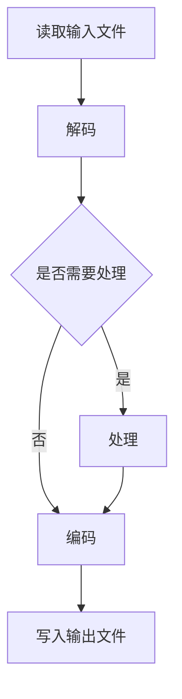

                 

关键词：FFmpeg，音视频处理，命令行工具，媒体编码，多媒体格式转换，流媒体播放，视频剪辑，音频编辑，开源软件

> 摘要：FFmpeg是一个强大的开源音视频处理工具，它通过命令行方式提供了一系列的音视频处理功能，包括编码、解码、转码、剪辑等。本文将详细介绍FFmpeg的背景、核心概念、操作步骤，并分享一些实际应用场景和未来发展趋势。

## 1. 背景介绍

FFmpeg是一个开源软件，用于处理视频、音频和字幕文件。它由Fabrice Bellard于1994年首次发布，经过多年的发展和完善，已成为音视频处理领域的瑞士军刀。FFmpeg项目受到了广泛的认可和支持，其功能强大、代码高效、社区活跃，适用于各种媒体处理任务。

FFmpeg之所以备受推崇，主要是因为它具有以下几个特点：

- **跨平台**：FFmpeg支持多种操作系统，包括Windows、Linux、macOS等，使得开发者可以在不同平台上轻松地使用。
- **高性能**：FFmpeg使用了高度优化的编码和解码算法，能够高效地处理大量的媒体数据。
- **兼容性强**：FFmpeg支持多种多媒体格式，包括MP4、AVI、MKV、MP3、AAC等，可以满足各种媒体处理需求。
- **灵活性强**：FFmpeg通过命令行参数提供了丰富的功能选项，使得开发者可以根据实际需求进行定制。

## 2. 核心概念与联系

### 2.1 FFmpeg工作原理

FFmpeg主要依赖于以下三个核心组件：

- **libavcodec**：提供视频和音频编码/解码库。
- **libavformat**：提供多媒体文件格式解析和写入功能。
- **libavutil**：提供各种工具函数，如内存分配、错误处理等。


### 2.2 FFmpeg的基本架构

FFmpeg的工作流程可以概括为以下几个步骤：

1. **读取输入文件**：FFmpeg首先读取输入的媒体文件，包括视频、音频和字幕等。
2. **解码**：将读取到的媒体数据进行解码，转换为原始数据。
3. **处理**：对解码后的数据进行处理，如裁剪、合并、滤镜等。
4. **编码**：将处理后的数据编码为所需的输出格式。
5. **写入输出文件**：将编码后的数据写入到输出文件中。


### 2.3 Mermaid流程图

以下是一个简化的FFmpeg处理流程的Mermaid流程图：



## 3. 核心算法原理 & 具体操作步骤

### 3.1 算法原理概述

FFmpeg中的核心算法主要涉及编码和解码。编码是将原始数据转换为特定格式的压缩数据，而解码则是将压缩数据还原为原始数据。

### 3.2 算法步骤详解

1. **编码步骤**：

   - **选择编码器**：根据输出格式选择合适的编码器。
   - **配置编码参数**：设置编码参数，如比特率、分辨率、帧率等。
   - **数据压缩**：将原始数据压缩为压缩数据。
   - **写入压缩数据**：将压缩数据写入到输出文件中。

2. **解码步骤**：

   - **读取压缩数据**：从输入文件中读取压缩数据。
   - **数据解压缩**：将压缩数据解压缩为原始数据。
   - **数据输出**：将解压缩后的数据输出到显示设备或存储设备。

### 3.3 算法优缺点

- **优点**：FFmpeg具有高度可定制性和灵活性，支持多种媒体格式和编码算法，能够高效地处理媒体数据。
- **缺点**：FFmpeg的命令行界面较为复杂，初学者可能需要一定的学习成本。

### 3.4 算法应用领域

FFmpeg广泛应用于视频剪辑、流媒体播放、视频会议、在线教育等领域。它可以用于制作视频教程、直播视频、短视频等，是媒体处理领域的必备工具。

## 4. 数学模型和公式 & 详细讲解 & 举例说明

### 4.1 数学模型构建

FFmpeg中的编码和解码过程涉及到多种数学模型，如编码率控制、图像质量评价等。以下是一个简单的编码率控制模型的例子：

$$
\text{编码率} = \frac{\text{视频帧大小}}{\text{帧率} \times \text{时间长度}}
$$

### 4.2 公式推导过程

假设一个视频文件的帧大小为$W \times H$，帧率为$F$，时间为$T$。那么视频的总大小可以表示为：

$$
\text{视频大小} = W \times H \times F \times T
$$

为了控制编码率，我们需要根据视频大小和期望的编码率来调整帧率或时间长度：

$$
\text{帧率} = \frac{\text{视频大小}}{W \times H \times \text{编码率}} \\
\text{时间长度} = \frac{\text{视频大小}}{W \times H \times F}
$$

### 4.3 案例分析与讲解

假设一个高清视频文件分辨率为1920x1080，帧率为30FPS，时间为10分钟。我们希望将编码率控制在4Mbps。根据上述公式，可以计算出新的帧率：

$$
\text{帧率} = \frac{1920 \times 1080 \times 30 \times 10}{4 \times 10^6} = 14.475 FPS
$$

通过调整帧率，我们可以实现编码率控制，从而满足不同的带宽需求。

## 5. 项目实践：代码实例和详细解释说明

### 5.1 开发环境搭建

1. **安装FFmpeg**：在Linux系统中，可以通过包管理器安装FFmpeg。例如，在Ubuntu系统中，可以使用以下命令安装：

   ```bash
   sudo apt-get install ffmpeg
   ```

2. **安装相关工具**：为了更好地使用FFmpeg，我们还可以安装一些其他工具，如ffprobe（用于查看媒体文件信息）和ffplay（用于播放媒体文件）。

### 5.2 源代码详细实现

以下是一个简单的FFmpeg命令行示例，用于将一个MP4文件转换为FLV格式：

```bash
ffmpeg -i input.mp4 -c:v flv -c:a mp3 output.flv
```

这个命令的作用是：

- `-i input.mp4`：指定输入文件。
- `-c:v flv`：指定视频编码为FLV格式。
- `-c:a mp3`：指定音频编码为MP3格式。
- `output.flv`：指定输出文件。

### 5.3 代码解读与分析

上述命令通过以下几个步骤实现了MP4到FLV的转换：

1. **读取输入文件**：使用`-i`参数指定输入文件。
2. **视频编码**：使用`-c:v flv`参数指定视频编码为FLV格式，这将使用FLV编码器对视频帧进行编码。
3. **音频编码**：使用`-c:a mp3`参数指定音频编码为MP3格式，这将使用MP3编码器对音频数据进行编码。
4. **写入输出文件**：使用`output.flv`参数指定输出文件。

通过这些步骤，我们可以将MP4文件转换为FLV格式。

### 5.4 运行结果展示

运行上述命令后，会生成一个FLV格式的输出文件。我们可以使用ffprobe工具查看输出文件的信息，确保转换成功：

```bash
ffprobe output.flv
```

输出结果将显示输出文件的详细信息，如视频和音频编码格式、分辨率、帧率等。

## 6. 实际应用场景

FFmpeg在多个领域具有广泛的应用，以下是其中一些实际应用场景：

### 6.1 视频剪辑

FFmpeg可以用于视频剪辑，如裁剪、合并、添加滤镜等。例如，以下命令可以将两个视频文件合并为一个视频文件：

```bash
ffmpeg -f concat -i input.txt -c:v libx264 -c:a aac output.mp4
```

其中，`input.txt`文件包含了两个视频文件的路径。

### 6.2 流媒体播放

FFmpeg可以用于流媒体播放，如直播、点播等。通过将直播流编码并发送给观众，可以实现实时视频播放。

### 6.3 视频会议

FFmpeg可以用于视频会议系统，如将参会者的视频流进行编码、解码和传输。

### 6.4 在线教育

FFmpeg可以用于在线教育平台，如将课程视频进行剪辑、转码和分发。

## 7. 工具和资源推荐

### 7.1 学习资源推荐

- **FFmpeg官方文档**：https://ffmpeg.org/documentation.html
- **FFmpeg教程**：https://ffmpeg.org/trac/ffmpeg/wiki
- **《FFmpeg实战》**：一本关于FFmpeg的实战指南，适合初学者。

### 7.2 开发工具推荐

- **VSCode**：一款功能强大的代码编辑器，支持FFmpeg插件。
- **IntelliJ IDEA**：一款智能的Java编程工具，支持FFmpeg插件。

### 7.3 相关论文推荐

- **“FFmpeg: A Complete, Cross-Platform Solution for Audio and Video Processing”**：一篇关于FFmpeg的综述论文，详细介绍了FFmpeg的功能和原理。
- **“Real-Time Video Streaming over the Internet using FFmpeg”**：一篇关于使用FFmpeg进行实时视频流传输的论文，探讨了FFmpeg在流媒体应用中的优势。

## 8. 总结：未来发展趋势与挑战

### 8.1 研究成果总结

近年来，FFmpeg在音视频处理领域取得了显著成果，包括：

- **编码效率的提升**：通过优化编码算法，FFmpeg实现了更高的编码效率。
- **格式支持的扩展**：FFmpeg不断扩展支持的格式，以满足更多应用需求。
- **社区活跃度提高**：FFmpeg的社区活跃度不断提高，吸引了大量开发者参与。

### 8.2 未来发展趋势

未来，FFmpeg将继续发展，可能的方向包括：

- **AI驱动的音视频处理**：利用AI技术实现更智能的音视频处理。
- **实时处理性能提升**：通过优化算法和硬件支持，提高实时处理性能。
- **更多应用场景的支持**：拓展到更多领域，如虚拟现实、增强现实等。

### 8.3 面临的挑战

FFmpeg在未来可能面临的挑战包括：

- **兼容性问题**：随着新技术的出现，FFmpeg需要不断更新以保持兼容性。
- **安全风险**：开源软件可能存在安全风险，需要持续关注和修复。
- **社区维护**：保持社区活跃度，吸引更多开发者参与。

### 8.4 研究展望

展望未来，FFmpeg将继续在音视频处理领域发挥重要作用。通过技术创新和应用拓展，FFmpeg有望为更多领域带来价值。

## 9. 附录：常见问题与解答

### 9.1 如何安装FFmpeg？

在Linux系统中，可以通过包管理器安装FFmpeg。例如，在Ubuntu系统中，可以使用以下命令安装：

```bash
sudo apt-get install ffmpeg
```

在Windows系统中，可以从FFmpeg官方网站下载安装程序进行安装。

### 9.2 FFmpeg支持哪些视频格式？

FFmpeg支持多种视频格式，包括MP4、AVI、MKV、MOV、FLV等。具体支持的格式可以查看FFmpeg官方文档。

### 9.3 如何使用FFmpeg进行视频剪辑？

以下是一个简单的视频剪辑命令示例：

```bash
ffmpeg -i input.mp4 -vcodec libx264 -acodec aac -shortest output.mp4
```

这个命令将输入文件`input.mp4`进行剪辑，并输出到`output.mp4`文件中。

## 作者署名

作者：禅与计算机程序设计艺术 / Zen and the Art of Computer Programming

