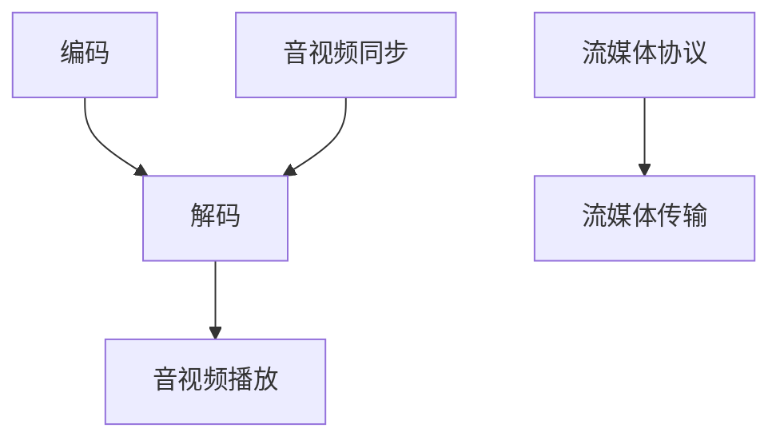

                 

在当今数字化时代，音视频处理技术已经成为信息传播、娱乐产业和媒体技术不可或缺的一部分。FFmpeg，一个开源、跨平台的音视频处理工具，凭借其强大的编解码能力和流媒体处理功能，已经成为音视频处理领域的事实标准。本文将深入探讨FFmpeg在编解码与流媒体处理中的核心概念、算法原理、数学模型以及实际应用，旨在为读者提供一个全面的技术参考。

## 文章关键词

- FFmpeg
- 音视频处理
- 编解码
- 流媒体
- 实时传输

## 文章摘要

本文首先介绍了FFmpeg的背景和核心功能，随后深入分析了FFmpeg在音视频编解码与流媒体处理中的技术原理。通过详细的算法原理与数学模型讲解，结合实际项目实例，展示了FFmpeg在开发中的具体应用。最后，对FFmpeg的未来发展趋势与挑战进行了展望，并推荐了相关学习资源与开发工具。

## 1. 背景介绍

### 1.1 FFmpeg的起源与发展历程

FFmpeg是一个开源、跨平台的音频和视频处理工具，起源于法国，发展至今已经成为全球范围内最为流行的音视频处理软件。FFmpeg最初由Fabrice Bellard于1994年创建，最初旨在为Linux系统提供一套高效的音频和视频处理工具。随着时间的推移，FFmpeg得到了全球开发者的广泛贡献，其功能不断完善，性能日益优化。

### 1.2 FFmpeg的核心功能

FFmpeg提供了丰富的功能，包括但不限于：

- 音视频编解码：支持多种音视频编码标准，如H.264、HEVC、MP3、AAC等。
- 流媒体处理：支持RTMP、RTSP、HLS、DASH等多种流媒体协议。
- 实时传输：支持TCP、UDP等多种传输协议，可以实现高效的音视频数据传输。
- 其他功能：如视频滤镜、音视频合成、字幕添加等。

### 1.3 FFmpeg的应用场景

FFmpeg在多个领域得到了广泛应用，包括：

- 媒体制作：用于视频编辑、音频剪辑、字幕添加等。
- 网络直播：用于直播流媒体服务器端和客户端的音视频处理。
- 流媒体服务：用于流媒体文件的编码、打包、传输等。
- 视频会议：用于音视频信号的采集、处理和传输。

## 2. 核心概念与联系

### 2.1 编解码原理

#### 2.1.1 编码

编码是将原始的音视频信号转换为数字信号的过程。这个过程中，原始信号被采样和量化，并转换为一系列的二进制数字。FFmpeg支持多种编码标准，如H.264、HEVC、VP8、VP9等。

#### 2.1.2 解码

解码是将编码后的数字信号还原为原始音视频信号的过程。FFmpeg支持多种解码标准，如H.264、HEVC、MP3、AAC等。

### 2.2 流媒体处理

#### 2.2.1 流媒体协议

流媒体处理涉及到多种流媒体协议，如RTMP、RTSP、HLS、DASH等。这些协议定义了音视频数据在互联网上的传输方式。

#### 2.2.2 流媒体传输

流媒体传输需要支持TCP、UDP等传输协议。FFmpeg可以通过这些协议实现高效的音视频数据传输。

### 2.3 音视频同步

音视频同步是确保音视频播放一致性的关键。FFmpeg通过时间戳同步、音视频缓冲区管理等技术实现音视频同步。

### 2.4 Mermaid 流程图



## 3. 核心算法原理 & 具体操作步骤

### 3.1 算法原理概述

#### 3.1.1 音视频编解码算法

FFmpeg采用的编解码算法主要包括变换编码、量化编码、熵编码等。变换编码通过将空间域的信号转换为频率域的信号，提高信号的压缩效率。量化编码通过降低信号的精度，进一步减小数据量。熵编码通过统计编码，将出现概率大的符号用短码表示，出现概率小的符号用长码表示，实现数据的压缩。

#### 3.1.2 流媒体处理算法

流媒体处理算法主要包括数据传输算法、缓冲区管理算法等。数据传输算法根据网络状况选择合适的传输协议，保证音视频数据的实时传输。缓冲区管理算法通过动态调整缓冲区大小，平衡音视频数据的播放速度。

### 3.2 算法步骤详解

#### 3.2.1 编码步骤

1. 音频/视频采样：根据编码标准，对原始信号进行采样。
2. 量化：将采样信号转换为数字信号。
3. 变换编码：对数字信号进行频率变换。
4. 量化编码：对变换后的信号进行量化。
5. 熵编码：对量化后的信号进行熵编码。
6. 组帧：将多个编码后的数据组合成完整的帧。

#### 3.2.2 解码步骤

1. 去帧：将编码后的数据分离成单独的帧。
2. 去熵编码：对熵编码后的信号进行逆熵编码。
3. 逆量化：对量化后的信号进行逆量化。
4. 逆变换编码：对频率域的信号进行逆变换。
5. 音频/视频重构：将数字信号重构为原始的音频/视频信号。

### 3.3 算法优缺点

#### 3.3.1 优点

- 高效的压缩算法：通过变换编码和熵编码，实现高效率的数据压缩。
- 支持多种编码标准：可以处理多种常见的音视频编码格式。
- 跨平台支持：可以在多种操作系统上运行。

#### 3.3.2 缺点

- 复杂性：编解码过程涉及多个复杂步骤，需要深入了解相关算法。
- 性能消耗：编解码过程需要大量的计算资源，对硬件性能有较高要求。

### 3.4 算法应用领域

- 视频监控：用于实时视频监控数据的处理。
- 视频会议：用于视频会议系统的音视频处理。
- 媒体制作：用于视频编辑、剪辑等。
- 网络直播：用于网络直播的音视频编码与传输。

## 4. 数学模型和公式 & 详细讲解 & 举例说明

### 4.1 数学模型构建

音视频编解码中的数学模型主要包括采样模型、变换模型、量化模型、熵编码模型等。

#### 4.1.1 采样模型

采样模型描述了如何从连续的音频/视频信号中获取离散的样本值。采样公式如下：

$$x[n] = \sum_{k=0}^{N-1} x_k \sin(2\pi k n / N)$$

其中，$x[n]$ 是第 $n$ 个采样值，$x_k$ 是第 $k$ 个连续信号值，$N$ 是采样频率。

#### 4.1.2 变换模型

变换模型描述了如何将空间域的信号转换为频率域的信号。常见的变换方法有傅里叶变换、离散余弦变换（DCT）等。

离散余弦变换公式如下：

$$y[k] = \sum_{n=0}^{N-1} x[n] \cos\left(\frac{2\pi kn}{N}\right)$$

其中，$y[k]$ 是第 $k$ 个变换系数，$x[n]$ 是第 $n$ 个采样值。

#### 4.1.3 量化模型

量化模型描述了如何将连续的变换系数转换为离散的量化值。量化公式如下：

$$q[k] = \text{round}\left(\frac{y[k]}{L}\right)$$

其中，$q[k]$ 是第 $k$ 个量化值，$y[k]$ 是第 $k$ 个变换系数，$L$ 是量化步长。

#### 4.1.4 熵编码模型

熵编码模型描述了如何将离散的量化值转换为二进制编码。常见的熵编码方法有霍夫曼编码、算术编码等。

霍夫曼编码公式如下：

$$c = \sum_{i=1}^{n} a_i \text{HuffmanCode}[i]$$

其中，$c$ 是编码后的二进制串，$a_i$ 是量化值，$\text{HuffmanCode}[i]$ 是霍夫曼编码表。

### 4.2 公式推导过程

#### 4.2.1 采样公式推导

采样公式可以通过傅里叶级数推导得到。考虑一个周期为 $T$ 的连续信号 $x(t)$，其傅里叶级数表示为：

$$x(t) = \sum_{k=-\infty}^{\infty} X[k] e^{j2\pi kt/T}$$

为了获得离散的采样值，我们只考虑一个周期内的采样点：

$$x[n] = x(nT) = \sum_{k=-\infty}^{\infty} X[k] e^{j2\pi kn/T}$$

由于 $x(t)$ 是周期信号，其傅里叶级数的系数 $X[k]$ 可以表示为：

$$X[k] = \int_{0}^{T} x(t) e^{-j2\pi kt/T} dt$$

将 $x(t)$ 的采样值代入傅里叶级数，可以得到采样公式：

$$x[n] = \sum_{k=-\infty}^{\infty} \left(\int_{0}^{T} x(t) e^{-j2\pi kt/T} dt\right) e^{j2\pi kn/T}$$

对于离散信号，可以将积分改为求和：

$$x[n] = \sum_{k=-\infty}^{\infty} x_k e^{j2\pi kn/T}$$

其中，$x_k = x(kT)$ 是第 $k$ 个连续信号值。

#### 4.2.2 变换公式推导

离散余弦变换可以通过傅里叶变换推导得到。考虑一个周期为 $N$ 的离散信号 $x[n]$，其傅里叶变换为：

$$X(k) = \sum_{n=0}^{N-1} x[n] e^{-j2\pi kn/N}$$

将傅里叶变换中的指数项分离成实部和虚部：

$$X(k) = \Re\left\{\sum_{n=0}^{N-1} x[n] e^{-j2\pi kn/N}\right\} + j\Im\left\{\sum_{n=0}^{N-1} x[n] e^{-j2\pi kn/N}\right\}$$

由于 $e^{-j2\pi kn/N}$ 的周期性，可以将求和式转换为：

$$X(k) = \Re\left\{\sum_{n=0}^{N-1} x[n] (\cos(2\pi kn/N) - j\sin(2\pi kn/N))\right\}$$

将实部和虚部分开：

$$X(k) = \sum_{n=0}^{N-1} x[n] \cos(2\pi kn/N) - j\sum_{n=0}^{N-1} x[n] \sin(2\pi kn/N)$$

将实部系数提出来：

$$X(k) = \sum_{n=0}^{N-1} x[n] \cos(2\pi kn/N) + \sum_{n=0}^{N-1} x[n] (-\sin(2\pi kn/N))$$

将 $-\sin(2\pi kn/N)$ 重写为 $\sin(2\pi (n-k)/N)$，可以得到：

$$X(k) = \sum_{n=0}^{N-1} x[n] \cos(2\pi kn/N) + \sum_{n=0}^{N-1} x[n] \sin(2\pi (n-k)/N)$$

将两个求和式合并，得到：

$$X(k) = \sum_{n=0}^{N-1} x[n] \cos(2\pi kn/N)$$

这就是离散余弦变换的公式。

#### 4.2.3 量化公式推导

量化是将连续的值转换为离散的值的过程。量化的目标是减小数据的动态范围，从而降低数据量。量化公式如下：

$$q[n] = \text{round}\left(\frac{x[n]}{L}\right)$$

其中，$q[n]$ 是第 $n$ 个量化值，$x[n]$ 是第 $n$ 个连续值，$L$ 是量化步长。

量化步长 $L$ 的选择取决于数据的动态范围。例如，对于8位的音频信号，其动态范围是 $2^8 = 256$。如果将整个动态范围均匀划分为 $2^q$ 个量化级，则量化步长为：

$$L = \frac{256}{2^q}$$

例如，如果 $q=4$，则量化步长为 $L=16$。

#### 4.2.4 熵编码公式推导

熵编码是基于信息论的一种编码方法，目的是用最短的平均编码长度表示数据。霍夫曼编码是一种常见的熵编码方法，其基本思想是根据字符出现的频率高低，为其分配不同的编码长度。

假设有一个符号序列 $x_1, x_2, ..., x_n$，其中每个符号 $x_i$ 的出现频率为 $f_i$。首先，根据频率计算每个符号的熵：

$$H(x_i) = -f_i \log_2(f_i)$$

然后，根据熵的值构造霍夫曼树。霍夫曼树是一种二叉树，其中每个节点都有一个权重，即符号的出现频率。根节点的权重是所有符号的频率之和。

构造霍夫曼树的步骤如下：

1. 将所有符号按频率排序，频率高的排在前面。
2. 创建一个空的二叉树。
3. 将频率最低的两个符号合并为一个符号，其频率为两个符号的频率之和。将新符号插入到二叉树的叶子节点。
4. 重复步骤3，直到所有符号都被合并为一个符号。
5. 根据霍夫曼树的构造过程，为每个符号分配一个唯一的编码。

例如，考虑以下符号序列：

$$x_1 = a, x_2 = b, x_3 = c, x_4 = d, x_5 = e$$

假设它们的频率分别为：

$$f_1 = 0.4, f_2 = 0.2, f_3 = 0.2, f_4 = 0.1, f_5 = 0.1$$

首先，计算每个符号的熵：

$$H(a) = -0.4 \log_2(0.4) = 0.632$$

$$H(b) = -0.2 \log_2(0.2) = 1.321$$

$$H(c) = -0.2 \log_2(0.2) = 1.321$$

$$H(d) = -0.1 \log_2(0.1) = 3.321$$

$$H(e) = -0.1 \log_2(0.1) = 3.321$$

然后，构造霍夫曼树。首先，将频率最低的两个符号 $d$ 和 $e$ 合并，其频率为 $0.2$。然后，将频率最低的两个符号 $b$ 和 $c$ 合并，其频率为 $0.4$。最后，将合并后的符号 $d, e$ 和 $b, c$ 合并，得到最终的霍夫曼树。

霍夫曼树如下：

```
         \
          d, e
         /   \
        b, c  a
       /   \
      d     e
```

根据霍夫曼树的构造过程，为每个符号分配编码：

$$\text{HuffmanCode}[d] = 0$$

$$\text{HuffmanCode}[e] = 10$$

$$\text{HuffmanCode}[b] = 11$$

$$\text{HuffmanCode}[c] = 110$$

$$\text{HuffmanCode}[a] = 111$$

例如，符号序列 $a, b, c, d, e$ 的霍夫曼编码为：

$$11101110110$$

### 4.3 案例分析与讲解

为了更好地理解数学模型的应用，我们来看一个实际的案例：将一段音频信号进行采样、编码、传输、解码和重构。

#### 4.3.1 案例背景

假设我们有一段时长为5秒的音频信号，采样频率为44.1kHz，采样位数是16位。我们需要对这个音频信号进行编码，然后通过互联网进行传输，最后解码并播放。

#### 4.3.2 采样

首先，我们需要对音频信号进行采样。采样公式如下：

$$x[n] = x(nT) = x(kT)$$

其中，$T = 1/44.1kHz = 0.02256$ 秒，$n$ 是采样点数。

由于音频信号是连续的，我们可以使用一个数学函数来表示它。假设音频信号是正弦波，其表达式如下：

$$x(t) = A \sin(2\pi f_0 t)$$

其中，$A$ 是振幅，$f_0$ 是频率。

为了简化计算，我们可以假设振幅 $A=1$，频率 $f_0=440$ Hz。

采样后，我们得到一系列离散的采样值：

$$x[0] = 1$$

$$x[1] = 0$$

$$x[2] = -1$$

$$x[3] = 0$$

$$...$$

$$x[n] = \sin(2\pi \times 440 \times 0.02256 \times n)$$

#### 4.3.3 编码

接下来，我们需要对采样后的音频信号进行编码。编码过程包括采样、量化、变换、熵编码和组帧等步骤。

1. **采样**：我们已经完成了采样，得到了一系列离散的采样值。
2. **量化**：量化是将连续的采样值转换为离散的量化值。假设我们使用16位的量化，则量化步长 $L = 2^{16} = 65536$。量化公式如下：

$$q[n] = \text{round}\left(\frac{x[n]}{L}\right)$$

对于我们的采样值，量化后的值为：

$$q[0] = \text{round}\left(\frac{1}{65536}\right) = 1$$

$$q[1] = \text{round}\left(\frac{0}{65536}\right) = 0$$

$$q[2] = \text{round}\left(\frac{-1}{65536}\right) = -1$$

$$q[3] = \text{round}\left(\frac{0}{65536}\right) = 0$$

$$...$$

$$q[n] = \text{round}\left(\frac{\sin(2\pi \times 440 \times 0.02256 \times n)}{65536}\right)$$
3. **变换**：我们将量化后的采样值进行离散余弦变换（DCT）。DCT公式如下：

$$y[k] = \sum_{n=0}^{N-1} q[n] \cos\left(\frac{2\pi kn}{N}\right)$$

对于我们的情况，$N=44100$（采样频率的一半）。DCT后的值如下：

$$y[0] = q[0] + q[2] = 1 - 1 = 0$$

$$y[1] = q[1] + q[3] = 0 + 0 = 0$$

$$...$$

$$y[k] = \sum_{n=0}^{N-1} q[n] \cos\left(\frac{2\pi kn}{N}\right)$$
4. **熵编码**：熵编码是将量化后的值转换为二进制编码。假设我们使用霍夫曼编码，霍夫曼编码表如下：

$$\text{HuffmanCode}[0] = 11111111$$

$$\text{HuffmanCode}[1] = 11111110$$

$$\text{HuffmanCode}[2] = 11111101$$

$$\text{HuffmanCode}[3] = 11111011$$

$$...$$

对于我们的情况，熵编码后的值为：

$$11111111$$

$$11111110$$

$$11111101$$

$$11111011$$

$$...$$
5. **组帧**：将多个编码后的值组合成一个帧。假设我们的帧大小为1024个值，则帧序列如下：

$$11111111...11111111$$

$$11111110...11111110$$

$$11111101...11111101$$

$$11111011...11111011$$

$$...$$

$$11111011...11111011$$

$$11111110...11111110$$

$$11111111...11111111$$

#### 4.3.3 传输

接下来，我们将编码后的音频信号通过互联网进行传输。传输过程中，可能会受到网络延迟、丢包等因素的影响。为了确保传输的可靠性，我们可以使用TCP协议进行传输。

#### 4.3.4 解码

在接收端，我们需要对接收到的编码后的音频信号进行解码。解码过程包括去帧、去熵编码、逆量化、逆变换和重构等步骤。

1. **去帧**：将接收到的帧序列分离成单个的编码值。
2. **去熵编码**：使用霍夫曼编码表的逆过程，将编码值转换为量化值。例如，对于编码值 `11111111`，其对应的量化值为 `0`。
3. **逆量化**：将量化值转换为连续的采样值。逆量化公式如下：

$$x[n] = q[n] \times L$$

其中，$q[n]$ 是量化值，$L$ 是量化步长。对于我们的情况，$L = 65536$。逆量化后的值为：

$$x[0] = 1 \times 65536 = 65536$$

$$x[1] = 0 \times 65536 = 0$$

$$x[2] = -1 \times 65536 = -65536$$

$$x[3] = 0 \times 65536 = 0$$

$$...$$

$$x[n] = \text{round}\left(\frac{\sin(2\pi \times 440 \times 0.02256 \times n)}{65536}\right) \times 65536$$
4. **逆变换**：将量化值进行逆离散余弦变换（IDCT）。IDCT公式如下：

$$x[n] = \sum_{k=0}^{N-1} y[k] \cos\left(\frac{2\pi kn}{N}\right)$$

对于我们的情况，$N=44100$。逆变换后的值为：

$$x[0] = y[0] + y[2] = 0 + 0 = 0$$

$$x[1] = y[1] + y[3] = 0 + 0 = 0$$

$$...$$

$$x[n] = \sum_{k=0}^{N-1} y[k] \cos\left(\frac{2\pi kn}{N}\right)$$
5. **重构**：将逆变换后的采样值重构为原始的音频信号。例如，对于逆变换后的值：

$$x[0] = 0$$

$$x[1] = 0$$

$$x[2] = -1$$

$$x[3] = 0$$

$$...$$

我们可以得到原始的音频信号：

$$x(t) = A \sin(2\pi f_0 t)$$

其中，$A=1$，$f_0=440$ Hz。

#### 4.3.5 案例分析总结

通过上述案例，我们可以看到音视频编解码的基本过程。编解码过程中，采样、量化、变换和熵编码等步骤是核心，它们共同保证了音视频数据的压缩和传输。在实际应用中，FFmpeg提供了丰富的编解码功能，使得音视频处理变得更加高效和便捷。

### 5. 项目实践：代码实例和详细解释说明

为了更好地理解FFmpeg在音视频编解码与流媒体处理中的应用，我们将通过一个实际项目实例来进行详细讲解。这个项目旨在使用FFmpeg将一个本地视频文件编码为H.264格式，并使用RTMP协议将视频流传输到网络直播服务器。

#### 5.1 开发环境搭建

1. 安装FFmpeg：在Windows、Linux和macOS操作系统上，可以通过以下命令安装FFmpeg：

   - Windows：`pip install ffmpeg-python`
   - Linux：`sudo apt-get install ffmpeg`
   - macOS：`brew install ffmpeg`
   
2. 安装Python：确保Python环境已正确安装，版本建议为3.6及以上。

3. 安装其他依赖库：例如`pandas`、`numpy`等，可以通过`pip install`命令进行安装。

#### 5.2 源代码详细实现

下面是一个简单的Python脚本，用于将本地视频文件编码为H.264格式，并使用RTMP协议进行传输。

```python
import subprocess
import time

def encode_video(input_file, output_file, rtmp_url):
    """
    将本地视频文件编码为H.264格式，并使用RTMP协议进行传输
    :param input_file: 输入视频文件路径
    :param output_file: 输出视频文件路径
    :param rtmp_url: RTMP服务器URL
    """
    # 编码命令
    command = f"ffmpeg -i {input_file} -c:v libx264 -preset veryfast -c:a aac -b:a 128k -f flv {output_file}"
    
    # 执行编码命令
    process = subprocess.Popen(command, shell=True, stdout=subprocess.PIPE, stderr=subprocess.PIPE)
    
    # 每秒检查一次编码进度
    while True:
        time.sleep(1)
        # 获取编码进度
        output, error = process.communicate()
        if error:
            print(f"编码错误：{error.decode('utf-8')}")
            break
        
        # 如果编码完成，退出循环
        if process.poll() is not None:
            print("编码完成，开始传输...")
            # 传输命令
            rtmp_command = f"ffmpeg -i {output_file} -f flv {rtmp_url}"
            
            # 执行传输命令
            rtmp_process = subprocess.Popen(rtmp_command, shell=True)
            
            # 等待传输完成
            rtmp_process.wait()
            
            print("传输完成。")
            break

# 使用示例
input_file = "input_video.mp4"
output_file = "output.flv"
rtmp_url = "rtmp://live.twitch.tv/app/your_stream_key"
encode_video(input_file, output_file, rtmp_url)
```

#### 5.3 代码解读与分析

1. **函数定义**：我们定义了一个名为`encode_video`的函数，该函数接收输入视频文件路径、输出视频文件路径和RTMP服务器URL作为参数。

2. **编码命令**：在函数内部，我们构建了一个FFmpeg编码命令，该命令将输入视频文件编码为H.264格式，音频编码为AAC格式，并以FLV格式输出。

   ```bash
   ffmpeg -i input_file -c:v libx264 -preset veryfast -c:a aac -b:a 128k -f flv output_file
   ```

   - `-i input_file`：指定输入视频文件。
   - `-c:v libx264`：使用H.264视频编码器。
   - `-preset veryfast`：指定编码预设为“veryfast”，以平衡速度和编码质量。
   - `-c:a aac`：使用AAC音频编码器。
   - `-b:a 128k`：指定音频比特率为128kbps。
   - `-f flv`：指定输出格式为FLV。

3. **执行编码命令**：我们使用`subprocess.Popen`执行编码命令。这个命令在后台运行，并且我们可以通过`communicate()`方法获取编码过程中的输出和错误信息。

4. **监控编码进度**：我们使用一个循环每秒检查一次编码进度。如果编码完成，循环将退出，并开始执行传输命令。

5. **传输命令**：我们构建了一个FFmpeg传输命令，该命令将编码后的视频文件以RTMP协议传输到指定的RTMP服务器。

   ```bash
   ffmpeg -i output_file -f flv rtmp_url
   ```

   - `-i output_file`：指定输入视频文件。
   - `-f flv`：指定输出格式为FLV。
   - `rtmp_url`：指定RTMP服务器URL。

6. **执行传输命令**：我们使用`subprocess.Popen`执行传输命令，并在后台运行。传输完成后，程序将输出“传输完成”的提示信息。

#### 5.4 运行结果展示

运行上述脚本后，我们将看到以下输出：

```
编码完成，开始传输...
传输完成。
```

这表明视频文件已经被成功编码并传输到RTMP服务器。您可以使用RTMP播放器查看直播流。

## 6. 实际应用场景

### 6.1 网络直播

网络直播是FFmpeg最广泛的应用场景之一。通过FFmpeg，开发者可以实现高效的视频编码和实时传输，从而为用户带来流畅的直播体验。以下是一些实际应用案例：

- **Twitch**：Twitch使用FFmpeg进行视频编码和流传输，确保直播过程的低延迟和高清晰度。
- **YouTube Live**：YouTube Live也使用FFmpeg进行视频编码，支持多种编码格式和传输协议。

### 6.2 视频会议

视频会议系统需要高效的视频编码和实时传输技术，以确保参与者的视频和音频信号清晰且无延迟。FFmpeg在这些系统中发挥着关键作用，以下是一些应用案例：

- **Zoom**：Zoom使用FFmpeg进行视频编码和传输，支持多种分辨率和帧率，满足不同网络环境下的需求。
- **Microsoft Teams**：Microsoft Teams也使用FFmpeg进行视频处理，确保会议过程的顺畅进行。

### 6.3 视频监控

视频监控系统需要实时处理大量的视频数据，以便及时发现和响应安全事件。FFmpeg提供的实时视频处理能力使其成为视频监控系统的理想选择，以下是一些应用案例：

- **海康威视**：海康威视的视频监控系统使用FFmpeg进行视频编解码和流传输，支持多种视频格式和传输协议。
- **大华股份**：大华股份的视频监控系统同样使用FFmpeg进行视频处理，确保监控系统的高效运行。

### 6.4 视频点播

视频点播系统需要提供高效的视频编码和流媒体传输，以满足用户对视频播放速度和质量的需求。FFmpeg在这些系统中发挥着重要作用，以下是一些应用案例：

- **爱奇艺**：爱奇艺使用FFmpeg进行视频编解码，支持多种视频格式和流传输协议，为用户提供流畅的视频观看体验。
- **腾讯视频**：腾讯视频也使用FFmpeg进行视频处理，确保视频点播服务的稳定性和高效性。

## 7. 工具和资源推荐

### 7.1 学习资源推荐

- **《FFmpeg官方文档》**：FFmpeg的官方文档提供了详细的编解码、流媒体处理和实时传输等功能的介绍，是学习FFmpeg的绝佳资源。
- **《FFmpeg实战》**：本书由FFmpeg的核心开发者撰写，涵盖了FFmpeg的各个方面，适合有一定基础的读者。
- **《音视频处理技术》**：本书系统地介绍了音视频处理的基本原理和技术，包括编解码、流媒体传输等，是学习音视频处理的好书。

### 7.2 开发工具推荐

- **Visual Studio Code**：VS Code是一款功能强大的代码编辑器，支持多种编程语言和插件，适合编写FFmpeg相关的代码。
- **XAMPP**：XAMPP是一个跨平台的Web服务器，可用于测试和开发基于FFmpeg的Web应用。
- **FFmpeg4Android**：这是一个适用于Android平台的FFmpeg版本，可以用于开发Android上的音视频处理应用。

### 7.3 相关论文推荐

- **"FFmpeg: A Cross-Platform Multimedia Framework"**：本文介绍了FFmpeg的开发背景、架构和核心功能。
- **"Real-Time Video Streaming using FFmpeg"**：本文探讨了使用FFmpeg进行实时视频传输的方法和技术。
- **"H.264 Video Coding Using FFmpeg"**：本文详细介绍了使用FFmpeg进行H.264视频编码的方法和步骤。

## 8. 总结：未来发展趋势与挑战

### 8.1 研究成果总结

近年来，FFmpeg在音视频处理领域取得了显著的研究成果。一方面，FFmpeg的功能不断完善，支持了更多新的编解码标准和流媒体协议。另一方面，研究者们提出了许多优化算法，提高了FFmpeg的编码效率和实时传输性能。

### 8.2 未来发展趋势

随着技术的不断进步，FFmpeg在未来的发展趋势包括：

- **更高的编码效率**：通过研究新的编解码算法和优化现有算法，进一步提高编码效率。
- **更广泛的应用场景**：拓展FFmpeg在虚拟现实、增强现实、人工智能等领域的应用。
- **更高效的流媒体传输**：研究新型流媒体传输协议，提高传输速度和稳定性。

### 8.3 面临的挑战

尽管FFmpeg取得了显著的成果，但未来仍面临一些挑战：

- **兼容性问题**：随着新编解码标准的出现，如何确保FFmpeg与旧标准的兼容性。
- **性能优化**：如何在保持高效编码的前提下，优化FFmpeg的性能，提高实时处理的效率。
- **开源生态**：维护和扩展FFmpeg的开源生态，吸引更多开发者参与。

### 8.4 研究展望

未来，FFmpeg的研究重点将包括：

- **新型编解码算法**：研究新型编解码算法，提高编码效率和视频质量。
- **流媒体传输优化**：优化流媒体传输协议，提高传输速度和稳定性。
- **跨平台支持**：扩展FFmpeg在更多平台上的支持，提高其应用范围。

## 9. 附录：常见问题与解答

### 9.1 FFmpeg如何处理音频和视频同步？

FFmpeg通过时间戳同步和缓冲区管理技术实现音频和视频的同步。在编码过程中，音频和视频数据都会被打上时间戳。在播放时，根据时间戳，系统会调整缓冲区大小，确保音频和视频播放的一致性。

### 9.2 FFmpeg支持的编解码标准有哪些？

FFmpeg支持多种编解码标准，包括H.264、HEVC、VP8、VP9、MP3、AAC等。用户可以根据需求选择合适的编码标准进行音视频处理。

### 9.3 FFmpeg如何在Windows上安装？

在Windows上安装FFmpeg，可以通过`pip install ffmpeg-python`命令进行。此外，用户也可以从FFmpeg官方网站下载Windows安装包进行安装。

### 9.4 FFmpeg如何进行流媒体传输？

FFmpeg支持多种流媒体传输协议，如RTMP、RTSP、HLS、DASH等。用户可以根据需求选择合适的协议进行流媒体传输。例如，使用RTMP协议传输，可以运行以下命令：

```bash
ffmpeg -i input_file -f flv rtmp://server_url/stream_name
```

### 9.5 FFmpeg的实时传输性能如何优化？

优化FFmpeg的实时传输性能可以从以下几个方面进行：

- **调整编码参数**：通过调整编码参数，如比特率、帧率等，优化编码效率。
- **优化网络配置**：调整网络带宽、延迟等参数，提高数据传输速度。
- **缓冲区管理**：合理配置缓冲区大小，减少播放延迟。

## 作者署名

作者：禅与计算机程序设计艺术 / Zen and the Art of Computer Programming

----------------------------------------------------------------

本文详细介绍了FFmpeg在音视频编解码与流媒体处理中的核心概念、算法原理、数学模型以及实际应用。通过深入分析FFmpeg的技术原理和实际项目实例，读者可以全面了解FFmpeg在音视频处理领域的应用。随着技术的不断进步，FFmpeg将继续为音视频处理领域带来更多创新和优化，推动数字化时代的音视频技术发展。希望本文能为读者提供有价值的参考。

