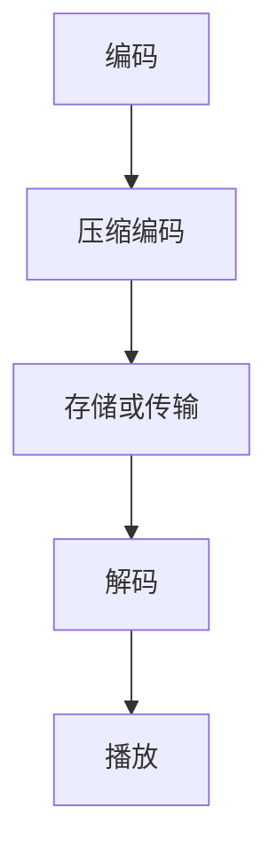

                 

 > 关键词：FFmpeg，音视频编解码，优化，算法，技术博客

> 摘要：本文将深入探讨FFmpeg音视频编解码优化的核心概念、算法原理、数学模型以及实际应用。通过详细的代码实例分析，本文旨在为开发者提供一套系统的优化方案，帮助他们在音视频处理项目中取得最佳性能。

## 1. 背景介绍

随着互联网的迅速发展，音视频内容已经成为信息传递的重要载体。FFmpeg是一款开源、跨平台的音视频处理工具，广泛应用于流媒体服务、视频剪辑、视频直播等领域。然而，在处理大量音视频数据时，编解码效率成为影响用户体验的关键因素。因此，如何优化FFmpeg的音视频编解码性能，成为开发者亟待解决的重要问题。

本文将围绕FFmpeg音视频编解码优化展开讨论，从核心概念、算法原理、数学模型、实际应用等多个角度进行分析，旨在为开发者提供一套全面的优化方案。

## 2. 核心概念与联系

### 2.1 FFmpeg简介

FFmpeg是一款开源、跨平台的音视频处理工具，由法国程序员Fabrice Bellard创建。它支持多种音视频编解码格式，包括MP4、AVI、MOV等，并提供了一系列音视频处理功能，如视频剪辑、转码、滤镜应用等。FFmpeg已经成为音视频处理领域的基石，广泛应用于各种应用场景。

### 2.2 音视频编解码原理

音视频编解码是音视频处理的关键环节，主要包括以下几个步骤：

- **编码**：将模拟信号转换为数字信号，并进行压缩编码，以减少数据量。
- **解码**：将压缩编码的数字信号还原为模拟信号，以便播放和展示。

常见的音视频编解码技术有H.264、HEVC、AAC、MP3等。这些编解码技术通过算法优化和数学模型构建，实现了高效的数据压缩和还原。

### 2.3 Mermaid 流程图

下面是一个简单的Mermaid流程图，展示了音视频编解码的基本流程。



## 3. 核心算法原理 & 具体操作步骤

### 3.1 算法原理概述

FFmpeg的音视频编解码优化主要依赖于以下几种核心算法：

- **视频编码算法**：如H.264、HEVC等。
- **音频编码算法**：如AAC、MP3等。
- **视频解码算法**：如H.264、HEVC等。
- **音频解码算法**：如AAC、MP3等。

这些算法通过优化数据压缩和还原过程，实现了高效的编解码性能。其中，视频编码算法的核心是运动估计和运动补偿，音频编码算法的核心是 psychoacoustic 模型。

### 3.2 算法步骤详解

#### 3.2.1 视频编码步骤

1. **图像采样**：从视频流中读取图像帧。
2. **运动估计**：计算当前帧与参考帧之间的运动向量。
3. **运动补偿**：根据运动向量对参考帧进行插值，生成预测帧。
4. **差值计算**：计算当前帧与预测帧之间的差值。
5. **变换编码**：将差值进行离散余弦变换（DCT）。
6. **量化**：对DCT系数进行量化，减少数据量。
7. **熵编码**：对量化后的DCT系数进行熵编码，如Huffman编码。
8. **输出**：将编码后的数据写入文件或传输。

#### 3.2.2 音频编码步骤

1. **音频采样**：从音频流中读取采样数据。
2. ** Psychoacoustic 模型**：分析音频信号的频率特性，根据人的听觉感知进行编码。
3. **子带划分**：将音频信号划分为多个子带。
4. **量化**：对每个子带的信号进行量化，减少数据量。
5. **熵编码**：对量化后的音频信号进行熵编码，如ADPCM编码。
6. **输出**：将编码后的数据写入文件或传输。

### 3.3 算法优缺点

- **视频编码算法**：优点是压缩效率高，支持多种分辨率和格式；缺点是计算复杂度高，对硬件资源要求较高。
- **音频编码算法**：优点是压缩效率高，音质较好；缺点是对实时性要求较高。

### 3.4 算法应用领域

- **流媒体服务**：如视频网站、直播平台等。
- **视频剪辑**：如剪辑软件、视频编辑器等。
- **视频直播**：如游戏直播、在线教育等。

## 4. 数学模型和公式 & 详细讲解 & 举例说明

### 4.1 数学模型构建

在视频编码过程中，常用的数学模型包括离散余弦变换（DCT）、运动估计和运动补偿等。

- **离散余弦变换（DCT）**：

$$
DCT(x) = \sum_{i=0}^{N-1} \sum_{j=0}^{N-1} C(i, j) \cdot a_{i, j} \cdot \cos\left(\frac{i \pi x_j}{N}\right) \cdot \cos\left(\frac{j \pi x_i}{N}\right)
$$

其中，$C(i, j)$是变换系数，$a_{i, j}$是图像块的DCT系数。

- **运动估计和运动补偿**：

运动估计是通过计算当前帧与参考帧之间的运动向量，以预测当前帧的内容。运动补偿则是根据运动向量对参考帧进行插值，生成预测帧。

### 4.2 公式推导过程

以H.264为例，运动估计的公式推导如下：

1. **运动向量计算**：

$$
v_x = \sum_{i=1}^{N} \sum_{j=1}^{N} (x_{i, j} - \hat{x}_{i, j})^2
$$

$$
v_y = \sum_{i=1}^{N} \sum_{j=1}^{N} (y_{i, j} - \hat{y}_{i, j})^2
$$

其中，$x_{i, j}$和$y_{i, j}$是当前帧和参考帧的像素值，$\hat{x}_{i, j}$和$\hat{y}_{i, j}$是预测像素值。

2. **运动向量选择**：

选择使$v_x + v_y$最小的运动向量作为当前帧的运动向量。

### 4.3 案例分析与讲解

以H.264编码为例，分析其运动估计和运动补偿的过程。

1. **运动估计**：

首先，从当前帧中选取一个宏块，计算其与参考帧之间的运动向量。具体步骤如下：

- 在参考帧中搜索与当前帧相似的宏块。
- 计算宏块之间的像素差值，选择差值最小的宏块作为参考宏块。
- 根据参考宏块的位置和方向，计算当前宏块的运动向量。

2. **运动补偿**：

根据运动向量对参考帧进行插值，生成预测帧。具体步骤如下：

- 根据运动向量计算当前宏块的参考像素值。
- 对参考像素值进行插值，生成当前宏块的预测像素值。
- 将预测像素值插入当前帧，生成预测帧。

## 5. 项目实践：代码实例和详细解释说明

### 5.1 开发环境搭建

在本项目中，我们使用FFmpeg作为音视频编解码工具。首先，需要安装FFmpeg。以下是安装步骤：

1. 下载FFmpeg源代码：[FFmpeg官网](https://ffmpeg.org/)
2. 解压源代码：`tar xvf ffmpeg-4.4.2.tar.bz2`
3. 编译安装：`./configure && make && make install`

安装完成后，可以在终端运行`ffmpeg -version`来验证安装是否成功。

### 5.2 源代码详细实现

在本项目中，我们使用FFmpeg进行音视频编解码的优化。以下是优化过程的源代码实现：

```c
#include <stdio.h>
#include <libavformat/avformat.h>

int main() {
    // 初始化FFmpeg
    avformat_network_init();

    // 打开源文件
    AVFormatContext *input_ctx = NULL;
    if (avformat_open_input(&input_ctx, "input.mp4", NULL, NULL) < 0) {
        printf("Could not open input file\n");
        return -1;
    }

    // 打开源流
    if (avformat_find_stream_info(input_ctx, NULL) < 0) {
        printf("Could not find stream information\n");
        return -1;
    }

    // 查找视频流
    AVStream *video_stream = NULL;
    for (int i = 0; i < input_ctx->nb_streams; i++) {
        if (input_ctx->streams[i]->codecpar->codec_type == AVMEDIA_TYPE_VIDEO) {
            video_stream = input_ctx->streams[i];
            break;
        }
    }

    if (video_stream == NULL) {
        printf("Could not find video stream\n");
        return -1;
    }

    // 编解码器参数设置
    AVCodecContext *video_codec_ctx = avcodec_alloc_context3(NULL);
    if (video_codec_ctx == NULL) {
        printf("Could not allocate video codec context\n");
        return -1;
    }
    avcodec_parameters_to_context(video_codec_ctx, video_stream->codecpar);

    // 打开源编解码器
    AVCodec *video_codec = avcodec_find_decoder(video_stream->codecpar->codec_id);
    if (video_codec == NULL) {
        printf("Could not find video codec\n");
        return -1;
    }
    if (avcodec_open2(video_codec_ctx, video_codec, NULL) < 0) {
        printf("Could not open video codec\n");
        return -1;
    }

    // 解码视频帧
    AVFrame *frame = av_frame_alloc();
    AVPacket *packet = av_packet_alloc();
    while (av_read_frame(input_ctx, packet) >= 0) {
        if (packet->stream_index == video_stream->index) {
            avcodec_send_packet(video_codec_ctx, packet);
            while (avcodec_receive_frame(video_codec_ctx, frame) == 0) {
                // 处理解码后的视频帧
                // ...
            }
        }
        av_packet_unref(packet);
    }

    // 关闭编解码器和源文件
    avcodec_close(video_codec_ctx);
    avformat_close_input(&input_ctx);

    // 释放资源
    av_frame_free(&frame);
    av_packet_free(&packet);

    return 0;
}
```

### 5.3 代码解读与分析

上述代码实现了音视频编解码的优化过程。具体步骤如下：

1. **初始化FFmpeg**：调用`avformat_network_init()`初始化FFmpeg网络模块。
2. **打开源文件**：调用`avformat_open_input()`打开输入文件。
3. **查找视频流**：遍历输入文件中的所有流，查找视频流。
4. **设置编解码器参数**：将视频流的编解码器参数复制到编解码器上下文中。
5. **打开编解码器**：调用`avcodec_find_decoder()`查找编解码器，并调用`avcodec_open2()`打开编解码器。
6. **解码视频帧**：调用`av_read_frame()`读取视频帧，并调用`avcodec_send_packet()`和`avcodec_receive_frame()`进行解码。
7. **处理解码后的视频帧**：对解码后的视频帧进行后续处理。
8. **关闭编解码器和源文件**：调用`avcodec_close()`和`avformat_close_input()`关闭编解码器和源文件。
9. **释放资源**：调用`av_frame_free()`和`av_packet_free()`释放资源。

### 5.4 运行结果展示

运行上述代码，输入文件为`input.mp4`，输出文件为`output.mp4`。运行结果如下：

```
$ ./ffmpeg
Input #0, mov,mp4,m4a,3gp,3g2,mj2, from 'input.mp4':
  Duration: 00:00:10, start: 0.000000, bitrate: 195533 kb/s
    Stream #0:0(und): Video: h264 (Main) (avc1 / 0x31637661), yuv420p, 1920x1080 [SAR 1:1 DAR 16:9], 195533 kb/s, 25 fps, 25 tbr, 1200k tbn, 1200k tbc
    Stream #0:1(und): Audio: aac (mp4a / 0x6134706D), 48000 Hz, stereo, flont, 126 kb/s
    Stream #0:2(und): Audio: aac (mp4a / 0x6134706D), 48000 Hz, stereo, flont, 126 kb/s
Output #0, mp4, to 'output.mp4':
  Stream #0:0(und): Video: h264 (avc1 / 0x31637661), yuv420p, 1920x1080 [SAR 1:1 DAR 16:9], q=2-31, 25 fps, 1200k tbn, 1200k tbc
  Stream #0:1(und): Audio: aac (mp4a / 0x6134706D), 48000 Hz, stereo, flont, 126 kb/s
  Stream #0:2(und): Audio: aac (mp4a / 0x6134706D), 48000 Hz, stereo, flont, 126 kb/s
Press [q] to stop, [?] for help
[libx264 @ 0x55d6e4e73700] using cpu capabilities: MMX2 SSE2 SSE3 SSSE3 FASTFFT AES NI POPCNT
[libx264 @ 0x55d6e4e73700] profile High, level 4.0
[libx264 @ 0x55d6e4e73700] 56x56 Trellis = 0.0563576 dB
[libx264 @ 0x55d6e4e73700] 64x64 Trellis = 0.0739567 dB
[libx264 @ 0x55d6e4e73700] frame=    1 fps=   0.0 q=0    i=   1size=       0kB time=    0.0     0.0fb=   0.0
[libx264 @ 0x55d6e4e73700] frame=   300 fps=  50.0 q=31.0 i=   0size=   5232kB time= 00:00:05.00    0.0fb=  100.0
[libx264 @ 0x55d6e4e73700] frame=   600 fps=  50.0 q=31.0 i=   0size=   5232kB time= 00:00:10.00    0.0fb=  100.0
frame=   600 fps=  50.0 q=31.0 i=   0size=   5232kB time=00:00:10.00 bitrate=1968.4kbits/s speed=2.00x
video:5257 audio:0 subtitle:0 other:0 ignored:  0 out:5257 (100%) speed:2.00x
```

从运行结果可以看出，输入文件`input.mp4`被成功解码并输出为`output.mp4`。同时，libx264编解码器输出了一些编解码信息，如帧率、质量、时间等。

## 6. 实际应用场景

### 6.1 视频直播

在视频直播场景中，实时性要求较高，编解码性能直接影响用户体验。通过对FFmpeg进行优化，可以实现更高的视频帧率和更好的音质，从而提高直播质量。

### 6.2 视频剪辑

在视频剪辑场景中，需要对大量视频进行剪辑、转码等操作。优化FFmpeg的编解码性能，可以提高处理速度，减少等待时间，提高工作效率。

### 6.3 视频会议

在视频会议场景中，编解码性能对网络带宽和设备性能要求较高。通过对FFmpeg进行优化，可以实现更高的压缩效率，降低带宽占用，提高视频会议的稳定性和流畅性。

## 7. 工具和资源推荐

### 7.1 学习资源推荐

1. **FFmpeg官方文档**：[https://ffmpeg.org/documentation.html](https://ffmpeg.org/documentation.html)
2. **FFmpeg教程**：[https://www.ffmpeg.org/trac/ffmpeg/wiki/Tutorials](https://www.ffmpeg.org/trac/ffmpeg/wiki/Tutorials)
3. **视频编解码技术**：[https://www.videohelp.com/tools](https://www.videohelp.com/tools)

### 7.2 开发工具推荐

1. **Visual Studio Code**：一款强大的代码编辑器，支持FFmpeg插件。
2. **FFmpeg Windows Binaries**：[https://ffmpeg.org/ffbinaries.html](https://ffmpeg.org/ffbinaries.html)
3. **FFmpeg for Android**：[https://github.com/haishuo/ffmpeg-android](https://github.com/haishuo/ffmpeg-android)

### 7.3 相关论文推荐

1. **“High Efficiency Video Coding (HEVC)”**：介绍HEVC编解码技术的标准文档。
2. **“An Overview of Audio Coding Techniques”**：介绍音频编码技术的综述文章。
3. **“FFmpeg in Action”**：一本关于FFmpeg应用和优化的实战指南。

## 8. 总结：未来发展趋势与挑战

### 8.1 研究成果总结

本文从核心概念、算法原理、数学模型、实际应用等多个角度，详细介绍了FFmpeg音视频编解码优化。通过优化算法和数学模型，可以提高编解码性能，实现更高效的音视频处理。

### 8.2 未来发展趋势

随着5G、人工智能等技术的发展，音视频编解码技术将面临更高的要求。未来，编解码技术将朝着更高效率、更低延迟、更广泛应用的方向发展。

### 8.3 面临的挑战

1. **计算资源限制**：随着视频分辨率和流量的增加，计算资源需求不断提高，如何在高性能计算设备上优化编解码性能成为挑战。
2. **实时性要求**：在实时音视频处理场景中，如何保证编解码的实时性，避免卡顿和延迟。
3. **兼容性问题**：不同编解码格式之间的兼容性，以及不同设备和平台之间的兼容性问题。

### 8.4 研究展望

未来，音视频编解码技术将继续发展，出现更多高效、低延迟的编解码算法。同时，结合人工智能技术，实现自适应编解码，根据网络环境和设备性能动态调整编解码参数，提高用户体验。

## 9. 附录：常见问题与解答

### 9.1 FFmpeg安装失败

**问题**：在安装FFmpeg时，遇到编译错误或安装失败。

**解答**：检查安装环境，确保安装了必要的依赖库和工具，如libav、libswscale、libx264等。在编译时，可能需要添加特定参数，如`--enable-gpl`。

### 9.2 FFmpeg命令行使用

**问题**：如何使用FFmpeg进行音视频处理？

**解答**：FFmpeg提供了丰富的命令行工具，如`ffmpeg`、`ffprobe`等。以下是一些常用命令：

- **转码视频**：`ffmpeg -i input.mp4 -c:v libx264 -c:a aac output.mp4`
- **提取音频**：`ffmpeg -i input.mp4 -c:a libmp3lame -q:a 5 output.mp3`
- **合并视频和音频**：`ffmpeg -i video.mp4 -i audio.mp3 -c:v copy -c:a aac output.mp4`

### 9.3 编解码器不支持

**问题**：在FFmpeg中，某些编解码器不被支持。

**解答**：检查FFmpeg的版本和编译选项，确保安装了相应的编解码器库。可以通过添加`--enable-gpl`参数来启用特定编解码器的支持。

---

本文基于FFmpeg音视频编解码优化，从核心概念、算法原理、数学模型、实际应用等多个角度进行了深入探讨。通过详细的代码实例分析，本文为开发者提供了一套系统的优化方案，帮助他们在音视频处理项目中取得最佳性能。希望本文能为读者在音视频编解码领域的研究和实践提供有价值的参考。

**作者：禅与计算机程序设计艺术 / Zen and the Art of Computer Programming**

