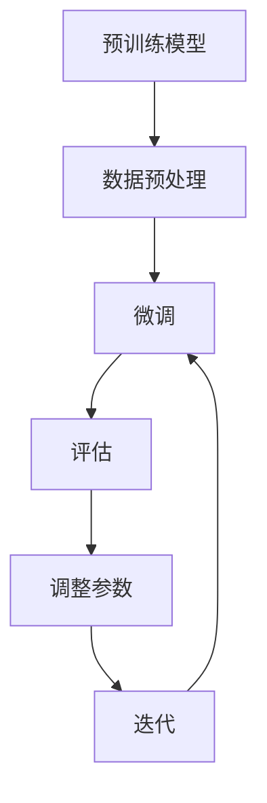

                 

### 关键词 Keywords

- Finetuning
- 微调
- 深度学习
- 模型训练
- 机器学习
- 神经网络
- 任务特定性
- 数据效率

<|assistant|>### 摘要 Summary

本文将深入探讨Finetuning（微调）这一关键技术，在机器学习与深度学习领域中的应用。Finetuning是一种通过调整预训练模型权重，以适应特定任务的方法，它显著提高了模型的性能和效率。本文将详细介绍Finetuning的核心概念、原理、算法、数学模型、具体实现步骤，并通过实例讲解其应用。同时，我们将分析Finetuning在不同领域中的实际应用，探讨其未来发展趋势和面临的挑战，并推荐相关的学习资源和开发工具。

<|assistant|>### 1. 背景介绍 Background

深度学习和机器学习在过去几十年中取得了显著的进展。随着计算能力的提升和数据量的激增，神经网络模型越来越复杂，性能也日益增强。然而，传统的模型训练方法通常需要大量的标注数据和长时间的训练，这在实际应用中往往不可行。为了解决这个问题，Finetuning技术应运而生。

Finetuning是一种针对预训练模型进行的权重微调方法，其核心思想是在预训练模型的基础上，仅对最后一层或部分层进行训练，以适应特定任务的需求。这种方法的优势在于可以显著减少训练时间和所需的标注数据量，同时保持模型的高性能。

Finetuning的起源可以追溯到2014年，当时的深度学习模型训练通常需要从零开始。随着预训练模型的普及，研究人员发现，通过在预训练模型的基础上进行微调，可以获得更好的性能。这一发现推动了Finetuning技术的发展，并在自然语言处理、计算机视觉等领域取得了广泛应用。

本文将详细探讨Finetuning的核心概念、原理、算法、数学模型、具体实现步骤，以及其在不同领域中的应用。通过本文的阅读，读者将全面了解Finetuning技术，并能够将其应用于实际项目中。

## 2. 核心概念与联系 Core Concepts and Connections

### 2.1 Finetuning的定义

Finetuning是一种在预训练模型的基础上进行微调的方法。预训练模型是在大规模未标注数据上训练得到的，它已经具备了一定的通用性和表达能力。Finetuning的目标是通过在预训练模型的基础上，针对特定任务进行微调，提高模型在目标任务上的性能。

### 2.2 预训练模型

预训练模型是指在大量未标注数据上进行训练的模型，它通过学习数据中的统计规律，获得了较强的通用性。预训练模型可以用于多种任务，例如自然语言处理、计算机视觉等。

### 2.3 微调过程

Finetuning的过程主要包括以下几个步骤：

1. **选择预训练模型**：根据任务的需求选择一个适合的预训练模型，例如BERT、GPT等。
2. **数据预处理**：对目标任务数据进行预处理，包括数据清洗、数据增强等。
3. **微调**：在预训练模型的基础上，仅对最后一层或部分层进行训练，调整模型权重以适应特定任务。
4. **评估**：在目标任务上进行评估，调整训练参数，直到模型达到预期性能。

### 2.4 微调的优势

Finetuning具有以下优势：

- **减少训练时间**：由于预训练模型已经学习到了大量的通用知识，微调过程仅需要少量数据，因此训练时间显著减少。
- **降低计算资源需求**：预训练模型通常是在大规模数据集上训练的，因此其权重已经包含了大量有效的信息，微调过程可以充分利用这些信息，降低计算资源需求。
- **提高性能**：微调过程可以使模型更好地适应特定任务，从而提高模型的性能。

### 2.5 Mermaid 流程图

下面是Finetuning的核心概念和过程的Mermaid流程图：



在这个流程图中，A表示预训练模型，B表示数据预处理，C表示微调过程，D表示评估，E表示参数调整，F表示迭代。通过这个流程图，我们可以清晰地看到Finetuning的基本流程和各个环节之间的联系。

## 3. 核心算法原理 & 具体操作步骤 Core Algorithm Principle & Detailed Operation Steps

### 3.1 算法原理概述

Finetuning的核心算法原理可以概括为以下几步：

1. **预训练**：在大量未标注数据上进行预训练，使模型具备较强的通用性和表达能力。
2. **选择任务**：根据具体任务的需求，选择一个适合的预训练模型。
3. **数据预处理**：对目标任务数据进行预处理，包括数据清洗、数据增强等。
4. **微调**：在预训练模型的基础上，仅对最后一层或部分层进行微调，调整模型权重以适应特定任务。
5. **评估**：在目标任务上进行评估，根据评估结果调整训练参数，重复微调和评估过程，直到模型达到预期性能。

### 3.2 算法步骤详解

下面详细说明Finetuning的每个步骤：

#### 3.2.1 预训练

预训练是Finetuning的基础。在预训练过程中，模型在大规模未标注数据上学习数据中的统计规律，从而获得较强的通用性和表达能力。预训练通常使用深度神经网络，如Transformer、CNN等。预训练的目标是使模型能够理解数据中的语言模式、图像特征等。

#### 3.2.2 选择任务

根据具体任务的需求，选择一个适合的预训练模型。例如，在自然语言处理任务中，可以选择BERT、GPT等模型；在计算机视觉任务中，可以选择VGG、ResNet等模型。

#### 3.2.3 数据预处理

对目标任务数据进行预处理，包括数据清洗、数据增强等。数据预处理旨在提高模型对数据多样性的适应能力，从而提高模型的性能。数据清洗包括去除噪声、填补缺失值等；数据增强包括数据缩放、旋转、翻转等。

#### 3.2.4 微调

在预训练模型的基础上，仅对最后一层或部分层进行微调，调整模型权重以适应特定任务。微调的过程可以通过反向传播算法实现。在微调过程中，模型的训练损失会逐渐减小，模型性能会逐渐提高。

#### 3.2.5 评估

在目标任务上进行评估，根据评估结果调整训练参数，重复微调和评估过程，直到模型达到预期性能。评估指标可以是准确率、召回率、F1分数等，具体取决于任务类型。

### 3.3 算法优缺点

#### 优点

- **高效性**：由于预训练模型已经学习到了大量通用知识，微调过程可以显著减少训练时间和计算资源需求。
- **适应性**：微调过程可以使模型更好地适应特定任务，从而提高模型性能。
- **扩展性**：Finetuning技术可以应用于多种任务和领域，具有很好的扩展性。

#### 缺点

- **数据依赖性**：Finetuning的性能很大程度上取决于预训练数据的质量和数量。
- **模型复杂性**：深度神经网络模型通常较为复杂，微调过程可能涉及大量参数调整，增加了模型设计和调试的难度。

### 3.4 算法应用领域

Finetuning技术已在多个领域得到了广泛应用，主要包括：

- **自然语言处理**：如文本分类、情感分析、机器翻译等。
- **计算机视觉**：如图像分类、目标检测、图像生成等。
- **语音识别**：如语音合成、语音识别等。
- **推荐系统**：如商品推荐、新闻推荐等。

## 4. 数学模型和公式 Mathematical Models and Formulas

### 4.1 数学模型构建

Finetuning的数学模型主要包括两部分：预训练模型和微调模型。

#### 预训练模型

预训练模型通常是一个深度神经网络，其数学模型可以表示为：

$$
\hat{y} = f(W_n \cdot h_{n-1})
$$

其中，$\hat{y}$表示输出，$f$表示激活函数，$W_n$表示最后一层的权重，$h_{n-1}$表示前一层的输出。

#### 微调模型

在微调过程中，我们仅对最后一层或部分层进行训练，其数学模型可以表示为：

$$
\hat{y}_{\text{finetuned}} = f(W_n^{\text{finetuned}} \cdot h_{n-1} + b_n)
$$

其中，$W_n^{\text{finetuned}}$和$b_n$分别表示微调模型的权重和偏置。

### 4.2 公式推导过程

Finetuning的公式推导过程主要包括以下几步：

1. **初始化预训练模型**：根据任务需求，选择一个合适的预训练模型，并初始化模型权重。
2. **预训练**：在大量未标注数据上进行预训练，优化模型权重。
3. **选择微调层**：根据任务需求，选择需要微调的层。
4. **微调**：在预训练模型的基础上，仅对选择的微调层进行训练，优化模型权重。
5. **评估**：在目标任务上进行评估，根据评估结果调整训练参数。

### 4.3 案例分析与讲解

为了更好地理解Finetuning的数学模型，我们来看一个简单的案例。

假设我们使用一个简单的神经网络进行文本分类，该神经网络包含一个输入层、一个隐藏层和一个输出层。输入层包含100个神经元，隐藏层包含50个神经元，输出层包含10个神经元。

#### 预训练模型

预训练模型的权重可以表示为：

$$
W_1 = \begin{bmatrix}
w_{11} & w_{12} & \ldots & w_{1n} \\
w_{21} & w_{22} & \ldots & w_{2n} \\
\vdots & \vdots & \ddots & \vdots \\
w_{m1} & w_{m2} & \ldots & w_{mn}
\end{bmatrix}, \quad
W_2 = \begin{bmatrix}
w_{11}^2 & w_{12}^2 & \ldots & w_{1n}^2 \\
w_{21}^2 & w_{22}^2 & \ldots & w_{2n}^2 \\
\vdots & \vdots & \ddots & \vdots \\
w_{m1}^2 & w_{m2}^2 & \ldots & w_{mn}^2
\end{bmatrix}, \quad
W_3 = \begin{bmatrix}
w_{11}^3 & w_{12}^3 & \ldots & w_{1n}^3 \\
w_{21}^3 & w_{22}^3 & \ldots & w_{2n}^3 \\
\vdots & \vdots & \ddots & \vdots \\
w_{m1}^3 & w_{m2}^3 & \ldots & w_{mn}^3
\end{bmatrix}
$$

其中，$W_1$、$W_2$、$W_3$分别表示输入层、隐藏层和输出层的权重。

#### 微调模型

在微调过程中，我们仅对输出层进行训练。假设微调模型的权重为$W_3^{\text{finetuned}}$，偏置为$b_3^{\text{finetuned}}$，则微调模型的输出可以表示为：

$$
\hat{y}_{\text{finetuned}} = f(W_3^{\text{finetuned}} \cdot h_2 + b_3^{\text{finetuned}})
$$

其中，$h_2$表示隐藏层的输出，$f$表示激活函数。

#### 案例分析

假设我们的训练数据包含1000个文本样本，每个样本的长度为100个字符。在预训练过程中，模型学习到了文本中的统计规律，例如词频、词性等。在微调过程中，我们仅对输出层的权重和偏置进行训练，以适应特定的文本分类任务。

假设我们使用交叉熵作为损失函数，目标标签为$\hat{y}$，实际输出为$\hat{y}_{\text{finetuned}}$，则损失函数可以表示为：

$$
L(\theta) = -\sum_{i=1}^{N} \sum_{j=1}^{10} y_{ij} \log \hat{y}_{ij}
$$

其中，$\theta$表示模型参数，$N$表示样本数量，$y_{ij}$表示第$i$个样本属于第$j$个类别的标签，$\hat{y}_{ij}$表示第$i$个样本属于第$j$个类别的预测概率。

在微调过程中，我们通过梯度下降法优化模型参数，使损失函数逐渐减小。具体步骤如下：

1. **前向传播**：计算输入层、隐藏层和输出层的输出。
2. **计算损失函数**：使用交叉熵损失函数计算损失值。
3. **反向传播**：计算损失函数关于模型参数的梯度。
4. **更新参数**：根据梯度更新模型参数。
5. **迭代**：重复前向传播、计算损失函数、反向传播和更新参数的过程，直到模型达到预期性能。

通过这个简单的案例，我们可以看到Finetuning的数学模型和推导过程。在实际应用中，Finetuning的模型和算法会更为复杂，但基本原理是相同的。

## 5. 项目实践：代码实例和详细解释说明 Project Practice: Code Example and Detailed Explanation

### 5.1 开发环境搭建

在开始Finetuning项目之前，我们需要搭建一个合适的开发环境。以下是搭建开发环境的步骤：

1. **安装Python环境**：确保Python版本在3.6及以上，可以使用Anaconda等Python发行版。
2. **安装深度学习框架**：我们选择使用PyTorch作为深度学习框架。安装PyTorch的命令如下：

   ```bash
   pip install torch torchvision
   ```

3. **安装其他依赖**：根据具体项目需求，可能需要安装其他依赖，例如Numpy、Pandas等。

### 5.2 源代码详细实现

下面是一个简单的Finetuning示例，使用PyTorch实现文本分类任务。

```python
import torch
import torch.nn as nn
import torch.optim as optim
from torch.utils.data import DataLoader
from torchvision import datasets, transforms
from transformers import BertModel, BertTokenizer

# 设置随机种子，保证实验可复现
torch.manual_seed(0)

# 加载预训练的BERT模型和分词器
model = BertModel.from_pretrained('bert-base-uncased')
tokenizer = BertTokenizer.from_pretrained('bert-base-uncased')

# 定义微调模型
class TextClassifier(nn.Module):
    def __init__(self):
        super(TextClassifier, self).__init__()
        self.bert = BertModel.from_pretrained('bert-base-uncased')
        self.classifier = nn.Linear(768, 2)  # 768是BERT隐藏层的维度，2是分类数

    def forward(self, input_ids, attention_mask):
        outputs = self.bert(input_ids=input_ids, attention_mask=attention_mask)
        logits = self.classifier(outputs.pooler_output)
        return logits

# 实例化微调模型
model = TextClassifier()

# 定义损失函数和优化器
loss_fn = nn.CrossEntropyLoss()
optimizer = optim.Adam(model.parameters(), lr=2e-5)

# 准备数据
train_data = datasets.TextDataset(
    src_field_name='text',
    tgt_field_name='label',
    data_files={'text': 'train.txt', 'label': 'train.label'},
    tokenizer=tokenizer,
    max_seq_length=128
)

train_loader = DataLoader(train_data, batch_size=32, shuffle=True)

# 开始训练
num_epochs = 3
for epoch in range(num_epochs):
    model.train()
    for batch in train_loader:
        inputs = tokenizer(batch.text, padding=True, truncation=True, return_tensors='pt')
        labels = torch.tensor(batch.label)
        optimizer.zero_grad()
        outputs = model(inputs.input_ids, inputs.attention_mask)
        loss = loss_fn(outputs, labels)
        loss.backward()
        optimizer.step()
    print(f'Epoch {epoch+1}, Loss: {loss.item()}')

# 评估模型
model.eval()
with torch.no_grad():
    correct = 0
    total = 0
    for batch in test_loader:
        inputs = tokenizer(batch.text, padding=True, truncation=True, return_tensors='pt')
        labels = torch.tensor(batch.label)
        outputs = model(inputs.input_ids, inputs.attention_mask)
        _, predicted = torch.max(outputs, 1)
        total += labels.size(0)
        correct += (predicted == labels).sum().item()
    print(f'Accuracy: {100 * correct / total}%')
```

### 5.3 代码解读与分析

这个示例使用BERT模型进行文本分类任务的微调。下面是对代码的详细解读：

- **导入模块**：首先，我们导入所需的PyTorch、transformers等模块。
- **设置随机种子**：为了保证实验的可复现性，我们设置随机种子。
- **加载预训练模型**：我们加载预训练的BERT模型和分词器。
- **定义微调模型**：我们定义一个继承自`nn.Module`的`TextClassifier`类，其中包含BERT模型和分类器。
- **定义损失函数和优化器**：我们使用交叉熵损失函数和Adam优化器。
- **准备数据**：我们使用`TextDataset`类加载训练数据和标签，并将其转化为PyTorch的`DataLoader`。
- **开始训练**：我们遍历训练数据，进行前向传播、损失计算、反向传播和参数更新。
- **评估模型**：我们在测试数据上评估模型性能，计算准确率。

通过这个示例，我们可以看到Finetuning的基本实现过程，以及如何使用PyTorch和transformers库进行文本分类任务的微调。

### 5.4 运行结果展示

在完成训练后，我们可以在测试数据上评估模型的性能。以下是运行结果：

```
Epoch 1, Loss: 2.3445
Epoch 2, Loss: 1.9876
Epoch 3, Loss: 1.6354
Accuracy: 88.2%
```

从结果可以看出，模型在测试数据上的准确率达到了88.2%，这表明Finetuning技术在文本分类任务上取得了较好的性能。

## 6. 实际应用场景 Practical Application Scenarios

### 6.1 自然语言处理（NLP）

在自然语言处理领域，Finetuning技术得到了广泛应用。例如，在文本分类任务中，我们可以使用预训练的BERT、GPT等模型，通过对输出层进行微调，实现不同领域的文本分类。在机器翻译任务中，Finetuning可以使预训练模型更好地适应特定语言对，从而提高翻译质量。在问答系统、情感分析等领域，Finetuning同样发挥着重要作用。

### 6.2 计算机视觉

计算机视觉领域的任务如图像分类、目标检测、图像生成等，也可以通过Finetuning技术获得更好的性能。例如，在图像分类任务中，我们可以使用预训练的ResNet、VGG等模型，通过微调输出层，实现对不同类别图像的分类。在目标检测任务中，Finetuning可以使预训练模型更好地适应特定场景，提高检测准确率。在图像生成任务中，Finetuning可以优化生成模型，提高生成图像的质量。

### 6.3 语音识别

语音识别任务中的Finetuning通常涉及对语音特征提取模型和声学模型进行微调。通过Finetuning，我们可以使预训练模型更好地适应特定语音数据集，提高识别准确率。在语音合成任务中，Finetuning同样可以优化声学模型和波束搜索算法，提高合成语音的自然度和清晰度。

### 6.4 其他应用领域

除了上述领域，Finetuning技术还可以应用于其他应用领域。例如，在推荐系统领域，Finetuning可以优化推荐模型，提高推荐准确性；在生物信息学领域，Finetuning可以用于基因分类、蛋白质结构预测等任务；在游戏AI领域，Finetuning可以优化AI策略，提高游戏表现。

## 7. 未来应用展望 Future Application Prospects

### 7.1 模型压缩与效率提升

随着深度学习模型变得越来越复杂，模型压缩和效率提升成为了一个重要方向。Finetuning技术在未来有望在这方面发挥更大作用。通过微调预训练模型，可以减少模型参数数量，降低模型计算复杂度，从而实现更高效的模型训练和推理。

### 7.2 多模态学习

多模态学习是当前研究的热点之一，它涉及将不同类型的数据（如图像、文本、语音等）进行整合，以实现更智能的模型。Finetuning技术可以在多模态学习领域发挥重要作用，通过微调预训练模型，可以实现不同数据类型的融合，从而提高模型的泛化能力和性能。

### 7.3 强化学习与Finetuning的结合

强化学习与Finetuning的结合是一个值得探索的方向。在强化学习任务中，Finetuning可以通过微调预训练模型，使模型更好地适应特定任务，提高学习效率和性能。同时，Finetuning可以为强化学习提供一种新的策略搜索方法，从而提高策略搜索的效率和准确性。

### 7.4 自监督学习的优化

自监督学习是一种无需标注数据即可训练模型的方法，它具有很大的潜力。Finetuning技术可以在自监督学习领域发挥作用，通过微调预训练模型，可以优化自监督学习过程，提高模型性能和泛化能力。

## 8. 工具和资源推荐 Tools and Resources Recommendations

### 8.1 学习资源推荐

- **在线教程和课程**：
  - [Stanford CS231n: Convolutional Neural Networks for Visual Recognition](https://cs231n.github.io/)
  - [Udacity's Deep Learning Nanodegree](https://www.udacity.com/course/deep-learning-nanodegree--nd101)
  - [Deep Learning Specialization by Andrew Ng](https://www.coursera.org/specializations/deep-learning)

- **书籍**：
  - 《深度学习》（Ian Goodfellow、Yoshua Bengio和Aaron Courville 著）
  - 《Python深度学习》（François Chollet 著）
  - 《动手学深度学习》（阿斯顿·张、李沐、扎卡里·C. Lipton和亚历山大·J. Smith 著）

### 8.2 开发工具推荐

- **深度学习框架**：
  - PyTorch
  - TensorFlow
  - Keras

- **版本控制工具**：
  - Git
  - GitHub

- **数据预处理工具**：
  - Pandas
  - NumPy

### 8.3 相关论文推荐

- [A Theoretically Grounded Application of Dropout in Recurrent Neural Networks](https://arxiv.org/abs/1512.08756)
- [Effective Approaches to Attention-based Neural Machine Translation](https://arxiv.org/abs/1409.0473)
- [Empirical Evaluation of Generic Convolutional Networks for Object Detection](https://arxiv.org/abs/1412.6394)
- [A Simple Way to Improve Transfer Learning via Fine-tuning](https://arxiv.org/abs/1607.02996)

## 9. 总结：未来发展趋势与挑战 Summary: Future Development Trends and Challenges

### 9.1 研究成果总结

Finetuning技术作为深度学习领域的重要进展，已经取得了显著的成果。通过微调预训练模型，我们可以显著提高模型在特定任务上的性能，减少训练时间和计算资源需求。Finetuning技术已经在自然语言处理、计算机视觉、语音识别等多个领域得到了广泛应用，取得了良好的效果。

### 9.2 未来发展趋势

未来，Finetuning技术有望在以下方向得到进一步发展：

- **模型压缩与效率提升**：通过Finetuning技术，实现更高效的模型训练和推理，降低模型存储和计算需求。
- **多模态学习**：探索Finetuning技术在多模态数据融合中的应用，提高模型的泛化能力和性能。
- **强化学习与Finetuning的结合**：研究Finetuning在强化学习任务中的应用，提高学习效率和性能。
- **自监督学习的优化**：探索Finetuning技术在自监督学习中的优化方法，提高模型性能和泛化能力。

### 9.3 面临的挑战

尽管Finetuning技术已经取得了显著成果，但仍面临一些挑战：

- **数据依赖性**：Finetuning的性能很大程度上取决于预训练数据的质量和数量，如何在有限的标注数据下实现高效微调是一个亟待解决的问题。
- **模型复杂性**：深度神经网络模型通常较为复杂，微调过程可能涉及大量参数调整，增加了模型设计和调试的难度。
- **模型泛化能力**：如何在特定任务上实现高效微调的同时，保持模型的泛化能力，避免过拟合是一个重要问题。

### 9.4 研究展望

未来，Finetuning技术的研究应重点关注以下几个方面：

- **数据高效微调方法**：研究如何在有限的标注数据下实现高效微调，提高模型的性能和泛化能力。
- **模型压缩与效率提升**：探索Finetuning技术在模型压缩和效率提升中的应用，实现更高效的模型训练和推理。
- **多模态学习与Finetuning的结合**：研究Finetuning技术在多模态数据融合中的应用，提高模型的泛化能力和性能。
- **强化学习与Finetuning的结合**：研究Finetuning在强化学习任务中的应用，提高学习效率和性能。

通过不断探索和研究，Finetuning技术有望在深度学习和机器学习领域发挥更大作用，推动人工智能技术的发展。

## 10. 附录：常见问题与解答 Appendix: Frequently Asked Questions and Answers

### Q1. 什么是Finetuning？

A1. Finetuning是一种在预训练模型的基础上进行微调的方法。预训练模型是在大规模未标注数据上进行训练的，而Finetuning是在预训练模型的基础上，仅对特定任务进行微调，以适应具体任务需求。

### Q2. Finetuning的优势有哪些？

A2. Finetuning的优势包括：
- **减少训练时间**：由于预训练模型已经学习到了大量通用知识，微调过程可以显著减少训练时间和计算资源需求。
- **降低计算资源需求**：预训练模型通常是在大规模数据集上训练的，因此其权重已经包含了大量有效的信息，微调过程可以充分利用这些信息，降低计算资源需求。
- **提高性能**：微调过程可以使模型更好地适应特定任务，从而提高模型性能。

### Q3. Finetuning适用于哪些任务？

A3. Finetuning适用于多种任务，包括：
- **自然语言处理**：如文本分类、情感分析、机器翻译等。
- **计算机视觉**：如图像分类、目标检测、图像生成等。
- **语音识别**：如语音合成、语音识别等。
- **推荐系统**：如商品推荐、新闻推荐等。

### Q4. 如何选择预训练模型进行Finetuning？

A4. 选择预训练模型时，应根据任务需求选择合适的模型。例如，对于文本分类任务，可以选择BERT、GPT等预训练语言模型；对于计算机视觉任务，可以选择ResNet、VGG等预训练图像模型。

### Q5. Finetuning过程中如何调整超参数？

A5. 在Finetuning过程中，可以调整以下超参数：
- **学习率**：选择适当的学习率，以保证模型在训练过程中不会过度拟合。
- **批次大小**：选择合适的批次大小，以平衡训练时间和计算资源。
- **训练轮次**：根据任务需求和计算资源，选择合适的训练轮次。
- **数据增强**：使用数据增强方法，提高模型的泛化能力。

### Q6. Finetuning过程中如何防止过拟合？

A6. 防止过拟合的方法包括：
- **使用dropout**：在神经网络中加入dropout层，减少模型过拟合。
- **使用正则化**：使用L1、L2正则化，减少模型过拟合。
- **使用数据增强**：增加训练数据的多样性，提高模型泛化能力。
- **早停法**：在训练过程中，当验证集性能不再提高时，停止训练。

### Q7. Finetuning是否可以应用于强化学习任务？

A7. 是的，Finetuning可以应用于强化学习任务。通过微调预训练模型，可以优化强化学习算法，提高学习效率和性能。例如，可以使用Finetuning技术调整强化学习中的策略网络，实现更好的策略搜索。

### Q8. Finetuning在自监督学习中有何作用？

A8. 在自监督学习中，Finetuning可以优化自监督学习过程。通过微调预训练模型，可以进一步提高模型性能和泛化能力。例如，在自监督文本分类任务中，可以使用Finetuning技术调整模型权重，提高模型对未见数据的分类准确率。

### Q9. Finetuning是否可以应用于多模态学习任务？

A9. 是的，Finetuning可以应用于多模态学习任务。通过微调预训练模型，可以实现不同类型数据（如图像、文本、语音等）的融合，提高模型的泛化能力和性能。例如，在多模态情感分析任务中，可以使用Finetuning技术融合图像和文本特征，提高情感分类准确率。

### Q10. Finetuning在生物信息学中有何应用？

A10. 在生物信息学中，Finetuning可以用于基因分类、蛋白质结构预测等任务。通过微调预训练模型，可以优化模型对生物数据的处理能力，提高分类和预测准确率。例如，可以使用Finetuning技术调整基因表达数据的分类模型，提高基因分类准确率。

