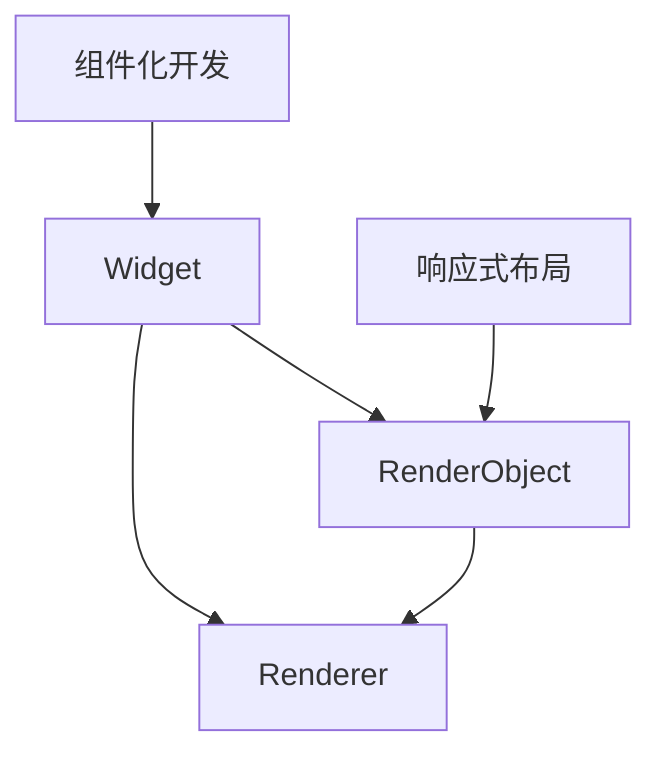

                 

 关键词：Flutter UI框架，用户界面设计，响应式布局，组件化开发，用户体验，性能优化，跨平台开发

## 摘要

本文将深入探讨Flutter UI框架，旨在为开发者提供构建美观用户界面的实用指南。通过详细分析Flutter的核心概念、设计原理、以及具体的开发实践，本文将帮助读者了解如何利用Flutter框架快速实现响应式、高效且美观的移动应用用户界面。文章还将讨论Flutter在数学模型和公式中的应用，并通过真实项目的代码实例，展示Flutter UI框架的开发过程和技巧。最后，本文将展望Flutter在未来应用场景中的发展趋势，并针对开发者提出的一些建议。

## 1. 背景介绍

### 1.1 Flutter的兴起

Flutter是Google在2017年推出的一款开源UI框架，旨在帮助开发者构建高性能、美观且响应迅速的移动应用。Flutter采用Dart语言编写，Dart是一种现代化的编程语言，具有编译型语言的高性能和解释型语言的开发效率。Flutter框架的出现，打破了移动应用开发中长期以来iOS和Android平台各自为政的局面，实现了真正的跨平台开发。

### 1.2 Flutter的优势

**跨平台开发**：Flutter能够使用一套代码同时构建iOS和Android应用，减少了开发和维护成本。

**高性能**：Flutter采用Skia图形引擎，实现了接近原生应用的高性能渲染。

**丰富的组件库**：Flutter提供了丰富的组件和Widget，开发者可以快速搭建UI界面。

**热重载**：Flutter支持热重载功能，开发者可以实时看到代码更改的效果，提高了开发效率。

### 1.3 Flutter的应用场景

**移动应用开发**：Flutter适用于各类移动应用开发，特别是需要快速迭代和跨平台部署的应用。

**Web应用开发**：虽然Flutter主要用于移动应用，但也可以用于Web应用开发，为开发者提供了一致的开发体验。

**桌面应用开发**：Flutter还支持桌面应用开发，开发者可以轻松地将移动应用扩展到桌面平台。

## 2. 核心概念与联系

### 2.1 响应式布局

响应式布局是Flutter UI框架的核心概念之一，它允许开发者编写一次代码，适应不同的屏幕尺寸和设备类型。响应式布局的实现依赖于Flutter的“框布局”机制。

### 2.2 组件化开发

组件化开发是Flutter UI框架的另一个重要概念，它鼓励开发者将UI界面分解为独立的组件，这些组件可以独立开发、测试和复用。组件化开发提高了代码的可维护性和可扩展性。

### 2.3 Flutter架构

Flutter架构包括以下几个关键部分：

**Widget**：Widget是Flutter中的最小UI构建单元，每个Widget代表UI中的一个可交互元素。

**RenderObject**：RenderObject是Widget的底层实现，负责实际的渲染过程。

**Renderer**：Renderer是Flutter中的渲染引擎，它将RenderObject转换为屏幕上的像素。

### 2.4 Mermaid流程图

下面是一个Mermaid流程图，展示了Flutter UI框架的核心概念和联系：



## 3. 核心算法原理 & 具体操作步骤

### 3.1 算法原理概述

Flutter UI框架的核心算法原理是基于Widget驱动的渲染机制。Widget作为UI构建的基本单元，通过树形结构组织在一起，形成完整的用户界面。每次UI状态发生变化时，Flutter会重新构建Widget树，并计算出新的渲染结果。

### 3.2 算法步骤详解

1. **构建Widget树**：开发者使用各种Widget构建UI界面，形成树形结构。
2. **状态管理**：Flutter使用Stateful和Stateless Widget来管理UI状态。
3. **构建RenderObject树**：根据Widget树，Flutter构建相应的RenderObject树。
4. **渲染过程**：Renderer将RenderObject转换为屏幕上的像素，并绘制到屏幕上。

### 3.3 算法优缺点

**优点**：

- **高性能**：Flutter的渲染机制接近原生应用，具有优异的性能。
- **跨平台**：一套代码可以同时支持iOS和Android平台。
- **热重载**：支持热重载功能，提高开发效率。

**缺点**：

- **学习曲线**：对于新手来说，Flutter的学习曲线可能相对较高。
- **生态不如原生**：虽然Flutter的生态逐渐完善，但仍然不如原生开发生态丰富。

### 3.4 算法应用领域

Flutter主要适用于移动应用开发，但在Web和桌面应用开发领域也有一定的应用。随着Flutter生态的不断发展，其应用领域有望进一步扩大。

## 4. 数学模型和公式 & 详细讲解 & 举例说明

### 4.1 数学模型构建

Flutter的响应式布局依赖于数学模型来计算UI元素在不同屏幕尺寸下的布局。下面是一个简单的数学模型示例：

$$
\text{layoutWidth} = \frac{\text{screenWidth}}{\text{maxWidth}}
$$

其中，`layoutWidth` 是UI元素在屏幕上的布局宽度，`screenWidth` 是屏幕的实际宽度，`maxWidth` 是UI元素的最大宽度。

### 4.2 公式推导过程

为了推导上述公式，我们首先定义以下变量：

- `screenWidth`：屏幕的实际宽度。
- `maxWidth`：UI元素的最大宽度。
- `layoutWidth`：UI元素在屏幕上的布局宽度。

根据响应式布局的要求，我们需要根据屏幕宽度动态调整UI元素的布局宽度。因此，我们可以使用以下比例关系：

$$
\text{layoutWidth} = \frac{\text{screenWidth}}{\text{maxWidth}}
$$

### 4.3 案例分析与讲解

假设我们有一个宽度为320像素的按钮，屏幕宽度为480像素。根据上述公式，我们可以计算出按钮的布局宽度：

$$
\text{layoutWidth} = \frac{480}{320} = 1.5
$$

这意味着按钮的布局宽度将是其实际宽度的1.5倍，以适应不同的屏幕尺寸。

## 5. 项目实践：代码实例和详细解释说明

### 5.1 开发环境搭建

为了实践Flutter UI框架，我们需要首先搭建开发环境。以下是搭建Flutter开发环境的步骤：

1. 安装Dart SDK。
2. 安装Flutter SDK。
3. 配置环境变量。
4. 验证安装。

### 5.2 源代码详细实现

以下是一个简单的Flutter项目示例，展示了如何使用Flutter构建一个响应式布局的按钮：

```dart
import 'package:flutter/material.dart';

void main() {
  runApp(MyApp());
}

class MyApp extends StatelessWidget {
  @override
  Widget build(BuildContext context) {
    return MaterialApp(
      title: 'Flutter Demo',
      theme: ThemeData(
        primarySwatch: Colors.blue,
      ),
      home: MyHomePage(title: 'Flutter Demo Home Page'),
    );
  }
}

class MyHomePage extends StatefulWidget {
  MyHomePage({Key? key, required this.title}) : super(key: key);
  final String title;

  @override
  _MyHomePageState createState() => _MyHomePageState();
}

class _MyHomePageState extends State<MyHomePage> {
  @override
  Widget build(BuildContext context) {
    return Scaffold(
      appBar: AppBar(
        title: Text(widget.title),
      ),
      body: Center(
        child: Column(
          mainAxisAlignment: MainAxisAlignment.center,
          children: <Widget>[
            ElevatedButton(
              onPressed: () {
                // 按钮点击事件
              },
              child: Text('点击我'),
            ),
          ],
        ),
      ),
    );
  }
}
```

### 5.3 代码解读与分析

上述代码首先导入了Flutter的核心库`package:flutter/material.dart`。然后，我们定义了两个主要的Widget：`MyApp`和`MyHomePage`。

- `MyApp`是一个`StatelessWidget`，负责创建Flutter应用的根组件。
- `MyHomePage`是一个`StatefulWidget`，负责创建应用的首页界面。

在`MyHomePage`中，我们使用了`Scaffold`组件，这是一个通用的布局组件，它提供了应用的基本结构，如标题栏和底部导航栏。在`body`属性中，我们创建了一个`Column`组件，这是一个垂直方向的布局组件，用于排列子组件。

### 5.4 运行结果展示

运行上述代码后，我们将看到一个包含一个标题为“Flutter Demo Home Page”的按钮的简单界面。当点击按钮时，可以触发自定义的按钮点击事件。

## 6. 实际应用场景

### 6.1 社交应用

Flutter在社交应用开发中有着广泛的应用。通过Flutter，开发者可以快速构建具有丰富交互效果的社交应用，如朋友圈、微博等。

### 6.2 购物应用

购物应用需要提供良好的用户体验，Flutter的响应式布局和丰富的组件库使得开发者可以轻松构建复杂的购物界面。

### 6.3 教育应用

教育应用通常需要提供丰富的内容和交互功能。Flutter的高性能和跨平台特性使得它成为开发教育应用的理想选择。

### 6.4 未来应用展望

随着Flutter的不断发展和完善，未来Flutter在更多领域将得到广泛应用。特别是在IoT、AR/VR等新兴领域，Flutter有望发挥更大的作用。

## 7. 工具和资源推荐

### 7.1 学习资源推荐

- 《Flutter 实战：从入门到精通》：这本书详细介绍了Flutter的基础知识和实战技巧。
- Flutter官网：Flutter官网提供了丰富的文档和教程，是学习Flutter的绝佳资源。

### 7.2 开发工具推荐

- Flutter IDE：推荐使用Flutter IDE进行Flutter开发，如Android Studio和Visual Studio Code。
- Flutter插件：Flutter插件市场提供了大量的插件，可以帮助开发者提高开发效率。

### 7.3 相关论文推荐

- “Flutter: Ultra-fast UI Rendering on Mobile Devices”
- “The Dart Programming Language”

## 8. 总结：未来发展趋势与挑战

### 8.1 研究成果总结

本文通过对Flutter UI框架的深入探讨，总结了Flutter的核心概念、算法原理、应用场景和未来发展趋势。Flutter以其高性能、跨平台优势和丰富的组件库，已经成为移动应用开发的重要工具。

### 8.2 未来发展趋势

- Flutter将在更多领域得到广泛应用，如Web、桌面和IoT。
- Flutter的生态系统将持续完善，为开发者提供更好的开发体验。

### 8.3 面临的挑战

- Flutter的学习曲线相对较高，需要开发者投入更多时间和精力。
- Flutter的生态虽然逐渐完善，但与原生开发生态相比仍有差距。

### 8.4 研究展望

未来，Flutter将在更多领域发挥重要作用，为开发者提供更高效、更便捷的开发方式。同时，Flutter的生态系统也将不断优化，为开发者提供更好的支持。

## 9. 附录：常见问题与解答

### 9.1 如何解决Flutter性能问题？

- 优化渲染树：减少不必要的Widget和渲染操作。
- 使用缓存：利用缓存技术减少重复渲染。
- 优化资源：合理使用图片和字体等资源，减少资源占用。

### 9.2 Flutter与React Native相比有哪些优势？

- Flutter具有更好的性能和更丰富的组件库。
- Flutter支持跨平台开发，而React Native主要针对iOS和Android平台。

### 9.3 如何在Flutter中实现响应式布局？

- 使用`Flex`和`Expanded`组件进行布局。
- 使用`MediaQuery`获取屏幕尺寸信息，动态调整布局。

---

作者：禅与计算机程序设计艺术 / Zen and the Art of Computer Programming

