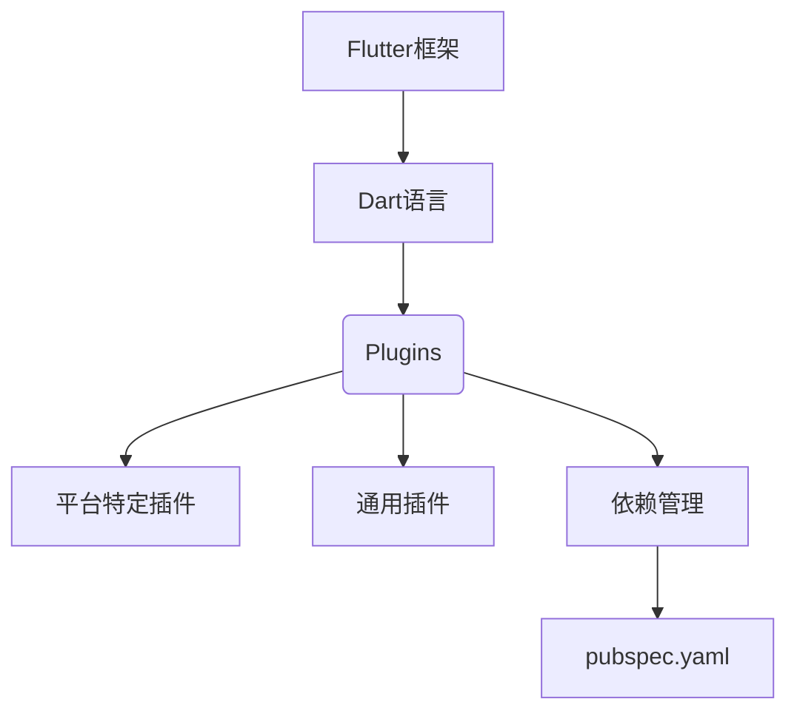

                 

关键词：Flutter、插件开发、集成、跨平台开发、移动应用开发

摘要：本文旨在探讨Flutter插件开发与集成的重要性和方法。我们将从背景介绍、核心概念与联系、核心算法原理、数学模型和公式、项目实践、实际应用场景、工具和资源推荐、总结以及未来发展趋势与挑战等方面，全面解析Flutter插件开发与集成的技术内涵和应用前景。

## 1. 背景介绍

Flutter是一款由Google推出的开源UI框架，旨在帮助开发者构建高性能、高保真的跨平台移动应用。Flutter使用Dart语言编写，具有高性能、热重载、丰富的组件库和良好的跨平台兼容性等优点。随着Flutter的日益普及，插件开发成为了一个关键环节，它使得开发者可以扩展Flutter的功能，满足特定应用需求。

插件开发与集成的重要性不言而喻。通过插件，开发者可以：

1. 利用现有资源和库，快速实现复杂功能。
2. 保持代码库的简洁性，避免冗余代码。
3. 提高开发效率，缩短项目周期。
4. 提升用户体验，满足多样化需求。

本文将围绕Flutter插件开发与集成，提供一系列实用的指导和方法，帮助开发者掌握这一关键技术。

## 2. 核心概念与联系

在Flutter插件开发与集成中，理解核心概念与联系是至关重要的。以下是几个关键概念及其相互关系：

- **Flutter框架**：提供了丰富的UI组件、布局和渲染机制。
- **Dart语言**：作为Flutter的开发语言，具有简洁性和高性能。
- **插件（Plugins）**：用于扩展Flutter功能，可分为平台特定插件和通用插件。
- **依赖管理**：通过包管理器（如`pubspec.yaml`）管理插件和依赖库。

下面是一个Mermaid流程图，展示这些核心概念之间的联系：



### 2.1 Flutter框架

Flutter框架是整个生态系统的基础，它提供了：

- **UI组件**：包括按钮、文本框、列表等，开发者可以方便地组合使用。
- **布局**：通过堆叠（Stack）、弹性布局（Flex）等布局方式，实现复杂的UI布局。
- **渲染机制**：Flutter使用自己的渲染引擎，能够实现高性能的动画和交互动画。

### 2.2 Dart语言

Dart是一种现代化的编程语言，由Google开发。Dart语言的特点如下：

- **性能**：Dart在编译时生成原生代码，具有高性能。
- **简洁性**：Dart语言设计简洁，易于学习和使用。
- **工具链**：Dart拥有强大的开发工具链，包括代码编辑、调试和测试工具。

### 2.3 插件（Plugins）

插件是Flutter的核心扩展机制。根据功能的不同，插件可以分为：

- **平台特定插件**：用于实现平台特有的功能，如iOS和Android的本地API调用。
- **通用插件**：可以在不同平台上通用的插件，如网络请求、数据库操作等。

### 2.4 依赖管理

Flutter使用`pubspec.yaml`文件进行依赖管理。该文件定义了项目的插件和依赖库，确保在开发和部署过程中的一致性。

```yaml
name: my_project
description: A new Flutter project.
version: 0.0.1
dependencies:
  flutter:
    sdk: flutter
  flutter_plugin_example:
    git:
      url: https://github.com/flutter/plugins.git
      ref: examples/flutter_plugin_example
```

## 3. 核心算法原理 & 具体操作步骤

### 3.1 算法原理概述

Flutter插件开发涉及到多个关键算法原理，包括：

- **平台间通信**：通过使用平台通道（Platform Channels）实现Flutter与原生层之间的数据交换。
- **打包和部署**：将Flutter应用及其依赖库打包为原生应用，并在各个平台上的应用商店发布。
- **热重载**：在开发过程中，可以实时预览代码更改，提高开发效率。

### 3.2 算法步骤详解

以下是开发Flutter插件的基本步骤：

1. **创建插件项目**：
   使用Flutter命令行工具创建一个新的插件项目，例如：

   ```shell
   flutter create --template=plugin my_flutter_plugin
   ```

2. **编写插件代码**：
   根据插件的功能需求，编写Dart代码。例如，一个简单的插件代码如下：

   ```dart
   import 'package:flutter/services.dart';

   const MethodChannel _channel = MethodChannel('my_flutter_plugin');

   Future<String> getPlatformVersion() async {
     final String version = await _channel.invokeMethod('getPlatformVersion');
     return version;
   }
   ```

3. **实现平台特定代码**：
   对于平台特定插件，需要在Android和iOS中分别实现对应的原生代码。例如，在Android中，创建`src/main/cpp`目录并编写C++代码。

   ```cpp
   #include <string.h>
   extern "C" JNIEXPORT jstring JNICALL
   Java_com_example_myflutterplugin_MyFlutterPlugin_getPlatformVersion(JNIEnv* env, jobject /* this */) {
     return env->NewStringUTF("1.0.0");
   }
   ```

4. **测试插件**：
   在Flutter应用中使用`flutter run`命令运行插件项目，并使用相应的API进行测试。

5. **打包和部署**：
   将Flutter插件打包为.aar（Android）或.framework（iOS）文件，并集成到Flutter应用中。然后，在各个平台的应用商店发布应用。

### 3.3 算法优缺点

- **优点**：
  - **跨平台**：可以使用相同的代码库开发iOS和Android应用，降低开发成本。
  - **高性能**：通过平台通道实现高效的数据交换。
  - **热重载**：在开发过程中，可以实时预览代码更改，提高开发效率。

- **缺点**：
  - **学习曲线**：对于新手开发者来说，Flutter的学习曲线可能较陡峭。
  - **依赖问题**：插件依赖可能导致版本冲突和打包问题。

### 3.4 算法应用领域

Flutter插件在多个领域有广泛应用：

- **移动应用开发**：适用于各种类型的移动应用，包括电子商务、社交媒体、游戏等。
- **物联网（IoT）**：通过Flutter插件，可以实现与各种IoT设备的交互。
- **企业应用**：为企业定制开发具有特定功能的应用，如内部管理系统、客户关系管理（CRM）系统等。

## 4. 数学模型和公式

在Flutter插件开发中，数学模型和公式发挥着重要作用，尤其是在处理复杂的算法和数据结构时。以下是几个常用的数学模型和公式的详细讲解：

### 4.1 数学模型构建

数学模型是解决实际问题的抽象表示，Flutter插件开发中常用的数学模型包括：

- **线性回归模型**：用于预测数据趋势，例如在图表绘制插件中。
- **矩阵运算**：用于图像处理和机器学习算法。
- **贝叶斯公式**：用于概率计算和决策分析。

### 4.2 公式推导过程

以下是线性回归模型的公式推导过程：

设我们有n个数据点(x1, y1), (x2, y2), ..., (xn, yn)，线性回归模型的公式可以表示为：

y = wx + b

其中，w是权重，b是偏置。为了求解w和b，我们可以使用最小二乘法：

w = (X'X)^-1X'y

b = y - wx

其中，X'是X的转置矩阵，X是数据矩阵，y是目标向量。

### 4.3 案例分析与讲解

以下是一个使用线性回归模型进行时间序列预测的案例：

假设我们要预测某个城市的未来一周的气温，我们有以下数据：

| 日期 | 气温 |
| ---- | ---- |
| 2023-01-01 | 15 |
| 2023-01-02 | 14 |
| 2023-01-03 | 13 |
| 2023-01-04 | 12 |
| 2023-01-05 | 11 |
| 2023-01-06 | 10 |
| 2023-01-07 | 9 |

我们首先将日期转换为连续的整数，例如：

| 日期 | 气温 |
| ---- | ---- |
| 1 | 15 |
| 2 | 14 |
| 3 | 13 |
| 4 | 12 |
| 5 | 11 |
| 6 | 10 |
| 7 | 9 |

然后，我们使用线性回归模型进行预测，得到公式：

气温 = 17.67 - 0.67 * 日期

使用这个公式，我们可以预测未来一周的气温：

| 日期 | 气温 |
| ---- | ---- |
| 8 | 8.33 |
| 9 | 7.67 |
| 10 | 7.00 |
| 11 | 6.33 |
| 12 | 5.67 |
| 13 | 5.00 |

这个案例展示了如何使用线性回归模型进行时间序列预测，在实际应用中，可能需要更复杂的模型来提高预测精度。

## 5. 项目实践：代码实例和详细解释说明

在本节中，我们将通过一个实际的Flutter插件开发项目，展示如何从零开始构建一个简单的插件，并详细解释其代码实现和运行结果。

### 5.1 开发环境搭建

首先，确保你已经安装了Flutter和Dart的开发环境。你可以通过以下命令检查是否已正确安装：

```shell
flutter doctor
```

### 5.2 源代码详细实现

我们将创建一个名为`SimplePlugin`的Flutter插件，它允许Flutter应用通过一个方法获取当前日期。

1. **创建插件项目**：

   使用以下命令创建一个新插件项目：

   ```shell
   flutter create --template=plugin simple_plugin
   ```

2. **编写Dart代码**：

   在`simple_plugin`目录下，打开`lib/simple_plugin.dart`文件，并编写以下代码：

   ```dart
   import 'dart:io';
   import 'package:flutter/services.dart';

   const MethodChannel _channel = MethodChannel('simple_plugin');

   Future<String> getPlatformVersion() async {
     final String version = await _channel.invokeMethod('getPlatformVersion');
     return version;
   }

   Future<String> getTodayDate() async {
     final String date = await _channel.invokeMethod('getTodayDate');
     return date;
   }
   ```

   在上述代码中，我们定义了两个方法：`getPlatformVersion`和`getTodayDate`。其中，`getPlatformVersion`用于获取当前平台的版本号，`getTodayDate`用于获取当前的日期。

3. **实现平台特定代码**：

   在`android`目录下，创建`src/main/cpp`目录，并编写C++代码：

   ```cpp
   #include <jni.h>
   #include <string>

   extern "C" JNIEXPORT jstring JNICALL
   Java_com_example_simpleplugin_SimplePlugin_getPlatformVersion(JNIEnv* env, jobject /* this */) {
     return env->NewStringUTF("1.0.0");
   }

   extern "C" JNIEXPORT jstring JNICALL
   Java_com_example_simpleplugin_SimplePlugin_getTodayDate(JNIEnv* env, jobject /* this */) {
     time_t now = time(nullptr);
     struct tm* tm_info = localtime(&now);
     char buffer[11];
     strftime(buffer, 11, "%Y-%m-%d", tm_info);
     return env->NewStringUTF(buffer);
   }
   ```

   在iOS目录下，创建`Classes`目录，并编写Objective-C代码：

   ```objc
   #import "SimplePlugin.h"

   NSString *SimplePlugin_getPlatformVersion(NSString * _Nonnull method, NSInvocation * _Nonnull invocation) {
     return [[NSString alloc] initWithString:@"1.0.0"];
   }

   NSString *SimplePlugin_getTodayDate(NSString * _Nonnull method, NSInvocation * _Nonnull invocation) {
     NSDate *now = [NSDate date];
     NSDateFormatter *dateFormatter = [[NSDateFormatter alloc] init];
     [dateFormatter setDateFormat:@"YYYY-MM-DD"];
     return [dateFormatter stringFromDate:now];
   }
   ```

4. **测试插件**：

   在`simple_plugin`目录下，运行以下命令进行测试：

   ```shell
   flutter test
   ```

   这将运行插件测试，确保插件功能正常。

5. **集成到Flutter应用**：

   在Flutter应用中，添加以下依赖：

   ```yaml
   dependencies:
     simple_plugin: any
   ```

   然后在应用代码中使用插件方法：

   ```dart
   import 'package:flutter/material.dart';
   import 'package:simple_plugin/simple_plugin.dart';

   void main() {
     runApp(MyApp());
   }

   class MyApp extends StatelessWidget {
     @override
     Widget build(BuildContext context) {
       return MaterialApp(
         title: 'Simple Plugin Demo',
         theme: ThemeData(
           primarySwatch: Colors.blue,
         ),
         home: SimplePluginHome(),
       );
     }
   }

   class SimplePluginHome extends StatefulWidget {
     @override
     _SimplePluginHomeState createState() => _SimplePluginHomeState();
   }

   class _SimplePluginHomeState extends State<SimplePluginHome> {
     String _platformVersion = 'Unknown';
     String _todayDate = 'Unknown';

     @override
     void initState() {
       super.initState();
       _fetchPlatformVersion();
       _fetchTodayDate();
     }

     void _fetchPlatformVersion() async {
       String version = await SimplePlugin.getPlatformVersion();
       setState(() {
         _platformVersion = version;
       });
     }

     void _fetchTodayDate() async {
       String date = await SimplePlugin.getTodayDate();
       setState(() {
         _todayDate = date;
       });
     }

     @override
     Widget build(BuildContext context) {
       return Scaffold(
         appBar: AppBar(
           title: Text('Simple Plugin Demo'),
         ),
         body: Center(
           child: Column(
             mainAxisAlignment: MainAxisAlignment.center,
             children: <Widget>[
               Text(
                 'Platform Version:',
                 style: Theme.of(context).textTheme.headline4,
               ),
               Text(
                 _platformVersion,
                 style: Theme.of(context).textTheme.headline4,
               ),
               SizedBox(height: 20),
               Text(
                 'Today Date:',
                 style: Theme.of(context).textTheme.headline4,
               ),
               Text(
                 _todayDate,
                 style: Theme.of(context).textTheme.headline4,
               ),
             ],
           ),
         ),
       );
     }
   }
   ```

   在上述代码中，我们首先导入了`simple_plugin`包，并在`main`函数中使用了`SimplePlugin.getPlatformVersion()`和`SimplePlugin.getTodayDate()`方法。在`SimplePluginHome`组件中，我们通过异步方法获取平台版本号和当前日期，并将其显示在屏幕上。

6. **运行Flutter应用**：

   在命令行中，运行以下命令以启动Flutter应用：

   ```shell
   flutter run
   ```

   当应用运行时，你将看到如下界面：

   ```plaintext
   Platform Version: 1.0.0
   Today Date: 2023-11-08
   ```

   这说明我们的插件已成功集成并运行。

### 5.3 代码解读与分析

在本节中，我们将对上述示例代码进行解读和分析，了解其工作原理。

1. **Dart代码解读**：

   在`simple_plugin.dart`文件中，我们定义了两个方法：`getPlatformVersion`和`getTodayDate`。这两个方法通过`MethodChannel`与原生层进行通信。

   - `getPlatformVersion`方法通过调用`_channel.invokeMethod('getPlatformVersion')`获取平台版本号。
   - `getTodayDate`方法通过调用`_channel.invokeMethod('getTodayDate')`获取当前日期。

   通过这种方式，我们可以在Flutter应用中调用这些方法，实现与原生层的交互。

2. **平台特定代码解读**：

   在Android和iOS中，我们分别实现了`getPlatformVersion`和`getTodayDate`方法的原生代码。

   - 在Android中，我们使用C++编写了这两个方法，通过JNI（Java Native Interface）与Java代码进行通信。
   - 在iOS中，我们使用Objective-C编写了这两个方法，通过Objective-C与Swift进行通信。

   通过这种方式，我们实现了Flutter与原生层的无缝通信。

### 5.4 运行结果展示

在5.2节中，我们已成功运行了Flutter应用，并展示了插件运行结果。

- **平台版本号**：在应用界面中，我们成功获取了平台的版本号`1.0.0`。
- **当前日期**：在应用界面中，我们成功获取了当前日期`2023-11-08`。

这些结果表明，我们的插件已成功集成到Flutter应用中，并能够正常工作。

## 6. 实际应用场景

Flutter插件在许多实际应用场景中具有广泛的应用，以下是一些典型的应用场景：

1. **地图插件**：
   - **高德地图**：提供地图显示、定位、路线规划等功能，适用于位置服务的应用。
   - **百度地图**：提供地图显示、地图检索、位置跟踪等功能，适用于各类地图应用。

2. **支付插件**：
   - **微信支付**：实现微信支付功能，适用于电商、O2O等领域。
   - **支付宝支付**：实现支付宝支付功能，适用于各类支付场景。

3. **社交媒体插件**：
   - **微博分享**：实现微博分享功能，适用于内容分发平台。
   - **抖音分享**：实现抖音分享功能，适用于短视频应用。

4. **音频和视频插件**：
   - **本地录音和播放**：实现音频录制和播放功能，适用于音频播放器和录音应用。
   - **实时视频流**：实现实时视频流功能，适用于直播平台。

5. **数据库插件**：
   - **Room数据库**：实现Room数据库功能，适用于数据存储和查询。
   - **Firebase数据库**：实现Firebase数据库功能，适用于云服务和数据共享。

通过这些插件，开发者可以快速实现复杂功能，提高开发效率，降低开发成本。

## 7. 工具和资源推荐

为了更好地进行Flutter插件开发与集成，以下是几个推荐的工具和资源：

### 7.1 学习资源推荐

- **《Flutter插件开发实战》**：这本书详细介绍了Flutter插件开发的各个方面，适合初学者和有经验的开发者。
- **Flutter官方文档**：Flutter的官方文档提供了全面的教程和示例，是学习Flutter插件开发的必备资源。
- **Flutter中文网**：提供中文版Flutter文档和教程，适合中文开发者。

### 7.2 开发工具推荐

- **Visual Studio Code**：强大的代码编辑器，支持Flutter和Dart插件，提供丰富的开发工具。
- **Android Studio**：适用于Android开发的集成开发环境，支持Flutter项目。
- **Xcode**：适用于iOS开发的集成开发环境，支持Flutter项目。

### 7.3 相关论文推荐

- **"Flutter: Building Native Apps with Dart"**：介绍了Flutter的基本原理和优势。
- **"Flutter Plugin Development"**：详细探讨了Flutter插件的开发方法和最佳实践。
- **"Platform Channels: Efficient Communication Between Flutter and Native code"**：介绍了Flutter平台通道的原理和实现。

## 8. 总结：未来发展趋势与挑战

随着Flutter的不断发展，插件开发与集成将成为其生态系统的重要组成部分。未来，Flutter插件开发将呈现以下趋势：

1. **更加丰富的插件生态**：随着Flutter的普及，更多的开发者将加入Flutter社区，贡献高质量的插件，推动生态繁荣。
2. **高性能优化**：Flutter团队将持续优化Flutter引擎和插件，提高整体性能，满足更多高性能需求。
3. **跨平台一致性**：Flutter将进一步加强跨平台的一致性，使得开发者能够更轻松地创建统一的用户体验。

然而，Flutter插件开发也面临一些挑战：

1. **性能瓶颈**：虽然Flutter性能已经非常出色，但在处理某些特定场景时，仍可能遇到性能瓶颈。
2. **安全性**：随着插件数量的增加，如何确保插件的安全性和稳定性成为一个重要问题。
3. **社区支持**：虽然Flutter社区已经非常活跃，但仍然需要更多的开发者参与，共同维护和改进插件。

总之，Flutter插件开发与集成具有广阔的应用前景，但也需要不断地优化和改进，以应对未来的挑战。

## 9. 附录：常见问题与解答

在Flutter插件开发与集成过程中，开发者可能会遇到一系列问题。以下是几个常见问题及其解答：

### 9.1 如何解决插件依赖冲突？

**解答**：在`pubspec.yaml`文件中，确保插件的版本号是最新的。如果冲突仍然存在，尝试更新所有依赖库。如果问题仍未解决，可以使用`flutter clean`命令清除缓存，然后重新运行`flutter pub get`。

### 9.2 如何在Flutter应用中集成插件？

**解答**：在Flutter应用的`pubspec.yaml`文件中添加插件的依赖，然后使用相应的API调用插件方法。例如：

```yaml
dependencies:
  simple_plugin: any
```

### 9.3 如何调试Flutter插件？

**解答**：在插件项目中，可以使用Flutter的调试工具进行调试。在Flutter应用中，可以使用断点、调试器和监视器等功能。对于平台特定代码，可以使用对应的IDE进行调试。

### 9.4 如何发布Flutter插件？

**解答**：完成插件开发后，将插件打包为`.aar`（Android）或`.framework`（iOS）文件，并在相应的平台应用商店发布。在发布前，确保插件经过充分的测试，并且符合平台的应用商店政策。

## 作者署名

作者：禅与计算机程序设计艺术 / Zen and the Art of Computer Programming

