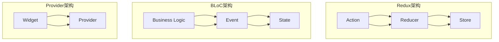

                 

关键词：Flutter，状态管理，Redux，BLoC，Provider，状态管理框架，应用开发

> 摘要：本文将深入探讨Flutter中常用的几种状态管理框架，包括Redux、BLoC和Provider，分析它们的核心概念、原理、优缺点以及适用场景，帮助开发者选择最适合自己的状态管理方案。

## 1. 背景介绍

随着移动应用的日益普及，Flutter作为一种高性能、易于开发的跨平台UI框架，受到了越来越多开发者的青睐。然而，在应用开发过程中，状态管理成为了一个不可忽视的重要问题。良好的状态管理能够提高代码的可读性、可维护性，以及减少组件之间的耦合度。Flutter社区提供了多种状态管理框架，本文将对比其中三种最受欢迎的框架：Redux、BLoC和Provider。

## 2. 核心概念与联系

### 2.1 核心概念

- **Redux**：基于Flux架构的思想，是一个用于管理应用程序状态的框架。它包括三个核心部分：actions、reducers和stores。

- **BLoC**：（Business Logic Component）是一个结构化的、可测试的状态管理框架，它将业务逻辑与UI组件解耦。

- **Provider**：Flutter官方推荐的状态管理库，通过一种非常简单的方式将状态提升到UI树，以便于访问。

### 2.2 架构与联系（Mermaid 流程图）



## 3. 核心算法原理 & 具体操作步骤

### 3.1 算法原理概述

- **Redux**：通过actions发送数据到reducers，reducers处理这些数据并更新store的状态。

- **BLoC**：通过events触发状态的变化，并将业务逻辑封装在单个组件中。

- **Provider**：通过继承`ChangeNotifier`类或使用`provider`包中的`Container`组件来提供和管理状态。

### 3.2 算法步骤详解

#### Redux

1. **创建action**：定义一个常量字符串作为type，以及一个可选的payload。
2. **创建reducer**：接收当前state和一个action，返回一个新的state。
3. **创建store**：通过` createStore`函数将action和reducer关联起来。

#### BLoC

1. **创建event**：定义一个类，其中包含多个常量字段。
2. **创建state**：定义一个类，用于表示当前状态。
3. **创建business logic**：定义一个类，包含处理event的逻辑，并更新state。

#### Provider

1. **创建model**：定义一个类，管理应用的状态。
2. **创建provider**：使用`ChangeNotifier`或`Container`包装model。
3. **使用provider**：在任何Widget中使用`Consumer`或`ConsumerWidget`访问状态。

### 3.3 算法优缺点

#### Redux

- 优点：强一致性和可预测性，易于测试。
- 缺点：配置和逻辑较为复杂，新手上手难度较高。

#### BLoC

- 优点：业务逻辑与UI解耦，代码更易于测试。
- 缺点：相对于Provider和Redux，学习曲线较陡。

#### Provider

- 优点：简单易用，官方推荐。
- 缺点：对于复杂应用，可能需要额外的包装和复杂度。

### 3.4 算法应用领域

- **Redux**：适用于大型、复杂的应用程序，需要严格的状态管理和一致性。
- **BLoC**：适用于需要高可测试性和业务逻辑与UI解耦的应用。
- **Provider**：适用于大多数Flutter应用程序，特别是初学者和中小型项目。

## 4. 数学模型和公式 & 详细讲解 & 举例说明

### 4.1 数学模型构建

在状态管理中，我们可以将状态视为一个数学模型，即一个映射关系：

$$
S = f(A, I)
$$

其中，$S$ 表示状态，$A$ 表示输入（例如用户操作），$I$ 表示初始状态，$f$ 表示状态转换函数。

### 4.2 公式推导过程

假设有一个简单的计数器应用，初始状态为0，每次点击按钮时状态增加1。可以定义状态转换函数为：

$$
S_{next} = S_{current} + 1
$$

当用户点击按钮时，输入$A$为1，初始状态$I$为0，则状态更新为：

$$
S_{next} = f(A, I) = f(1, 0) = 0 + 1 = 1
$$

### 4.3 案例分析与讲解

#### Redux

假设我们使用Redux实现上述计数器应用：

```dart
// Action
const String COUNTER_INCREMENT = 'COUNTER_INCREMENT';

class CounterIncrementAction {
  final int amount;
  const CounterIncrementAction(this.amount);
  static factory CounterIncrementAction.fromPayload(Map<String, dynamic> payload) {
    return CounterIncrementAction(payload['amount'] as int);
  }
}

// Reducer
CounterState reducer(CounterState state, dynamic action) {
  switch (action) {
    case CounterIncrementAction:
      return state + action.amount;
    default:
      return state;
  }
}

// Store
store = Store<CounterState>(
  reducer,
  state: 0,
);
```

#### BLoC

对于BLoC，我们可以定义如下：

```dart
// Event
abstract class CounterEvent extends Event {}

class CounterIncrementEvent extends CounterEvent {}

// State
abstract class CounterState extends Equatable {}

class CounterState implements CounterState {
  final int count;
  const CounterState(this.count);
  @override
  List<Object> get props => [count];
}

// Business Logic
class CounterBloc extends Bloc<CounterEvent, CounterState> {
  CounterBloc() : super(CounterState(0)) {
    on<CounterIncrementEvent>((event, emit) {
      emit(state + 1);
    });
  }
}
```

#### Provider

最后，对于Provider，我们有：

```dart
// Model
class CounterModel with ChangeNotifier {
  int _count = 0;

  int get count => _count;

  void increment() {
    _count++;
    notifyListeners();
  }
}

// Widget
class CounterWidget extends StatefulWidget {
  @override
  _CounterWidgetState createState() => _CounterWidgetState();
}

class _CounterWidgetState extends State<CounterWidget> {
  CounterModel _counterModel = CounterModel();

  @override
  Widget build(BuildContext context) {
    return Consumer<CounterModel>(
      builder: (context, counterModel, child) {
        return Column(
          children: [
            Text('${counterModel.count}'),
            ElevatedButton(
              onPressed: () {
                _counterModel.increment();
              },
              child: Text('Increment'),
            ),
          ],
        );
      },
    );
  }
}
```

## 5. 项目实践：代码实例和详细解释说明

### 5.1 开发环境搭建

确保您安装了Flutter环境，并创建了新的Flutter项目。

```shell
flutter create flutter_state_management_example
cd flutter_state_management_example
```

### 5.2 源代码详细实现

这里我们仅展示Redux的代码实现，以简化示例。

```dart
// counter_actions.dart
class CounterActions {
  static const COUNTER_INCREMENT = 'COUNTER_INCREMENT';

  static Action<CounterIncrementAction> counterIncrement() {
    return Action<CounterIncrementAction>(
      COUNTER_INCREMENT,
      payloadCreator: (dynamic payload) => CounterIncrementAction(payload as int),
    );
  }
}

// counter_reducer.dart
CounterState counterReducer(CounterState state, dynamic action) {
  switch (action.type) {
    case CounterActions.COUNTER_INCREMENT:
      final incrementAction = action.payload;
      return CounterState(state.count + incrementAction.amount);
    default:
      return state;
  }
}

// counter_store.dart
class CounterStore extends Store<CounterState> {
  CounterStore() : super(counterReducer, initialState: CounterState(0));

  StreamSubscription<CounterIncrementAction> _subscription;

  @override
  void listenToActions() {
    _subscription = dispatchStream.listen((action) {
      if (action is CounterIncrementAction) {
        emit(action);
      }
    });
  }
}

// main.dart
void main() {
  final store = CounterStore();
  store.listenToActions();

  runApp(MyApp());
}

class MyApp extends StatelessWidget {
  @override
  Widget build(BuildContext context) {
    return MaterialApp(
      title: 'Flutter Demo',
      theme: ThemeData(
        primarySwatch: Colors.blue,
      ),
      home: CounterPage(),
    );
  }
}

class CounterPage extends StatefulWidget {
  @override
  _CounterPageState createState() => _CounterPageState();
}

class _CounterPageState extends State<CounterPage> {
  @override
  Widget build(BuildContext context) {
    return Scaffold(
      appBar: AppBar(title: Text('Counter')),
      body: Center(
        child: StreamBuilder<CounterIncrementAction>(
          stream: context.read<CounterStore>().dispatchStream,
          builder: (context, snapshot) {
            return Text(
              'Counter: ${snapshot.data?.amount}',
              style: Theme.of(context).textTheme.headline4,
            );
          },
        ),
      ),
      floatingActionButton: FloatingActionButton(
        onPressed: () {
          context.read<CounterStore>().dispatch(CounterActions.counterIncrement(1));
        },
        tooltip: 'Increment',
        child: Icon(Icons.add),
      ),
    );
  }
}
```

### 5.3 代码解读与分析

- **counter_actions.dart**：定义了action的类型和创建方法。
- **counter_reducer.dart**：实现了reducers，用于处理action并更新状态。
- **counter_store.dart**：实现了store，用于关联action和reducers，并提供状态更新通知。
- **main.dart**：创建了store并监听action。
- **CounterPage**：一个简单的页面，显示计数器的当前值，并通过store来更新状态。

## 6. 实际应用场景

状态管理框架在实际应用中扮演着重要角色，以下是一些应用场景：

- **中小型应用**：适合使用Provider，其简单易用的特性可以快速开发。
- **大型应用**：适合使用Redux或BLoC，它们能够更好地处理复杂的状态逻辑。
- **多模块应用**：可以通过自定义provider或使用Redux的中间件来实现模块间状态共享。

## 7. 工具和资源推荐

### 7.1 学习资源推荐

- [Flutter官网](https://flutter.dev/)
- [Redux官方文档](https://redux.js.org/)
- [BLoC官方文档](https://bloclibrary.com/)
- [Provider官方文档](https://github.com/rxmailer/provider)

### 7.2 开发工具推荐

- Flutter插件和工具：[DartPad](https://dartpad.dartlang.org/)，[Visual Studio Code](https://code.visualstudio.com/)
- UI设计工具：[Figma](https://www.figma.com/)，[Sketch](https://www.sketch.com/)

### 7.3 相关论文推荐

- [Redux：思路和原理](https://redux.js.org/introduction)
- [BLoC：架构](https://bloclibrary.com/blocs-architecture/)
- [Flutter框架设计](https://flutter.dev/docs/development/data-and-backend/state-maintenance)

## 8. 总结：未来发展趋势与挑战

### 8.1 研究成果总结

随着Flutter的不断发展，状态管理框架也在不断进化。Redux、BLoC和Provider各自具有独特的优势和适用场景，为开发者提供了多样化的选择。

### 8.2 未来发展趋势

- **性能优化**：随着Flutter性能的不断提升，状态管理框架也将更加注重性能优化。
- **社区发展**：社区对状态管理框架的需求将推动更多的工具和资源的出现。
- **易用性提升**：更加简洁、易用的框架将继续受到开发者的欢迎。

### 8.3 面临的挑战

- **复杂性**：状态管理框架的复杂性和学习曲线仍然是开发者面临的主要挑战。
- **选择困难**：面对众多的状态管理方案，选择合适的框架仍然是一个难题。

### 8.4 研究展望

未来，状态管理框架将继续朝着更加模块化、灵活化和易用的方向发展。同时，社区的合作和贡献也将推动这一领域的不断创新和进步。

## 9. 附录：常见问题与解答

### 9.1 什么是Redux？

Redux是一种用于管理应用程序状态的框架，基于Flux架构思想，它通过actions、reducers和stores来实现状态的管理和更新。

### 9.2 BLoC与Redux的区别是什么？

BLoC是一种结构化的、可测试的状态管理框架，它将业务逻辑与UI组件解耦，而Redux则更加注重状态的一致性和可预测性。

### 9.3 Provider有哪些优点？

Provider是Flutter官方推荐的状态管理库，它的优点包括简单易用、易于集成和扩展。

---

本文由禅与计算机程序设计艺术 / Zen and the Art of Computer Programming撰写，旨在为Flutter开发者提供关于状态管理框架的全面了解和深入对比。希望本文能帮助您在选择合适的状态管理方案时提供有价值的参考。

