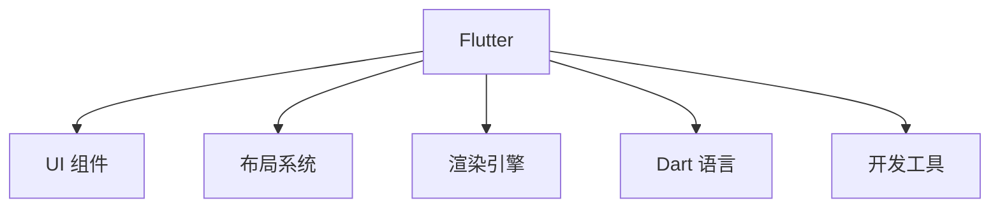

                 

关键词：Flutter、移动应用开发、UI框架、谷歌、跨平台、响应式设计、Dart语言

摘要：Flutter 是谷歌推出的一款开源移动 UI 框架，旨在帮助开发者快速构建漂亮的跨平台移动应用。本文将详细介绍 Flutter 的核心概念、原理、使用方法以及在实际项目中的应用，帮助读者深入理解并掌握 Flutter 的使用技巧。

## 1. 背景介绍

在移动应用开发领域，跨平台开发一直是一个热门话题。开发者希望能够使用一套代码库，同时支持 iOS 和 Android 两个平台，以提高开发效率和降低成本。Flutter 正是谷歌为了解决这一问题而推出的移动 UI 框架。

Flutter 的推出，标志着移动应用开发进入了一个新的时代。它使用 Dart 语言进行开发，提供了丰富的 UI 组件、响应式布局以及高性能的渲染引擎。Flutter 的出现，不仅改变了移动应用开发的现状，也为开发者带来了更多的可能性。

## 2. 核心概念与联系

### 2.1 Flutter 的核心概念

Flutter 的核心概念主要包括以下几个方面：

1. **UI 组件**：Flutter 提供了一套丰富的 UI 组件库，包括按钮、文本、图标、列表等，开发者可以通过这些组件快速构建应用界面。

2. **响应式布局**：Flutter 的布局系统基于声明式编程，支持响应式设计，可以自动适应不同屏幕尺寸和分辨率。

3. **Dart 语言**：Flutter 使用 Dart 语言进行开发，Dart 是一种现代化的编程语言，具有高性能、易学易用等优点。

4. **渲染引擎**：Flutter 使用自家的渲染引擎，可以提供高性能、流畅的 UI 渲染效果。

### 2.2 Flutter 的架构

下面是一个简单的 Flutter 架构 Mermaid 流程图：



在这个架构图中，Flutter 的核心组件包括 UI 组件、布局系统、渲染引擎和 Dart 语言。开发工具则是用于辅助开发的工具，如 IDE、代码编辑器等。

## 3. 核心算法原理 & 具体操作步骤

### 3.1 算法原理概述

Flutter 的核心算法原理主要包括以下几个方面：

1. **组件渲染**：Flutter 使用了类似于 Web 的渲染模型，将 UI 组件渲染为树形结构，并通过层叠渲染实现复杂的 UI 效果。

2. **响应式布局**：Flutter 的布局系统基于流式布局算法，可以自动适应不同的屏幕尺寸和分辨率。

3. **事件处理**：Flutter 使用事件流（Event Stream）来处理用户交互，包括触摸、滑动等事件。

### 3.2 算法步骤详解

1. **组件渲染**：

   Flutter 的组件渲染过程可以分为以下几个步骤：

   - **构建组件树**：根据 Dart 代码创建组件树，每个组件都有自己的状态和属性。
   - **层叠渲染**：将组件树转换为渲染树，并对其进行层叠渲染，实现最终的 UI 效果。
   - **绘制UI**：根据渲染树生成最终的 UI 界面。

2. **响应式布局**：

   Flutter 的响应式布局过程可以分为以下几个步骤：

   - **监听屏幕尺寸变化**：监听屏幕尺寸的变化，当屏幕尺寸发生变化时，触发布局更新。
   - **计算布局**：根据屏幕尺寸和组件属性，计算每个组件的布局位置和大小。
   - **更新UI**：根据计算结果，更新 UI 界面。

3. **事件处理**：

   Flutter 的事件处理过程可以分为以下几个步骤：

   - **监听事件**：监听用户交互事件，如触摸、滑动等。
   - **处理事件**：根据事件类型，处理相应的逻辑，如跳转页面、提交表单等。

### 3.3 算法优缺点

**优点**：

- **跨平台**：Flutter 可以在 iOS 和 Android 两个平台上使用同一套代码库，大大提高了开发效率。
- **高性能**：Flutter 使用自家的渲染引擎，可以实现高性能、流畅的 UI 渲染效果。
- **丰富的组件库**：Flutter 提供了一套丰富的 UI 组件库，可以帮助开发者快速构建应用界面。

**缺点**：

- **学习曲线较陡峭**：Flutter 使用的是 Dart 语言，对于一些开发者来说，可能需要花费一定的时间来学习和适应。
- **生态相对较弱**：相比于其他成熟的移动开发框架，Flutter 的生态相对较弱，一些第三方库和工具可能不够丰富。

### 3.4 算法应用领域

Flutter 主要适用于以下领域：

- **移动应用开发**：Flutter 可以用于开发 iOS 和 Android 两个平台的移动应用。
- **跨平台 Web 开发**：Flutter 也可以用于 Web 开发，实现跨平台的 Web 应用。
- **桌面应用开发**：Flutter 还可以用于桌面应用开发，实现跨平台的桌面应用。

## 4. 数学模型和公式 & 详细讲解 & 举例说明

### 4.1 数学模型构建

Flutter 的数学模型主要包括以下几个方面：

- **矩阵运算**：Flutter 使用矩阵运算来描述组件的变换，如平移、旋转、缩放等。
- **贝塞尔曲线**：Flutter 使用贝塞尔曲线来描述动画效果，如弹性、渐变等。

### 4.2 公式推导过程

- **矩阵变换公式**：

  $$ 
  \begin{bmatrix}
  x' \\
  y'
  \end{bmatrix} 
  =
  \begin{bmatrix}
  a & b \\
  c & d
  \end{bmatrix} 
  \begin{bmatrix}
  x \\
  y
  \end{bmatrix} 
  + 
  \begin{bmatrix}
  t_x \\
  t_y
  \end{bmatrix}
  $$

- **贝塞尔曲线公式**：

  $$ 
  P(t) = 
  (1-t)^3 P_0 + 3(1-t)^2 t P_1 + 3(1-t) t^2 P_2 + t^3 P_3
  $$

### 4.3 案例分析与讲解

- **案例 1：平移动画**

  在 Flutter 中，实现平移动画可以使用矩阵变换来实现。以下是一个简单的平移动画示例：

  ```dart
  Container(
    width: 100,
    height: 100,
    color: Colors.blue,
    transform: Matrix4.translationValues(dx, dy, 0),
  )
  ```

  在这个示例中，`dx` 和 `dy` 分别表示平移的水平距离和垂直距离。

- **案例 2：贝塞尔曲线动画**

  在 Flutter 中，实现贝塞尔曲线动画可以使用贝塞尔曲线公式来实现。以下是一个简单的贝塞尔曲线动画示例：

  ```dart
  Cubic(Bezier(
    controls: [
      Offset(0, 0),
      Offset(50, 100),
      Offset(100, 100),
      Offset(150, 0),
    ],
  ))
  ```

  在这个示例中，定义了一个控制点列表，通过控制点列表可以生成一个贝塞尔曲线，并应用到动画中。

## 5. 项目实践：代码实例和详细解释说明

### 5.1 开发环境搭建

要开始使用 Flutter 进行开发，首先需要搭建开发环境。以下是搭建 Flutter 开发环境的步骤：

1. 安装 Flutter SDK
2. 配置环境变量
3. 安装 Flutter 插件
4. 配置 IDE

### 5.2 源代码详细实现

以下是一个简单的 Flutter 应用示例，用于展示 Flutter 的基本用法：

```dart
import 'package:flutter/material.dart';

void main() {
  runApp(MyApp());
}

class MyApp extends StatelessWidget {
  @override
  Widget build(BuildContext context) {
    return MaterialApp(
      title: 'Flutter Demo',
      theme: ThemeData(
        primarySwatch: Colors.blue,
      ),
      home: MyHomePage(),
    );
  }
}

class MyHomePage extends StatefulWidget {
  @override
  _MyHomePageState createState() => _MyHomePageState();
}

class _MyHomePageState extends State<MyHomePage> {
  int _counter = 0;

  void _incrementCounter() {
    setState(() {
      _counter++;
    });
  }

  @override
  Widget build(BuildContext context) {
    return Scaffold(
      appBar: AppBar(
        title: Text('Flutter Demo'),
      ),
      body: Center(
        child: Column(
          mainAxisAlignment: MainAxisAlignment.center,
          children: <Widget>[
            Text(
              '您点击了 $_counter 次',
            ),
            ElevatedButton(
              onPressed: _incrementCounter,
              child: Text('点击'),
            ),
          ],
        ),
      ),
      floatingActionButton: FloatingActionButton(
        onPressed: _incrementCounter,
        tooltip: 'Increment',
        child: Icon(Icons.add),
      ),
    );
  }
}
```

### 5.3 代码解读与分析

在这个示例中，我们创建了一个简单的 Flutter 应用，包含一个文本显示和一个按钮。按钮点击时，文本显示的数字会增加。

- `MyApp` 类：定义了 Flutter 应用的主要结构，包括主题和主页面。
- `MyHomePage` 类：定义了主页面的组件和状态。
- `_incrementCounter` 方法：用于增加点击次数，并更新 UI。
- `Scaffold` 组件：提供了应用的布局结构，包括标题、按钮和浮动操作按钮。
- `ElevatedButton` 组件：用于显示一个带有阴影效果的按钮。
- `Text` 组件：用于显示文本。
- `Center` 组件：用于使组件居中显示。

### 5.4 运行结果展示

运行上述代码后，将显示一个简单的 Flutter 应用界面，包含一个文本显示和一个按钮。点击按钮时，文本显示的数字会增加。


## 6. 实际应用场景

Flutter 在实际应用中具有广泛的应用场景，以下是一些典型的应用场景：

1. **移动应用开发**：Flutter 可以用于开发 iOS 和 Android 两个平台的移动应用，如社交应用、电商应用、音乐应用等。
2. **跨平台 Web 开发**：Flutter 也可以用于 Web 开发，实现跨平台的 Web 应用，如企业内部系统、电商平台等。
3. **桌面应用开发**：Flutter 还可以用于桌面应用开发，实现跨平台的桌面应用，如游戏、办公软件等。

## 7. 工具和资源推荐

### 7.1 学习资源推荐

1. **官方文档**：Flutter 官方文档是学习 Flutter 的最佳资源，涵盖了从入门到进阶的各个方面。
2. **在线教程**：很多在线平台提供了 Flutter 教程，如 Udemy、Coursera 等。
3. **书籍**：一些优秀的书籍可以帮助你深入了解 Flutter，如《Flutter By Example》等。

### 7.2 开发工具推荐

1. **Flutter DevTools**：一款强大的调试工具，可以帮助开发者调试 Flutter 应用。
2. **Visual Studio Code**：一款功能强大的代码编辑器，支持 Flutter 开发。
3. **Android Studio**：一款专业的 Android 开发工具，也支持 Flutter 开发。

### 7.3 相关论文推荐

1. **"Flutter: Building Native Apps with Dart"**：这是一篇关于 Flutter 的技术论文，详细介绍了 Flutter 的设计理念和实现原理。
2. **"Flutter Architecture"**：这是一篇关于 Flutter 架构的论文，详细分析了 Flutter 的架构设计。

## 8. 总结：未来发展趋势与挑战

### 8.1 研究成果总结

Flutter 的推出，为移动应用开发带来了新的可能性。它凭借高性能、跨平台和丰富的组件库等特点，受到了广大开发者的欢迎。Flutter 的研究成果主要表现在以下几个方面：

- **提升开发效率**：Flutter 使得开发者可以同时开发 iOS 和 Android 两个平台的应用，大大提高了开发效率。
- **优化 UI 渲染**：Flutter 的渲染引擎提供了高性能、流畅的 UI 渲染效果，为用户提供了更好的体验。
- **丰富的组件库**：Flutter 提供了一套丰富的 UI 组件库，可以帮助开发者快速构建应用界面。

### 8.2 未来发展趋势

随着技术的不断进步，Flutter 在未来有望继续发展，主要体现在以下几个方面：

- **更好的性能优化**：Flutter 会在性能优化方面继续发力，进一步提高应用的性能和稳定性。
- **更丰富的生态**：Flutter 的生态会越来越丰富，包括第三方库、工具和插件等，为开发者提供更多的选择。
- **更广泛的应用场景**：Flutter 会在更多领域得到应用，如物联网、桌面应用等。

### 8.3 面临的挑战

尽管 Flutter 具有巨大的发展潜力，但仍然面临一些挑战：

- **学习曲线**：Flutter 使用的是 Dart 语言，对于一些开发者来说，可能需要花费一定的时间来学习和适应。
- **生态发展**：尽管 Flutter 的生态已经相对成熟，但相比于其他成熟的移动开发框架，Flutter 的生态仍有待进一步发展。
- **兼容性问题**：在跨平台开发过程中，Flutter 可能会面临一些兼容性问题，需要开发者进行一定的调整和优化。

### 8.4 研究展望

展望未来，Flutter 有望在以下几个方面取得突破：

- **性能优化**：通过引入更高效的数据结构和算法，进一步优化 Flutter 的性能。
- **生态建设**：通过引入更多的第三方库和工具，丰富 Flutter 的生态，为开发者提供更多的支持。
- **跨平台开发**：进一步探索 Flutter 在更多平台的应用，如 Web、桌面等，实现真正的跨平台开发。

## 9. 附录：常见问题与解答

### 9.1 什么是 Flutter？

Flutter 是一款由谷歌推出的开源移动 UI 框架，用于帮助开发者快速构建漂亮的跨平台移动应用。

### 9.2 Flutter 有什么优点？

Flutter 的优点主要包括：跨平台、高性能、丰富的组件库等。

### 9.3 Flutter 的学习难度如何？

Flutter 使用的是 Dart 语言，对于一些开发者来说，可能需要花费一定的时间来学习和适应。但总体来说，Flutter 的学习难度相对较低。

### 9.4 Flutter 是否适合初学者？

是的，Flutter 适合初学者。Flutter 的文档和社区资源丰富，可以帮助初学者快速入门。

### 9.5 Flutter 的生态如何？

尽管 Flutter 的生态已经相对成熟，但相比于其他成熟的移动开发框架，Flutter 的生态仍有待进一步发展。

### 9.6 Flutter 是否适合商业项目？

是的，Flutter 适合商业项目。Flutter 的跨平台特性、高性能和丰富的组件库等特点，可以大大提高项目的开发效率和质量。作者：禅与计算机程序设计艺术 / Zen and the Art of Computer Programming
----------------------------------------------------------------
以上是关于《Flutter：谷歌的移动 UI 框架》的完整技术博客文章。文章详细介绍了 Flutter 的核心概念、原理、使用方法以及在实际项目中的应用，帮助读者深入理解并掌握 Flutter 的使用技巧。希望这篇文章对您有所帮助！


